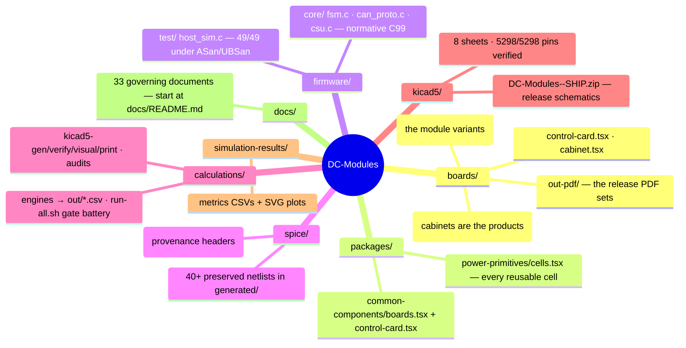
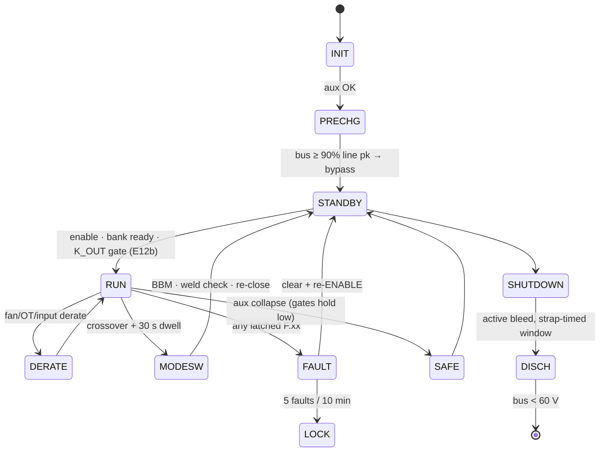

<p align="center">
  
</p>

<p align="center">
  
  
  
  
</p>
<p align="center">
  
  
  
  
  
  
</p>

# DC-Modules — 1000 VDC EV Fast-Charging Power Platform

A commercial family of **unidirectional 30–150 kW AC→DC charging products** engineered end-to-end in this repository: every number traces to a runnable calculation, every waveform claim to a preserved ngspice netlist, every component to a schematic reference, and every rupee to a generated BOM line.

**The product is one 30 kW module** — an AC-DC board (Vienna PFC) + a DC-DC board (3-φ LLC) in a two-board sandwich, controlled by **ONE control card — one brain per module** (GD32G553VET7, E40/R5-I; the merged role runs Vienna + LLC together, all nine PWMs on HRTIMER units). Two engine-selected variants extend it on the same boards and card: the **40 kW air** hot-rod (E41) and the **50 kW liquid** sealed module (E42). Higher ratings are **cabinets of those modules**: 60/80/100 kW = 2×, 120/150 kW = 3–4× + one **CSU** — the *same card* in a strap role, supervising the modules over CAN. One board set, one card p/n, one firmware image, family-wide.

> **What this repo is:** a complete, simulation-closed, tolerance-hardened electrical design + verified supervisory firmware + manufacturing documentation, with the release schematics in an audited KiCad-5 set.
> **Review status:** THREE adversarial audits plus TWO external PDF review rounds, each answered same-day with executed fixes and new permanent gates — see [The audit trail](#the-audit-trail).
> **What it is not (yet):** bench-validated or certified hardware — see [Honesty boundary](#honesty-boundary-50).

---

## Results at a glance

| Requirement (spec §2) | Target | Achieved (method) |
|---|---|---|
| Input | 3-φ 285–475 VAC | Full power 330–475 V, **86 % @285 V** constant-current derate — calculated trade, saves ~16 % on SiC/copper/EMI |
| Output | 150–1000 VDC CV/CC | Series/parallel banks, crossover **500/525 V** + 30 s dwell; PS-mode below 260 V bank; ZVS held at **every** simulated edge |
| Output current | 100 / 200 / 400 A | constant-current below the 300 V knee, constant-power above; 130 % for 2 ms before CC fold |
| THD | ≤5 % (stretch 3 %) | **0.59–1.05 %** full power, 2.55 % @25 % (line-cycle sim, THD-40) |
| Peak efficiency | ≥97 % | **97.32 / 97.13 / 96.94 / 97.01 %** full-power @nominal (30/40/50L/50A; peaks 98.43–**98.55 %**) — loss budget rev E44, EMI copper at the engine D6 values |
| Envelope | full power to +55 °C | 1008 grid points per module: **0 violations**, worst Tj 138 °C vs 150 ceiling |
| Accuracy | ±0.5 % V / ±1 % I | **±0.18 % / ±0.2 %** post-cal (10 k-sample Monte-Carlo, EOL 2-pt cal mandatory) |
| Protections | §24 catalogue | **32-row threshold table**, HW-fast + supervisory, all 26 fault scenarios executed green |

<p align="center"></p>

---

## Architecture

```mermaid
flowchart LR
  AC["3φ AC<br/>285–475 V"] --> P1["80 A gG fuses · MOV Δ<br/>2× 3-φ CM stages<br/>+ 22 µH DM stage (E22)"]
  P1 --> P2["Precharge<br/>2× 33 Ω + 2-pole bypass"]
  P2 --> PFC["Vienna lanes · 50 kHz<br/>750 V SiC pairs · 1200 V JBS<br/>RC + RCD clamp per node"]
  PFC --> BUS[("Split DC bus<br/>650–830 V · OVP 860 V")]
  BUS --> LLC["3-φ LLC · fr 140 kHz<br/>1200 V SiC half-bridges<br/>Cr 184 nF · Lr 7 µH · Lm 63 µH"]
  LLC --> XF["3 transformer sections<br/>3× PQ50/50 · 7:7:7<br/>dual TIW secondaries"]
  XF --> BK["Banks A + B<br/>SiC JBS bridges"]
  BK --> SP["S/P matrix<br/>pre-insertion relays (E12)<br/>K_OUT gate (E12b)"]
  SP --> OUT["150–1000 VDC<br/>100 A / module"]
  style PFC stroke:#f2b705,stroke-width:2.5px
  style LLC stroke:#f2b705,stroke-width:2.5px
  style SP stroke:#e3763c,stroke-width:2.5px
```



**Two-board sandwich (E17, harness rev E40):** AC-DC board below, DC-DC board above, face-to-face — TO-247 rows clamp to the two outer heatsink extrusions, magnetics live in the inter-board airflow tunnel. Power crosses on bolted **DCP/DCN/PE stud pillars**; control on a **40-way straight-through harness** carrying the PFC bundle (3× logic-level PWM, 12 senses, AVMID + Kelvin return, fans, precharge, `EN_PFC`/`GATE_EN_A`/`FLT`/`DRV_RDY`, V15/V24, five returns, shield). Loss of the harness ⇒ the AC-DC board's gates die by hardware pull-downs; the brain shuts its own side down.

**The control card (E35/E40):** ONE 120×80 mm card in the DC-DC board's 88-way slot runs the whole module — Vienna + LLC together on the same GD32G553VET7 (73/82 pins, 22 analog channels, all nine PWMs on HRTIMER units, one merged FLT). Identity is a single **RATING strap** (0 R = module controller · 3.32 k = cabinet CSU · open = fault), so **one card p/n and one firmware image serve every seat in the family** — 1/2/5 MCUs at 30/60/120 kW. See [`docs/control-card-scope.md`](docs/control-card-scope.md) and [`docs/firmware-guide.md`](docs/firmware-guide.md).

### Product structure — one module, two cooling lines (E39/E42)

Four module variants share one platform (E40/E41/E42/E44): the **30 kW**, the **40 kW air**
hot-rod, the sealed **50 kW LIQUID**, and the **50 kW AIR** twin — same boards, same single
card (RATING strap 0 Ω / 1 k / 10 k / 15 k), engine-selected part deltas. The air-50 parallels
the LLC pairs (per-package conduction quarters — worst corner 107 °C on plain 4-fan air, ZERO
envelope folds) and shares every electrical class with the liquid by construction. The 40 is the **air** sweet spot
(paralleled PFC pairs, 5-stack choke, 6×33 nF tanks, 125 A class, 3 fans); the 50 swaps both
extrusions for **liquid coldplates and deletes every fan** — zero new silicon (the coldplate is
what buys single LLC FETs at 167 A), revved tank/protection classes, full envelope grid-proven.

| Product | Composition | Output | Cooling | Cards | ₹ @10k | **₹/kW** |
|---|---|---|---|---|---|---|
| **30 kW** | 1 module | 150–1000 V · 100 A | air | 1 | 30,682 | 1,023 |
| **40 kW** (E41) | 1 module | 150–1000 V · 133 A | air | 1 | 35,292 | 882 |
| **50 kW** (E42) | 1 module | 150–1000 V · 167 A | **liquid** | 1 | 41,320 | **826** |
| **50 kW** (E44) | 1 module | 150–1000 V · 167 A | **air · 4 fans** | 1 | 40,972 | **819** — cheapest module |
| **60 kW** | 2 × 30 | · 200 A | air | 2 | 61,364 | 1,023 |
| **80 kW** | 2 × 40 | · 267 A | air | 2 | 70,584 | 882 |
| **100 kW** | 2 × 50 | · 333 A | liquid | 2 | 82,640 | **826** |
| **100 kW** | 2 × 50a | · 333 A | air | 2 | 81,944 | **819** |
| **120 kW** | 4 × 30 + CSU | · 400 A | air | 4 + 1 | 124,562 | 1,038 |
| **120 kW** | **3 × 40 + CSU** | · 400 A | air | 3 + 1 | **107,710** | **898** — cheapest 120 |
| **150 kW** | **3 × 50 + CSU** | · 500 A | liquid | 3 + 1 | **125,794** | **839** |
| **150 kW** | **3 × 50a + CSU** | · 500 A | air | 3 + 1 | **124,750** | **832** |

Full power from 300 V out / 330 VAC in on every variant; multi-module products share current by
commanded-CC over CAN with staggered starts and graceful module-dropout degrade. The liquid line
needs a charger-level cooling cart (coolant ≤60 °C in, 6 L/min per module — flow assurance is
the cart's job, the module's plate NTCs + OT ladder are its dry-run protection, E42 boundary).
The generated ladder lives in [`docs/bom-cost.md`](docs/bom-cost.md); N−1 note: a 4×30 cabinet
keeps 75 % on a module loss, 3×40 and 3×50 keep 67 % — pick the runner at the volume decision.

### Module variant specifications (rev E46 — every number engine-derived and gate-verified)

| Specification | **30 kW** | **40 kW** (E41) | **50 kW** (E42 · liquid) | **50 kW** (E44 · air) |
|---|---|---|---|---|
| Rated power · max output current | 30 kW · 100 A | 40 kW · 133 A | 50 kW · 167 A | 50 kW · 167 A |
| Input (all) | 3-φ 285–475 VAC | full power ≥330 VAC | 86 % CC derate @285 V | — common |
| Output (all) | 150–1000 VDC | S/P crossover 500/525 V + 30 s dwell | full power ≥300 V out | — common |
| Worst continuous line current | 55.9 A | 73.3 A | 91.6 A | 91.6 A |
| Efficiency — full power @400 VAC | 97.32 % | 97.13 % | 96.94 % | **97.01 %** |
| Efficiency — peak over envelope | 98.43 % | 98.47 % | 98.44 % | **98.55 %** |
| Total loss at rated | 827 W | 1,183 W | 1,580 W | 1,541 W |
| Cooling | forced air · 2 fans | forced air · 3 fans | **sealed liquid** · 2 coldplates · 0 fans (≤60 °C coolant · 6 L/min · ΔT ≈ 4 K) | forced air · **4 fans** (3 front + 1 rear; all tachs monitored) |
| Envelope proof (grid, 1008 pts each) | 0 fail · worst Tj 139 °C | 0 fail · worst Tj 147 °C | 0 fail · worst Tj 140 °C — full envelope, zero tank clamps | 0 fail · worst Tj **107 °C** — **zero folds anywhere** |
| Vienna PFC (3-φ · 50 kHz) | single 750 V SiC pair/position | **paralleled pairs** | paralleled pairs (same silicon as 40) | paralleled pairs |
| PFC choke D1 | 3× 0077908A7 · N=39 · 165 µH | 5× T79 26µ · N=23 · 113 µH | 5× T79 26µ · N=22 · 103 µH | same D1-50 part |
| LLC silicon | 6× single SG2M | 6× single | 6× single (the coldplate buys it) | **12× — paralleled pairs** (per-package conduction ÷4) |
| LLC tank (fr 140 kHz) | 4×46 nF + 4.0 µH bins | 6×33 nF + 3.5 µH bins | 8×27 nF + 3.0 µH bins · revved class (65 A pk / 95 A pk OC) | identical to E42 (by construction) |
| Transformer (per section) | 3× PQ50/50 | 2× E70/33/32 | 3× E70/33/32 (Bpk identical 108 mT) | 3× E70/33/32 |
| DM stage D6 + CX2 (E43 engine) | 2× T48 60µ N=7 · 4.7 µF | 2× T57 60µ N=8 · 4.7 µF | 3× T57 60µ N=8 · 4.7 µF | same D6-50 |
| Conducted-EMI worst DM margin | +4.9 dB (crest-biased) | +5.7 dB | +5.6 dB | +5.6 dB |
| Input protection (gG) | 80 A · 22×58 | 125 A · 22×58 | 160 A · NH00 | 160 A · NH00 |
| Precharge bypass class | 80 A (70 %) | 100 A (73 %) | 250 A (37 %) | 250 A (37 %) |
| Output relay K_OUT | 1× 200 A (50 %) | 1× 200 A (67 %) | **2× 200 A dual** (42 %/relay, series-mirror readback) | 2× 200 A dual |
| DC link · bank strings | 10 cans · 2/bank | 12 · 3 | 16 · 4 | 16 · 4 |
| Bus discharge to <60 V | 2.0 s (3.0 s F.21 window) | 2.4 s (4.0 s) | 3.2 s (5.0 s) | 3.2 s (5.0 s) |
| Control | 1 card · RATING 0R | 1 card · 1 k | 1 card · 10 k | 1 card · **15 k** — same p/n, same image (E24 rev G) |
| Boards (all) | AC-DC + DC-DC | both 440 × 500 mm | two-board sandwich | 40-way harness — common |
| **BOM @10k · ₹/kW** | **₹30,682 · 1,023/kW** | **₹35,292 · 882/kW** | **₹41,320 · 826/kW** | **₹40,972 · 819/kW — cheapest** |
| Builds products | 60 kW (2×) · 120 kW (4×+CSU) | 80 kW (2×) · **120 kW (3×+CSU — cheapest)** | 100 kW (2×) · 150 kW (3×+CSU) | 100 kW air · **150 kW air (832/kW)** |

The 120 kW *single-board* pair is retired by physics — a 4-lane machine is 2× over one card's PWM units, analog inputs and connector ways simultaneously, and its DC-DC board would be 872×1062 mm. The cabinet sheet ([`boards/cabinet.tsx`](boards/cabinet.tsx) → `kicad5/dc-modules-cabinet/`) is the 120 kW interconnect of record: AC distribution, DC parallel bus, CAN chain with both terminations and its isolated-domain SGND conductor, and the CSU carrier (15 V wide-range DIN supply + one 3.32 k strap). Full contract: [`boards/README-product-structure.md`](boards/README-product-structure.md).

---

## Repository map



---

## Deliverables

The **release face is the audited KiCad-5 set** (`kicad5/`), rendered to print-fidelity PDFs in [`boards/out-pdf/`](boards/out-pdf/):

| PDF set | Pages |
|---|---|
| `DC-Modules 30kW — Schematic Set` | AC-DC · DC-DC · Control Card |
| `DC-Modules 40kW — Schematic Set` (E41) | AC-DC · DC-DC · Control Card |
| `DC-Modules 50kW — Schematic Set` (E42 liquid) | AC-DC · DC-DC · Control Card |
| `DC-Modules 120kW — Cabinet Set` | Cabinet interconnect · + the 30 kW module sheets it instantiates |

Every sheet passes the same battery before it ships: pin-level verification (5298/5298 across all eight sheets), ink-collision audit, symbol-glyph review, and the semantic audits below. The EasyEDA payloads under `calculations/out/easyeda/` are **internal pipeline inputs only** — the EasyEDA face is frozen by directive; KiCad is the record.

---

## Quickstart

```bash
# prerequisites: node ≥20, ngspice ≥46 (brew install ngspice), cc (clang/gcc)
npm install
```

```bash
# reproduce EVERY calculation, simulation-derived table, BOM, audit gate and the firmware suite
sh calculations/run-all.sh
# → MODULE INTERCONNECT CLEAN · POLARITY CLEAN · ALL REVIEW CHECKS PASS
# → FIRMWARE LOGIC 45/45 OK · ALL CALCULATIONS REPRODUCED OK
```

```bash
# build any board netlist (E36: netlist mode — PCB layout is a later phase)
TSCI_NO_ROUTE=1 npx tsci build boards/30kw/acdc.tsx --ignore-placement-drc --ignore-routing-drc
```

```bash
# regenerate the release schematics + PDFs for one target (30kw | 40kw | control-card | cabinet)
node calculations/easyeda-pages.mjs 30kw && node calculations/easyeda-apply-gen.mjs 30kw
node calculations/kicad5-gen.mjs 30kw
node calculations/kicad5-verify.mjs 30kw && node calculations/kicad5-visual.mjs 30kw
node calculations/kicad5-print.mjs 30kw && node calculations/sheets-to-pdf.mjs
```

```bash
# firmware verification alone (26 scenarios + rating windows + CSU supervisor + codec + 100k fuzz)
sh firmware/run_tests.sh
```

---

## The audit trail

This platform was **designed by iteration against its own simulations and audits**. Every layer earned its keep by breaking something real:

| Found by | Defect | Fix (now frozen) |
|---|---|---|
| Double-pulse L1 | 33 nH assumed loop → 115 % V<sub>DS</sub> | ≤10 nH layout rule + **RCD clamp to rail** → 70 % (E5) |
| DPT energy feedback | measured k<sub>sw</sub> 2.2× datasheet → Tj 175 °C @100 kHz | **fsw 100→50 kHz** re-selection (E3) |
| Monte-Carlo §37 | 17.7 % of tanks miss peak gain | leakage-binned trim, Lm gap-ground, **hysteresis 500/525**, capability 1.39 (E7/E9) |
| S/P transient sim | 2 V bank mismatch → **205 A** through closing contact | 10 Ω **pre-insertion relays** + ΔV rule (E12) |
| C firmware port | model masked a blind K_OUT closure → guaranteed OVP | **E12b gate** before K_OUT closes |
| R1 adversarial audit | **15 critical blockers** | closed same day as rev C |
| R2 re-audit | **7 new criticals** (no 3.3 V source on a board, mis-scaled sensing, …) | closed same day as rev D; gate suite grew to 60+ asserts |
| R3 external PDF review | GD32 pin numbering from an STM32-derived map | pin allocation regenerated from the datasheet ([docs](docs/mcu-pin-allocation-gd32.md)) |
| E35 margin audit | trim inductor unbuildable as drawn (~43 W core loss); three drawings short of their own copper; fuse over-derated | magnetics rev B/C set, 80 A fuse, catalog CT/CMC adoption — all re-gated |
| E37 interconnect audit | RATING strap hardcoded (a 60 kW machine boots as 30 kW); connector bought as two unmateable headers; a dead Kelvin way | per-SKU straps, mating pair, runtime rating — 17-check cabinet-aware gate in run-all |
| E38 polarity audit | *(nothing — 259/259 polarized parts proven correct, gate keeps it so)* | +/anode = pin 1, netlist-to-glyph |
| E39 re-verification | cabinet bus wired to the wrong module studs; missing CAN SGND conductor; CSU supply specced 85–264 VAC on a 400 V L-L feed | OUTP/OUTN bus, SGND chain + single-point tie, WDR-class supply |
| **E40 single-brain migration** | two cards per module = a link protocol, 9 CAN nodes at 120 kW, and a way/pin budget spent twice | ONE card per module on the SAME VET6 + 88-way slot (generated merge, 73/82 pins); 40-way harness; RATING-only identity; family control = 1/2/5 MCUs; **−₹293/module measured** |
| **E41 stress validation** | the registered D1-40 choke was UNBUILDABLE (optimizer refuses 3-stack on sat/swing) and the 100 A fuse failed the E35 derate rule (72 < 73.3 A) | 5-stack D1-40 + 125 A class; **stress-audit.mjs joins run-all** — 34 device/magnetic acceptance checks across both variants |
| **E42 liquid closure** | at the revved 50 kW OC points BOTH CT burdens computed past the 3.3 V rail (line 3.67 V, tank 3.55 V — protection observability clipped at the ADC) | burdens re-scaled 27→21.5 Ω / 2.0→1.6 Ω-2 W at the R3-proven rail budget; **stress-audit grows the BRD + grid-shape check families** across all three variants |
| **R4 external review response** | three independent PDF reviews claimed ~40 reversed diodes, driver isolation faults, a connector mismatch and supply-pin violations | triaged claim-by-claim against netlists + glyph crops + vendor datasheets: the diode claims were ONE sheet-rendering defect (netlists correct all along — now semantically seated + generator-refused + data-locked); the REAL finds — fictional NSI6611/NCP1252 pin maps, floating driver bias COM, wrong-sign aux feedback, TPS54202 EN at 15 V, the AC-DC V3P3 island, V24 monitor clipping — all fixed and gated as **R4-1…R4-8**; hardware S/P exclusion added; full disposition in register **E45** |
| **R8 external review response** | reviewer closes the comparator swap, PV rework and CAN code — and corrects US: the 40/50 kW links have TWO parallel balance strings per half (94 k, not 188 k), so R7's dismissal of their 222 s was our own arithmetic error; their Lm catch also surfaced two wrong turns transcriptions on the panels (30 kW 9:9:9→**7:7:7**, 50 kW 9:9:9→**6:6:6**) | per-SKU balance-string discharge model (370/222/296 s, netlist-proven counts, retraction registered); Lm 63 µH on all three panels; PV LED feed 1 k/2010 (≥10 mA to the 13.5 V rail floor) and the gate-drive claim de-escalated to a 25 °C-endpoint model + EVT gate; gates R8-A..C |
| **R7 external review response** | reviewer closes R6 (and the CAN pin-map hold, with the definitive Rev 1.3 datasheet), then catches that phases B/C sat on OPPOSITE INPUTS of ONE comparator (my "CMP-capable pin" rule was instance-blind) and that the PV-bleeder proof used a TYPICAL current as worst case | **AIN9↔AIN11** swapped in the one generator (A/B/C → CMP7/CMP1/CMP2, all on IP inputs — verified against Fig 2-3); PV LEDs re-fed from V15 at the guaranteed 10 mA point behind QPVD + 6.8 M gate bleed (chord ≥5.8 V); NSI1042-**DSWR** closed; biased-L and Lm 63 µH on the sheet panels; "wait AND verify" label; gates R7-A..E |
| **R6 external review response** | reviewer confirms the R5 wave, then reads the sheets and the shutdown path deeper: the R5 watchdog merge was INVISIBLE on the drawing (pin-less net-net trace — netlist right, face wrong, the R4-1 class again); the aux controller's A-suffix **could not cold-start** (120 ms mandatory delay vs 1 V hysteresis = 28–60 ms of reservoir); active discharge is powered from the link it discharges (aux dies at 321 V); shunt sign reads negative when delivering | WDO net **renamed** onto NRST_CARD (one label, every pin); **NCP1252A→D** + 220 µF reservoir (3× the 67 µF budget); two-phase discharge timeline computed per-SKU + 62477-1 label + honest F.21 semantics; µs reverse-OC path designated (CMP→HRTIMER FLT, A6 pin constraint); shunt differential flipped (positive = delivering); magnetics construction printed in sheet NOTES; gates R6-A..H |
| **R5 external review response** | reviewer confirms all R4 majors closed, then finds the watchdog only INHIBITED (a hung MCU re-armed ~ms after WDO release), missing DESAT series Rs and local bypass, exclusion not covering pre-insertion, asymmetric pair gates, and an MCU order code that does not exist (VET6) | **WDO wire-ORed onto NRST** (hung brain restarts with enables low); 100 Ω DESAT R ×9; bypass at every flagged pin; **second 74HC02 stage** (KSER excluded vs KPRE too) + per-tick sim invariant; symmetric 2.2 Ω branches; value-carrying order codes (33R/160R/shunt-per-SKU); **VET7**; gates R5-A..K + verify-independent section J |
| **E43 full-family verification** | clean-room recompute of every board (118 checks) found the D6 DM choke had NO engine: the inherited "22 µH" cannot exist at the line crest on the drawn core (7–8 µH at 82 A pk vs the 15 µH LISN floor — at EVERY variant); also 50 kW pulse-resistor energies past the 25 W family point, trim-litz J over-line at 40/50, and the 27 nF caps' Vrms duty unstated | **dm-choke-design.mjs joins the engine set** (per-variant crest-biased floors, CX2 trio → 4.7 µF X1, LISN model rebuilt per-variant: +4.9/+5.7/+5.6 dB); 50 W pulse class at 50 kW; 2000×0.1 trim litz; O-8 Vrms lines on every tank cap; **stress-audit grows D6/CrV/D2c/Epulse/Xbleed families** |

Full provenance: [`docs/simulation-report.md`](docs/simulation-report.md) · every netlist in `spice/generated/` · every decision **E1–E49** in [`docs/assumptions.md`](docs/assumptions.md).

---

## Cost reality 💰

<p align="center"></p>

The BOM is **generated from the built schematics** — every line matched with manufacturer, second source, and 100/1k/5k/10k price breaks (10k is the planning basis, A7 rev B). @10k: **₹30,079 / ₹60,158 / ≈₹122.0k** vs red-lines 25/42/78k — honestly over, with the remaining levers quantified in [`docs/bom-cost.md`](docs/bom-cost.md) (winder RFQ, relay frame, fuse→MCB) and the architecture-level options (LV/HV variants, 750 V secondaries) recorded as decisions-not-taken. Deep dive: [`docs/bom-guide.md`](docs/bom-guide.md).

---

## Supervisory firmware 🧠

Portable **C99**, zero HAL dependency (`firmware/core/`): the module FSM + protection evaluator + CAN 2.0B codec, plus the **CSU cabinet supervisor** (`csu.c`) — equal-share commanded-CC, staggered starts, graceful module-dropout degrade, ESTOP latch. One image serves every role: the card reads its RATING strap at boot (`pmp_fsm_set_rating_kw()` / CSU band, E24 rev C). 45/45 checks under ASan/UBSan: 26 fault scenarios, rating windows, 10 CSU scenarios, codec guards, 100k-frame fuzz.



Guide: [`docs/firmware-guide.md`](docs/firmware-guide.md) · protocol: [`docs/can-protocol.md`](docs/can-protocol.md) · thresholds: [`docs/protection-thresholds.md`](docs/protection-thresholds.md).

---

## Documentation index 📚

Everything lives in [`docs/`](docs/README.md). Highlights:

| Read this… | …to understand |
|---|---|
| [`architecture.md`](docs/architecture.md) | the frozen platform, power path, control plane, scaling |
| [`assumptions.md`](docs/assumptions.md) | **every decision E1–E42** with provenance and its invalidator |
| [`boards/README-product-structure.md`](boards/README-product-structure.md) | module vs cabinet, the 60/120 kW contract, the CSU, the cabinet adder |
| [`control-card-scope.md`](docs/control-card-scope.md) | why one card caps at 60 kW DC-DC — the arithmetic that retired 120 kW single-board |
| [`schematic-drawing-set.md`](docs/schematic-drawing-set.md) | the release schematics and the audits that gate them |
| [`magnetics.md`](docs/magnetics.md) | manufacturing drawings D1–D7 (rev B/C set) with acceptance limits |
| [`interconnect.md`](docs/interconnect.md) | sandwich, stud pillars, 40-way harness, the 88-way card slot, cabinet audit |
| [`simulation-report.md`](docs/simulation-report.md) | all executed runs in §50 format |
| [`thermal-report.md`](docs/thermal-report.md) | loss budgets, sandwich cooling, derating curves |
| [`pcb-floorplan.md`](docs/pcb-floorplan.md) | the zone plan the layout phase will inherit |
| [`evt-plan.md`](docs/evt-plan.md) | the bench campaign this repo is ready for (T-01…T-25) |
| [`verification-matrix.md`](docs/verification-matrix.md) | requirement → evidence, risk register |
| [`dfm-production.md`](docs/dfm-production.md) | assembly sequence, torque table, EOL test flow |

---

## Honesty boundary (§50)

This project runs under a strict **no-fake-verification rule**: nothing is called *verified* without an executed artifact in this repo, and the words *bench-validated*, *certified* or *production-released* appear nowhere as claims. Concretely, the following are **specified and packaged but not executed**, because they physically require hardware, labs, or third parties:

- 🔧 **PCB layout/placement/routing** — parked by directive (E36); schematics carry the layout rules ready for that phase, and the †-marked land patterns in [`docs/magnetics.md`](docs/magnetics.md) queue for it.
- 🧪 **EVT bench campaign T-01…T-25** — DPT bench, thermal/EMI chambers, protection injection, relay qualification, cabinet-level CAN/stagger tests.
- 📜 **Compliance certification** — design-for-compliance checklist exists; certification is a lab + body activity.
- 🤝 **Vendor RFQ pricing** — BOM prices are RFQ-target assumptions ±25 % until quotes land (film-cap V<sub>rms</sub> curve, relay mirror variant, MOV part, winder quotes).
- 🖥️ **MCU HAL bring-up** — the C99 logic is host-proven; binding to real peripherals happens on silicon.

## Roadmap

- [x] Design basis → frozen decision register **E1–E42**
- [x] Simulation matrix closed (grid · Monte-Carlo · scenarios · aux · EMI estimate)
- [x] Release schematics: 8 audited sheets, 5298/5298 pins, four PDF sets (30 kW · 40 kW · 50 kW liquid · 120 kW Cabinet)
- [x] Product structure closed: 30 kW module · 60 = 2× · 120 = 4× + CSU — **one brain per module (E40), 1/2/5 MCUs family-wide**
- [x] Three adversarial audits + external review answered with executed fixes and permanent gates
- [ ] RFQ round 1 (SiC + magnetics + relays) → cost closure
- [ ] PCB layout under the sandwich mechanical envelope
- [ ] Prototype build → EVT T-01…T-25 → model recalibration
- [ ] Compliance lab campaign → certification

---

<p align="center"><sub>© Vectivolt · All rights reserved · Engineering rule of the house: <b>if it wasn't executed, it isn't claimed.</b></sub></p>
