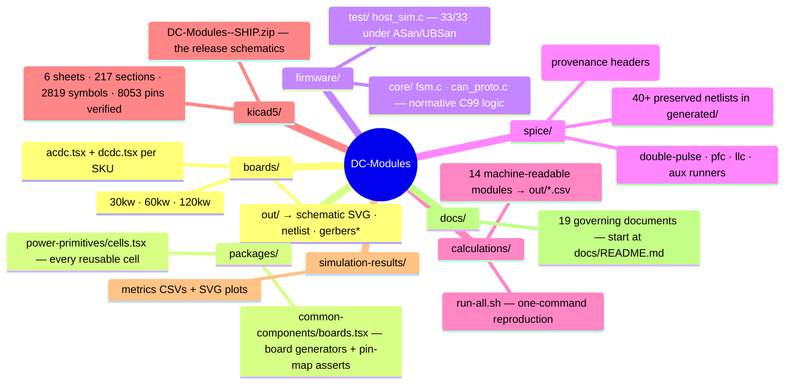
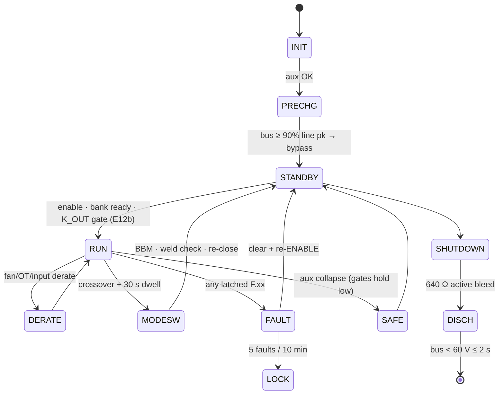

<p align="center">
  
</p>

<p align="center">
  
  
  
  
</p>
<p align="center">
  
  
  
  
  
  
</p>

# DC-Modules — 1000 VDC EV Fast-Charging Power Platform

A commercial family of **unidirectional 30 / 60 / 120 kW AC→DC charging modules** engineered end-to-end in this repository: every number traces to a runnable calculation, every waveform claim to a preserved ngspice netlist, every component to a schematic reference, and every rupee to a generated BOM line. One repeatable **~10 kW cell pair** (a Vienna PFC phase + an LLC transformer section) scales 3× / 6× / 12× across the family — same SiC, same magnetics part numbers, same firmware — packaged as a **two-board sandwich** (AC-DC below, DC-DC above) per module.

> **What this repo is:** a complete, simulation-closed, tolerance-hardened electrical design + verified supervisory firmware + manufacturing documentation.
> **Review status:** TWO adversarial production-readiness audits, plus an external PDF review. R1 ([docs/design-review-production.md](docs/design-review-production.md)) returned **NO — 15 critical blockers** → closed same day as **rev C**. R2 ([docs/design-review-production-r2.md](docs/design-review-production-r2.md)) re-audited rev C and returned **NO again — 7 new criticals** (resonant sensing mis-scale, a board with no 3.3 V source, 100 V aux rectifiers at 160–200 V PIV, 60 W aux vs the 120 kW load, an unread LLC fault net, drawn-vs-frozen tank drift) → every finding falsification-checked, then closed same day as **rev D** (cells v4, boards v4, parts-db rev D, F.21 implemented in firmware, aux rev C re-simulated 9/9 at per-SKU loads, per-SKU protection decks, six boards rebuilt clean, gate extended to 60+ asserts incl. class checks). **Rev D.1**: 10k-volume basis (A7 rev B), ECO-2a/2b executed, E23 retired. **R3** ([docs/review-response-r3.md](docs/review-response-r3.md)) — an external reviewer audited the exported PDFs and returned **do not manufacture**, principally on component pin numbering; every finding was re-checked against the built netlist and the manufacturer datasheets, and the GD32G553 pin allocation that the STM32-derived symbolic map had got wrong was replaced ([docs/mcu-pin-allocation-gd32.md](docs/mcu-pin-allocation-gd32.md)). Open by nature: the §K datasheet gate and bench EVT (T-01…T-25).
> **What it is not (yet):** bench-validated or certified hardware — see [Honesty boundary](#honesty-boundary-50).

---

## Results at a glance

| Requirement (spec §2) | Target | Achieved (method) |
|---|---|---|
| Input | 3-φ 285–475 VAC | Full power 330–475 V, **86 % @285 V** constant-current derate — calculated trade, saves ~16 % on SiC/copper/EMI |
| Output | 150–1000 VDC CV/CC | Series/parallel banks, crossover **500/525 V** + 30 s dwell; PS-mode below 260 V bank; ZVS held at **every** simulated edge |
| THD | ≤5 % (stretch 3 %) | **0.59–1.05 %** full power, 2.55 % @25 % (line-cycle sim, THD-40) |
| Peak efficiency | ≥97 % | **97.26–97.29 %** @nominal (loss-budget rev D — EMI-filter copper now honestly budgeted; pre-R2 97.4–97.5 % omitted it) |
| Envelope | full power to +55 °C | 3 SKUs × 1008 grid points: **0 violations**, worst Tj 139 °C vs 150 ceiling |
| Accuracy | ±0.5 % V / ±1 % I | **±0.18 % / ±0.2 %** post-cal (10 k-sample Monte-Carlo, EOL 2-pt cal mandatory) |
| Protections | §24 catalogue | **32-row threshold table**, HW-fast + supervisory, all 26 fault scenarios executed green |

<p align="center"></p>

---

## Architecture

```mermaid
flowchart LR
  AC["3φ AC<br/>285–475 V"] --> P1["Fuses · MOV Δ<br/>2× 3-φ CM stages<br/>+ 22 µH DM stage (E22)"]
  P1 --> P2["Precharge<br/>2× 33 Ω + 2-pole bypass"]
  P2 --> PFC["N× Vienna lanes · 50 kHz<br/>750 V SiC pairs · 1200 V JBS<br/>RC + RCD clamp per node"]
  PFC --> BUS[("Split DC bus<br/>650–830 V · OVP 860 V<br/>2×(5…18)× 470 µF")]
  BUS --> LLC["N× 3-φ LLC · fr 140 kHz<br/>1200 V SiC half-bridges<br/>Cr 185 nF · Lr 7 µH · Lm 63 µH"]
  LLC --> XF["N×3 transformer sections<br/>3× PQ50/50 · 7:7:7<br/>dual TIW secondaries"]
  XF --> BK["Banks A + B<br/>SiC JBS bridges"]
  BK --> SP["S/P matrix<br/>pre-insertion relays (E12)<br/>K_OUT gate (E12b)"]
  SP --> OUT["150–1000 VDC<br/>100 / 200 / 400 A"]
  style PFC stroke:#f2b705,stroke-width:2.5px
  style LLC stroke:#f2b705,stroke-width:2.5px
  style SP stroke:#e3763c,stroke-width:2.5px
```



**Two-board sandwich (E17):** each module = **AC-DC board** (input, EMI, precharge, Vienna lanes, DC link, MCU-PFC, aux flyback) + **DC-DC board** (LLC legs, tanks, transformers, rectifier banks, S/P matrix, output, MCU-LLC, isolated CAN, config HMI), mounted face-to-face — TO-247 rows clamp to the two *outer* heatsink extrusions, magnetics live in the inter-board airflow tunnel. Power crosses on bolted **DCP/DCN/PE stud pillars**; signals on a 16-way harness carrying the CRC-protected UART link, `GATE_EN`, and a hardware `PWM_KILL` line. Loss of the harness ⇒ both boards reach safe state independently. Full spec: [`docs/interconnect.md`](docs/interconnect.md).

### Family scaling — one cell, three products

| | **30 kW** | **60 kW** | **120 kW** |
|---|---|---|---|
| Vienna lanes (interleave) | 1 | 2 @ 0/180° | 4 @ 0/90/180/270° |
| LLC channels · transformer sections | 1 · 3 | 2 · 6 | 4 · 12 |
| Output current | 100 A | 200 A | 400 A (2× 200 A relays) |
| Board pair (mm) | 420×300 + 460×320 | 460×420 + 520×420 | 560×600 + 640×620 |
| MCUs | 2 | 2 | 2 (HRTIM exactly full: 12+12 PWM) |
| Effective ripple @EMI filter | 50 kHz | 100 kHz | 200 kHz |
| COGS (BOM-exact, **rev D.1**) @1k / **@10k basis** | ₹37,034 / **₹29,957** | ₹62,884 / **₹50,780** | ₹117,216 / **₹94,614** |

---

## Repository map



---

## Quickstart

```bash
# prerequisites: node ≥20, ngspice ≥46 (brew install ngspice), cc (clang/gcc)
npm install
```

```bash
# reproduce EVERY calculation, simulation-derived table, BOM and the firmware test suite
sh calculations/run-all.sh
# → ...
# → FIRMWARE LOGIC 33/33 OK
# → ALL CALCULATIONS REPRODUCED OK
```

```bash
# build any board (netlist ERC + circuit JSON; placement DRC intentionally unfitted — layout phase pending)
npx tsci build boards/30kw/acdc.tsx
```

```bash
# export deliverables for a board
npx tsci export boards/30kw/dcdc.tsx -f schematic-svg -o out/dcdc-schematic.svg
```

```bash
# run the SPICE suites individually (each persists netlists + metrics CSVs)
node spice/double-pulse/dpt-run.mjs && node spice/pfc/pfc-phase-run.mjs && node spice/llc/llc-run.mjs
```

```bash
# firmware verification alone (26 scenarios + CAN codec + 100k-frame fuzz, sanitizers on)
sh firmware/run_tests.sh
```

---

## The engineering story — what verification actually caught 🐛

This platform was **designed by iteration against its own simulations**. Every layer of the pyramid earned its keep by breaking something real:

| Found by | Defect | Fix (now frozen) |
|---|---|---|
| Double-pulse L1 | 33 nH assumed loop → 115 % V<sub>DS</sub>; snubber alone would burn 85 W | ≤10 nH layout rule + **RCD clamp to rail** → 70 % (E5) |
| DPT energy feedback | measured k<sub>sw</sub> 2.2× the datasheet guess → Tj 175 °C @100 kHz | **fsw 100→50 kHz** re-selection (E3) |
| Magnetics search | 55 A rms copper cannot fit a 47 mm toroid window | OD79 26µ 3-stack, swing-aware ripple criterion (choke D1) |
| LLC window calc | PFM can't reach 150 V bank (gain 0.46 needed) | **hybrid phase-shift mode** below 260 V bank (E10) |
| S/P transient sim | 2 V bank mismatch → **205 A** through closing contact | 10 Ω **pre-insertion relays** + ΔV<0.5 V make rule (E12) |
| Monte-Carlo §37 | 17.7 % of tanks miss peak gain; frozen 550 V hysteresis top physically unreachable | leakage-binned trim, Lm gap-ground ±7 %, **hysteresis 500/525**, capability 1.39 (E7/E9 rev D2) |
| LISN estimate | 30 kW 3rd harmonic lands −24.8 dB at 150 kHz band edge | third **22 µH DM stage**, family-wide → +7.8 dB (E22) |
| Aux flyback sim | no CS clamp → CCM staircase to 6.7 A at 425 V start | cycle-by-cycle 0.85 A clamp, exactly as the real IC (D4) |
| FSM scenario suite | F.16 short criterion unreachable with a healthy CC loop | criterion rev B: V<50 V & I>90 % sustained |
| **C firmware port** | model masked a blind K_OUT closure → guaranteed OVP after mode change | **E12b gate**: stack must match v<sub>ext</sub>-or-v<sub>cmd</sub> before K_OUT closes |

Full provenance: [`docs/simulation-report.md`](docs/simulation-report.md) · every netlist in [`spice/generated/`](spice/generated/) · decisions in [`docs/assumptions.md`](docs/assumptions.md).

---

## Cost reality 💰

<p align="center"></p>

The BOM is **generated from the built schematics** — 76 matched lines per SKU with manufacturer, second source, and 100/1 k/5 k price breaks. Current @1k totals sit **over red-line** (₹+6.9k / +13.3k / +26.6k); the executed internal levers (custom gate-bias transformer E23, CT sensing E18) are already inside these numbers, and the remaining levers are quantified external RFQs. Stretch targets are flagged unreachable in this architecture — an honest standing management flag, not a footnote. Deep dive: [`docs/bom-guide.md`](docs/bom-guide.md) · roll-up: [`docs/bom-cost.md`](docs/bom-cost.md).

---

## Supervisory firmware 🧠

The production FSM + protection evaluator + CAN 2.0B codec live in portable **C99** (`firmware/core/`) with zero HAL dependency — the same logic verified twice (JS model ↔ C implementation) against 26 fault scenarios, plus codec guards and a 100 000-frame fuzz, sanitizer-clean.



Guide: [`docs/firmware-guide.md`](docs/firmware-guide.md) · protocol: [`docs/can-protocol.md`](docs/can-protocol.md) · thresholds: [`docs/protection-thresholds.md`](docs/protection-thresholds.md).

---

## Documentation index 📚

Everything lives in [`docs/`](docs/README.md) — the index there describes all thirty documents. Highlights:

| Read this… | …to understand |
|---|---|
| [`architecture.md`](docs/architecture.md) | the frozen platform, power path, control plane, scaling |
| [`schematic-drawing-set.md`](docs/schematic-drawing-set.md) | **the release schematics** — what to import, how every sheet is labelled, the audits that gate it |
| [`assumptions.md`](docs/assumptions.md) | **every decision E1–E34** with provenance and its invalidator |
| [`boards/*/README.md`](boards/) | each board, cell by cell, pin by pin |
| [`simulation-report.md`](docs/simulation-report.md) | all executed runs in §50 format (solver, netlist, tolerances, pass/fail) |
| [`magnetics.md`](docs/magnetics.md) | manufacturing drawings D1–D5 with acceptance limits |
| [`interconnect.md`](docs/interconnect.md) | the sandwich, stud pillars, 16-way harness, HMI spec |
| [`thermal-report.md`](docs/thermal-report.md) | loss budgets, sandwich cooling, derating curves |
| [`insulation-coordination.md`](docs/insulation-coordination.md) | creepage/clearance design values + standards checklist |
| [`evt-plan.md`](docs/evt-plan.md) | the 10-test bench campaign this repo is ready for |
| [`verification-matrix.md`](docs/verification-matrix.md) | requirement → evidence, risk register |
| [`dfm-production.md`](docs/dfm-production.md) | assembly sequence, torque table, EOL test flow |

---

## Honesty boundary (§50)

This project runs under a strict **no-fake-verification rule**: nothing is called *verified* without an executed artifact in this repo, and the words *bench-validated*, *certified* or *production-released* appear nowhere as claims. Concretely, the following are **specified and packaged but not executed**, because they physically require hardware, labs, or third parties:

- 🔧 **PCB layout/placement/routing** — deliberately parked by project directive; schematics carry the layout rules (§31/§32 zones, loop budgets, creepage classes) ready for the layout phase.
- 🧪 **EVT bench campaign T-01…T-10** — DPT bench, thermal/EMI chambers, protection injection, relay qualification ([plan](docs/evt-plan.md)).
- 📜 **Compliance certification** — design-for-compliance checklist exists; certification is a lab + body activity.
- 🤝 **Vendor RFQ pricing** — BOM prices are RFQ-target assumptions ±25 % until quotes land.

## Roadmap

- [x] Design basis → frozen decision register E1–E34
- [x] Simulation matrix closed (grid · Monte-Carlo · scenarios · aux · EMI estimate)
- [x] Six schematics ERC-clean · BOM generated · firmware logic verified
- [ ] RFQ round 1 (5 SiC vendors + magnetics + relays) → cost closure
- [ ] PCB layout under the sandwich mechanical envelope
- [ ] Prototype build → EVT T-01…T-10 → model recalibration
- [ ] Compliance lab campaign → certification

---

<p align="center"><sub>© Vectivolt · All rights reserved · Engineering rule of the house: <b>if it wasn't executed, it isn't claimed.</b></sub></p>
