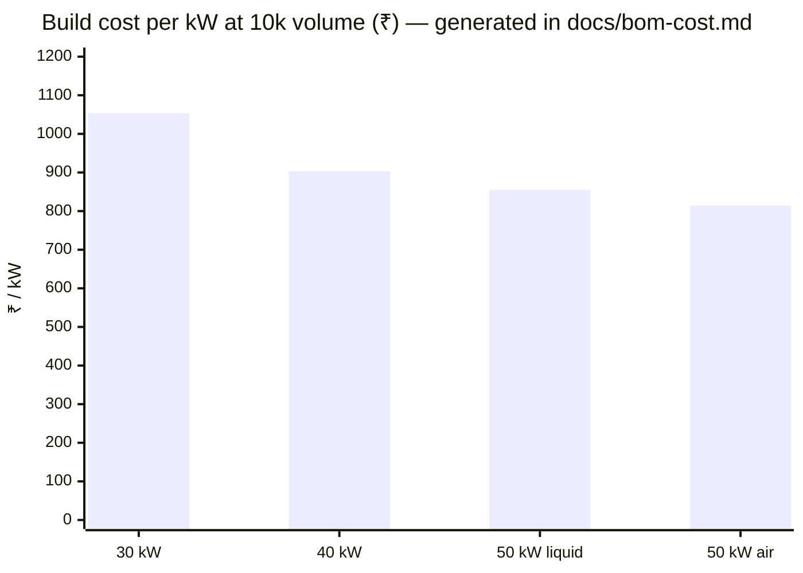
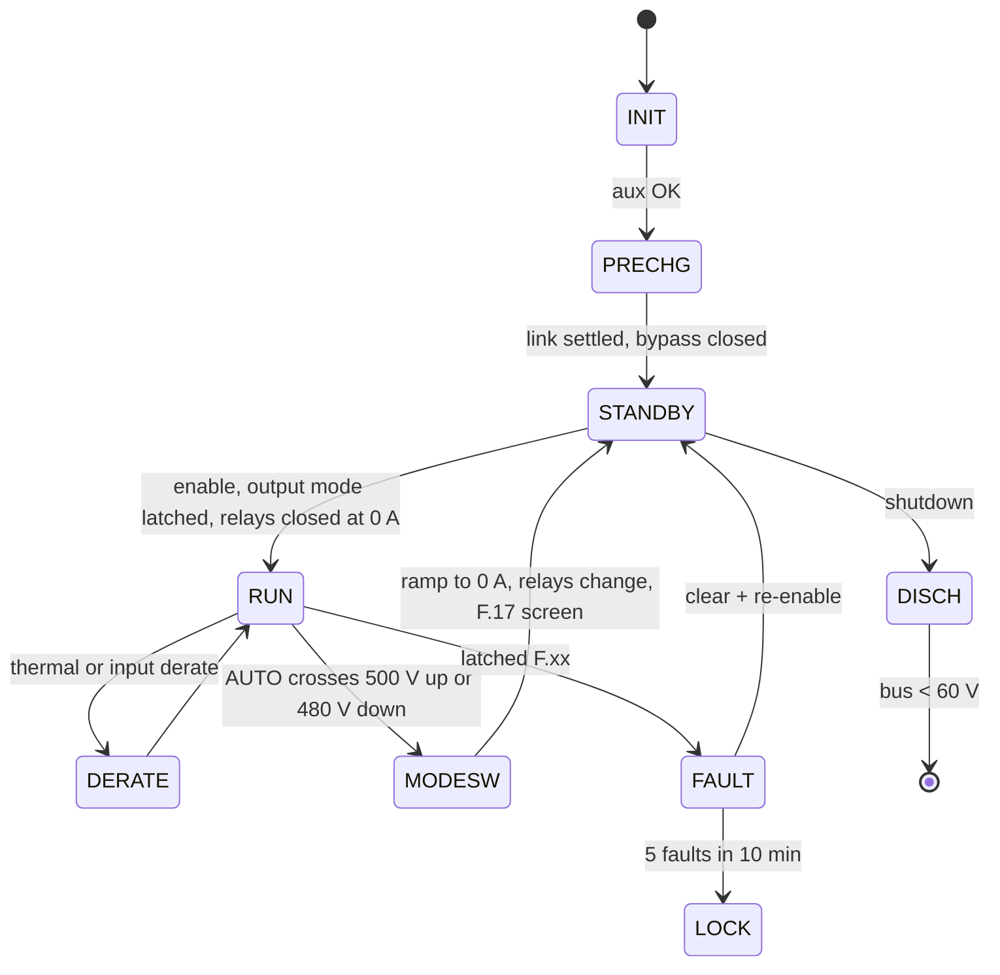

# DC-Modules

<sub>Engineering repository for the Vectivolt 30 / 40 / 50 kW SiC EV charging modules</sub>

<p>
  
  
  
</p>

<p align="center">
  
  
  
</p>
<p align="center">
  
  
  
  
  
  
</p>

> [!NOTE]
> **What this repository is** — a complete electrical design for a family of unidirectional AC → DC EV
> fast-charging modules, engineered end to end: every number traces to a runnable calculation, every waveform
> claim to a preserved ngspice netlist, every component to a schematic reference, and every rupee to a generated
> BOM line. **What it is not yet** — bench-validated or certified hardware (see [Honesty boundary](#honesty)).
>
> **Scope** — the four modules and their control card.

**Where to go first**

| If you are here to… | Start at | Then |
|---|---|---|
| **judge the design** | [validation report](docs/validation-report.md) | [verification matrix](docs/verification-matrix.md) · [simulation report](docs/simulation-report.md) |
| **understand the module** | [platform architecture](docs/architecture.md) | [module family](boards/README-module-family.md) · [decision register](docs/assumptions.md) |
| **build or buy one** | [BOM & cost](docs/bom-cost.md) | [BOM guide](docs/bom-guide.md) · [DFM & production](docs/dfm-production.md) |
| **write or port firmware** | [firmware guide](docs/firmware-guide.md) | [firmware architecture](docs/firmware-architecture.md) · [CAN protocol](docs/can-protocol.md) |
| **plan the bench campaign** | [EVT test plan](docs/evt-plan.md) | [bring-up plan](docs/validation-report.md#8-first-prototype-bring-up-plan) |

## 1. ⚡ The platform in sixty seconds

A module is **one AC-DC board (Vienna PFC) and one DC-DC board (full-bridge LLC)** bolted face to face, run by
**one control card** — a single GD32G553VET7 brain that drives every PWM on the module. Four module SKUs
share those boards, that card and one firmware image; the card learns which SKU it sits in from a single strap
resistor.

| | 30 kW | 40 kW | 50 kW liquid | 50 kW air |
|---|:---:|:---:|:---:|:---:|
| **Output** | 150–1000 V · 100 A | 150–1000 V · 133 A | 150–1000 V · 167 A | 150–1000 V · 167 A |
| **Cooling** | air · 3 fans | air · 3 fans | sealed coldplates | air · 4 fans |
| **Efficiency** (full power, 400 VAC) | 96.38 % | 96.34 % | 96.29 % | 96.22 % |
| **₹ @10k** (India basis) | 31,613 | 36,103 | 42,761 | 40,688 |
| **₹ / kW** | 1,054 | 903 | 855 | **814** |
| **China RFQ target ₹ @10k** | 25,920 | 29,520 | 35,023 | 33,243 |



## 2. 🎯 Results against the specification

| Requirement | Target | Achieved | Evidence |
|---|---|---|---|
| Input | 3-φ 285–475 VAC | full power 330–475 VAC; 86 % constant-current derate at 285 VAC (a calculated trade that saves ~16 % of SiC, copper and EMI) | [architecture](docs/architecture.md) |
| Output | 150–1000 VDC, CV/CC | two output modes: **LOW ≤ 500 V** banks in parallel, **HIGH ≥ 500 V** in series, latched in standby (AUTO crosses above 500 V and back below 480 V); PFM down to the fn floor **0.55**, then phase shift at 1.45·fr; zero-voltage switching held by a per-leg adaptive dead time on the non-linear C_oss, with a valley-timed 125 / 186 / 189 ns edge on the weak leg in phase shift | [firmware guide](docs/firmware-guide.md) |
| Output current | per SKU | **100 / 133 / 167 A**; constant current below the 300 V knee, constant power above | [module family](boards/README-module-family.md) |
| THD | ≤ 5 % (stretch 3 %) | **0.76 / 0.65 / 0.69 %** THD-40 at 400 VAC full power (30 / 40 / 50 kW, the shipped firmware law in the cycle-by-cycle SIL). THD and power factor are specified **from 25 % load to full load** (≤ 5 % THD, PF ≥ 0.98); below that the Vienna runs discontinuous by design and the cabinet sheds modules rather than idling them — the 30 kW / 400 VAC curve reads THD 1.09 / 2.24 / 3.89 / 7.06 / 16.35 / 87.3 % and PF 0.995 / 0.988 / 0.974 / 0.950 / 0.860 / 0.666 at 100 / 50 / 30 / 20 / 10 / 5 % load | [simulation report](docs/simulation-report.md) |
| Efficiency | peak ≥ 97 % | **peak 97.78 / 97.84 / 97.80 / 97.79 %** · full power at 400 VAC **96.38 / 96.34 / 96.29 / 96.22 %**, output diode, LLC turn-off energy and the double-pulse switching coefficient all included | [thermal report](docs/thermal-report.md) |
| Thermal envelope | full power to +55 °C | 4,536 grid points (1,134 per module), **no FAIL row anywhere**: worst junction **150 °C** at the 150 °C ceiling. The corners that would exceed it carry a registered fold, and `hal/dielim.c` implements it as a junction observer — it estimates the worst die above the measured zone NTC, folds between 142 and 150 °C, and **declines** a point it cannot cool instead of delivering into it | [thermal report](docs/thermal-report.md#3-junction-temperatures--the-worst-point-of-the-grid) |
| Environment | match the market | **−30…+75 °C** (full power to 55 °C), ≤ 95 % RH non-condensing, ≤ 2000 m, conformal coating, IP55 fans | [teardown benchmark](docs/benchmark-infypower-teardown.md) |
| Accuracy | ±0.5 % V · ±1 % I | **±0.18 % / ±0.2 %** after the mandatory 2-point EOL calibration (10k-sample Monte-Carlo) | [verification matrix](docs/verification-matrix.md) |
| Protection | trips above every real peak | **F.01 120 / 155 / 195 A · F.11 140 / 180 / 220 A** — each ≥ 1.2 × the simulated worst peak; every SiC die ≤ 0.8 × IDM at its fault peak; the precharge-bypass closure pulse (200 / 218 / 280 A) blanked 60 ms with relays, diodes and fuses sized to it; DESAT response 1.34 µs (LLC) / 2.21 µs (Vienna) against 2 / 4.2 µs SiC withstand classes. The F.01 comparator reference is **positive-only**, with a 100 kHz software magnitude trip on the raw current for the negative polarity (≤ 10 µs) and Σi = 0 making the other two comparators the hardware backstop. A hardware trip is held until the supervisor has latched it; nothing re-arms the outputs. An F.01 inside 500 ms of a disturbed line is filed as F.08 — self-recovering, uncounted, re-precharged, because the EMI filter rings 121–199 A pk at a line return through the boost diodes, which no switch can stop; on a quiet line F.01 still latches | [current coordination](docs/current-coordination.md) |
| Magnetics copper | windings inside their Rac rows | Rac/Rdc ≤ 1.35 and ΔT ≤ 40 K on every winding at the simulated currents; D3 / D2 hot-spot ≤ 116 °C at 55 °C inlet; PyOpenMagnetics second opinion: Rdc ± 2.5 %, class lines hold at its higher D3 copper (50 kW air D3 130 °C vs the 125 °C design line — first-article watch) | [magnetics hub](docs/magnetics.md) |
| EMI | CISPR-class conducted pre-compliance | star-X2 filter, no DM chokes: DM margin **+32.9 / +30.6 / +28.7 dB**; CM counts the LLC bridge as a second source (its fundamental sits inside the band above 150 kHz): **+3.1 dB** at the 100 pF leg-node requirement, +7.1 dB at the 50 pF design target, with CY1-3 at 10 nF — T-13 measures it; current loop stable with the damper | [simulation report](docs/simulation-report.md) |
| Build cost at 10k | red-line ₹25k / 33k / 43k | **₹31,613 / 36,103 / 42,761 / 40,688** India basis · **₹25,920 / 29,520 / 35,023 / 33,243** China RFQ target. 30 kW over the red-line by ₹6,613, 40 kW by ₹3,103; both 50 kW under | [BOM & cost](docs/bom-cost.md) |

## 3. 🏗️ Architecture

```mermaid
flowchart LR
  AC(["3-φ 285–475 VAC"]) --> EMI["gG fuses 80 / 125 / 160 A<br/>MOV Δ + GDT · 2 CMC + star X2"]
  EMI --> PRE["precharge<br/>2 × 33 Ω + bypass"]
  PRE --> V["Vienna PFC · 50 kHz<br/>one 750 V SiC die per position · 1200 V JBS"]
  V --> BUS[("split DC bus<br/>650–830 V · OVP 860 V")]
  BUS --> LLC["full-bridge LLC · fr 140 kHz<br/>1200 V SiC · Cr + D2 external Lr"]
  LLC --> XF["2 × D3 transformer cells<br/>primaries in series · n 2"]
  XF --> BK["banks A + B<br/>SiC JBS bridges · film only"]
  BK --> SP["S/P relays at 0 A<br/>LOW ≤ 500 V · HIGH ≥ 500 V"]
  SP --> DO["output diode DOUT<br/>1600 V"]
  DO --> OUT(["150–1000 VDC<br/>100 / 133 / 167 A"])
  CARD["ONE control card<br/>GD32G553VET7 · RATING strap"] -. "40-way harness" .-> V
  CARD --- LLC
  AUX["110 W full-bus aux<br/>NCP1252D"] --> CARD
  BUS --> AUX
  style V stroke:#d19a00,stroke-width:2.5px
  style LLC stroke:#1a9fb3,stroke-width:2.5px
  style SP stroke:#b8732e,stroke-width:2.5px
  style CARD stroke:#2ea44f,stroke-width:2.5px
```



- **Two-board sandwich.** TO-247 rows, clip-mounted on Al2O3 insulators, face outward onto two heatsink extrusions,
  or onto liquid coldplates on the 50 kW liquid SKU. Magnetics sit in the airflow tunnel between the boards. Power
  crosses on bolted DCP / DCN / PE stud pillars and control crosses on a 40-way harness.
  → [interconnect](docs/interconnect.md)
- **One brain per module.** The card in the DC-DC slot runs the Vienna and the LLC together: 75 of 82 usable MCU
  pins (7 spare), 22 analog channels, every PWM on HRTIMER units, one merged fault line. The RATING strap selects
  30 / 40 / 50 L / 50 A, with a fifth band held in reserve. → [control-card scope](docs/control-card-scope.md)
- **Protection in layers.** DESAT and comparator trips act in microseconds with no firmware in the loop. A
  hardware relay interlock and a watchdog that resets the MCU sit beside them. The supervisory F.xx ladder with
  per-SKU windows covers everything slower. → [protection thresholds](docs/protection-thresholds.md)

## 4. 📊 Status

`sh calculations/run-all.sh` runs the whole battery in one pass and exits 0. A single failure stops it.

| | Where it stands |
|---|---|
| **Design battery** | `run-all` **exit 0** · `review-checks` **163 / 163** closure assertions · `verify-independent` **243 / 243** clean-room checks |
| **Physics gates** | stress-audit **163** · current-coordination **107** · mag-sync **52** · magnetics-envelope **30** · fw-constants-sync **30 rows** · fault-energy **24** · conductor-audit **18** · temp-critique **11** · repo-hygiene **7** |
| **Thermal envelope** | **4,536** grid points (1,134 per SKU), **0 FAIL**, worst junction 150 °C |
| **Release schematics** | **7,409 / 7,409** connected pins across five KiCad-5 targets · nine board PDFs |
| **Firmware** | **336 checks** under ASan/UBSan across seven binaries · target build clean: bootloader 11.9 kB of 32 kB, application ≈ 50.5 kB of a 207.5 kB slot · `port-pin-audit` 56 pins |
| **Documentation** | **41** registered pages, `docs-lint` clean |
| **Build cost @10k** | India basis ₹31,613 / 36,103 / 42,761 / 40,688 · China RFQ target ₹25,920 / 29,520 / 35,023 / 33,243 |
| **First prototype** | **READY FOR BENCH BRING-UP.** The port has never run on silicon, and full power waits on the commutation-loop measurement — [validation report](docs/validation-report.md) |

| Also run on every change | Result |
|---|---|
| SPICE suites — power-solved LLC per SKU, double pulse, DC-link ripple, CT front-ends, precharge / discharge, aux flyback | all pass · [toolchain](docs/simulation-toolchain.md) |
| `magnetics-rfq-audit.mjs` — every magnetic drawing on the module pages complete enough to order | 0 missing fields · 25 drawings |
| `footprint-audit.mjs` — every part names a package, every named part matches its drawn land | 0 unnamed · 0 mismatched |

## 5. 🧩 The module family

<details>
<summary><b>Variant specification table</b> — every number engine-derived and gate-verified</summary>

| Specification | 30 kW | 40 kW | 50 kW liquid | 50 kW air |
|---|---|---|---|---|
| Rated power · max output current | 30 kW · 100 A | 40 kW · 133 A | 50 kW · 167 A | 50 kW · 167 A |
| Worst continuous line current | 55.9 A | 73.3 A | 91.6 A | 91.6 A |
| Efficiency — full power at 400 VAC | 96.38 % | 96.34 % | 96.29 % | 96.22 % |
| Efficiency — peak over the envelope | 97.78 % | 97.84 % | 97.80 % | 97.79 % |
| Loss at rated | 1,127 W | 1,519 W | 1,925 W | 1,965 W |
| Cooling | 3 fans · airflow margin 1.54× | 3 fans · 1.14× | 2 coldplates · 0 fans · ≤ 60 °C coolant · 7 L/min · ΔT 4.7 K | 4 fans (3 front + 1 rear) · 1.17× |
| Device mount | clip on Al2O3 · 0.8 K/W to a 70 °C base | = 30 kW | 0.65 K/W to a 65 °C plate | = 30 kW |
| Vienna silicon (one die per position) | 750 V 20 mΩ class | 750 V 15 mΩ class | B3M010C075Z | B3M010C075Z |
| PFC choke D1 | 3 × 0077908A7 · N = 39 | 5 × 0077908A7 · N = 26 | 5 × 0077908A7 · N = 24 | = 50 kW liquid |
| EMI filter · worst DM margin | 2 CMC + 12 × 4.7 µF X2 in three star stages + damper · +32.9 dB | same · +30.6 dB | same · +28.7 dB | = 50 kW liquid |
| LLC silicon (full bridge) | 4 × SG2M023120LJ | 8 × (two per position) | 8 × | 8 × |
| LLC tank (fr 140 kHz · Ln 10 · n 2) | 7 × 33 nF · Lr 5.6 µH (D2 rev F 5.00 µH) | 9 × 33 nF · 4.35 µH (3.99 µH) | 11 × 33 nF · 3.56 µH (3.20 µH) | = 50 kW liquid |
| LLC turn-off snubber per die | 330 pF C0G | 680 pF | 1000 pF | = 50 kW liquid |
| Transformer (D3 rev D, two cells) | 2 × E70 per cell · 6:6∥6 | 3 × E70 · 4:4∥4 | 3 × E70 · 4:4∥4 | = 50 kW liquid |
| Secondary rectifiers | 16 × 40 A SiC JBS | 16 × | 16 × | 16 × |
| Output banks · output diode DOUT | 9 × 2.2 µF film per bank · 150 A class | 12 × · 200 A | 14 × · 250 A | 14 × · 250 A |
| Trip classes F.01 · F.11 | 120 · 140 A pk | 155 · 180 A pk | 195 · 220 A pk | = 50 kW liquid |
| Input fuse (gG) | 80 A · 22 × 58 | 125 A · 22 × 58 | 160 A · NH00 | 160 A · NH00 |
| DC link | 10 cans | 12 | 16 | 16 |
| Bus discharge to < 60 V | 2.0 s (F.21 window 3 s) | 2.4 s (4 s) | 3.2 s (5 s) | 3.2 s (5 s) |
| MTBF (parts count, 40 °C) | 403 kh | 385 kh | 369 kh | 367 kh |
| RATING strap | 0 Ω | 1 k | 10 k | 15 k |
| **BOM @10k · ₹/kW** | **₹31,613 · 1,054** | **₹36,103 · 903** | **₹42,761 · 855** | **₹40,688 · 814** |
| China RFQ target @10k | ₹25,920 | ₹29,520 | ₹35,023 | ₹33,243 |

</details>

The **two 50 kW modules are electrically identical**: the air twin is the cheapest build per kW, and the
liquid SKU buys a sealed, fanless module for ₹2,073 more. Modules run in parallel through their own output blocking
diodes, sharing current by commanded constant current over CAN with staggered starts. → [module family](boards/README-module-family.md)

## 6. 🗺️ Repository map

| Path | What is in it |
|---|---|
| `packages/` | the schematic source of record — `power-primitives/cells.tsx` (every reusable cell), `common-components/boards.tsx` (the four SKUs from one parameterized source), the gate-driver, sensing, magnetics and control-interface libraries |
| `boards/` | the four buildable SKUs, `control-card.tsx`, and the nine release PDFs in `out-pdf/` → [boards](boards/README.md) |
| `calculations/` | every engine, standing gate, the BOM factory, the release-sheet pipeline and the documentation generators; outputs in `out/` → [calculations & gates](calculations/README.md) |
| `spice/` | the ngspice runners, their persisted decks in `generated/`, and the device models → [SPICE suites](spice/README.md) |
| `simulation-results/` | the committed per-SKU result CSVs and plots the gates read |
| `firmware/` | `core/` supervisory C99 · `hal/` the real-time Vienna and LLC laws · `proto/` VMP 2.0 and TonHe V1.2 · `boot/` the signed A/B chain · `port/gd32g553/` the register-level port · `test/` the host binaries |
| `kicad5/` | the audited KiCad-5 release set and the generated footprints |
| `docs/` | the 41 registered documentation pages → [documentation hub](docs/README.md) |
| `dist/` | built netlists (`tsci build` output), git-ignored |

## 7. 🚀 Reproduce it

```bash
# prerequisites: node ≥ 20, ngspice ≥ 46 (brew install ngspice), a C compiler
npm install
```

```bash
sh calculations/run-all.sh              # every engine, gate, BOM, generator and the firmware suite — exit 0
sh firmware/run_tests.sh                # the host binaries alone, under ASan/UBSan
sh firmware/port/gd32g553/build.sh      # the Cortex-M33 bootloader and signed A/B images, -Werror
```

```bash
# build one board netlist (netlist mode — PCB layout is out of scope)
TSCI_NO_ROUTE=1 npx tsci build boards/30kw/acdc.tsx --ignore-placement-drc --ignore-routing-drc
```

```bash
# regenerate release schematics and PDFs for one target (30kw | 40kw | 50kw | 50kwa | control-card)
node calculations/sheet-pages.mjs 30kw && node calculations/sheet-netlist-gen.mjs 30kw && node calculations/kicad5-gen.mjs 30kw && node calculations/kicad5-verify.mjs 30kw && node calculations/kicad5-print.mjs 30kw && node calculations/sheets-to-pdf.mjs
```

```bash
# the SPICE evidence suites
node spice/llc/llc-run.mjs 30kw 40kw 50kw 50kwa && node spice/llc/llc-envelope.mjs && node spice/llc/llc-flux-post.mjs && node spice/protection/ct-frontend.mjs && node spice/protection/prechg-disch.mjs && node spice/aux/aux-flyback.mjs
```

## 8. 📦 Deliverables

The release face is the audited **KiCad-5 set** in `kicad5/`, rendered to print-fidelity PDFs in
[`boards/out-pdf/`](boards/out-pdf/) — nine PDFs:

| PDF | Contents |
|---|---|
| `DC-Modules 30kW AC-DC (Vienna PFC)` · `DC-Modules 30kW DC-DC (full-bridge LLC)` | the 30 kW module pair |
| `DC-Modules 40kW AC-DC (Vienna PFC)` · `DC-Modules 40kW DC-DC (full-bridge LLC)` | 40 kW air |
| `DC-Modules 50kW AC-DC (Vienna PFC, liquid)` · `DC-Modules 50kW DC-DC (full-bridge LLC, liquid)` | the 50 kW liquid twin |
| `DC-Modules 50kW-Air AC-DC (Vienna PFC)` · `DC-Modules 50kW-Air DC-DC (full-bridge LLC)` | the 50 kW air twin |
| `DC-Modules Control Card (GD32G553VET7)` | the one card, every seat |

## 9. 💾 Supervisory firmware

Portable **C99**, sans-IO, one image for every seat: the supervisory core (`firmware/core/`), the VMP 2.0 and TonHe V1.2
profiles (`firmware/proto/`), the real-time HAL with the Vienna and LLC laws (`firmware/hal/`), the signed A/B boot chain
(`firmware/boot/` — SHA-256 + ECDSA-P256, trial/confirm/rollback, CAN field update) and the **register-level GD32G553
port** (`firmware/port/gd32g553/`, no vendor library — built and signed by `port/gd32g553/build.sh`, its pin table gated
against the card generator). The host suite runs **336 checks under ASan/UBSan** across seven binaries, from the 26 fault
scenarios to cycle-by-cycle converter plants and power-cut update storms. → [firmware guide](docs/firmware-guide.md) ·
[CAN protocol](docs/can-protocol.md)

| Binary | What it proves | Checks |
|---|---|---:|
| `boot_test` | SHA-256, ECDSA-P256, the signed image, the boot decision, the update protocol on a row-granular, program-once flash model | 22 |
| `host_sim` | the supervisory core: 26 fault scenarios, every-tick invariants | **122** |
| `ctl_test` | the reference shaper and regulator kernel, the share trim against the peer refresh | 20 |
| `proto_test` | TonHe V1.2 + VMP 2.0 conformance and fuzz, one core through both profiles | 42 |
| `hal_test` | the portable real-time HAL on cycle-by-cycle Vienna and LLC plants, measurement, power-cut-safe NVM, the junction observer | 45 |
| `app_test` | the module application end to end: interrupts, the 1 ms sequence, faults, NVM, CAN, the F.01 magnitude trip, the fold / decline, the comparator codes at an off-nominal reference, the live reference tracker, the ratiometric AVMID check and a discharge resumed from the pre-reset record | 33 |
| `rules_test` | the review suites' own checks — dead-time floor and weak-leg edge, the FSM rows (the link rows on the shutdown path among them), the fold, the protocol fixes | **51** |
| | **`sh firmware/run_tests.sh`** | **336** |



## 10. 📚 Documentation

Start at the **[documentation hub](docs/README.md)** — 41 registered pages in five families, with one BOM page and one magnetics page per module, each with a banner, a
status badge and next/previous navigation. `docs-lint` fails the battery if a link, anchor, masthead or diagram breaks.

| Start here | To understand |
|---|---|
| **[Validation report](docs/validation-report.md)** | **the state of the design today — the defect classes found and closed, what is still open, the decision table and the bring-up plan** |
| [Platform architecture](docs/architecture.md) | the module in one read |
| [Module family](boards/README-module-family.md) | the four SKUs side by side, the two 50 kW cooling lines, what a charger gets from each module |
| [Decision register](docs/assumptions.md) | every decision in force, with provenance and invalidator |
| [Current & protection coordination](docs/current-coordination.md) | the worst current in every magnetic and switch against its trip |
| [Magnetics hub](docs/magnetics.md) · module pages [30](docs/magnetics-30kw.md) · [40](docs/magnetics-40kw.md) · [50 L](docs/magnetics-50kw.md) · [50 A](docs/magnetics-50kwa.md) | every custom magnetic — drawing, gate proof, build, tests, cost |
| [Simulation toolchain](docs/simulation-toolchain.md) | which tool proves what, and where fidelity ends |
| [EVT test plan](docs/evt-plan.md) | the bench campaign T-00…T-64 |
| [BOM & cost](docs/bom-cost.md) · module BOMs [30](docs/bom-30kw.md) · [40](docs/bom-40kw.md) · [50 L](docs/bom-50kw.md) · [50 A](docs/bom-50kwa.md) | the generated cost roll-up, China targets, cost per kW and every line item |

<a name="honesty"></a>

## 11. ⚖️ Honesty boundary

> [!IMPORTANT]
> **If it wasn't executed, it isn't claimed.** Nothing here is called *verified* without an executed artifact in
> this repository, and *bench-validated*, *certified* and *production-released* appear nowhere as claims.

Specified and packaged, but physically waiting on hardware, labs or third parties:

- 🔧 **PCB layout** — out of scope by directive; the schematics carry the layout rules, and the ≤ 10 nH commutation loop is one of them.
- 🔬 **EVT T-00…T-64** — double-pulse bench, both-polarity short-circuit timing, clip-mount Rth (T-38), die pulse class (T-41), assembled link impedance (T-57), ZVS at the light-load corners (T-58), loop inductance (T-59), PFC ISR on silicon (T-64), thermal and EMI chambers, protection injection, first-article winding Rac, a −30 °C cold soak.
- 📜 **Compliance certification** — a lab and certification-body activity.
- 🤝 **Vendor RFQ pricing** — BOM prices are RFQ targets (±25 %) until quotes land; the China column is a landed target (duty per HSN code to confirm with a customs broker), and the InfyPower cost comparison rests on a teardown estimate.
- 🖥️ **MCU port and bring-up** — the portable real-time HAL is host-proven on cycle-by-cycle plants; the GD32G553 port is register-level with **no vendor library** and builds and signs here, but its timing is unmeasured until silicon — the worst PFC ISR is 5.8 µs static by disassembly, and the control interrupt runs off the ADC end-of-sequence transfer, which puts its budget at ≈ 7.2 µs to the roll-over (T-64 measures both with DWT); the single-update fallback is forbidden on the 40 / 50 kW SKUs.

## 12. 🔓 What is still open

Every open item, the assumption made for it and the bench row that closes it are listed in the
**[validation report](docs/validation-report.md#9-what-remains-open)**. The short form:
the commutation-loop inductance is a property of a layout that does not exist yet and is measured before any
high-power run; three device classes are bought against RFQ acceptance lines instead of datasheets; the line CT's
µs step response and the DC-link can's 100 kHz current rating are RFQ acceptance rows with drawn fallbacks; and the
port has never run on silicon.

Ahead of the bring-up itself: buy and measure one InfyPower REG1K0135A2 to replace the teardown cost and thermal
estimates with data, run RFQ round 1 against the IDM and duty acceptance lines, and decide the levers listed in the
[teardown benchmark](docs/benchmark-infypower-teardown.md).

> [!TIP]
> **How this page is checked** — every count, ₹ and margin on this page comes from an artifact in the repository;
> `sh calculations/run-all.sh` regenerates them and `node calculations/docs-lint.mjs` fails if any link, anchor,
> masthead or diagram on any registered page breaks.

---

<div align="center">
<sub><a href="docs/README.md">Documentation Hub →</a></sub>

<sub>Vectivolt DC-Modules · documentation rev E85 · every number reproduces with <code>sh calculations/run-all.sh</code></sub>
</div>
