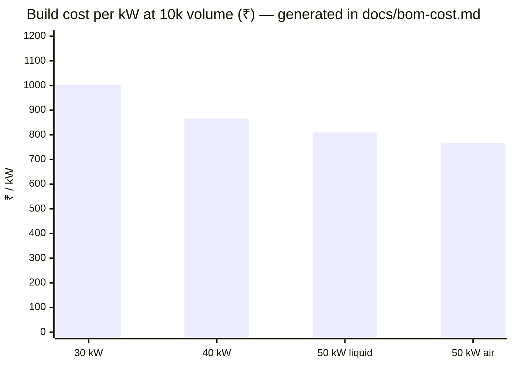
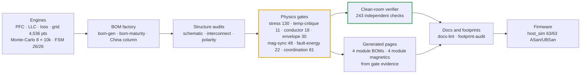
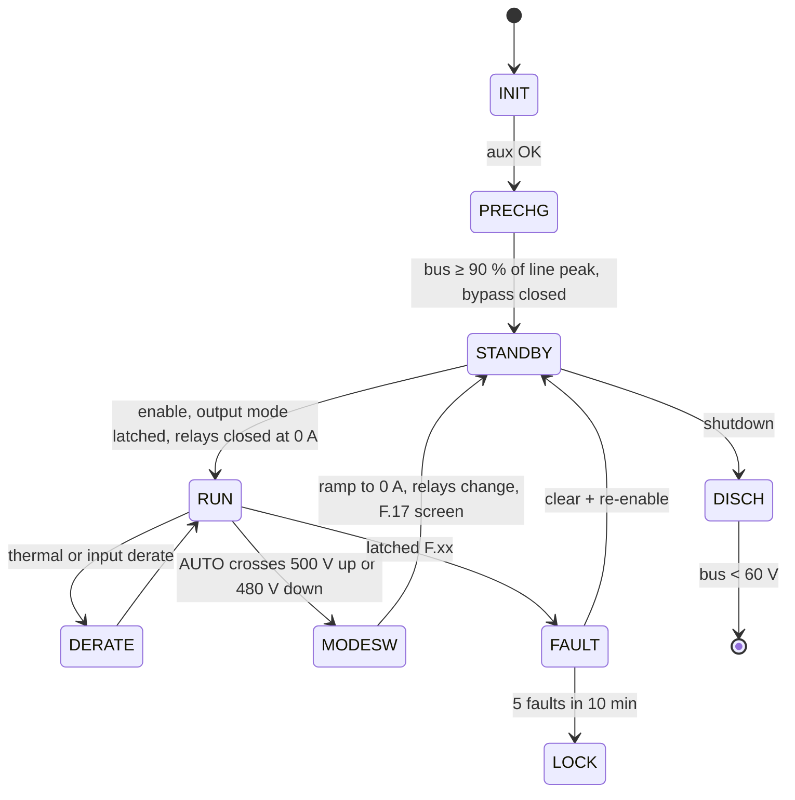

# DC-Modules

<sub>Engineering repository for the Vectivolt 30 / 40 / 50 kW SiC EV charging modules</sub>

<p>
  
  
  
</p>

<p align="center">
  
  
  
  
</p>
<p align="center">
  
  
  
  
  
  
</p>

> [!NOTE]
> **What this repository is** — a complete electrical design for a family of unidirectional AC → DC EV
> fast-charging modules, engineered end to end: every number traces to a runnable calculation, every waveform
> claim to a preserved ngspice netlist, every component to a schematic reference, and every rupee to a generated
> BOM line. **What it is not yet** — bench-validated or certified hardware (see [Honesty boundary](#honesty)).
>
> **Scope** — the four modules only (E72). The earlier 100 / 150 kW multi-module product material is preserved on
> branch `backup/with-100-150kw-products`.

## ⚡ The platform in sixty seconds

A module is **one AC-DC board (Vienna PFC) and one DC-DC board (full-bridge LLC, E67)** bolted face to face, run by
**one control card** — a single GD32G553VET7 brain that drives every PWM on the module (E40). Four module SKUs
share those boards, that card and one firmware image; the card learns which SKU it sits in from a single strap
resistor.

| | 30 kW | 40 kW | 50 kW liquid | 50 kW air |
|---|:---:|:---:|:---:|:---:|
| **Output** | 150–1000 V · 100 A | 150–1000 V · 133 A | 150–1000 V · 167 A | 150–1000 V · 167 A |
| **Cooling** | air · 3 fans | air · 3 fans | sealed coldplates | air · 4 fans |
| **Efficiency** (full power, 400 VAC — E81 ledger with the LLC turn-off and DPT switching terms) | 96.43 % | 96.36 % | 96.31 % | 96.24 % |
| **₹ @10k** (India basis, E81 BOM) | 31,533 | 35,970 | 42,410 | 40,338 |
| **₹ / kW** | 1,001 | 865 | 810 | **768** |
| **China RFQ target ₹ @10k** (E69f) | 24,639 | 28,319 | 33,182 | 31,398 |



## 🎯 Results against the specification

| Requirement | Target | Achieved | Evidence |
|---|---|---|---|
| Input | 3-φ 285–475 VAC | full power 330–475 VAC; 86 % constant-current derate at 285 VAC (a calculated trade that saves ~16 % of SiC, copper and EMI) | [architecture](docs/architecture.md) |
| Output | 150–1000 VDC, CV/CC | two output modes (E67): **LOW ≤ 500 V** banks in parallel, **HIGH ≥ 500 V** in series, latched in standby (AUTO crosses above 500 V and back below 480 V); PFM down to fn ≈ 0.59, then phase shift at 1.45·fr; zero-voltage switching held by a per-leg adaptive dead time (E81: non-linear Coss + snubber in the deck — the light-load corners are T-58's) | [firmware guide](docs/firmware-guide.md) |
| Output current | per SKU | **100 / 133 / 167 A**; constant current below the 300 V knee, constant power above | [module family](boards/README-module-family.md) |
| THD | ≤ 5 % (stretch 3 %) | **0.76 / 0.65 / 0.69 %** THD-40 at 400 VAC full power (30 / 40 / 50 kW — the shipped firmware law in the cycle-by-cycle SIL, E81; the earlier 0.59–1.05 % came from a 30 kW averaged deck with a retired law) | [simulation report](docs/simulation-report.md) |
| Efficiency | peak ≥ 97 % | **peak 97.72–97.80 %** · full power at 400 VAC **96.43 / 96.36 / 96.31 / 96.24 %** (E81: output diode, LLC turn-off energy and the double-pulse switching coefficient all included; InfyPower states > 96 %) | [thermal report](docs/thermal-report.md) |
| Thermal envelope | full power to +55 °C | 4,536 grid points (1,134 per module) with **0 violations and 0 folds**; worst Tj **139 °C** against the 150 °C ceiling | [thermal report](docs/thermal-report.md) |
| Environment | match the market | **−30…+75 °C** (full power to 55 °C), ≤ 95 % RH non-condensing, ≤ 2000 m, conformal coating, IP55 fans | [teardown benchmark](docs/benchmark-infypower-teardown.md) |
| Accuracy | ±0.5 % V · ±1 % I | **±0.18 % / ±0.2 %** after the mandatory 2-point EOL calibration (10k-sample Monte-Carlo) | [verification matrix](docs/verification-matrix.md) |
| Protection | trips above every real peak | **F.01 120 / 155 / 195 A · F.11 140 / 180 / 220 A** — each ≥ 1.2 × the simulated worst peak; every SiC die ≤ 0.8 × IDM at its fault peak (E69); the precharge-bypass closure pulse (200 / 218 / 280 A) blanked 60 ms with relays, diodes and fuses sized to it (E73); DESAT response 1.44 µs against a 2 µs SiC withstand | [current coordination](docs/current-coordination.md) |
| Magnetics copper | windings inside their Rac rows | Rac/Rdc ≤ 1.35 and ΔT ≤ 40 K on every winding at the simulated currents; D3 / D2 hot-spot ≤ 116 °C at 55 °C inlet; PyOpenMagnetics second opinion: Rdc ± 2.5 %, class lines hold at its higher D3 copper (50 kW air D3 130 °C vs the 125 °C design line — first-article watch) | [magnetics hub](docs/magnetics.md) |
| EMI | CISPR-class conducted pre-compliance | InfyPower star-X2 filter (E68b): DM margin **+32.9 / +30.6 / +28.7 dB**; CM re-derived at E81 with the LLC bridge counted as a second source (its fundamental sits inside the band above 150 kHz): **+3.1 dB** at the 100 pF leg-node requirement, +7.1 dB at the 50 pF design target, with CY1-3 raised to 10 nF — T-13 measures it; current loop stable with the damper | [simulation report](docs/simulation-report.md) |
| Build cost at 10k | red-line ₹25k / 33k / 43k | **₹31,533 / 35,970 / 42,410 / 40,338** India basis (E81 BOM: +5.00 / +3.91 / +4.77 / +5.04 % over E80, levers listed in the E81 report) · **₹25,852 / 29,418 / 34,748 / 32,968** China RFQ target | [BOM & cost](docs/bom-cost.md) |

## 🏗️ Architecture

```mermaid
flowchart LR
  AC(["3-φ 285–475 VAC"]) --> EMI["gG fuses 80 / 125 / 160 A<br/>MOV Δ + GDT · 2 CMC + star X2 (E68b)"]
  EMI --> PRE["precharge<br/>2 × 33 Ω + bypass"]
  PRE --> V["Vienna PFC · 50 kHz<br/>one 750 V SiC die per position · 1200 V JBS"]
  V --> BUS[("split DC bus<br/>650–830 V · OVP 860 V")]
  BUS --> LLC["full-bridge LLC · fr 140 kHz<br/>1200 V SiC · Cr + D2 external Lr"]
  LLC --> XF["2 × D3 transformer cells<br/>primaries in series · n 2"]
  XF --> BK["banks A + B<br/>SiC JBS bridges · film only (E68c)"]
  BK --> SP["S/P relays at 0 A<br/>LOW ≤ 500 V · HIGH ≥ 500 V"]
  SP --> DO["output diode DOUT<br/>1600 V"]
  DO --> OUT(["150–1000 VDC<br/>100 / 133 / 167 A"])
  CARD["ONE control card<br/>GD32G553VET7 · RATING strap"] -. "40-way harness" .-> V
  CARD --- LLC
  AUX["110 W full-bus aux<br/>NCP1252D"] --> CARD
  BUS --> AUX
  style V stroke:#d19a00,stroke-width:2.5px
  style LLC stroke:#1a9fb3,stroke-width:2.5px
  style SP stroke:#b8732e,stroke-width:2.5px
  style CARD stroke:#2ea44f,stroke-width:2.5px
```



- **Two-board sandwich (E17).** TO-247 rows, clip-mounted on Al2O3 insulators (E68a), face outward onto two heatsink extrusions, or onto liquid coldplates
  on the 50 kW liquid SKU. Magnetics sit in the airflow tunnel between the boards. Power crosses on bolted
  DCP / DCN / PE stud pillars and control crosses on a 40-way harness.
  → [interconnect](docs/interconnect.md)
- **One brain per module (E40).** The card in the DC-DC slot runs the Vienna and the LLC together: 75 of 82 MCU
  pins, 22 analog channels, every PWM on HRTIMER units, one merged fault line. The RATING strap selects
  30 / 40 / 50 L / 50 A (the 3.32 k band is reserved since E66). → [control-card scope](docs/control-card-scope.md)
- **Protection in layers.** DESAT and comparator trips act in microseconds with no firmware in the loop. A
  hardware relay interlock and a watchdog that resets the MCU sit beside them. The supervisory F.xx ladder with
  per-SKU windows covers everything slower. → [protection thresholds](docs/protection-thresholds.md)

## 🧪 How every claim is checked

`sh calculations/run-all.sh` runs the whole battery in one pass. A single failure stops it.



| Also run on every change | Result |
|---|---|
| `review-checks.mjs` — every external-review and audit closure, as assertions | **140 pass** |
| `kicad5-verify.mjs` — pin-level check of the release schematics | **7,285 / 7,285 connected pins** across 5 targets |
| SPICE suites — power-solved LLC per SKU, CT front-ends, precharge / discharge, aux flyback | all pass · [toolchain](docs/simulation-toolchain.md) |
| `magnetics-rfq-audit.mjs` — every magnetic drawing on the module pages complete enough to order (in run-all since E70) | 0 missing fields · 25 drawings |

<details>
<summary><b>The audit trail</b> — every layer earned its place by catching something real</summary>

| Found by | Defect | Fix (now frozen) |
|---|---|---|
| Double-pulse test (L1) | 33 nH assumed loop → 115 % V<sub>DS</sub> | ≤ 10 nH layout rule + RCD clamp to rail → 70 % (E5) |
| DPT energy feedback | measured k<sub>sw</sub> 2.2 × datasheet → Tj 175 °C at 100 kHz | switching frequency 100 → 50 kHz (E3) |
| Monte-Carlo §37 | 17.7 % of tanks miss peak gain | leakage-binned trim, gap-ground Lm, 500/525 V hysteresis, capability 1.39 (E7/E9) |
| S/P transient simulation | 2 V bank mismatch → 205 A through a closing contact | 10 Ω pre-insertion relays + ΔV rule (E12) |
| C firmware port | model masked a blind K_OUT closure → guaranteed OVP | E12b gate before K_OUT closes |
| R1 adversarial audit | 15 critical blockers | closed the same day (rev C) |
| R2 re-audit | 7 new criticals — a board with no 3.3 V source, mis-scaled sensing, … | closed the same day (rev D); the assertion suite began |
| R3 external PDF review | MCU pin numbering from an STM32-derived map | allocation regenerated from the GD32 datasheet |
| E35 margin audit | trim inductor unbuildable (~43 W core loss); drawings short of their own copper | magnetics rev B/C, catalog CT/CMC adoption |
| E37 interconnect audit | RATING strap hard-coded; connector bought as two unmateable headers | per-SKU straps, mating pair — interconnect gate in run-all |
| E40 single-brain migration | two cards per module doubled every way, pin and link | one card per module; −₹293 per module measured |
| E41 stress validation | the registered 40 kW choke was unbuildable; the 100 A fuse failed its derate rule | 5-stack D1-40 + 125 A class; stress-audit joins run-all |
| E42 liquid closure | at the revved 50 kW trip points both CT burdens clipped the 3.3 V ADC rail | burdens re-scaled; BRD check family added |
| E43 family verification | the DM choke had no engine — its inherited 22 µH could not exist at the line crest | dm-choke engine, crest-biased floors, CX2 → 4.7 µF, LISN rebuilt: +4.9 / +5.7 / +5.6 dB |
| R4 external review (E45) | fictional NSI6611 / NCP1252 pin maps, floating driver bias, wrong-sign aux feedback, an unpowered 3.3 V island | all fixed and gated R4-1…R4-8; the "reversed diodes" were one rendering defect |
| R5 external review (E46) | watchdog only inhibited a hung MCU; missing DESAT series resistors; an MCU order code that does not exist | WDO wired onto NRST; 100 Ω DESAT resistors; second exclusion stage; VET7 |
| R6 external review (E47) | aux controller could not cold-start (A-suffix); watchdog merge invisible on the sheet | NCP1252D + 220 µF; renamed WDO net; two-phase discharge timeline |
| R7 external review (E48) | phases B and C shared one comparator's two inputs | AIN9 ↔ AIN11 swap — three independent comparators |
| R8 external review (E49) | our own discharge arithmetic (parallel balance strings) and two turns transcriptions | per-SKU discharge model, 7:7:7 / 6:6:6 panels, retraction registered |
| E51 magnetics recompute | transformer windings demanded 142–294 % of real formers | compacted litz + foil on catalog E70 formers |
| E56 KiCad-native face | a mirrored importer silently mis-wired 454 pins | EasyEDA layer removed; 7,784 / 7,784 pins verified |
| E58 temperature critique | temperature-blind loss fits; inverted digitized B-H labels | measured 3C95 surfaces; equilibria and runaway computed every run |
| **E60 coordination + copper** | the LLC deck had no body diodes (±6 kV legs); trips at or below real peaks; foils at Rac/Rdc 5–7 | power-solved decks, new trip classes, 22/47 pF blanks, 0.10/0.127 mm foil, E70 trims |
| E67 InfyPower parity | the first loss roll-up omitted the output diode and bank filter (109–188 W); the land classifier had named every 0603 part 0805; the F.11 ladder was missing from every sheet since E65 | loss roll-up fixed; 0603 value rows; sheet-pages fails on any unassigned part |
| E68 BOM clone I | `run-all` gates on `a && b` lines could not fail (the MTBF gate had failed silently); the MTBF classifier counted bank films as silicon | every gate is its own command; classifier fixed |
| **E69 BOM clone II** | the PFC pulse check still assumed the retired paralleled pair; a single 16 mΩ LLC die at 40 kW needed IDM ≥ 334 A; printed title blocks read "Content: ?" (50 kW) and "3-phase LLC"; the CT front-end deck still ran the E65 burdens; the BOM CSV shifted columns on maker names with commas, and the MTBF classifier matched keywords inside words | per-die fault-pulse gate, 40 kW keeps two dies, IDM lines at RFQ; title blocks per board; CT deck re-run at E67 classes; RFC 4180 CSV; whole-word classifier, MTBF re-registered |
| E70 per-module pages | 40 / 50 kW BOM lines described 30 kW parts; unquoted commas shifted CSV columns; the MTBF classifier matched inside words; the cost categoriser filed the 50 kW resonant inductor as misc; three decks still ran retired values | one generated BOM and magnetics page per module from the gates' own evidence; 51 → 37 documents; classifiers and decks fixed |
| **E71 second opinion** | the docs said PyOpenMagnetics could not install (the 1.4.0 wheel runs); the D2 gap guide ignored fringing (+14 % L); the D3 Rac/Rdc sample test would reject good parts; MKF reads the D3 foil copper ~30 % above the 1-D model | `mkf-crosscheck.py`; fringing-corrected gap guides; short-circuit R test against the 1-D … MKF bracket; 50 kW air D3 at MKF copper = first-article watch; retired footprint envelopes removed |
| E72 modules only | the firmware guide still listed 10 CSU host scenarios retired at E66; the interconnect gate's header described a 16-way harness and a 60 kW strap; the control-card scope still described three LLC sections; the README check counts had drifted | the repository narrowed to the four modules, the 100 / 150 kW material preserved on a backup branch, every stale text corrected |
| **E73 magnetics review** | closing the precharge bypass at 90 % of line peak drove 200–280 A through D1 — above F.01 on every SKU, a fault at every high-line start; the D4 sheet named no wire sizes and its Rdc rows passed a wrong gauge and rejected a good aux winding; fan-out, D3 cell imbalance and D7 CM flux had no computed check | F.01 blanked 60 ms at closure with no PFC enable inside (host_sim 63/63, negative-tested); relay make and JBS IFSM RFQ lines; [INRUSH] · [FAN-OUT] · [IMBALANCE] · D7 CM-flux · D4 Rdc gates; PyOpenMagnetics on D1 / D4 / D7; a critical-review matrix on every module page |

</details>

## 🧩 The module family

<details>
<summary><b>Variant specification table</b> — every number engine-derived and gate-verified</summary>

| Specification | 30 kW | 40 kW (E41) | 50 kW liquid (E42) | 50 kW air (E44) |
|---|---|---|---|---|
| Rated power · max output current | 30 kW · 100 A | 40 kW · 133 A | 50 kW · 167 A | 50 kW · 167 A |
| Worst continuous line current | 55.9 A | 73.3 A | 91.6 A | 91.6 A |
| Efficiency — full power at 400 VAC (E81 ledger) | 96.43 % | 96.36 % | 96.31 % | 96.24 % |
| Efficiency — peak (E81 grid) | 97.80 % | 97.73 % | 97.72 % | 97.72 % |
| Loss at rated | 1,049 W | 1,367 W | 1,782 W | 1,822 W |
| Cooling | 3 fans · airflow 1.65× (E81: 55 °C air density, O-16 closed) | 3 fans · 1.27× | 2 coldplates · 0 fans · ≤ 60 °C coolant · 6.5 L/min · ΔT 4.6 K | 4 fans (3 front + 1 rear) · 1.27× |
| Device mount (E68a) | clip on Al2O3 · 0.8 K/W to a 70 °C base | = 30 kW | 0.65 K/W to a 65 °C plate | = 30 kW |
| Vienna silicon (one die per position, E68a/E69a) | 750 V 20 mΩ class | 750 V 15 mΩ class | B3M010C075Z | B3M010C075Z |
| PFC choke D1 | 3 × 0077908A7 · N = 39 | 5 × 0077908A7 · N = 26 | 5 × 0077908A7 · N = 24 | = 50 kW liquid |
| EMI filter (E68b) · worst DM margin | 2 CMC + 12 × 4.7 µF X2 in three star stages + damper · +32.9 dB | same · +30.6 dB | same · +28.7 dB | = 50 kW liquid |
| LLC silicon (full bridge, E67) | 4 × SG2M023120LJ | 8 × (two per position) | 8 × | 8 × |
| LLC tank (fr 140 kHz · Ln 10 · n 2) | 7 × 33 nF · Lr 5.6 µH (D2 rev F 5.16 µH) | 9 × 33 nF · 4.35 µH (4.07 µH) | 11 × 33 nF · 3.56 µH (3.28 µH) | = 50 kW liquid |
| Transformer (D3 rev D, two cells) | 2 × E70 per cell · 6:6∥6 | 3 × E70 · 4:4∥4 | 3 × E70 · 4:4∥4 | = 50 kW liquid |
| Secondary rectifiers | 16 × 40 A SiC JBS | 16 × | 16 × | 16 × |
| Output banks (E68c) · output diode DOUT | 9 × 2.2 µF film per bank · 150 A class | 12 × · 200 A | 14 × · 250 A | 14 × · 250 A |
| Trip classes F.01 · F.11 | 120 · 140 A pk | 155 · 180 A pk | 195 · 220 A pk | = 50 kW liquid |
| Input fuse (gG) | 80 A · 22 × 58 | 125 A · 22 × 58 | 160 A · NH00 | 160 A · NH00 |
| DC link | 10 cans | 12 | 16 | 16 |
| Bus discharge to < 60 V | 2.0 s (F.21 window 3 s) | 2.4 s (4 s) | 3.2 s (5 s) | 3.2 s (5 s) |
| MTBF (parts count, 40 °C, E69 classifier) | 422 kh | 402 kh | 396 kh | 394 kh |
| RATING strap | 0 Ω | 1 k | 10 k | 15 k |
| **BOM @10k · ₹/kW** (E81) | **₹31,533 · 1,051** | **₹35,970 · 899** | **₹42,410 · 848** | **₹40,338 · 807** |
| China RFQ target @10k (E69f) | ₹24,639 | ₹28,319 | ₹33,182 | ₹31,398 |

</details>

Since E68a the **two 50 kW modules are electrically identical**: the air twin is the cheapest build per kW, and the
liquid SKU buys a sealed, fanless module for ₹2,077 more. Modules run in parallel through their own output blocking
diodes, sharing current by commanded constant current over CAN with staggered starts. → [module family](boards/README-module-family.md)

## 📦 Deliverables

The release face is the audited **KiCad-5 set** in `kicad5/`, rendered to print-fidelity PDFs in
[`boards/out-pdf/`](boards/out-pdf/) — nine PDFs:

| PDF | Contents |
|---|---|
| `DC-Modules 30kW AC-DC (Vienna PFC)` · `30kW DC-DC (full-bridge LLC)` | the 30 kW module pair |
| `DC-Modules 40kW AC-DC (Vienna PFC, E41)` · `40kW DC-DC (full-bridge LLC)` | 40 kW air |
| `DC-Modules 50kW … liquid` · `50kW-Air …` | the two 50 kW twins |
| `DC-Modules Control Card (GD32G553VET7)` | the one card, every seat |

## 🚀 Quickstart

```bash
# prerequisites: node ≥ 20, ngspice ≥ 46 (brew install ngspice), a C compiler
npm install
```

```bash
# reproduce every calculation, audit, BOM, verifier and the firmware suite
sh calculations/run-all.sh
```

```bash
# build one board netlist (netlist mode — PCB layout is a later phase, E36)
TSCI_NO_ROUTE=1 npx tsci build boards/30kw/acdc.tsx --ignore-placement-drc --ignore-routing-drc
```

```bash
# regenerate release schematics and PDFs for one target (30kw | 40kw | 50kw | 50kwa | control-card)
node calculations/sheet-pages.mjs 30kw && node calculations/sheet-netlist-gen.mjs 30kw && node calculations/kicad5-gen.mjs 30kw && node calculations/kicad5-verify.mjs 30kw && node calculations/kicad5-print.mjs 30kw && node calculations/sheets-to-pdf.mjs
```

```bash
# the SPICE evidence suites
node spice/llc/llc-run.mjs 30kw 40kw 50kw 50kwa && node spice/llc/llc-envelope.mjs && node spice/llc/llc-flux-post.mjs && node spice/protection/ct-frontend.mjs && node spice/protection/prechg-disch.mjs && node spice/aux/aux-flyback.mjs
```

## 💾 Supervisory firmware

Portable **C99**, sans-IO, one image for every seat: the supervisory core (`firmware/core/`), the VMP 2.0 and TonHe V1.2
profiles (`firmware/proto/`), the real-time HAL with the Vienna and LLC laws (`firmware/hal/`), the signed A/B boot chain
(`firmware/boot/` — SHA-256 + ECDSA-P256, trial/confirm/rollback, CAN field update) and the **register-level GD32G553
port** (`firmware/port/gd32g553/`, no vendor library — built and signed by `port/gd32g553/build.sh`, its pin table gated
against the card generator). The host suite runs **260 checks under ASan/UBSan** across six binaries, from the 26 fault
scenarios to cycle-by-cycle converter plants and power-cut update storms. → [firmware guide](docs/firmware-guide.md) ·
[CAN protocol](docs/can-protocol.md) · [E80 recheck response](docs/e80-recheck-response.md)



## 📚 Documentation

Start at the **[documentation hub](docs/README.md)** — 37 documents in five families, with one BOM page and one magnetics page per module, each with a banner, a
status badge and next/previous navigation.

| Start here | To understand |
|---|---|
| [Platform architecture](docs/architecture.md) | the module in one read |
| [Module family](boards/README-module-family.md) | the four SKUs side by side, the two 50 kW cooling lines, what a charger gets from each module |
| [Decision register](docs/assumptions.md) | every frozen decision E1–E73, with provenance and invalidator |
| [Current & protection coordination](docs/current-coordination.md) | the worst current in every magnetic and switch against its trip |
| [Magnetics hub](docs/magnetics.md) · module pages [30](docs/magnetics-30kw.md) · [40](docs/magnetics-40kw.md) · [50 L](docs/magnetics-50kw.md) · [50 A](docs/magnetics-50kwa.md) | every custom magnetic — drawing, gate proof, build, tests, cost |
| [Simulation toolchain](docs/simulation-toolchain.md) | which tool proves what, and where fidelity ends |
| [EVT test plan](docs/evt-plan.md) | the bench campaign T-00…T-41 |
| [BOM & cost](docs/bom-cost.md) · module BOMs [30](docs/bom-30kw.md) · [40](docs/bom-40kw.md) · [50 L](docs/bom-50kw.md) · [50 A](docs/bom-50kwa.md) | the generated cost roll-up, China targets, cost per kW and every line item |

<a name="honesty"></a>

## ⚖️ Honesty boundary

> [!IMPORTANT]
> **If it wasn't executed, it isn't claimed.** Nothing here is called *verified* without an executed artifact in
> this repository, and *bench-validated*, *certified* and *production-released* appear nowhere as claims.

Specified and packaged, but physically waiting on hardware, labs or third parties:

- 🔧 **PCB layout** — parked by directive (E36); the schematics carry the layout rules.
- 🔬 **EVT T-00…T-41** — double-pulse bench, both-polarity short-circuit timing, clip-mount Rth (T-38), die pulse class (T-41), thermal and EMI chambers, protection
  injection, first-article winding Rac, a −30 °C cold soak.
- 📜 **Compliance certification** — a lab and certification-body activity.
- 🤝 **Vendor RFQ pricing** — BOM prices are RFQ targets (±25 %) until quotes land; the China column is a landed target (duty per HSN code to confirm with a customs broker), and the InfyPower cost comparison rests on a teardown estimate.
- 🖥️ **MCU port and bring-up** — the portable real-time HAL is host-proven on cycle-by-cycle plants (E79); the GD32G553 register port needs the vendor firmware library, and timing is measured on silicon (T-44).

## 🗺️ Roadmap

- [x] Frozen decision register E1–E73
- [x] Simulation matrix closed — power-solved LLC per SKU, cycle-by-cycle Vienna, current coordination, AC copper
- [x] Release schematics — five KiCad-5 targets, 7,285 / 7,285 connected pins, nine board PDFs
- [x] InfyPower architecture and BOM clone — full-bridge LLC, two output modes, output diode (E67); clip mount, star-X2 filter, film-only banks (E68); right-sized dies, fault-pulse gate, China cost column (E69)
- [x] Module family — 30 kW · 40 kW · 50 kW liquid · 50 kW air on one lane, one card and one firmware image
- [x] Three adversarial audits and five external review rounds answered with executed fixes and permanent gates
- [ ] Buy and measure one InfyPower REG1K0135A2 → replace the teardown cost and thermal estimates with data
- [ ] RFQ round 1 (SiC with the IDM acceptance lines, magnetics, relays; India and China suppliers) → cost closure
- [ ] Remaining clone levers: drive clone (approved, deferred), flat-core D1 + 2U mechanics, 900 V aux
- [ ] PCB layout under the sandwich envelope
- [ ] Prototype build (prototype routes on each module magnetics page) → EVT → model recalibration
- [ ] Compliance campaign → certification

---

<div align="center">
<sub><a href="docs/README.md">Documentation Hub →</a></sub>

<sub>Vectivolt DC-Modules · documentation rev E81 · every number reproduces with <code>sh calculations/run-all.sh</code></sub>
</div>
