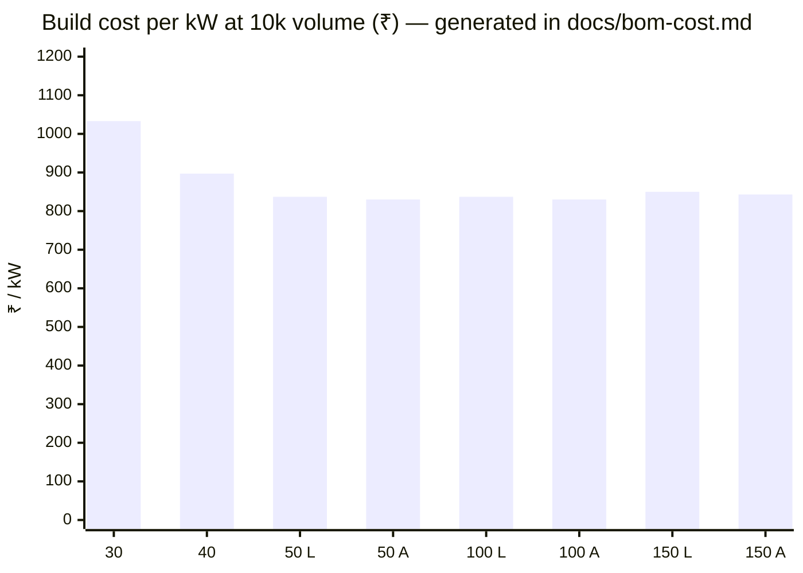
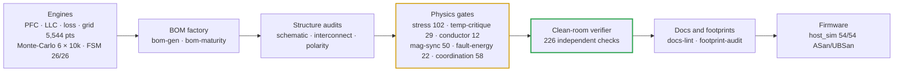
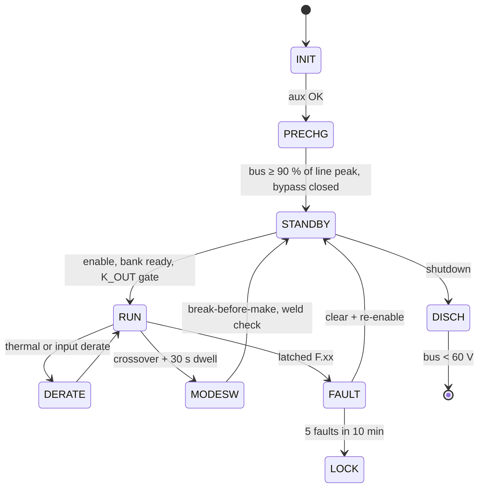

# DC-Modules

<sub>Engineering repository for the Vectivolt 30 / 40 / 50 kW SiC EV charging modules and the 100 / 150 kW products</sub>

<p>
  
  
  
</p>

<p align="center">
  
  
  
  
</p>
<p align="center">
  
  
  
  
  
  
</p>

> [!NOTE]
> **What this repository is** — a complete electrical design for a family of unidirectional AC → DC EV
> fast-charging modules, engineered end to end: every number traces to a runnable calculation, every waveform
> claim to a preserved ngspice netlist, every component to a schematic reference, and every rupee to a generated
> BOM line. **What it is not yet** — bench-validated or certified hardware (see [Honesty boundary](#honesty)).

## ⚡ The platform in sixty seconds

A module is **one AC-DC board (Vienna PFC) and one DC-DC board (three-phase LLC)** bolted face to face, run by
**one control card** — a single GD32G553VET7 brain that drives every PWM on the module (E40). Four module SKUs
share those boards, that card and one firmware image; the card learns which SKU it sits in from a single strap
resistor. Above the modules there are exactly two products (E55).

| | 30 kW | 40 kW | 50 kW liquid | 50 kW air | 100 kW | 150 kW |
|---|:---:|:---:|:---:|:---:|:---:|:---:|
| **Build** | 1 module | 1 module | 1 module | 1 module | 2 × 50 | 3 × 50 + CSU |
| **Output** | 150–1000 V · 100 A | · 133 A | · 167 A | · 167 A | · 333 A | · 500 A |
| **Cooling** | air · 2 fans | air · 3 fans | sealed coldplates | air · 4 fans | per module | per module |
| **₹ @10k** | 30,980 | 35,891 | 41,865 | 41,516 | 83,032 (air) | 1,26,382 (air) |
| **₹ / kW** | 1,033 | 897 | 837 | **830** | 830 | 843 |



## 🎯 Results against the specification

| Requirement | Target | Achieved | Evidence |
|---|---|---|---|
| Input | 3-φ 285–475 VAC | full power 330–475 VAC; 86 % constant-current derate at 285 VAC (a calculated trade that saves ~16 % of SiC, copper and EMI) | [architecture](docs/architecture.md) |
| Output | 150–1000 VDC, CV/CC | series/parallel banks with a 500/525 V crossover and 30 s dwell; phase-shift mode below 260 V per bank; ZVS on every simulated edge | [simulation report](docs/simulation-report.md) |
| Output current | per SKU | **100 / 133 / 167 A**; constant current below the 300 V knee, constant power above | [product structure](boards/README-product-structure.md) |
| THD | ≤ 5 % (stretch 3 %) | **0.59–1.05 %** at full power, 2.55 % at 25 % load (line-cycle control simulation) | [simulation report](docs/simulation-report.md) |
| Efficiency | peak ≥ 97 % | **peak 98.45–98.58 %** · full power at 400 VAC **97.19 / 96.92 / 96.68 / 96.82 %** | [thermal report](docs/thermal-report.md) |
| Thermal envelope | full power to +55 °C | 5,544 grid points (1,386 per module) with **0 violations**; worst Tj ≤ 150 °C with computed folds | [thermal report](docs/thermal-report.md) |
| Environment | match the market | **−30…+75 °C** (full power to 55 °C), ≤ 95 % RH non-condensing, ≤ 2000 m, conformal coating, IP55 fans | [benchmark §7](docs/competitive-benchmark-e51.md) |
| Accuracy | ±0.5 % V · ±1 % I | **±0.18 % / ±0.2 %** after the mandatory 2-point EOL calibration (10k-sample Monte-Carlo) | [verification matrix](docs/verification-matrix.md) |
| Protection | trips above every real peak | **F.01 120 / 155 / 195 A · F.11 85 / 115 / 145 A** — each ≥ 1.2 × the simulated worst peak; DESAT response 1.44 µs against a 2 µs SiC withstand | [current coordination](docs/current-coordination.md) |
| Magnetics copper | windings inside their Rac rows | Rac/Rdc ≤ 1.35 and ΔT ≤ 40 K on every winding at the simulated currents | [conductor selection](docs/conductor-selection.md) |

## 🏗️ Architecture

```mermaid
flowchart LR
  AC(["3-φ 285–475 VAC"]) --> EMI["gG fuses 80 / 125 / 160 A<br/>MOV Δ + GDT · CM + DM EMI"]
  EMI --> PRE["precharge<br/>2 × 33 Ω + bypass"]
  PRE --> V["Vienna PFC · 50 kHz<br/>750 V SiC pairs · 1200 V JBS"]
  V --> BUS[("split DC bus<br/>650–830 V · OVP 860 V")]
  BUS --> LLC["3-φ LLC · fr 140 kHz<br/>1200 V SiC half-bridges"]
  LLC --> XF["section transformers<br/>Lm 63 µH"]
  XF --> BK["banks A + B<br/>SiC JBS bridges"]
  BK --> SP["S/P matrix<br/>pre-insertion · K_OUT"]
  SP --> OUT(["150–1000 VDC<br/>100 / 133 / 167 A"])
  CARD["ONE control card<br/>GD32G553VET7 · RATING strap"] -. "40-way harness" .-> V
  CARD --- LLC
  AUX["110 W full-bus aux<br/>NCP1252D"] --> CARD
  BUS --> AUX
  style V stroke:#d19a00,stroke-width:2.5px
  style LLC stroke:#1a9fb3,stroke-width:2.5px
  style SP stroke:#b8732e,stroke-width:2.5px
  style CARD stroke:#2ea44f,stroke-width:2.5px
```



- **Two-board sandwich (E17).** TO-247 rows clamp outward onto two heatsink extrusions, or onto liquid coldplates
  on the 50 kW liquid SKU. Magnetics sit in the airflow tunnel between the boards. Power crosses on bolted
  DCP / DCN / PE stud pillars and control crosses on a 40-way harness.
  → [interconnect](docs/interconnect.md)
- **One brain per module (E40).** The card in the DC-DC slot runs the Vienna and the LLC together: 75 of 82 MCU
  pins, 22 analog channels, every PWM on HRTIMER units, one merged fault line. The RATING strap selects
  30 / 40 / 50 L / 50 A or the cabinet CSU role. → [control-card scope](docs/control-card-scope.md)
- **Protection in layers.** DESAT and comparator trips act in microseconds with no firmware in the loop. A
  hardware relay interlock and a watchdog that resets the MCU sit beside them. The supervisory F.xx ladder with
  per-SKU windows covers everything slower. → [protection thresholds](docs/protection-thresholds.md)

## 🧪 How every claim is checked

`sh calculations/run-all.sh` runs the whole battery in one pass. A single failure stops it.



| Also run on every change | Result |
|---|---|
| `review-checks.mjs` — every external-review and audit closure, as assertions | **142 pass** |
| `kicad5-verify.mjs` — pin-level check of the release schematics | **7,784 / 7,784 pins** across 6 targets |
| SPICE suites — power-solved LLC per SKU, CT front-ends, precharge / discharge, aux flyback | all pass · [toolchain](docs/simulation-toolchain.md) |
| `magnetics-rfq-audit.mjs` — every magnetic drawing complete enough to order | 0 missing fields |

<details>
<summary><b>The audit trail</b> — every layer earned its place by catching something real</summary>

| Found by | Defect | Fix (now frozen) |
|---|---|---|
| Double-pulse test (L1) | 33 nH assumed loop → 115 % V<sub>DS</sub> | ≤ 10 nH layout rule + RCD clamp to rail → 70 % (E5) |
| DPT energy feedback | measured k<sub>sw</sub> 2.2 × datasheet → Tj 175 °C at 100 kHz | switching frequency 100 → 50 kHz (E3) |
| Monte-Carlo §37 | 17.7 % of tanks miss peak gain | leakage-binned trim, gap-ground Lm, 500/525 V hysteresis, capability 1.39 (E7/E9) |
| S/P transient simulation | 2 V bank mismatch → 205 A through a closing contact | 10 Ω pre-insertion relays + ΔV rule (E12) |
| C firmware port | model masked a blind K_OUT closure → guaranteed OVP | E12b gate before K_OUT closes |
| R1 adversarial audit | 15 critical blockers | closed the same day (rev C) |
| R2 re-audit | 7 new criticals — a board with no 3.3 V source, mis-scaled sensing, … | closed the same day (rev D); the assertion suite began |
| R3 external PDF review | MCU pin numbering from an STM32-derived map | allocation regenerated from the GD32 datasheet |
| E35 margin audit | trim inductor unbuildable (~43 W core loss); drawings short of their own copper | magnetics rev B/C, catalog CT/CMC adoption |
| E37 interconnect audit | RATING strap hard-coded; connector bought as two unmateable headers | per-SKU straps, mating pair — cabinet-aware gate in run-all |
| E39 cabinet re-verification | cabinet bus on the wrong studs; no CAN SGND conductor; CSU supply wrong for a 400 V line-to-line feed | OUTP/OUTN bus, SGND chain, wide-range DIN supply |
| E40 single-brain migration | two cards per module doubled every way, pin and link | one card per module; −₹293 per module measured |
| E41 stress validation | the registered 40 kW choke was unbuildable; the 100 A fuse failed its derate rule | 5-stack D1-40 + 125 A class; stress-audit joins run-all |
| E42 liquid closure | at the revved 50 kW trip points both CT burdens clipped the 3.3 V ADC rail | burdens re-scaled; BRD check family added |
| E43 family verification | the DM choke had no engine — its inherited 22 µH could not exist at the line crest | dm-choke engine, crest-biased floors, CX2 → 4.7 µF, LISN rebuilt: +4.9 / +5.7 / +5.6 dB |
| R4 external review (E45) | fictional NSI6611 / NCP1252 pin maps, floating driver bias, wrong-sign aux feedback, an unpowered 3.3 V island | all fixed and gated R4-1…R4-8; the "reversed diodes" were one rendering defect |
| R5 external review (E46) | watchdog only inhibited a hung MCU; missing DESAT series resistors; an MCU order code that does not exist | WDO wired onto NRST; 100 Ω DESAT resistors; second exclusion stage; VET7 |
| R6 external review (E47) | aux controller could not cold-start (A-suffix); watchdog merge invisible on the sheet | NCP1252D + 220 µF; renamed WDO net; two-phase discharge timeline |
| R7 external review (E48) | phases B and C shared one comparator's two inputs | AIN9 ↔ AIN11 swap — three independent comparators |
| R8 external review (E49) | our own discharge arithmetic (parallel balance strings) and two turns transcriptions | per-SKU discharge model, 7:7:7 / 6:6:6 panels, retraction registered |
| E51 magnetics recompute | transformer windings demanded 142–294 % of real formers | compacted litz + foil on catalog E70 formers |
| E56 KiCad-native face | a mirrored importer silently mis-wired 454 pins | EasyEDA layer removed; 7,784 / 7,784 pins verified |
| E58 temperature critique | temperature-blind loss fits; inverted digitized B-H labels | measured 3C95 surfaces; equilibria and runaway computed every run |
| **E60 coordination + copper** | the LLC deck had no body diodes (±6 kV legs); trips at or below real peaks; foils at Rac/Rdc 5–7 | power-solved decks, new trip classes, 22/47 pF blanks, 0.10/0.127 mm foil, E70 trims |

</details>

## 🧩 The module family

<details>
<summary><b>Variant specification table</b> — every number engine-derived and gate-verified</summary>

| Specification | 30 kW | 40 kW (E41) | 50 kW liquid (E42) | 50 kW air (E44) |
|---|---|---|---|---|
| Rated power · max output current | 30 kW · 100 A | 40 kW · 133 A | 50 kW · 167 A | 50 kW · 167 A |
| Worst continuous line current | 55.9 A | 73.3 A | 91.6 A | 91.6 A |
| Efficiency — full power at 400 VAC | 97.19 % | 96.92 % | 96.68 % | 96.82 % |
| Efficiency — peak | 98.45 % | 98.49 % | 98.46 % | 98.58 % |
| Loss at rated | 866 W | 1,273 W | 1,717 W | 1,642 W |
| Cooling | 2 fans | 3 fans | 2 coldplates · 0 fans · ≤ 60 °C coolant · 6 L/min | 4 fans (3 front + 1 rear) |
| Vienna silicon | single 750 V SiC pair / position | paralleled pairs | paralleled pairs | paralleled pairs |
| PFC choke D1 | 3 × 0077908A7 · N = 39 | 5 × 0077908A7 · N = 26 | 5 × 0077908A7 · N = 24 | = 50 kW liquid |
| LLC silicon | 6 × SG2M023120LJ | 6 × | 6 × (the coldplate buys it) | 12 × — paralleled pairs |
| LLC tank (fr 140 kHz) | 4 × 46 nF · 4.0 µH trim (2 × PQ50) | 6 × 33 nF · 3.5 µH (1 × E70) | 8 × 27 nF · 3.0 µH (2 × E70) | = 50 kW liquid |
| Transformer per section | 3 × PQ50/50 · 7:7:7 · foil 0.10 mm | 2 × E70 · 6:6:6 · foil 0.127 mm | 2 × E70 · 5:5:5 · foil 0.127 mm | = 50 kW liquid |
| Trip classes F.01 · F.11 | 120 · 85 A pk | 155 · 115 A pk | 195 · 145 A pk | = 50 kW liquid |
| DM choke D6 + CX2 · worst DM margin | 2 × T48 N = 7 · +4.9 dB | 2 × T57 N = 8 · +5.7 dB | 3 × T57 N = 8 · +5.6 dB | = 50 kW liquid |
| Input fuse (gG) | 80 A · 22 × 58 | 125 A · 22 × 58 | 160 A · NH00 | 160 A · NH00 |
| Output relay K_OUT | 1 × 200 A | 1 × 200 A | 2 × 200 A with series-mirror readback | 2 × 200 A |
| DC link · bank strings | 10 cans · 2 per bank | 12 · 3 | 16 · 4 | 16 · 4 |
| Bus discharge to < 60 V | 2.0 s (F.21 window 3 s) | 2.4 s (4 s) | 3.2 s (5 s) | 3.2 s (5 s) |
| RATING strap | 0 Ω | 1 k | 10 k | 15 k |
| **BOM @10k · ₹/kW** | **₹30,980 · 1,033** | **₹35,891 · 897** | **₹41,865 · 837** | **₹41,516 · 830** |

</details>

The **air line stops paying at 40 kW**. The 50 kW liquid SKU deletes every fan and runs the same silicon as the
40, while the 50 kW air twin parallels the LLC pairs instead. Multi-module products share current by commanded
constant current over CAN, with staggered starts and graceful degrade when a module drops out. A 150 keeps 67 % of
its power with one module out; a 100 keeps 50 %. → [product structure](boards/README-product-structure.md)

## 📦 Deliverables

The release face is the audited **KiCad-5 set** in `kicad5/`, rendered to print-fidelity PDFs in
[`boards/out-pdf/`](boards/out-pdf/):

| PDF | Contents |
|---|---|
| `DC-Modules 30kW AC-DC` · `30kW DC-DC` | the 30 kW module pair |
| `DC-Modules 40kW AC-DC / DC-DC (E41)` | 40 kW air |
| `DC-Modules 50kW … (E42 liquid)` · `50kW-Air … (E44)` | the two 50 kW twins |
| `DC-Modules Control Card (GD32G553VET7)` | the one card, every seat |
| `DC-Modules 150kW Cabinet (3x50kW + CSU)` | the cabinet interconnect of record |

## 🚀 Quickstart

```bash
# prerequisites: node ≥ 20, ngspice ≥ 46 (brew install ngspice), a C compiler
npm install
```

```bash
# reproduce every calculation, audit, BOM, verifier and the firmware suite
sh calculations/run-all.sh
```

```bash
# build one board netlist (netlist mode — PCB layout is a later phase, E36)
TSCI_NO_ROUTE=1 npx tsci build boards/30kw/acdc.tsx --ignore-placement-drc --ignore-routing-drc
```

```bash
# regenerate release schematics and PDFs for one target (30kw | 40kw | 50kw | 50kwa | control-card | cabinet)
node calculations/sheet-pages.mjs 30kw && node calculations/sheet-netlist-gen.mjs 30kw && node calculations/kicad5-gen.mjs 30kw && node calculations/kicad5-verify.mjs 30kw && node calculations/kicad5-print.mjs 30kw && node calculations/sheets-to-pdf.mjs
```

```bash
# the SPICE evidence suites
node spice/llc/llc-run.mjs 30kw 40kw 50kw 50kwa && node spice/protection/ct-frontend.mjs && node spice/protection/prechg-disch.mjs && node spice/aux/aux-flyback.mjs
```

## 💾 Supervisory firmware

Portable **C99** with no HAL dependency (`firmware/core/`): the module state machine, the protection evaluator,
the CAN 2.0B codec and the CSU cabinet supervisor. One image serves every seat. The host suite runs **54 cases
under ASan/UBSan**: 26 fault scenarios, rating windows, the E60 coordination rules, 10 CSU scenarios, codec guards
and a 100k-frame fuzz. → [firmware guide](docs/firmware-guide.md) · [CAN protocol](docs/can-protocol.md)



## 📚 Documentation

Start at the **[documentation hub](docs/README.md)** — 49 documents in five families, each with a banner, a
status badge and next/previous navigation.

| Start here | To understand |
|---|---|
| [Platform architecture](docs/architecture.md) | the module in one read |
| [Decision register](docs/assumptions.md) | every frozen decision E1–E62, with provenance and invalidator |
| [Current & protection coordination](docs/current-coordination.md) | the worst current in every magnetic and switch against its trip |
| [Magnetics drawings](docs/magnetics.md) · [RFQ pack](docs/magnetics-manufacturing-pack.md) | the custom parts and how to buy them |
| [Simulation toolchain](docs/simulation-toolchain.md) | which tool proves what, and where fidelity ends |
| [EVT test plan](docs/evt-plan.md) | the bench campaign T-00…T-32 |
| [BOM & cost](docs/bom-cost.md) | the generated cost roll-up and ₹/kW ladder |
| [Prototype fast path](docs/prototype-fast-path.md) | catalog parts that shorten the first build |

<a name="honesty"></a>

## ⚖️ Honesty boundary

> [!IMPORTANT]
> **If it wasn't executed, it isn't claimed.** Nothing here is called *verified* without an executed artifact in
> this repository, and *bench-validated*, *certified* and *production-released* appear nowhere as claims.

Specified and packaged, but physically waiting on hardware, labs or third parties:

- 🔧 **PCB layout** — parked by directive (E36); the schematics carry the layout rules.
- 🔬 **EVT T-00…T-32** — double-pulse bench, both-polarity short-circuit timing, thermal and EMI chambers, protection
  injection, first-article winding Rac, a −30 °C cold soak.
- 📜 **Compliance certification** — a lab and certification-body activity.
- 🤝 **Vendor RFQ pricing** — BOM prices are RFQ targets (±25 %) until quotes land.
- 🖥️ **MCU HAL bring-up** — the C99 logic is host-proven; binding to peripherals happens on silicon.

## 🗺️ Roadmap

- [x] Frozen decision register E1–E62
- [x] Simulation matrix closed — power-solved LLC per SKU, cycle-by-cycle Vienna, current coordination, AC copper
- [x] Release schematics — six KiCad-5 targets, 7,784 / 7,784 pins, ten board PDFs
- [x] Product structure — 30 / 40 / 50 L / 50 A modules, 100 kW = 2 × 50, 150 kW = 3 × 50 + CSU
- [x] Three adversarial audits and five external review rounds answered with executed fixes and permanent gates
- [ ] RFQ round 1 (SiC, magnetics, relays) → cost closure
- [ ] PCB layout under the sandwich envelope
- [ ] Prototype build ([fast path](docs/prototype-fast-path.md)) → EVT → model recalibration
- [ ] Compliance campaign → certification

---

<div align="center">
<sub><a href="docs/README.md">Documentation Hub →</a></sub>

<sub>Vectivolt DC-Modules · documentation rev E61 · every number reproduces with <code>sh calculations/run-all.sh</code></sub>
</div>
