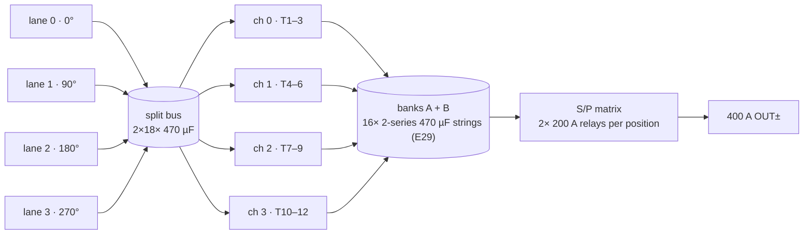

# 120 kW Board Pair — RETIRED REFERENCE ⚠️

**The 120 kW product is a cabinet: 4 × 30 kW modules + one CSU card**
([product structure](../README-product-structure.md), register E39). This single-board pair is
kept only as the reference that *proved why*: a 4-lane machine needs 24 HRTIMER-grade PWMs
against the card's 16, 17 analog ways against 13, and a 872×1062 mm DC-DC board — the arithmetic
lives in [`docs/control-card-scope.md`](../../docs/control-card-scope.md). `120kw/` deliberately
does not build (`cardMap()` refuses 4 lanes) and is outside `BUILDABLE_SKUS`.

| Spec | Value |
|---|---|
| Output | 150–1000 VDC · **400 A max** |
| Boards | AC-DC 560×600 mm · DC-DC 640×620 mm |
| Cells | 4 lanes @ **0/90/180/270°** · 12 LLC legs · 12 sections |
| COGS @1k | **₹114,833** BOM-exact |
| Exports | [`out/acdc-schematic.svg`](out/acdc-schematic.svg) · [`out/dcdc-schematic.svg`](out/dcdc-schematic.svg) · netlists |

## The 4-lane symphony 🎼

- **90° carrier spacing** pushes the first surviving DM ripple harmonic to **200 kHz**, where the
  three-stage filter already provides ~49 dB — the quantified reason the 120 kW EMI story is the
  *easiest* of the family ([lisn-precompliance.csv](../../calculations/out/lisn-precompliance.csv)).
- **Two MCUs, exactly full**: 12 PFC PWMs + 12 LLC half-bridge pairs consume the HRTIM resources
  completely (`PWM_A0…C3` = pins 55–66; `PWM_L1H…L12L` = pins 50–73). The build-time assert is the
  proof — a 13th channel throws. This ceiling also decided E11: timer-driven SR was impossible
  here, so JBS rectification is the family baseline.
- **Relays parallel, honestly**: 400 A through one 1000 V contact isn't a sane part — K_SER/PARA/
  PARB/K_OUT are each **2× 200 A in parallel**, made only at matched voltage per the FSM (E12b), so
  contacts never *make* current, only carry it. Encoded in the BOM as `qtyMul: 2` overrides.
- **Light-load elegance**: channels shed — at 5 % load the module idles on one 3-φ channel,
  serving the standby and light-load efficiency targets.

## Numbers that define this SKU

| Quantity | Value | Where proven |
|---|---|---|
| Bus current across pillars | 156 A | [`busbar.csv`](../../calculations/out/busbar.csv) — stud joints ≤50 µΩ, EOL milliohm test |
| Per-lane phase current @330 V | 55 A rms (same as 30 kW — that's the point) | envelope grid |
| DC link | 2×18× 470 µF (3 bank groups) | `SplitDcLink` instances |
| Rectifier dies | 96× 1200 V/20 A JBS | BOM |
| Loss @ rated | 3,081 W → η 97.5 % | [`loss-budget.csv`](../../calculations/out/loss-budget.csv) |
| Fans | 4× 120×38 on static-pressure curve | [`thermal-report.md`](../../docs/thermal-report.md) |

## Top cost drivers (@1k, [`bom-120kw.csv`](../../calculations/out/bom-120kw.csv))

| MPN | Description | Qty | ₹/unit | ₹ ext |
|---|---|---|---|---|
| `IND-PFC-165u` | PFC chokes (family p/n) | 12 | 1035 | **12,420** |
| `SG2M023120LJ` | 1200 V 23 mΩ SiC (LLC) | 24 | 390 | **9,360** |
| `SICJBS-1200-20` | secondary JBS bridges | 96 | 90 | **8,640** |
| `XFMR-LLC-10K` | LLC transformer stacks | 12 | 680 | **8,160** |
| `B3M010C075Z` | 750 V 10 mΩ SiC (PFC) | 24 | 330 | **7,920** |
| `ELH-470u450` | 470 µF/450 V snap-in (bus + 2-series bank strings, E29) | 68 | 150 | **10,200** |
| `PP-44n-1200` | resonant pulse film | 48 | 68 | **3,264** |
| `NSI6611` | iso gate drivers | 36 | 85 | **3,060** |
| `SICJBS-1200-40` | PFC boost JBS | 24 | 120 | **2,880** |
| `HFE82V-CLASS` | relays, 2× 200 A per position | 8 | 780 | **6,240** |

Magnetics dominate here (₹20.6k of family-p/n parts) — the quantified **partial de-commonization
lever** (12→6 larger chokes, −₹6.1k) is on the table in
[`docs/bom-cost.md`](../../docs/bom-cost.md) if 120 kW volume ever justifies breaking the family.
