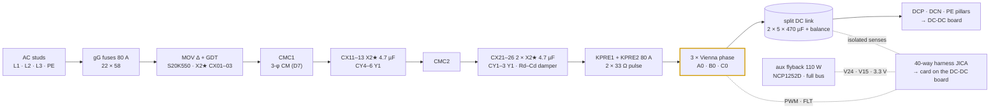
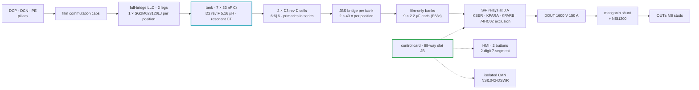

# 📋 30 kW Module Walkthrough

The canonical board pair, cell by cell — every cell reused unchanged across the family

  
  
  

> [!NOTE]
> **Purpose** — the canonical cell-level walkthrough of one module. Every cell explained here is instantiated
> unchanged across the family; the 40 and 50 kW SKUs differ only in the deltas recorded in register rows E41, E42,
> E44 and E67–E69 and in the variant tables of [magnetics](../../docs/magnetics.md).

## At a glance

| | |
|---|---|
| **Input** | 3-φ 285–475 VAC — full power from 330 VAC, 86 % constant-current derate at 285 VAC (E1) |
| **Output** | 150–1000 VDC · **100 A max** · CV/CC · two output modes: LOW ≤ 500 V (banks parallel) / HIGH ≥ 500 V (series), set in standby (E67) |
| **Boards** | AC-DC and DC-DC both **440 × 500 mm, 6-layer** (E81 F-H-5 — the earlier 420 × 300 / 460 × 320 line described a smaller board than the BOM prices), face to face |
| **Cells** | 1 Vienna lane (3 phases, one 750 V 20 mΩ-class die per position) · 1 full-bridge LLC (two legs, one SG2M023120LJ per position) |
| **Control** | one control card in the DC-DC slot (JB); the AC-DC board has only the 40-way harness header (JICA) |
| **Fast trips** | F.01 line 120 A pk · F.11 tank 140 A pk (one window comparator) · DESAT on every SiC switch |
| **Performance** | η **96.38 %** at 400 VAC full power (E81 ledger) · peak **97.80 %** · worst LLC Tj **149 °C** outside the registered fold set · MTBF ≈ **410 kh** |
| **Cost** | **₹31,533 @10k** (₹38,832 @1k) · China RFQ target ₹25,852 — [cost roll-up](../../docs/bom-cost.md) |
| **Release sheets** | `DC-Modules 30kW AC-DC (Vienna PFC)` and `30kW DC-DC (full-bridge LLC)` in [`boards/out-pdf/`](../out-pdf/) · KiCad-5 set `kicad5/DC-Modules-30kw-SHIP.zip` |

## 1. 🔻 AC-DC board — [`acdc.tsx`](acdc.tsx)

| Cell (source) | What it is | The engineering inside |
|---|---|---|
| EMI filter (E68b) | conducted emissions | two 3-φ CM chokes (D7) with a 4.7 µF X2 star stage on each side and two at the converter (12 X2 in all), a Y1 trio at two nodes, and the Rd–Cd damper (2.2 µF X1 + 10 Ω 25 W) that keeps the current loop stable — no DM chokes, as InfyPower ships it; DM margin +32.9 dB |
| `ViennaPhase` × 3 | one PFC phase | 165 µH-class sendust choke, 3 × 0077908A7, N = 39 ± 1 lot-trim ([D1](../../docs/magnetics.md)); **common-source 750 V 20 mΩ-class SiC pair**, one die per position, clip-mounted on Al2O3 (E68a/E69a; RFQ acceptance IDM ≥ 210 A); two 1200 V / 40 A JBS diodes to the rails; 10 Ω + 100 pF RC snubber **and** an RCD clamp per node |
| `DriverCh` × 3 | isolated gate channel | NSI6611 (DESAT, Miller clamp, UVLO, soft-off) · split Rg 4.7 / 4.7 Ω (E5) · **+15 / −3 V** from a reinforced QA01C-15 / QA02C-15 bias module (E81 decision 8 — the second source's static maximum; O-11 closed) · two series 1 kV DESAT diodes + **47 pF blank** (E60) + 100 Ω series resistor (R5-B) · gate pull-down · Kelvin return |
| `SplitDcLink` | energy buffer | 2 × 5 × 470 µF / **500 V** snap-in (E81 decision 6: worst continuous half 435 V = 87 % of 500 V; 450 V cans remain a listed −₹300 lever at 97 % of rating), balance resistors, sensed midpoint; window 650–830 V, **hardware OVP 860 V** (E2); **16 × 1 µF bridge entry film + 2.2 µF / 0.33 Ω RC damper** (E81 F-G-1) and per-phase film commutation caps (CB-9) |
| precharge | inrush control | 33 Ω in **two lines** plus a 2-pole bypass (E14b); t₉₅ ≈ 193 ms on the per-SKU deck |
| discharge | touch safety | 640 Ω active path with a 1200 V SiC switch, default-OFF (E19): 830 → 60 V in **2.0 s** with AC present |
| `CtSensor` × 3 | phase current | Talema ACX-1100 1:2500 line CTs + **22 Ω burden** (E60) → ADC and the on-chip comparators (F.01 120 A pk) |
| `IsoVSense` × 5 | AC and bus sense | anti-surge resistor chain inside the measured domain + isolated amplifier + isolated 5 V bias (E25 / CB-3) |
| `AuxPower` | house power | 110 W full-bus flyback: NCP1252**D**, 220 µF VCC reservoir, D4 rev E on ETD44; brown-in 321 V; V24 / V15 / 3.3 V |
| harness header `JICA` | control boundary | the 40-way PFC bundle to the card; default-OFF pull-downs on every enable, relay drive and PWM at the receiving end — see [interconnect](../../docs/interconnect.md) |

## 2. 🔺 DC-DC board — [`dcdc.tsx`](dcdc.tsx)

| Cell | What it is | The engineering inside |
|---|---|---|
| `LlcHalfBridgeLeg` × 2 | full-bridge legs (E67) | one SG2M023120LJ 1200 V / 23 mΩ per position, clip-mounted (E68a; RFQ acceptance **IDM ≥ 265 A** — at E81 the gated kill peak is **203 A at +0.5 µs**, 101 % of the C3M proxy's 200 A and 77 % of that acceptance line, which is therefore the binding RFQ line of this SKU), Rg 4.7 / 0 Ω off with a **330 pF C0G turn-off snubber per die** (E81), **22 pF DESAT blank** (E60); PFM from ≈ 83 kHz to ≈ 200 kHz down to the shipped fn floor 0.55, then phase shift of leg B at 1.45·fr; **ZVS held by the per-leg adaptive dead time on the non-linear C_oss** (E81 — the earlier "ZVS on every simulated edge" rested on a linear C_oss; the light-load corners are T-58's, and at the phase-shift corners the weak leg hard-switches) |
| `LlcTank` | resonant tank | Cr = 7 × 33 nF / 1200 V PP film · **D2 rev F external Lr 5.16 µH ± 3 %** (2 × E70, N 5, 8000 × 0.05 mm litz, no bins) · one resonant CT + **0.47 Ω burden** + window comparator U1W (F.11 140 A pk, both polarities) |
| transformer | isolation | **two D3 rev D cells** (2 × E70 each, 6:6∥6), primaries in series (n = 2), each S1–P–S2 with S1 ∥ S2 to one bank; TIW-served litz primary, copper-foil halves, VPI class H, both yoke faces bonded; PD ≥ 2.0 kV ([D3](../../docs/magnetics.md)) |
| JBS bridges | rectification | 16 × GC4D20120D 1200 V / 40 A — two per bridge position, one bridge per bank; diodes over synchronous rectification (on the full bridge SR loses 109 W more) |
| banks (E68c) | output filter | 9 × 2.2 µF 630 V film straight across each bank — no inductor, no electrolytic; ≤ 3.83 A per film and 0.47 % RMS output ripple at the worst corner |
| `SeriesParallelRelayMatrix` | output modes | KSER · KPARA / KPARB 120 A PCB relays switched **only at zero current** behind the output diode (E67) · two-stage 74HC02 hardware exclusion (R5-D); a welded KPARA shows as F.17 at the SER soft start |
| DOUT | output blocking diode | 1600 V / 150 A-class insulated module (InfyPower practice): back-feed and reverse-battery proof without K_OUT; 100 A = 67 % of class, Tj 115 °C |
| `OutputShunt` | current truth | manganin + NSI1200 isolated amplifier, Kelvin taps; ± 0.2 % after EOL calibration (Monte-Carlo) |
| `ConfigHmi` | field configuration | 2 buttons + 2-digit display via 74HC595 + 2 NPN multiplexers — address, group, `F.xx` paging |
| `IsolatedCan` | external world | CAN 2.0B, 125 kbps, 29-bit, isolated + CM choke + TVS + jumpered 120 Ω ([protocol](../../docs/can-protocol.md)) |
| `CoilDriver` | relay drive | 24 V coils, flyback-clamped, economised to ~40 % hold after pull-in |

## 3. Control interface (E40 — one brain per module)

The card sits only in the DC-DC board's 88-way `JB` slot and runs both boards: the two LLC legs on HRTIMER pairs, the
three Vienna PWMs over the harness, resonant and line CTs, bank / output senses, S/P relay drives and readbacks, HMI
and isolated CAN. The pin map is generated by `calculations/control/umod-pinmap.mts` (74 of 82 MCU pins, 8 spare), and the
module-interconnect audit proves every way lands on real electronics on both sides.

## 4. Protections on this pair

| Layer | On this module |
|---|---|
| **Hardware, µs** | line CT comparators F.01 120 A pk → HRTIMER kill · tank window comparator F.11 140 A pk (both polarities) · DESAT on every SiC switch · bus OVP 860 V · output OVP · driver UVLO (aux collapse holds gates low) |
| **Safety chain** | watchdog WDO ≡ NRST (a hung brain restarts with enables low) · GATE_EN chains with default-OFF pull-downs across the harness · two-stage relay exclusion |
| **Supervisory** | the full F.xx ladder ([protection thresholds](../../docs/protection-thresholds.md)), exercised by the 26-scenario suite and the C firmware (**291 checks** under ASan/UBSan) |

## 5. Top cost drivers (@10k, from [`bom-30kw.csv`](../../calculations/out/bom-30kw.csv))

| MPN | Description | Qty | ₹ / unit | ₹ ext |
|---|---|---:|---:|---:|
| `IND-PFC-165u` | PFC choke D1-30, 3 × 0077908A7 sendust | 3 | 828 | **2,484** |
| `CMC-3PH-2mH-SKU` | 3-φ CM choke D7 (two stages) | 2 | 1,062 | **2,124** |
| `GC4D20120D` | SiC JBS 1200 V 40 A (6 boost + 16 secondary) | 22 | 96 | **2,112** |
| `XFMR-LLC-CELL-2E70-30` | D3-30 rev D transformer cell | 2 | 935 | **1,870** |
| `ELH-470u500` | 470 µF **500 V** snap-in (DC link, E81) | 10 | 148 | **1,480** |
| `SG2M023120LJ` | SiC MOSFET 1200 V 23 mΩ (LLC) | 4 | 312 | **1,248** |
| `PP-1u-1100` | 1 µF 1100 V film (DC-link entry, E81 F-G-1) | 16 | 54 | **870** |
| `SIC-750V-20mR` | SiC MOSFET 750 V 20 mΩ class (Vienna) | 6 | 144 | **864** |
| `IND-LR-E70-30` | D2-30 rev F external resonant inductor | 1 | 772 | **772** |

Mechanical lines (assembly and EOL ₹1,653 · heatsinks ₹1,305 · the two 440 × 500 mm 6-layer PCBs ₹2,350 · enclosure
₹870 · busbars, studs and harness ₹630 · clip-mount TIM ₹418) and the lever plan are in the
[cost roll-up](../../docs/bom-cost.md); the method is in the [BOM guide](../../docs/bom-guide.md).

> [!TIP]
> **How this page is checked** — `kicad5-verify` (1,682 / 1,682 pins on this pair), `schematic-check`, `polarity-audit` and `module-interconnect-audit` on the built netlists; the cost lines come from the generated `calculations/out/bom-30kw.csv`.

---

<a href="../README-module-family.md">← Module Family</a> &nbsp;·&nbsp; <a href="../../docs/README.md">🧭 Documentation hub</a> &nbsp;·&nbsp; <a href="../../docs/protection-thresholds.md">Protection Thresholds →</a>

Vectivolt DC-Modules · documentation rev E81 · every number reproduces with <code>sh calculations/run-all.sh</code>

