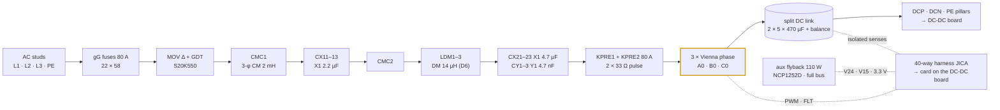
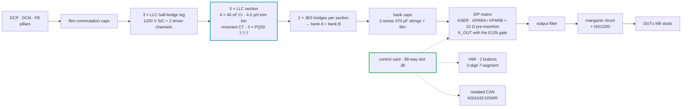

# 📋 30 kW Module Walkthrough

The canonical board pair, cell by cell — every cell reused unchanged across the family

  
  
  

> [!NOTE]
> **Purpose** — the canonical cell-level walkthrough of one module. Every cell explained here is instantiated
> unchanged across the family; the 40 and 50 kW SKUs differ only in the deltas recorded in register rows E41, E42
> and E44 and in the variant tables of [magnetics](../../docs/magnetics.md).

## At a glance

| | |
|---|---|
| **Input** | 3-φ 285–475 VAC — full power from 330 VAC, 86 % constant-current derate at 285 VAC (E1) |
| **Output** | 150–1000 VDC · **100 A max** · CV/CC · automatic series/parallel banks |
| **Boards** | AC-DC 420 × 300 mm (6-layer) · DC-DC 460 × 320 mm (6-layer), face to face |
| **Cells** | 1 Vienna lane (3 phases) · 1 LLC channel (3 legs + 3 sections) |
| **Control** | one control card in the DC-DC slot (JB); the AC-DC board has only the 40-way harness header (JICA) |
| **Fast trips** | F.01 line 120 A pk · F.11 tank 85 A pk · DESAT on every SiC switch |
| **Cost** | **₹30,980 @10k** (₹38,279 @1k) — [cost roll-up](../../docs/bom-cost.md) |
| **Release sheets** | 30 kW AC-DC and DC-DC PDFs in [`boards/out-pdf/`](../out-pdf/) · KiCad-5 set `kicad5/DC-Modules-30kw-SHIP.zip` |

## 🔻 AC-DC board — [`acdc.tsx`](acdc.tsx)

| Cell (source) | What it is | The engineering inside |
|---|---|---|
| `ViennaPhase` × 3 | one PFC phase | 165 µH-class sendust choke, 3 × 0077908A7, N = 39 ± 1 lot-trim ([D1](../../docs/magnetics.md)); **common-source 750 V SiC pair** (B3M010C075Z × 2) on one driver channel; two 1200 V / 40 A JBS diodes to the rails, which block the full bus; 10 Ω + 100 pF RC snubber (2 W) **and** an RCD clamp per node — the network that took double-pulse overshoot from 115 % to **70 %** |
| `DriverCh` × 3 | isolated gate channel | NSI6611 (DESAT, Miller clamp, UVLO, soft-off) · split Rg 4.7 / 4.7 Ω (E5) · +18 / −4 V drawn from a reinforced QA01C-18 bias module (the catalogue part is +18 / −3 V — O-11 open at §K) · two series 1 kV DESAT diodes + **47 pF blank** (E60) + 100 Ω series resistor (R5-B) · gate pull-down · Kelvin return |
| `SplitDcLink` | energy buffer | 2 × 5 × 470 µF / 450 V snap-in (415 V max per half, −40 °C category), balance resistors, sensed midpoint; window 650–830 V, **hardware OVP 860 V** (E2); per-phase film commutation caps (CB-9) |
| precharge | inrush control | 33 Ω in **two lines** plus a 2-pole bypass — a single-line resistor is a three-wire fallacy (E14b); t₉₅ ≈ 193 ms on the per-SKU deck |
| discharge | touch safety | 640 Ω active path with a 1200 V SiC switch, default-OFF through its DCN-referenced pull-down (E19): 830 → 60 V in **2.0 s** with AC present |
| `CtSensor` × 3 | phase current | Talema ACX-1100 1:2500 line CTs + **22 Ω burden** (E60) → ADC and the on-chip comparators (F.01 120 A pk) |
| `IsoVSense` × 5 | AC and bus sense | anti-surge resistor chain **inside the measured domain** + isolated amplifier + isolated 5 V bias (E25 / CB-3): AC against an artificial star, bus and midpoint against DCN |
| `AuxPower` | house power | 110 W full-bus flyback (E26 rev C): NCP1252**D**, 220 µF VCC reservoir, D4 rev D on ETD39; brown-in 321 V; V24 / V15 / 3.3 V; re-simulated per SKU at 342 / 560 / 850 V |
| harness header `JICA` | control boundary | the 40-way PFC bundle to the card; default-OFF pull-downs on every enable, relay drive and PWM at the receiving end — see [interconnect](../../docs/interconnect.md) |

## 🔺 DC-DC board — [`dcdc.tsx`](dcdc.tsx)

| Cell | What it is | The engineering inside |
|---|---|---|
| `LlcHalfBridgeLeg` × 3 | resonant legs | SG2M023120LJ 1200 V / 23 mΩ pair, Rg 4.7 / 2.2 Ω (E6), **22 pF DESAT blank** (E60); PFM from ≈ 80 kHz at the gain-critical corner to ≈ 180 kHz, phase shift at low bank voltage; **ZVS on every edge of every power-solved corner** |
| `LlcSection` × 3 | tank and isolation | Cr = 4 × 46 nF / 1200 V pulse polypropylene · trim inductor D2-30 (2 × PQ50, N = 4, 1350 × 0.1 litz) **binned against the mated transformer's measured leakage** · resonant CT + **1.2 Ω burden** (F.11 85 A pk) · transformer **3 × PQ50/50, 7:7:7**, Lm 63 µH ± 7 %, 0.071 mm litz primary + 0.10 mm foil secondaries, reinforced barrier, PD-sampled ([D2 / D3](../../docs/magnetics.md)) |
| JBS bridges | rectification | 24 × C4D20120D 1200 V / 20 A across the three sections — diodes over synchronous rectification on a quantified ₹/W (E11; SR stays a premium variant) |
| `SeriesParallelRelayMatrix` | range extension | K_SER · K_PARA / K_PARB with **10 Ω pulse-rated pre-insertion** (a hard close across a 2 V mismatch is 205 A — simulated, E12) · **K_OUT with the E12b gate** · mirror contact readback on every relay (E30) · two-stage 74HC02 hardware exclusion (R5-D) |
| `OutputShunt` | current truth | manganin + NSI1200 isolated amplifier, Kelvin taps; ± 0.2 % after EOL calibration (Monte-Carlo) |
| `ConfigHmi` | field configuration | 2 buttons + 2-digit display via 74HC595 + 2 NPN multiplexers — address, group, `F.xx` paging |
| `IsolatedCan` | external world | CAN 2.0B, 125 kbps, 29-bit, isolated + CM choke + TVS + jumpered 120 Ω ([protocol](../../docs/can-protocol.md)) |
| `CoilDriver` | relay drive | 24 V coils, flyback-clamped, economised to ~40 % hold after pull-in |

## Control interface (E40 — one brain per module)

The card sits only in the DC-DC board's 88-way `JB` slot and runs both boards: LLC pairs on HRTIMER units, the
three Vienna PWMs over the harness, resonant and line CTs, bank / output senses, S/P relay drives and readbacks, HMI
and isolated CAN. The pin map is generated by `calculations/control/umod-pinmap.mts` (75 of 82 MCU pins), and the
module-interconnect audit proves every way lands on real electronics on both sides.

## Protections on this pair

| Layer | On this module |
|---|---|
| **Hardware, µs** | line CT comparators F.01 120 A pk → HRTIMER kill · resonant CT comparators F.11 85 A pk · DESAT on every SiC switch · bus OVP 860 V · output OVP · driver UVLO (aux collapse holds gates low) |
| **Safety chain** | watchdog WDO ≡ NRST (a hung brain restarts with enables low) · GATE_EN chains with default-OFF pull-downs across the harness · two-stage relay exclusion |
| **Supervisory** | the full F.xx ladder ([protection thresholds](../../docs/protection-thresholds.md)), exercised by the 26-scenario suite and the C firmware (**54 / 54** under sanitizers) |

## Top cost drivers (@10k, from [`bom-30kw.csv`](../../calculations/out/bom-30kw.csv))

| MPN | Description | Qty | ₹ / unit | ₹ ext |
|---|---|---:|---:|---:|
| `IND-PFC-165u` | PFC choke D1-30, 3 × 0077908A7 sendust | 3 | 828 | **2,484** |
| `ELH-470u450` | 470 µF 450 V snap-in, −40 °C category (DC link + bank strings) | 18 | 120 | **2,160** |
| `SG2M023120LJ` | SiC MOSFET 1200 V 23 mΩ TO-247-4L | 6 | 312 | **1,872** |
| `C4D20120D` | SiC JBS 1200 V 20 A (secondary bridges) | 24 | 72 | **1,728** |
| `XFMR-LLC-10K` | LLC section transformer 3 × PQ50/50, 7:7:7 | 3 | 544 | **1,632** |
| `B3M010C075Z` | SiC MOSFET 750 V 10 mΩ TO-247-4 | 6 | 264 | **1,584** |
| `PP-46n-1200` | 46 nF 1200 V pulse film (resonant) | 12 | 54 | **653** |

Mechanical lines (assembly and EOL ₹1,653, heatsinks ₹1,305, the two PCBs ₹2,262, enclosure ₹870) and the lever
plan are in the [cost roll-up](../../docs/bom-cost.md); the method is in the [BOM guide](../../docs/bom-guide.md).

---

<a href="../README-product-structure.md">← Product Structure</a> &nbsp;·&nbsp; <a href="../../docs/README.md">🧭 Documentation hub</a> &nbsp;·&nbsp; <a href="../../docs/protection-thresholds.md">Protection Thresholds →</a>

Vectivolt DC-Modules · documentation rev E61 · every number reproduces with <code>sh calculations/run-all.sh</code>

