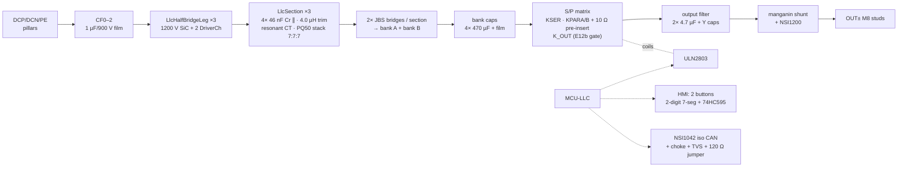

# 30 kW Module — Board Pair Deep Dive 🔬

**The canonical cell-level document.** The 60/120 kW pages describe only their scaling deltas;
every cell explained here is instantiated unchanged across the family.

| Spec | Value |
|---|---|
| Input | 3-φ 285–475 VAC (full power ≥330 V, 86 % @285 V — E1) |
| Output | 150–1000 VDC · **100 A max** · CV/CC · auto S/P mode |
| Boards | AC-DC 420×300 mm · DC-DC 460×320 mm |
| Cells | 1 Vienna lane (3 phases) · 1 LLC channel (3 legs + 3 sections) |
| COGS @1k | **₹31,861** BOM-exact ([levers](../../docs/bom-cost.md)) |
| Exports | [`out/acdc-schematic.svg`](out/acdc-schematic.svg) · [`out/dcdc-schematic.svg`](out/dcdc-schematic.svg) · netlists · [v1 single-board Gerbers](out/) |

---

## 🔻 AC-DC board ([`acdc.tsx`](acdc.tsx) → `AcDcBoard{lanes:1}`)

```mermaid
flowchart LR
  J["ACL1/2/3 + PE<br/>M8 studs"] --> F["F1–F3 gG fuses"] --> MOV["MOV Δ<br/>3× S20K550"]
  MOV --> CM1["CMC1<br/>3-φ CM 2 mH"] --> X1["CX11–13<br/>X2 2.2 µF Δ"] --> CM2["CMC2"] --> LDM["LDM1–3<br/>22 µH DM (E22)"] --> X2["CX21–23 + CY1–3"]
  X2 --> PRE["KPRE 2-pole<br/>+ 2× 33 Ω (E14b)"]
  PRE --> PH["3× ViennaPhase<br/>A0 · B0 · C0"]
  PH --> DC[("SplitDcLink<br/>2×5× 470 µF + balance")]
  DC --> ST["DCP/DCN/PE<br/>pillars → DC-DC board"]
  PH -.PWM/FLT.- MCU["MCU-PFC<br/>GD32G553"]
  DC -.dividers.- MCU
  AUX["AuxPower flyback<br/>DCP→MID (E20)"] -.24/15/3.3 V.- MCU
```

### Cell-by-cell

| Cell (source) | What it is | The engineering inside |
|---|---|---|
| `ViennaPhase` ×3 | one PFC phase | 165 µH sendust choke ([D1](../../docs/magnetics.md)); **common-source 750 V SiC pair** (B3M010C075Z ×2) driven by ONE `DriverCh` — this single choice makes 2 MCUs suffice at 120 kW; two 1200 V/40 A JBS to the rails (they block the **full** bus — calculated, not assumed); 10 Ω+470 pF RC **and** RCD clamp (JBS+100 nF+470 Ω) per node — the exact network that took DPT overshoot from 115 % to **70 %** |
| `DriverCh` ×3 | isolated gate channel | NSI6611 (DESAT, Miller clamp, UVLO, soft-off) · split Rg **4.7/4.7 Ω** (E5) · +18/−4 V from a bias secondary set (E23) · 2× US1M DESAT chain + 100 pF blanking · 10 k gate-source · Kelvin return |
| `SplitDcLink` | energy buffer | 2×5× 470 µF/450 V snap-in, 100 k balancers, midpoint sensed; window 650–830 V, **HW OVP 860 V** (E2) |
| precharge | inrush control | 33 Ω in **two lines** + 2-pole bypass — a single-line resistor is a 3-wire-system fallacy (E14b); 20 A pk, 243 J, t₉₅ ≈ 160 ms (simulated) |
| discharge | touch safety | 4× 160 Ω + 1200 V SiC FET, ULN-driven with V15 pull-up (fail-engaged logic E19): 850→60 V in **2.0 s** |
| `CtSensor` ×3 | phase current | 1:2500 line CTs + 33 Ω burden (E18 — beat shunt+iso-amp on cost, isolation and OC speed) |
| `HvDivider` ×5 | AC + bus sense | 8× 475 k 1206 in series (creepage by construction) + 6.8 k 0.1 % bottom + RC |
| `AuxPower` | house power | flyback fed **DCP→MID** so a 650 V FET suffices (E20); 24 V/15 V/3.3 V rails; validated in ngspice incl. the CS-clamp lesson ([report §9](../../docs/simulation-report.md)) |
| `ControlMcu` PFC | control | pin map below — **asserted unique at build** |

### MCU-PFC pin map (from `boards.tsx`, build-asserted)

| Net | Pin | | Net | Pin |
|---|---|---|---|---|
| `PWM_A0/B0/C0` | 55/56/57 | | `SNS_VAC1/2/3` | 43/44/45 |
| `I_A0/B0/C0` (CTs) | 30/31/32 | | `SNS_VBUSP` / `SNS_VMID` | 46 / 47 |
| `FAN_PWM1/TACH1` | 76/77 | | `T_PFC` / `T_INLET` | 48 / 49 |
| `FAN_PWM2/TACH2` | 78/79 | | `LINK_TX/RX` | 68/69 |
| `CTL_KPRE` / `CTL_QDIS` | 72 / 73 | | `PWM_KILL` / `GATE_EN` | 70 / 71 |
| `FLT_PFC` (wire-OR) | 74 | | | |

---

## 🔺 DC-DC board ([`dcdc.tsx`](dcdc.tsx) → `DcDcBoard{channels:1}`)



### Cell-by-cell

| Cell | What it is | The engineering inside |
|---|---|---|
| `LlcHalfBridgeLeg` ×3 | resonant legs | SG2M023120LJ 1200 V/23 mΩ pair, Rg **4.7/2.2 Ω** (E6), per-node RC; runs 100–203 kHz PFM around fr = 140 kHz; **ZVS confirmed at every simulated gate edge** |
| `LlcSection` ×3 | tank + isolation | Cr = 4× 46 nF/1200 V pulse PP ∥ · trim inductor **binned to the mated transformer's measured leakage** (D2 rev B — the §37 Monte-Carlo fix) · resonant CT 1:100 · transformer **3× PQ50/50, 7:7:7**, Lm 63 µH gap-ground ±7 %, dual TIW secondaries, reinforced insulation, PD-sample-tested ([D3](../../docs/magnetics.md)) |
| dual JBS bridges | rectification | 8× 1200 V/20 A JBS per section (banks A+B) — chose diodes over SR on quantified ₹/W (E11: SR flips only above ₹41/W cooling cost); SR stays a premium variant |
| `SeriesParallelRelayMatrix` | range extension | K_SER · K_PARA/B **with 10 Ω pre-insertion aux relays** (hard 2 V-mismatch close = 205 A — simulated, E12) · **K_OUT with the E12b gate**: closes only when stack matches v_ext-or-v_cmd (a defect the C-firmware port caught) · weld detect 1.5 V/200 ms |
| `OutputShunt` | current truth | manganin + NSI1200 iso-amp, Kelvin; ±0.2 % post-cal (Monte-Carlo) |
| `ConfigHmi` | field config | 2 buttons + 2-digit 7-seg via 74HC595 + 2 NPN mux: CAN address 00–63, group, `F.xx` fault paging ([spec](../../docs/interconnect.md)) |
| `IsolatedCan` | external world | CAN 2.0B 125 kbps 29-bit, isolated + CM choke + TVS + jumpered 120 Ω ([protocol](../../docs/can-protocol.md)) |
| `CoilDriver` | relay drive | ULN2803, 24 V coils, flyback-clamped |

### MCU-LLC pin map (build-asserted)

| Net | Pin | | Net | Pin |
|---|---|---|---|---|
| `PWM_L1H/L…L3H/L` | 50–55 | | `SNS_VOUT` / `SNS_IOUT` | 96 / 97 |
| `I_RES1/2/3` | 30/31/32 | | `SNS_VBKA` / `SNS_VBKB` | 98 / 99 |
| `CTL_KSER…KPREB` | 80–85 | | `T_LLC` / `T_XFMR` | 42 / 43 |
| `HMI_DAT/CLK/LAT` | 88/89/90 | | `LINK_TX/RX` | 44/45 |
| `HMI_DIG1/2` · `BTN1/2` | 91/92 · 93/94 | | `CAN_TX/RX` | 48/49 |
| `PWM_KILL` / `GATE_EN` | 46 / 47 | | | |

---

## Protections living on this pair

HW-fast: per-phase CT comparators (105 A pk) → HRTIM kill · DESAT per SiC · bus OVP 860 V ·
output OVP · driver UVLO chain (aux collapse ⇒ gates held low) · watchdog `PWM_KILL` line across
the harness. Supervisory: the full 32-row table ([protection-thresholds.md](../../docs/protection-thresholds.md)),
exercised by the [26-scenario suite](../../docs/simulation-report.md) and the
[C firmware](../../firmware/) (33/33 under sanitizers).

## Top cost drivers (BOM-exact @1k, from [`bom-30kw.csv`](../../calculations/out/bom-30kw.csv))

| MPN | Description | Qty | ₹/unit | ₹ ext |
|---|---|---|---|---|
| `IND-PFC-165u` | PFC choke 165 µH, 3× T79 26µ sendust, N=36 | 3 | 1035 | **3,105** |
| `SG2M023120LJ` | SiC MOSFET 1200 V 23 mΩ TO-247-4L | 6 | 390 | **2,340** |
| `SICJBS-1200-20` | SiC JBS 1200 V 20 A (secondary bridges) | 24 | 90 | **2,160** |
| `ELH-470u450` | 470 µF 450 V snap-in 105 °C | 14 | 150 | **2,100** |
| `XFMR-LLC-10K` | LLC transformer 3× PQ50/50, 7:7:7 | 3 | 680 | **2,040** |
| `B3M010C075Z` | SiC MOSFET 750 V 10 mΩ TO-247-4 | 6 | 330 | **1,980** |
| `PP-44n-1200` | 46 nF 1200 V pulse film (resonant) | 12 | 68 | **816** |
| `NSI6611` | iso gate driver, DESAT/Miller/UVLO | 9 | 85 | **765** |
| `SICJBS-1200-40` | SiC JBS 1200 V 40 A (boost) | 6 | 120 | **720** |
| `CMC-3PH-2mH` | 3-φ CM choke, nanocrystalline | 2 | 210 | **420** |

Category split and the red-line lever plan: [`docs/bom-guide.md`](../../docs/bom-guide.md).
