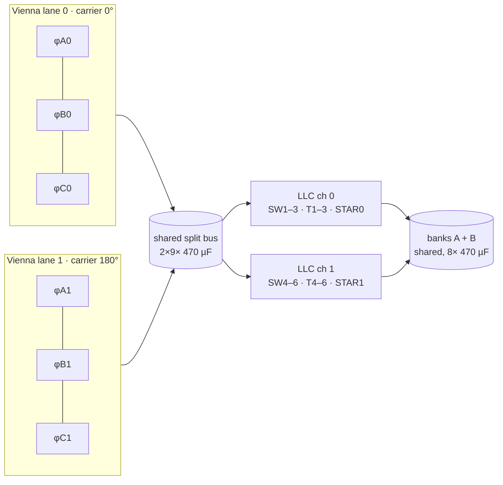

# 60 kW Module — Board Pair 🔬

Same cells as the [30 kW canonical walkthrough](../30kw/README.md) — this page covers what
**doubles, what interleaves, and what stays single**.

| Spec | Value |
|---|---|
| Output | 150–1000 VDC · **200 A max** |
| Boards | AC-DC 460×420 mm · DC-DC 520×420 mm |
| Cells | **2 Vienna lanes @ 0/180°** · **2 LLC channels** (6 legs, 6 sections) |
| COGS @1k | **₹55,319** BOM-exact |
| Exports | [`out/acdc-schematic.svg`](out/acdc-schematic.svg) · [`out/dcdc-schematic.svg`](out/dcdc-schematic.svg) · netlists |

## What scales ×2 (and why interleaved, not bigger)

- **2 interleaved lanes beat one big lane** (frozen E16): zero SiC die-paralleling risk, per-lane
  current loops instead of matched-die binning, and the 180° carrier shift **cancels the odd
  ripple harmonics** — first surviving DM component moves from 50 → 100 kHz, quantified in the
  [LISN estimate](../../calculations/out/lisn-precompliance.csv).
- **Magnetics stay the family p/n**: 6× the same D1 choke, 6× the same D3 transformer stack —
  one qualification, one winder, one kitting flow (leakage-bin labels included).
- **Banks are shared, not per-channel**: every section's A-secondary rectifies into one bank A
  (same for B) — inherent balance in series mode, single S/P matrix.

## What stays single

One AC front end (bigger CM cores, same footprint family) · one precharge · one discharge · one
split-bus assembly (2×9 caps) · **two MCUs total** (lane 1 = phase-shifted copies on HRTIM
channels D/E/F; pins `PWM_A1/B1/C1` = 58/59/60, `I_A1/B1/C1` = 33/34/35 — same asserted map) ·
one S/P matrix with **200 A-class** HFE82V relays · one HMI, one CAN node.

## Current sharing between lanes

Per-lane PI integrators null static mismatch; the Monte-Carlo residual from CT gain tolerance is
**±0.62 % (99 % CI)** against a ±2 % thermal-symmetry budget
([monte-carlo.csv](../../calculations/out/monte-carlo.csv), batch E).

## Top cost drivers (@1k, [`bom-60kw.csv`](../../calculations/out/bom-60kw.csv))

| MPN | Description | Qty | ₹/unit | ₹ ext |
|---|---|---|---|---|
| `IND-PFC-165u` | PFC choke (family p/n) | 6 | 1035 | **6,210** |
| `SG2M023120LJ` | 1200 V 23 mΩ SiC (LLC) | 12 | 390 | **4,680** |
| `SICJBS-1200-20` | secondary JBS bridges | 48 | 90 | **4,320** |
| `XFMR-LLC-10K` | LLC transformer stacks | 6 | 680 | **4,080** |
| `B3M010C075Z` | 750 V 10 mΩ SiC (PFC) | 12 | 330 | **3,960** |
| `ELH-470u450` | 470 µF/450 V snap-in | 26 | 150 | **3,900** |
| `PP-44n-1200` | resonant pulse film | 24 | 68 | **1,632** |
| `NSI6611` | iso gate drivers | 18 | 85 | **1,530** |
| `SICJBS-1200-40` | PFC boost JBS | 12 | 120 | **1,440** |
| `HFE82V-CLASS` | 1000 V relays (200 A class) | 4×1 | 780 | **3,120** |

Everything else — protections, HMI, firmware, EOL flow — is identical to the
[30 kW page](../30kw/README.md); per-SKU differences live only in `{lanes, channels, w, h}`
passed to the generators and the [`skuOverrides`](../../calculations/cost/parts-db.mjs) table.
