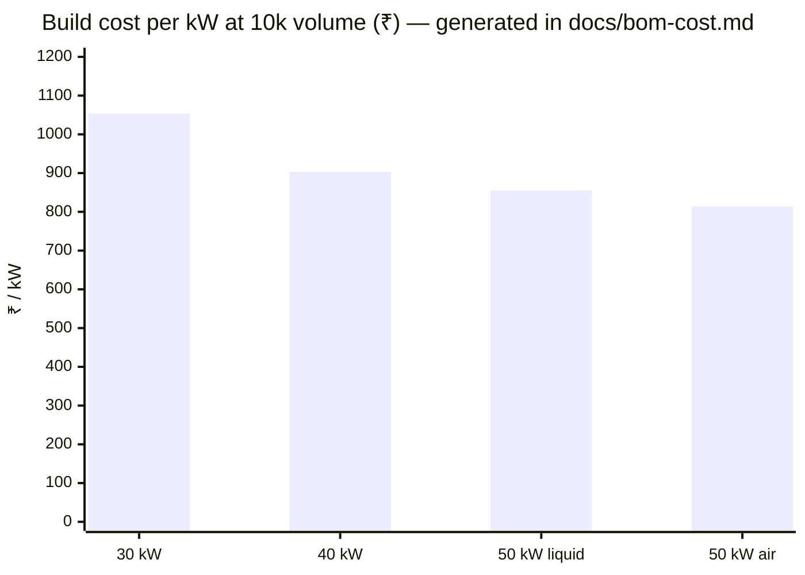
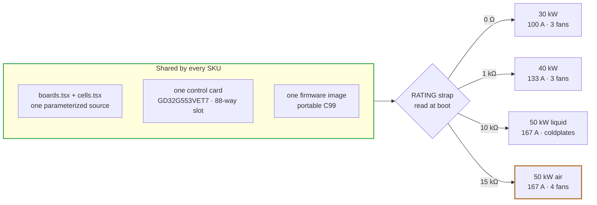
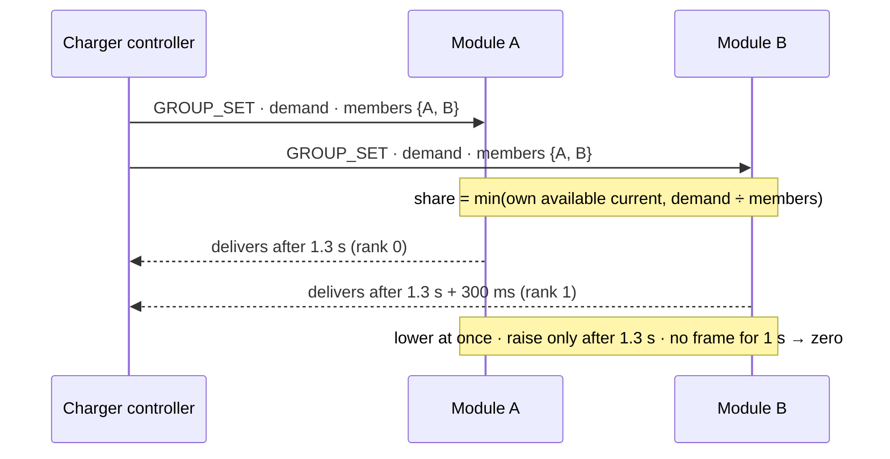

# 🔋 Module Family

Four SKUs on one lane, one card and one firmware image — why 50 kW is the top module, the two cooling lines, and what a charger gets from every module

  
  
  

> [!NOTE]
> **Purpose** — the module family in one page: the four SKUs side by side, what is shared and what scales, why a module
> stops at 50 kW, how the two 50 kW cooling lines differ, and the contract every module gives the charger it goes into.
>
> **Gate coupling** — costs are generated by `bom-gen` ([BOM & cost](../docs/bom-cost.md)); efficiency by `loss-budget`
> ([thermal report](../docs/thermal-report.md)); MTBF by `mtbf-budget` ([reliability budget](../docs/reliability-budget.md));
> the module boundary by `module-interconnect-audit`; the parallel-operation share law by `host_sim`.

## At a glance

| | |
|---|---|
| **What is shared** | one parameterized source (`boards.tsx` + `cells.tsx`), one control card, one firmware image, one connector set |
| **What scales** | fuse class, Vienna die, PFC choke stack, LLC die count, tank, transformer cells, bank films, trip classes |
| **What selects the SKU** | a single **RATING strap** read at boot — 0 Ω · 1 kΩ · 10 kΩ · 15 kΩ, with a 3.32 kΩ band held in reserve |
| **Top of the envelope** | **50 kW** — one lane, one brain; above it chargers run modules in parallel (§3) |
| **Cheapest per kW** | **50 kW air — ₹814 / kW** at the 10k India basis |

## 1. The four modules

| | **30 kW** | **40 kW** | **50 kW liquid** | **50 kW air** |
|---|:---:|:---:|:---:|:---:|
| Output | 150–1000 VDC · 100 A | 150–1000 VDC · 133 A | 150–1000 VDC · 167 A | 150–1000 VDC · 167 A |
| Cooling | air · **3 fans** | air · 3 fans | two coldplates · no fans | air · 4 fans |
| Efficiency at full power, 400 VAC | 96.38 % | 96.34 % | 96.29 % | 96.22 % |
| Worst junction over the envelope (Vienna · LLC) | 128 · 150 °C | 149 · 145 °C | 130 · 139 °C | 149 · 150 °C |
| MTBF (parts count, 40 °C) | 403 kh | 385 kh | 369 kh | 367 kh |
| Build cost @10k · India basis | ₹31,613 | ₹36,103 | ₹42,761 | ₹40,688 |
| China RFQ target @10k | ₹25,920 | ₹29,520 | ₹35,023 | ₹33,243 |
| **₹ / kW** | 1,054 | 903 | 855 | **814** |
| RATING strap | 0 Ω | 1 kΩ | 10 kΩ | 15 kΩ |

## 2. What scales with the rating

| Stage | 30 kW | 40 kW | 50 kW liquid · air |
|---|---|---|---|
| Input fuse (gG) | 80 A · 22 × 58 | 125 A · 22 × 58 | 160 A · NH00 |
| Vienna die per position | 750 V 20 mΩ class | 750 V 15 mΩ class | B3M010C075Z |
| PFC choke D1 | 3 × T79 sendust · N 39 | 5 × T79 · N 26 | 5 × T79 · N 24 |
| LLC dies per position | one SG2M023120LJ | two | two |
| Resonant tank (total Lr) | 7 × 33 nF · 5.6 µH | 9 × 33 nF · 4.35 µH | 11 × 33 nF · 3.56 µH |
| Transformer cells D3 | 2 × E70 per cell · 6:6∥6 | 3 × E70 · 4:4∥4 | 3 × E70 · 4:4∥4 |
| Output banks · output diode | 9 × 2.2 µF · 150 A | 12 × 2.2 µF · 200 A | 14 × 2.2 µF · 250 A |
| Trip classes F.01 · F.11 | 120 · 140 A pk | 155 · 180 A pk | 195 · 220 A pk |

Everything else — the EMI filter topology, the precharge, the control card, the auxiliary supply, the harness, the HMI
and the firmware — is the same part on every SKU. That shared content is why cost per kW falls from 30 to 50 kW.

## 3. Why a module stops at 50 kW

A module is **one lane**: three Vienna phases and one full-bridge LLC under one control card. A second lane needs about
18 PWM and 30 analog signals, which is past any single card (`cardMap()` throws), so a monolithic 60 kW module would
carry two cards and cost what two smaller modules already cost. Staying on one lane, power above 50 kW hits walls that
cooling cannot move: silicon paralleling count, choke-stack feasibility, the fuse-class ladder, the transformer window
and PCB copper. **50 kW is the top of the single-lane, single-brain envelope** — chargers above it run modules in
parallel, using the contract below. → [control-card scope](../docs/control-card-scope.md)

## 4. Two cooling lines at 50 kW

The two 50 kW modules are **electrically identical** — same silicon, same magnetics, same firmware; only the way heat
leaves the module differs. Paralleling the LLC dies is what let the air twin exist at all, so the choice between the two
is cooling infrastructure and service model, not electrical design.

| | 50 kW liquid | 50 kW air |
|---|---|---|
| **Heat path** | two coldplates replace the extrusions; sealed module, zero fans | extrusions + 4 fans (3 front, 1 rear) |
| **Device mount** | clip on Al2O3 · 0.65 K/W to a 65 °C plate | clip on Al2O3 · 0.8 K/W to a 70 °C base |
| **Thermal proof** | worst Tj 130 °C (Vienna) · 139 °C (LLC) | worst Tj 149 °C (Vienna) · 150 °C (LLC) |
| **Efficiency at full power** | 96.29 % | 96.22 % (the fans' 40 W) |
| **System boundary** | charger-level cooling loop: coolant ≤ 60 °C, 7 L/min per module; plate NTCs and the over-temperature ladder are the module's dry-run protection | airflow only |
| **Reliability** | no wear-out fans | four monitored fans; a fan death is an alarm and a derate |
| **₹ / kW @10k** | 855 | **814** |

> [!NOTE]
> **All four SKUs serve the full 150–1000 V range, sub-200 V included.** At a 55 °C inlet and full load the 30 kW holds
> 86–93 % of rated current at 150 / 200 / 250 V and the 50 kW air 80–93 % at 150 V; the 40 kW and the 50 kW liquid fold
> nowhere below 200 V. Away from 55 °C the low-voltage corners run at 100 %. The fold is not a table the firmware trusts
> blindly: `hal/dielim.c` estimates the worst die's junction temperature above the measured zone NTC and folds
> proportionally between 142 and 150 °C, because at these corners the die runs 80–170 K above a heatsink that is still
> cool. A point the fold cannot bring under the ceiling is **declined** — the module reports 0 A available with the
> thermal-derate bit rather than delivering into it. → [validation report](../docs/validation-report.md)

## 5. What a charger gets from every module

| Area | Provision, per module |
|---|---|
| **Electrical input** | own AC entry: gG fuses (80 / 125 / 160 A), MOV + GDT, EMI filter and precharge, own PE stud. The charger's input protection is a switch-disconnector or MCB coordinated with the module's fuse |
| **Output** | its own **output blocking diode** (1600 V; 150 / 200 / 250 A class), so a module can never back-feed a shared DC bus or a failed neighbour — modules parallel directly at the output |
| **Control** | CAN 2.0B, 29-bit identifiers, module address 00–63 and group id set on the HMI; per-module `SET_OUTPUT` (0x10) or the group command `GROUP_SET` (0x12) → [CAN protocol](../docs/can-protocol.md) |
| **Thermal** | each module is its own front-to-back airflow unit or coldplate loop with its own derating curve — a charger never shares a module's airstream budget |
| **Accuracy** | ± 0.18 % voltage and ± 0.2 % current after the two-point EOL calibration, so paralleled modules share inside constant-current regulation |
| **Service** | commanded bank and bus discharge, touch-safe SELV control face, per-module HMI fault ring and CAN telemetry |

## 6. Running modules in parallel

When a charger runs several modules on one output, its controller is the **group master**. It broadcasts
`GROUP_SET` at 10 Hz — total current demand plus a membership bitmap — and every module card runs the same share law
(`firmware/core/group.c`). No module infers its peers by listening, so there is no split brain.

The host suite proves the sum of shares never exceeds the demand through join, drop, partition and re-join.
Controllers that prefer to set unequal shares keep the per-module `SET_OUTPUT` form.

> [!TIP]
> **How this page is checked** — `bom-gen` (cost), `loss-budget` (efficiency), `mtbf-budget` (reliability), `module-interconnect-audit` (the module boundary) and `host_sim` (the parallel share law) — all inside `sh calculations/run-all.sh`.

---

<a href="README.md">← Boards</a> &nbsp;·&nbsp; <a href="../docs/README.md">🧭 Documentation hub</a> &nbsp;·&nbsp; <a href="30kw/README.md">30 kW Module Walkthrough →</a>

Vectivolt DC-Modules · documentation rev E84 · every number reproduces with <code>sh calculations/run-all.sh</code>

