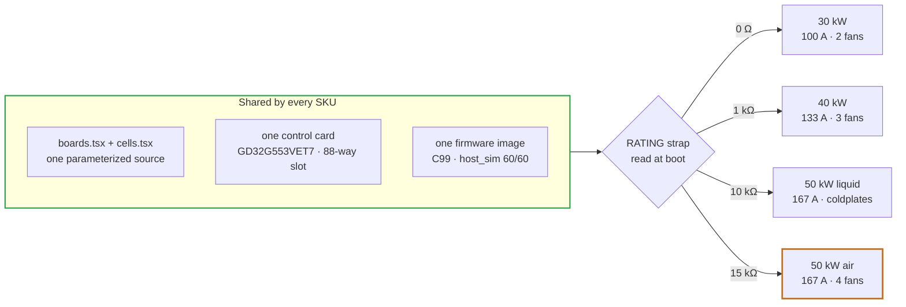
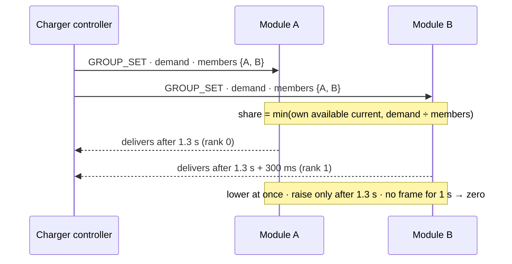

# 🔋 Module Family

Four SKUs on one lane, one card and one firmware image — why 50 kW is the top module, the two cooling lines, and what a charger gets from every module

  
  
  

> [!NOTE]
> **Purpose** — the module family in one page: the four SKUs side by side, what is shared and what scales, why a module
> stops at 50 kW, how the two 50 kW cooling lines differ, and the contract every module gives the charger it goes into.
>
> **Gate coupling** — costs are generated by `bom-gen` ([BOM & cost](../docs/bom-cost.md)); efficiency by `loss-budget`
> ([thermal report](../docs/thermal-report.md)); MTBF by `mtbf-budget` ([reliability budget](../docs/reliability-budget.md));
> the module boundary by `module-interconnect-audit`; the parallel-operation share law by `host_sim`.

## The four modules

| | **30 kW** | **40 kW** | **50 kW liquid** | **50 kW air** |
|---|:---:|:---:|:---:|:---:|
| Output | 150–1000 VDC · 100 A | 150–1000 VDC · 133 A | 150–1000 VDC · 167 A | 150–1000 VDC · 167 A |
| Cooling | air · 2 fans | air · 3 fans | two coldplates · no fans | air · 4 fans |
| Efficiency at full power, 400 VAC | 96.62 % | 96.70 % | 96.56 % | 96.48 % |
| Worst junction on the 4,536-point grid | 139 °C | 127 °C | 116 °C | 135 °C |
| MTBF (parts count, 40 °C) | 422 kh | 402 kh | 396 kh | 394 kh |
| Build cost @10k · India basis | ₹30,033 | ₹34,616 | ₹40,481 | ₹38,404 |
| China RFQ target @10k | ₹24,639 | ₹28,319 | ₹33,182 | ₹31,398 |
| **₹ / kW** | 1,001 | 865 | 810 | **768** |
| RATING strap | 0 Ω | 1 kΩ | 10 kΩ | 15 kΩ |

### What scales with the rating

| Stage | 30 kW | 40 kW | 50 kW liquid · air |
|---|---|---|---|
| Input fuse (gG) | 80 A · 22 × 58 | 125 A · 22 × 58 | 160 A · NH00 |
| Vienna die per position | 750 V 20 mΩ class | 750 V 15 mΩ class | B3M010C075Z |
| PFC choke D1 | 3 × T79 Kool Mµ · N 39 | 5 × T79 · N 26 | 5 × T79 · N 24 |
| LLC dies per position | one SG2M023120LJ | two | two |
| Resonant tank | 7 × 33 nF · Lr 5.6 µH | 9 × 33 nF · 4.35 µH | 11 × 33 nF · 3.56 µH |
| Transformer cells D3 | 2 × E70 per cell · 6:6∥6 | 3 × E70 · 4:4∥4 | 3 × E70 · 4:4∥4 |
| Output banks · output diode | 9 × 2.2 µF · 150 A | 12 × 2.2 µF · 200 A | 14 × 2.2 µF · 250 A |
| Trip classes F.01 · F.11 | 120 · 140 A pk | 155 · 180 A pk | 195 · 220 A pk |

Everything else — the EMI filter topology, the precharge, the control card, the auxiliary supply, the harness, the HMI
and the firmware — is the same part on every SKU. That shared content is why cost per kW falls from 30 to 50 kW.

## Why a module stops at 50 kW

A module is **one lane**: three Vienna phases and one full-bridge LLC under one control card. A second lane needs about
18 PWM and 30 analog signals, which is past any single card (`cardMap()` throws), so a monolithic 60 kW module would
carry two cards and cost what two smaller modules already cost. Staying on one lane, power above 50 kW hits walls that
cooling cannot move: silicon paralleling count, choke-stack feasibility, the fuse-class ladder, the transformer window
and PCB copper. **50 kW is the top of the single-lane, single-brain envelope** — chargers above it run modules in
parallel, using the contract below. → [control-card scope](../docs/control-card-scope.md)

## Two cooling lines at 50 kW

The two 50 kW modules are **electrically identical** since E68a; only the way heat leaves the module differs.

| | 50 kW liquid (E42) | 50 kW air (E44) |
|---|---|---|
| **Heat path** | two coldplates replace the extrusions; sealed module, zero fans | extrusions + 4 fans (3 front, 1 rear) |
| **Device mount** | clip on Al2O3 · 0.65 K/W to a 65 °C plate | clip on Al2O3 · 0.8 K/W to a 70 °C base |
| **Thermal proof** | 0 failures, 0 folds · worst Tj 116 °C (PFC) | 0 failures, 0 folds · worst Tj 135 °C (PFC) |
| **Efficiency at full power** | 96.56 % | 96.48 % (the fans' 40 W) |
| **System boundary** | charger-level cooling loop: coolant ≤ 60 °C, 6.5 L/min per module; plate NTCs and the over-temperature ladder are the module's dry-run protection | airflow only |
| **Reliability** | no wear-out fans | four monitored fans; a fan death is an alarm and a derate |
| **₹ / kW @10k** | 810 | **768** |

<b>Record — why there are two 50 kW modules</b>

At E42 an air-cooled 50 kW was declined on five recorded risks — two engine edges (choke family, transformer
window), magnetics height against the inter-board tunnel, hot-site folds landing on the high-current region where
real charging sessions sit, and a fan-reliability regression — and the liquid module was built instead. At E44 the
air twin was built by paralleling the LLC dies, which removed the binding junction-temperature risk; fans had never
been the limit. Since E68a both twins carry the same silicon, so the choice between them is cooling infrastructure
and service model, not electrical design.

## What a charger gets from every module

| Area | Provision, per module |
|---|---|
| **Electrical input** | own AC entry: gG fuses (80 / 125 / 160 A), MOV + GDT, EMI filter and precharge, own PE stud. The charger's input protection is a switch-disconnector or MCB coordinated with the module's fuse |
| **Output** | its own **output blocking diode** (1600 V; 150 / 200 / 250 A class), so a module can never back-feed a shared DC bus or a failed neighbour — modules parallel directly at the output |
| **Control** | CAN 2.0B, 29-bit identifiers, module address 00–63 and group id set on the HMI; per-module `SET_OUTPUT` (0x10) or the group command `GROUP_SET` (0x12) → [CAN protocol](../docs/can-protocol.md) |
| **Thermal** | each module is its own front-to-back airflow unit or coldplate loop with its own derating curve — a charger never shares a module's airstream budget |
| **Accuracy** | ± 0.18 % voltage and ± 0.2 % current after the two-point EOL calibration, so paralleled modules share inside constant-current regulation |
| **Service** | commanded bank and bus discharge, touch-safe SELV control face, per-module HMI fault ring and CAN telemetry |

### Running modules in parallel

When a charger runs several modules on one output, its controller is the **group master**. It broadcasts
`GROUP_SET` at 10 Hz — total current demand plus a membership bitmap — and every module card runs the same share law
(`firmware/core/group.c`). No module infers its peers by listening, so there is no split brain.

The host suite proves the sum of shares never exceeds the demand through join, drop, partition and re-join.
Controllers that prefer to set unequal shares keep the per-module `SET_OUTPUT` form.

---

<a href="README.md">← Boards</a> &nbsp;·&nbsp; <a href="../docs/README.md">🧭 Documentation hub</a> &nbsp;·&nbsp; <a href="30kw/README.md">30 kW Module Walkthrough →</a>

Vectivolt DC-Modules · documentation rev E72 · every number reproduces with <code>sh calculations/run-all.sh</code>

