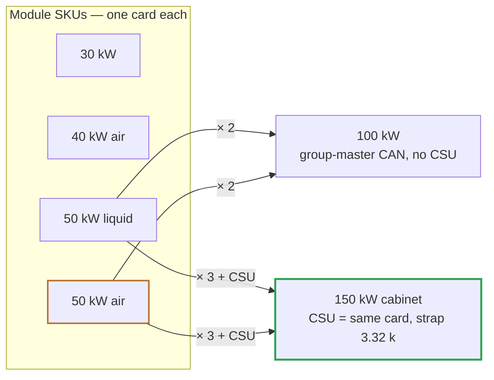

# 🏢 Product Structure

Why the family is 30 / 40 / 50 kW modules plus 100 and 150 kW products — and the multi-module contract

  
  
  

> [!NOTE]
> **Purpose** — why the family is four module SKUs plus exactly two multi-module products, where the single-module
> envelope ends, and the contract a cabinet integrator gets from every module.
>
> **Gate coupling** — the ₹ ladder is generated by `bom-gen` ([cost roll-up](../docs/bom-cost.md)); the cabinet
> sheet is audited by `module-interconnect-audit`; the CSU logic is proven in `host_sim`.

## The product line (E55)

| Product | Composition | Output | Cooling | Cards | ₹ @10k | ₹ / kW | One module out |
|---|---|---|---|---:|---:|---:|---|
| **30 kW** | 1 module | 150–1000 V · 100 A | air · 2 fans | 1 | 30,980 | 1,033 | — |
| **40 kW** | 1 module (E41) | · 133 A | air · 3 fans | 1 | 35,891 | 897 | — |
| **50 kW liquid** | 1 module (E42) | · 167 A | coldplates · 0 fans | 1 | 41,865 | 837 | — |
| **50 kW air** | 1 module (E44) | · 167 A | air · 4 fans | 1 | 41,516 | **830** | — |
| **100 kW** | 2 × 50 (air or liquid) | · 333 A | per module | 2 | 83,032 · 83,730 | 830 · 837 | keeps 50 % |
| **150 kW** | 3 × 50 + CSU | · 500 A | per module | 3 + 1 | 1,26,382 · 1,27,429 | 843 · 850 | keeps 67 % |

Every multi-module product standardizes on the 50 kW twins — the cheapest ₹ / kW in the family and the best
N−1 granularity. The 60 / 80 / 120 kW compositions were retired at E55: each was beaten per kW by a 50-based
product in or near its segment.

## Why a module stops at 50 kW

A module is **one lane**: three Vienna phases and three LLC sections under one control card. A monolithic 60 kW module
needs a second lane — about 18 PWM and 30 analog signals — which is past any single card (`cardMap()` throws), so it
would carry two cards and cost what two 30 kW modules already cost. A single-lane 120 kW machine fails on walls that
cooling cannot move: silicon paralleling count, choke stack feasibility, the fuse-class ladder, the transformer
window and PCB copper. **Per-module power is bounded by the single-lane, single-brain envelope; products above it are
built from modules.** → [control-card scope](../docs/control-card-scope.md)

## Two cooling lines at 50 kW

| | 50 kW liquid (E42) | 50 kW air (E44) |
|---|---|---|
| **How it gets the heat out** | two coldplates replace the extrusions; sealed module, zero fans | extrusions + 4 fans (3 front, 1 rear) |
| **Silicon** | the 40 kW silicon — single LLC FETs at 167 A, made possible by the plate (Rth 1.1 K/W to a 65 °C plate) | PFC **and** LLC pairs paralleled — per-package conduction ÷ 4 |
| **Thermal proof** | 5,544-point grid, 0 failures; folds only in hot PS and SER-band corners | 0 failures; folds only in the hot SER band (JBS 149 °C) |
| **Classes** | 160 A NH00 fuses · 250 A precharge frame · dual K_OUT · revved tank classes | identical to the liquid twin by construction |
| **System boundary** | charger-level cooling cart: coolant ≤ 60 °C, 6 L/min per module; the plate NTCs and OT ladder are the module's dry-run protection | none beyond airflow |
| **₹ / kW** | 837 | **830** |

<b>Record — why the air 50 kW was first declined (E42), and what changed at E44</b>

At E42 an air-cooled 50 kW was assessed and declined on five recorded risks: two possible engine refusals (choke
family edge, transformer window), magnetics height against the inter-board tunnel, a product-honesty risk (hot-site
folds landing on the low-voltage, high-current region where real sessions sit — a "50 kW" delivering ~44–46 kW) and
a fan-reliability regression. The liquid 50 deleted the decisive risks by running the 40 kW silicon on a coldplate.

At **E44** the air twin was built anyway by **paralleling the LLC pairs**: per-package conduction dropped to a
quarter, which removed the binding junction-temperature risk (fans were never the binder — even infinite air left a
single FET near 153 °C). The grid then closed with folds only in the hot series band, and the air twin became the
cheapest module per kW.

Single-board size evidence from that era (measured from the cells as placed — Vienna phase 89 × 161 mm, LLC section
83 × 225 mm):

| | AC-DC depth | DC-DC single-row width | Verdict |
|---|---:|---:|---|
| 30 kW | 356 mm | 261 mm | fits a 3U rack card |
| 60 kW | 528 mm | 528 mm | DC-DC too wide for 440 mm |
| 120 kW | 872 mm | 1062 mm | far over |

## The multi-module contract

**100 kW = 2 × 50 kW modules; 150 kW = 3 × 50 kW modules + CSU, in a cabinet.** What the integrator gets per module,
already designed in:

| Area | Per-module provision |
|---|---|
| **Electrical input** | own AC entry: 160 A gG NH00 fuses, MOV + GDT, EMI filter and precharge. Cabinet input protection is a switch-disconnector or MCB coordinating with N × 160 A branches; own PE stud |
| **Output paralleling** | modules parallel at the DC output bus through each module's own **dual K_OUT** (2 × 200 A at 167 A, 42 % per relay). Sharing is **commanded constant current** over CAN; the E12b closure gate (stack matches target before close) makes hot-joining a live bus safe; ± 0.5 % voltage accuracy keeps the steady-state share inside CC regulation |
| **Control** | CAN 2.0B with module address 00–63 and group id set on the HMI; `firmware/core/can_proto` already speaks it |
| **Thermal** | each module is its own front-to-back airflow unit (or coldplate loop) with its own derating curve — cabinets never share a module's airstream budget |
| **Service** | commanded bank and bus discharge, touch-safe SELV control face, per-module HMI fault ring |

### The 150 kW cabinet brain (E39, re-based E55)

One CSU — the same control card, strapped into the CSU band — sits on a passive carrier (15 V DIN supply + one
3.32 k strap) and joins the CAN chain alongside each module's card. It runs equal-share commanded CC with 300 ms
staggered starts and graceful degrade on module dropout (`firmware/core/csu.c`, inside the 54 / 54 host suite).
`boards/cabinet.tsx` → `kicad5/dc-modules-cabinet/` is the cabinet drawing of record.

| Cabinet adder line | Part | ₹ @10k |
|---|---|---:|
| CSU card | same control-card assembly as the module cards | ≈ card assembly |
| Carrier header | CONN-CARD-88-H | 45 |
| CSU supply | **PSU-15V-DIN-WDR** (MEAN WELL WDR-60-15, 180–550 VAC input — fed L1–L2 at 400 VAC line-to-line; an 85–264 VAC part would fail) | 1,300 |
| Cabinet studs | 6 × STUD-M8 (L1 / L2 / L3 / PE entry + BUS_P / BUS_N; M10 or busbar at 500 A) | 168 |
| CAN chain | 2 × 120 Ω + 3.32 k strap + 0 Ω shield bond + 0 Ω SGND reference tie | ≈ 2 |
| CAN / AC harness | integrator-supplied, cabinet-length dependent | — |
| **Adder total (generated)** | | **1,834** |

The 150 kW product is 3 × ₹41,516 (air) + ₹1,834 = **₹1,26,382**, or 3 × ₹41,865 (liquid) + ₹1,834 = **₹1,27,429** @10k.
The 100 kW product is a plain 2 × module with no adder.

---

<a href="README.md">← Boards</a> &nbsp;·&nbsp; <a href="../docs/README.md">🧭 Documentation hub</a> &nbsp;·&nbsp; <a href="30kw/README.md">30 kW Module Walkthrough →</a>

Vectivolt DC-Modules · documentation rev E61 · every number reproduces with <code>sh calculations/run-all.sh</code>

