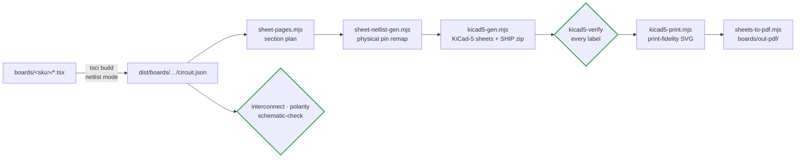

# 🧩 Boards

<sub>The four module SKUs, the control card, and how the release sheets are produced</sub>

<p>
  
  
  
  
</p>

> [!NOTE]
> **Purpose** — what lives in `boards/`: the four buildable module SKUs, the control card, and the pipeline that
> turns them into audited release sheets.
>
> **Gate coupling** — `kicad5-verify` checks every connected pin of every release sheet (6,853 across five targets);
> `module-interconnect-audit`, `polarity-audit` and `schematic-check` walk the built netlists in run-all.

## At a glance

| Source | What it is | Connected pins verified | Components (AC-DC · DC-DC) |
|---|---|---:|---|
| [`30kw/`](30kw/) | the canonical module — [walkthrough](30kw/README.md) | 1,582 | 312 · 250 |
| [`40kw/`](40kw/) | 40 kW air (E41): 15 mΩ-class PFC dies, 5-stack choke, 9 × 33 nF tank, two LLC dies per position, 125 A class, 3 fans | 1,648 | 320 · 270 |
| [`50kw/`](50kw/) | 50 kW **liquid** (E42): coldplates, zero fans, 11 × 33 nF tank, DOUT 250 A | 1,658 | 322 · 276 |
| [`50kwa/`](50kwa/) | 50 kW **air** (E44): electrically the liquid module since E68a, 4 fans | 1,674 | 326 · 276 |
| [`control-card.tsx`](control-card.tsx) | the **control card** (GD32G553VET7, 120 × 80 mm, 88-way) — one part number, every seat | 291 | 49 |
| [`out-pdf/`](out-pdf/) | the nine release PDFs rendered from the audited KiCad-5 sheets | **6,853 total** | — |

All four SKUs come from one parameterized source, [`boards.tsx`](../packages/common-components/boards.tsx), built
from the cells in [`cells.tsx`](../packages/power-primitives/cells.tsx); the card learns its SKU from one RATING strap.
Why the family looks the way it does: [module family](README-module-family.md).

## The module, physically

| | Role | Contents |
|---|---|---|
| 🔻 **AC-DC board** (lower) | grid → DC bus | AC studs · gG fuses (80 / 125 / 160 A per SKU) · MOV + GDT · 2 CM chokes + three star-X2 stages + damper (E68b, no DM chokes) · precharge + bypass · Vienna phases (one clip-mounted 750 V SiC die per position) · split DC link · isolated discharge · line CTs + isolated senses · 110 W full-bus aux flyback (NCP1252D) · local 3.3 V buck · fans (2 / 3 / 0 / 4 per SKU) · **40-way harness header** (no card slot — E40) |
| 🔺 **DC-DC board** (upper) | DC bus → 150–1000 V | film commutation caps · one full-bridge LLC (E67: two legs, one or two dies per position) · one Cr bank + D2 external Lr + resonant CT · two D3 transformer cells · JBS bridges · film-only banks (E68c) + PV-driven bleeders · zero-current S/P relays + two-stage exclusion · output blocking diode DOUT · shunt, studs · isolated CAN · HMI · **the 88-way card slot** |

The boards mount **face to face**: TO-247 rows, clip-mounted on Al2O3 (E68a), face outward onto two heatsink extrusions (liquid coldplates on the
50 kW liquid SKU, with the magnetics gap-pad-bonded to the plate webs). Power crosses on bolted DCP / DCN / PE stud
pillars and control on the 40-way harness. Full contract: [interconnect](../docs/interconnect.md).

## From source to release sheet



```bash
# build one board netlist (layout is a later phase — netlist mode is the working default, E36)
TSCI_NO_ROUTE=1 npx tsci build boards/30kw/acdc.tsx --ignore-placement-drc --ignore-routing-drc
```

```bash
# regenerate, verify and print one target (30kw | 40kw | 50kw | 50kwa | control-card)
node calculations/sheet-pages.mjs 30kw && node calculations/sheet-netlist-gen.mjs 30kw && node calculations/kicad5-gen.mjs 30kw && node calculations/kicad5-verify.mjs 30kw && node calculations/kicad5-print.mjs 30kw && node calculations/sheets-to-pdf.mjs
```

> [!TIP]
> **The release sheets are `kicad5/DC-Modules-<target>-SHIP.zip`.** Cross-section connectivity is net-labels only
> (E34) — wires never leave their section frame — and the library uses native KiCad conventions since E56, so the
> zips open correctly in eeschema.

The 40 and 50 kW deltas are recorded in register rows E41, E42, E44 and E67–E69 and in the variant tables of
[magnetics](../docs/magnetics.md); the family rationale is in [module family](README-module-family.md).

---

<div align="center">
<sub><a href="../docs/can-protocol.md">← External CAN Protocol</a> &nbsp;·&nbsp; <a href="../docs/README.md">🧭 Documentation hub</a> &nbsp;·&nbsp; <a href="README-module-family.md">Module Family →</a></sub>

<sub>Vectivolt DC-Modules · documentation rev E72 · every number reproduces with <code>sh calculations/run-all.sh</code></sub>
</div>
