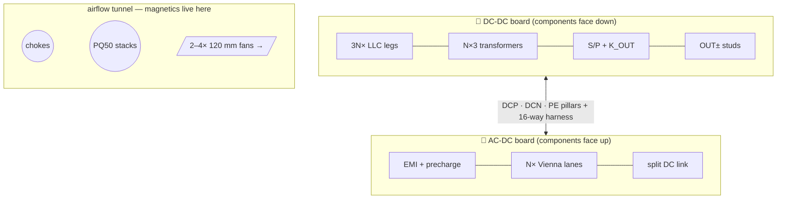

# Boards — the two-board sandwich, three ways

Every SKU is **one module = two boards**, generated from a single parameterized source so the
30/60/120 kW products can never drift apart electrically:

| | Role | Contents | Source |
|---|---|---|---|
| 🔻 **AC-DC board** (lower) | grid → DC bus | AC studs · fuses · MOV Δ + MOV/GDT L-PE · 2× 3-φ CM stages + 22 µH DM stage (D6) · precharge w/ line-rated bypass relays · **N× Vienna lanes** (per-phase film caps) · split DC link · default-OFF isolated discharge · MCU-PFC + watchdog/enable AND + SWD · line CTs (AVMID-biased) · isolated AC/bus senses · 60 W full-bus aux flyback · fans | [`AcDcBoard`](../packages/common-components/boards.tsx) |
| 🔺 **DC-DC board** (upper) | DC bus → 150–1000 V | film commutation caps · **3N× LLC half-bridge legs** · tanks · **N×3 transformer sections** · dual JBS banks · 2-series bank cap strings · S/P matrix (mirror-contact relays + readback) + pre-insertion + K_OUT · output filter/shunt/studs · MCU-LLC + watchdog/enable AND + SWD · isolated bank/output senses · isolated CAN · **config HMI** | [`DcDcBoard`](../packages/common-components/boards.tsx) |

The boards mount **face-to-face**: TO-247 rows clamp outward onto the two heatsink extrusions,
magnetics stand in the inter-board airflow tunnel, power crosses on bolted **DCP/DCN/PE stud
pillars**, control on a 16-way harness. Full mechanical/electrical contract:
[`docs/interconnect.md`](../docs/interconnect.md).



## Per-SKU deep dives

| SKU | Boards | Deep dive |
|---|---|---|
| 30 kW · 100 A | 420×300 + 460×320 mm | [`30kw/README.md`](30kw/README.md) — **canonical cell-level walkthrough** |
| 60 kW · 200 A | 460×420 + 520×420 mm | [`60kw/README.md`](60kw/README.md) |
| 120 kW · 400 A | 560×600 + 640×620 mm | [`120kw/README.md`](120kw/README.md) |

## Build & exports

```bash
npx tsci build boards/<sku>/acdc.tsx        # netlist ERC + circuit JSON (dist/)
npx tsci export boards/<sku>/dcdc.tsx -f schematic-svg -o out/dcdc-schematic.svg
npx tsci export boards/<sku>/dcdc.tsx -f readable-netlist -o out/dcdc-netlist.txt
```

Each `boards/<sku>/out/` already contains the exported **schematic SVGs** and **readable
netlists**; `boards/30kw/out/` additionally keeps the pre-directive single-board v1 artifacts
(PCB SVG, Gerbers, drill, assembly SVG) for reference.

**ERC status:** all six boards build with **0 netlist errors** and pass the build-time MCU
pin-map uniqueness asserts — formal report: [`docs/drc-erc-report.md`](../docs/drc-erc-report.md).
**PCB placement/routing** is intentionally unfitted (project directive) — the layout phase
inherits the §31/§32 rules embedded in [`docs/architecture.md`](../docs/architecture.md) and the
creepage classes in [`docs/insulation-coordination.md`](../docs/insulation-coordination.md).
