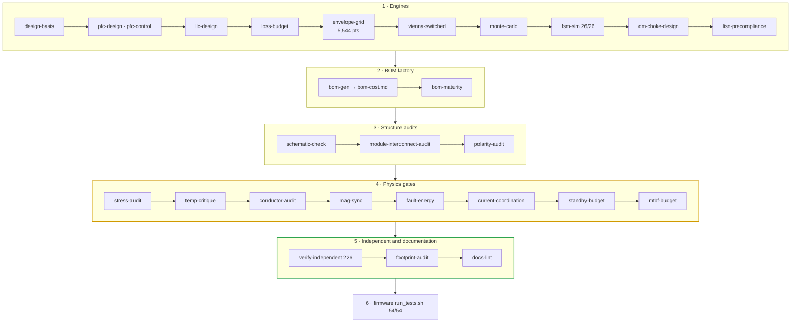

# 🧮 Calculations & Gates

<sub>Every engine, audit and generator — and the one command that reproduces the design</sub>

<p>
  
  
  
  
</p>

> [!NOTE]
> **Purpose** — every number in the documentation traces to a runnable tool in this directory, and one command
> reproduces the lot. The directory holds exactly the tools the production path uses: design engines, standing
> gates, the release-sheet pipeline, the sheet-QA suite and the BOM factory. Superseded tools live on branch
> `archive/pre-focus-E49`.

```bash
sh calculations/run-all.sh
```

## The battery, in the order it runs



## 1. Engines — the design truth

| Tool | Owns |
|---|---|
| `design-basis.mjs` | input currents, availability policy, first-pass sizing |
| `pfc/pfc-design.mjs` | Vienna device losses and the D1 choke search on the **catalog core** (E51) |
| `pfc/pfc-control.mjs` | current and voltage loops with an ngspice AC cross-check |
| `pfc/vienna-switched.mjs` | **cycle-by-cycle** 3-φ Vienna — catalog L(i), floating neutral, dips, phase jump, high line (E60); D1 ripple, iGSE core loss, switch-end peak (E65) |
| `magnetics/d1-choke.mjs` | the D1 PFC choke model — datasheet MLT, strand-resolved ripple copper, wound surfaces, air ∥ bond thermal (E65) |
| `magnetics/d1-fd.mjs` | 2-D eddy-current anchor for the D1 bundles → `out/d1-fd.csv`, fingerprinted per build (E65) |
| `llc/llc-design.mjs` | tank synthesis (joint Ln · Q solve), operating map, first-pass transformer basis |
| `llc/tanks.mjs` | **the one per-SKU tank table** — Lr, Cr, Lm, Coss, D2 turns and area — with the fingerprint every LLC result carries (E60) |
| `emi/dm-choke-design.mjs` | D6 engine — crest-biased inductance floors per variant (E43) |
| `emi/lisn-precompliance.mjs` | conducted-emissions tendency per variant |
| `thermal/loss-budget.mjs` | loss budgets from the power-solved LLC current, JBS vs SR, derating |
| `system/envelope-grid.mjs` | the 4-SKU envelope grid — **5,544 points, 0 failures** |
| `system/monte-carlo.mjs` · `system/fsm-sim.mjs` | §37 tolerance batches · §36 scenario suite |
| `busbar/busbar-calc.mjs` | bulk-copper paths and the joint schedule → `docs/busbar-drawings.md` |
| `control/umod-pinmap.mts` | **single source** for the card map, harness and MCU pins → `umod-map.gen.ts` |
| `control/mcu-matrix.mjs` | MCU resource budget CSVs |
| `plot.mjs` | zero-dependency SVG plotter used by the engines |

## 2. Standing gates

| Gate | Proves | Checks |
|---|---|---:|
| `cost/bom-maturity.mjs` | every BOM line resolves to an orderable, class, direct, custom or tracked-review status; `bom-gen` itself refuses a line with no status (E61) | — |
| `schematic-check.mjs` | 0 symbol overlaps on every built SKU pair | — |
| `module-interconnect-audit.mts` | studs · all 40 harness ways · the 88-way slot · RATING straps · cabinet section | — |
| `polarity-audit.mts` | every polarized part has its + / anode on pin 1, proven from the netlist | — |
| `stress-audit.mjs` | every device, magnetic, pulse part and protection class against its own line | 102 |
| `magnetics/temp-critique.mjs` | hot equilibria, runaway distance, cold start, saturation at temperature on measured 3C95 | 29 |
| `magnetics/conductor-audit.mjs` | Dowell / Sullivan AC copper at the simulated currents | 12 |
| `magnetics/mag-sync.mjs` | one magnetics identity table asserted across five carriers; computed masses | 50 |
| `system/fault-energy.mjs` | stored energy, wire vs fuse, surge, air and coolant budget | 22 |
| `system/current-coordination.mjs` | simulated peaks vs trips, observability, DESAT vs SCWT, fault flux | 58 |
| `system/standby-budget.mjs` | the drawn HV passive network (parsed off the sheets) vs the registered standby arithmetic and the ≤ 10 W target (E64) | — |
| `reliability/mtbf-budget.mjs` | parts-count MTBF prediction vs the registered table — a BOM change that moves reliability re-registers consciously (E64) | — |
| `verify-independent.mjs` | clean-room recompute — own netlist parser, own physics, external anchors (§K) | 226 |
| `footprint-audit.mjs` | the naming queue stays CLOSED — zero unnamed packages, zero MPN / land conflicts (E64) | 0 · 0 |
| `docs-lint.mjs` | every link and anchor resolves, page chrome matches `doc-chrome.mjs`, diagrams render (E61) | — |
| `review-checks.mjs` *(run after any schematic edit)* | every audit and review closure R1…R8, E35…E60 as an assertion | 142 |
| `magnetics-rfq-audit.mjs` *(run after any drawing edit)* | every magnetic drawing complete enough to order | 0 missing |

## 3. Release-sheet pipeline — KiCad-5 is the record


> [!IMPORTANT]
> **Order matters.** Sheet pages and netlist generation must re-run after any parts-db value, mpn or description
> change (descriptions feed the sheet payloads), and prints must run before PDFs. `sheets-to-pdf` waits for
> headless Chrome's write confirmation rather than its exit, because Chrome 152 does not exit after printing.

## 4. Sheet-QA suite — measures the emitted `.sch`, not the intent

| Tool | Measures |
|---|---|
| `kicad5-verify.mjs` | every pin against an independent netlist — **7,784 / 7,784 across six targets** |
| `kicad5-visual.mjs` | ink collisions |
| `alignment-audit.mjs` · `wiring-audit.mjs` · `frame-padding.mjs` · `void-audit.mjs` | near-miss alignment · wiring rules · frame padding · worst enclosed hole |
| `cell-uniformity.mjs` | every replicated cell identical to its twins (per-SKU families) |
| `kicad5-preview.mjs` · `kicad5-detail.mjs` | sheet and tile renders for eye review |
| `footprint-gen.mjs` · `footprint-map.mjs` | magnetics land-pattern source for the layout phase |

## 5. BOM factory and documentation generators

| Tool | Writes |
|---|---|
| `cost/parts-db.mjs` | the classifier, per-SKU overrides and mechanical lines |
| `cost/bom-gen.mjs` | `out/bom-<sku>.csv` and [`docs/bom-cost.md`](../docs/bom-cost.md) (generated) |
| `cost/lcsc-map.mjs` · `cost/lcsc-from-build.mjs` | LCSC assignments and their statuses |
| `pin-map-export.mjs` | [`docs/symbol-pin-map.md`](../docs/symbol-pin-map.md) (generated) |
| `busbar/busbar-calc.mjs` | [`docs/busbar-drawings.md`](../docs/busbar-drawings.md) (generated) |
| `doc-chrome.mjs` | the page registry: banner, title, badges and footer for all 49 documentation pages |

Outputs land in `out/`; the CSVs are committed because documents cite them.

---

<div align="center">
<sub><a href="../docs/reliability-budget.md">← Reliability Budget</a> &nbsp;·&nbsp; <a href="../docs/README.md">🧭 Documentation hub</a> &nbsp;·&nbsp; <a href="../spice/README.md">SPICE Simulation Suites →</a></sub>

<sub>Vectivolt DC-Modules · documentation rev E61 · every number reproduces with <code>sh calculations/run-all.sh</code></sub>
</div>
