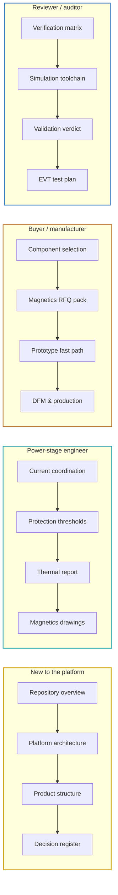

# 🧭 Documentation Hub

Every governing document, what each one decides, and the order to read them in

  
  
  

> [!NOTE]
> **Purpose** — one screen that shows every governing document, what each one decides, which gate keeps it
> honest, and the order to read them in. Every claim in these pages traces to a runnable artifact:
> `sh calculations/run-all.sh` reproduces the lot, and `docs-lint` fails the battery if a link, anchor, masthead or
> diagram breaks.

## Reading paths

Pick the path that matches why you are here. Each document also ends with **previous / next** links that walk the
full reading order below.

## How to read these pages

<table>
<tr><td valign="top" width="50%">

**Status badges** — every page carries exactly one.

| Badge | Meaning |
|---|---|
|  | governs the design today; changes follow the register |
|  | written by a tool — regenerate, never hand-edit |
|   | for suppliers and winders |
|  | the executed-results ledger |
|  | a dated market read, not a spec |
|  | held for a later phase (layout) |
|  | a dated record kept verbatim |

</td><td valign="top" width="50%">

**Callouts** — the colour tells you how to act on it.

| Callout | Used for |
|---|---|
| **Note** | purpose, method, context |
| **Tip** | shortcuts, external anchors, how to use a table |
| **Important** | decisions, requirements, questions for the product owner |
| **Warning** | model limits, known failure modes, fidelity boundaries |
| **Caution** | safety-critical: high voltage, reinforced insulation, withdrawn evidence |

**Units** — A pk and A rms are always distinguished; ₹ is at the 10k-unit basis unless noted; temperatures are
inlet or ambient unless labelled Tj or core.

</td></tr>
</table>

## 🏗️ Platform & product

| | Document | What it decides | Kept honest by |
|---|---|---|---|
| 🏗️ | [Platform architecture](architecture.md) | the module in one read — power path, control plane, protection layers, rails | — |
| 📒 | [Decision register](assumptions.md) | every frozen decision E1–E63 with provenance and invalidator | rows cited by every gate |
| 🔌 | [Two-board sandwich & interconnect](interconnect.md) | stud pillars, 40-way harness, grounding, discharge control, HMI | `module-interconnect-audit` |
| 🧠 | [Control-card scope](control-card-scope.md) | why one card runs one module up to 50 kW | `cardMap()` refuses out-of-scope |
| 💾 | [Firmware guide](firmware-guide.md) | the C99 supervisory core, HAL contract, F.21 semantics | `host_sim` 54/54 · grep-pinned |
| 📡 | [External CAN protocol](can-protocol.md) | addressing, control and telemetry frames, controller rules | `can_proto.c` (fuzzed) |
| 🧩 | [Boards](../boards/README.md) | the four SKUs, the card, the 150 kW cabinet, the release sheets | `kicad5-verify` 7,784 pins |
| 🏢 | [Product structure](../boards/README-product-structure.md) | modules vs products, the cabinet contract | `bom-gen` ladder |
| 📋 | [30 kW module walkthrough](../boards/30kw/README.md) | the canonical board pair, cell by cell | — |

## ⚡ Power stage & protection

| | Document | What it decides | Kept honest by |
|---|---|---|---|
| 🛡️ | [Protection thresholds](protection-thresholds.md) | the F.xx ladder, hardware and supervisory rows, per-SKU windows | `review-checks` · grep-pinned |
| ⚡ | [Current & protection coordination](current-coordination.md) | worst current in every magnetic and switch against its trip, sensor and part | `current-coordination` |
| 🌡️ | [Thermal report](thermal-report.md) | loss budgets, cooling margins, junction and core temperatures | `loss-budget` · `envelope-grid` |
| 🧱 | [Insulation coordination](insulation-coordination.md) | barrier map, creepage and clearance, standards, hipot | — |
| 🔩 | [Busbar drawings](busbar-drawings.md) | bulk-copper sections, joints, torque | generated by `busbar-calc` |

## 🧲 Magnetics

| | Document | What it decides | Kept honest by |
|---|---|---|---|
| 🧲 | [Magnetics drawings D1–D7](magnetics.md) | identity, construction and acceptance of every custom magnetic | `mag-sync` · `magnetics-rfq-audit` |
| 🧵 | [Conductor selection](conductor-selection.md) | foil gauges, litz strands, Rac at 140 kHz | `conductor-audit` |
| 📦 | [Magnetics RFQ pack](magnetics-manufacturing-pack.md) | one quote-ready sheet per magnetic + sourcing | `magnetics-rfq-audit` · 0 missing |
| 🛠️ | [Magnetics build instructions](magnetics-build-instructions.md) | how each part is wound, gapped, impregnated and held | `mag-sync` identities |
| 🔥 | [Magnetics FMEA & temperature critique](magnetics-fmea-e58.md) | runaway, cold, saturation and every failure mode | `temp-critique` |
| 🌀 | [D4 aux flyback transformer](aux-transformer-D4.md) | the rev D turns sheet | `stress-audit` D4 Bpk |

## 🧪 Verification & simulation

| | Document | What it decides | Kept honest by |
|---|---|---|---|
| 🧪 | [Simulation toolchain](simulation-toolchain.md) | which tool proves what, how to run it, where fidelity ends | physicality · power-solve · fingerprint guards |
| 📈 | [Simulation report](simulation-report.md) | the executed-runs ledger — never claim beyond it | SPICE result CSVs |
| ✅ | [Verification matrix](verification-matrix.md) | requirement → evidence, open risks | `run-all` |
| 🔬 | [EVT test plan](evt-plan.md) | the bench campaign T-00…T-32 | sim-vs-bench > 20 % reopens a calc |
| 🏁 | [Validation verdict](final-validation-e51.md) | category verdicts and the honest open list | the standing battery |
| 🧮 | [Calculations & gates](../calculations/README.md) | every engine, audit and generator | `run-all` exit 0 |
| 🖥️ | [SPICE suites](../spice/README.md) | the ngspice runners and their outputs | result CSVs |

## 🏭 Production & sourcing

| | Document | What it decides | Kept honest by |
|---|---|---|---|
| 🏷️ | [Component selection](component-selection.md) | part table, sourcing policy, second sources, price basis | — |
| 📚 | [BOM guide](bom-guide.md) | how the BOM generates and what each maturity status means | `bom-maturity` |
| 🧾 | [BOM & cost roll-up](bom-cost.md) | cost per SKU and the ₹/kW ladder | generated by `bom-gen` |
| 🔎 | [LCSC assignment status](lcsc-status.md) | which parts carry an LCSC number, which deliberately do not, what is still open | `bom-maturity` |
| 📍 | [Symbol → package pin map](symbol-pin-map.md) | logical pins to physical pins | generated by `pin-map-export` |
| 🚀 | [Prototype fast path](prototype-fast-path.md) | catalog and wind-in-house routes for the first build | stock read 13 Sep 2026 |
| 🏭 | [DFM & production flow](dfm-production.md) | assembly, kitting, torque, EOL test, coating | — |
| 📊 | [Competitive benchmark](competitive-benchmark-e51.md) | market position, SiC verdict, harsh-environment parity | [V] claims 3-vote verified |
| 🩻 | [InfyPower teardown benchmark](benchmark-infypower-teardown.md) | block-level audit against the REG1K0135A2, and the E63 gap-closure lever audit | teardown on file · levers gated (E62/E63) |
| ✏️ | [Footprints to draw](footprints-to-draw.md) | land-pattern queue and the layout-entry blockers | `footprint-audit` · parked (E36) |
| 🗺️ | [PCB floorplan basis](pcb-floorplan.md) | zones, barriers, airflow for layout | parked (E36) |

## 🗄️ Historical records

Kept verbatim for provenance; each opens with a pointer to where its conclusions live now.

| Record | Era |
|---|---|
| [History index](history/README.md) | six records moved off the live path at E53 |
| [Design basis report](design-basis-report.md) | Phase 1, 30/60/120 kW monoblocks |
| [Production design review R1](design-review-production.md) · [R2](design-review-production-r2.md) | rev C / rev D audits |
| [Review response R3](history/review-response-r3.md) · [Single-card migration plan](history/single-card-migration-plan.md) | R3 · E40 |
| [DRC / ERC report](history/drc-erc-report.md) · [EasyEDA transcription](history/easyeda-transcription.md) · [GD32 pin allocation](history/mcu-pin-allocation-gd32.md) · [Drawing set](history/schematic-drawing-set.md) | pre-E56 pipelines |

## Standing rules

> [!IMPORTANT]
> 1. **Generated pages are regenerated, never hand-edited** — `bom-cost`, `symbol-pin-map`, `busbar-drawings`.
> 2. **Gate-read pages take additive edits only** — `protection-thresholds` and `firmware-guide` carry passages
>    that `review-checks`, `stress-audit` and `current-coordination` assert word for word; `magnetics`, the RFQ
>    pack and the D4 sheet are parsed by `mag-sync` and `magnetics-rfq-audit`.
> 3. **Register rows are immutable** — a correction is a new row, never an edit.
> 4. **Chrome comes from one registry** — every page's banner, title, badges and footer are produced from
>    `calculations/doc-chrome.mjs`; `docs-lint` fails if a page drifts, a link breaks or a diagram cannot render.

---

<a href="../README.md">← DC-Modules</a> &nbsp;·&nbsp; <a href="../README.md">🏠 Repository overview</a> &nbsp;·&nbsp; <a href="architecture.md">Platform Architecture →</a>

Vectivolt DC-Modules · documentation rev E61 · every number reproduces with <code>sh calculations/run-all.sh</code>

