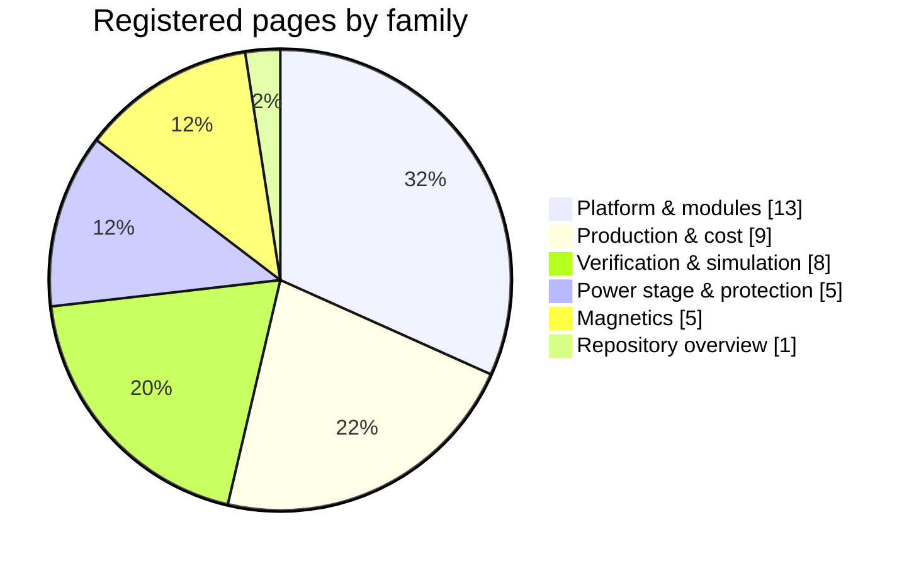
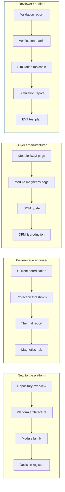

# 🧭 Documentation Hub

Every governing document, what each one decides, and the order to read them in

  
  
  
  

> [!NOTE]
> **Purpose** — one screen that shows every governing document, what each one decides, which gate keeps it
> honest, and the order to read them in. Every claim in these pages traces to a runnable artifact:
> `sh calculations/run-all.sh` reproduces the lot, and `docs-lint` fails the battery if a link, anchor, masthead or
> diagram breaks.

## At a glance

| | |
|---|---|
| **Registered pages** | **41**, in five families — every one carries a banner, a status badge, and previous / next navigation generated from one registry |
| **Registry** | `calculations/doc-chrome.mjs` — the masthead, badges and footer of every page; never hand-edited on the page |
| **Gate** | `node calculations/docs-lint.mjs` — every relative link, every `#anchor`, every masthead and footer, every mermaid type, on every registered page. It runs inside `sh calculations/run-all.sh` |
| **Start here** | [validation report](validation-report.md) for the state of the design · [platform architecture](architecture.md) for the module itself |

## 1. Reading paths

Pick the path that matches why you are here. Each document also ends with **previous / next** links that walk the
full reading order below.

## 2. One module, one set of pages

Every module SKU has its own generated bill of materials and its own magnetics page — the parts, values and costs differ by
SKU, so each gets a page of its own.

| Module | Build cost | Magnetics | Board pair | Release sheets |
|---|---|---|---|---|
| **30 kW** | [bom-30kw](bom-30kw.md) | [magnetics-30kw](magnetics-30kw.md) | [walkthrough](../boards/30kw/README.md) | 30 kW AC-DC · DC-DC PDFs |
| **40 kW** | [bom-40kw](bom-40kw.md) | [magnetics-40kw](magnetics-40kw.md) | `boards/40kw` | 40 kW AC-DC · DC-DC PDFs |
| **50 kW liquid** | [bom-50kw](bom-50kw.md) | [magnetics-50kw](magnetics-50kw.md) | `boards/50kw` | 50 kW AC-DC · DC-DC PDFs |
| **50 kW air** | [bom-50kwa](bom-50kwa.md) | [magnetics-50kwa](magnetics-50kwa.md) | `boards/50kwa` | 50 kW-Air AC-DC · DC-DC PDFs |

## 3. How to read these pages

<table>
<tr><td valign="top" width="50%">

**Status badges** — every page carries exactly one.

| Badge | Meaning |
|---|---|
|  | governs the design today; changes follow the register |
|  | written by a tool from gate results — regenerate, never hand-edit |
|  | the executed-results ledger |
|  | an entry page that points to the governing documents |

</td><td valign="top" width="50%">

**Callouts** — the colour tells you how to act on it.

| Callout | Used for |
|---|---|
| **Note** | purpose, method, context |
| **Tip** | shortcuts, external anchors, how to use a table |
| **Important** | decisions, requirements, questions for the product owner |
| **Warning** | model limits, known failure modes, fidelity boundaries |
| **Caution** | safety-critical: high voltage, reinforced insulation, touch safety |

**Units** — A pk and A rms are always distinguished; ₹ is at the 10k-unit basis unless noted; temperatures are
inlet or ambient unless labelled Tj or core.

</td></tr>
</table>

## 4. 🏗️ Platform & modules

| | Document | What it decides | Kept honest by |
|---|---|---|---|
| 🛡️ | **[Validation report](validation-report.md)** | **the state of the design today** — what the independent validation found, what is fixed, what is still open, the decision table for every proposed part, and the bring-up plan with its STOP lines | `fw-constants-sync` · `review-checks` |
| 🏗️ | [Platform architecture](architecture.md) | the module in one read — power path, control plane, protection layers, rails | `verify-independent` |
| 📒 | [Decision register](assumptions.md) | every decision in force, with provenance and invalidator | rows cited by every gate |
| 🔌 | [Two-board sandwich & interconnect](interconnect.md) | stud pillars, 40-way harness, grounding, discharge control, HMI | `module-interconnect-audit` |
| 🧠 | [Control-card scope](control-card-scope.md) | why one card runs one module up to 50 kW | `cardMap()` refuses out-of-scope |
| 💾 | [Firmware guide](firmware-guide.md) | the C99 supervisory core, HAL contract, output modes, F.21 semantics | `host_sim` · grep-pinned |
| 🧬 | [Firmware architecture](firmware-architecture.md) | layers, timing, state machines, control and ramping, the protection hierarchy, exception handling, the one-MCU verdict | `run_tests.sh` |
| 📡 | [VMP 2.0 native CAN protocol](can-protocol.md) | addressing, control, acknowledgement, telemetry, discovery, versioning, the controller contract | `vmp.c` · `proto_test` |
| 🔁 | [TonHe V1.2 compatibility profile](can-profile-tonhe-v12.md) | drop-in behaviour on TonHe V1.2 monitors, the fault-bit map, the ambiguity register | document examples byte-exact |
| 🧩 | [Boards](../boards/README.md) | the four SKUs, the card, the release sheets | `kicad5-verify` |
| 🔋 | [Module family](../boards/README-module-family.md) | the four SKUs side by side, why 50 kW is the top module, the two cooling lines, the module-to-charger contract | `bom-gen` · `loss-budget` · `mtbf-budget` |
| 📋 | [30 kW module walkthrough](../boards/30kw/README.md) | the canonical board pair, cell by cell | — |

## 5. ⚡ Power stage & protection

| | Document | What it decides | Kept honest by |
|---|---|---|---|
| 🛡️ | [Protection thresholds](protection-thresholds.md) | the F.xx ladder, hardware and supervisory rows, per-SKU windows, the fault-pulse rule | `review-checks` · grep-pinned |
| ⚡ | [Current & protection coordination](current-coordination.md) | worst current in every magnetic and switch against its trip, sensor and part | `current-coordination` |
| 🌡️ | [Thermal report](thermal-report.md) | loss budgets, cooling margins, junction and core temperatures, the fold map | `loss-budget` · `envelope-grid` |
| 🧱 | [Insulation coordination](insulation-coordination.md) | barrier map, creepage and clearance, standards, hipot | `stress-audit` INS row |
| 🔩 | [Busbar drawings](busbar-drawings.md) | bulk-copper sections, joints, torque | generated by `busbar-calc` |

## 6. 🧲 Magnetics

| | Document | What it decides | Kept honest by |
|---|---|---|---|
| 🧲 | [Magnetics hub](magnetics.md) | tools and how to read their results, copper physics, failure modes, common requirements, D4, sourcing | `mag-sync` · `magnetics-rfq-audit` |
| 🧲 | [30 kW](magnetics-30kw.md) · [40 kW](magnetics-40kw.md) · [50 kW liquid](magnetics-50kw.md) · [50 kW air](magnetics-50kwa.md) | every magnetic on that module — drawing, gate proof, build, tests, prototype route, cost | generated by `mag-docs` from gate evidence |

## 7. 🧪 Verification & simulation

| | Document | What it decides | Kept honest by |
|---|---|---|---|
| 🧪 | [Simulation toolchain](simulation-toolchain.md) | which tool proves what, how to run it, where fidelity ends | physicality · power-solve · fingerprint guards |
| 📈 | [Simulation report](simulation-report.md) | the executed-runs ledger — never claim beyond it | SPICE result CSVs |
| ✅ | [Verification matrix](verification-matrix.md) | requirement → evidence, open risks | `verify-independent` |
| 🔬 | [EVT test plan](evt-plan.md) | the bench campaign T-00…T-64 | sim-vs-bench > 20 % reopens a calc |
| 🧪 | [Firmware verification plan](firmware-verification.md) | every firmware feature as behaviour → timing → failure → recovery → test → pass, host to endurance | `run_tests.sh` · HIL and EVT planned |
| 🛡️ | [Reliability budget](reliability-budget.md) | MTBF prediction with its basis, wear-out clocks, no-single-point-of-darkness view | `mtbf-budget` · registered table |
| 🧮 | [Calculations & gates](../calculations/README.md) | every engine, audit and generator | `run-all` exit 0 |
| 🖥️ | [SPICE suites](../spice/README.md) | the ngspice runners and their outputs | result CSVs |

## 8. 🏭 Production & cost

| | Document | What it decides | Kept honest by |
|---|---|---|---|
| 🧾 | [BOM & cost roll-up](bom-cost.md) | family cost, China RFQ targets, the 2U scenario, the ₹/kW ladder, levers | generated by `bom-gen` |
| 🧾 | [30 kW](bom-30kw.md) · [40 kW](bom-40kw.md) · [50 kW liquid](bom-50kw.md) · [50 kW air](bom-50kwa.md) | every line of that module — cost by schematic section, SKU-specific parts, sourcing status | generated by `bom-gen` |
| 📚 | [BOM guide](bom-guide.md) | how the BOM generates, price basis, sourcing statuses and policy | `bom-maturity` |
| 📍 | [Symbol → package pin map](symbol-pin-map.md) | logical pins to physical pins | generated by `pin-map-export` |
| 🏭 | [DFM & production flow](dfm-production.md) | assembly, kitting, torque, EOL test, coating | — |
| 🩻 | [InfyPower teardown benchmark](benchmark-infypower-teardown.md) | block-by-block audit against the REG1K0135A2, what we cloned, and the cost gap that remains | teardown on file · `bom-gen` |

## 9. Standing rules

> [!IMPORTANT]
> 1. **A page describes the current design only** — no revision tags, no old value kept beside the current one, no struck rows, no
>    "what changed" sections. When a value moves, the old one is deleted, not annotated. History lives in `git log`, and `docs-lint` fails a page that carries a history marker.
> 2. **A decision changes by editing its row** in the [decision register](assumptions.md) — one row, one current value.
> 3. **Generated pages are regenerated, never hand-edited** — `bom-cost`, the four `bom-<sku>` and `magnetics-<sku>`
>    pages, `symbol-pin-map`, `busbar-drawings`.
> 4. **A few phrases are asserted verbatim by a gate.** `review-checks`, `stress-audit`, `current-coordination`,
>    `mag-sync` and `magnetics-rfq-audit` grep specific sentences and table values out of `protection-thresholds`,
>    `firmware-guide`, `insulation-coordination`, `magnetics` and the module magnetics pages. Edit the phrase and its
>    gate in the same change, or the battery fails.
> 5. **Chrome comes from one registry** — every page's banner, title, badges and footer are produced from
>    `calculations/doc-chrome.mjs`; `docs-lint` fails if a page drifts, a link breaks or a diagram cannot render.
> 6. **A number belongs to its engine** — pages quote engine output; when a page and an engine disagree, the page is
>    wrong.
> 7. **Volatile counts live in three places only** — the [repository overview](../README.md) status table, the
>    [validation report](validation-report.md) and [calculations & gates](../calculations/README.md). Everywhere else
>    a gate is named without its count, so a page cannot go stale by arithmetic alone.
> 8. **The design face ends at KiCad** — schematics, netlists and the audited KiCad-5 sheets with their PDFs; PCB
>    layout is out of scope.

> [!TIP]
> **How this page is checked** — `node calculations/docs-lint.mjs`, inside `sh calculations/run-all.sh` — it asserts that every one of the 41 pages is registered in `calculations/doc-chrome.mjs`, carries exactly its generated masthead and footer, resolves every relative link and `#anchor`, and opens every mermaid block with a type GitHub renders.

---

<a href="../README.md">← DC-Modules</a> &nbsp;·&nbsp; <a href="../README.md">🏠 Repository overview</a> &nbsp;·&nbsp; <a href="architecture.md">Platform Architecture →</a>

Vectivolt DC-Modules · documentation rev E83 · every number reproduces with <code>sh calculations/run-all.sh</code>

