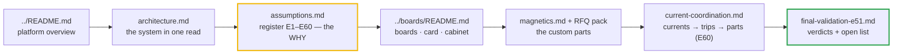

# Documentation Hub

  
  
  
  
  

> **Purpose** — every governing document for the four-SKU module platform, one screen. Every
> claim traces to a runnable artifact: `sh calculations/run-all.sh` reproduces the battery.
>
> [!IMPORTANT]
> Three docs are **generated** (`bom-cost`, `symbol-pin-map`, `lcsc-status`) — regenerate, never
> hand-edit. Two are **grep-pinned by gates** (`protection-thresholds`, `firmware-guide`) — edit
> additively. Dated records are immutable; corrections land as NEW register rows.

## Reading path

## Live specifications

| Document | One-liner | Gate coupling |
|---|---|---|
| [`architecture.md`](architecture.md) | family, power path, control plane, protection map — with the platform flowchart | — |
| [`assumptions.md`](assumptions.md) | decision register **E1–E60** + external assumptions + fidelity policy | rows are the provenance every gate cites |
| [`interconnect.md`](interconnect.md) | sandwich, stud pillars, 40-way harness, grounding, HMI — with the sandwich diagram | `module-interconnect-audit` walks this contract |
| [`protection-thresholds.md`](protection-thresholds.md) | the F.xx ladder + fault-path diagram; HW/FW split, per-SKU timings | **grep-pinned** (R5-K/R6-B/R6-C) — additive edits only |
| [`firmware-guide.md`](firmware-guide.md) | supervisory C99 core: API, HAL contract, boot identity, F.21 semantics | **grep-pinned** (R6-B/R7-E) — additive edits only |
| [`magnetics.md`](magnetics.md) | drawings **D1–D7** + variant tables (E51/E52 revs + **E60 AC-copper rev** baked in) | `magnetics-rfq-audit` · computed stress families |
| [`current-coordination.md`](current-coordination.md) | **E60** — simulated worst currents in every magnetic and switch → F.01/F.11 classes, burdens, DESAT vs SCWT, D2 fault flux, part classes; per-SKU charts | `system/current-coordination.mjs` fails a stale or non-physical deck |
| [`conductor-selection.md`](conductor-selection.md) | **E60** — which copper and why: Dowell foil gauges, Sullivan litz strands, per-winding Rac/Rdc and ΔT | `magnetics/conductor-audit.mjs` + clean-room §B |
| [`simulation-toolchain.md`](simulation-toolchain.md) | **E60** — which simulator/library proves what, exact commands, how to read each result, where fidelity ends | guards: physicality · power-solve · tank fingerprint |
| [`prototype-fast-path.md`](prototype-fast-path.md) | **E60** — off-the-shelf and wind-in-house routes (stock read 13 Sep 2026) to cut the custom-magnetics lead time | sourcing guide — production still goes through the RFQ pack |
| [`magnetics-fmea-e58.md`](magnetics-fmea-e58.md) | **E58 FMEA** — temperature verdict (measured 3C95 surfaces) + 20 failure modes with closures | `magnetics/temp-critique.mjs` recomputes every row |
| [`magnetics-build-instructions.md`](magnetics-build-instructions.md) | **E59 work instructions** — step-by-step build per magnetic: lay-ups, cut lengths, tapes, terminations, impregnation, hold points | pairs with the pack; mag-sync pins the identities |
| [`magnetics-manufacturing-pack.md`](magnetics-manufacturing-pack.md) | **RFQ pack** — one quote-ready sheet per magnetic + sourcing directory | rfq-audit: 0 missing fields |
| [`competitive-benchmark-e51.md`](competitive-benchmark-e51.md) | verified market position, SiC verdict, density gap, cost levers · **§7 E60 harsh-environment parity table** (A11 rev C) | [V] claims = 3-vote verified |
| [`final-validation-e51.md`](final-validation-e51.md) | end-to-end category verdicts + the honest open list | summarizes the standing battery |
| [`verification-matrix.md`](verification-matrix.md) | requirement→evidence matrix + risk register — with the battery pipeline diagram | mirror of run-all |
| [`insulation-coordination.md`](insulation-coordination.md) | barrier map, creepage/clearance values, hipot plan | — |
| [`evt-plan.md`](evt-plan.md) | bench campaign **T-00…T-32** with the phase-flow diagram (E60: SC timing at the new blanks, first-article Rac, −30 °C cold soak) | sim-vs-bench >20 % reopens the calc |
| [`control-card-scope.md`](control-card-scope.md) | why one card caps at 50 kW — ways/HRTIMER/pin arithmetic | `cardMap()` throws past it |
| [`component-selection.md`](component-selection.md) | part table, sourcing policy, second sources, price basis | — |
| [`can-protocol.md`](can-protocol.md) | CAN 2.0B application contract (IDs, frames, CSU rules) | `can_proto.c` is normative (fuzzed) |
| [`bom-guide.md`](bom-guide.md) | how the BOM generates + the maturity taxonomy (E57) | `bom-maturity.mjs` fails UNMAPPED/substance-free lines |
| [`dfm-production.md`](dfm-production.md) | assembly sequence, kitting (D2 bins), travelers, EOL, coating (E52) | — |
| [`thermal-report.md`](thermal-report.md) | loss budgets, cooling, corners, derating | regenerate via `loss-budget.mjs` |
| [`busbar-drawings.md`](busbar-drawings.md) | bulk-copper paths, joint + torque schedule | — |
| [`aux-transformer-D4.md`](aux-transformer-D4.md) | D4 **rev D** turns sheet (ETD39, E52) | stress computes the Bpk line |
| [`pcb-floorplan.md`](pcb-floorplan.md) | layout-phase basis (parked, E36) — zones, barriers, airflow | reopens with layout |
| [`footprints-to-draw.md`](footprints-to-draw.md) | land-pattern queue for the layout reopen († set) | — |

## Generated data (regenerate, never hand-edit)

| Artifact | Owner |
|---|---|
| [`bom-cost.md`](bom-cost.md) — COGS + ₹/kW ladder | `calculations/cost/bom-gen.mjs` |
| [`symbol-pin-map.md`](symbol-pin-map.md) — pin id → package pin | `calculations/pin-map-export.mjs` |
| [`lcsc-status.md`](lcsc-status.md) — LCSC line adjudication | `calculations/cost/lcsc-from-build.mjs` |
| [`../calculations/out/`](../calculations/out/) — every CSV (grid, MC, op-maps, BOMs, engines) | run-all |
| [`../simulation-results/`](../simulation-results/) + [`../spice/generated/`](../spice/generated/) — plots + preserved netlists | sim decks |

## Evidence & dated records

| Record | Status |
|---|---|
| [`simulation-report.md`](simulation-report.md) | **EVIDENCE** — the simulation-truth ledger; never claim beyond it |
| [`design-basis-report.md`](design-basis-report.md) | HISTORICAL (gate-pinned path) — Phase-1 basis |
| [`design-review-production.md`](design-review-production.md) · [`-r2.md`](design-review-production-r2.md) | HISTORICAL (gate-pinned) — R1/R2 audits, same-day closures |
| [`history/`](history/README.md) | six more dated records (R3 response, E40 plan, ERC snapshot, the retired EasyEDA-era face notes, R3 pin map, drawing-set era) — moved at E53; the EasyEDA layer itself was removed at E56 |

The external rounds **R4–R8** live in register rows E45–E49 with permanent gates
(`review-checks.mjs` R4-*…R8-*, `verify-independent.mjs` §I/J).
