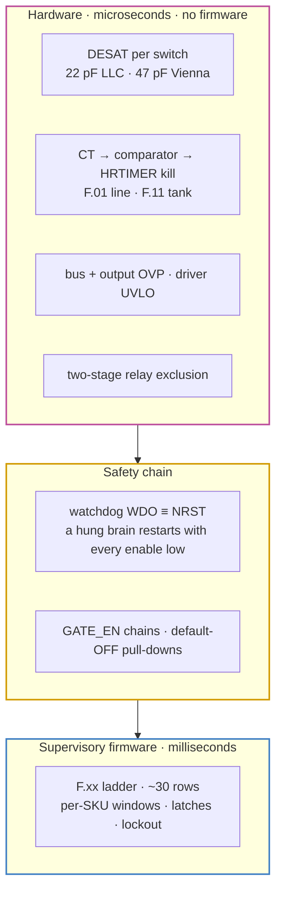
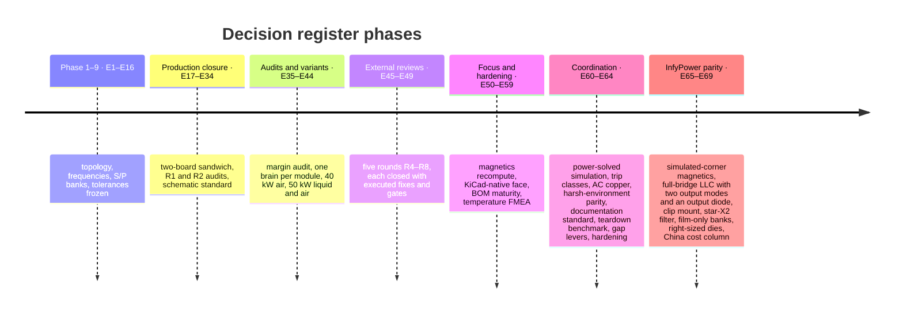

# 🏗️ Platform Architecture

The module in one read — power path, control plane, protection layers, rails and the product family

  
  
  

> [!NOTE]
> **Purpose** — the platform in one read: the product family, the power path stage by stage, the control plane,
> the protection layers, the auxiliary rails and the thermal snapshot. Values are the frozen set in the
> [decision register](assumptions.md) (E1–E69), and every number reproduces from `calculations/run-all.sh`.

## At a glance

| | |
|---|---|
| **Building block** | three Vienna PFC phase cells feeding **one full-bridge LLC** (E67 — the InfyPower REG1K0135A2 DC-DC architecture) |
| **Module** | AC-DC board (lower) + DC-DC board (upper), faces inward, semiconductors on the outer heatsinks or coldplates |
| **Brain** | **one control card per module** (GD32G553VET7) in the DC-DC slot, one CAN port, one 2-button / 2-digit HMI |
| **Input → output** | 3-φ 285–475 VAC → split DC bus 650–830 V → 150–1000 VDC, 100 / 133 / 167 A |
| **Switching** | Vienna 50 kHz (one clip-mounted 750 V SiC die per position, 1200 V JBS) · LLC fr 140 kHz (1200 V SiC full bridge, ZVS; phase shift at 1.45·fr) |
| **Output stage** | two floating banks with film-only filters (E68c); zero-current series/parallel relays — **LOW ≤ 500 V** (parallel) / **HIGH ≥ 500 V** (series), set in standby; output blocking diode |
| **Family** | 30 kW · 40 kW · 50 kW liquid · 50 kW air — one lane, one card and one firmware image each; chargers above 50 kW run modules in parallel |

```mermaid
flowchart LR
  AC(["3-φ 285–475 VAC"]) --> EMI["gG fuse · MOV Δ + GDT<br/>2 × CMC + three star-X2 stages (E68b)"]
  EMI --> PRE["precharge<br/>2 × 33 Ω + 2-pole bypass"]
  PRE --> V["VIENNA PFC · 50 kHz<br/>750 V SiC, one die per position · 1200 V JBS"]
  V --> BUS[("split DC bus<br/>650–830 V · OVP 860")]
  BUS --> LLC["full-bridge LLC · fr 140 kHz<br/>1200 V SiC · Cr + D2 external Lr"]
  LLC --> XF["2 × D3 transformer cells<br/>primaries in series · n 2"]
  XF --> BK["banks A + B<br/>SiC JBS bridges · film only (E68c)"]
  BK --> SP["S/P relays at 0 A + exclusion<br/>LOW ≤ 500 V · HIGH ≥ 500 V"]
  SP --> DO["output blocking diode"]
  DO --> OUT(["150–1000 VDC<br/>100/133/167 A"])
  CARD["ONE control card<br/>GD32G553VET7 · RATING strap"] -. "40-way harness (PFC bundle)" .-> V
  CARD --- LLC
  AUX["110 W full-bus aux<br/>NCP1252D · D4 rev E"] --> CARD
  BUS --> AUX
  style V stroke:#d19a00,stroke-width:2.5px
  style LLC stroke:#1a9fb3,stroke-width:2.5px
  style SP stroke:#b8732e,stroke-width:2.5px
  style CARD stroke:#2ea44f,stroke-width:2.5px
```

## 1. The family

| Module | Silicon relative to 30 kW | Cooling | ₹ @10k · ₹/kW |
|---|---|---|---|
| **30 kW** | baseline — one 750 V 20 mΩ class die per PFC position, one SG2M023120LJ per LLC position | air, 2 fans | 30,033 · 1,001 |
| **40 kW** (E41) | 750 V 15 mΩ class PFC dies; two SG2M023120LJ per LLC position (the fault-pulse rule, E69a-2) | air, 3 fans | 34,616 · 865 |
| **50 kW liquid** (E42) | B3M010C075Z PFC dies; two SG2M023120LJ per LLC position | **liquid**, 0 fans | 40,481 · 810 |
| **50 kW air** (E44) | electrically identical to the liquid module since E68a | air, 4 fans | 38,404 · **768 — cheapest** |

Costs are the India 10k basis generated in [`bom-cost.md`](bom-cost.md), which also carries the China RFQ-target column
(E69f: ₹24,639 / 28,319 / 33,182 / 31,398) and the 2U construction scenario (E69e); the family rationale is in
[module family](../boards/README-module-family.md).

## 2. The power path, stage by stage

| Stage | What it does | Per-SKU detail (30 / 40 / 50 kW) |
|---|---|---|
| **Input protection** | gG fuses, MOV Δ + GDT, two CM chokes with three star-X2 stages (4.7 µF on the line side, between the chokes, and 2 × at the converter) plus the Rd–Cd damper on the AC node — no DM chokes (E68b, InfyPower practice) | fuses 80 / 125 / 160 A; D7 CMCs sized per SKU; DM margin +32.9 / +30.6 / +28.7 dB |
| **Precharge** | 2 × 33 Ω pulse resistors with a 2-pole bypass relay (E14 rev B) | 50 W pulse class at 50 kW |
| **Vienna PFC** | 3-level, 50 kHz; one common-source 750 V SiC pair per phase, clip-mounted on Al2O3 (E68a), with 1200 V JBS diodes to the rails; RC snubber + RCD clamp per node | dies per SKU (E69a): 20 mΩ class · 15 mΩ class · B3M010C075Z; D1 chokes (biased inductance governs — see [magnetics](magnetics.md)) |
| **Fast trips on the PFC** | DESAT on the forward polarity (47 pF blank); line CT → on-chip comparator → HRTIMER kill on the reverse | F.01 = 120 / 155 / 195 A pk on 22 / 18 / 13 Ω burdens; each die ≤ 0.8 × IDM at the fault peak (E69a-2) |
| **Split DC bus** | 650–830 V commanded, films + 2 × (5 / 6 / 8 × 470 µF) per half, hardware OVP 860 V | two-phase discharge: 640 Ω active to the 321 V aux floor, then passive balance |
| **Full-bridge LLC (E67)** | SG2M023120LJ, clip-mounted: one per bridge position at 30 kW, two at 40 / 50 kW (E68a; a single 16 mΩ die at 40 kW failed the E69a-2 fault-pulse rule); PFM down to fn ≈ 0.59, phase shift of leg B at 1.45·fr below that | Cr 7 / 9 / 11 × 33 nF · Lr 5.6 / 4.35 / 3.56 µH = D2 rev F 5.16 / 4.07 / 3.28 µH ±3 % + 2 × cell leakage + loop · Ln 10 |
| **Transformer cells (E67)** | D3 rev D: two cells, primaries in series, each S1–P–S2 with S1 ∥ S2 to one bank; TIW-served litz primary, copper-foil halves, VPI class H, two-face bond | 2 × E70 6:6∥6 (30 kW) · 3 × E70 4:4∥4 (40 / 50 kW); resonant CT F.11 = 140 / 180 / 220 A pk |
| **Rectifiers & banks** | one secondary per bank → SiC JBS full bridge (2 × 40 A per position) → n × 2.2 µF 630 V film straight across the bank (E68c: the D8 inductor and the electrolytic are retired) | 9 / 12 / 14 films per bank; ≤ 3.9 A per film and ≤ 0.5 % RMS output ripple at −10 % C on every simulated corner |
| **S/P relays + output diode** | KSER / KPARA / KPARB PCB power relays switched at zero current in standby; 74HC02 hardware exclusion; DOUT 1600 V blocking diode (150 / 200 / 250 A class) — no K_OUT, no pre-insertion | a welded parallel relay shows as F.17 at the SER soft start |
| **Output** | filter → manganin shunt (positive = delivering, R6-E) → studs | 100 / 133 / 167 A |

## 3. Control plane — one brain per module (E40)

- **One card in the DC-DC slot runs the Vienna and the LLC together.** Every PWM sits on an HRTIMER unit (since E67 the full bridge uses two of the card's three LLC pairs), 22
  analog channels are used, and one merged fault line lands on HRTIMER_FLT2. The 88-way slot carries the DC-DC
  side; a **40-way straight-through harness** (HARNESS40, generated) carries the whole PFC bundle to the AC-DC
  board. There is no inter-MCU link.
- **Identity is one RATING strap** (E24 rev G): 0 Ω → 30 kW · 1 k → 40 kW · 3.32 k → reserved (E66) ·
  10 k → 50 kW liquid · 15 k → 50 kW air · open → fault. One card part number and one firmware image serve the
  whole family.
- **Loops.** Per-phase current (fc ≈ 3 kHz, PM 50°); bus voltage (15 Hz) with
  `bus_ref = clamp(max(2·bank/0.95, 1.08·√2·VLL), 650, 830)`, the E60 FW-R7 line-tracking floor; PFC reference
  clamp 1.05× (FW-R6); PLL and midpoint balance. The LLC runs CV/CC: PFM down to fn ≈ 0.59, then phase shift at 1.45·fr (E67). The output
  mode (LOW / HIGH / AUTO, CAN force-LV / force-HV) is latched in standby; relays switch at zero current behind the
  output diode, and AUTO crosses PAR → SER above 500 V and back below 480 V (FW-R12 / FW-R13).
- **Supervisory firmware** (`firmware/`) is the normative logic: 26 scenarios, group share law, codec, fuzz and invariants —
  **60 / 60 under ASan/UBSan** ([firmware guide](firmware-guide.md)).
- **Pin budget:** 75 of 82 usable MCU pins, 7 spare — the arithmetic is in [control-card scope](control-card-scope.md).

## 4. Protection — three layers

The fast layer has no firmware in the loop. Per-phase line CTs feed on-chip comparators (A / B / C on CMP7 / CMP1 /
CMP2, instance-verified at E48), which kill the HRTIMER on the polarity DESAT cannot see. NSI6611 DESAT (100 Ω
series resistor, R5-B) covers the forward polarity. Resonant over-current comparators, bus and output OVP, driver
UVLO and the relay exclusion complete it. The watchdog's open-drain WDO gates the enable **and** resets the MCU. The
full ladder, with timings, is [protection thresholds](protection-thresholds.md); the currents behind every class
are [current coordination](current-coordination.md).

## 5. Auxiliary supply and rails

| Rail | Source | Serves |
|---|---|---|
| **Full-bus aux** | 110 W flyback, D4 rev D on ETD39 (E52), **NCP1252D** (R6-G — the A-suffix could not cold-start), 220 µF VCC reservoir | everything below; brown-out at 321 V bus; cold start ≈ 5–6 s nominal, ≈ 8 s at low line |
| **V24** | aux secondary | relay coils, fans |
| **V15** | aux secondary | driver bias modules, card feed |
| **3.3 V** | sync buck per board (100 k / 27 k EN dividers, R4-4) | local logic and senses |
| **Isolated bias** | reinforced-class modules (QA01C-18) · drawn +18 / −4 V; the catalogue part is +18 / −3 V, so the −4 V split is open decision O-11 | every floating driver and sense domain |

## 6. Efficiency and thermal snapshot

| | 30 kW | 40 kW | 50 kW liquid | 50 kW air |
|---|---:|---:|---:|---:|
| η at 400 VAC, full load (output diode included) | 96.62 % | 96.70 % | 96.56 % | 96.48 % |
| Peak η | 98.11 % | 98.26 % | 98.30 % | 98.30 % |
| Loss at rated | 1,049 W | 1,367 W | 1,782 W | 1,822 W |
| Worst Tj on the 4,536-point grid (PFC · LLC · JBS) | 112 · **139** · 91 °C | 127 · 98 · 103 °C | 116 · 99 · 102 °C | **135** · 114 · 116 °C |
| Mount basis (E68a) | 0.8 K/W · 70 °C base | 0.8 K/W · 70 °C | 0.65 K/W · 65 °C plate | 0.8 K/W · 70 °C |

The grid has no failures and no folds. Every device sits inside its own acceptance line (`stress-audit.mjs`, in
run-all). Details: [thermal report](thermal-report.md).

## 7. How the platform got here

Each decision is recorded row by row in the [decision register](assumptions.md); the git history keeps every earlier record.

---

<a href="README.md">← Documentation Hub</a> &nbsp;·&nbsp; <a href="README.md">🧭 Documentation hub</a> &nbsp;·&nbsp; <a href="assumptions.md">Decision Register →</a>

Vectivolt DC-Modules · documentation rev E72 · every number reproduces with <code>sh calculations/run-all.sh</code>

