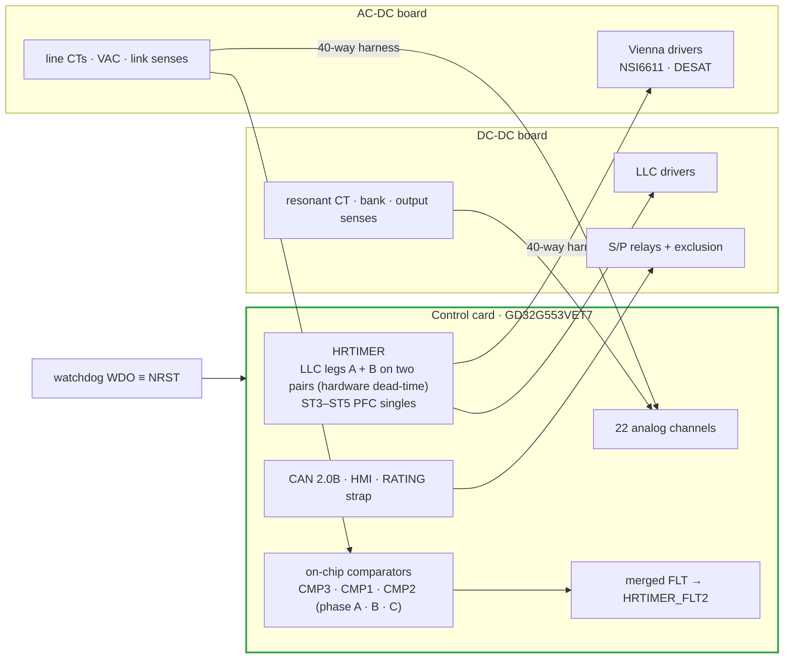
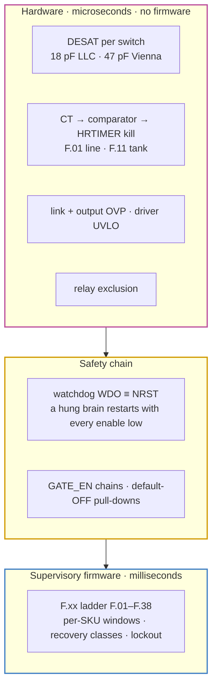

# 🏗️ Platform Architecture

The module in one read — power path, control plane, protection layers, rails and the product family

  
  
  

> [!NOTE]
> **Purpose** — the platform in one read: the product family, the power path stage by stage, the control plane,
> the protection layers, the auxiliary rails and the thermal snapshot. Every value here is the one in force in the
> [decision register](assumptions.md), and every number reproduces from `sh calculations/run-all.sh`.
>
> **Gate coupling** — `verify-independent` walks the built netlists behind every structural claim on this page;
> `loss-budget`, `envelope-grid` and `stress-audit` own the numbers in §6, and `fw-constants-sync` holds the firmware
> constants against them. What is measured rather than computed is listed in the [validation report](validation-report.md).

## At a glance

| | |
|---|---|
| **Building block** | three Vienna PFC phase cells feeding **one full-bridge LLC** with two transformer cells |
| **Module** | AC-DC board (lower) + DC-DC board (upper), faces inward, semiconductors on the outer heatsinks or coldplates |
| **Brain** | **one control card per module** (GD32G553VET7) in the DC-DC slot, one CAN port, one 2-button / 2-digit HMI |
| **Input → output** | 3-φ 285–475 VAC → split DC link 650–830 V → 150–1000 VDC, 100 / 133 / 167 A |
| **Switching** | Vienna 50 kHz (one clip-mounted 750 V SiC die per position, 1200 V JBS) · LLC f_r 140 kHz (1200 V SiC full bridge, ZVS; phase shift at 1.45 · f_r) |
| **Output stage** | two floating banks with film-only filters; zero-current series/parallel relays — **LOW ≤ 500 V** (parallel) / **HIGH ≥ 500 V** (series), latched with the matrix open; output blocking diode |
| **Family** | 30 kW · 40 kW · 50 kW liquid · 50 kW air — one lane, one card and one firmware image each; chargers above 50 kW run modules in parallel |

```mermaid
flowchart LR
  AC(["3-φ 285–475 VAC"]) --> EMI["gG fuse · MOV Δ + GDT<br/>2 × CMC + three star-X2 stages"]
  EMI --> PRE["precharge<br/>2 × 33 Ω + 2-pole bypass"]
  PRE --> V["VIENNA PFC · 50 kHz<br/>750 V SiC, one die per position · 1200 V JBS"]
  V --> BUS[("split DC link<br/>650–830 V · OVP 860")]
  BUS --> LLC["full-bridge LLC · f_r 140 kHz<br/>1200 V SiC · Cr + D2 external Lr"]
  LLC --> XF["2 × D3 transformer cells<br/>primaries in series · n 2"]
  XF --> BK["banks A + B<br/>SiC JBS bridges · film only"]
  BK --> SP["S/P relays at 0 A + exclusion<br/>LOW ≤ 500 V · HIGH ≥ 500 V"]
  SP --> DO["output blocking diode"]
  DO --> OUT(["150–1000 VDC<br/>100/133/167 A"])
  CARD["ONE control card<br/>GD32G553VET7 · RATING strap"] -. "40-way harness (PFC bundle)" .-> V
  CARD --- LLC
  AUX["110 W full-bus aux<br/>NCP1252D · D4 on ETD44"] --> CARD
  BUS --> AUX
  style V stroke:#d19a00,stroke-width:2.5px
  style LLC stroke:#1a9fb3,stroke-width:2.5px
  style SP stroke:#b8732e,stroke-width:2.5px
  style CARD stroke:#2ea44f,stroke-width:2.5px
```

## 1. The family

| Module | Silicon relative to 30 kW | Cooling | ₹ @10k · ₹/kW |
|---|---|---|---|
| **30 kW** | baseline — one 750 V 20 mΩ class die per PFC position, **one** SG2M023120LJ per LLC position (a second die costs 5.2 % of the module against a ≤ 5 % ceiling; the hot corners fold instead) | air, 3 fans | 31,613 · 1,054 |
| **40 kW** | 750 V 15 mΩ class PFC dies; two SG2M023120LJ per LLC position (a single 16 mΩ die misses the fault-pulse rule) | air, 3 fans | 36,103 · 903 |
| **50 kW liquid** | B3M010C075Z PFC dies; two SG2M023120LJ per LLC position | **liquid**, 0 fans | 42,761 · 855 |
| **50 kW air** | electrically identical to the liquid module | air, 4 fans | 40,688 · **814 — cheapest** |

Costs are the India 10k basis generated in [`bom-cost.md`](bom-cost.md), which also carries the China RFQ-target column
(₹25,920 / 29,520 / 35,023 / 33,243) and the 2U construction scenario; the family rationale is in
[module family](../boards/README-module-family.md).

## 2. The power path, stage by stage

| Stage | What it does | Per-SKU detail (30 / 40 / 50 kW) |
|---|---|---|
| **Input protection** | gG fuses, MOV Δ + MOV/GDT to PE per line, two CM chokes with three star-X2 stages (4.7 µF on the line side, 4.7 µF between the chokes, 2 × 4.7 µF at the converter) plus an Rd–Cd damper on the converter star — no DM chokes: the star-X2 ladder carries the differential mode | fuses 80 / 125 / 160 A; D7 CMCs sized per SKU; damper 2.2 µF / 6.8 Ω at 30–40 kW, 4.7 µF / 4.7 Ω at 50 kW (25 W class); DM margin +32.9 / +30.6 / +28.7 dB |
| **Precharge** | 2 × 33 Ω pulse resistors in L1 / L2 with a 2-pole bypass relay, so every line-line loop sees at least one resistor; the two relay auxiliaries are in series, which is the only stuck-open detection | 25 W pulse class, 50 W at 50 kW; bypass 80 / 100 / 250 A class |
| **Vienna PFC** | 3-level, 50 kHz; one common-source 750 V SiC pair per phase, clip-mounted on 0.635 mm Al₂O₃, with 1200 V JBS diodes to both rails; RC snubber (10 Ω + 330 pF) and an RCD clamp per node | dies per SKU: 20 mΩ class · 15 mΩ class · B3M010C075Z; the mirrored clamp for the negative half-cycle is populated on the 50 kW pair; D1 chokes — biased inductance governs, see [magnetics](magnetics.md) |
| **Fast trips on the PFC** | DESAT on the forward polarity (47 pF blank); line CT → on-chip comparator → HRTIMER kill on the reverse | F.01 = 120 / 155 / 195 A pk on 22 / 18 / 13 Ω burdens; each die ≤ 0.8 × I_DM at the fault peak |
| **Split DC link** | 650–830 V commanded, 2 × (5 / 6 / 8 × 470 µF **500 V**) cans, **16 / 16 / 20 × 1 µF 1100 V bridge entry film + a 2.2 µF / 0.33 Ω RC damper** (the link resonates near 2 · f_sw against the stud loop, and the damper resistor carries 7 / 16 / 36 W), hardware OVP 860 V and a 440 V / 10 ms ceiling on either half | two-phase discharge: 4 × 160 Ω active to the 321 V aux floor, then one passive balance string per half |
| **Full-bridge LLC** | SG2M023120LJ, clip-mounted: one per bridge position at 30 kW, two at 40 / 50 kW; one **330 / 680 / 1000 pF** C0G turn-off snubber per die at the package pins with R_g,off 0 Ω — the snubber sets dv/dt, and a 4.7 Ω turn-off resistor would cost 3–5 × the turn-off energy; PFM down to f_n 0.55, then leg-B phase shift at 1.45 · f_r, and burst only with the bank at 100 V or more | Cr 7 / 9 / 11 × 33 nF · tank Lr 5.6 / 4.35 / 3.56 µH = D2 external 5.00 / 3.99 / 3.20 µH ±3 % + two cell leakages + loop · Lm 56 / 43.5 / 35.6 µH · Ln 10 · 77–203 kHz |
| **Transformer cells** | D3: two cells, primaries in series (n = 2 overall), each S1–P–S2 with S1 ∥ S2 feeding one bank; TIW-served litz primary, copper-foil halves, VPI Class H, both yoke faces bonded | 2 × E70 6:6∥6 (30 kW) · 3 × E70 4:4∥4 (40 / 50 kW); one resonant CT on the tank, F.11 = 140 / 180 / 220 A pk on 0.47 / 0.36 / 0.30 Ω |
| **Rectifiers & banks** | one secondary per bank → SiC JBS full bridge (2 × 40 A per position) → n × 2.2 µF 630 V film straight across the bank; no bank inductor and no electrolytic | 9 / 12 / 14 films per bank, sized so no film exceeds its rms line and output ripple stays ≤ 0.5 % rms at −10 % capacitance on every simulated corner |
| **S/P relays + output diode** | KSER / KPARA / KPARB PCB power relays switched at zero current with the LLC stopped; 74HC02 hardware exclusion; DOUT 1600 V blocking diode makes back-feed and reverse-battery harmless without an output contactor | relays 120 A class, 150 A at 50 kW; DOUT 150 / 200 / 250 A class; a welded parallel relay shows as F.17 at the SER soft start |
| **Output** | blocking diode → 3 × 150 k bleeder across the studs (1000 → 60 V in ≈ 12 s) → manganin shunt (positive = delivering) → studs | shunt 0.500 / 0.376 / 0.299 mΩ; 100 / 133 / 167 A |

## 3. Control plane — one brain per module

- **One card in the DC-DC slot runs the Vienna and the LLC together.** Every PWM sits on an HRTIMER slave unit (ST0–ST2
  carry the LLC pairs, ST3–ST5 the PFC singles), 22 analog channels are used, and one merged fault line lands on
  HRTIMER_FLT2. The 88-way slot carries the DC-DC side; a **40-way straight-through harness** (HARNESS40, generated)
  carries the whole PFC bundle to the AC-DC board. There is no second MCU and no inter-card link.
- **Identity is one RATING strap**: 0 Ω → 30 kW · 1 k → 40 kW · 3.32 k → reserved · 10 k → 50 kW liquid ·
  15 k → 50 kW air · open → fault. One card part number and one firmware image serve the whole family; a strap the
  decoder cannot place runs on the tightest classes with delivery inhibited.
- **Loops.** Per-phase current (f_c ≈ 3 kHz, PM 50°, GM 8.7 dB); link voltage (15 Hz, PM 65°) with
  `bus_ref = clamp(max(2·bank/0.95, 1.08·√2·V_LL), 650, 830)` — the line-tracking floor exists because a Vienna
  rectifier cannot regulate below the line-line crest. The reference **leads the measured output by 25 V** instead of
  following the command: vehicles send their maximum voltage as the setpoint and charge in constant current far below
  it, and a command-following link parked the bridge in deep phase shift across the mainstream range. The LLC runs
  CV/CC: PFM down to f_n 0.55, then phase shift at 1.45 · f_r. The output mode (LOW / HIGH / AUTO, CAN force-LV /
  force-HV) latches only with the matrix open; relays switch at zero current behind the output diode, and AUTO crosses
  PAR → SER above 500 V and returns below 480 V.
- **Supervisory firmware** (`firmware/`) is the normative logic, proven on host plants under ASan/UBSan
  ([firmware guide](firmware-guide.md)). Three layers: `proto/` profiles ([VMP 2.0](can-protocol.md) native,
  [TonHe V1.2](can-profile-tonhe-v12.md)) → one canonical model (`core/modapi.h`) → the power core. No core file
  includes a profile, so a vendor protocol adds a file and a registry line and nothing else
  ([firmware architecture](firmware-architecture.md)). The portable real-time HAL (`firmware/hal/`) carries the Vienna
  law, the LLC modulator with its ZVS floor, measurement, NVM, the junction observer and the application; the signed
  A/B boot chain and the three flash journals sit under `firmware/boot/` and `firmware/port/`.
- **MCU headroom is measured, not estimated.** The worst PFC interrupt is **5.8 µs static** after the trims
  (≈ 1,250 cycles at 216 MHz). The control interrupt is triggered by the ADC end-of-sequence DMA transfer rather than
  a timer compare, so it starts ≈ 2.8 µs after the trigger and has **≈ 7.2 µs** to the roll-over that loads the compare
  shadows — a centre-aligned compare is crossed twice per period and is equal-spaced only at CAR/2, which is why the
  DMA form was taken. T-64 measures both with DWT. The single-update PFC fallback is **forbidden on the 40 / 50 kW
  SKUs**: it drops the input-filter modulus margin to 0.26 / 0.39 against a ≥ 0.50 criterion.
- **Pin budget:** 75 of 82 usable MCU pins with **7 spare**, 22 of 22 analog ways, 7 of 12 PWM ways, 5 of 8 HRTIMER
  units and all 40 harness ways — the arithmetic is in [control-card scope](control-card-scope.md).

## 4. Protection — three layers

The split is deliberate: **hardware where a device has microseconds to live, firmware everywhere else.** The fast layer
has no firmware in the loop. Per-phase line CTs feed on-chip comparators (A / B / C on CMP3 / CMP1 / CMP2, all on
non-inverting inputs with positive-only references), which kill the HRTIMER on the polarity DESAT cannot see; NSI6611
DESAT with a 100 Ω series resistor covers the forward polarity. Resonant over-current, link and output OVP, driver
UVLO and the relay exclusion complete it. Every hardware trip is held in `trip_n` / `trip_ack` until the supervisor has
latched it, so a control interrupt cannot re-arm the outputs behind the fault. The watchdog's open-drain WDO gates the
enable **and** resets the MCU on a fixed 2.22–23.375 ms window. The full ladder, with timings, is
[protection thresholds](protection-thresholds.md); the currents behind every class are
[current coordination](current-coordination.md).

## 5. Auxiliary supply and rails

| Rail | Source | Serves |
|---|---|---|
| **Full-bus aux** | 110 W flyback on ETD44 (D4), **NCP1252D**, 1700 V SiC switch, 220 µF VCC reservoir — the D-suffix controller is what cold-starts: the A-suffix holds a mandatory 120 ms pre-soft-start delay on 1.0 V of hysteresis and hiccups forever | everything below; brown-out at 321 V link; cold start ≈ 5–6 s nominal, ≈ 8 s at low line |
| **V24** | aux secondary | relay coils, fans, with a 4.7 k preload so an unloaded rail cannot peak-charge past the coil maximum |
| **V15** | aux secondary | driver bias modules, card feed |
| **3.3 V** | sync buck per board | local logic and senses |
| **Isolated bias** | reinforced-class modules, **+15 / −3 V** on every channel (ISO-GBIAS-15-1W; the 2 W ISO-GBIAS-15-2W wherever one channel drives two dies, so 40 / 50 kW), acceptance *+15 V ±5 % at 20–100 % load, ≤ +17.5 V at 5 % load*. +18 V is not used: it exceeds the second source's static maximum. −3 V keeps 2 V to the SiC gate's −5 V conditional floor, scoped at the double-pulse test | every floating driver and sense domain |

## 6. Efficiency and thermal snapshot

| | 30 kW | 40 kW | 50 kW liquid | 50 kW air |
|---|---:|---:|---:|---:|
| η at 400 VAC, full load (ledger incl. output diode, LLC turn-off and the measured switching share) | 96.38 % | 96.34 % | 96.29 % | 96.22 % |
| Peak η over the envelope | 97.78 % | 97.84 % | 97.80 % | 97.79 % |
| Loss at rated | 1,127 W | 1,519 W | 1,925 W | 1,965 W |
| Worst LLC T_j on the grid, folds applied | **150 °C** | 145 °C | 139 °C | **150 °C** |
| Worst Vienna T_j · secondary JBS T_j | 128 · 90 °C | **149** · 108 °C | 130 · 102 °C | **149** · 118 °C |
| Mount basis (clip on Al₂O₃) | 0.8 K/W · 74 °C base | 0.8 K/W · 75 °C | 0.65 K/W · 65 °C plate | 0.8 K/W · 77 °C |

**The derating curve is firmware, not a data-sheet drawing.** Four temperature zones each hold 100 % up to their derate
point and fall linearly to **60 %** at their trip, where F.22 latches: **inlet (air or coolant) 55 → 75 °C** ·
T_PFC 95 → 105 °C · T_LLC 100 → 110 °C · T_XFMR 105 → 115 °C. The worst zone governs, recovery carries 5 °C of
hysteresis and is limited to 20 %/s, and the thermal gates are solved at this same law.

> [!WARNING]
> **The grid is fold-mapped, and nothing on it fails.** Every point passes. What remains is a **fold map**, all of it at
> full load and at 55 °C ambient: the 500 V series hot corner (30 kW 93 % at 285 VAC down to **75 %** at 450–475 VAC,
> 93 % at 25 °C · 40 kW 93 % at 450–475 VAC · 50 kW-air 93 % at 330–400, 86 % at 450, 80 % at 475 VAC); the LOW-mode
> 150–300 V corners (30 kW 93 %, 86 % at 475 VAC · 50 kW-air 93 → 80 %); and the **Vienna die at low line on an 830 V
> link** (40 kW 93 % at 285 VAC · 50 kW-air 86 % at 285, 93 % at 300–330 VAC), which the grid sees once it carries the
> modulation-index term and the datasheet R_DS(on) slope. The 50 kW liquid folds nowhere. The folds are not a paper
> derating curve: `hal/dielim.c` estimates the worst die's junction from the loss at the operating point above the
> measured zone NTC and scales availability between 142 and 150 °C, and a point it cannot cool is declined outright
> rather than left to cycle through burst.

Every device sits inside its own acceptance line (`stress-audit`, in run-all). Details:
[thermal report](thermal-report.md) · [validation report](validation-report.md).

> [!TIP]
> **How this page is checked** — `verify-independent` walks the built netlists behind every structural claim;
> `loss-budget`, `envelope-grid` and `stress-audit` own §6; `fw-constants-sync` holds the firmware constants against
> the drawings and the decks; `docs-lint` holds the links and diagrams. All of them run in `sh calculations/run-all.sh`.

---

<a href="README.md">← Documentation Hub</a> &nbsp;·&nbsp; <a href="README.md">🧭 Documentation hub</a> &nbsp;·&nbsp; <a href="assumptions.md">Decision Register →</a>

Vectivolt DC-Modules · documentation rev E83 · every number reproduces with <code>sh calculations/run-all.sh</code>

