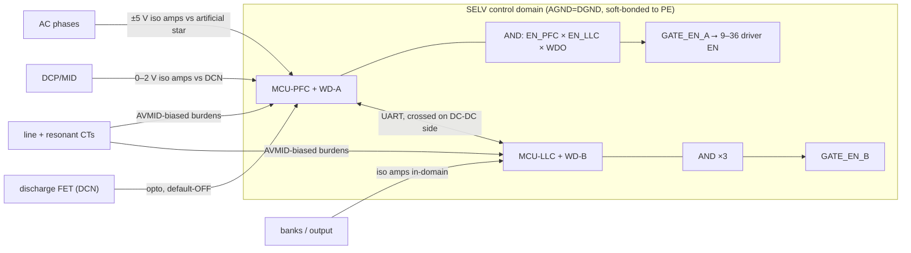

# Platform Architecture — Phase 9 Freeze (rev B: two-board sandwich, E17)

One repeatable ~10 kW **cell pair** (PFC phase cell + LLC section) instantiated 3/6/12×, **two sandwiched boards (AC-DC lower + DC-DC upper, faces inward, semis to outer heatsinks — docs/interconnect.md)**, one enclosure, one external CAN, one 2-button/2-digit config HMI, two GD32G553 MCUs — at every rating. Values below are the frozen set (assumptions.md E1–E16); calculations in `calculations/`, sims in `docs/simulation-report.md`.

## Power path (30 kW; ×2 lanes/channels = 60 kW; ×4 = 120 kW, one PCB)

```
3φ 285–475 VAC (full P ≥330 V)
 → fuse • MOV network • CM/DM EMI (2-stage) → precharge 33 Ω + bypass relay
 → Vienna 3-level PFC, 50 kHz, per phase: 165 µH-class sendust choke (0077908A7 26µ 3-stack, N=39±1 — D1 rev B, audit E35),
   common-source B3M010C075Z pair (1 PWM), 2× 1200 V/40 A JBS to rails,
   RC 10Ω/470p + RCD clamp (JBS+100 nF+470 Ω) per node
 → split bus 800 V (650–830 V commanded), 2×(5× 470 µF/450 V) + film, midpoint sensed,
   HW OVP 860 V, balancing loop, discharge 640 Ω/FET
 → 3-phase half-bridge LLC per channel, SG2M023120LJ, PFM 100–203 kHz around fr=140 kHz,
   per phase (E7 rev D2): Cr 185 nF (4×46 nF 1200 V PP) + Lr trim binned 3.3–4.35 µH
   (D2, Lr total 7.0 µH) + section transformer (3×PQ50/50, 7:7:7, Lm 63 µH, leakage ~3 µH),
   star primaries
 → per section 2 secondaries → 2× SiC JBS bridges (1200 V/20 A) → floating banks A, B
 → S/P matrix: K_PAR_A/B (each with 10 Ω pre-insertion aux), K_SER, K_OUT, bleed
 → output filter → shunt (manganin + NSI1200) → busbar 150–1000 V, 100/200/400 A
```

## Control plane

- **MCU-PFC** (GD32G553): 3/6/12 HRTIM PWM (lanes phase-shifted 180° or 90°), per-lane phase-current loops (fc 3 kHz, PM 50°), bus-voltage loop (15 Hz) with VBUS_ref follower, PLL, midpoint balancing, precharge/discharge FSM, fan control, comparator OC/OVP → PWM kill.
- **MCU-LLC**: 3/6/12 HRTIM half-bridge pairs common PFM clock, CV/CC loops, mode map (PFM / PS <260 V bank / burst), bus_ref = clamp(2·bank/0.95, 650, 830) requested over internal link, S/P FSM (I≈0 → PWM off → BBM → pre-insert to ΔV<0.5 V → make → verify → resume; weld detect 1.5 V/200 ms), K_OUT pre-regulation to terminal V, external CAN 2.0B 125 kbps 29-bit.
- Internal link: UART/CAN 10 ms cadence, CRC16 + sequence + 50 ms timeout → controlled shutdown; re-ENABLE required after loss (§22/§23).

## Protection map (§24; thresholds table in docs/protection-thresholds.md)

Hardware-fast (no firmware): per-lane phase OC comparators → HRTIM kill; resonant OC per channel; bus OVP 860 V; output OVP; DESAT per SiC (NSI6611); driver UVLO; complementary-PWM interlock; watchdog gate-kill; aux-collapse gate clamp (drivers hold-low on UVLO — §28 requirement).
Supervisory (firmware): §24 full list — input OV/UV/phase loss (validated behavior: sim run `400-phloss`)/sequence/imbalance, midpoint, all temperature zones, fan tach, output OC/UV/short, bank imbalance, relay faults (incl. weld), discharge failure, sensor plausibility, comm timeouts, EEPROM CRC, repeated-fault lockout, pre-fault snapshot ring buffer.

## Scaling (Phase 12 confirmation)

| | 30 kW | 60 kW | 120 kW |
|---|---|---|---|
| PFC lanes (interleave) | 1 | 2 @0/180° | 4 @0/90/180/270° |
| LLC channels | 1 | 2 | 4 |
| Magnetics | 3 chokes + 3 sections | 6+6 | 12+12 — same two p/n family-wide |
| DC link | 10× 470 µF | 18–20× | 36–40× |
| Output relays | 100 A set | 200 A set | 2×200 A paralleled (make at matched V per FSM) |
| PWM/MCU | 3+3 ch | 6+6 | 12+12 (HRTIM full) |
| Ripple at EMI filter | 50 kHz | 100 kHz eff. | 200 kHz eff. |

Same two-board outline family, same heatsink extrusion profile (length scales), same fan p/n (2/2/4). Board pair per SKU: 420×300+460×320 / 460×420+520×420 / 560×600+640×620 mm.

## Efficiency / thermal snapshot (loss-budget.mjs)

η at 400 V/full/≥300 V out: 97.4 / 97.5 / 97.5 % (JBS baseline; SR variant +0.68 pt). Worst corner (330 V in): 30 kW = 871 W total, 620 W on heatsink → Rth ≤0.032 K/W at rated airflow; derate 100%@55 °C → 40%@75 °C.


---

## Rev C (2026-09-05) — production-review closure deltas

The frozen power path is unchanged. What changed is the support architecture (register E25–E31):



- **Enable/kill:** no software-only gate path remains — E27 wired-AND with per-board windowed
  watchdogs; harness loss or a hung MCU disables both boards' gates in hardware.
- **Sensing:** every HV measurement is isolated (E25); the control domain is touch-safe SELV, so
  the HMI/SWD/fans/CAN need no additional barriers.
- **Aux:** full-bus 60 W flyback (E26) — boots from 285 VAC cold; powers worst-case relay+fan load.
- **Energy storage:** bank strings 2×450 V (E29); Vienna legs carry local film commutation caps.
- **Readback:** all HV relays have mirror contacts wired to the MCUs (E30) — F.19 is real.

## Rev D (2026-09-05) — R2 re-audit closure deltas (E32/E33, E26 rev C)

Power path unchanged again; the R2 pass caught defects inside the rev-C fixes and 30 kW-defaults
masquerading as SKU scaling: resonant sensing re-scaled (2.0 Ω burdens), **each board now sources
its own 3.3 V via sync buck** (the DC-DC board had no 3.3 V source at all), aux re-rated to a
single 110 W stage family-wide (D4 rev C, NCP1252A, 400 V rectifiers), `FLT_LLC` reaches MCU-LLC,
commanded **bank** discharge added (E33), tank aligned to the frozen rev-D2 values, watchdog symbol
completed, reinforced-class bias modules, 4 monitored fans + dual S/P relay instances + per-SKU
CM chokes/pulse parts at 120 kW, F.21 implemented in firmware. Full log:
`docs/design-review-production-r2.md`.
