# Platform Architecture — rev E49 (2026-09-09)

<p align="left">  </p>

> **Purpose** — The platform in one read: family, power path, control plane, protection map, rails, thermal snapshot.


One ~10 kW **cell pair** (Vienna PFC phase cell + 3-φ LLC section ×3) on one two-board sandwich
(AC-DC lower + DC-DC upper, faces inward, semiconductors to the outer heatsinks), **one control
card — one brain per module** (GD32G553VET7, E40), one external CAN, one 2-button/2-digit HMI.
Four module SKUs share the platform; higher ratings are **cabinets of modules**. Values below are
the frozen set (register E1–E49 in [`assumptions.md`](assumptions.md)); every number reproduces
from `calculations/run-all.sh`.

```mermaid
flowchart LR
  AC(["3φ 285–475 VAC"]) --> EMI["gG fuse · MOV Δ + GDT<br/>2× CM + DM EMI stages"]
  EMI --> PRE["precharge<br/>2× 33 Ω + 2-pole bypass"]
  PRE --> V["VIENNA PFC · 50 kHz<br/>750 V SiC pairs · 1200 V JBS"]
  V --> BUS[("split DC bus<br/>650–830 V · OVP 860")]
  BUS --> LLC["3-φ LLC · fr 140 kHz<br/>1200 V SiC half-bridges"]
  LLC --> XF["3× section transformers<br/>D3 rev B · Lm 63 µH"]
  XF --> BK["banks A + B<br/>SiC JBS bridges"]
  BK --> SP["S/P matrix + exclusion<br/>pre-insertion · K_OUT"]
  SP --> OUT(["150–1000 VDC<br/>100/133/167 A"])
  CARD["ONE control card<br/>GD32G553VET7 · RATING strap"] -. "40-way harness (PFC bundle)" .-> V
  CARD --- LLC
  AUX["110 W full-bus aux<br/>NCP1252D · D4 rev D"] --> CARD
  BUS --> AUX
  style V stroke:#f2b705,stroke-width:2.5px
  style LLC stroke:#f2b705,stroke-width:2.5px
  style SP stroke:#e3763c,stroke-width:2.5px
  style CARD stroke:#2ea44f,stroke-width:2.5px
```



## The family (E40/E41/E42/E44)

| Module | Silicon vs 30 kW | Cooling | ₹@10k · ₹/kW |
|---|---|---|---|
| **30 kW** | baseline (single B3M pair/phase, single SG2M/position) | air, 2 fans | 30,682 · 1,023 |
| **40 kW** (E41) | PFC pairs **paralleled** (2× B3M/position, own 2.2 Ω each) | air, 3 fans | 35,292 · 882 |
| **50 kW** (E42) | 40 kW silicon (single LLC FETs — the coldplate buys it) | **liquid**, 0 fans | 41,320 · 826 |
| **50 kW air** (E44) | PFC **and** LLC paralleled (per-package conduction quarters) | air, 4 fans | 40,972 · **819 — cheapest** |
| Products | 60/80/100 kW = 2× modules · 120/150 kW = 3–4× + **CSU** (same card, strap role) | | cheapest 120 = 3×40+CSU ₹107,710 (898) |

## Power path (per module; all four SKUs, one drawing family)

```
3φ 285–475 VAC (full P ≥330 V)
 → fuse (80/125/160 A gG per SKU) • MOV Δ + GDT • 2-stage CM/DM EMI (D6/D7 per SKU)
 → precharge 33 Ω ×2 + 2-pole bypass relay (E14 rev B)
 → Vienna 3-level PFC, 50 kHz: per-SKU D1 choke (biased-L governs — see magnetics.md),
   common-source B3M010C075Z pair (×2 paralleled at 40/50), 2× 1200 V JBS to rails,
   RC snubber + RCD clamp per node, DESAT (fwd) + line-CT→CMP→HRTIMER trip (rev, E47/E48)
 → split 800 V bus (650–830 V commanded), 2×(5/6/8× 470 µF) per SKU + films, HW OVP 860 V,
   two-phase discharge: 640 Ω active to the 321 V aux floor, then passive balance
   (370/222/296 s to <60 V at 30/40/50 — label: isolate, wait 10 min, AND verify; E47/E49)
 → 3-phase half-bridge LLC, SG2M023120LJ (×2 paralleled on the air-50), PFM around fr 140 kHz:
   per-SKU Cr bank (4×46 n / 6×33 n / 8×27 n), binned trim + leakage = Lr, section transformer
   (3×PQ50 7:7:7 · 2×E70 9:9:9 · 3×E70 6:6:6), Lm 63 µH ±7 %, star primaries
 → 2 secondaries/section → 2× SiC JBS bridges → floating banks A, B
 → S/P matrix: K_PAR_A/B (10 Ω pre-insertion), K_SER, K_OUT (dual at 50 kW), bank bleeders
   (VOM1271 PV-driven, R8 drive), two-stage 74HC02 exclusion (KSER ∧ ¬KPAR* ∧ ¬KPRE*, R5-D)
 → output filter → manganin shunt (50 mV, per-SKU rating; positive = delivering, R6-E)
 → studs 150–1000 V · 100/133/167 A per SKU
```

## Control plane (E40 single brain)

- **One control card** in the DC-DC slot runs Vienna + LLC together: all nine PWMs on HRTIMER
  units (LLC pairs ST0–2 with hardware dead-time, PFC singles ST3–5), 22 analog channels,
  one merged FLT on HRTIMER_FLT2. The 88-way slot carries the DC-DC side; a **40-way
  straight-through harness** (HARNESS40, generated) carries the whole PFC bundle to the AC-DC
  board. No inter-MCU link exists.
- **Identity = one RATING strap** (E24 rev G): 0 R → 30 kW · 1 k → 40 kW · 3.32 k → cabinet
  CSU · 10 k → 50 kW liquid · 15 k → 50 kW air · open → fault. One card p/n, one firmware
  image, family-wide (1/2/3–5 cards at module/2×/cabinet scale).
- Loops: per-phase current (fc ≈3 kHz, PM 50°), bus voltage (15 Hz) with bus_ref =
  clamp(2·bank/0.95, 650, 830), PLL + midpoint balance; LLC CV/CC with mode map
  (PFM / phase-shift <260 V bank / burst), S/P FSM with pre-insertion, weld check and the
  E12b K_OUT gate. External CAN 2.0B 125 kbps, 29-bit ([`can-protocol.md`](can-protocol.md)).
- Supervisory C99 core (`firmware/`) is the normative logic — 26 scenarios + CSU + codec +
  fuzz + invariants, **50/50 under ASan/UBSan** ([`firmware-guide.md`](firmware-guide.md)).

## Protection map (full table: [`protection-thresholds.md`](protection-thresholds.md))

Hardware-fast, no firmware in the loop: per-phase line-CT → on-chip comparator (A/B/C on
CMP7/CMP1/CMP2, instance-verified E48) → HRTIMER kill for the DESAT-blind polarity; NSI6611
DESAT (100 Ω series, R5-B) for the forward polarity; resonant OC comparators; bus/output OVP;
driver UVLO; the two-stage relay exclusion; and the watchdog — whose open-drain WDO both
gates the enable AND **resets the MCU** (WDO ≡ NRST, R5-A/R6-A: a hung brain restarts with
every enable low). Supervisory firmware carries the ~30-row F.xx ladder with per-SKU windows.

## Auxiliary and rails

Full-bus 110 W flyback (D4 rev C): **NCP1252D** (R6-G — the A-suffix could not cold-start:
120 ms mandatory delay vs 1 V hysteresis), 220 µF VCC reservoir, brown-out at 321 V bus,
cold start ≈5–6 s nominal (≈8 s low-line). Rails: V24 (coils/fans), V15 (bias + card feed),
per-board 3.3 V sync bucks (100 k/27 k EN dividers, R4-4), reinforced-class isolated bias
modules (QA01C-18, +18/−3) for every floating driver/sense domain.

## Efficiency / thermal snapshot (per-variant engines; grid 6048 pts, 0 fail)

η at 400 V / full load ≥300 V out: **97.28 % (30) · 97.4 % class (40) · 97.5 % class (50 L)
· 97.01 % full / 98.55 % peak (50 air — family best per-kW)**. Worst-corner Tj ≤147 °C vs the
150 °C policy ceiling, every device inside its own acceptance line (`stress-audit.mjs`, in
run-all). Cooling: extrusions + 2/3/4 fans, or the E42 coldplate pair (sealed, zero fans).

## Revision trail

The power path froze at Phase 9; everything since is closure and variants, recorded
decision-by-decision in the register (E17 sandwich · E25–E33 production closure · E35–E39
audits · E40 single brain · E41/E42/E44 variants · E43 family verification · **E45–E49 the
five external-review rounds R4–R8**). Dated fix logs: `design-review-production*.md`,
`history/review-response-r3.md`; the audit trail summary lives in the top-level
[`README.md`](../README.md).
