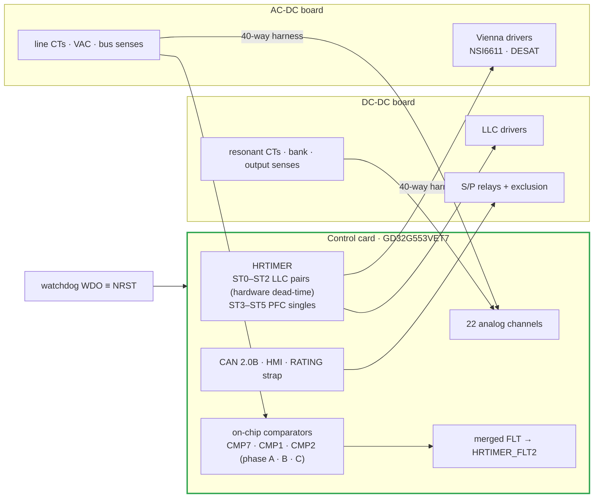
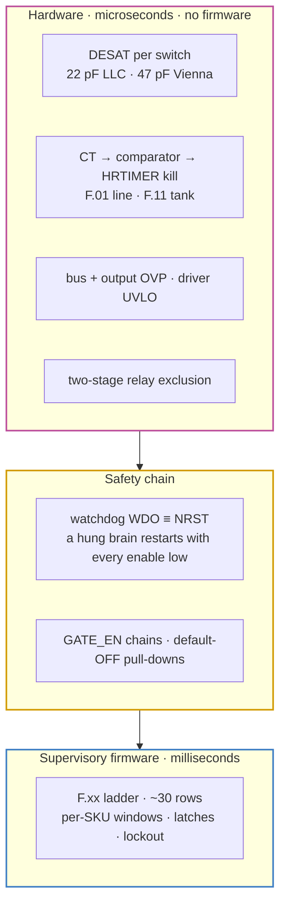
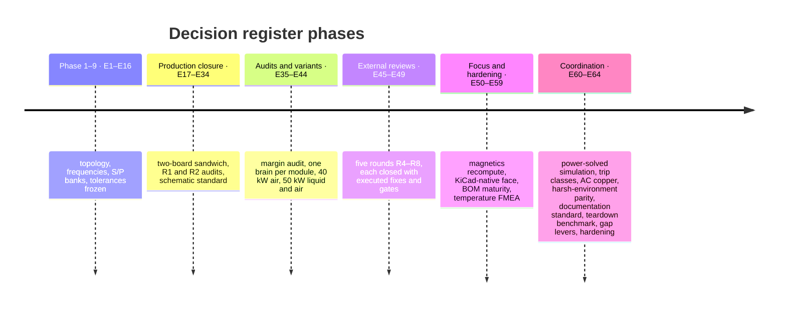

# 🏗️ Platform Architecture

The module in one read — power path, control plane, protection layers, rails and the product family

  
  
  

> [!NOTE]
> **Purpose** — the platform in one read: the product family, the power path stage by stage, the control plane,
> the protection layers, the auxiliary rails and the thermal snapshot. Values are the frozen set in the
> [decision register](assumptions.md) (E1–E64), and every number reproduces from `calculations/run-all.sh`.

## At a glance

| | |
|---|---|
| **Building block** | a ~10 kW **cell pair** — one Vienna PFC phase cell and one 3-φ LLC section — repeated three times per module |
| **Module** | AC-DC board (lower) + DC-DC board (upper), faces inward, semiconductors on the outer heatsinks or coldplates |
| **Brain** | **one control card per module** (GD32G553VET7) in the DC-DC slot, one CAN port, one 2-button / 2-digit HMI |
| **Input → output** | 3-φ 285–475 VAC → split DC bus 650–830 V → 150–1000 VDC, 100 / 133 / 167 A |
| **Switching** | Vienna 50 kHz (750 V SiC pairs, 1200 V JBS) · LLC fr 140 kHz (1200 V SiC half-bridges, ZVS) |
| **Output stage** | two floating banks with a series/parallel relay matrix, pre-insertion and K_OUT |
| **Family** | 30 · 40 · 50 kW liquid · 50 kW air modules; 100 kW = 2 × 50 and 150 kW = 3 × 50 + CSU products |

```mermaid
flowchart LR
  AC(["3-φ 285–475 VAC"]) --> EMI["gG fuse · MOV Δ + GDT<br/>2 × CM + DM EMI stages"]
  EMI --> PRE["precharge<br/>2 × 33 Ω + 2-pole bypass"]
  PRE --> V["VIENNA PFC · 50 kHz<br/>750 V SiC pairs · 1200 V JBS"]
  V --> BUS[("split DC bus<br/>650–830 V · OVP 860")]
  BUS --> LLC["3-φ LLC · fr 140 kHz<br/>1200 V SiC half-bridges"]
  LLC --> XF["3 × section transformers<br/>D3 · E60 copper · Lm 63 µH"]
  XF --> BK["banks A + B<br/>SiC JBS bridges"]
  BK --> SP["S/P matrix + exclusion<br/>pre-insertion · K_OUT"]
  SP --> OUT(["150–1000 VDC<br/>100/133/167 A"])
  CARD["ONE control card<br/>GD32G553VET7 · RATING strap"] -. "40-way harness (PFC bundle)" .-> V
  CARD --- LLC
  AUX["110 W full-bus aux<br/>NCP1252D · D4 rev D"] --> CARD
  BUS --> AUX
  style V stroke:#d19a00,stroke-width:2.5px
  style LLC stroke:#1a9fb3,stroke-width:2.5px
  style SP stroke:#b8732e,stroke-width:2.5px
  style CARD stroke:#2ea44f,stroke-width:2.5px
```

## 1. The family

| Module | Silicon relative to 30 kW | Cooling | ₹ @10k · ₹/kW |
|---|---|---|---|
| **30 kW** | baseline — single B3M pair per phase, single SG2M per LLC position | air, 2 fans | 30,980 · 1,033 |
| **40 kW** (E41) | PFC pairs **paralleled** (2 × B3M per position, each behind its own 2.2 Ω) | air, 3 fans | 35,891 · 897 |
| **50 kW liquid** (E42) | the 40 kW silicon — single LLC FETs, which the coldplate makes possible | **liquid**, 0 fans | 41,865 · 837 |
| **50 kW air** (E44) | PFC **and** LLC paralleled (per-package conduction ÷ 4) | air, 4 fans | 41,516 · **830 — cheapest** |
| **Products** (E55) | **100 kW = 2 × 50** (no CSU) · **150 kW = 3 × 50 + CSU** (same card in the CSU strap role) | per module | 100 kW air 83,032 (830) · 150 kW air 1,26,382 (843) |

Costs are generated in [`bom-cost.md`](bom-cost.md); the product rationale is in
[product structure](../boards/README-product-structure.md).

## 2. The power path, stage by stage

| Stage | What it does | Per-SKU detail (30 / 40 / 50 kW) |
|---|---|---|
| **Input protection** | gG fuses, MOV Δ + GDT, two-stage common-mode + differential-mode EMI filter | fuses 80 / 125 / 160 A; D6 DM chokes and D7 CMCs sized per SKU |
| **Precharge** | 2 × 33 Ω pulse resistors with a 2-pole bypass relay (E14 rev B) | 50 W pulse class at 50 kW |
| **Vienna PFC** | 3-level, 50 kHz; common-source B3M010C075Z pairs with 1200 V JBS diodes to the rails; RC snubber + RCD clamp per node | D1 chokes (biased inductance governs — see [magnetics](magnetics.md)); pairs paralleled at 40 / 50 kW |
| **Fast trips on the PFC** | DESAT on the forward polarity (47 pF blank); line CT → on-chip comparator → HRTIMER kill on the reverse | F.01 = 120 / 155 / 195 A pk on 22 / 18 / 13 Ω burdens |
| **Split DC bus** | 650–830 V commanded, films + 2 × (5 / 6 / 8 × 470 µF) per half, hardware OVP 860 V | two-phase discharge: 640 Ω active to the 321 V aux floor, then passive balance |
| **3-φ LLC** | SG2M023120LJ half-bridges (paralleled on the 50 kW air), PFM around fr 140 kHz, star-connected primaries | Cr bank 4 × 46 nF / 6 × 33 nF / 8 × 27 nF; binned trim (D2) + transformer leakage = Lr |
| **Section transformers** | D3: compacted 0.071 mm litz primary, copper-foil secondaries (E51 construction, E60 copper) | 3 × PQ50 7:7:7 · 2 × E70 6:6:6 · 2 × E70 5:5:5; resonant CT F.11 = 85 / 115 / 145 A pk |
| **Rectifiers & banks** | two secondaries per section → two SiC JBS bridges → floating banks A and B | 2-series electrolytic strings with PV-driven bleeders |
| **S/P matrix** | K_PAR_A / K_PAR_B with 10 Ω pre-insertion, K_SER, K_OUT (dual at 50 kW); two-stage 74HC02 hardware exclusion | exclusion KSER ∧ ¬KPAR ∧ ¬KPRE (R5-D) |
| **Output** | filter → manganin shunt (positive = delivering, R6-E) → studs | 100 / 133 / 167 A |

## 3. Control plane — one brain per module (E40)

- **One card in the DC-DC slot runs the Vienna and the LLC together.** All nine PWMs sit on HRTIMER units, 22
  analog channels are used, and one merged fault line lands on HRTIMER_FLT2. The 88-way slot carries the DC-DC
  side; a **40-way straight-through harness** (HARNESS40, generated) carries the whole PFC bundle to the AC-DC
  board. There is no inter-MCU link.
- **Identity is one RATING strap** (E24 rev G): 0 Ω → 30 kW · 1 k → 40 kW · 3.32 k → cabinet CSU ·
  10 k → 50 kW liquid · 15 k → 50 kW air · open → fault. One card part number and one firmware image serve the
  whole family.
- **Loops.** Per-phase current (fc ≈ 3 kHz, PM 50°); bus voltage (15 Hz) with
  `bus_ref = clamp(max(2·bank/0.95, 1.08·√2·VLL), 650, 830)`, the E60 FW-R7 line-tracking floor; PFC reference
  clamp 1.05× (FW-R6); PLL and midpoint balance. The LLC runs CV/CC with a mode map (PFM, phase shift below 260 V
  per bank, burst). The S/P state machine applies pre-insertion, a weld check, the E12b K_OUT gate, and allows
  a series start only above 525 V (FW-R8).
- **Supervisory firmware** (`firmware/`) is the normative logic: 26 scenarios, CSU, codec, fuzz and invariants —
  **54 / 54 under ASan/UBSan** ([firmware guide](firmware-guide.md)).
- **Pin budget:** 75 of 82 usable MCU pins, 7 spare — the arithmetic is in [control-card scope](control-card-scope.md).

## 4. Protection — three layers

The fast layer has no firmware in the loop. Per-phase line CTs feed on-chip comparators (A / B / C on CMP7 / CMP1 /
CMP2, instance-verified at E48), which kill the HRTIMER on the polarity DESAT cannot see. NSI6611 DESAT (100 Ω
series resistor, R5-B) covers the forward polarity. Resonant over-current comparators, bus and output OVP, driver
UVLO and the relay exclusion complete it. The watchdog's open-drain WDO gates the enable **and** resets the MCU. The
full ladder, with timings, is [protection thresholds](protection-thresholds.md); the currents behind every class
are [current coordination](current-coordination.md).

## 5. Auxiliary supply and rails

| Rail | Source | Serves |
|---|---|---|
| **Full-bus aux** | 110 W flyback, D4 rev D on ETD39 (E52), **NCP1252D** (R6-G — the A-suffix could not cold-start), 220 µF VCC reservoir | everything below; brown-out at 321 V bus; cold start ≈ 5–6 s nominal, ≈ 8 s at low line |
| **V24** | aux secondary | relay coils, fans |
| **V15** | aux secondary | driver bias modules, card feed |
| **3.3 V** | sync buck per board (100 k / 27 k EN dividers, R4-4) | local logic and senses |
| **Isolated bias** | reinforced-class modules (QA01C-18) · drawn +18 / −4 V; the catalogue part is +18 / −3 V, so the −4 V split is open decision O-11 | every floating driver and sense domain |

## 6. Efficiency and thermal snapshot

| | 30 kW | 40 kW | 50 kW liquid | 50 kW air |
|---|---:|---:|---:|---:|
| η at 400 VAC, full load | 97.19 % | 96.92 % | 96.68 % | 96.82 % |
| Peak η | 98.45 % | 98.49 % | 98.46 % | 98.58 % |
| Loss at rated | 866 W | 1,273 W | 1,717 W | 1,642 W |
| Worst Tj on the 5,544-point grid | 144 °C | 150 °C (fold) | 148 °C (fold) | 149 °C (fold) |

Every device sits inside its own acceptance line (`stress-audit.mjs`, in run-all); folds are explicit derating
rows. Details: [thermal report](thermal-report.md).

## 7. How the platform got here

Each decision is recorded row by row in the [decision register](assumptions.md). Dated fix logs live in the
[historical records](history/README.md).

---

<a href="README.md">← Documentation Hub</a> &nbsp;·&nbsp; <a href="README.md">🧭 Documentation hub</a> &nbsp;·&nbsp; <a href="assumptions.md">Decision Register →</a>

Vectivolt DC-Modules · documentation rev E61 · every number reproduces with <code>sh calculations/run-all.sh</code>

