# 📒 Decision Register

Every frozen decision E1–E80, why it was taken, and the evidence that holds it

  
  
  
  

> [!NOTE]
> **Purpose** — every frozen engineering decision, the value it froze, why, and the evidence or event that would
> invalidate it. Every gate in the battery cites these rows as its provenance.
>
> **Rules** — rows are **immutable**: a correction is a new row that names the one it supersedes. Rows are ordered
> by number within each phase; the text of every row is exactly as registered.

| Status | Meaning | Change control |
|---|---|---|
|  | decided and gated | formal ECO and a new register row |
|  | best current value | revisit when the named trigger fires |
|  | needs external confirmation | confirm at RFQ, sample or EVT |

## Register map

| Phase | Rows | Dates | What it covers |
|---|---:|---|---|
| [E1–E16 · Architecture freeze](#e1e16--architecture-freeze) | 18 | Phase 1–9 · 2026-09-04 | topology, frequencies, bus window, tank, S/P banks, tolerances |
| [E17–E34 · Production closure](#e17e34--production-closure) | 19 | rev C/D · 2026-09-04 → 09-07 | two-board sandwich, R1/R2 audit closures, schematic standard, volume basis |
| [E35–E44 · Margin audits and the module family](#e35e44--margin-audits-and-the-module-family) | 10 | 2026-09-08 | margin audit, interconnect and polarity gates, one brain per module, 40 kW air, 50 kW liquid and air |
| [E45–E49 · External review rounds R4–R8](#e45e49--external-review-rounds-r4r8) | 5 | 2026-09-09 | five PDF review rounds, each answered with executed fixes and permanent gates |
| [E50–E78 · Focus, hardening and coordination](#e50e78--focus-hardening-and-coordination) | 28 | 2026-09-12 → 09-15 | repo focus, magnetics recompute, KiCad-native face, BOM maturity, temperature FMEA, current coordination, documentation standard, teardown benchmark, InfyPower parity and BOM clone (E65–E69), external-review dispositions (E74–E76), firmware architecture and protocol profiles (E78) |
| [Component and model assumptions](#component--model-assumptions-assumed--confirm-at-rfqsample) | 9 | — | the A-rows to confirm at RFQ, sample or EVT |

```mermaid
timeline
  title How the register grew
  Architecture freeze : E1–E16 · Phase 1–9
  Production closure : E17–E34 · R1 and R2 audits
  Audits and variants : E35–E44 · one brain per module · 40 and 50 kW
  External reviews : E45–E49 · rounds R4–R8
  Hardening : E50–E59 · magnetics, KiCad-native, BOM, FMEA
  Coordination : E60–E64 · trips, AC copper, parity, documentation standard, teardown benchmark, gap levers, hardening
  Magnetics envelope : E65–E66 · simulated-corner magnetics, both-polarity F.11, no-CSU ladder
  InfyPower parity : E67 · one full-bridge LLC, LOW/HIGH output modes, output blocking diode
  InfyPower BOM clone : E68–E69 · clip mount, star-X2 EMI filter, film-only banks, right-sized dies, fault-pulse rule, China cost column
  Per-module pages : E70 · generated BOM and magnetics pages per SKU, repository cleaned to the KiCad face
  Second opinion : E71 · PyOpenMagnetics cross-check, fringing-corrected gap guides, short-circuit R test
  Modules only : E72 · 100 / 150 kW products moved to a backup branch, the family page rebuilt
  Magnetics review : E73 · startup inrush closed in firmware, abnormal conditions gated, every custom magnetic cross-checked
  External verification : E74 · independent rev D.4 review verified claim-by-claim, four paper fixes, link-ripple line opened
  OVP comparators : E75 · F.03/F.13 had no comparator — allocated on CMP4/CMP0 by pin swap; mode-swap release margin widened
  Firmware hardening : E76 · delivered-face gate, startup/stop/make-permit/derate/group fixes, host plant honest, 77/77
  Firmware architecture : E78 · profile-owned timeout, recovery classes, relay supervision, controlled stop, VMP 2.0, TonHe V1.2 profile, 172 host checks
```

## E1–E16 · Architecture freeze

Phase 1–9 · 2026-09-04 · topology, frequencies, bus window, tank, S/P banks, tolerances

| ID | Item | Value | Status | Provenance / invalidator |
|---|---|---|---|---|
| E1 | Full-power input floor | 330 VAC; linear derate to 86% @285 V (constant current) | FROZEN | `design-basis.mjs`; invalidated by a contract demanding full P @285 |
| E2 | DC bus window | 650–830 V operational, 800 nominal; **HW OVP 860 V** | FROZEN | DPT llc1200: 830 V→73% ✓, 880 V→77% ✗; OVP set to keep ring ≤75.4% |
| E3 | PFC switching frequency | **50 kHz** | FROZEN | `pfc-design.mjs` after DPT k_sw recalibration (17.4 nJ/VA); 70/100 kHz rejected on Tj>150 °C |
| E4 | PFC topology detail | Common-source pair, 1 PWM/phase; 1200 V JBS blocks full bus | FROZEN | Topology analysis; makes 2-MCU/120 kW feasible |
| E5 | Gate drive (PFC 750 V) | Rg_on 4.7 / Rg_off 4.7, +18/−4 V, loop ≤10 nH, RC 10 Ω+470 pF, **RCD clamp 100 nF+470 Ω to rail** | FROZEN | DPT `dpt-pfc750-final`: 70%/73% PASS |
| E6 | Gate drive (LLC 1200 V) | Rg_on 4.7 / Rg_off 2.2, +18/−4 V, loop ≤15 nH, RC 10 Ω+470 pF, no clamp | FROZEN | DPT `dpt-llc1200-final` 73% @830 V PASS |
| E7 | LLC tank (per phase) | **rev D2:** fr 140 kHz, Lr 7.0 µH (3 leak + 4.0 trim, leakage-compensating bins ±3%), Cr 185 nF (4×46 nF 1200 V PP ±5%), Lm 63 µH ±7% (gap-ground), Ln 9, Q_crit 0.28, capability 1.39; firmware stores per-unit bank_max from EOL gain-cal (fallback) | FROZEN | `llc-design.mjs` rev D — §37 MC yield drove requirement 1.36; ZVS re-verified in `llc-run.mjs` |
| E8 | Transformer section | 3× PQ50/50 stack PC95-class, Np=Ns=Ns2=7, ΔB 215 mT, 20.5 W, fill 93% | FROZEN | `llc-design.mjs`; invalidated if bobbin study fails 93% fill → PQ65 alt |
| E9 | S/P crossover | **rev B: 500 V up / 525 V down + 30 s FSM dwell** | FROZEN | rev-A 550 top was unreachable at full load (gain 1.325 — §37 MC exposed); 525 top needs 1.265, met at p1=1.29+ |
| E10 | Control modes | PFM 0.72–1.32 gain; phase-shift/duty below 260 V bank; burst light-load; bus_ref = clamp(2·bank/0.95, 650, 830) | FROZEN | Gain-hole analysis + `llc-run.mjs` PS case ZVS ✓ |
| E11 | Secondary rectification | **SiC JBS bridge all SKUs**; SR = premium variant | BASELINED | `loss-budget.mjs`: net ₹2.7k against SR @₹28/W cooling; flips >₹41/W — revisit at Phase 17 with heatsink quotes |
| E12 | S/P relay matrix | K_SER + K_PAR_A/B **with 10 Ω pre-insertion aux relays** + K_OUT isolation + discharge | FROZEN | `sp-transition.mjs`: hard parallel at 2 V = 205 A; pre-insertion mandatory |
| E12b | K_OUT closure gate rev B | stack must match target (vext if vehicle present, else vcmd) within max(10 V, 5%) before K_OUT closes | FROZEN | host_sim found post-transition banks at old-mode ceiling → OVP on blind close; fixed in fsm.c + model |
| E13 | Bank matching before parallel make | pre-insert until ΔV<0.5 V; weld detect 1.5 V/200 ms @≥10 A | FROZEN | same |
| E14 | Precharge / discharge | 33 Ω (20 A pk, 243 J, t95=160 ms) / 640 Ω active (2.0 s to <60 V, 424 J) | FROZEN | `pfc-phase-run.mjs` §25 runs |
| E14b | Precharge rev B | 2× 33 Ω in L1+L2 with 2-pole bypass (3-wire correctness: every line-line loop sees ≥1 R); Ipk ≈ 10 A, t95 ≈ 230 ms | FROZEN | 3-wire loop analysis; supersedes single-R E14 sim point (bounds hold) |
| E15 | Control loops (PFC) | I-loop Kp 0.00439/Ki 11.7 → fc 2.98 kHz PM 50.2° GM 8.7 dB; V-loop Kp 0.206/Ki 9.05 fc 15 Hz | BASELINED | `pfc-control.mjs` analytical + ngspice cross-check 50.6° |
| E16 | Scaling | 60 kW = 2 lanes/2 ch; 120 kW = 4 lanes (0/90/180/270°)/4 ch; 2 MCUs | FROZEN | Phase 12 COGS check (bom-cost.md) |

## E17–E34 · Production closure

rev C/D · 2026-09-04 → 09-07 · two-board sandwich, R1/R2 audit closures, schematic standard, volume basis

| ID | Item | Value | Status | Provenance / invalidator |
|---|---|---|---|---|
| E17 | **Two-board sandwich** | AC-DC board (lower) + DC-DC board (upper), faces inward, bolted DCP/DCN/PE studs + 16-way harness | FROZEN | **Customer directive 2026-09-04, supersedes single-PCB §30**; docs/interconnect.md; cost impact ≈ +₹1.45k @30 kW recorded in bom-cost.md |
| E18 | Phase/resonant current sensing | CTs (line 1:2500 + burden; resonant 1:100) replace shunt+iso-amp | FROZEN | §19 comparison: −₹240 net, inherent isolation, faster OC path; output current stays manganin shunt + NSI1200 |
| E19 | Discharge drive logic | **rev B: default-OFF** — opto-isolated driver (DCN-referenced bias module), 10 k gate pulldown to DCN; discharge on FSM command only (shutdown/SAFE); passive bleed = bus balancers (τ ≈ 235 s → service label + commanded discharge covers port access) | FROZEN | review **CB-11**: rev-A fail-engaged logic burned 1.13 kW into 100 W of resistor during any held-reset/programming with bus up |
| E20 | Aux primary feed | ~~DCP→MID, 650 V FET~~ | **SUPERSEDED by E26** | review **CB-6**: half-bus at cold start = 201–283 V < 300 V V_in,min → module never boots ≤ ~424 VAC |
| E21 | **Config HMI** | 2 buttons + 2-digit 7-seg on DC-DC board, 74HC595 + 2 NPN mux, 7 GPIO on MCU-LLC | FROZEN | Customer directive 2026-09-04; spec in interconnect.md |
| E22 | 3rd DM filter stage | 3× 22 µH sendust line chokes after CM2 (family-wide) | FROZEN | LISN pre-compliance: 30 kW 3rd harmonic at 150 kHz was −24.8 dB; stage adds ~33 dB there |
| E23 | Production gate-bias **rev B** | **CLOSED — packaged modules PERMANENT; ECO-1/D5 cancelled.** At the ≥10k units/yr volume directive (A7 rev B), QA01C-class modules land ≤₹55 (p10k), making the custom multi-secondary transformer's net saving ≈ ₹0 against real C_io/EMC, winding-house and second-source risk. O-11 (−4 V rail topology of the chosen module) remains a §K line | FROZEN | 10k-volume decision 2026-09-05; supersedes the rev-C deferral (HR-10 history retained there) |
| E24 | Production supervisory firmware **rev B** | portable C99 `firmware/core/{fsm,can_proto}` = normative logic; verified vs 26-scenario suite + codec + 100k fuzz + **2 rating-window checks (35/35)** under ASan/UBSan; **rev B (E37): `pmp_fsm_set_rating_kw()` — the one per-SKU parameter (F.21 window) is runtime-selected from the card RATING strap, ONE image for all ratings** | FROZEN | HAL binding = firmware phase on real MCU; boot-identity contract in firmware-guide.md |
| E25 | **SELV control domain + isolated sensing** | one floating SELV control domain: AGND–DGND 0 Ω single-point tie per board, DGND→PE 1 MΩ ∥ 4.7 nF soft bond; **every HV voltage sense isolated**: AC phases via ±5 V-class iso amps against a 3×100 k artificial star, bus/MID via 0–2 V iso amps against DCN, banks against BKAN/BKBN, output against OUTN — each domain with its own iso 5 V bias module; NTC tips insulated; discharge gate isolated (E19 rev B) | FROZEN | review **CB-3/CB-4**: resistive dividers to AGND breached the reinforced barrier and AGND floated; SELV keeps HMI/SWD/fans/CAN touch-safe |
| E26 | **Aux flyback rev C** | full-bus feed 342–860 V, 1700 V SiC switch, **110 W class all SKUs** (Lp 345 µH, Ip clamp 3.2 A @ 0.31 Ω CS, 65 kHz DCM, Vor ≈ 157 V, ETD34 PC95 — D4 rev C); controller = **NCP1252A** (BO divider re-sized to its 1.0 V threshold → brown-in ≈ 322 V); output rectifiers **400 V ultrafast** (PIV ≈ 160 V at 860 V bus — R2 CB-19); rail TVS (MR-17); QAUX gate pulldown; relay-coil PWM-hold economization in firmware | FROZEN | ~~rev B 60 W~~ superseded by R2 **CB-19/CB-20**: rev-B rectifiers were 100 V parts and the 60 W stage lost to the per-SKU load (≈90 W pk @120 kW); `aux-flyback.mjs` rev C: 342/560/850 V × 30/60/120 kW load matrix **9/9 PASS** (up to 107 W delivered) |
| E27 | **Hardware enable/kill chain** | per board: GATE_EN_x = 3-input AND(own-MCU EN, other-MCU EN via harness with 100 k pulldown, watchdog WDO with 10 k pullup) → 10 k pulldown on the output (default-disabled); external windowed watchdog per board (WDI kick pins 70/46); PWM_KILL net retired | FROZEN | review **CB-10**; protection rows 24/30 now exist in hardware |
| E28 | **Snubber policy rev B** | LLC switch-node RC snubbers **deleted** (RC across the node burns C·V²·f ≈ 45 W/leg at 140 kHz — ZVS topology needs none; ST refs carry none); Vienna node RC re-sized 470 pF→100 pF with 2 W resistor (C·V²·f = 0.86 W); Vienna clamp bleeder → 470 Ω 5 W axial | FROZEN | review HR-2/HR-3 — **corrects the review's own §F-4 formula**: dissipation is C·V²·f regardless of edge speed |
| E29 | **Bank capacitors rev B** | per bank: 2-series 470 µF/450 V strings (string rating 900 V vs ≤525 V bank) with shared midpoint + balance dividers (**rev D: 2×47 k HV per half — R2 HR-20**); per-bank µF halves — S/P dwell/ripple re-checked (banks are disconnected during the crossover dead window; ripple budget unaffected at 3-φ interleave); leakage-vs-balance sizing at temp = §K/O-14 | FROZEN | review **CB-2**: single 450 V cans at 525 V = 117% — vent/fail |
| E30 | **Relay readback + line-rated bypass** | all six S/P relays + both precharge bypass relays = mirror-contact variants; per-relay readback nets (10 k pullups) to MCU-LLC pins 2–7; KPRE pair mirrors in series → MCU-PFC pin 50; precharge bypass = 2× single-pole power relays rated for full line current per SKU (80/120/250 A class) | FROZEN | review **CB-8** (8 A relay carried 55–220 A) + **HR-4** (F.19 had no hardware path) |
| E31 | **ADC front-end + provisioning** | bipolar senses (line CTs, resonant CTs) biased to buffered AVMID (VREF/2, op-amp + 10 µF **via 4.7 Ω dual-feedback isolation — R2 MR-11**) with series 1 k + dual clamp diodes to 3V3/AGND; FLT wire-OR pullups 4.7 k + 1 nF; driver PWM inputs 10 k pulldown; SWD header + BOOT0 strap + NRST cap per MCU; VDDA/VREF+ via ferrite + 1 µF/100 nF; NSI1200 OUTN routed (true differential) | FROZEN | review **CB-15/CB-13/HR-5/HR-6/HR-11/MR-6/MR-7** |
| E32 | **R2 re-audit closure set** | resonant CT burden **2.0 Ω 2512** (46 A rms/1:100 → 0.92 V rms; F.11 70 A pk = 3.05 V at comparator; the drawn 33 Ω was the line-CT value — R2 CB-16) · **FLT_LLC → MCU-LLC pin 74** (CB-21) · **Rail3V3 sync buck per board** (CB-17: DC-DC had no 3.3 V source; CB-18: the 15 V-fed SOT-223 LDO dissipated 2.9–4.1 W) · tank aligned to frozen rev D2: **Cr 4×46 nF drawn + trim = D2 binned set in BOM** (CB-22) · watchdog symbol 6-pin w/ VDD + SET straps (HR-13) · iso-5V bias modules **reinforced-rated** — they are part of the mains/bus/output→SELV barrier (HR-16) · fans 4× w/ tach @120 kW + pins 80–83 (HR-17) · CM chokes per-SKU (D7 — 4 mm² wire ran 14–28 A/mm²; HR-18) · 120 kW paralleled S/P relays = real dual instances w/ series mirrors (HR-19) · balance/star resistors 2-series 47 k HV (HR-20) · V24/V15 monitors → MCU-PFC 51/52 · harness → 5 A contacts, spares = GND, link series 100 Ω (MR-14) · MCU mpn VET6 (MR-12) · per-SKU pulse-resistor variants @120 kW + F.21 implemented w/ per-SKU `PMP_DISCH_TO_MS` (HR-14 — note the F.20 abort logic in fsm.c was verified TOLERANT as coded; only the doc wording was wrong) | FROZEN | `design-review-production-r2.md` §B/§C + fix log; gate R2-* asserts |
| E33 | **Commanded bank discharge rev B** | per bank: 4× 2.2 k 10 W axial chain + 1200 V/5 A FET + **photovoltaic gate driver (VOM1271-class, ECO-2a — no floating supply; ms-class turn-on is sufficient and default-OFF is inherent)**, both LEDs driven by MCU-LLC pin 75 (`CTL_QDISBK`); τ ≈ 4–17 s to <60 V per SKU, ≤65 J/resistor @120 kW; F.21b supervision; passive balance chains remain the backup (τ 94–376 s); bus discharge (QDISF) keeps the fast opto+bias chain | FROZEN | R2 **HR-15** + ECO-2a (−₹204/module); PV drive never used on switching gates |
| E34 | **Schematic presentation standard (rev D.2)** | Sheets are engineered, not incidental: every cell carries a documented schematic envelope on a grid (higher schY = higher on sheet); boards place sections in a planned sheet architecture (power flow L→R, control row beneath, per-column sensing); every component carries `schSectionName` — **cross-section connectivity renders as named net labels, never routed wires** (`schMaxTraceDistance={0}` + per-trace `schDisplayLabel`), wires remain only for local intra-section connections; `calculations/schematic-check.mjs` gates **0 symbol overlaps** on every built board; `calculations/schematic-export.mjs` generates the release sheets (`boards/*/out/*-schematic.svg`) with titled section frames + title blocks computed from actual geometry. **Rev D.3 amendment (2026-09-06):** the standard is unchanged, but the release artefact moved to the KiCad-5 import set `kicad5/DC-Modules-<sku>-SHIP.zip` (`calculations/kicad5-gen.mjs`), which satisfies the same rules and adds pin-level verification (8053/8053) plus alignment/wiring/ink audits; the `boards/*/out/*.svg` sheets remain as a secondary per-board view — see `docs/schematic-drawing-set.md` | FROZEN | customer directive 2026-09-05 ("professional, sectioned, no overlapping nets/wires"); any new cell/section must define its envelope and section name and keep the checker clean |
| A7b | **Volume basis rev B** | ≥**10,000 units/yr minimum** (customer directive 2026-09-05) → BOM 10k tier is the planning basis: ×0.80 elec / ×0.87 mech heuristic off the 1k targets + per-part `p10k` quote-based overrides (modules, PV drivers); ±25% until RFQ round 1 returns at committed volumes | ASSUMED | build-vs-buy analysis 2026-09-05; RFQ round 1 converts heuristics to quotes |

## E35–E44 · Margin audits and the module family

2026-09-08 · margin audit, interconnect and polarity gates, one brain per module, 40 kW air, 50 kW liquid and air

| ID | Item | Value | Status | Provenance / invalidator |
|---|---|---|---|---|
| E35 | **Margin-audit closure set (2026-09-08)** | Independent clean-room audit (customer directive "verify everything, lots of margin, practical to source"): **D2 rev C** — trim inductor sendust→**gapped ferrite** (2× PQ50/50 PC95-class = same core p/n as D3, N=4, gap-ground per bin; sendust at full 140 kHz AC swing computed ~43 W core loss vs ~4 W budget + 2:1 L swing/cycle; **powder cores prohibited on full-AC-swing HF duty**) · **D1 rev B** — N=39, 18 mm² flat Cu against the real 0077908A7 core (AL 37±8%; rev A failed its own Rdc/L lines) · **D3 litz corrected** ≥9.8/≥4.9 mm² (rev-A strand counts failed their own Rdc acceptances) · **D6 rev B** — all three windings re-gauged to ≤5.6 A/mm² (η restated 97.28/97.37/97.37%) · **line-CT burden 33→27 Ω** (R3 landed: 150 A pk observability inside the 3.3 V rail) + **CTs = Talema catalog** (ACX-1100 line / AS-404 resonant, Salem India — closes 2 REVIEW lines) · **30 kW fuse 63→80 A gG 22×58** + matching holder (63 A was 88% loaded, negative after enclosure/+55 °C derate) · **D7 @30 kW: qualify Schaffner RT8131-63-2M8** as catalog drop-in (custom = 2nd source) · **card**: AGND_2 Kelvin way added; **PWM group moved to HRTIMER** (hardware dead-time/leg, FLT→PB10/47 HRTIMER_FLT2, PA6 break conflict dissolved; EN_B→28, DI2/3+HMI0..3 displaced to freed pins) · **NCP1252 RT closed** = 66.5 kΩ (datasheet Rev 9: 43 k→100 kHz; A-suffix = 48% DCmax, not "fixed 65 kHz") · card-split BOM classifier holes closed (UCARD/JA/JB/JCARD/USUPCARD/UANDCARD/UBKCARD/LBKCARD + RPD*/RFLTC/RAGTC rescues) · gates refreshed to card era + 10 new AUD-* asserts · resonant-cap spec elevated to resonant-duty series w/ Vrms-vs-f curve (942C class / Faratronic eq — §K O-8 stays the certificate gate) | FROZEN | margin-audit artifact + `review-checks.mjs` AUD-* set; frozen electricals (E7 tank, E9, 165 µH-class D1 intent) unchanged |
| E36 | **Scope: schematics/BOM/nets ONLY (rev B)** | PCB layout/placement/routing OUT of scope again — customer directive 2026-09-08 ("no need to make pcb/layout; only schematics, bom, nets"), re-closing the layout phase that commits of 2026-09-06/07 had opened. Builds run `TSCI_NO_ROUTE=1` (netlist mode); placement/routing DRC ignored; floorplan/placement work in the tree is retained as-is but NOT advanced; the audit's †-marked land-pattern changes queue for whenever layout reopens | FROZEN | directive 2026-09-08; supersedes the 2026-09-06 layout reopening for now |
| E37 | **Module interconnect audit + closure (2026-09-08)** | `module-interconnect-audit.mts` in run-all walks built netlists across every module boundary (studs · 16-way harness incl. crossover + series-R hop · both 88-way card slots way-by-way, both roles · RATING strap per SKU); negative-tested both directions. Fixed at introduction: **RATING strap hardcoded 0R** → per-SKU (0R=30 kW, 10k=60 kW; 60 kW boards mis-identified as 30 kW) · **88-way split into a mating pair** CONN-CARD-88-H (boards) / -R (card) — one p/n bought three unmateable headers · **AGND_2 Kelvin way tied on the card side** (was dead copper; Kelvin = routing rule at the AnalogMid ground) · **E24 rev B:** `pmp_fsm_set_rating_kw()` makes the one per-SKU firmware parameter (F.21 window) runtime-selected from the strap — ONE image as CARD_RULES promises; suite now 35/35 (both rating-window checks; an init-order regression during the change was caught by the existing suite — 32/33 — and fixed) | FROZEN | audit output + negative tests; run-all gate |
| E38 | **Polarity audit (2026-09-08)** | `polarity-audit.mts` in run-all proves, from the built netlists, that every polarized part has +/anode on **pin 1** — the single convention the sheets draw (tscircuit `lrPolarPins`: pin1=anode/pos; CP glyph "+"-plate = pin 1, D anode triangle = pin 1; all instances upright — one orientation matrix across every sheet, nothing rotates). Rules are lane-locked ($1/$2 designator captures), a polarized part with no rule FAILs, and the tool is negative-tested (one flipped rule → 28 FAILs). At introduction: **259/259 polarized parts verified correct** (30 kW 40+50, 60 kW 69+100, card 0) — split-link + bank electrolytics, aux reservoirs, Vienna boost pairs, phase clamps, ADC clamps, rail TVS, flyback rectifiers, RCD clamp, secondary bridges, DESAT chains; render crops confirm glyph orientation matches | FROZEN | polarity-audit output + negative test; run-all gate |
| E39 | **120 kW cabinet + CSU role (2026-09-08)** | 120 kW = 4×30 kW modules + **one** coordinating MCU: the same control card p/n in a third strap role (**CSU**, RATING band **3.32 k → ≈0.82 V**, between the 0 V/30 kW and 1.65 V/60 kW codes — E24 rev C; ROLE0 is don't-care in this band). Card sits on a passive carrier (15 V DIN brick into the V15 ways + one strap R); its own JCAN joins the cabinet bus. `boards/cabinet.tsx` is the interconnect of record (AC distribution · DC parallel bus · CAN chain with 120 Ω at both ends · single-point shield bond RSHB · CSU carrier), flows through the full kicad5 pipeline (66/66 pins, visual clean, print/PDF) and is gated by the cabinet section of `module-interconnect-audit`. CAN addressing = claim-by-hearing (module UID → src), zero harness address pins. Supervisor firmware `firmware/core/csu.{h,c}`: equal-share commanded-CC (share = min(cap, demand/alive), recomputed every step → dropout degrades gracefully), staggered starts (300 ms), hot-rejoin re-staggers, ESTOP latch — 10 host_sim checks, suite **45/45**. Modules keep self-protection/sequencing; the CSU only decides who runs and how much | FROZEN | cabinet audit + host_sim; kicad5 battery |
| E40 | **Single-brain module (2026-09-08)** | **One control card per module** — the merged 30 kW role fits the EXISTING GD32G553VET6 (73/82 pins, 22 analog, all nine PWMs on HRTIMER: LLC pairs ST0–2, PFC singles ST3–5, one merged FLT on HRTIMER_FLT2) and the existing 88-way slot (86 used + 2 spare), so no new MCU, package or connector. Card seats in the **DC-DC slot**; the PFC bundle crosses a **40-way straight-through harness** (HARNESS40, generated) with AVMID+Kelvin adjacent, five returns, SHLD bonded at the AC-DC end; the inter-card UART **link is retired**. Identity = **RATING only (E24 rev D)**: 0 R → module controller · 3.32 k → CSU · open → fault; ROLE0 deleted. SafetyChain grows a second gated output (EN_A·WDO → GATE_EN_A across the harness); default-OFF pulldowns extend to the three harness PWM lines. The 60 kW 2-lane pair **retires** (needs 18 PWM/30 analog — past any single brain); `BUILDABLE_SKUS=["30kw"]`; family control = **1 / 2 / 5 MCUs** at 30/60/120 kW, all one p/n. Generated single source: `calculations/control/umod-pinmap.mts` → `umod-map.gen.ts` (R3 rule: every extension on a documented-capability donor pin). BOM lands **₹30,079 @10k (−₹293/module measured)**. Executed on branch `e40-single-card`; the two-card rev is tagged on `main` as fallback | FROZEN | umod generator asserts · interconnect audit (37/40 harness · 83-way slot) · full battery green |
| E41 | **40 kW hot variant (2026-09-08)** | Same single-brain structure, +33 % current, engine-driven (design-basis/loss-budget k-scaled — the naive lane-constant model was caught producing "better η at 40 kW" and made current-aware first). Selections: **PFC pairs PARALLELED** (2× the proven B3M per position + per-device 2.2 R gate R — pair 71.1 W single vs 44.9 W paralleled; the 138 °C corner architecture holds, no new FET p/n) · **D1-40 = 5-stack 0077908A7, N=23, L0 113 µH → ≥64 µH @104 A pk** (the first-registered 3-stack/124 µH was REFUSED by pfc-design — sat/swing floor; caught by the stress-validation pass) · tank = **6× 33 nF** per section (per-cap 10.3 A, 15 % margin) + trim **N=5** re-binned 3.5 µH (N=4 computes 115 mT vs the 100 mT line) · resonant CT 80 A-class at RFQ · **stress-audit.mjs joins run-all: 34 acceptance checks across BOTH variants** · D3-40 = the registered 2×E70/33/32 stack route (PQ50 window was at 93 %) · fuse **125 A gG** (100 A failed the E35 enclosed-derate rule: 72 A capacity < 73.3 A worst — stress-audit catch) + precharge **100 A class** · CMC = custom D7-40 wind 75 A (the 63 A Schaffner catalog part is out of range) · 12-can link · 3 bank strings/side · **3 fans** (fan 3 gangs on FAN_PWM2, own tach on new way DI9/W38) · RATING band **1 k → 40 kW** (E24 rev E: 0R/1k/3.32k/open = 30/40/CSU/fault; discharge window 4000 ms, host_sim 47/47). η 97.1 % (thinner, above spec). **BOM ₹33,751 @10k = ₹843/kW, −16 %/kW vs 30 kW.** Both modules pass the full battery: 1663/1663 pins on the 40 kW sheets, interconnect + polarity CLEAN ×2 SKUs · **Envelope policy (grid-proven, 4032 pts, 0 fails, max Tj 147 °C):** the tank/protection hardware stays IDENTICAL to 30 kW, so 66 low-line × low-voltage corner points carry explicit availability folds — tank-ceiling clamp (48 A pk) and the FSM's thermal-derate ladder (worst single point 285 V/150 V/hot folds to 82 %) — exactly the commercial derating-curve shape; full 40 kW stands at ≥330 VAC / ≥300 V out. The grid engine models the paralleled pair per-package and was extended with both folds (the naive run honestly FAILED 95 points first) | FROZEN | k-scaled engines · audits both SKUs · 47/47 |
| E42 | **50 kW LIQUID variant (2026-09-08)** | The liquid play identified in the air-50 risk assessment, executed E41-style. **Cooling architecture:** sealed module, **ZERO fans** — both heatsink extrusions become **liquid coldplates** (brazed-channel, thermal RFQ), magnetics gap-pad-bonded to the plate webs; coolant 50/50 EG-water, **inlet ≤60 °C, 6 L/min nominal (ΔT ≈ 4 K at 1,585 W) / ≥3 L/min min**; thermal model **Rth j→plate 1.1 K/W to a 65 °C hot plate ref** (0.55 die + 0.35 TIM + 0.2 spread — VERIFY at plate RFQ). **System boundary:** flow assurance (pump, HX, flow meter) is the cooling cart's job, charger-level like the grid breaker; the module's dry-run protection is its plate NTCs into the existing FSM OT ladder (derate 0.6 → trip 115 °C) — no in-module flow switch. **The liquid dividend: ZERO new silicon** — same paralleled PFC pairs, same SINGLE LLC FETs (grid worst 140 °C vs air's ~215 °C equivalent). Engine selections: **D1-50 = 5× T79 26µ, N=22, L0 103 µH → 50.8 µH @129.5 A pk, ΔT 37 K** (pfc-design @PFC_P=50e3/PAR=2 at the frozen 50 kHz; the 40 kHz row REFUSED — family edge confirmed) · **tank class REVVED**: envelope ceiling **65 A pk / OC 95 A pk** (same 0.68 ratio as the frozen 48/70), **8× 27 nF** per section (per-cap 9.7 A) + trim **BIN6 3.0 µH N=6** (fr 139.8 kHz, trim = 50 % of Lr — binnable; Bpk 83 mT) + resonant CT **100 A-class** · **both CT burdens re-scaled** (stress-audit BRD catch: at the revved OC points the frozen 27 Ω / 2.0 Ω burdens read 3.67 V / 3.55 V — PAST the 3.3 V rail; 21.5 Ω / 1.6 Ω-2 W restore the R3-proven 1.62 V-above-AVMID budget) · fuse **160 A gG NH00** (125 A derates to 90 < 91.6 A — the E35/F6 class again) · precharge bypass **250 A family class** (120 A = 76 % > the 75 % line) · **K_OUT DUAL** (2× 200 A, series-mirror readback — 167 A = 84 % of one; matrix legs stay single) · line CT 150 A-class + D6/D7 constant-J rewinds · D3-50 = **3× E70/33/32** (Ae ×1.5 → N ×2/3 → Bpk UNCHANGED 108 mT; window ~0.83× of the 40's despite +25 % Cu) · 16-can link · 4 bank strings · RATING **10 k → 50 kW (E24 rev F** — retires the stale two-card-era 10 k = "60 kW" mapping; bands 0R/1k/3.32k/10k/open = 30/40/CSU/50/fault; discharge window **5000 ms**, host_sim **49/49**; HAL ties fan_ok at 50 kW, tach ways held defined-low by RFDT terminators). **Grid: 5040 pts, 0 FAIL — the class rev + coldplate deliver the FULL envelope** (zero tank-ceiling clamps; only the 12 hot PS corners at 150/200 V out fold ONE ×0.93 step — the 40 kW's own corner family; worst full-load η 94.4 % at 285/150). η 96.93 % rated (1,585 W to coolant). **BOM ₹39,853 @10k = ₹797/kW — cheapest per-kW module in the family and first under its red-line**; ladder: 100 kW = 2×50 (797), 150 kW = 3×50+CSU (809). Full battery green: 1682/1682 pins on the 50 kW sheets (5298 across all eight), interconnect + polarity CLEAN ×3 SKUs, stress-audit grown to the E42/BRD check families | FROZEN | engines @50e3 · liquid grid model in-source · audits ×3 SKUs · 49/49 |
| E43 | **Full-family verification pass (2026-09-08)** | User directive "verify each and every board end to end, double-calculate everything." Method: fresh rebuilds of all eight netlists + a CLEAN-ROOM script (own circuit.json parser, own physics, zero engine reuse — session scratchpad `verify-all.mjs`, **118 checks, ALL CLEAN after fixes**) covering system currents, tank resonance/duty, protection energies+classes+timing, thermal closed-form vs the grid, aux budget, 3-φ interleave capacitor ripple, per-board structural walks (default-OFF coverage, mirror chains, discharge/precharge paths, counts) and firmware coherence. **FINDINGS (all fixed + gated): (1) D6 DM choke had NO engine** — the inherited "22 µH" cannot exist at the line crest on the drawn core (computes ~12 µH at zero bias, **7–8 µH at 82 A pk vs the registered 15 µH LISN floor — at EVERY variant**; the old LISN model used 22 µH FLAT). New engine `emi/dm-choke-design.mjs` (same conservative roll-off anchors as pfc-design, control row proves the miss) + **CX2 trio 2.2→4.7 µF X1** (attenuation is L·C; X-bleed τ 0.66 s ≤ 1 s) + equal-margin per-variant floors (15 µH × dIpp/21.4 × 2.2/4.7): **D6-30 = 2×T48 60µ N=7 foil 20 mm² (7.4 µH@82 A, 2.4 W) · D6-40 = 2×T57 60µ N=8 26.4 mm² (10.5@109, 4.4 W) · D6-50 = 3×T57 60µ N=8 (12.9@136, 8.1 W)** — LISN rebuilt per-variant: worst DM margins **+4.9/+5.7/+5.6 dB** (crest-biased, honest); η IMPROVES to 97.32/97.13/96.94 % (50 kW peak over envelope 98.4 % — ≥97 spec holds). **(2) 50 kW pulse-resistor energies** (162 J discharge / 212 J precharge per resistor at the 16-can link) cross the highest 25 W-accepted family point (158 J @40) → **CER-50W-AX at 50 kW** (RPRE1/2 + RDIS0–3). **(3) D2 trim litz at 40/50 rode J 7.5–9.4 A/mm²** (the E41/E42 rows scaled turns but not copper) → **2000×0.1 mm (15.7 mm²)**: 40 kW ΔT 40 K ✓; 50 kW convective computes 46 K → **plate bond MANDATORY** (registered, sealed module). **(4) tank-cap Vrms duty made explicit** — V = I/(ωC) grows as C shrinks: 287/355/407 V rms @140 kHz → O-8 RFQ lines ≥373/462/529 V (942C class) on every cap desc. Also verified clean: discharge windows 52–66 % used · precharge t95 230/276/368 ms vs the 400 ms abort (bus ≥96 % — no false trip) · RATING bands hold at ±1 % parts · bank bleeders 4.1/6.2/8.3 s τ, ≤32 J · bank interleave ripple ≤1.05 A/can · aux ≤46 W of 110 · all mirror chains/default-OFF/paths structurally proven on all six power boards + card + cabinet. Permanent gates: stress-audit grows **D6/CrV/D2c/Epulse/Xbleed** families; run-all gains the D6 engine before LISN. **BOM after honesty: 30 = ₹30,627 (1,021/kW) · 40 = ₹35,234 (881) · 50 = ₹41,238 (825, under red-line) · cheapest 120 = 3×40 = ₹107,536 (896) · 150 = ₹125,548 (837)** — the verification cost ~₹0.5–1.4k/module and bought real conducted-EMI legality at the crest, verified pulse-energy classes, and buildable trim copper | FROZEN | verify-all 118/118 · engines · full battery green ×3 SKUs |
| E44 | **50 kW AIR variant (2026-09-08)** | User: "I want the upgraded one" — the E41 constraint re-locked and asserted structurally (E44-UPGRADED-30 gate: ONE lane / ONE channel / ONE card; never a derated 60). Revisits the declined air-50: **E42/E43 already paid the shared costs** (revved tank class, 160 A NH00, 250 A precharge, dual K_OUT, re-scaled burdens, D1-50, engine D6-50, 3×E70, 16-can link, 4 strings — `skuOverrides["50kwa"] = {...skuOverrides["50kw"]}` so the twins cannot drift), and the one air-specific physics problem has one fix: **LLC half-bridges PARALLEL** (2× SG2M per position, per-device 2.2 Ω gate R, Kelvin shared — the E41 Vienna pattern; per-package conduction QUARTERS: the air worst corner computes 232 °C single → **107 °C paralleled**; fans were never the binder — even infinite air leaves a single FET at ~153 °C, it is watts-per-package). **Grid: 0/1008 FAIL, ZERO derate notes** — the air-50 delivers the FULL envelope on plain air (the liquid carries 12 single-step fold corners; the air twin carries none) and η **97.01 %** full-power (paralleled conduction — beats the liquid's 96.94). **4 fans** at the family's ~395 W/fan density (3 front + 1 rear; fans 3+4 gang FAN_PWM2); **every tach monitored: FAN_TACH4 = card pin 90 (the freed ROLE0 landing, doc-cited donor) → way 88 (consumes SPARE1) → harness W39** — the last spare way and pin spent deliberately AT the registered single-lane family ceiling (50 kW), recorded against the zero-spare defect class; the liquid twin gains RFDT4 so the new way stays defined-low sealed. **E24 rev G**: the rev-F 1.24–2.40 band splits — **10 k (1.65 V) = 50 LIQUID · 15 k (1.98 V) = 50 AIR** (±1 % separations proven; both bands call set_rating(50) — same link, same F.21 window; only the fan personality differs, HAL band-decided). **D2-50 rev: litz 3000×0.1 (23.6 mm²) serves BOTH 50s** — convective ΔT 38 K ≤ 40, the liquid's plate bond demoted from MANDATORY to belt-and-suspenders (one drawing, no fork). Product ladder: air line now 30/40/**50a**/…/150-air — the air-50 supersedes the 40 as the cheapest air kW | FROZEN | grid 0-fail zero-notes · engines shared with E42 · E44-* gates · full battery |

## E45–E49 · External review rounds R4–R8

2026-09-09 · five PDF review rounds, each answered with executed fixes and permanent gates

| ID | Item | Value | Status | Provenance / invalidator |
|---|---|---|---|---|
| E45 | **External PDF review R4 — response executed (2026-09-08)** | Three external reports (30/40/50 kW sets) triaged claim-by-claim against BUILT NETLISTS + RENDERED GLYPHS + VENDOR DATASHEETS — no claim accepted or dismissed without evidence. **CONFIRMED + FIXED: (R4-1) every sheet diode rendered REVERSED** — the payload names the anode correctly but numbers it pin 2 while the KiCad glyph seats pin 1 on the anode side; netlists were correct throughout (E38's 259/259 stands), the deliverable face lied. Fix: semantic seating (anode-named pin under the anode glyph) + the generator now REFUSES any polarized 2-pin without named A/K + a payload-anode↔netlist-anode lock in verify-independent. Crops before/after prove it. **(R4-2) the NSI6611 symbol pin map was FICTIONAL** (vendor Table 1.1: driver side = pins 1–8, GND2 = pin 3 IS the Kelvin, TEST = pin 16 → GND1, ASC = pin 1; no KSRC pin exists) — and electrically the bias COM floated on a private net vs the FET source (the long-dismissed apply-gen "KSRC != GND2" warning was load-bearing). Rewired: bias COM ≡ GND2 ≡ Kelvin one node, TEST/IN− → GND1, ASC tied inactive — all 15 channels/module. **(R4-3) the NCP1252 map was fictional AND the FB loop had the WRONG SIGN** (real: FB=1/BO=2/CS=3/RT=4/GND=5/DRV=6/VCC=7/SS=8; FB internal pull-up, HIGH = MORE demand → the VCC divider was positive feedback; the "COMP" network sat on soft-start). Rebuilt: opto-emulating zener-NPN (VCC > VZ+VBE ≈ 15.7 → FB pulled LOW), SS cap on the real pin, BO divider on the real pin. **(R4-4) TPS54202 EN was tied to 15 V** (7 V abs max) → 100k/27k divider = 3.19 V + ~5.7 V UVLO. **(R4-5) the AC-DC board's V3P3 was a floating ISLAND since E40** (slot removal took the source; harness carries none) — iso-amp secondaries/clamps/pull-ups unpowered → local Rail3V3 buck. **(R4-6)** gate-bias pinned to QA01C-18 (+18/−3; O-11 CLOSED — +20 nominal left 2 V to the +22 abs). **(R4-7)** V24 monitor 68k→82k (clipped at +7%; now +26%). **(R4-8)** hardware S/P exclusion added (74HC02: KSER ∧ ¬(KPARA ∨ KPARB) — both destructive states involve KSER; layered over E30 readback + F.18). **VERIFIED-CORRECT AS BUILT (reviewer read the mirrored PDF): every diode/TVS/DESAT/rectifier/clamp DIRECTION claim** — one rendering defect, not ~40 electrical ones; DESAT chains DO block drain-high (cathode at drain). **Connector "mismatch" = a stale pre-DI9 card sheet**: both connectors generate from ONE table (UMOD_WAYS) and the audit proves 84 ways end-to-end on every SKU; regenerated. **DEFERRED-WITH-NOTES (§K/EVT, registered): Vienna DESAT senses one polarity — the reverse direction is covered by the line-CT OC trip (protection-thresholds note); AMC1311 pin-3 label (SHTDN, grounded=enabled — netlist right); single-ended OUTP use = EOL-cal basis; gate-charge budget ~62 mA of 100 mA at 50 kHz (DPT re-verify); CT bandwidth/MOV coordination/stability margins/lifetime = the standing EVT/§K set.** New permanent gates: R4-1..R4-8 asserts + verify-independent section I (GND2≡Kelvin, EN volts, aux loop sign, UEXCL truth, V3P3 sourcing, payload-anode lock) | FROZEN | vendor datasheets fetched · before/after crops · netlist proofs · full battery |
| E46 | **External PDF review R5 — response executed (2026-09-09)** | Reviewer CONFIRMS every R4 major closed on the corrected sheets, then raises narrower items — each verified against built netlists / vendor sources before any edit. **FIXED: (R5-A, the one functional priority)** the watchdog's WDO drove ONLY the GATE_EN AND: on timeout, gates dropped for the WDO-low interval (~ms at CRST 1 nF) then RE-ENABLED with the MCU still hung and its EN GPIOs latched high. Open-drain WDO now **wire-ORs onto NRST_CARD** (SwdPort 100 n + MCU 10 k ∥ RWPU 10 k) — hung brain RESTARTS with enables low, AND-inhibit retained; contract: no GPIO reset-retention, CWD window > boot-to-first-kick (§K), F.32 + reset-cause logged. **(R5-B)** 100 Ω DESAT series R in the one DriverCh cell = all 9 channels/module (blank cap stays on DST–Kelvin). **(R5-C)** local bypass landed at every flagged class: NSI6611 VCC1 100 n, AMC iso-amps 100 n BOTH sides at the pins, 1 µF bulk at each module-fed floating 5 V (Bias5/shunt/CAN), CAN both domains, safety-AND + both 74HC02s + mid-rail op-amp + opto discharge driver. **(R5-D)** exclusion extended to pre-insertion: second 74HC02 → KSER_GATED = KSER ∧ ¬(KPARA∨KPARB) ∧ ¬(KPREA∨KPREB); fsm.c ST_MODESW step-20 now opens ALL five contacts explicitly; host_sim gains a per-tick exclusion invariant (50th check). Sequencing itself was VERIFIED already implemented (ramp→stop→open→20 ms→mirror weld-check→flip; KPRE never commanded in SER). **(R5-E)** paralleled pairs made symmetric — the ORIGINAL device gets its own 2.2 Ω (Vienna A/B + LLC H/L), BOM/pages regexes → [12]. **(R5-G)** value-carrying order codes: CER-25W/50W-**33R**-AX precharge · **160R**-AX discharge · SHUNT-50MV-100A/133A/167A per SKU. **(R5-I)** MCU order code VET6 → **VET7**: GigaDevice's table lists ONLY VET7 (105 °C/216 MHz) & VET3 (125 °C/170 MHz) — silicon/pinout unchanged, every map key + sheet title follows. **REGISTERED, no netlist change: (R5-F)** QA01C-18 input 13.5–16.5 V vs V15 ≈ 15.0 V — inside range, cross-reg at EVT (BOM line). **(R5-H)** NSI1042 datasheet figure↔table pin contradiction = RFQ HOLD on the BOM line; drawn per table, no pins moved on half the evidence. **(R5-K)** reverse-direction PFC OC is SYSTEM-speed (line-CT ~ms + gG fuse), not µs device-level — protection-thresholds states it; EVT both-polarity SC test must demonstrate clearing time vs SCWT. **(R5-J)** JICA pin-40 PE / JICB NC asymmetry — reviewer accepts as deliberate (it is: shield bonds at AC-DC end only, E40). New permanent gates: R5-A..R5-K asserts + verify-independent **section J** (WDO≡NRST one-node proof on the card netlist, DESAT-R chain, bypass-at-pin, two-stage exclusion truth, gate-branch symmetry incl. 30 kW frozen-direct) | FROZEN | GigaDevice ordering page fetched · netlist proofs ×4 SKUs + card · battery + 50/50 firmware green |
| E47 | **External PDF review R6 — response executed (2026-09-09)** | Reviewer confirms the full R5 wave landed on the sheets (DESAT Rs, bypass, UEXCL2 truth checked over all 32 input states, symmetric gates, VET7, values, no regressions) and reads the drawings deeper. **FIXED: (R6-A)** the R5 WDO≡NRST merge was a pin-less net-net trace — **electrically one node (section J proved it) but the SHEET still drew two disconnected label groups**, and the reviewer correctly read "watchdog not connected to reset" off the face (the R4-1 defect class again: netlist truthful, deliverable face not). SafetyChain's `nrst` prop now RENAMES the WDO net outright — USUP.WDO, RWPU, both AND inhibits, MCU pin 14, SWD RST and its cap all label **NRST_CARD**; the merge trace is gone. **(R6-G, found by pulling the vendor datasheet on the reviewer's startup question): the drawn NCP1252-A COULD NOT COLD-START** — A-version has a mandatory 120 ms pre-soft-start delay with only **1.0 V** VCC hysteresis; net drain (ICC 1.4–2.2 mA minus the 940 k feed's 0.59 mA) crashes VCC in 28–60 ms → infinite hiccup. **Fix: NCP1252-D** (no delay, VCC(on) 14 V / **5.0 V** hysteresis, DCmax 45.6% vs the 22% worst DCM duty needed at 321 V brown-in) **+ CVCC 47 µF → 220 µF** (budget ≈5.6 mA × 60 ms = 336 µC → ≥67 µF; 3× fitted) + CVCCB 100 n at the pin; cold-start ≈5–6 s documented. **(R6-E)** output-shunt differential flipped (VINP→KB): delivering current now reads POSITIVE — the sign convention is in firmware-guide with a bring-up check. **(R6-D)** last two bypass gaps: UAUX VCC 100 n ceramic + USR1 74HC595 100 n. **REGISTERED/ENGINEERED, no netlist change: (R6-B) discharge hold-up honesty** — active discharge is powered FROM the link it discharges; aux brown-out at 321 V ends the active phase (≤1.2 s from 830 V), then passive 2×47 k balance pairs finish: 321→60 V ≈ **370/445/593 s** (30/40/50) → total ≈4–10 min; IEC 62477-1 label REQUIRED ("wait 10 min or verify <60 V"); **F.21's real coverage = the AC-PRESENT case** (permanent RPRE rectifier path holds the bus → FC_DISCH = "isolate upstream"); bank bleeders share the same MCU-alive limit; BO must NOT be lowered (321 V is the full-load DCM floor). **(R6-C)** reverse-polarity PFC OC gets a DESIGNATED µs path: line-CT → on-chip CMP (DAC threshold) → HRTIMER FLT hardware kill (~2–3 µs budget); A6 pin-regeneration constraint registered (SNS_IA/IB/IC on CMP-capable inputs, §K verifies AF table); EVT demonstrates both polarities. **(R6-F)** VOM1271 bleeder gate drive verified by load line: V_gs = Voc·R/(R+Voc/Isc) ≈ 6.9–7.4 V at the 1 M gate resistor ≥ Vth+2 V — architecture stands. Magnetics construction (turns/Lm/Lr/gap) now printed in the sheet NOTES so the labels are no longer the only carrier. Supervisor symbol pin numbers remain logical (real TPS3430 package map at §K — HR-13 standing note) | FROZEN | NCP1252 datasheet Table 3/4 read · discharge timeline computed from drawn R/C · netlist + face proofs · full battery green |
| E48 | **External PDF review R7 — response executed (2026-09-09)** | Reviewer closes the R6 wave (watchdog face, NCP1252D, shunt sign, bypasses, magnetics panels — and re-verifies the S/P interlock over all 32 states) and **independently closes R5-H**: NSI1042 Rev 1.3 drawing + table agree for **-DSWR** and match our sheets exactly (our apply-gen translation already emitted VDD1=1/RXD=3/TXD=6/CANL=12/CANH=13/NC 4·5·7·11·14) → full order code in the BOM, hold CLOSED. **FIXED: (R7-A, the schematic item)** the R6 "CMP-capable pin" constraint was INSUFFICIENT — verified against GD32G553 Rev 2.0 Fig 2-3 + pin table: pin 15/PC0 = **CMP2_IM** and pin 16/PC1 = **CMP2_IP**, so phases B and C sat on OPPOSITE INPUTS OF ONE COMPARATOR while the DAC reference can only drive the IM side — no independent B-phase comparison existed. Fix = **AIN9↔AIN11 swap in the one pin-map generator** (I_B0 → pin 25 **PA3/CMP1_IP**, ADC0_IN3 keeps metering; SNS_VAC1 → pin 15 PC0/ADC01_IN5): A/B/C now own **CMP7/CMP1/CMP2**, all signals on IP inputs; harness/power boards untouched; per-phase single-sided threshold on the DESAT-blind polarity BY DESIGN (the other polarity is DESAT's — registered, not a window detector). **(R7-B)** the R6 PV-bleeder check had used a TYPICAL current as worst case (reviewer catch) — VOM1271's only guaranteed point is **IF = 10 mA (Voc ≥ 7.8 V, Isc ≥ 6.0 µA)**: LEDs re-fed from **V15 at 11 mA through 1.2 k** behind a shared low-side NPN (QPVD + base R/pulldown, default-OFF preserved; GPIO could not source 2×10 mA), gate bleed **1 M → 6.8 M** → guaranteed chord Isc·R·Voc/(Voc+Isc·R) = 6.55 V − 0.68 V Igss = **≥5.8 V** vs Vth(max) 3.5 + 2 (QDIS gate spec now on the BOM line; the old 1 M/GPIO chord computed 3.4 V — below threshold). **REGISTERED: (R7-D)** 30 kW D1 panel row now carries the BIASED value (L0 169 µH is not the full-current L; ≥75 µH @82 A pk governs ripple/trip — engines already used rolloff, the FACE now says so) + D3 row carries **Lm 63 µH ±7%** + total-Lr = trim+leakage note; **(R7-E)** 2–3 µs trip = DESIGN TARGET until EVT measures it (ACX CT HF response is not vendor-specified) and the service label reads **wait AND verify** — never wait-or-verify; aux boot ~8 s at low line (boot supervision ≥10 s). Reviewer's own passive-discharge arithmetic (222 s) used 94 k across the full link — ours (94 k per half ≡ 188 k full) stands. New gates: R7-A..E + verify-independent J (CMP pin-ownership on the card netlist, PV network + 6.8 M value) + stress R7 chord check | FROZEN | GD32G553 Fig 2-3 + pin table extracted · VOM1271 Rev 1.9 Table read · NSI1042 Rev 1.3 confirmed · full battery green |
| E49 | **External PDF review R8 — response executed (2026-09-09)** | Reviewer CLOSES R7-A (comparator swap verified on the face: A/B/C → CMP7/CMP1/CMP2, all IP; internal DAC3_OUT1/DAC2_OUT1/DAC2_OUT0 references documented — no external comparator), the PV rework wiring (isolation preserved, NPN placement correct), NSI1042-DSWR (Table 1.2 re-verified), and finds no regression anywhere. Two of their qualifications land: **(R8-A, a correction ON US)** the 40/50 kW links carry **TWO SplitDcLink banks whose 2×47 k pairs PARALLEL — 47 k/half, 94 k full-link**; only the single-bank 30 kW is 188 k. **The R7 report's dismissal of the reviewer's 222 s as "their arithmetic slip" was OUR error — RETRACTED.** Netlist-confirmed (RBALT1A present on 40/50/50kwa, absent on 30); passive 321→60 V = **370 / 222 / 296 s** (30/40/50), totals ≈ **6.2 / 3.7 / 5.0 min — the 30 kW is the slowest**; stress model now counts drawn strings per SKU and verify-independent proves the counts. **(R8-B)** panel sweep the reviewer's Lm catch triggered found WORSE: the R6-H panel had transcribed the 30 kW transformer as 9:9:9 (E8 says **7:7:7**) and the 50 kW as 9:9:9 (D3-50 says **6:6:6**, Ae×1.5 → N×2/3); both corrected, and **Lm 63 µH ±7 %** now prints on all three dcdc rows. **(R8-C)** PV drive hardened + claim de-escalated: RPVL 1.2 k → **1 k/2010 0.75 W** (IF ≥ 10 mA held to the DECLARED 13.5 V rail floor with VF(max)+Vce+1 %R; 0.24 W = 31 % at the 16.5 V corner), and "guaranteed ≥5.8 V" is retitled a **25 °C-ENDPOINT MODEL** (Voc typ ~5.4 V at 100 °C): bleed-interval local ambient declared ≤ 70 °C, EVT loaded-Vgs/discharge with the exact orderable FET gates the BOM freeze. Registered: CT polarity ↔ comparator-trip polarity established TOGETHER at validation; the 75 µH floor's di/dt (5.3 A/µs → ~16 A adder over a 3 µs trip) is why the OC threshold sits at 95 A pk against the 187 A observability ceiling. New gates: R8-A..C + J balance-population proof per SKU | FROZEN | balance strings counted in all four netlists · magnetics.md D3 rows re-read · VOM1271 temp plot read · full battery green |

## E50–E78 · Focus, hardening and coordination

2026-09-12 → 09-15 · repo focus, magnetics recompute, KiCad-native face, BOM maturity, temperature FMEA, current coordination, documentation standard, teardown benchmark

| ID | Item | Value | Status | Provenance / invalidator |
|---|---|---|---|---|
| E50 | **Repo focus: 30/40/50 kW production path only (2026-09-12)** | Customer directive: main carries ONLY the active production path — the four module SKUs (30 kW air · 40 kW air · 50 kW liquid · 50 kW air), the control card and the cabinet interconnect. Removed from `main` and preserved on branch **`archive/pre-focus-E49`** (tip = pre-E50 main, pushed): `boards/60kw/`, `boards/120kw/` (retired single-board references), `kicad5/archive/` (23 superseded zips + pre-split 120 kW set), parts-db 60/120 kW skuOverride + mech blocks, envelope-grid/loss-budget 60/120 rows, and every stale ["30kw","60kw","120kw"] tool default (cell-uniformity, alignment/wiring/void audits, lcsc-from-build, card-contract-dump, schematic-export/compose). Products above 50 kW remain cabinets of these modules (E39) — the ladder and cabinet contract are unchanged | FROZEN | this directive; recover retired material via `git checkout archive/pre-focus-E49` |
| E51 | **Independent magnetics recomputation + re-issue (2026-09-12)** | Clean-room recompute of every magnetic against CATALOG core data (Ferroxcube PQ50/50 ds: only a 1-set former exists; TDK B66371/B66372 ds Oct-2024: E70 2-set former AN 389 mm²/lN 230.5 mm; Magnetics 0077908A7 AL 37±8%) and REAL winding packing (compacted litz ~0.42 bare-Cu/window; served litz 2.64× outer per bare). **FOUND + FIXED: (1) D1-40/D1-50 were geometric-core selections** — the E35 catalog correction (Ae 2.27 vs 2.62) never reached the engine, so E41/E42 re-derived D1 on the stale model: on the real core N=23/22 compute L0 98/90 µH (not 113/103), miss their own bias floors (55 vs 64 · 44 vs 46 µH) and inflate the D6/LISN ripple basis. **D1-40 rev B = N=26±1 lot-trim (L0 116 [106–135], ≥61 µH @104 A)**; **D1-50 rev B = N=24±1 (L0 107 [98–124], ≥45 µH @129.5 A, dIpp basis restated 36.2 A pp — D6-50 floor restates 11.4→11.8 µH, built part delivers 12.9, LISN margin ≥ +5.2 dB; no N on the 5-stack holds both the old basis and the 0.40 swing floor)**; pfc-design GEOMS repinned to catalog Ae so engine ≡ drawing. **(2) D3 windows never checked against real formers — none of the three variants was windable as drawn**: 30 kW litz+TIW+margins = 142–172 % of the bobbinless 3-stack window; 40 kW 9:9:9 = 242–294 % of its OWN named former (B66372B2000, AN 389); 50 kW 3-set former DOES NOT EXIST. And the "Bpk 108 mT identical" claim for 40/50 was a ×1.8 transcription error (both ran 60 mT) guarded by a stress check that was literally `true`. **Fixes: construction rev family-wide (compacted-profile litz primary + Cu-foil TIW/FIW-barrier secondaries; TIW OR margins, never both) → D3-30 closes at ~75 % (E8 stands); D3-40 rev B = 2×E70 6:6:6 (Bpk 90 mT, 88 % window, ~34 W/section real-MLT); D3-50 rev B = 2×E70 5:5:5 (SAME former as the 40 — Bpk 109 mT, 91 %, ~45 W/section, web-bond MANDATORY); leakage becomes a CONTROLLED parameter (interleave spacer), target 3±0.7 µH so tank/bins stay frozen.** Stress-audit D1/D3 rows now COMPUTE from catalog constants (three-sources-three-answers eliminated); loss-budget carries real per-SKU transformer rows (η restates ~97.32/97.0/96.8/96.9 — the 40/50 xfmr rows were understated 9–16 W/section); PQ65 alt evaluated and rejected (86 % window, worse than E70 route). Alternatives on record: D1-50 6-stack (holds old basis, +17 mm height vs tunnel — declined pending mech); E80 2-set for D3-50 (24.5 W but ~99 % custom former — declined) | FROZEN | magrecalc/magfix scripts (session scratchpad, results in E51 report); catalog datasheets fetched 2026-09-12; full battery green post-change |
| E52 | **Production-margin closure set (2026-09-12)** | Real-world-margin sweep executed after E51, all pre-hardware: **(a) D4 rev D — aux flyback core ETD34 → ETD39** (order code XFMR-AUX-FLY-D): the rev-C core ran Bpk 0.30 T ≈ 85 % of hot Bsat at Lp+10 %+clamp on the ONE part every module depends on; ETD39 (Ae 125 mm²) lands 0.233 T / 66 % at tolerance with Lp/turns/AL/clamp/DCM-proof and the 9/9 aux sim UNCHANGED (+₹20; stress-audit gains a computed D4 Bpk check; uuid-map alias added for the renamed mpn — drop-class prevention). **(b) D2-30 trim litz 1050→1350×0.1 (10.6 mm²)**: the frozen wind rode J 5.62 exactly at the 5.6 line; now 4.38 / ΔT ≈ 35 K, and the wire is the SAME litz as the D3-30 primary — one spool serves both (stress D2c now covers all four SKUs). **(c) A11 rev B — environment registered** (was unspecified low end): operating −25…+55 full/+75 derate, cold-start ≥ −25 °C, storage −40…+85, humidity 5–95 % non-condensing, vibration 2 g 10–500 Hz survival (toroid stacks epoxy-banded per the pack), **acrylic conformal coating baseline both boards + card** (mech line ₹320–360/module — the #1 field killer for fan-cooled DCFC modules is dust/condensation), fans spec'd dual-ball L10 ≥70 kh @40 °C. **(d) Output-port CM choke = EVT decision line**: no verified market practice survived research; module carries output Y-caps today; DNP pad provision queued for the E36 layout reopen, the EVT output conducted scan decides population — no hardware invented on a hunch | FROZEN | magfix/stress computations; catalog ETD39 Ae; battery green post-change |
| E53 | **Documentation restructure + presentation standard (2026-09-12)** | Customer directive ("remove old redundant docs; premium, presentation-ready documentation"). **(a) docs/history/ created** — six dated records moved off the live path with an index (single-card-migration-plan, review-response-r3, drc-erc-report, easyeda-transcription, mcu-pin-allocation-gd32, schematic-drawing-set); R1/R2 reports + design-basis-report STAY at their paths (gates read them) with HISTORICAL banners; inbound links repaired in live docs + calc headers (register rows keep their as-written paths — immutable). **(b) Presentation standard applied to all 26 live/generated/evidence docs**: shields.io status badges (LIVE_SPEC / RFQ_PACK / GENERATED / EVIDENCE / HISTORICAL) + rev/date row + a Purpose/Gate-coupling callout under every title; mermaid diagrams added where they carry information (architecture power-path, interconnect sandwich+harness, protection fault-paths [ADDITIVE — grep-pinned file], EVT campaign flow, verification battery pipeline, docs hub reading path); docs/README.md rebuilt as the navigation hub with generated-vs-grep-pinned warnings. Rule established: **generated docs are never hand-edited; grep-pinned docs (protection-thresholds, firmware-guide) take additive edits only** | FROZEN | this directive; battery green after the sweep (doc-greps intact) |
| E54 | **Main-branch deep clean (2026-09-12)** | Customer directive ("proper cleanup end to end, like fresh"). 22 tools removed from `calculations/` after an importer sweep proved no keeper depends on them (all recoverable on `archive/pre-focus-E49` + git history): the OLD faces (kicad-gen/kicad-verify pre-kicad5 exporter · schematic-compose/-export + sch-longtrace-labels composed-SVG set · easyeda-verify in-app flow), the PARKED layout tools (floorplan-budget/-svg, placement/routing audits, pcb-plot, pcb-geom, free-space, fab-release, footprint-report, unwired-pins, net-endpoints, emi-thermal-audit — the layout phase reopens from `pcb-floorplan.md` + `footprints-to-draw.md` + the archive branch), and the CARD-ERA dead tools superseded by the E40 umod single source (card-pinmap-gen/-reconcile, card-contract-dump, card-alignment). Kept deliberately: the kicad5 QA suite, footprint-gen/-map (the pack's §0.1 source), plot.mjs (engine dependency), busbar-calc (60/120 rows trimmed). `calculations/README.md` rewritten to the surviving toolset; control-card-scope pointer fixed to the umod generator. Battery green after the cut — the tree now contains exactly: engines · gates · release pipeline · sheet QA · BOM factory · firmware · boards · docs | FROZEN | importer sweep (this row's provenance) + full battery |
| E55 | **Product line: 30/40/50 modules + 100/150 kW products (2026-09-12)** | Customer directive ("keep only economically viable boards per segment"). The ladder is now EXACTLY: four module SKUs (30 air ₹30,980 · 40 air ₹35,727 · 50 liquid ₹41,773 · 50 air ₹41,425 — all four BOARD SETS unchanged) + **100 kW = 2×50** (no CSU, group-master CAN) + **150 kW = 3×50 + CSU** (air ₹126,109/841-per-kW · liquid ₹127,153/848). **60/80/120 kW compositions RETIRED** — each was per-kW dominated by a 50-based product (2×30 = 1,033 vs 2×50a = 829; 3×40+CSU = 908 vs 3×50a+CSU = 841 at +25 % power). Executed: `cabinet.tsx` re-based 4×30 → **3×50** (MOD blocks = PMP-50KW-MODULE; interconnect audit walks 3 modules + CSU; sheet retitled "150 kW Cabinet"); bom-gen ladder/roll-up/levers re-based (150 kW red-line DERIVED = 3×50-red + adder = ₹130,834); **apply-gen module-class uuid rule made prefix-match — the exact-match drop-class bug's SEVENTH occurrence** (PMP-50KW had no key; MOD1-3 silently dropped; AUD-CAB-COMPLETE caught it); docs swept (README ladder = the directive table verbatim, product-structure, architecture, interconnect, stress info). CSU firmware unchanged — equal-share is N- and capability-agnostic (modules report caps over CAN); the module-boundary physics prose (why the family stops at 50 kW) stays as architecture rationale | FROZEN | directive table 2026-09-12; battery green (cabinet 17 comps, interconnect CLEAN, ALL REVIEW CHECKS) |
| E56 | **EasyEDA layer removed — KiCad is the terminal face (2026-09-12)** | Customer directive ("remove all EasyEDA things, keep till the KiCad step"). Executed: (1) pipeline stages renamed to what they are — `sheet-pages.mjs` → `sheet-netlist-gen.mjs` → `kicad5-gen.mjs` (payload tree `calculations/out/sheets/`); (2) **all app machinery deleted**: part-uuid-map + the uuid lookup + the skip-on-missing-uuid path (**the entire silent-drop bug family, occurrences 1–7, is now structurally impossible — every classified component is always emitted**), page-uuids, app rotate/pos hints, app-payload emission; the REAL vendor pin-map translation branches (NSI6611/NCP1252/NSI1042/relays — R3/R4 provenance) are kept: they are the physical-pin truth of the payloads; (3) **the recorded LATENT mirror defect is retired by construction**: the .lib was pre-mirrored for the old consumer's (ux+px, uy+py) import transform, which real eeschema renders as flipped IC pin rows — the library now EMITS NATIVE KiCad legacy convention (`mirrorLibY` deleted) and kicad5-verify/print/visual/detail model the standard (ux+px, uy−py) matrix. **Proof: pin-verify 100 % on all six targets (7,784 pins) under the native model**, zero ink collisions, full battery green, eyeball crop confirms top/bottom-pin ICs draw correctly (NSI6611 region). SHIP zips now open cleanly in real KiCad — the deliverable's actual consumer | FROZEN | this directive; pin-verify ×6 + visual + battery + crop |
| E57 | **BOM maturity gate + full sourcing resolution (2026-09-12)** | Customer directive ("properly mapped with generic components, wide availability, cheap — proper matured BOM"). NEW standing gate `cost/bom-maturity.mjs` (in run-all): every mpn the BOM can emit must resolve in lcsc-map to ORDERABLE / SECOND-SOURCE / **DIRECT** (new status: vendor-direct order code documented) / CLASS (spec + candidates) / CUSTOM (pack drawing) / REVIEW-with-action-note; UNMAPPED or substance-free = battery FAIL. At introduction the map lagged five register generations: **45 UNMAPPED mpns** (every E37–E55 rename/variant: VET7, NCP1252D, NSI1042-DSWR, 74HC02, tank caps 33n/27n, CX2 4u7, CT/shunt/burden/fuse/pulse classes, CONN-CARD pair, MICROFIT3-40, WDR PSU, all E51/E52 magnetics codes, cabinet blocks) — all resolved with honest statuses and NO invented order codes (map convention upheld). Upgrades: Talema ACX-1100/AS-404 + Hongfa HF167F/024-HATF(764) + HFE82V-…-HA-C5-1 patterns + MeanWell WDR-60-15 → DIRECT; S20K550 resolved to its real TDK code **B72220S0551K101** (the mapped 350 VAC part is banned in the note); GDT → candidates named; dead keys pruned (VET6, NCP1252A, DM-22u-SKU, HF167F-120A-M, superseded CT rows). Final census: **ORDERABLE 44 · CLASS 54 · CUSTOM 15 · DIRECT 10 · SECOND-SOURCE 2 · REVIEW 8** — the REVIEW list IS the open sourcing worklist (QA01C/-18 drive rail §K, ISO5V reinforced cert, TACT/LED HMI picks, SHUNT-MANG value, 47k anti-surge stock, VET7 LCSC listing, 250 A precharge frame) | FROZEN | bom-maturity output; battery green |
| E58 | **Independent magnetics temperature critique + FMEA (2026-09-13)** | Customer directive ("critique the magnetics end to end — temp range, every possible failure point, simulate independently and with the switches; close all gaps"), executed with the pointed-to open datasets. NEW standing gate `calculations/magnetics/temp-critique.mjs` (run-all) computes, from the **measured Ferroxcube 3C95 datasheet surfaces** (digitized set from `upb-lea/materialdatabase`, frozen with provenance in `tempdata-3c95.json`; a physics check caught and corrected INVERTED temperature labels in the digitized B-H set — Bsat 499/401 mT at 25/100 °C): **(a) thermal-runaway analysis done honestly** — core flux is volt-second-pinned (does not derate), so the real hot corners are 55 °C/full and 75 °C/40 %: equilibria land at 77–101 °C core (at the 3C95 loss minimum), loop gain g ≤ 0.31, runaway threshold ≥ 200 °C (≥ 99 K margin) — and the analysis shows the ΔT acceptance line is precisely what caps the winder Rth to guarantee this; **(b) cold −25 °C**: Fe ×1.98 uplift but negative slope below the minimum → self-warming stable equilibria; **(c) hot saturation**: D3 = 30 % of Bsat(130), D2 OC-transient 157 ≤ 217 mT, **D4 clamp at Lp+10 % = 71 % of Bsat(130) — the E52 ETD39 re-core is what holds this (ETD34 would be 91 %)**; **(d) A4 fit verified conservative ×~1.7 vs measured**, Steinmetz scaling validated against three independent series; **(e) Lm temp shift 0.3 %** (gap-dominated); **(f) D1 fault race COMPUTED on catalog AL−8 %**: Δi(3 µs) = 33–37 A inside threshold→ceiling headroom every SKU — the R6-C/R8 window now has numbers. verify-independent gains the **flux-walk-blocked-by-series-Cr proof** (SW→Cr→trim→P1 netlist chain, ×4 SKUs → **222 checks**). Pack hardened (E58 rules): non-magnetic slotted clamp bars ≥8 mm from gap faces; CT saturation acceptance ×1.25 @25 °C or demonstrated @85 °C; IEC 60068-2-14 thermal shock in every first article; sendust equivalence L(I) at −25/+25/+100 °C. Full 20-row FMEA with closures: `docs/magnetics-fmea-e58.md`. PyOpenMagnetics installed as optional cross-check; the battery depends only on the frozen dataset | FROZEN | temp-critique CLEAN · 222/222 · battery green |
| E59 | **Magnetics sync + burn-safety + build instructions (2026-09-13)** | Customer directive ("fix all magnetics if required, 110 % nothing burns, write how each is made, will our heat be a problem"). **(a) NEW gate `magnetics/mag-sync.mjs`** — ONE identity table asserted (whitespace-normalized) across all five carriers (magnetics.md, pack, parts-db, kicad5 panel, boards.tsx) + **masses COMPUTED** (core Ve·ρ + Cu MLT·N·CSA + 10 %): the doc masses were eyeballed — D1-30 ~1.0→**2.2 kg**, D1-40 2.0→**3.0**, D1-50 →**2.9** (≥3 kg stacks now take centre-bolt + two-point banding), D3-30 1.6→**0.8**, D3-40/50 →**1.45** — all carriers corrected; 8 notation drifts harmonized (7:7:7 identity on the drawing, etc). **(b) NEW gate `system/fault-energy.mjs`** — the nothing-burns audit computed: every reservoir + dump path (link 869/1,043/1,390 J @860 V → ≤348 J/resistor vs 480 J class; banks ≤32.4 J/bleeder vs 65; tank 81 mJ; D1 magnetic 0.8 J → boost-diode freewheel), 61000-4-5 class-4 surge = 39 J vs the MOV's 160 J single-shot (clamped BEFORE the chokes), **conductor-vs-fuse coordination: every winding/busbar I²t ≥10× the gG clearing I²t — the fuse always melts first**, elyt vent = balance-failure-only + new DFM vent-clearance rule, **air budget asserted: need 128/187/245 m³/h vs installed with ≥1.5× margin and one-fan-out covered under the FSM 0.6 derate; liquid ΔT 4.6 K ≤5**. **(c) `docs/magnetics-build-instructions.md`** — winder work instructions per family: computed cut lengths, turn-by-turn D3 lay-up (S1→shield→SPACER→P→spacer→shield→S2; the spacer is the controlled leakage element), gap-grind iterate-measure loop, litz/TIW termination process, vacuum-varnish schedule with masking, nanocrystalline no-impregnation rule, and the H1/H2/H3 hold-point order (hipot LAST, post-varnish values on the label). **(d) heat honesty** — the FMEA carries the module heat table; magnetics-proximity NTC pad registered for layout reopen | FROZEN | both gates CLEAN in run-all; battery green |
| E60 | **Current coordination + AC copper + simulation re-basis (2026-09-13)** | Customer directive ("max current through magnetics and switching, all coordinations, simulation libraries, which copper, 200 % sure, match competitors in harsh environments — don't over-guard"). **(a) Simulation evidence re-based:** the pre-E60 LLC ngspice deck had **no body diodes** (legs ±6 kV on a 650 V bus → every ZVS/power/current number non-physical; power error −77…+71 %) and ran the 30 kW tank for every SKU → rebuilt `spice/llc/llc-run.mjs`: per-SKU tanks (`llc/tanks.mjs`), body diodes, star held at mid-bus (HR-20 chain), **power-solved** fsw/duty, 14 corners incl. tolerance/mismatch/gain-worst, internal-short race, physicality guard, tank fingerprint → current-coordination fails on stale/unphysical decks. NEW **cycle-by-cycle Vienna** (`pfc/vienna-switched.mjs`, catalog L(i), floating neutral, FW-R6 clamp, dips/jump/high-line). Retired-SKU decks re-keyed (precharge/discharge/bleed, aux flyback — whose stale doc-writer would have overwritten D4 rev D). **(b) Coordination defects found and closed (NEW gate `system/current-coordination.mjs`):** worst tank peaks 70.2/94.0/117.9 A vs F.11 70/70/95 A → **F.11 = 85/115/145 A pk** on resonant burdens **1.2/0.91/0.75 Ω**; worst line peaks 97/127/159 A (F.01 undefined for 40/50) → **F.01 = 120/155/195 A pk** on **22/18/13 Ω**, **40 kW line CT → ACX-1150**; both observable through the simulated 3 µs races (CT decks per SKU ≤3.17 V). **DESAT blank 100 pF → 22 pF (LLC) / 47 pF (Vienna)**: NSI66x1A worst 3.39 → 1.44 µs vs a 2 µs discrete-SiC SCWT. Grid: the "65/48 A pk" ceilings were A **rms** → tank classes 46.4/61.9/77.3 A rms, SER hysteresis band now evaluated, per-SKU tanks, secondary-JBS Tj in the fold loop (50 kW air folds 93 % hot SER band). **Firmware (54/54):** FW-R6 PFC reference clamp 1.05×, **FW-R7 bus floor 1.08·√2·VLL** (475/500 VAC on 650 V simulated 15–40 % THD), **FW-R8 start in SER only above 525 V**, per-rating OC DAC classes. **(c) AC copper (NEW gate `magnetics/conductor-audit.mjs`, Dowell/Sullivan at the simulated currents):** D3 foils 0.20/0.25/0.30 mm computed Rac/Rdc **5.3/5.1/6.7** vs the 1.35 row → **0.10/0.127/0.127 mm**; D3 primaries → **0.071 mm strands**; D2-40 (2000×0.1, Fr 4.3) → **1× E70/33/32 N5 4150×0.071** (0.55 kg); D2-50 (3000×0.1, Fr 11.7 = 45 W) → **2× E70/33/32 N3 2500×0.1** (1.1 kg); D1/D2-30 unchanged. D3 hot equilibria restated **102–107 °C** (E58's 77–101 °C carried DC-basis copper). D1 catalog constants synced (Ae 221 mm², le 196 mm). **(d) Cleanup:** 60/120 kW PDFs/sim folders/decks, non-physical LLC op-point decks + CSV removed. **(e) Docs:** current-coordination, conductor-selection, simulation-toolchain, prototype-fast-path (COTS: Würth 74437636350333 D6, Schaffner RT8131 D7, MEAN WELL RSDH-150-24 aux, ACX-1150/AS-407 CTs; Mornsun OFAC flag). **(f) Loss budget re-based:** its LLC current (23.3 A × k) had come from the withdrawn deck; the power-solved nominal corner (PAR400-full, bus 830) reads **29.0 / 38.0 / 47.0 A rms** (grid FHA 29.2 / 38.5 / 47.8 — agree ≤2 %) → full-power η **97.19 / 96.92 / 96.68 / 96.82 %**, loss **866 / 1,273 / 1,717 / 1,642 W**, peaks 98.45–98.58 % unchanged; `fault-energy` now reads the loss CSV (hand copy removed): air 1.44–1.51×, coolant ΔT 4.8 K. **(g) Production windows restated to the product SKUs:** EOL precharge 145–250 / 175–300 / 235–400 ms around the per-SKU deck (the old 50 kW row carried the retired 120 kW's 450–780 ms and would have failed every good unit), discharge ≤3/4/5 s, DESAT blank-to-FLT check catches a 100 pF misload, F.01/F.11 landing by CT injection; EVT T-08/T-17/T-22/T-24 restated, T-30 (SC timing) and T-31 (first-article Rac) added. **(h) Harsh-environment parity — A11 rev C** (manufacturer pages read 13 Sep 2026: Infypower REG1K0135G2 −40…+75 °C derate from 55 °C, coating + potting, IP55 fans, MTBF >300 kh · UUGreen UR100040-IP65 −30…+75 °C · Tonhe THWT40 −30…+70 °C, ≤2000 m, MTBF 500 kh): operating/cold start floor **−25 → −30 °C** (DC-link cans −40 °C category; temp-critique COLD at −30 °C, Fe 2.05×, self-warming; EVT T-32 cold soak), fans **IP55 −30…+70 °C**; kept: ≤2000 m, 5–95 % RH, coating (no potting — sealed 50 kW liquid covers the IP65 role), storage −40…+85; **flagged for the product owner: input 475 VAC vs competitors' 525–530 VAC (480 V grids — MOV/X/Y re-rating, not topology)**; cost watch +₹0.5–0.9k/module [est] until RFQ. **(i) Research anchors (deep-research, 19 claims verified 3-0):** Friedli–Kolar Vienna closed forms reproduce the cycle-by-cycle device currents within 0.7 % and Wolfspeed CRD-30DD12N-K's measured worst tank current (same 500 V series corner) lands our SER-250 deck at −8 % pk / −6 % rms — both now `verify-independent` §K (**226 checks**); reference OCP margin 1.38× vs ours 1.21–1.30× (same class, no over-guard), reference board has no DESAT/inrush limiter (ours are production necessities); 1-D Dowell under-reads foil loss next to gaps → **D3 Lm gap ground equally per set (≤0.5 mm/position)** + T-31 open-secondary check + S1 thermocouple; MKF core-loss outputs are not evidence, FEMMT cannot model toroids/bias (D1 stays catalog-curve + first-article L(I)). | FROZEN (classes, constructions) · BASELINED (SCWT classes until vendor tSC) | `current-coordination` · `conductor-audit` · `vienna-switched` · `llc-run` CSVs · `host_sim` 54/54 · invalidated by: vendor tSC < 2 µs at 830 V, first-article Rac > row +15 %, CT saturation below 1.25×(F.xx+race) |
| E61 | **Documentation presentation standard rev 2 (2026-09-13)** | Customer directive ("update all documentation in a highly professional, detailed, and polished format … premium, eye-catching, easy to navigate, presentation-ready — not cluttered or overdesigned"). **(a) One chrome registry** `calculations/doc-chrome.mjs`: all 49 pages carry a family banner, icon title, subtitle, status / rev / gate badges and a previous · hub · next footer generated from one table; the page generators (`bom-gen`, `busbar-calc`, `pin-map-export`) emit the same chrome so a regeneration keeps it; every historical record opens with where its conclusions live now. **(b) Visual assets:** oscilloscope-style animated SVG banners per documentation family (CSS animation, stopped under `prefers-reduced-motion`) and a rebuilt hero — the old hero still said 30/60/120 kW and E1–E24, and the scoreboard / COGS SVG charts carried rev-C numbers (a 3,024-point grid, 33/33 firmware, 30 / 60 / 120 kW COGS bars); both deleted in favour of mermaid charts with live values. **(c) Defects found while restyling — fixed:** `bom-gen`'s category rule matched a case-insensitive "CT " inside every relay "contact", so relays were costed as magnetics (totals unchanged); `lcscForPart` gave E60 value rows that name only a candidate MPN no status — 48 sheet LCSC fields printed `undefined` and five value lines per SKU reached the BOM CSVs blank, unseen by `bom-maturity` because it resolves families with an empty value — the resolver now keeps the family status, `bom-gen` refuses a line without one, and all six release targets were regenerated at 100 % of pins (clearing 12 pre-E57 `UNMAPPED` fields on the card and cabinet); the 30 kW D1 / D2 were `CLASS` while their 40 / 50 kW siblings, wound to the same kind of drawing, were `CUSTOM` → `CUSTOM`; `busbar-calc` had no 50 kW row (set ≈ ₹1,188 against the ₹850 BOM line — R16, BOM unchanged) and its joint schedule still carried the M5 choke lug that D1 rev B replaced with soldered flying leads; `pin-map-export` split its own table; two mermaid diagrams did not parse; links pointed at moved or deleted files. **(d) Documentation facts corrected:** the gate-bias module read +18/−3 V on some pages and +18/−4 V on others — every page now says drawn +18/−4 V, catalogue QA01C-18 +18/−3 V, **O-11 open**; **correction to E60 (h):** a 530 VAC input needs no MOV / X / Y re-rating — the filter is already X1 530 VAC, Y1 440 VAC, MOV 550 VAC and gG 690 VAC; the real work is the F.07 > 500 VAC trip and 21 V of bus headroom (R14); the CAN group field was documented 0–7 on 2 ID bits (0–3); the magnetics D7 table and the boards, product-structure and control-card pages still framed the retired 60 / 120 kW single-board era, and the EOL test still listed the inter-card link CRC soak retired at E40; the LCSC page counted 2,819 instances from 2026-09-06 (now 2,662, 67 % C-number). **(e) NEW gates:** `docs-lint.mjs` in run-all — every relative link, image and heading anchor resolves (github-slugger rules), every page carries exactly its registry chrome, every mermaid block opens with a diagram type GitHub renders (all diagrams parsed with mermaid 11.17 before commit); `footprint-audit.mjs` in run-all — the release sheets carry **307 components with no package name and 344 whose MPN package differs from the land** (value rows pick parts by family and value, not land); layout stays parked, so the audit fails only if either count grows (**R17**, closes at layout entry). The magnetics §0.1 envelope table and the parked floorplan predate E51 / E55 and now say so on the page — flagged, not re-derived. | FROZEN (process) | `docs-lint` · `footprint-audit` · `review-checks` · battery green |
| E62 | **Commercial teardown benchmark — InfyPower REG1K0135A2 (2026-09-13)** | Customer directive ("end-to-end technical comparison … against the InfyPower 40 kW SiC module … determine whether the fundamental topology, architecture, control philosophy, protection philosophy and implementation logic are correct; recommend changes only with clear technical justification"). ChargerLAB teardown + REG-family datasheet audited block-by-block in `docs/benchmark-infypower-teardown.md` — 21 areas on a seven-point verdict scale, every claim evidence-tagged [T]/[T?]/[D]/[C]/[R]. **(a) Convergent on every macro block:** three-level SiC front end (600–750 V switches at half-bus, 1200 V/40 A diodes at full bus — independent confirmation of the Vienna stress analysis), resonant isolated DC-DC on 1200 V SiC with SiC-diode secondary, relay series/parallel output reconfiguration (their 150–1000 V · 133 A window is IDENTICAL to our 40 kW), AC-side R+relay precharge, active+passive discharge, two-stage CM filter, isolated CAN. No fundamental assumption contradicted; **no schematic change**. **(b) Divergences audited and kept:** 3-φ interleaved half-bridge LLC vs their single full bridge — full-load primary conduction ≈ 325 W [C] theirs vs 151.6 W total FET loss ours [R]; their ">96 % comprehensive" is load-weighted, ours is a full-load figure; DESAT/Miller/soft-off drive + CT-fed comparator trips vs transformer drive + shunt sensing with no visible DESAT (2-layer vs our 3-layer protection — the ≈₹1–1.5k drive and ≈₹2.3k LLC-silicon premiums recorded as protection/efficiency buys, not levers); one MCU vs two DSPs (E40 stands — their partition carries the inter-brain-link failure class we retired); full-bus 1700 V aux vs their half-bus 900 V (ours balance-neutral). **(c) Where they win:** density 3.96 kW/L · 2.58 kW/kg (10.1 L, 15.5 kg, 84 mm potted stack) vs our ~2.1–2.6 kW/L [est] — restated as the E36 layout-phase acceptance context; published MTBF 500 kh vs ours not yet computed. Potting, the series output blocking diode (0.15–0.44 % permanent η cost [C]) and gate-drive transformers evaluated and DECLINED with reasons on the page. **(d) Recorded:** NEW risk **R18** — no series output diode; reverse/back-feed is held by K_OUT isolation + E12b matched-voltage make + mirror weld-check, with dispenser-side polarity screening a stated 61851-23 system assumption. Their 260–530 VAC input confirms the R14 datapoint (filter already component-rated, E61 correction stands); their DC-port filter inductors add a market datapoint to the standing E52 output-filter EVT decision line; RFQ lever noted — 550 V single-can output strings vs our 2-series 450 V (endurance data decides). Their 100 A/500 VAC input fuses at 76 A max sit outside our own 0.72× gG derate rule as read [T?]; our 125 A/690 V stands. | FROZEN (record) | `docs-lint` · teardown + family datasheet on file · battery green |
| E63 | **Economic gap-closure and efficiency lever audit (2026-09-13)** | Customer directive ("close the economic gap and make ours more efficient — or not worth it — end to end, without breaking the existing system"). Executed on the E62 basis; full audit = the "Closing the economic gap" section of `docs/benchmark-infypower-teardown.md`; actionable rows live in the generator-owned lever table of `bom-cost.md`. **(a) Gap decomposed at 40 kW @10k [est]:** deliberate philosophy premium ≈ **₹5.2k** — 3-φ LLC ≈1.5k (buys +0.4–0.5 pt full-load η; **corrects E62's ≈₹2.3k class-price estimate at real BOM prices**), DESAT gate drive ≈0.9k, CT sensing ≈0.4k, mirror-relay class ≈1.3k (avoids their permanent 0.15–0.44 % series-diode tax), DM+X1 filter ≈1.4k, one-MCU −0.25k in our favour. The 40 kW red-line overshoot (₹2,891) is SMALLER than the premium → the overshoot is chosen protection/efficiency, not waste, and closes with philosophy-neutral levers. **(b) Lever table grown −₹1,735 → −₹3,250 (30 kW) / −₹4,765 (50) / −₹14,295 (150a), every row gated:** D6 DM chokes deleted after EVT T-08 LISN proves the margin (−900/−1,890/−5,670, +0.03 pt — the benchmark ships no AC DM chokes; E43 floors stay until measured); bank-string re-run at the E33 ripple gate (−480, only if the per-can temperature-rated ripple holds at 2× duty); gate-bias second source (−135, OFAC requal already planned E60). Post-lever: **40 kW ≈ ₹32.6k ≤ 33k red-line ✓ · 50a ≈ ₹36.8k = 735/kW · 150a ≈ ₹1,12,090 = 747/kW, under its STRETCH line**. **(c) 30 kW verdict:** ≈ ₹27.7k post-lever vs 25k red-line — the residual ₹2.7k is platform overhead (card + drive + relay matrix + filter ≈ ₹6–7k = 22 % at 30 kW vs 13 % at 50, structural); the three exits (LV/HV variant surgery −₹3k+, red-line restatement, or the E55 ladder carrying cost at the 50a) are product decisions — **recommended: the ladder, explicitly**. **(d) Efficiency:** we already lead (full-load 96.92 % vs their ~95.5–96 [C]; peak 98.49 % vs their >97 claim). The one large lever — SR secondary, +0.62 pt at 40 kW per the thermal-report premium-variant row — costs ≈ +₹7–9.5k [est] → ₹11–15k/point → **DECLINED for cost SKUs, kept as a tender-driven variant**; revisit when 1200 V ≤40 mΩ SiC lands under ≈₹200 @10k. NOT worth it, checked against the gates: single-die 40 kW PFC (5,544-pt envelope fail, E41), 750 V secondary diodes (E11 margin), full-bridge conversion (reopens tanks/card/protection and loses full-load η). **(e) Adopted at zero hardware:** standby-power target **≤10 W** (their [D] spec; our R2-era arithmetic ≈12–17 W [est] — measure at EVT bring-up, then rescale the 40/50 kW link balance pairs inside the F.21b 2.5·τ and 10-min label windows; 30 kW is the tight one at 6.2 min passive) · heatsink-integration logged as an E36 layout-phase DFM input. | BASELINED | lever table gated per row · `docs-lint` · battery green |
| E64 | **Pre-hardware hardening close-out (2026-09-13)** | Customer /goal directive ("execute the agreed plan end to end … production-ready … no unhandled scenarios") — executed for everything not physically gated on EVT, RFQ or layout; those stay on their registered triggers. **(a) R17 CLOSED — the sheets are layout-entry-true:** every one of the 2,662 components names its intended package (footprint-map +30 entries incl. ASSY_/DIN_ markers for cabinet blocks; three new generated lands — the X1 4.7 µF box, the 40-way Micro-Fit, the 88-way dual-row card header) and the **value map is land-aware**: `lcscForPart(family, value, pkg)` consults `family|value|package` rows, wired through kicad5-gen (the drawn land decides the part) and bom-gen (lines split per package via `realPackagesFrom`). The E61 audit's **307 unnamed / 344 mismatched are 0 / 0** and `footprint-audit` now fails on the FIRST regression; all six targets regenerated at 100 % of pins twice, 10 PDFs. Honesty cost: 380 wrong-package C-numbers left the sheets (real-number coverage 67 → 54 %) for land-correct candidates — a 15-MPN / 392-instance read-back queue, one distributor session; a wrong number is worse than a pending one. **(b) NEW gate `system/standby-budget.mjs`** (run-all): parses the drawn HV passive network OFF THE SHEETS (3-φ sense star 6 × 47k; link balance strings 4 at 30 kW / 8 at 40-50 — the R8-A arithmetic) and asserts the registered exact terms (star 1.70 W · balancers 3.40 / 6.81 W — the same resistors that set the F.21b passive bleed); AC-present standby lands **10.5–15.3 W (30 kW) / 13.9–18.7 W (40-50) vs the ≤ 10 W E63 target → over as estimated**; levers ordered (aux burst/skip first, then 40/50 link pairs 47k→82k inside the 10-min label window), **EVT T-00 measures before any hardware moves**. **(c) NEW gate `reliability/mtbf-budget.mjs` + page `docs/reliability-budget.md`:** parts-count MTBF prediction from the BOM CSVs with the basis DECLARED (SR-332-class rates, 40 °C internal mean, quality II, wear-out excluded and tabled separately): **325 / 303 / 294 / 282 kh** at 30/40/50L/50a, drivers ranked (SiC dies ≈ 33 %); wear clocks — fans L10 ≥ 70 kh first item, elyt endurance per E29, relays mirror-checked every cycle; no-single-point-of-darkness table device→module→product→fleet (the one accepted module SPOF is the card, failing safe by pull-downs — E40); the benchmark's basis-less "500 kh" put in context (a 25 °C basis reads 3–5× higher on identical hardware). ±1 % drift from the registered table fails the battery. **(d) Bank-string lever computed** (the E63 condition, interleave side): 30 kW 2→1 string = 2.1 A/can and 40/50 3→2 = 1.4 A/can against the ~2.8 A can class — feasible on ripple; execution stays EVT-gated on measured output ripple + S/P transient (lever table updated). Battery: run-all exit 0 with both new gates · docs-lint 51 docs / 496 links / 60 diagrams · review-checks 142 · 7,784 pins × 6 · uniformity green. | FROZEN | `footprint-audit` 0·0 · `standby-budget` · `mtbf-budget` · battery green |
| E65 | **End-to-end magnetics review + fault coordination (2026-09-13)** | Customer /goal directive (critical review of every magnetic with PyOpenMagnetics / OpenMagnetics / materialdatabase, simulate with the switches and control, every failure mechanism, manufacturing specs, schematics only) + mid-run directives ("change components/ratings/BOM as needed … risk free with proper margin"; then "don't over-engineer … work smoothly like InfyPower first, then economics"). **Found (3-lens verified on raw ngspice waveforms):** (a) D3 flux was checked at resonance — at bank 500–525 V the 830 V-capped bus runs gain 1.265 at 77–88 kHz, flux 153–237 mT, ferrite loss 2–3×, 50 kW ran away; (b) stacked PQ50 D3-30 could not be wound (5–6 mm build at the leg tips, real MLT 191–229 mm); (c) the "engineered 3 µH" leakage was unreachable (S1–P–S2 computes 0.17–0.24 µH); (d) the F.11 race was sampled at fixed times and the comparator was single-polarity — kill at 204–304 A; (e) vbus_ref set only in STANDBY, S/P mode from vcmd; (f) D1 HF copper, D4 clamp diode avalanche + limit saturation, single-stage CM filter, undamped filter vs the current loop, D7 copper/DM-flux, bonded-magnetics insulation. **Changed:** new gate `magnetics-envelope` (ngspice envelope + iGSE + LEA-calibrated N95 + two-node core/winding thermal, E60 drawings as control group); D3 30 kW → 2×E70 7:7:7, 50 kW → 3×E70 5:5:5 (`XFMR-LLC-3E70-50`), 40 kW kept; D2 carries ~all of Lr (1×E70 N8 / 2×E70 N5, 0.05 mm litz, bins Lr − 0.20…0.65 µH), tank values unchanged; all D2/D3 VPI + both yoke faces bonded (+ end-turn potting 40/50 kW), one reinforced margin barrier, shield → DCN; F.11 hardware window comparator per section (TLV3202 + BAT54A onto HRTIMER_FLT2), resonant burdens 1.0/0.82/0.68 Ω, kill 104/132/158 A; FW bus reference every tick, S/P from the battery, NTC open-loop guard; D1 end-face web bond + Rdc lot windows (Ferreira HF model); D4 rev E ETD44, 1700 V SiC clamp, CS 100 pF, sandwich leakage ≤ 4 µH; second CM stage CY4-6, D7 rev B engine-designed, input-filter damper. A per-magnetic 130 °C cutout loop was built and then **dropped** as over-engineering (bond integrity screened by the EOL bonded thermal soak, as potted Chinese modules do). PyOpenMagnetics 1.4.0 runs natively on macOS arm64 under Python 3.12 (the 1.7.x sdist does not build; 1.3.8 wheel broken). **Cost (honest):** D2/D3 re-priced on a material + labour roll-up [est] (the E60 ₹110–850 implied an E70 set at ~₹50); COGS @10k 30/40/50L/50A ₹36,604 / 42,255 / 49,517 / 49,413. | CLOSED in code; hardware rows → first article / EVT | E65 verification + sweep journals; invalidated by a tank change (fingerprint) or first-article Lm/leakage/thermal outside the gate bands |
| E66 | **150 kW without a cabinet supervisor; ₹/kW ladder (2026-09-13)** | Customer directives ("price per kW decreases with kW", then "flat price per kW is also OK … don't over-engineer") + the standing no-single-point-of-failure goal. The CSU (control card in a 3.32 k strap role + carrier + WDR-60-15 on L1–L2; ₹1,834 and a single point of failure for all three modules) is **deleted** — amends E55: 150 kW = 3 × 50. The charger controller is the group master for 100 and 150 kW over GROUP_SET 0x12 (demand + membership bitmap); every module card runs `firmware/core/group.c` (share = min(I_avail, I_req/members), raise after 1.3 s, rank-staggered delivery, stale → zero; host_sim proves the sum never exceeds the demand through join/drop/partition/re-join). RATING band 3.32 k reserved. Cabinet sheet: modules + controller CAN port + fixed trunk terminations + single-point shield/SGND. Ladder: COGS ₹/kW falls 30 → 40 → 50 (1,220 > 1,056 > 988–990) and is flat for 100/150 kW (identical modules); bom-gen asserts it. MTBF 150 kW 98/94 kh. | CLOSED | E66 judge-panel journal; invalidated by a customer decision to keep a cabinet supervisor |
| E67 | **InfyPower-parity DC-DC: one full-bridge LLC, two output modes, diode output (2026-09-13)** | Customer directives: (1) with the NIUERA, Tonhe (two), Maxwell, ENR and UUGreen CAN protocols and the TH750Q61A datasheet — "implement a similar architecture on 30/40/50 kW … generally they have 2 modes, one for <500 and another for >500"; (2) "Infy, UUGreen and NIUERA sell at ~₹32k per 30 kW in bulk … take reference from Infy … optimize on their architecture instead of reinventing the wheel … make sure the module works smoothly like Infy". **Decided:** the three interleaved half-bridge LLC sections (E6/E60) become ONE full-bridge LLC, as in the REG1K0135A2 teardown. The tank came from an ngspice scan (Ln 8/10/12 × Q 0.15–0.35): Ln 10, Q ≈ 0.19 at a 500 V bank, fr 140 kHz, Cr 7/9/11 × 33 nF, Lr 5.6/4.35/3.56 µH, n 2. The gain policy is unchanged (M = n·Vbank/Vbus). Control is PFM down to fn ≈ 0.59, then true leg-B phase shift at 1.45·fr, replacing BURST. Magnetics: D3 rev D is two E70 cells with primaries in series and S1∥S2 to one bank each (the 66 mm tunnel forbids one tall stack). D2 rev F is one gapped E70 external Lr at ±3 % with no bins (Lr ±5 % = D2 ±3 % + cell leakage ±30 %). D8 reuses the D6 construction as the bank filter inductor. Output modes: LOW 150–500 V (banks parallel), HIGH 500–1000 V (series) or AUTO, latched only in standby (CAN force-LV / force-HV). Each bank is ≤ 500 V, so it takes one 330 µF 550 V electrolytic (two at 50 kW) behind n × 2.2 µF film + Lf. A full bridge gives no interleave cancellation: simulated bank ripple is 34.5/44.9/55.1 A rms. The output blocking diode DOUT (1600 V, 150/200/250 A, InfyPower practice) makes KSER/KPARA/KPARB zero-current PCB relays; K_OUT, pre-insertion, UEXCL2 and the mirror contacts are retired. A welded K_PARA shows as F.17 at the SER soft start. Protection: one tank CT, F.11 140/180/220 A pk on 0.47/0.36/0.30 Ω. Secondary: 2 × 40 A JBS per position (3 on the 50 kW air; theirs 16 × 40 A). LLC FETs: two per position (three on air). **Found on the way:** the E61 land classifier took 2.0 mm for 0603 (the real land is 2.45 mm), so every drawn 0603 part was named 0805 and E64's land-matching moved 177 resistors per build onto 0805 part numbers — 0603 value rows restore them. The F.11 ladder had been missing from every sheet page since E65 (three comparators hid it from R4-3); sheet-pages now fails on any unassigned part. The first E67 loss roll-up omitted DOUT + D8 (109–188 W): rated η is 97.03/96.80/96.51/96.78 % and the 50 kW liquid loop needs 6.5 L/min. **Result:** COGS @10k ₹33,013/38,048/44,376/44,317 (E65 ₹36,855/42,505/49,768/49,664). The ~₹25k 30 kW target still needs the PFC/EMI, drive, capacitor, aux and mechanical blocks | CLOSED in code — every gate clean; hardware → EVT T-34…T-37 | E67 scan journals + `simulation-results/<sku>/llc-*.csv` (fingerprint FB n2); invalidated by a tank change, first-article cell leakage outside ±30 % or assembled fr outside ±5 %, or a DOUT / relay RFQ that misses its class |
| E68 | **InfyPower BOM clone I: clip mount, EMI filter, film-only banks (2026-09-13)** | Customer directive: "use exactly their architecture and their BOM end to end (except where ours is better or cheaper) … redesign our whole system … it is tested and running in production and economically viable", with per-SKU values allowed "for minimal cost and reduced risk". Three blocks, each its own commit and gate run. **(a) Mount:** every TO-247 die is clip-mounted on 0.635 mm Al2O3 + grease — one basis in `thermal/mount.mjs` for every Tj engine: 0.8 K/W j→base at a 70 °C base (air), 0.65 K/W j→plate at 65 °C (liquid); it replaces a 1.9 / 1.1 K/W pad basis copied in three engines. With it the E41 paralleled PFC pair retires (one die per position on every SKU, 12 → 6 FETs at 40/50 kW), the 30 kW LLC runs one SG2M023120LJ per position (8 → 4) and the 50 kW air twin becomes electrically the liquid module (12 → 8 LLC FETs, 24 → 16 JBS). Rejected on the way: InfyPower's single 35 mΩ LLC die (fails the 500 V HIGH-mode corner at 55 °C); one JBS per position at 30 kW (+135 W, airflow 1.11×). **(b) EMI filter:** CMC1 · 4.7 µF★ X2 (line side) · CMC2 · 4.7 µF★ X2 · 2 × 4.7 µF★ X2 at the converter, each stage on its own floating star (274 VAC per cap at 475 VAC); the three D6 DM chokes are deleted and twelve X2 305 VAC caps replace six X1 530 VAC. The E65 Rd–Cd damper stays on the AC node: moving it between the chokes left the 32 kHz converter mode undamped, and one X2 per phase at the converter overloaded it (9.8/14.6/24.2 W), so the converter stage is doubled (3.1/4.0/5.9 W, modulus margin 0.65/0.61/0.54). `lisn-precompliance` now solves the drawn per-phase ladder with the retired E65 filter as control: DM margin 32.9/30.6/28.7 dB (control 19.6/19.1/18.4). **(c) Output banks:** n × 2.2 µF 630 V film straight across each rectifier (InfyPower practice); the E67 Cf–Lf–Ce filter (D8 inductor + 330 µF 550 V electrolytic) is deleted. Gate: ≤ 10.5 A per film and ≤ 0.5 % RMS output ripple at −10 % capacitance on every simulated corner — the 150 V / Imax PSM corner binds at 9/12/14 films (0.47/0.46/0.49 %). **Found on the way:** `run-all.sh` gates on `a && b` lines could not trip `set -e` (the MTBF gate had failed silently) — every gate is now its own command; the MTBF classifier filed bank films as Si semis (fixed at the classifier). **Result:** COGS @10k ₹30,753/35,048/40,481/38,404 (E67 ₹33,013/38,048/44,376/44,317); grid 0 failures, max Tj 139 °C | CLOSED in code — every gate clean; mount Rth → EVT T-38, filter → T-39, banks → T-40 | `thermal/mount.mjs` · `emi/lisn-precompliance.mjs` · `system/current-coordination.mjs` [OUT] · commits 4e3af81 / fb4ba24 / 1798cb4; invalidated by a T-38 j→base above 0.92 K/W (+15 %), a damper resistor above its 50 % rule at T-15, or a film ESR / capacitance lot outside the 630 V 2.2 µF acceptance |
| E69 | **InfyPower BOM clone II: right-sized dies, fault-pulse rule, China cost column, 2U scenario (2026-09-14)** | Customer decisions of 2026-09-13 (AskUserQuestion): accept a ~7 % fold only at the forced-HIGH 500 V corner at 55 °C; add a China-supplier RFQ-target column; re-base mechanics on a 2U concept as flagged estimates; copy InfyPower's drive and protection. **(a) PFC dies per SKU:** 750 V 20 mΩ class at 30 kW and 15 mΩ class at 40 kW; B3M010C075Z stays at 50 kW. 650 V dies are rejected (560 V worst switch stress = 86 % against the 75 % house rule). **(b) Fault-pulse rule (E69a-2):** a trip-limited, non-repetitive µs pulse at low VDS may reach 80 % of the die's pulsed rating IDM (25 °C listing, −20 % hot start), checked per die at the F.01 fault peak (PFC) and the F.11 kill peak (LLC). It rejected the single 16 mΩ LLC die at 40 kW (267 A per die needs IDM ≥ 334 A), so 40 kW keeps two SG2M023120LJ per position, and it put RFQ acceptance lines in `parts-db`: SG2M023120LJ IDM ≥ 265 A · 750 V 20 mΩ class ≥ 210 A · 15 mΩ class ≥ 260 A — a part that misses its line reverts that SKU. The old PFC pulse row still assumed the retired paralleled pair. **(c) China RFQ-target column (E69f):** the same BOM at landed China-supplier target prices by category (semis × 0.75, magnetics and capacitors × 0.80, ICs/relays/protection × 0.85, passives × 0.90, PCB × 0.75, mechanical × 0.85, India assembly × 1.00) — flagged targets, not quotes; duty per HSN code to be confirmed by a customs broker. **(d) 2U construction scenario (E69e):** not the design basis — the design stays a 3U 19-inch card (133.35 mm). A separate `mech2U` table (heatsink chassis with potted magnetics wells, 4-layer boards at about half the area, 3 × 80 mm fans) prices 30 kW at ₹28,442 (China target ₹23,349) and 40 kW at ₹32,680 (₹26,736). No gate has proven its prerequisites: the PFC choke must lie in a well (T79 stacks stand 60–95 mm) and a 3-core 40 kW D1 fails F.01 coordination. **(e) Not executed:** the drive clone (LLC gate-drive transformers, opto PFC drivers on aux-winding bias, bridge shunt comparator, DESAT and bias modules dropped) was approved but deferred — about −₹470 at 40 kW against a protection-philosophy change that needs a GDT design, a D4 re-wind and new trip evidence; 90 A relays and 500 VAC fuses (< ₹200) and a 900 V half-link aux (≈ ₹250, D4 redesign) are recorded levers. **Honest gap:** against the E62 teardown estimate (≈ ₹23.6k at 40 kW, India price list) the India basis is still ~38–47 % higher; the drivers are the LLC bridge silicon, mechanics/PCB (3U vs 2U), sensing isolation, gate drive and magnetics. Buying and measuring one REG1K0135A2 is the recommended next step. **Found on the way:** the printed title blocks read "Content: ?" on both 50 kW sheets and "3-phase LLC" on 30 kW; the CT front-end deck still simulated the E65 burdens (re-run at 0.47/0.36/0.30 Ω: ADC ≤ 3.13 V at F.11 + race); the 40/50 kW BOM CSVs described the 30 kW transformer cell, Lr and CTs; `bom-gen` wrote maker names with commas unquoted, which shifted the custom-magnetics and CT rows out of the MTBF count, and the MTBF classifier matched keywords inside words (PFC chokes and CTs filed as isolators, MLCCs as ICs) — fixed with RFC 4180 quoting and a whole-word, noun-phrase-first classifier. **Result:** rated η 96.62/96.70/96.56/96.48 %, peak 98.11–98.30 %, grid 4,536 points 0 failures, max Tj 139 °C, MTBF re-registered 2,368/2,490/2,525/2,537 FIT = 422/402/396/394 kh; COGS @10k ₹30,033/34,616/40,481/38,404, China target ₹24,640/28,320/33,183/31,399 | CLOSED in code — every gate clean; die IDM lines → RFQ round 1 + EVT T-41; 2U → mechanical design + quotes | `system/current-coordination.mjs` [F.01]/[F.11] pulse rows · `cost/bom-gen.mjs` + `parts-db.mjs` (CN factors, `mech2U`) · commits c1ada4d / 0e707b6; invalidated by an RFQ die below its IDM line, a landed China quote more than 25 % above its target, or a 2U mechanical design that cannot hold the 70 °C device base at 55 °C ambient |
| E70 | **One custom page per module, and a clean repository (2026-09-14)** | Customer directives: "make BOM and magnetics docs of each separately their own very custom one … cost and working is important"; "remove all unnecessary, old, redundant data, codes, files, docs end to end"; "remove all PCB layout old redundant files … keep only current gen files"; "keep only till KiCad … remove and clear the EasyEDA related also … keep like fresh"; and the presentation standard. **(a) Per-module pages, generated:** `bom-gen` writes `docs/bom-<sku>.md` — cost by schematic section (each designator's section read off the audited sheet payloads), the SKU-specific parts, the top drivers, every line item with its sourcing status, mechanics and the 2U lines. `mag-docs.mjs` writes `docs/magnetics-<sku>.md` — every magnetic's drawing, the proof rows quoted from the gates' own evidence (`evidence.mjs` captures each gate's printed rows into `calculations/out/evidence/`; a failing gate cannot be published as proof), build and hold points, CT acceptance, prototype route, EVT hooks and cost. The rewritten magnetics hub carries the tools and how to read their results, the copper physics, 26 failure modes with their closures, the common requirements, the D4 sheet and the sourcing directory; `mag-sync` checks the hub and the four pages, and `magnetics-rfq-audit` reads them and now fails the battery on any missing field (0 across 25 drawings). **(b) Removed:** the RFQ pack and the build instructions (which still described PQ50 trims and a leakage spacer), the E58 FMEA, the D4 rev D sheet, conductor selection, component selection, LCSC status, the E51 validation verdict and market benchmark, the prototype fast path, the parked PCB floorplan and footprint queue with their layout art, every historical record, the EasyEDA page-UUID map with its dead code and the readback / fix folders, 32 stale E60 netlists, the 60 kW prints and a `.bak` source — 51 → 37 documents; the design face ends at KiCad. **(c) Refreshed to E67–E69:** insulation coordination, DFM (clip mount, and the EOL bonded thermal soak that `magnetics-envelope` required but no page defined), the CAN sequence, the SPICE, calculations and boards pages, the benchmark (clone results first, the E62 audit collapsed as a record); documentation rev E70. **Found on the way:** the cost categoriser recognised magnetics only by "choke / transformer / trim", so the corrected 50 kW resonant-inductor text fell into misc and moved the China targets by ₹95 — inductors now classify as magnetics (China targets ₹24,639 / 28,319 / 33,182 / 31,398, ₹1 under E69 from the buck inductors); `stress-audit` and `temp-critique` still printed retired D6 text. | CLOSED in code — every gate clean | `cost/bom-gen.mjs` · `magnetics/mag-docs.mjs` · `evidence.mjs` · `docs/magnetics.md`; invalidated by a generated page edited by hand, or a gate that stops writing its evidence |
| E71 | **PyOpenMagnetics second opinion on the D2 / D3 builds (2026-09-14)** | Standing /goal: review every magnetic with PyOpenMagnetics, OpenMagnetics and materialdatabase. The documentation said PyOpenMagnetics could not be installed on the build host; the 1.4.0 macOS arm64 wheel runs under Python 3.12 (only the 1.7.x sdist fails to build). **(a) New tool** `calculations/magnetics/mkf-crosscheck.py` (by hand, not in the battery) rebuilds every D3 cell and D2 in MKF from the gate's own construction tables and writes `calculations/out/evidence/mkf-crosscheck.json`, which the module pages quote: winding Rdc from MKF's turn layout agrees with the production rows within **±2.5 %** on every winding; D3 Lm from the drawn gap reads +4.2…+5.0 % (inside ±7 %); **D2 L from the drawn Σ gap reads +13…+14 %** — the µ0·Ae·N²/L figure ignored fringing; **D3 copper at the copper corner reads ×1.29–1.32** of the 1-D Dowell / Sullivan figure (edge current where the 28 mm foil stops short of the 41 mm breadth) while D2 reads ×0.40–0.61 (the gate is conservative there); re-run through the gate's thermal network at MKF's copper, every D3 cell keeps its class lines (+25 % Rth ≤ 155 °C, runaway ≥ 25 K) and 30 / 40 / 50 kW liquid keep their design lines (115 / 110 / 117 °C), **the 50 kW air cell computes 130 °C against its 125 °C design line**. Leakage is not taken from MKF: 1.4.0 returns 90–170 µH per cell for foil turns, rising with foil height — a defect, recorded. **(b) Drawing changes (no construction change):** D2 first-grind guide Σ ≈ 9.5 / 12 / 15 mm in 10 / 12 / 15 segments (was 8.3 / 10.5 / 13.1); D3 Σ gap guide 2.3 / 2.0 / 2.4 mm; the D3 AC-resistance sample test becomes the short-circuit R at 203 kHz with both halves shorted (the leakage fixture), expected 8.3–10.4 mΩ at 30 kW and 4.7–6.1 mΩ at 40 / 50 kW (1-D … MKF), lot line = first-article median + 10 % — the per-winding open-circuit Rac/Rdc ≤ 1.35 row loses the interleaved field cancellation and would reject good parts. **(c) Not changed, and why:** the 50 kW air D3 construction stays — two unvalidated models disagree by 30 % and the class lines hold; EVT T-31 measures the short-circuit R and runs the bonded thermal type test, and if the reading lands near the MKF end the foil band widens (32 mm computes 125 °C, 36 mm 121 °C) after an insulation-coordination check of the side margins. **(d) Clean-up:** `kicad5/footprints/{30kw,60kw,120kw}/` (39 approximate layout envelopes of retired constructions — 3×PQ50 transformers, PQ trim bins, D6 chokes, ETD39) and their generator code removed; the kicad5 README restated (no CSU, current pin counts, live links); `simulation-toolchain.md` rewritten to the E67 decks and gates (it still described the three-phase sections). | CLOSED in documentation · 50 kW air D3 copper = EVT watch (T-31) | `magnetics/mkf-crosscheck.py` · `magnetics/mag-docs.mjs` · `docs/evt-plan.md` T-31; invalidated by a first-article short-circuit R above the MKF end of the bracket, or a construction change without re-running the cross-check |
| E72 | **The repository carries the four modules only (2026-09-14)** | Customer directive: "remove 100, 150 kW modules … only keep 30, 40, 50 kW for now in main … before removing them create a backup branch … and all the details and docs, and pricing and end to end depth and detail only related to 30, 40 and 50 kW … remove everything else". **(a) Backup first:** branch `backup/with-100-150kw-products` (pushed at `8c2a685`, identical to main before this row) keeps the 100 kW = 2 × 50 and 150 kW = 3 × 50 products, the cabinet sheet and every product roll-up. **(b) Removed from main:** `boards/cabinet.tsx`, the cabinet KiCad-5 set, SHIP zip, print and PDF, its sheet payloads and netlist build; the cabinet branches in `sheet-pages`, `sheet-netlist-gen`, `kicad5-gen`, `kicad5-visual`, `schematic-sections`, `sheets-to-pdf` and `pin-map-export`; the cabinet part rules (module interface blocks, controller port, CAN terminations, cabinet studs) from `parts-db`, `lcsc-map` and `footprint-map`; the cabinet checks in `module-interconnect-audit`, `verify-independent` (226 checks) and `review-checks` (140); the product roll-ups in `mtbf-budget` and `standby-budget`; the product ladder, the 150 kW target and the product lever column in `bom-gen` — its assert is now that cost per kW falls 30 → 40 → 50 kW, with both 50 kW twins below the 40 kW module. **(c) Kept, because it is a module feature:** the group share law (`firmware/core/group.c`, `GROUP_SET` 0x12) and the per-module `SET_OUTPUT` form — how any charger runs modules in parallel — and the output blocking diode that lets modules share a bus. The 3.32 k RATING band stays reserved. **(d) Documentation:** product structure becomes the [module family](../boards/README-module-family.md) page (the four SKUs side by side, what scales, why 50 kW is the top module, the two cooling lines, the module-to-charger contract); README, hub, boards, architecture, CAN protocol, control-card scope, firmware guide, interconnect, reliability budget, verification matrix, benchmark, BOM guide and the kicad5 README restated to modules; release set 5 targets · 6,853 connected pins · 9 PDFs. **Found on the way:** the firmware guide still counted 10 CSU host scenarios retired at E66; the interconnect gate's header still described a 16-way harness and a 60 kW strap; the control-card scope still described three LLC sections; README check counts had drifted (Monte-Carlo 6 → 8 runs, stress 127 → 126). Earlier register rows stay as written — they are the record of how the family was decided. | CLOSED — main carries modules only | backup branch `backup/with-100-150kw-products` · `boards/README-module-family.md`; invalidated by a directive to restore multi-module products to main |
| E73 | **End-to-end magnetics critical review: startup inrush closed, abnormal conditions gated, every custom magnetic cross-checked (2026-09-14)** | Standing /goal: critical review of every magnetic with PyOpenMagnetics / OpenMagnetics / materialdatabase, simulated with the switches, diodes, capacitors and control, every failure mechanism, manufacturing specs, no over-engineering. A mechanism census of the gate evidence found four events with no computed check. **(a) The defect — precharge-bypass closure:** `fsm.c` closes the bypass at 90 % of line peak and the rest of the step charges the link through the CMC leakage and D1 while the PFC is idle; simulated on the drawn path (475 VAC stiff grid, CMC leakage 12 µH, D1 catalog L(i) at lot AL −8 %, passive rectifier, closure instant swept every 2°): **200 / 218 / 280 A pk** — above F.01 (120 / 155 / 195 A) on every SKU, so a high-line start latched F.01 and succeeded only on a retry; D1 soft-saturates to 24 / 27 / 18 µH for ≈ 1.5 ms, bus 722–726 V. **Fix (firmware, no hardware change):** F.01 is not latched for `PMP_PRE_BLANK_MS` = 60 ms after the bypass command and PFC enable waits for the window (host_sim 60 → **63 / 63**; with the blank removed the inrush scenario latches F.01); the HRTIMER break stays armed and the HAL clears its latch at the window end. RFQ lines sized to the pulse: precharge relays make ≥ 260 / 280 / 360 A pk at ≤ 70 V, ≥ 30 000 makes; Vienna JBS IFSM ≥ 250 A (10 ms); gG fuses see ≤ 3 % of pre-arc I²t. **(b) New gates:** `current-coordination` [INRUSH] (81 checks); `magnetics-envelope` [FAN-OUT] — one fan dead at 55 °C with the F.25 derate, D2 / D3 88–92 °C, runaway ≥ 120 K — and [IMBALANCE] — a ± 7 % Lm mismatch moves ≤ 8.3 % between the D3 cells in LOW mode, inside the proven copper corner (30 rows); `stress-audit` D7 common-mode flux 17–27 mT and D4 Rdc rows against the build (130 checks). **(c) PyOpenMagnetics extended to D1 / D4 / D7:** D1 toroid Rdc −1.4 … −3.2 %; the Kool Mµ 26 DC-bias curve from MKF's material data keeps 55–62 % of µ at the biased floors against the engines' 45–50 % (19–30 % vs 15–23 % at the inrush peaks), so every D1 floor and the inrush simulation are conservative; D4 primary Rdc +6 %, fringing-corrected gap ≈ 1.15 mm; D7 permeability basis within 1 %. **(d) Manufacturing specs:** the D4 sheet named no conductors — now Ø 0.50 mm grade-2 primary halves, TIW 0.8 mm² secondaries, Ø 0.30 mm aux — and its Rdc rows (pri ≤ 900 mΩ passed a wrong gauge, aux ≤ 45 mΩ rejected a good 59 mΩ winding) are now ≤ 250 / 10 / 6.5 / 68 mΩ at 1.15 × the computed build; the hard-short loop floor uses the cold secondary (44.5 mΩ, was an assumed 50); D2 / D3 sheets carry current ratings; the RFQ audit now requires current rating, thermal class, tolerance, gap and winding order (0 missing across 25 drawings). **(e) Documentation:** a critical-review matrix on every module page — every magnetic × every failure mechanism, one number each, read from the gate evidence; hub failure modes 27–32; protection thresholds § 8 and firmware guide E73 (additive); current coordination § 10; EVT T-42. The 50 kW air LLC deck was re-run end to end: 32 corners reproduce within 0.3 %. | CLOSED in firmware and gates · T-42 confirms the closure pulse on hardware | `fsm.c` `PMP_PRE_BLANK_MS` · `current-coordination.mjs` [INRUSH] · `magnetics-envelope.mjs` [FAN-OUT] [IMBALANCE] · `mkf-crosscheck.py`; invalidated by a closure threshold change, a larger link, a lower-leakage filter or a relay/diode part below its RFQ line |
| E74 | **External independent review (rev D.4 PDF set) — verified claim-by-claim, four paper fixes, one open line (2026-09-14)** | Customer-supplied independent review (36-finding register + FHA screening script) verified end-to-end against the built netlists, gate evidence and register — no claim accepted or dismissed without its own arithmetic re-run. **REFUTED against the current design (with the evidence): (F01)** KPRE mirror contact — the HF167F auxiliary contact is a documented ordering option (`HF167F/024-HATF(764)`, lcsc-map 2026-09-06 note; the reviewer read the non-aux catalogue variant C2757422); 250 A class stays honest REVIEW. **(F02)** "two 3.3 V bucks tied together" — HARNESS40 carries V15/V24 only: UBKA (AC-DC island, R4-5) and UBKCARD (card) are disjoint V3P3 domains. **(F05/F24)** DESAT single-polarity + trip timing — closed at R6-C/R7-A/E58(f)/E60(b) (per-phase CMP on IP inputs, F.01/F.11 races computed, blanks re-sized). **(F11)** low-line premise — full power is specced ≥330 VAC (E1) with grid-proven envelope folds (E41/E42); 260 V full-power is outside the product. **(F13/F15)** LLC range/flux at fixed 800 V bus — the design runs bus_ref 650–830 V + PFM→PSM (E10/E67) and `magnetics-envelope` integrates real waveforms at all 32 corners (family worst B̂ 44 % of Bsat(130 °C)); the same physics the reviewer screened was found and re-cored at E65. **(F03/F22)** discharge honesty + aux boot — already registered verbatim at R6-B/R6-G/R8-A (my independent re-run reproduces 370/222/296 s and ~5–12 s boot). **(F17/F18/F19/F20/F27)** every rating line already carried (PP-33n resonant-duty ≥460 Vrms@140 kHz, ≤10.3 A of a 12 A line; PP-2u2-630 ≥10 A rms; CER 25/50 W pulse classes with J/event; X2 274 VAC at 475; 2-series 47 k at 0.92 W of 3 W). **CONFIRMED + FIXED (paper only, zero BOM change): (F12)** the 40 kW D1 page printed "L₀ 116 nom" against N=26 · 5×AL37 = **125 µH** (stress-audit already computed 125; the 116u class name is historical) — mag page nominal corrected, window 106–135 and the ≥61 µH @104 A floor unchanged. **(F04)** the output studs are a third energy store: COF1+COF2 (9.4 µF) behind DOUT, unreachable by the bank bleeders, τ ≈ 36 s via the SNS_VOUT divider, 1000→60 V ≈ 101 s — §3b consequence (4) added, the 62477-1 label verify-step now names the output studs, and interconnect §4 allocates fast output-bus discharge + reverse-polarity screening to the dispenser (61851-23); no module bleeder (≈1 W × N modules for a store the divider drains). **(F08)** PV-coupler (VOM1271-class) barriers graded by the floating-bus offset (≤ ~500 V continuous with Y-centred output; 1000 V = first-fault withstand) — insulation §6 acceptance bullet added so RFQ never grades them on isolation TEST voltage. **OPEN LINE REGISTERED: (E74-1)** DC-link electrolytic HF ripple was never re-gated after E67 removed the interleave (closed-form share ≈1.6–2.5 A rms/can at 2·fsw — at the 470 µF/450 V rating class): ELH-470u450 spec now demands the 100 kHz/105 °C rating at RFQ, **EVT T-43** measures per-can current, and the llc-run i(Vbus) probe is the computed check to add before PO. Declined as out-of-scope or already-decided: 650/750 V secondary diodes (E11/E63), Si bleeder FETs (one p/n discipline, E69), PSSH/PS5BKB merge (crosses the shunt reference), 530 VAC filter re-rate (product-owner flag, E60 h) | CLOSED in docs · T-43 + llc-run probe before PO | this row; the four edits (protection-thresholds §3b(4), interconnect §4, insulation §6, mag-docs D1-40) + `mag-sync`/`docs-lint`/`review-checks` green; invalidated by a T-43 per-can reading above the purchased rating or an RFQ relay code without the (764) auxiliary contact |
| E75 | **External review #4 disposition: the OVP comparators did not exist — allocated; mode-swap release margin; second-review overlap skipped (2026-09-14)** | A fourth independent review of the same rev D.4 PDF set, verified claim-by-claim; every finding overlapping E74/R4–R8 (DESAT polarity, KPRE ordering, discharge honesty, post-DOUT store, low-line envelope, capacitor qualification, LLC envelope, cooling, AMC error budget) was skipped as already dispositioned — the review itself independently REJECTED two of the earlier round's claims (AMC pin-3 "fault", paralleled 3.3 V bucks), confirming the E74 refutations. **Its one genuinely new claim ("two selected inputs are alternate inputs of one comparator") was verified against the vendor documents this session (GD32G553xx Datasheet Rev 1.01 Table 2-4 · User Manual Rev 1.0 CMPxMSEL/DAC-mode/HRTIMER Table 25-21, fetched and read) and generalized to a REAL defect the R4–R8 rounds never caught: the F.03 (bus 860 V) and F.13 (output) "HW comp" rows had NO comparator behind them** — SNS_VBUSP sat on PE15 (ADC3_IN1 only) and SNS_VOUT on PA5 (CMP1_IM; CMP1 is phase B's, IM is the reference side), so both OVPs were silently firmware-speed while F.13's physics needs µs (film-only output ≈24 µF at 167 A = 2.6–5.6 V/µs) and F.03's 860 V ring budget is DPT-anchored (E2: 880 V→77 % FAIL). **Fixed by the R7-A pattern, zero BOM: card-internal pin swaps in the one generator** — SNS_VOUT (AIN3) → pin 21 PA1 = CMP0_IP + ADC01_IN1 (ref DAC0_OUT0, MODE0=011 internal-only so PA4 keeps SNS_VAC2; CMP0 → HRTIMER fault ch 3) · SNS_VBUSP (ANA14) → pin 52 PB13 = CMP4_IP + ADC2_IN4 (ref DAC3_OUT0, the free internal channel; CMP4 → fault ch 5) · vacated PA5/PE15 → spare ways AIN1/PWM8 (nets null); ways, harness and power boards untouched; Table 25-21 also retro-confirms the three phase trips own distinct fault channels (CMP7→7, CMP1→0, CMP2→4; FLT wire-OR = ch 2 pin source PB10). Banks need no comparator (dV/dt current-limited; F.11/F.13/F.17 cover the fast cases) — the reviewer's PD8/PD9 = CMP7_IM observation is true and moot. **Second confirmed item: the ST_MODESW open→close gap (21 ms) was not backed against the ULN-clamped relay release** (diode freewheel stretches drop-out 2–3×; an overlap dumps a charged film bank ~3 J at 500 V through making contacts) → flip moved step 40→70 (gap ≥51 ms, firmware-only) + matrix-relay RFQ lines now demand release+bounce ≤35 ms WITH coil-diode suppression. Executed: umod-pinmap E75 block + pin-52 capability row (datasheet-verified) · map regenerated · card netlist rebuilt · kicad5 card face regenerated (291/291 pins, visual clean, PDF) · fsm.c step 70 · verify-independent §J grows the E75 pin-ownership check (**227 checks**) · host_sim **63/63** · protection-thresholds footnote + firmware-guide E75 (additive) · interconnect audit CLEAN. HAL contract: two ADC channel constants move (ADC2_IN4/ADC01_IN1); CMP/DAC/fault-channel init per firmware-guide E75 | CLOSED in code and docs · EVT T-06/T-30 measure the trips | `umod-pinmap.mts` E75 block · `verify-independent` §J · `fsm.c` ST_MODESW · datasheet/UM readings this row; invalidated by a HAL that configures different CMP instances, or a matrix-relay RFQ release above 35 ms suppressed |
| E76 | **External review #5 (of the E75 package): delivered-face defect fixed and gated; nine reproduced supervisory-logic defects closed; host plant made honest (2026-09-14)** | The reviewer compiled the shipped cores, wrote adversarial C tests and checked the KiCad face pin-by-pin — the strongest round yet; the stale fixed-bus screens were themselves withdrawn against our registered basis. **(R01, CONFIRMED)**: the E75 OVP pin swap was in the netlist and the CSV but **not in the delivered SHIP schematic or PDF** — the kicad5 chain's FIRST stage (`sheet-pages`: dist → page tables) was skipped in the E75 partial regen, and `kicad5-verify` proves only face ⇄ payload, so a stale payload verified 100 % (the R4-1/R6-A class, third occurrence). Fixed (full chain re-run, face traced correct) and **structurally gated**: `verify-independent` §J now reads the SHIP `.sch`/`.lib` FACE and traces all eight §J pins to their label stubs (**228 checks**). **(R02–R09, ALL REPRODUCED IN SOURCE, ALL CLOSED FIRMWARE-ONLY, ₹0)**: R02 the STANDBY gate `vbus > 700` blocked every start whose bus_ref is below 700 (PAR < ~332 V out, SER < ~665 V — LFP and low-SOC sessions could never enable; the host plant's fixed-800 V bus masked it) → gate is now 0.95·vbus_ref; R03 the matrix closed on the ASSUMPTION "banks bled/equal" — a PAR→SER crossover under a live battery made a ~1 kV stack onto ~501 V THROUGH the closing contact (DOUT forward, ~2 J film dump, weld class; the plant's RUN-gated diode masked it) → voltage-based **make-permit** (≤ 2 A and new stack ≥ 10 V below the output node, 60 V floor) with the bank bleeders commanded from the MODESW open (**new `out.q_disch_bk`** — the E33 CTL_QDISBK GPIO finally has an FSM command; also asserted through SHUTDOWN/DISCH) and **F.34** (8 s) on any stalled start; R04 a mode request mid-soft-start stacked new relay commands over old (UEXCL saved the coil; FSM state corrupted) → mode latches only with the matrix open, else routes through MODESW; R05 safety checks ran only in RUN/DERATE (a stalled energized soft-start ignored OT/CAN/sensor forever) and an aux_ok=false inhibit was re-enabled the same tick → checks run whenever energized, STANDBY enable requires aux_ok; R06 `enable_req=false` was ignored in RUN **and `need_enable` was never cleared by the core** (the old harness poked the struct — a field module could not restart after a fault clear) → enable release = STOP and the re-arm; R07 a CAN timeout in the same tick as an OT latch dropped the state machine to STANDBY with the fault still latched (wedged half-fault) → graceful transitions gated on no-latch; R08 group.c granted a raise on the FIRST increase's timestamp — two membership drops in one hold delivered 225 A against a 150 A request for ~0.8 s under every per-module limit → a grown pending target restarts the hold (`pend_da`); R09 derate only ratcheted down (a fan glitch halved power until power-cycle) and AUTO crossover was skipped in DERATE → derate recomputed per tick with 5 °C hysteresis, RUN/DERATE one delivering super-state; plus: sensor plausibility made **low-side-only** (terminal caps legitimately hold vout above a stepped-down stack; high side is F.13's), can_proto dec_status1 null-guard parity, MODESW no longer flips `out.mode` (STANDBY re-derives). **Host suite 77/77** — the plant now follows vbus_ref, conducts DOUT on physics in every state, models bleeders and the terminal-cap node, and carries three every-tick invariants (exclusion · make-permit · aux); the lock scenario re-arms through the public contract. **(R10)** the E74-1 link-ripple estimate CORRECTED upward: the PFM identity on our own power-solved decks gives bridge-input AC ≈ **50 / 66 / 82 A rms at the SER250-full corner** (my E74 ≈17–27 A figure wrongly applied the n = 2 turns ratio — the tank IS the bus-side current in a full bridge); the per-can share now depends entirely on the film/electrolytic impedance split — ELH spec, reliability page and the T-43 acceptance restated; **(R11)** the named Aishi LH family is −25 °C and cannot meet the −40 °C category line the spec itself demands — caution added to the CLASS row; shunt descriptions value-aligned (0.500/0.376/0.299 mΩ). Open E76 lines: sync `fsm-sim.mjs` (JS model lags the normative C in the E76 areas; its 26 scenarios still pass), the llc-run i(Vbus) probe + network solve before PO, and the reviewer's GCC-14 `can_proto.c:39` diagnostic (not reproducible on this host's clang; the null-guard is the plausible trigger and is in) | CLOSED in code, face and gates · T-06/T-30/T-35/T-43 measure on hardware | `verify-independent` §J face check · `firmware/run_tests.sh` 77/77 · protection-thresholds §9 · firmware-guide E76; invalidated by a HAL that bypasses the make-permit or maps q_disch_bk elsewhere than CTL_QDISBK, or a kicad5 regen that skips sheet-pages (the face gate fails it) |
| E78 | **Firmware architecture, protocol profiles and the protocol-neutral core (2026-09-15)** | A full firmware review against the brief (smooth, deterministic, protection without over-guarding, parallel-stable, drop-in vendor compatibility without contaminating the core), run on the E76 core plus the unregistered E77 working-tree changes (106 / 106). **25 findings** (firmware-architecture §1). Two were critical: (FW-01) the 1 s communication timeout was fixed in the core, while TonHe V1.2 monitors send a 5 s heartbeat and the TonHe module class stops after 20 s → a TonHe drop-in would stop 1 s after every setpoint; (FW-02) every fault latched until an explicit clear, and V1.2 has no clear → one grid sag parks the module until a power cycle. **Executed:** three layers — `proto/` profiles (VMP 2.0 native + TonHe V1.2) → `core/modapi.h` canonical model → power core. No `core/` file includes `proto/`. One profile per boot from the stored id; `PMP_WITH_TONHE_V12=0` removes TonHe from an image. **Core:** the timeout belongs to the profile. Recovery classes AUTO_EXT (F.07–F.09, never counted toward F.31), AUTO_INT (F.05, F.06, F.22), LATCH and LOCK, with a 2 → 64 s doubling hold. Start/recovery window 275–485 VAC. F.19 relay mirror supervision, with the PFC held until the bypass is confirmed (FW-03: the precharge resistor could carry line current). A 100 ms controlled stop with F.16 suppressed during it (a false F.16 found by the end-to-end rig); a lost setpoint is a controlled stop. F.35 overrun, F.36 undefined state, SAFE 500 ms hold plus re-arm, WAKE out of OFF, saturating counters. The 30 ms test value of the mode dwell in the product header → 1 000 ms. `core/ctl.c`: a reference shaper (bumpless soft start 500 V/s, 1 000 A/s, 80 ms stop, E1 input derate V_LL/330 — FW-06, power limits, group share, CV share trim ±1 % — FW-07) and a min-select CV/CC regulator kernel with back-calculation anti-windup. A fixed-margin tracking scheme was rejected because a slowly creeping current could never hand over. **VMP 2.0** replaces the never-shipped v1 draft (`can_proto.c` retired): native marker bit 25 (coexists with J1939/TonHe), 208 modules and 16 groups, one scaling per quantity, CRC-8/AUTOSAR and 4-bit counters on power commands (a frozen counter never refreshes freshness), ACK with 16 status codes, ownership, controller and module heartbeat sessions, UID discovery with incumbent-wins conflicts, u64 fault and warning bits, identity/capability/configuration/statistics objects, must-understand command bits, major.minor versioning. **TonHe V1.2**, written from the document and the TH750 manual: every example of the document byte-exact, bitmap addressing with the address multiple, range-edge setpoints, the 20 s rule, umbrella bits, conflicts, and the peer-average sharing input; 11 ambiguities registered (TH-AMB-1…11). **HW-REC-1** raised: LOW mode has no hardware output clamp below 1 050 V (FW-19). | EXECUTED in firmware and docs · HIL and EVT T-44…T-49 measure | `firmware/run_tests.sh`: host_sim 114 · ctl_test 18 · proto_test 40 (ASan/UBSan fatal) · review-checks · current-coordination · verify-independent 228. Invalidated by a core file that includes `proto/`, a production HAL that leaves `relay_fb_wired` at 0, a profile change applied while energized, or a TonHe interop capture (T-46) that contradicts a registered TH-AMB reading |
| E79 | **The portable real-time HAL, the one-MCU verdict, and what implementing them found (2026-09-16)** | Question: is the HAL done, and can one GD32G553 carry both stages' real-time work? **Found:** the HAL existed only as specification (firmware-architecture §3, §8, §9). **Verdict — yes, on two conditions** (firmware-architecture §3.5): Cortex-M33 at 216 MHz with a single-precision FPU, HRTIMER at 145 ps, four 12-bit ADCs at 5.3 Msps (about 15 % used), eight comparators, three CAN-FD, 32 KB TCM. Estimated from the compiled paths (gcc -O2, Cortex-M33 hard-float): PFC update ≈ 2.5 µs typical and ≈ 4.5 µs at a line-cycle close (of 10 µs), LLC update ≈ 2.4 µs (of 100 µs), 1 ms tick 25–50 µs — ≈ 35 % CPU. The conditions: both control interrupts run from TCM RAM, and T-44 measures with DWT; a single-update PFC halves its load if needed. **Executed (`firmware/hal/`, sans-IO — a port calls the entries):** `pfc` — the E60 Vienna law with the voltage loop in power, skip and light-load burst, a per-sample LIMIT tier and an amplitude limit that leaves room for the line to step back; `llc` — PFM / phase shift / burst with a tolerance-worst ZVS floor, no burst below 100 V; `meas` — calibration windows, reference correction, the grid monitor (per-cycle RMS, frequency, sequence, a lost phase); `nvm` — a power-cut-safe two-page store; `app` — the PFC / LLC / fault interrupt entries, boot offsets, the zone map, the HAL's rows (F.03 · F.11 · F.13 attribution, F.29 reference and ΣI, F.30, F.32, F.35, F.36 stack, F.37), the bus fold-back, relays and gate enables, comparator references from the rating and calibration, fans with tach supervision, the address panel, CAN bus-off recovery, the NVM write policy and the sequenced watchdog. **Found while implementing (each reproduced on a plant first):** FW-26 the E78 regulator placeholders drove the tank to 564 A in every soft start (F.11 220 A) and limit-cycled 81 A into a 0.1 Ω battery → battery-safe defaults (CV 0.5 / 150, CC 0.01 / 40); FW-27 an amplitude-commanding PFC voltage loop reached 269 A on a sag recovery → the loop commands power; FW-28 the 15 µs transport delay adds ΔV / L before any sample answers a line step (184 A from the plain clamp) → the step-aware limit (152 / 144 / 93 A, all under F.01 / 1.2); FW-29 the capacitive boundary rises with Q → the ZVS floor; FW-30 LLC burst into a discharged output (129 A) → no burst below 100 V (22–44 A); FW-31 no switch-off at light load → skip and burst (load-dump peak 833 V); FW-32 a latch in precharge stranded the module in STANDBY with the bypass open → the FAULT exit goes through PRECHG; FW-33 a start into a node above the setpoint stalled into F.34 → RUN entry at min(node, command); FW-34 the E60 `vienna-switched.mjs` DCM clamp does not re-impose Σ i = 0 (an 800 V/s no-load runaway in the C port; the E60 full-power evidence stands); FW-35 five FPU divisions per 100 kHz update → one. **Core additions:** F.11 · F.30 · F.37 codes, `pmp_in_t.hal_fault`, F.37 AUTO_EXT; the TonHe PFC byte bit 1 now carries F.37. **Not in this pass:** the GD32G553 register port (needs the GigaDevice GD32G5x3 firmware library), the bootloader, firmware update and event log, a count-based fan derate (the core input is one bool), a relay economizer, the CC gain schedule (§5.4). | EXECUTED on the host · the port, HIL and T-44 remain | `firmware/run_tests.sh`: host_sim 114 · ctl_test 18 · proto_test 40 · hal_test 34 · app_test 16 (ASan/UBSan fatal) · Cortex-M33 compile clean, 37 KB · firmware-architecture §1.1 and §3.5. Invalidated by a T-44 measurement of the PFC update above 5 µs, a HIL loop that is unstable on the defaults, or a GD32G553 datasheet fact (HRTIMER units, ADC triggering, flash stall behaviour) that contradicts the port assumptions |
| E80 | **Production completion + two external hardware rechecks answered (2026-09-17)** | Customer directive ("proceed end to end … production-ready; no steps skipped; all edge cases handled") arrived WITH two independent recheck registers (33 + 38 findings). Both triaged claim-by-claim (the E45/E74 pattern) — full register: `docs/e80-recheck-response.md`. **CONFIRMED + FIXED (source/data/firmware, gates re-run):** (HR-01) the CAN choke's physical map crossed the ACT45B windings on ALL FOUR exported variants — no CANH/CANL through-path; netlist map corrected (1–4 / 2–3), five KiCad sets + PDFs regenerated at 100 %; (HR-02/R01) the TPS3430 strap (CWD 1 nF + SET00, early window ~15–18 ms) made every correct 10 ms kick an early-window violation → FIXED-WINDOW strap (CWD open, SET0 low, SET1→V3P3; valid 2.22–23.375 ms), bootloader kicks from power-up and CHUNKS image verification (32 KB SHA pieces, ≥5 ms rate limit), §K strap line closed, EVT T-53; (HR-04/05) AMC1311 VCM 1.39→1.44 V (56 V nominal DC error) and AMC1350 slope 0.205→0.200 + 1.25 MΩ input loading (−3.3 % AC) in `meas.c`; (HR-29) a card with NO calibration record now latches F.30 (delivery inhibited — nominal-scaling running is gone); (R06/HR-24) `vin_ll` split into min/max — a 280/505/505 V set no longer hides from F.07 or feeds 280 V to the precharge crest; (HR-06/R10) NEW ROW **F.38**: either half-link > 440 V/10 ms (F.03+F.06 allowed one 450 V bank 454–468 V); (HR-25/R25 + FW-21) fan supervision is a duty-proportional curve and the core derates by FAILED COUNT (0.6/0.3 on 4-fan; F.25 latches when nothing can cool); (HR-28) the PFC ramp counts inside F.34; (HR-08/09) 40 ms matrix make-settle wait + PAR mismatch permit ≤25 V; (HR-11/12) discharge completes on link AND banks; F.21 ENDS the dump commands (live-source case bounded); (R09) F.13 comparator scheduled by mode (LOW 560 V) + HW-REC-1 clamp reference armed on its own DAC; (R34) final v_tgt clamp after trim; (HR-18/R20) former B66372**A**2000 (155 °C/V-0); (HR-03/R15) GC4D20120D → REVIEW/DO-NOT-ORDER (mfr data: dual-die TO-247-3, 16.5 A/leg — not the 2-terminal 40 A class; closure at RFQ); (R38) insulation §6: NO capacitive DC-centring credit for the floating output — barrier stress = the installation's leakage-envelope bound, else the full 1000 V; (HR-19) D2 gaps restated PER FLUX PATH; O-11 carriers realigned to the E45 closure (+18/−3 V). **BUILT (the plan's remaining scope):** the signed A/B boot chain (`firmware/boot/`: SHA-256, ECDSA-P256 verify against node-OpenSSL + independent-BigInt vectors incl. Q=±G, e≥n, high-s; image header; trial/confirm/rollback record with reset-streak safe mode and minimum-version baseline; the CAN service-space update protocol with 1 KB blocks and lost-ACK resends; `fw-sign.mjs` keygen/sign/verify/vectors), the EVENT RING (`hal/evlog.c` + VMP objects 0x0400–0x0404), T-44 timing objects (0x0500/0x0501), ENTER_BOOT/FACTORY/reboot handoff, boot-confirm at 60 s healthy, relay-coil economizer duties (E26 — §6.5 reversal recorded), and the **register-level GD32G553 port** (`firmware/port/gd32g553/`, ZERO vendor code — the GigaDevice SLA was NOT accepted; UM Rev 1.3/DS Rev 2.0 facts extracted with line-cited registers): 216 MHz PMU/FMC/PLL recipe with HXTAL+CKM fallback, HRTIMER (CAM Vienna carrier, ADC triggers at both roll-overs, PFM+PSM legs, 120 ns dead time, Table 25-21 fault channels), 4×ADC @100 kHz with double-buffered DMA rings, CMP/DAC threshold fabric, CAN mailbox driver (87.5 % SP tables, manual bus-off), FWDGT+WDI, TCM `.ramfunc` carrying the whole 100 kHz path, painted stacks, signed builds for both slots. Σ i = 0 fixed in `vienna-switched.mjs` (FW-34) — consumers re-ran; the recomputed midpoint peak LOWERED the D2/D3 barrier rows to 1160/1170/1190/1190 V (insulation page mirrors `stress-audit [INS]`). **OPEN, registered:** O-15 trip polarity (reviews contradict protection-thresholds §3 — EVT injection decides), O-16 fan complement (2/3/4 built vs a 3/4/5 review basis — fifth tach needs a harness way: USER decision), O-17 loss-ledger reconciliation (~202 W accounting split), HW-REC-4 crystal (IRC8M ±2.5 % vs CAN ±0.5 %), HW-REC-5 DRV_RDY→AND. Host suite now **260 checks/6 binaries**; new gates: `port-pin-audit` (56 pins vs `umod-map.gen.ts`), target cross-build in run-all, R3-WDT/E80 strap assert | FROZEN | this row · `docs/e80-recheck-response.md` · run-all green end to end · five KiCad sets 100 % · `boot_test` vectors vs OpenSSL · invalidated by T-52/T-53 failures or an RFQ that cannot source the A2000 former |

## Component / model assumptions (ASSUMED — confirm at RFQ/sample)

| ID | Item | Value | Confirm by |
|---|---|---|---|
| A1 | SiC behavioral models | VDMOS fits to headline data; Eon/Eoff ±40% band | Vendor models under NDA + bench DPT at EVT |
| A2 | Rds(T) tempco | ×(1+0.004·(T−25)) | Vendor curves |
| A3 | Sendust roll-off/loss fits **rev B** | anchors 60µ: 80%@30 Oe; 26µ: 80%@75 Oe; loss 52.4·B^2.12·f^1.46; **D1 core pinned to catalog data: 0077908A7 AL 37 nH/T² ±8%, Ae 2.27 cm² (audit E35 — the 2.62 cm² geometric idealisation overstated L by ~15%)** | Core vendor datasheet + sample L(I) measurement |
| A4 | PC95-class loss fit | 3.2e-8·f_kHz^1.71·B_mT^2.9 (396 mW/cm³ @100k/200 mT) | Ferrite vendor curve |
| A5 | Relay make rating | 300 A/10 ms class (HFE82) | Hongfa datasheet + qualification |
| A6 | MCU resources | **rev R3:** pin map rebuilt against GD32G553xx Rev 2.0 Table 2-4 (LQFP100), sized for the 120 kW worst case — `docs/mcu-pin-allocation-gd32.md`. The G474-derived symbolic map it replaces put FLT on pin 74 (**VSS**) and BOOT0 on pin 100 (**VDD**) — two hard shorts — and SWD on PA6/PA7. HRTIMER confirmed present with **8 slave units / 16 outputs** (not 6/12 as assumed); 4 ADC, 3 advanced timers (TIMER0/7/19) | **Datasheet check CLOSED (R3). At card scope the HRTIMER-vs-advanced-timer decision is now MADE and executed (E35, 2026-09-08): card PWM group on HRTIMER ST0..5 (hardware dead-time per LLC leg, FLT on PB10/47 = HRTIMER_FLT2 — the PA6 one-AF break conflict only existed in the 120 kW single-board plan, which is out of scope).** Still open for the 120 kW *reference* map only: PFC ADC interleave, LLC fan channels, IOUT differential mode |
| A7 | Prices | component-selection.md col "Direct price (A)"; ±25% | RFQ round 1 |
| A8 | Fan curve | 110 Pa @ 160 m³/h class per 120×38 fan | Vendor static-pressure curve |
| A9 | Grid impedance for sims | 30 µH + 20 mΩ per phase | Site-dependent; sensitivity benign |

## Simulation fidelity decisions (per §9, documented)

- L1 DPT: behavioral VDMOS device edge — closed. L3/L4 line-cycle: **averaged-switch model** (cycle-by-cycle 3-φ PWM numerically infeasible in ngspice-46 after 7 documented attempts — see `spice/pfc/pfc-phase-run.mjs` header; THD-40 unaffected, switching ripple handled analytically).
- LLC: switching-level 3-φ validated by bank-source op-point method; near-resonance point-power matching is FHA-limited (±50% at fn≈1) — acceptance = mode correctness + ZVS + stress + capability margin, not point power. Closed-loop regulates power.
- EMI: SPICE LISN = pre-compliance tendency only (§26). Never claimed as compliance.

> [!WARNING]
> **Superseded in part at E60.** The LLC "bank-source op-point method" above came from a deck without MOSFET body
> diodes; its results were withdrawn and replaced by power-solved per-SKU decks with a physicality guard. A
> cycle-by-cycle 3-φ Vienna model now exists in JavaScript (`calculations/pfc/vienna-switched.mjs`), cross-checked
> against the Friedli–Kolar closed forms. See [simulation toolchain](simulation-toolchain.md).

---

<a href="architecture.md">← Platform Architecture</a> &nbsp;·&nbsp; <a href="README.md">🧭 Documentation hub</a> &nbsp;·&nbsp; <a href="e80-recheck-response.md">E80 External Recheck — Response Register →</a>

Vectivolt DC-Modules · documentation rev E73 · every number reproduces with <code>sh calculations/run-all.sh</code>

