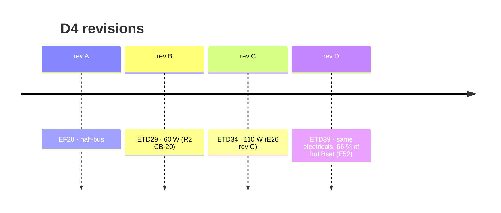

# 🌀 D4 Aux Flyback Transformer

<sub>The rev D turns sheet for the 110 W full-bus auxiliary supply</sub>

<p>
  
  
  
  
</p>

> [!NOTE]
> **Purpose** — the rev D turns sheet for the 110 W full-bus auxiliary flyback that powers every module. Rev D
> (E52) moved the core from ETD34 to ETD39 with the rev C electricals unchanged, which doubled the saturation margin.
>
> **Gate coupling** — `stress-audit` computes the flux line on every run; `temp-critique` solves its hot and cold
> equilibria; the aux SPICE matrix proves start-up and regulation per SKU.

## At a glance

| Parameter | Value |
|---|---|
| **Stage** | 110 W-class DCM flyback, 65 kHz, Vor ≈ 157 V, 1700 V SiC switch (72 % at 860 V + clamp ring) |
| **Input** | 342–860 VDC — the full, unboosted DC bus |
| **Controller** | NCP1252**D** (14 V on / 9 V off, R6-G), current-sense 0.31 Ω → 1.0 V → **Ip clamp 3.2 A** |
| **Core** | **ETD39 PC95-class**, Ae 125 mm², gapped to AL ≈ 239 nH/T² |
| **Peak flux** | **0.233 T** (0.256 T at Lp + 10 %) = **66 % of hot Bsat** — the ETD34 rev C reached ~85 % |
| **Core loss** | ~0.4 W (down from ~0.9 W on the smaller core) |
| **Sizing margin** | ≥ 20 % at the worst per-SKU load with Lp + 10 % and f − 5 % |
| **Order code** | **XFMR-AUX-FLY-D** — one part number for the whole family |

## Windings

| Winding | Turns | Ratio to Np | Rdc limit | Insulation |
|---|---:|---:|---:|---|
| Primary Np (Lp 345 µH) | **38** | 1 | ≤ 900 mΩ | at bus potential |
| 24 V secondary | **6** | 0.158 | ≤ 60 mΩ | **reinforced** to primary (TIW + 3 mm margin tape) |
| 15 V secondary | **4** | 0.105 | ≤ 45 mΩ | **reinforced** to primary |
| Aux (VCC, primary-side, DCN-referenced) | **4** | 0.105 | ≤ 45 mΩ | functional to primary, reinforced to secondaries |

The ETD39 former (AN ≈ 177 mm²) relaxes the rev C window fill; the + 15 % mean turn length sits inside the unchanged
Rdc limits. Rectifiers (CB-19): PIV ≈ 160 V (24 V) and 151 V (15 V / VCC) plus leakage ring → **400 V ultrafast**
(UF-400V-3A SMC / US2G) — never a 100 V Schottky.

## The two numbers that size it

```math
B_{pk} = \frac{L_p\,I_p}{N_p\,A_e} = \frac{345\,\mu\mathrm{H} \times 3.2\,\mathrm{A}}{38 \times 125\,\mathrm{mm^2}} \approx 0.233\,\mathrm{T}
```

```math
t_{on} + t_{reset} = 3.2\,\mu\mathrm{s} + 7.0\,\mu\mathrm{s} = 10.3\,\mu\mathrm{s} \;<\; 13.8\,\mu\mathrm{s}\ \text{usable at } V_{in,min} = 342\,\mathrm{V}
```

The DCM proof is inductance-based, so it is unchanged by the core swap and holds at Lp + 10 %. The aux SPICE matrix
(per-SKU loads at 342 / 560 / 850 V) is likewise unaffected.

> [!CAUTION]
> **Safety-critical barrier.** The primary sits at bus potential and the SELV control domain depends on this
> transformer's reinforced barrier (E25). Hipot **4 kV, 100 %**, as a witnessed traveler operation — never sampled.

## Verification hooks

| Test | What it proves |
|---|---|
| EVT T-09 | clamp thresholds and the current-sense limit on the real part |
| EVT T-18 | thermal at the per-SKU load table |
| EVT T-29 | cold-start waveform, including the −30 °C soak (A11 rev C) |



---

<div align="center">
<sub><a href="magnetics-fmea-e58.md">← Magnetics FMEA & Temperature Critique</a> &nbsp;·&nbsp; <a href="README.md">🧭 Documentation hub</a> &nbsp;·&nbsp; <a href="simulation-toolchain.md">Simulation Toolchain →</a></sub>

<sub>Vectivolt DC-Modules · documentation rev E61 · every number reproduces with <code>sh calculations/run-all.sh</code></sub>
</div>
