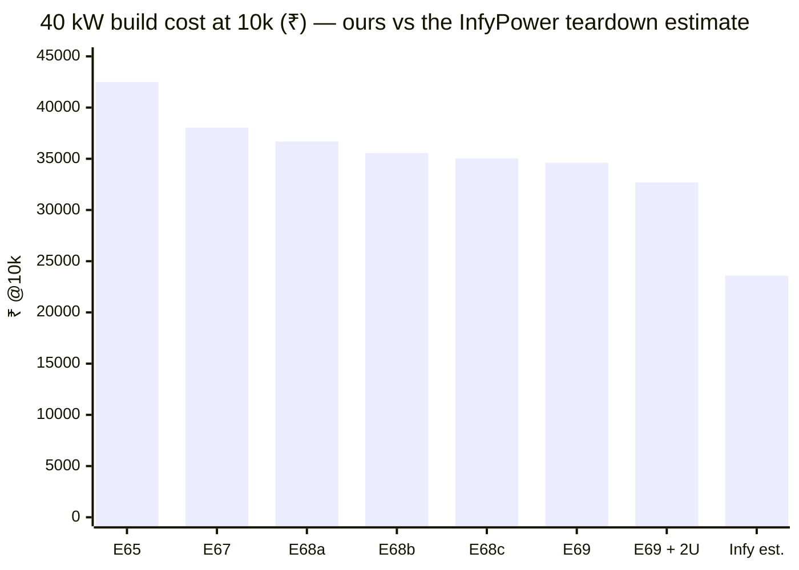
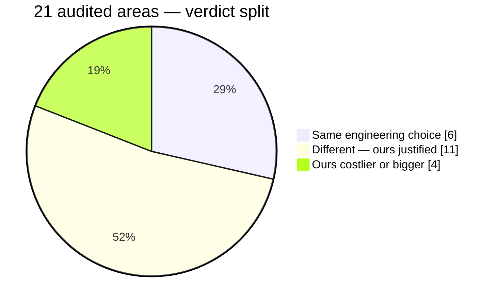

# 🩻 InfyPower Teardown Benchmark

<sub>Block-by-block audit of our architecture against the REG1K0135A2 40 kW SiC module teardown</sub>

<p>
  
  
  
  
  
</p>

> [!NOTE]
> **Purpose** — an end-to-end engineering comparison of this platform against a proven commercial 40 kW SiC charging module,
> the **InfyPower REG1K0135A2**, opened by ChargerLAB
> ([teardown](https://www.chargerlab.com/teardown-of-infypower-40kw-ev-sic-power-module-reg1k0135a2), read 2026-09-13):
> what InfyPower built, what we copied from it (E67–E69), what we deliberately did not, and the cost gap that remains.

> [!IMPORTANT]
> **Outcome.** The E62 audit found the macro-architecture already converged. The customer then directed a clone of InfyPower's
> architecture and BOM: E67 adopted the full-bridge LLC, the two output modes and the output diode; E68 the clip mount, the
> star-X2 EMI filter and film-only banks; E69 right-sized dies. Rated efficiency is 96.70 % at 40 kW against InfyPower's
> "> 96 %". On the India price list the 40 kW module is still ≈ 47 % above the teardown estimate — the largest single step
> left is to buy one REG1K0135A2 and measure it.

## How to read the evidence

| Tag | Meaning |
|---|---|
| **[T]** | stated in the teardown text |
| **[T?]** | teardown ambiguous — photo-level detail the text does not resolve (counts, arrangements) |
| **[D]** | REG-family datasheet class (reseller tables for the A2 conflict internally; family values used) |
| **[C]** | computed here, assumptions stated |
| **[R]** | our own engine output (`run-all` battery — reproducible) |

Verdict scale of the E62 record below (applied to **our** design, per the audit directive): **1** intentional and justified · **2**
acceptable but less optimal · **3** unnecessarily complicated · **4** less efficient or more expensive · **5**
less reliable · **6** missing an important function · **7** fundamentally incorrect.

## The two machines

| | InfyPower REG1K0135A2 | Vectivolt 40 kW module (E69) |
|---|---|---|
| AC input | 260–530 VAC 3-φ · 76 A max [T] | 3-φ 400 V nominal · F.07 trip > 500 VAC · 530 V filter-ready, product decision open (R14) |
| DC output | **150–1000 V · 0–133 A** [T] | **150–1000 V · 133 A** — identical window and current |
| Efficiency | > 96 % comprehensive · > 97 % peak [T] | full power 400 V **96.70 %** (output diode included) · peak **98.26 %** [R] |
| Semiconductors | full SiC [T] | full SiC |
| Brain | 2 × TMS320F28035 (one per stage) [T] | 1 × GD32G553VET7 (both stages, E40) |
| Build | two stacked PCBAs — PFC + LLC, wired [T] | two-board sandwich — AC-DC + DC-DC, 40-way harness |
| Cooling | 3 fans (MGT8012VB-W38, IP55) [T] | 3 fans (IP55, E60) — same count at the same power |
| Volume | 403 × 298 × 84.1 mm = 10.1 L → **3.96 kW/L** [T] | 3U 19-inch card, ~2.1–2.6 kW/L [est] — a 2U construction is a cost scenario only (E69e) |
| Mass | 15.5 kg → 2.58 kW/kg [T] | not computed (no mechanical design); likely heavier |
| Environment | −40…+75 °C, derate from 55 °C · 95 % RH · 2000 m [D] | −30…+55 °C full, derate to +75 (A11 rev C) · 95 % RH · 2000 m |
| Protection build | potting + rear conformal coating, heatsink-integration patent [T] | acrylic conformal coating both boards + card (E52); sealed liquid 50 kW variant |
| Reliability claim | MTBF 500 kh [D], no stated basis | parts-count prediction **≈ 402 kh at 40 °C** [R] — method-for-method comparison only at EVT |

## Power architecture, side by side

```mermaid
flowchart LR
  subgraph INFY["InfyPower REG1K0135A2 — as opened"]
    direction TB
    IF["3 × fuse 100 A / 500 VAC<br/>MOV S20K425 / 460 + GDT"] --> IE["2 × CM choke<br/>9 × 4.7 µF X2 · Y film"]
    IE --> IP["AC soft-start<br/>75 Ω sets + 4 relays 40 A"]
    IP --> IV["3-level PFC<br/>600 V 22 mΩ SiC + 1200 V 40 A SiC diodes<br/>3 flat-copper chokes"]
    IV --> IL["DC link<br/>Jianghai 475 V 680 µF × N"]
    IL --> ID["Full-bridge LLC<br/>4 × 1200 V 35 mΩ TO-247-4<br/>litz transformer + external Lr"]
    ID --> IS["16 × 1200 V 40 A SiC diodes<br/>3 × 90 A relays — series / parallel"]
    IS --> IO["Series blocking diodes 1600 V 90 A<br/>discharge chopper 1500 V FET + 300 Ω"]
  end
  subgraph VV["Vectivolt 40 kW — E69"]
    direction TB
    VF["3 × gG fuse 125 A / 690 V<br/>MOV S20K550 Δ + GDT 3.5 kV"] --> VE["CMC1 · X2★ 4.7 µF · CMC2<br/>2 × X2★ 4.7 µF · Y1 · Rd–Cd damper"]
    VE --> VP["AC precharge<br/>2 × 33 Ω pulse + 2-pole bypass"]
    VP --> VV1["Vienna PFC 50 kHz<br/>one 750 V 15 mΩ-class die per position<br/>1200 V 40 A JBS · 3 × D1 chokes"]
    VV1 --> VL["split link 2 × 6 × 470 µF 450 V<br/>window 650–830 V · OVP 860 V"]
    VL --> VD["full-bridge LLC · fr 140 kHz<br/>8 × 1200 V 23 mΩ (two per position)<br/>2 D3 cells + D2 external Lr"]
    VD --> VS["16 × 1200 V 40 A JBS · film-only banks<br/>KSER · KPARA / KPARB at 0 A"]
    VS --> VO["DOUT 1600 V 200 A<br/>640 Ω discharge · 1200 V SiC switch"]
  end
```



The same machine since E67. The divergences left are deliberate: two 23 mΩ dies per LLC position (their single 35 mΩ die fails our
55 °C HIGH-mode corner), the gate-drive class (the drive clone is approved but not executed), sensing (CTs and isolated amplifiers
vs shunts), one brain instead of two, the split 450 V DC link, and packaging density.

## Where we stand now — the E67–E69 clone

> [!NOTE]
> **Directive (2026-09-13)** — "use exactly their architecture and their BOM end to end (except where ours is better
> or cheaper) … it is tested and running in production and economically viable, so we should not reinvent the
> wheel at premium prices", with per-SKU values allowed for minimal cost and risk, and a target within 2–5 % of
> InfyPower's cost. Register rows [E67 · E68 · E69](assumptions.md).

### What was copied, block by block

| Block | InfyPower REG1K0135A2 [T] | Ours now | Row |
|---|---|---|---|
| DC-DC topology | single full-bridge LLC, external litz Lr | **copied** — one full-bridge LLC, D2 rev F external Lr, two D3 cells in series (the 66 mm tunnel forbids one tall stack) | E67 |
| Output range | relay series / parallel banks | **copied** — LOW ≤ 500 V parallel / HIGH ≥ 500 V series, latched in standby, zero-current relays | E67 |
| Output protection | 1600 V series blocking diodes | **copied** — DOUT 1600 V, 150 / 200 / 250 A class; K_OUT and pre-insertion retired | E67 |
| Device mounting | clip-mounted discrete TO-247 | **copied** — clip on Al2O3; single dies per position where the fault-pulse rule allows | E68a |
| EMI filter | two CM chokes + 9 × 4.7 µF X2, no DM chokes | **copied** — 2 CMC + 12 × 4.7 µF X2 in three star stages; the damper stays (without it the current loop is unstable with either filter) | E68b |
| Output banks | film only | **copied** — 9 / 12 / 14 × 2.2 µF 630 V per bank | E68c |
| PFC switches | 600 V 22 mΩ class | **adapted** — 750 V 20 / 15 mΩ class (650 V would be 86 % of rating at our 560 V worst switch stress; the house rule is 75 %) | E69a |
| LLC switches | 4 × 1200 V 35 mΩ | **not copied** — one 23 mΩ die per position at 30 kW, two at 40 / 50 kW; a single 35 mΩ die fails our 55 °C HIGH-mode corner, and a single 16 mΩ die at 40 kW fails the fault-pulse rule | E68a / E69a-2 |
| Gate drive and protection | gate-drive transformers + basic iso drivers, no DESAT | **approved, not executed** — about −₹470 at 40 kW against a protection-philosophy change (GDT design, D4 re-wind, new trip evidence) | E69 (e) |
| Control | two TMS320F28035 | **kept ours** — one GD32G553 (cheaper by ≈ ₹170) | E40 |
| Sensing | shunt + iso amp | **kept ours** — isolated senses on every domain (≈ ₹1.2k premium, a safety-architecture choice) | E25 |
| Aux | 900 V Si flyback on half the link | **kept ours** — full-bus SiC flyback (a half-link aux saves ≈ ₹250 but needs a D4 redesign and midpoint duty) | E52 |
| Packaging | 2U potted heatsink chassis, 3 × 80 mm fans | **scenario only** — the design stays a 3U card; the 2U table in [BOM & cost](bom-cost.md) is flagged, unproven | E69e |

### The tank, side by side (40 kW, same power-solved ngspice method)

| Corner | InfyPower-reading tank (fr 99.8 kHz, Ln 8) Ip rms | Ours (fr 140 kHz, Ln 10) Ip rms | ZVS |
|---|---:|---:|---|
| PAR 500 V, gain-worst tolerance | 66.5 A | 60.1 A | 64/64 both |
| SER 250 V, rated power | 92.1 A | 90.5 A | 64/64 both |
| PAR 400 V, rated point | 63.9 A | 59.8 A | 64/64 both |

The tank reading from the teardown carries 2–10 % more current than ours at the same corners; ours stays on the E67
values.

### Where the cost gap is now (40 kW, @10k, India price list)

InfyPower's column is the E62 teardown parts list priced on our own 10k price list (±20 %). It is an estimate of
what their BOM would cost us, not their real cost.

| Section | Ours (E69) ₹ | InfyPower est. ₹ | Gap ₹ | What would close it |
|---|---:|---:|---:|---|
| Heatsinks, fans, enclosure | 5,348 | ~3,560 | +1,788 | 2U potted chassis (E69e scenario) — a mechanical design, not a schematic change |
| PFC stage | 5,132 | ~4,600 | +532 | dies right-sized (E69a); a flat-core D1 is the open item |
| LLC transformer cells + external Lr | 3,228 | ~2,450 | +778 | one transformer needs the 2U height |
| LLC bridge | 2,800 | ~900 | +1,900 | blocked by physics at our rules: 55 °C HIGH-mode corner and the fault-pulse rule |
| EMI filter | 2,790 | ~2,050 | +740 | cloned; the rest is the two CMCs and the damper |
| DC link, precharge, tank caps | 2,755 | ~2,280 | +475 | about parity |
| PCBs | 2,349 | ~1,450 | +899 | 4-layer boards at half the area (E69e scenario) |
| Sensing | 1,975 | ~740 | +1,235 | a safety-architecture decision, not taken |
| Relays, fuses, aux | 1,867 | ~1,210 | +657 | 90 A relays and 500 VAC fuses (< ₹200); 900 V half-link aux (≈ ₹250) |
| Assembly + EOL | 1,697 | ~1,000 | +697 | production process |
| Secondary diodes | 1,536 | ~1,536 | 0 | parity |
| Gate drive | 1,054 | ~260 | +794 | the approved drive clone (≈ −₹470) |
| Output banks | 864 | ~400 | +464 | cloned (film only); the rest is film count at our 0.5 % ripple rule |
| Busbars, studs, harness | 705 | in mechanical | — | — |
| Control | 516 | ~690 | −174 | ours is cheaper |
| **Module** | **34,616** | **≈ 23,600** | **≈ +11,000 (+47 %)** | |



> [!IMPORTANT]
> **The honest verdict.** The architecture is now InfyPower's, and the clone took ₹7.9k (−19 %) out of the 40 kW
> module since E65. On the India price list the module is still ≈ 47 % above the teardown estimate (≈ 38 % with the
> unproven 2U construction). The China RFQ-target column (E69f) puts the 40 kW module at ₹28,319 (₹26,735 with 2U),
> but that compares a landed China target with an estimate priced in India, so it is not a like-for-like gap. The
> 2–5 % target is not met by any change the gates can prove today. The largest single unknown is whether the
> estimate itself is right: **buy one REG1K0135A2 and measure it** (thermals at SER 500 V, device temperatures, gate
> waveforms, BOM by weight and marking), then re-run this table on data instead of a teardown reading.

### Levers left, ranked by rupees per unit of risk

| Lever | ₹ at 40 kW | Risk / prerequisite |
|---|---:|---|
| Buy and measure one REG1K0135A2 | — | none — turns the estimate into data |
| 2U construction (potted heatsink chassis, 4-layer PCBs, 80 mm fans) | ≈ −1,900 | a flat-core D1 (a 3-core D1 fails F.01 at 40 kW) and a mechanical design that holds the 70 °C base at 55 °C |
| China sourcing at the RFQ-target factors | ≈ −6,300 | quotes; duty per HSN code confirmed by a customs broker |
| Drive clone (GDTs on the LLC, opto PFC drivers on aux-winding bias, shunt comparator) | ≈ −470 | protection-philosophy change; needs a GDT design, a D4 re-wind and new trip evidence |
| 900 V half-link aux | ≈ −250 | D4 redesign, midpoint duty |
| 90 A relays, 500 VAC fuses | < −200 | relay carry at 89 % of rating (InfyPower's practice) versus our 80 % rule |

<details><summary><b>E62–E63 record — the block-level audit of the pre-clone design</b> (InfyPower's side stays valid; our side is the E62 state, superseded by E67–E69)</summary>

## Verdict matrix

| # | Area | REG1K0135A2 | Ours | Verdict |
|--:|---|---|---|---|
| 1 | Topology selection | 3-level boost PFC + resonant isolated DC-DC | Vienna + 3-φ LLC (→ E67: Vienna + full-bridge LLC, as theirs) | **same choice — validated** |
| 2 | Power-stage architecture | single full-bridge LLC | three interleaved half-bridge sections | **1** — Wolfspeed-reference architecture, buys full-load η and ripple |
| 3 | AC-DC structure | 3-level, SiC switch + SiC boost diode | same, paralleled 750 V pairs | **same choice — validated** |
| 4 | Switching strategy | PFM LLC (fsw unpublished) · PFC hard-switched 3-level | LLC PFM about fr 140 kHz, ZVS proven · Vienna 50 kHz | **1** |
| 5 | SiC arrangement | few large dies (4 × 35 mΩ primary) | more small dies (6 × 23 mΩ) | **1**, cost noted (~₹2.3k) |
| 6 | Magnetics architecture | one big transformer + external Lr, litz | 3 × D3 + binned D2 trim, controlled leakage | **1/2** — heavier, but binnable and gated |
| 7 | DC-link design | 475 V electrolytics, series for ~800 V [T?] | 450 V × 2-series, 650–830 V window, OVP 860 | **same choice — validated** |
| 8 | Control logic | two 60 MHz DSPs, muxed ADCs, inter-DSP link | one 216 MHz MCU, 22 direct channels, HRTIMER | **1** — removes the inter-brain link failure class (E40) |
| 9 | Start-up / shutdown | AC soft-start 3–8 s system [D] | F.20 windows 175–300 ms + aux ~5–6 s cold start | **equivalent — ours gated** |
| 10 | Precharge / discharge | AC-side R + relays · 1500 V chopper + 300 Ω | AC-side 33 Ω × 2 + 2-pole bypass · 640 Ω + SiC switch + passive 47k | **same choice — validated** |
| 11 | V / I sensing | shunts + AMC1200 iso-amps, muxed | CTs (line + resonant) + output shunt + AMC1350/1311 | **1** — zero-loss, trip-grade bandwidth |
| 12 | Hardware protection | shunt comparators + DSP, no DESAT seen [T] | DESAT + CMP/DAC trips + supervisory ladder | **1** — three layers by directive |
| 13 | Fault handling | datasheet: SCP self-rollback, alarms [D] | F.xx ladder, per-SKU windows, host-proven 54/54 (60/60 since E67) | **1** (their firmware not inspectable) |
| 14 | Gate drive | 3 iso-driver ICs + gate transformers, no Miller clamp seen | 9 × NSI6611 (DESAT, clamp, soft-off) + QA01C-18 ±bias | **1**, cost noted (~₹1k+) |
| 15 | Aux power | UCC28C45 flyback, 900 V Si, opto FB [T] | one 110 W 342–860 V flyback, 1700 V SiC, NCP1252D | **1/2** — dearer switch, full-range and balance-neutral |
| 16 | Thermal / cooling | 3 fans + potted heatsink integration | 3 fans + extrusion tunnel; 50 kW liquid twin | **1**; density consequence in #20 |
| 17 | EMI / EMC | 2 × CMC, 9 × X2, Y films, MOV + GDT | 2 × CMC, X1-class caps, per-phase DM chokes, MOV Δ + GDT | **1/2** — heavier filter, computed LISN margins |
| 18 | Modularity / service | potted (non-repairable), 48-module parallel bus | coated boards, card slot, 2–3-module products (E66: no CSU) | **1** — different product philosophy |
| 19 | Communication | CAN, iso transceiver (NSi1050) | CAN 2.0B, iso transceiver (NSI1042), fuzzed codec | **same choice — validated** |
| 20 | Component utilization / density | 3.96 kW/L · 2.58 kW/kg | ~2.1–2.6 kW/L [est] | **2/4 — their clear win**; E36 layout lever |
| 21 | Reliability philosophy | potting + derate + MTBF 500 kh claim | gates + margins + coating; MTBF unpublished | **1**, with an honesty gap on MTBF |



## 1 · AC input, fusing and surge

| | |
|---|---|
| **InfyPower** | 3 × 100 A / 500 VAC fuses [T]; MOVs TDK S20K425 + S20K460K1 with a GDT [T]; mechanical reverse-keyed AC connector. |
| **Why** | fuses are the last-resort energy limit; the mixed MOV values imply phase-referenced clamping through the GDT; keying prevents mis-plugging in the rack. |
| **Ours** | 3 × gG 125 A / **690 VAC** 22×58 (E35 derate rule 0.72×: 90 A capacity ≥ 73.3 A worst) · MOV **S20K550 in Δ** + GDT-3k5-20kA to PE (HR-7) · fault-energy gate proves every winding and busbar outlives the fuse by ≥ 10× I²t. |
| **Assessment** | ours is the stricter selection on both axes. Their 100 A at 76 A max is 76 % continuous load — outside our own 0.72× gG rule — and a 500 VAC fuse under a 530 VAC-rated input is under-voltage-rated as read **[T?]**. Their 460 V MOV cannot sit line-to-line at 530 VAC, so their clamp must be phase-referenced; our 550 V Δ MOV is already legal line-to-line at 530 V — the E61-corrected input-range position (R14) is confirmed by their spec, not contradicted. |
| **Verdict** | **1**. No change. Their fuse margin is a them-problem; ours is gated. |

## 2 · EMI filter

| | |
|---|---|
| **InfyPower** | fuse → MOV/GDT → **two CM chokes** with X2 4.7 µF × 9 and film Y caps [T]; no dedicated AC DM chokes seen; DM attenuation from X-caps plus choke leakage. |
| **Why** | two-stage CM is the minimum that passes CISPR conducted on a 40 kW SiC front end; X-heavy DM filtering is cheap and small. |
| **Ours** | identical two-stage CM spine — CMC1 → X1 2.2 µF → CMC2 — **plus per-phase D6 DM chokes** (crest-biased floors, E43 engine) and X1 4.7 µF + Y1 4.7 nF; margins computed per variant in `lisn-precompliance` (+4.9…+5.7 dB). |
| **Assessment** | same architecture; we carry one extra filter element class (D6) because our margins are computed, not measured — the deliberate pre-hardware posture. Their capacitors are **X2**-class where ours are **X1 530 VAC** [T]; at a 530 V line, X1 is the defensible class. Their build is evidence a lighter DM section can pass, but only their EMC lab knows. |
| **Verdict** | **1/2**. Keep D6 until the EVT LISN scan (T-08) says otherwise — that trim lever is already registered. |

## 3 · Precharge / soft start

| | |
|---|---|
| **InfyPower** | AC-side soft start: 75 Ω / 5 W resistor sets (3 in series) shorted by four 40 A / 250 V relays, plus two 15 Ω TO-220 resistors [T]; system soft-start 3–8 s [D]. |
| **Why** | the rectifier + link would otherwise draw a multi-kA surge at plug-in; AC-side resistors also protect the boost diodes. |
| **Ours** | same concept, harder parts: 33 Ω pulse-rated in **two lines** + 2-pole 80 A bypass (a one-line resistor is the E14b three-wire fallacy) · t₉₅ ≈ 231 ms on the 40 kW deck · F.20 window 175–300 ms · relay **mirror-contact readback** before power (E30) · resistor pulse energy gated against its class (fault-energy). |
| **Assessment** | equivalent function. Their 3–8 s figure is the whole boot (aux + DSPs + CAN), comparable to our aux ~5–6 s cold-start reservoir plus 0.23 s precharge — not a precharge-speed gap. Their 40 A / 250 V bypass contacts on a 76 A / 530 V line only work because bypassed resistors see no steady current; ours are rated for the line. |
| **Verdict** | **1**. No change. |

## 4 · PFC stage

| | |
|---|---|
| **InfyPower** | three-level boost rectifier: **600 V 22 mΩ SiC MOSFETs** (Sanrise) + **1200 V 40 A SiC boost diodes** (Sanan) + 3 flat-copper chokes [T]; per-phase arrangement not resolvable from text [T?]. |
| **Why** | the three-level structure halves switch voltage stress (600-V-class switches on an ~800 V link) and halves choke ripple at a given frequency — the industry default for 3-φ charger front ends. |
| **Ours** | the same physics, named: Vienna, 50 kHz, common-source **750 V 10 mΩ pairs** (×2 paralleled at 40 kW, per-device 2.2 Ω gate R), 1200 V 40 A JBS to the rails, RC + RCD clamp per node, D1 catalog-core chokes with biased-inductance floors. |
| **Assessment** | the voltage classes agree exactly — switch at half-bus (both switch classes sit at 57–72 % of the ~430 V half-bus ceiling), diode at full bus (both 1200 V / 40 A). That is independent commercial confirmation of our Vienna stress analysis. Conduction: at 400 V / 40 kW, phase current ≈ 60 A rms, switch RMS ≈ 0.55 × ≈ 33 A. Our position resistance is 2 × 5 mΩ (paralleled pair in series) ≈ 15 mΩ hot → ≈ 16 W/phase. A single 22 mΩ device (33 mΩ hot) — whether alone in a diode bridge or back-to-back — lands 36–72 W/phase **[C]**, i.e. +60…+170 W at full load. |
| **Verdict** | **1**. Their PFC is the cost play; ours is the efficiency/thermal-headroom play — and it is why we can hold full power at +55 °C with computed 139 °C worst Tj [R]. |

```math
I_{ph} \approx \frac{40\,000}{\sqrt{3}\cdot400\cdot0.99\cdot0.97} \approx 60\ \mathrm{A_{rms}},\qquad
I_{sw,rms} \approx 0.55\,I_{ph} \approx 33\ \mathrm{A},\qquad
P_{cond} = R_{pos,hot}\cdot I_{sw,rms}^2 \Rightarrow
\begin{cases} \text{ours: } 15\ \mathrm{m\Omega} \to 16\ \mathrm{W/phase}\\ \text{theirs: } 33\text{–}66\ \mathrm{m\Omega} \to 36\text{–}72\ \mathrm{W/phase}\ \text{[C]}\end{cases}
```

## 5 · DC link

| | |
|---|---|
| **InfyPower** | Jianghai CD296 long-life electrolytics, **475 V / 680 µF**, glued in blocks [T]; count and series arrangement not stated [T?] — 475 V parts force a 2-series stack on an ~800 V link. |
| **Why** | electrolytic 2-series is the only economic way to buffer an 800 V link; glue = vibration rating. |
| **Ours** | 2 × 6 × 470 µF / 450 V (−40 °C category, E60) with balance resistors and a **sensed midpoint**, window 650–830 V, hardware OVP 860 V; 1410 µF net ≈ 486 J ≈ **12 J/kW** [C]; per-can ripple gated ≤ 1.05 A (E33); E59 vent rule. |
| **Assessment** | identical architecture (series electrolytic halves, 450/475 V class). Their can count is unreadable from the text, so no J/kW comparison is honest — noted, not guessed. One structural difference: the Vienna needs a **driven midpoint**; our midpoint is sensed and balanced by control with F-rows on imbalance — their board must do the same (not visible). |
| **Verdict** | **same choice — validated**. |

## 6 · DC-DC stage

| | |
|---|---|
| **InfyPower** | **single full-bridge LLC**: 4 × 1200 V 35 mΩ SiC TO-247-4 (Kelvin source), one litz transformer set, one external litz resonant inductor, 7 parallel resonant caps (marking read "3.3 µF 250 V" — almost certainly a misread of a film-cap code [T?]), 16 SiC diodes on the secondary. |
| **Why** | a full bridge halves primary RMS current versus a half-bridge at the same power and reuses one big magnetic — the minimum-part-count way to 40 kW. |
| **Ours** | **three interleaved half-bridge LLC sections** at fr 140 kHz: 6 × 1200 V 23 mΩ, 3 × D3 transformers (2 × E70), binned D2 trim + controlled leakage as Lr, 6 × 33 nF C0G-class film per section bank, power-solved per-SKU decks with a physicality guard (E60). |
| **Assessment** | at **full load** the full bridge conducts through two devices at ≈ 57 A rms → ≈ 250–330 W primary conduction [C]; our engine's whole primary-FET loss (conduction + switching) at 40 kW is **151.6 W** [R]. Their "> 96 % comprehensive" is a load-weighted claim — at 20 kW their conduction falls 4× and the numbers reconcile; at rated power our stage is simply better, which is where a 55 °C-full-power module lives. Interleaving also cancels most output ripple current (E12b), shrinking what the banks must absorb. The price: ~2.3× the primary silicon conductance (₹ ≈ 2.3k more) and three magnetics instead of one. This is the Wolfspeed CRD-30DD12N-K architecture we verified at E51 — a deliberate, referenced choice, not an accident. |
| **Verdict** | **1** (with the cost honestly on the table). Their resonant-cap reading is too garbled to compare tank designs; ours is fingerprint-gated against its own SPICE decks. |

```math
V_{1,rms}^{FB} = \frac{4}{\pi}\cdot\frac{800}{\sqrt 2} \approx 720\ \mathrm{V},\quad
I_{pri} \approx \frac{40\,000}{720\cdot0.97} \approx 57\ \mathrm{A_{rms}},\quad
P_{cond} \approx 2\cdot R_{hot}(\approx50\ \mathrm{m\Omega})\cdot57^2 \approx 325\ \mathrm{W\ [C]}
\;\;\text{vs}\;\; P_{FET,total}^{ours} = 151.6\ \mathrm{W\ [R]}
```

## 7 · Magnetics

| | |
|---|---|
| **InfyPower** | flat-copper PFC chokes, one litz LLC transformer, one litz external Lr, taped cores, glued/potted mounting [T]. |
| **Why** | flat copper for AC-side chokes (skin-friendly, dense); an external Lr avoids controlling transformer leakage in production. |
| **Ours** | D1 flat-copper catalog-core chokes (same construction philosophy), D3 with **spacer-controlled leakage** plus a **binned external trim** — leakage is a controlled parameter, not a hope; every conductor Dowell/Sullivan-audited at 140 kHz, every drawing RFQ-complete, masses computed. |
| **Assessment** | both designs put Lr **outside** the transformer — their external inductor is the same admission that leakage alone is not a production parameter. Our bin+trim scheme is heavier than industry (recorded at E51) but is what makes three parallel sections share current within the E60 mismatch analysis. |
| **Verdict** | **1/2** — heavier, gated, intentional. |

## 8 · Secondary rectification and the wide output range

| | |
|---|---|
| **InfyPower** | 16 × 1200 V / 40 A SiC diodes on one heatsink [T]; **three 90 A relays** reconfigure the output sections; range 150–1000 V, constant-power knee ≈ 300 V — exactly the S/P concept [T+D]. |
| **Why** | series/parallel reconfiguration is the only economic way to hold ~constant power over 150–1000 V without oversizing the transformer 2×. |
| **Ours** | 24 × 1200 V / 20 A JBS in six bridges (two per section) feeding **bank A + bank B**; K_SER · K_PARA/K_PARB with **10 Ω pulse-rated pre-insertion** and **K_OUT behind the E12b gate**; crossover 500/525 V; relay mirror contacts read back before any transition; a hard close across a 2 V mismatch was simulated at 205 A — that is why the pre-insertion resistor exists. |
| **Assessment** | same diode voltage/current budget (theirs 16 × 40 A = 640 A·units; ours 24 × 20 A = 480 A·units for the same 133 A — ours is actually the leaner diode buy). Same relay-count class (3 vs our 4). Identical range and knee. Their relays carry no visible mirror contacts or pre-insertion [T?] — the series blocking diode (next block) is what makes that survivable for them. |
| **Verdict** | **same choice — validated**; our execution is the harder-specified one. |

## 9 · Output protection and discharge

| | |
|---|---|
| **InfyPower** | **series blocking diodes** (1600 V / 90 A class) in the output [T]; discharge = 1500 V FET chopping 4 × 75 Ω [T]. |
| **Why** | the series diode makes reverse-battery, bus back-feed and 48-module parallel racks unconditionally safe with zero firmware — at a permanent conduction cost. |
| **Ours** | no series diode. Isolation is K_OUT (dual at 50 kW) with mirror weld-check; connection is the E12b matched-voltage make through pre-insertion; discharge is a 640 Ω path on a 1200 V SiC switch, default-OFF (E19), 830 → 60 V in 2.4 s [R], plus passive 2 × 47k pairs; polarity screening before the plug goes live is the dispenser's job in a 61851-23 system. |
| **Assessment** | their diode costs 0.15 % (750 V) to 0.44 % (300 V full current) of efficiency, forever [C]; ours costs relay discipline and one system assumption. Our own multi-module products (100 = 2 × 50, 150 = 3 × 50 (E66: no CSU)) run commanded-CC with per-module fusing — not a 48-module diode bus — so the assumption is inside our product structure. It is now **recorded as R18** in the [verification matrix](verification-matrix.md) rather than living implicitly. |
| **Verdict** | **1**, with R18 recorded. No diode added — that would be copying a solution to a product architecture we do not have. |

```math
P_{diode} \approx V_f \cdot I_{out}:\quad 1.1\ \mathrm V\times133\ \mathrm A \approx 146\ \mathrm W\ (0.44\,\%\ @\ 300\ \mathrm V)\qquad
1.1\ \mathrm V\times53\ \mathrm A \approx 58\ \mathrm W\ (0.15\,\%\ @\ 750\ \mathrm V)\ \text{[C]}
```

## 10 · Gate drive

| | |
|---|---|
| **InfyPower** | 3 × NOVOSENSE NSi6801 single-channel iso drivers (PFC) + **gate-drive transformers** with low-side push drivers and a PMOS clamp for the LLC bridge [T]; no DESAT, Miller clamp or negative rail mentioned anywhere in the teardown [T]. |
| **Why** | transformer drive is the cheapest way to four floating gates: no per-channel bias supplies, no iso-driver ICs. Its limits — duty range, no fault feedback, weak hold-off — are acceptable when protection lives in shunt comparators and device ruggedness. |
| **Ours** | 9 iso-driver channels per module: **NSI6611** (DESAT with 22/47 pF blank, active Miller clamp, UVLO, soft-off) fed by reinforced **QA01C-18** ±bias modules (+18 / −4 V drawn; −3 V catalogue — O-11 open), split 4.7/4.7 Ω gate resistors, two 1 kV DESAT diodes + 100 Ω per channel. |
| **Assessment** | ≈ ₹1–1.5k/module premium over their scheme [C, class prices]. What it buys: per-device short-circuit detection inside the SiC withstand time (next block), a clamped off-state at 140 kHz dv/dt, and a defined negative hold-off — the three things transformer drive cannot give. On a module spec'd for unattended DCFC duty at 55 °C full power, that is the correct side of the trade; their side is the correct one for their cost point. |
| **Verdict** | **1**. Cost recorded as a known premium, not a lever — removing DESAT would breach the protection philosophy. |

## 11 · Protection philosophy

| | |
|---|---|
| **InfyPower** | two layers visible: shunt + iso-amp + comparator/DSP overcurrent, and the fuse; datasheet lists input OVP/OCP/OPP/OTP/UVP + surge, output SCP/OVP/OCP/OTP/UVP, **SCP self-rollback** [D]. No per-device DESAT [T]. |
| **Why** | SiC short-circuit withstand plus a fast shunt trip is a defensible minimum; "self-rollback" hiccup restart is the fleet-friendly default. |
| **Ours** | three layers with numbers: **DESAT** blank-to-off 1.44 µs (LLC) / 2.21 µs (Vienna) vs SCWT classes 2 / 4.2 µs · **comparator trips** F.01 120/155/195 A pk and F.11 85/115/145 A pk landing in 2–3 µs on their own burdens (E60 coordination gate: every simulated worst peak ≥ 1.2× under its trip, every trip observable through its kill race) · **supervisory F.xx ladder** with per-SKU windows, host-proven 54/54; plus mirror-contact relays, fault-energy audit (every reservoir has a rated dump path), gG selectivity. |
| **Assessment** | this is the block where the two philosophies genuinely differ. Theirs is statistically fine at their price point; ours is the Wolfspeed-reference class (which also carries DESAT-class protection) and is the direct answer to the standing "works at 200 % in a harsh environment" directive. A teardown cannot show their trip latencies or coordination — the honest statement is that ours is *proven coordinated on paper and in simulation*, theirs is *unknown but field-proven commercially*. |
| **Verdict** | **1**. No change in either direction. |

## 12 · Sensing

| | |
|---|---|
| **InfyPower** | milliohm shunts + AMC1200B iso-amps for PFC and LLC currents; muxed (74HC4051) into the DSP ADCs; thermistors on heatsinks [T]. |
| **Why** | shunts are cheap, DC-capable and drift-free; the mux stretches a 64-pin DSP across many channels. |
| **Ours** | **line CTs** (2500:1, per-SKU burden 22/18/13 Ω) and **resonant CTs** (1:100, 1.2/0.91/0.75 Ω) — zero conduction loss, inherently isolated, bandwidth to feed the on-chip comparators — plus the output manganin shunt + AMC1350/AMC1311 for volts; 22 direct ADC channels, no mux; CT saturation is gated at 1.25× (trip + race) and validated at EOL by test-current injection. |
| **Assessment** | their shunt chain dissipates a few watts and its trip path crosses an iso-amp's bandwidth; our CTs put the fast trip on a passive magnetic path. The CT downsides (saturation, no DC) are exactly what the E58/E60 gates and EOL step 8 exist for. Both are sound; ours is the one aligned with the 3-layer protection stack. |
| **Verdict** | **1**. |

## 13 · Control architecture

| | |
|---|---|
| **InfyPower** | **two TMS320F28035** (60 MHz) — one per stage — with EEPROM, muxed analog, opto/digital isolators between domains, CAN on NSi1050 [T]. |
| **Why** | one DSP per stage is the classic Chinese-module partition: independent development, each chip's PWM resources sized to its stage, isolation boundary crossed once. |
| **Ours** | **one GD32G553VET7** (216 MHz, HRTIMER: ST0–ST2 LLC pairs with hardware dead-time, ST3–ST5 Vienna, 3 on-chip comparators + DACs), one firmware image, RATING strap personality, 75/82 pins used — the E40 "one brain" decision, feasibility-gated by `cardMap()`. |
| **Assessment** | their build proves dual-brain ships; ours removes the inter-processor link entirely — the exact failure class (link CRC, boot ordering, split fault state) we retired at E40 — and halves the firmware surface. The muxed-ADC pattern they use trades sampling latency for pins; we have the pins and keep every protection-relevant channel direct. Nothing in their partition suggests ours is under-resourced: our worst documented utilisation is the HRTIMER at 6/8 units. |
| **Verdict** | **1**. |

## 14 · Auxiliary power

| | |
|---|---|
| **InfyPower** | UCC28C45 current-mode flyback(s), 900 V Si MOSFET, Schottky rails, 78L05/AZ1117 post-regulators, opto feedback [T]; input point not readable (900 V silicon suggests a half-link feed) [T?]. |
| **Why** | a 400 V half-link feed lets a ₹30 silicon switch run the housekeeping. |
| **Ours** | one 110 W flyback from the **full 342–860 V link** on a 1700 V SiC switch (NCP1252D, D4 rev D ETD39, 66 % of hot Bsat), brown-in 321 V, cold start ~5–6 s, 9/9 aux corners simulated. |
| **Assessment** | a half-link aux loads the Vienna midpoint asymmetrically (small, controllable — their balance loop must absorb it) and dies with the half it feeds; ours is balance-neutral and rides the full documented brown-out window. We pay ~₹130 more for the switch. Their two-transformer/multi-rail spread is equivalent to our post-regulator tree. |
| **Verdict** | **1/2** — ours is the cleaner electrical citizen at slightly higher cost; both correct. |

## 15 · Thermal, mechanical, packaging

| | |
|---|---|
| **InfyPower** | two stacked PCBAs in 84 mm (2U-class) · devices on integrated heatsinks under **potting**, conformal coat on the reverse [T] · 3 × 80 mm IP55 fans · patented heatsink-in-potting construction · 10.1 L, 15.5 kg. |
| **Why** | potting turns the whole assembly into one thermally-coupled, dust-and-condensation-proof brick — the Chinese fleet answer to the #1 field killer — and enables the 2U height. |
| **Ours** | two-board sandwich in 3U · TO-247 rows clamped to twin extrusions with phase-change TIM, tunnel airflow, **3 fans at 40 kW (same count)**, air budget 187 m³/h with ≥ 1.5× installed and n−1 covered [R] · acrylic coating + E59 vent rule; the sealed fanless **liquid 50 kW** twin covers the IP65-class role potting serves for them. |
| **Assessment** | their density (3.96 kW/L) versus our estimate (2.1–2.6 kW/L) is the one place this module clearly beats us — consistent with the E51 finding, now with a second data point at 40 kW. The enablers are potting integration, 84 mm height and single-transformer magnetics, not better silicon. We decline potting deliberately: it makes every field failure a module swap, blocks EOL rework, adds ~2 kg, and complicates the E58 magnetics thermal story. The recovery path is the parked E36 layout phase (registered), not a philosophy change. Their 15.5 kg at 40 kW sets the mass bar we have not yet computed against — flagged as an open deliverable of the layout phase. |
| **Verdict** | **2/4 on density and mass — theirs wins today**; the lever is registered, not new. |

## 16 · Communication and paralleling

| | |
|---|---|
| **InfyPower** | isolated CAN (NSi1050), address by front DIP/display, **up to 48 modules parallel**, current-share imbalance ≤ ±5 % [D] — a droop-plus-blocking-diode rack architecture. |
| **Ours** | isolated CAN 2.0B (NSI1042), 29-bit ID scheme with fuzzed codec, group field 0–3; products are 2–3 modules with **commanded-CC equal-share** (CSU, 300 ms staggered joins, hot-rejoin) and per-module protection — N−1 by construction. |
| **Assessment** | different product scales, both internally consistent. Their ±5 % passive share needs the series diode we do not carry; our commanded share needs the CSU we do carry. Adopting their rack scale would mean adopting the diode too — a linked pair of decisions, correctly refused together (R18). |
| **Verdict** | **1**. |

## 17 · Environment and reliability claims

| | |
|---|---|
| **InfyPower** | −40…+75 °C (derate from 55 °C), ≤ 95 % RH, ≤ 2000 m, MTBF 500 kh, UL2202 / IEC 61851 / CE listed [D]. |
| **Ours** | A11 rev C: −30…+55 °C full power (derate to +75), cold start ≥ −30 °C physics-gated on measured ferrite data, storage −40…+85, 95 % RH, 2000 m, IP55 fans, 2 g vibration with banded magnetics; certification is a planned lab campaign, MTBF prediction **not yet published**. |
| **Assessment** | full power to 55 °C is the same on both sides. Their −40 °C floor is a datasheet class; our −30 °C floor came from measured-material cold-start physics (E58/E60) against the verified competitor floors — moving to −40 would reopen electrolytic ESR and aux cold-start, and no customer requirement on file asks for it. The honest gaps on our side are certification and a defensible MTBF figure — both already on the roadmap, now with a competitor number (500 kh) to be measured against. |
| **Verdict** | **1**, two honesty items already tracked. |

## Techniques they use that we do not

| Technique | Their reason | Our position |
|---|---|---|
| Potting with integrated heatsinks (patent) | dust/condensation immunity, density, vibration | **declined** — serviceability, rework, mass; coating + IP55 + sealed-liquid twin cover the role (E52/E60) |
| Series output blocking diode | idiot-proof reverse/back-feed, 48-parallel racks | **declined** — 0.15–0.44 % permanent η cost; relay matrix + E12b + mirror checks + R18 assumption |
| Gate-drive transformers | cheapest floating drive | **declined** — incompatible with DESAT/Miller/soft-off protection stack |
| Shunt + iso-amp current sensing | cheap, DC-capable | **declined** for trip paths — CTs feed the comparator layer; shunt kept where it belongs (output metering) |
| Dual-DSP partition | independent stage development | **declined** at E40 — one brain, no inter-processor link |
| ADC muxing (74HC4051) | pin-poor DSP | not needed — 22 direct channels on the card |
| **Output-side filter inductors** [T?] | DC-port EMI / ripple | **matches our open E52 decision line** — their build is one more market datapoint that the DC port carries filtering; our DNP pads + EVT output scan (T-08) already own this. No pre-hardware change. |
| 550 V single electrolytics on output sections | halves can count, no balance parts | **RFQ lever, not a change**: our 2 × 450 V strings carry the ripple/endurance gate and the −40 °C category; a 550 V single-can bank is worth pricing at RFQ against its endurance data (recorded below) |

## What E62 changes

| # | Action | Where |
|---|---|---|
| 1 | **R18** recorded — no series output diode; reverse/back-feed protection is relay isolation + E12b + the dispenser-side polarity assumption | [verification matrix](verification-matrix.md) risk register |
| 2 | Output-port filtering: teardown datapoint attached to the standing E52 EVT decision line (DNP pads, T-08 output scan decides) | this page · EVT plan unchanged |
| 3 | RFQ cost levers recorded, **no design change**: (a) 550 V single-can output strings vs our 2-series 450 V (endurance data decides); (b) gate-drive premium ≈ ₹1–1.5k and 3-φ LLC silicon premium ≈ ₹2.3k acknowledged as protection/efficiency buys | this page — quote at RFQ round 1 |
| 4 | R14 (530 VAC input) gains confirmation: the benchmark module runs 260–530 VAC; our filter is already component-rated for it — the remaining work stays F.07 + bus headroom + ratings sweep | [decision register](assumptions.md) E62 row |
| 5 | Density/mass bar restated at 40 kW: 3.96 kW/L / 2.58 kW/kg — the E36 layout phase inherits it as its acceptance context | recorded for a later layout phase (out of scope) |

## Closing the economic gap — the E63 lever audit

> [!NOTE]
> **E63 directive** — "close the economic gap and make ours more efficient — or say it is not worth it — end to
> end, without breaking the existing system." Method: decompose the price gap into *deliberate philosophy* versus
> *actual levers*, price both, and gate every lever on the check that already owns it. The actionable rows land in
> the generator-owned lever table of [bom-cost.md](bom-cost.md); nothing here edits a schematic.

### Where the gap actually is — the philosophy premium, priced (40 kW, @10k)

| Line | Ours | Their-style | Premium | What it buys |
|---|---:|---:|---:|---|
| 3-φ interleaved LLC (6 FETs ₹1,872 + 3 transformers ₹1,632 + tank film ₹653) | 4,157 | ≈ 2,600 [est] | **≈ +1.5k** | +0.4–0.5 pt full-load η, interleaved ripple, smaller banks |
| Gate drive with DESAT (9 × NSI6611 ₹612 + 9 × QA01C-18 ₹495) | ≈ 1,150 | ≈ 250 [est] | **≈ +0.9k** | per-device short-circuit off inside SCWT, Miller clamp, soft-off |
| CT sensing (line + resonant CTs + burdens) | ≈ 700 [est] | ≈ 300 [est] | **≈ +0.4k** | zero-loss, trip-grade bandwidth to the comparators |
| Mirror-contact 1000 V relay matrix + pre-insertion | ≈ 2,850 | ≈ 1,100 [est] | **≈ +1.3k** | weld-checked isolation — and none of their permanent 0.15–0.44 % series-diode tax |
| DM chokes + X1-class filter caps | ≈ 1,550 | ≈ 150 [est] | **≈ +1.4k** | computed LISN margin before any hardware exists |
| One MCU vs two DSPs | 210 | ≈ 450 [est] | **−0.25k** | our win — E40 |
| **Philosophy premium** | | | **≈ ₹5.2k [est]** | |

Two conclusions fall straight out. First, **the E62 "≈ ₹2.3k LLC silicon premium" refines to ≈ ₹1.5k all-in at
real 10k BOM prices** — the E62 row used class prices; register rows are immutable, so the correction is recorded
here and in E63. Second, the 40 kW red-line overshoot (**₹2,891**) is *smaller than the philosophy premium*:
the overshoot is not waste to be found, it is protection and efficiency that was chosen — so the red-line must be
closed with philosophy-neutral levers, and it can be.

### The lever ledger after E63 (all gated — nothing executes blind)

The [bom-cost lever table](bom-cost.md#red-line-closure-levers-10k-basis) grows from −₹1,735 to **−₹3,250**
(30 kW) / **−₹4,765** (50) / **−₹14,295** (150 air):

| New lever (E63) | 30 kW | 50 kW | Gate that decides |
|---|---:|---:|---|
| Delete the D6 DM chokes if the EVT LISN scan (T-08) proves the margin without them — the benchmark module ships none; also −13…−24 W of loss (+0.03 pt) | −900 | −1,890 | EVT measurement; E43 floors stay until then |
| Drop one bank string per bank — **computed at E64**: 2.1 A/can at 30 kW (2→1) and 1.4 A/can at 40/50 (3→2) vs the ~2.8 A can class (`verify-independent` §F) — feasible on ripple | −480 | −640 [est] | EVT output-ripple + S/P-transient measurement executes it |
| Gate-bias module second source (OFAC requalification already planned at E60) | −135 | −135 | requalified sample |

| Build | @10k today | After all gated levers | Red-line | Verdict |
|---|---:|---:|---:|---|
| 30 kW | 30,980 | ≈ 27,730 | 25,000 | ⚠️ still +₹2,730 — see below |
| 40 kW | 35,891 | **≈ 32,640** | 33,000 | ✅ **closable with the philosophy intact** |
| 50 kW air | 41,516 | ≈ 36,750 (735/kW) | 43,000 | ✅ deep under |
| 150 kW air | 1,26,382 | ≈ 1,12,090 (747/kW) | 1,30,834 | ✅ under its **stretch** line (1,18,834) |

### The 30 kW verdict — honest

The platform overhead — card, drive stack, relay matrix, filter, CTs ≈ ₹6–7k — is the same at every power, so it
weighs **22 % at 30 kW and 13 % at 50 kW**. That is structural: the same reason the benchmark vendor's sweet spot
is 40 kW. Post-lever the 30 kW lands ≈ ₹27.7k against a ₹25k red-line, and the remaining ₹2.7k has exactly three
exits, all product decisions, none free: (1) the not-taken **LV/HV fixed variants** (−₹3k+, deletes the S/P matrix,
collapses the single 150–1000 V SKU); (2) restate the 30 kW red-line; (3) accept the 30 kW as the entry SKU and
let the 50 kW air (₹735/kW post-lever) carry the cost position — which the E55 ladder already does. **Recommended:
(3), explicitly.** No architecture change closes it without breaking something the register froze on purpose.

### Efficiency — where we already lead, and the one big lever

| | Their claim | Ours [R] |
|---|---|---|
| Full load, 40 kW | ~95.5–96 % [C, from their parts] | **96.92 %** |
| Peak | > 97 % | **98.49 %** |

- **Synchronous rectification** is the only large lever left — the secondary JBS drop is 520.6 W of the 40 kW
  module's 1,273 W. The [thermal report](thermal-report.md) already carries the SR variant: **97.54 % (+0.62 pt)**.
  Cost: 24 low-R<sub>DS</sub> 1200 V SiC + 12 drive channels − the JBS ≈ **+₹7–9.5k [est] → ₹11–15k per point**.
  **Declined for the cost SKUs; kept as a tender-driven premium variant.** Revisit trigger: 1200 V ≤ 40 mΩ SiC
  under ≈ ₹200 @10k.
- **Not worth it** (breaks a gate or a spec, checked): single-die 40 kW PFC (fails the 5,544-point envelope — the
  E41 grid is why the pairs exist), 750 V secondary diodes (thins the E11 margin), full-bridge conversion (reopens
  tanks, card PWM map and protection classes to *save* money while *losing* full-load efficiency).
- **Everything else is already squeezed**: E51 re-cored the magnetics, E60 re-cut every conductor to Dowell /
  Sullivan at the simulated corners, the D6 deletion is the last filter gram and it is EVT-gated above.

### Adopted from the benchmark at zero hardware cost

| Item | Their number | Action |
|---|---|---|
| **Standby power target ≤ 10 W** | < 10 W [D] | adopted as a spec target. Our R2-era arithmetic reads ≈ 12–17 W [est] (link balance pairs 3.7–7.3 W + dividers + aux idle + card). Measure at EVT bring-up; if over, rescale the 40/50 kW link balance pairs — both have 2× headroom inside the F.21b 2.5·τ and the 10-minute discharge label; the 30 kW is the tight one (6.2 min passive). Firmware sleep (fans off, PWM off) costs nothing. **E64: now a standing gate** — `standby-budget.mjs` parses the drawn 47k network off the sheets, asserts the registered arithmetic, and carries the estimate band (10.5–18.7 W) until EVT measures. |
| Heatsink-integrated packaging (their patent) | 3.96 kW/L | logged as an E36 layout-phase DFM input — heatsink-as-structure is the density mechanism; potting itself stays declined |
| 48-module parallel scale | their rack model | not our product ladder (E55); noted, not adopted |

</details>

## Where the evidence ends

> [!WARNING]
> A teardown shows copper and silicon, not firmware: their control loops, trip latencies, coordination, derating
> curves and EMC margins are invisible, and their ">96 % comprehensive" efficiency is a load-weighted marketing
> figure, not a measured full-load point. Symmetrically, our numbers here are engine outputs and simulation —
> reproducible to the digit, but pre-hardware. The comparison is therefore architecture-against-architecture and
> spec-against-computation; EVT (T-00…T-41) is where our side of these tables becomes measured. Counts marked
> **[T?]** could not be resolved from the article text and were not guessed.

---

<div align="center">
<sub><a href="dfm-production.md">← DFM & Production Flow</a> &nbsp;·&nbsp; <a href="README.md">🧭 Documentation hub</a></sub>

<sub>Vectivolt DC-Modules · documentation rev E71 · every number reproduces with <code>sh calculations/run-all.sh</code></sub>
</div>
