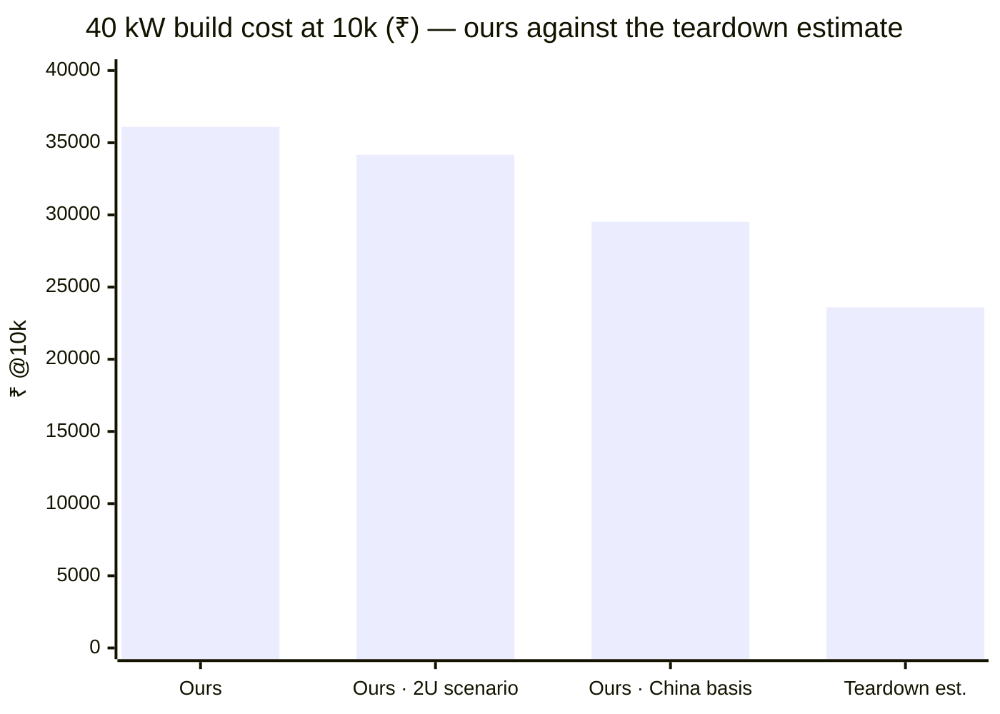

# 🩻 InfyPower Teardown Benchmark

Block-by-block audit of our architecture against the REG1K0135A2 40 kW SiC module teardown

  
  
  
  
  

> [!NOTE]
> **Purpose** — one end-to-end comparison of this platform against a proven commercial 40 kW SiC charging module, the
> **InfyPower REG1K0135A2**, opened by ChargerLAB
> ([teardown](https://www.chargerlab.com/teardown-of-infypower-40kw-ev-sic-power-module-reg1k0135a2)): what InfyPower
> built, what we copied from it, where we deliberately differ, and the cost gap that remains.
>
> **Evidence** — their side is a teardown reading, tagged **[T]** where the article states it, **[T?]** where the text
> cannot resolve it and nothing was guessed, and **[D]** for a REG-family datasheet class. Our side is engine output
> (`bom-gen`, `loss-budget`, `mtbf-budget`, `envelope-grid`, `current-coordination`) — reproducible to the digit, but
> pre-hardware.

## At a glance

| | |
|---|---|
| **Subject** | InfyPower **REG1K0135A2** 40 kW SiC module, opened by ChargerLAB |
| **What we cloned** | full-bridge LLC, the two output modes, the output blocking diode, the clip mount, the star-X2 EMI filter with no DM chokes, right-sized dies |
| **What we kept** | isolated sensing on every domain, DESAT + window comparators, one MCU, a full-bus SiC aux |
| **Efficiency** | ours **96.34 %** at 40 kW full power, peak 97.84 % — theirs "> 96 % comprehensive, > 97 % peak" [T] |
| **Cost** | ours **₹36,103** at the 10k India basis against an **estimated ₹23,600** for their BOM on the same price list — **≈ +53 %**, and the estimate itself is the largest unknown |
| **Next step** | buy one REG1K0135A2 and measure it — that replaces the estimate with data |

## 1. The two machines

| | InfyPower REG1K0135A2 | Vectivolt 40 kW module |
|---|---|---|
| AC input | 260–530 VAC 3-φ · 76 A max [T] | 3-φ 285–475 VAC; full power from 330 VAC, 86 % constant-current derate at 285 VAC |
| DC output | **150–1000 V · 0–133 A** [T] | **150–1000 V · 133 A** — identical window and current |
| Efficiency | > 96 % comprehensive · > 97 % peak [T] | full power at 400 VAC **96.34 %** (output diode and LLC turn-off included) · peak **97.84 %** |
| Semiconductors | "full SiC" [T] — in the PFC that is only the boost diodes | SiC throughout the PFC and the LLC |
| Brain | 2 × TMS320F28035, 60 MHz, one per stage [T] | 1 × GD32G553VET7, 216 MHz, both stages |
| Build | two stacked PCBAs — PFC + LLC, wired [T] | two-board sandwich — AC-DC + DC-DC, 40-way harness |
| Cooling | 3 fans (MGT8012VB-W38, IP55) [T] | 3 fans (IP55) — same count at the same power |
| Volume | 403 × 298 × 84.1 mm = 10.1 L → **3.96 kW/L** [T] | 3U card, ≈ 2.1–2.6 kW/L [est] — a 2U construction is a costed scenario, not the design basis |
| Mass | 15.5 kg → 2.58 kW/kg [T] | not computed — no mechanical design; likely heavier |
| Environment | −40…+75 °C, derate from 55 °C · 95 % RH · 2000 m [D] | −30…+75 °C, full power to 55 °C · 95 % RH · 2000 m |
| Protection build | potting + rear conformal coating, heatsink-integration patent [T] | acrylic conformal coating on both boards and the card; the sealed liquid 50 kW twin covers the IP-class role |
| Reliability claim | MTBF 500 kh [D], no stated basis | parts-count prediction **≈ 385 kh at 40 °C** — method-for-method comparison only at EVT |

## 2. Power architecture, side by side

```mermaid
flowchart LR
  subgraph INFY["InfyPower REG1K0135A2 — as opened"]
    direction TB
    IF["3 × fuse 100 A / 500 VAC<br/>MOV S20K425 / 460 + GDT"] --> IE["2 × CM choke<br/>9 × 4.7 µF X2 · film Y"]
    IE --> IP["AC soft-start<br/>75 Ω sets + 4 relays 40 A"]
    IP --> IV["3-level PFC<br/>600 V 22 mΩ Si superjunction<br/>+ 1200 V 40 A SiC diodes<br/>3 flat-copper chokes"]
    IV --> IL["DC link<br/>Jianghai CD296 475 V 680 µF"]
    IL --> ID["Full-bridge LLC<br/>4 × 1200 V 33 mΩ TO-247-4<br/>gate transformers · litz Lr<br/>7 × 3.3 µF 250 V tank"]
    ID --> IS["16 × 1200 V 40 A SiC diodes<br/>3 × 90 A relays — series / parallel"]
    IS --> IO["film + choke + 550 V electrolytics<br/>series diodes 1600 V 90 A<br/>discharge chopper 1500 V FET"]
  end
  subgraph VV["Vectivolt 40 kW"]
    direction TB
    VF["3 × gG fuse 125 A / 690 V<br/>MOV S20K550 Δ + GDT 3.5 kV"] --> VE["CMC1 · X2★ 4.7 µF · CMC2<br/>2 × X2★ 4.7 µF · Y1 · Rd–Cd damper"]
    VE --> VP["AC precharge<br/>2 × 33 Ω pulse + 2-pole bypass"]
    VP --> VV1["Vienna PFC 50 kHz<br/>one 750 V 15 mΩ SiC die per position<br/>1200 V 40 A JBS · 3 × D1 chokes"]
    VV1 --> VL["split link 2 × 6 × 470 µF 500 V<br/>window 650–830 V · OVP 860 V"]
    VL --> VD["full-bridge LLC · fr 140 kHz<br/>8 × 1200 V 23 mΩ (two per position)<br/>DESAT drivers · 9 × 33 nF tank<br/>2 D3 cells + D2 external Lr"]
    VD --> VS["16 × 1200 V 40 A JBS · film-only banks<br/>KSER · KPARA / KPARB at 0 A"]
    VS --> VO["DOUT 1600 V 200 A<br/>640 Ω active discharge · 1200 V SiC<br/>3 × 150 kΩ output bleeder"]
  end
```

Structurally the same machine. The divergences are deliberate and listed in §4.

## 3. What we cloned, block by block

| Block | InfyPower REG1K0135A2 [T] | Ours |
|---|---|---|
| DC-DC topology | single full-bridge LLC, external litz Lr | **copied** — one full-bridge LLC, D2 external Lr, two D3 cells in series (the 66 mm tunnel forbids one tall stack) |
| Output range | relay series / parallel banks | **copied** — LOW ≤ 500 V parallel / HIGH ≥ 500 V series, latched in standby, relays switched at zero current |
| Output protection | 1600 V series blocking diodes | **copied** — D_OUT 1600 V, 150 / 200 / 250 A class, so no output contactor is needed |
| Device mounting | clip-mounted discrete TO-247 | **copied** — clip on Al2O3; a single die per position wherever the fault-pulse rule allows |
| EMI filter | two CM chokes + 9 × 4.7 µF X2, no DM chokes | **copied** — 2 CMC + 12 × 4.7 µF X2 in three star stages; the damper stays, because without it the current loop is unstable with either filter |
| PFC switches | 600 V 22 mΩ silicon superjunction | **adapted** — 750 V SiC class: 650 V would sit at 86 % of rating at our 560 V worst switch stress, against a 75 % house rule |
| LLC switches | 4 × APS ACM035P120QNN 1200 V 33 mΩ, one die per position | **not copied** — one 23 mΩ die per position at 30 kW, two at 40 / 50 kW; a single 35 mΩ die fails our 55 °C HIGH-mode corner and a single 16 mΩ die at 40 kW fails the fault-pulse rule |
| Output banks | film (2 × 6 µF / 1000 V at the rectifiers) → filter inductor → 550 V electrolytics (220 µF and 47 µF classes), four series discharge resistors, 1500 V chopper | **film-only, on its own gates** — 12 × 2.2 µF 630 V per bank, no choke and no electrolytic to age; their construction is a registered ≈ +₹500 lever that would return the CV load-step overshoot to ≈ +2 % |
| LLC bridge entry film | 1000 V film, 6 µF parts, two per position group (≈ 12–24 µF) | **matched in the same decade** — 16 × 1 µF 1100 V plus a 2.2 µF / 0.33 Ω RC damper on a 50 W heatsink-clipped resistor |
| DC-link can class | Jianghai CD296 475 V / 680 µF, glued | **adapted** — 470 µF / 500 V, two series halves with a sensed midpoint; 500 V puts the worst continuous half at 87 % of rating, 475 V would be 92 %, 450 V 97 % |
| Gate drive and protection | gate-drive transformers + 1 A isolators + a discrete PMOS clamp; NSi6801 on the PFC; **no DESAT anywhere** | **kept ours** — NSI6611 with DESAT, active Miller clamp, UVLO and soft-off, on a reinforced +15 / −3 V bias. Their scheme is ≈ −₹470 at 40 kW and is approved but not executed |
| Control | two TMS320F28035 | **kept ours** — one GD32G553, cheaper by ≈ ₹170, with no inter-processor link to fail |
| Sensing | 3 mΩ shunts + AMC1200B + LMV393 comparators, muxed through a 74HC4051 | **kept ours** — line and resonant CTs plus an output shunt, 22 direct ADC channels, no mux (≈ ₹1.2k premium, a safety-architecture choice) |
| Aux | UCC28C45 flyback, 900 V Si MOSFET, opto feedback [T] | **kept ours** — 110 W full-bus flyback on a 1700 V SiC switch with primary-side regulation; a 900 V half-link aux saves ≈ ₹150–250 but needs a D4 redesign and loads the midpoint |
| Packaging | 2U potted heatsink chassis, 3 × 80 mm fans | **scenario only** — the design stays a 3U card; the 2U table in [BOM & cost](bom-cost.md) is flagged and unproven |

## 4. Where we differ, and why

Each row is theirs as opened, ours as drawn, and the reason the difference stands.

| Block | Theirs [T] | Ours | Why the difference stands |
|---|---|---|---|
| **Fusing and surge** | 3 × 100 A / 500 VAC fuses; MOV S20K425 + S20K460K1 with a GDT | 3 × gG 125 A / **690 VAC** 22×58 (the 0.72× derate rule puts 90 A of capacity against a 73.3 A worst line current) · MOV **S20K550 in Δ** + GDT 3.5 kV / 20 kA to PE | ours is the stricter selection on both axes. 100 A at 76 A max is 76 % continuous, outside our derate rule, and a 500 VAC fuse under a 530 VAC input reads under-voltage-rated **[T?]**; their 460 V MOV cannot sit line-to-line at 530 VAC, so their clamp must be phase-referenced. The `fault-energy` gate proves every winding and busbar outlives our fuse by ≥ 10 × I²t |
| **EMI filter** | two CM chokes, 9 × 4.7 µF X2, film Y caps, **no DM chokes** | the same two-stage CM spine with three star-X2 stages (12 × 4.7 µF), Y1 trios and the Rd–Cd damper; no DM chokes | same architecture, and their build was the evidence that the DM section could go. What we keep that they do not is the damper — without it the current loop is unstable with either filter — and computed margins: DM +30.6 dB, CM +3.1 dB at the 100 pF leg-node requirement, which T-13 measures |
| **Precharge** | AC-side 75 Ω / 5 W sets (3 in series) shorted by four 40 A / 250 V relays, plus two 15 Ω TO-220; system soft start 3–8 s [D] | 33 Ω pulse-rated in **two lines** + a 2-pole 80 A bypass; t₉₅ ≈ 231 ms; the bypass closes on a **settled** link, never on a computed crest; relay mirror-contact readback before power | equivalent function, harder parts. A one-line resistor is a three-wire fallacy, and their 40 A / 250 V bypass contacts on a 76 A / 530 V line work only because bypassed resistors carry no steady current; ours are rated for the line. Their 3–8 s is the whole boot, comparable to our aux cold start plus 0.23 s of precharge |
| **PFC stage** | 3-level boost: **600 V 22 mΩ Si superjunction** + 1200 V 40 A SiC boost diodes + 3 flat-copper chokes | Vienna, 50 kHz, one **750 V 15 mΩ-class SiC** die per position, 1200 V 40 A JBS to the rails, RC + RCD clamp per node, catalog-core D1 chokes with biased-inductance floors | the voltage classes agree exactly — switch at half-bus, diode at full bus — which is independent commercial confirmation of the stress analysis. Theirs is the cost play and ours the efficiency and thermal-headroom play: a 22 mΩ silicon device (≈ 33 mΩ hot) lands 36–72 W per phase against our ≈ 16 W **[C]**. Their switch class is the single largest philosophy-neutral lever we have not taken (§6) |
| **DC link** | Jianghai CD296 475 V / 680 µF, glued; count and arrangement not stated **[T?]** | 2 × 6 × 470 µF / 500 V with balance strings and a **sensed midpoint**, window 650–830 V, hardware OVP 860 V; ≈ 1410 µF net ≈ 486 J ≈ **12 J/kW** [C]; the can is bought against its real 50 kHz duty (≥ 5.2 A rms at 100 kHz, ESR ≤ 80 mΩ) | identical architecture — series electrolytic halves in the 450–500 V class. Their can count is unreadable, so no J/kW comparison would be honest. One structural point: a Vienna needs a controlled midpoint; ours is sensed and balanced by the control loop with fault rows on imbalance, and theirs must do the same |
| **DC-DC stage** | single full-bridge LLC, 4 × 1200 V 33 mΩ, one litz transformer set, one external litz Lr, **7 × 3.3 µF / 250 V** resonant bank (≈ 23 µF) | single full-bridge LLC at fr 140 kHz, Ln 10, n 2: 8 × 1200 V 23 mΩ (two per position), 9 × 33 nF / 1200 V, D2 external Lr 3.99 µH of a 4.35 µH total, two D3 cells with primaries in series | the same topology since the clone. Their tank is **low-Z₀, low-f_r, low-Q** — 250 V caps mean a resonant voltage swing of tens of volts and an f_r far below 140 kHz — which is a structurally different operating point, not a different component choice. Moving to it is a magnetics and control redesign; it is registered as a lever (§6), and the reason it is attractive is that a lower Z₀ changes the weak leg's commutation energy budget |
| **Secondary and output modes** | 16 × 1200 V / 40 A SiC diodes on one heatsink; **three 90 A relays** reconfigure the output; 150–1000 V with a constant-power knee ≈ 300 V [T+D] | 16 × 1200 V / 40 A JBS, two per bridge position, one bridge per bank; KSER + KPARA / KPARB 120 A switched **only at zero current** behind the output diode, with a two-stage 74HC02 hardware exclusion; identical range and knee | same diode budget and the same concept. The differences are the relay class (ours carries the line at 80 % of rating against their 89 %) and the exclusion logic: a hardware gate that cannot be talked into paralleling banks across a voltage difference |
| **Output protection and discharge** | series blocking diodes 1600 V / 90 A; **active** discharge — a 1500 V FET chopping 4 × 75 Ω | D_OUT 1600 V / 200 A class; active **link** discharge through 640 Ω on a 1200 V SiC switch, default-OFF (830 → 60 V in 2.4 s with AC present), plus one passive 47 kΩ balance string per half and a 3 × 150 kΩ output bleeder | the blocking diode is now the same idea on both sides and costs both of us 0.15 % (750 V) to 0.44 % (300 V full current) of efficiency, permanently [C]. What differs is the discharge: theirs empties the studs faster, ours has no electrolytic at the output to age and the link path is the one that actually stores the energy |
| **Protection philosophy** | two visible layers — shunt + iso-amp + comparator / DSP over-current, and the fuse; datasheet lists SCP self-rollback [D]. **No per-device DESAT** | three layers with numbers: **DESAT** blank-to-off **1.34 µs** (LLC) / **2.21 µs** (Vienna) against 2 / 4.2 µs withstand classes · **comparator trips** F.01 155 A pk and F.11 180 A pk at 40 kW, each ≥ 1.2 × the simulated worst peak and observable through its kill race · the supervisory **F.xx ladder** with per-SKU windows, plus mirror-contact relays and a fault-energy audit | this is where the two philosophies genuinely differ. Theirs is defensible at their price point; ours is the answer to a standing directive about unattended duty at 55 °C. A teardown cannot show their trip latencies, so the honest statement is that ours is proven coordinated on paper and in simulation, theirs is unknown but field-proven commercially |
| **Sensing** | 3 mΩ shunts + AMC1200B, muxed into the DSP ADCs; heatsink thermistors | line CTs (2500:1, burden 22 / 18 / 13 Ω) and a resonant CT (1:100, 0.47 / 0.36 / 0.30 Ω) — zero conduction loss, inherently isolated, bandwidth to feed the on-chip comparators — plus an output manganin shunt with an isolated amplifier; 22 direct ADC channels | their shunt chain dissipates a few watts and puts the trip path through an iso-amp's bandwidth; our CTs put the fast trip on a passive magnetic path. The CT's weaknesses are real and owned: it has no DC response, which is why per-cycle mean removal exists, and its µs step response is an RFQ acceptance row with a drawn shunt fallback |
| **Control** | two 60 MHz DSPs, muxed analog, isolators between domains, CAN on NSi1050 | one 216 MHz Cortex-M33 with HRTIMER (LLC pairs with hardware dead-time, Vienna phases, 3 on-chip comparators + DACs), one firmware image, RATING-strap personality, 75 of 82 usable pins, isolated CAN on NSI1042 | their build proves dual-brain ships; ours removes the inter-processor failure class entirely (link CRC, boot ordering, split fault state) and halves the firmware surface. Their muxed-ADC pattern trades sampling latency for pins; we have the pins and keep every protection-relevant channel direct |
| **Auxiliary power** | UCC28C45 current-mode flyback, 900 V Si MOSFET, Schottky rails, 78L05 / AZ1117 post-regulators, opto feedback; input point not readable **[T?]** | one 110 W flyback from the **full 342–860 V link** on a 1700 V SiC switch (NCP1252D, D4 rev E on ETD44), brown-in 321 V, primary-side regulation | a half-link aux loads the Vienna midpoint asymmetrically and dies with the half it feeds; ours is balance-neutral and rides the whole documented brown-out window with no mains tap. We pay ≈ ₹150–250 more for that |
| **Thermal and packaging** | two stacked PCBAs in 84 mm; devices on integrated heatsinks under **potting**, conformal coat on the reverse; 3 × 80 mm IP55 fans; 10.1 L, 15.5 kg | two-board sandwich in 3U; TO-247 rows clamped to twin extrusions, tunnel airflow, 3 fans at 40 kW (**the same count**), 252 m³/h needed against 1.14 × installed with n−1 covered; acrylic coating; the sealed fanless liquid 50 kW twin covers the role potting serves for them | their density is the one place this module is clearly beaten, and the enablers are potting integration, the 84 mm height and single-transformer magnetics — not better silicon. Potting is declined deliberately: it makes every field failure a module swap, blocks rework, adds ≈ 2 kg and complicates the magnetics thermal story. The recovery path is the layout phase |
| **Communication and paralleling** | isolated CAN, address by front DIP / display, up to 48 modules in parallel, current-share imbalance ≤ ±5 % [D] — a droop-plus-blocking-diode rack | isolated CAN 2.0B with a 29-bit ID scheme and a fuzzed codec; paralleled modules run **commanded equal share** from the charger controller's `GROUP_SET` at 10 Hz, 300 ms staggered joins, hot rejoin, with per-module protection | different paralleling philosophies, both internally consistent. Theirs leans on the series diode for passive share; ours commands it. Since we now carry an output blocking diode too, a module can never back-feed a shared bus either way |
| **Techniques we decline** | potting with integrated heatsinks (patented) · gate-drive transformers · shunt trip paths · a dual-DSP partition · ADC muxing | — | serviceability and rework; incompatibility with a DESAT / Miller / soft-off stack; trip-path bandwidth through an iso-amp; the inter-processor failure class; pin budget that does not need a mux |

### The tank, measured the same way (40 kW, same power-solved ngspice method)

| Corner | A tank read from the teardown (fr 99.8 kHz, Ln 8) Ip rms | Ours (fr 140 kHz, Ln 10) Ip rms |
|---|---:|---:|
| PAR 500 V, gain-worst tolerance | 66.5 A | 60.4 A |
| SER 250 V, rated power | 92.1 A | 90.5 A |
| PAR 400 V, rated point | 63.9 A | 59.6 A |

The teardown-reading tank carries 2–10 % more primary current than ours at the same corners, so the case for it is not
conduction — it is the commutation-energy budget of the weak leg in phase shift, which is the one place our bridge hard
switches (ZVS holds on both legs at every PFM corner above; at the three phase-shift corners leg A retains 231 / 257 /
389 V when it turns on, and the thermal fold carries them).

## 5. The cost gap

Our column is generated by `bom-gen`. Their column is the teardown parts list priced on our own 10k India price list
(± 20 %): an estimate of what **their** BOM would cost **us**, not their real cost.

| | 40 kW at 10k, India basis |
|---|---:|
| Vectivolt module | **₹36,103** |
| … in the costed 2U construction scenario | ₹34,167 |
| … at the China RFQ target factors | ₹29,520 |
| InfyPower BOM, estimated on the same price list | ≈ ₹23,600 |
| **Gap** | **≈ ₹12,500 (+53 %)** |

Where our money goes, by schematic section — the generated split from [bom-40kw](bom-40kw.md), against the block that
carries the gap:

| Section | Ours ₹ @10k | What theirs does instead |
|---|---:|---|
| Mechanics, thermal and assembly | 9,393 | a potted 2U chassis at 10.1 L, 4-layer boards at about half the area — a mechanical design, not a schematic change |
| Vienna PFC stage | 5,522 | 600 V silicon superjunction switches behind the same SiC boost diodes |
| Resonant tank, transformer and rectifiers | 5,335 | one transformer instead of two cells (it needs the 2U height) and a low-Z₀ tank |
| Full-bridge LLC legs | 4,348 | one 33 mΩ die per position on gate transformers, with no DESAT |
| AC input, surge and EMI filter | 4,080 | 9 × X2 instead of 12, 100 A / 500 VAC fuses, no damper |
| Output banks, S/P relays and output diode | 2,149 | 90 A relays, and a choke plus 550 V electrolytics instead of film |
| Split DC link and discharge | 2,134 | 475 V cans, a 1500 V chopper across four resistors |
| AC, bus, output and bank sensing | 1,921 | shunts + AMC1200B through a 74HC4051 mux (≈ ₹740) |
| Auxiliary supply and fans | 604 | a 900 V silicon flyback from a half-link node |
| Control card and both control interfaces | 454 | two DSPs (≈ ₹690) — **ours is cheaper here** |
| CAN and HMI | 163 | isolated CAN and a front DIP / display |
| **Module** | **36,103** | ≈ 23,600 estimated |

> [!IMPORTANT]
> **The honest verdict.** The architecture is InfyPower's, but on the India price list the module is still ≈ 53 % above
> the teardown estimate — ≈ 45 % with the unproven 2U construction. The China RFQ-target column puts the module at
> ₹29,520, but that compares a landed China target with an estimate priced in India, so it is not a like-for-like gap.
> A 2–5 % gap is not reachable by any change the gates can prove today, and the largest single unknown is whether the
> estimate itself is right: **buy one REG1K0135A2 and measure it** (thermals at SER 500 V, device temperatures, gate
> waveforms, BOM by weight and marking), then re-run this table on data.
>
> The remaining overshoot is not waste waiting to be found. Most of it is the philosophy premium priced in §4 —
> isolated sensing on every domain, DESAT gate drive, a mirror-contact relay matrix, a computed EMI filter — which is
> protection and efficiency that was chosen, and the rest is packaging. The platform overhead (card, drive stack,
> relay matrix, filter, CTs) is the same rupee amount at every power, so it weighs most on the smallest module; that
> is structural, it is why cost per kW falls from 30 to 50 kW, and it is the same reason this vendor's own sweet spot
> is 40 kW.

## 6. Levers not executed

Each needs an owner decision or bench data. None is applied to the drawn design.

| Lever | ₹ at 40 kW | What it needs first |
|---|---:|---|
| Buy and measure one REG1K0135A2 | — | nothing — it turns the estimate into data |
| China sourcing at the RFQ-target factors | ≈ −6,300 | quotes; duty per HSN code confirmed by a customs broker |
| Low-Z₀ tank, back to one die per position on 40 / 50 kW | ≈ −1,500…−3,000 | a magnetics and control redesign; it changes the weak leg's commutation budget, so it re-opens the double-pulse family and the thermal grid |
| 2U construction (potted heatsink chassis, 4-layer PCBs, 80 mm fans) | ≈ −1,900 | a flat-core D1 (a 3-core D1 fails F.01 at 40 kW) and a mechanical design that holds a 70 °C base at 55 °C inlet |
| Sendust cores for D1 from a second supplier class | ≈ −1,000…−1,400 | requalified samples against the biased-inductance floors |
| Si superjunction Vienna switches (their practice) | ≈ −600…−1,000 | its own double-pulse and thermal run; the boost diodes stay SiC so the switch sees no recovery, and 50 kHz suits SJ parts |
| Drive clone — gate transformers on the LLC, opto PFC drivers on aux-winding bias, shunt comparator | ≈ −470 | a protection-philosophy change: a GDT design, a D4 re-wind and new trip evidence |
| Active link discharge as a variant instead of standard | ≈ −350…−400 | a product decision on who owns the discharge time |
| 900 V silicon aux from a lower node | ≈ −150…−250 | a D4 redesign and midpoint duty |
| Drop DESAT on the three Vienna channels | ≈ −150 | defensible — a Vienna leg has no shoot-through path — but it costs driver commonality; decide before layout |
| 90 A relays and 500 VAC fuses | < −200 | relay carry at 89 % of rating, against our 80 % rule |
| PV driver instead of TLP152 + isolated bias on the discharge FET | ≈ −50 | a gate-margin check hot and humid |
| TPS3430 as DNP | ≈ −35…−40 | EVT proving the internal watchdog with the token purse |

Two more of their practices are **priced but not taken** as design changes: 550 V single-can output banks behind a
filter choke (≈ +₹500, and it would return the CV load-step overshoot to ≈ +2 %), and 475 V link cans as the middle
step of the can-voltage ladder. Synchronous rectification is the only large efficiency lever left — the secondary JBS
drop is the biggest single loss line — and it is declined for the cost SKUs and kept as a tender-driven premium
variant; the revisit trigger is 1200 V ≤ 40 mΩ SiC under ≈ ₹200 @10k.

## 7. Where the evidence ends

> [!WARNING]
> A teardown shows copper and silicon, not firmware: their control loops, trip latencies, coordination, derating
> curves and EMC margins are invisible, and their "> 96 % comprehensive" efficiency is a load-weighted marketing
> figure, not a measured full-load point. Symmetrically, our numbers here are engine output and simulation —
> reproducible to the digit, but pre-hardware. The comparison is therefore architecture-against-architecture and
> spec-against-computation; EVT (T-00…T-64) is where our side of these tables becomes measured. Counts marked
> **[T?]** could not be resolved from the article text and were not guessed.

> [!TIP]
> **How this page is checked** — our side of every table is engine output (`bom-gen`, `loss-budget`, `mtbf-budget`, `current-coordination`, `envelope-grid`); their side is a teardown reading, labelled [T] where the article states it. The gap closes with a measurement, not a gate — buy one and measure it.

---

<a href="dfm-production.md">← DFM & Production Flow</a> &nbsp;·&nbsp; <a href="README.md">🧭 Documentation hub</a>

Vectivolt DC-Modules · documentation rev E83 · every number reproduces with <code>sh calculations/run-all.sh</code>

