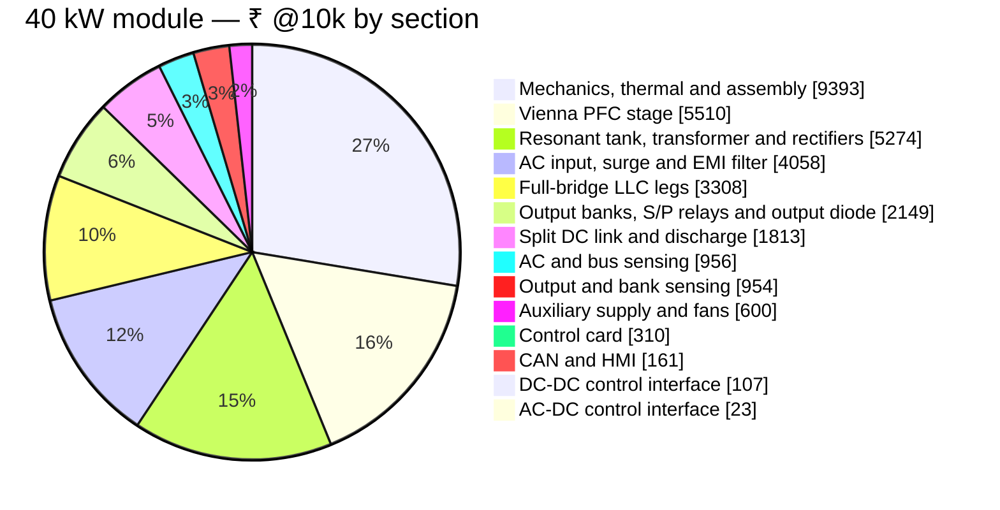

# 🧾 40 kW Module BOM

Every line of the 40 kW module — cost by schematic section, SKU-specific parts and sourcing status

  
  
  
  

> [!NOTE]
> **Purpose** — the complete bill of materials of the **40 kW module**: what it costs, where the money goes by schematic
> section, the parts that make this SKU different, and every line item with its sourcing status. **Generated by
> `calculations/cost/bom-gen.mjs` on every battery run — do not hand-edit.** Machine-readable lines: `calculations/out/bom-40kw.csv`.

## At a glance

| | |
|---|---|
| **Build cost @10k** (India basis) | **₹34,616** · ₹865 / kW |
| **China RFQ target @10k** (E69f) | **₹28,319** · ₹708 / kW — landed targets, not quotes |
| **2U construction scenario** (E69e) | ₹32,680 · China target ₹26,735 — flagged estimate, not the design basis |
| **1k · 5k · 100 pcs** | ₹42,616 · ₹38,042 · ₹55,372 |
| **Red-line / stretch** | ₹33,000 / ₹29,000 → ⚠️ over by ₹1,616 |
| **BOM lines · placed parts** | 149 lines · 639 parts (AC-DC 320 · DC-DC 270 · control card 49) |
| **Built to our drawings** | 9 custom lines — specifications on the [40 kW magnetics page](magnetics-40kw.md) |
| **Open sourcing decisions** | 7 REVIEW lines |

## Where the money goes

| Section (schematic sheet) | Parts | Lines | ₹ @10k | Share | China target ₹ |
|---|---:|---:|---:|---:|---:|
| AC input, surge and EMI filter | 47 | 16 | 4,058 | 11.7 % | 3,319 |
| Vienna PFC stage | 75 | 26 | 5,510 | 15.9 % | 4,344 |
| Split DC link and discharge | 35 | 12 | 1,813 | 5.2 % | 1,469 |
| AC and bus sensing | 99 | 22 | 956 | 2.8 % | 805 |
| AC-DC control interface | 14 | 7 | 23 | 0.1 % | 19 |
| Auxiliary supply and fans | 50 | 32 | 600 | 1.7 % | 474 |
| Full-bridge LLC legs | 75 | 15 | 3,308 | 9.6 % | 2,556 |
| Resonant tank, transformer and rectifiers | 42 | 14 | 5,274 | 15.2 % | 4,258 |
| Output banks, S/P relays and output diode | 47 | 11 | 2,149 | 6.2 % | 1,763 |
| Output and bank sensing | 61 | 14 | 954 | 2.8 % | 810 |
| DC-DC control interface | 12 | 7 | 107 | 0.3 % | 90 |
| CAN and HMI | 33 | 18 | 161 | 0.5 % | 138 |
| Control card | 49 | 23 | 310 | 0.9 % | 269 |
| Mechanics, thermal and assembly | — | 12 | 9,393 | 27.1 % | 8,004 |
| **Module** | | | **34,616** | 100 % | **28,319** |

> [!TIP]
> Sections follow the release sheets, so a line here is found on the sheet of the same name. The small difference against the
> headline figure is the gate-bias transformer set, which is priced at 1k only.

## Top cost drivers

| # | Part | What it is | Qty | ₹ / unit @10k | ₹ @10k | China target ₹ | Status |
|---:|---|---|---:|---:|---:|---:|---|
| 1 | `IND-PFC-116u-40` | PFC choke 116 µH class, 5× OD79 26µ sendust (Magnetics 0077908A7 / Chang Sung KS eq, … | 3 | 992 | **2,976** | 2,381 | CUSTOM |
| 2 | `SG2M023120LJ` | SiC MOSFET 1200 V 23 mΩ TO-247-4L — RFQ ACCEPTANCE IDM ≥ 265 A @25 °C (E69a-2: the 30 kW … | 8 | 312 | **2,496** | 1,872 | SECOND-SOURCE |
| 3 | `XFMR-LLC-CELL-3E70-40` | D3-40 rev D (E67): full-bridge LLC transformer CELL (2 per module, primaries in SERIES → n … | 2 | 1,147 | **2,294** | 1,950 | CUSTOM |
| 4 | `CMC-3PH-2mH-SKU` | 3-phase CM choke 2 mH nanocrystalline, line-current-rated winding per SKU (HR-18/D7). E65 … | 2 | 1,062 | **2,123** | 1,699 | CUSTOM |
| 5 | `GC4D20120D` | SiC JBS 1200 V 40 A TO-247-2 (exact p/n at RFQ) | 22 | 96 | **2,112** | 1,584 | ORDERABLE |
| 6 | `ELH-470u450` | 470 µF 450 V snap-in 105 °C, −40 °C category (A11 rev C cold floor −30 °C) (split bus: 415 … | 12 | 120 | **1,440** | 1,152 | CLASS |
| 7 | `SIC-750V-15mR` | SiC MOSFET 750 V 15 mΩ class TO-247-4 (Vienna common-source pair, one die per position) | 6 | 192 | **1,152** | 864 | CLASS |
| 8 | `PP-2u2-630` | 2.2 µF 630 V PP film, ripple-rated (E67 rectifier-side bank film: ≤ 10 A rms per part of … | 24 | 36 | **864** | 691 | CLASS |
| 9 | `IND-LR-E70-40` | D2-40 rev F (E67): EXTERNAL resonant inductor 4.07 µH ±3% on 2× E70/33/32 PC95-class (TDK … | 1 | 862 | **862** | 689 | CUSTOM |
| 10 | `RELAY-PCB-120A-24V` | PCB power relay 120 A, 24 V coil, no mirror contact (E67 S/P matrix, switched at ZERO … | 3 | 176 | **528** | 449 | DIRECT |
| 11 | `FUSE-gG-690V-125A` | gG fuse 690 VAC, 22×58 frame (rating per SKU — audit F6: 80 A @30 kW; the 63 A part ran … | 3 | 168 | **504** | 428 | CLASS |
| 12 | `PP-33n-1200V` | 33 nF 1200 V PP resonant-duty film (E67 full-bridge tank: 7/9/11 in parallel at 30/40/50 … | 9 | 54 | **490** | 392 | CLASS |
| 13 | `HF167F/024-HATF(764)` | power relay ≥80 A/line w/ mirror contact (precharge bypass carries full line current — … | 2 | 240 | **480** | 408 | DIRECT |
| 14 | `NSI6611` | iso gate driver 10 A, DESAT/Miller(CLAMP wired, CB-12)/UVLO, SOIC-16 | 7 | 68 | **476** | 405 | ORDERABLE |
| 15 | `AMC1311DWVR` | iso voltage-sense amp 0–2 V input (bus/bank/output senses, E25/CB-3; R4 note: on the 1311 … | 5 | 92 | **460** | 391 | ORDERABLE |

## What is specific to this SKU

These lines replace the shared-cell default on the 40 kW module (`skuOverrides` in `parts-db.mjs`); everything else is the common design.

| Part | Where | ₹ / unit @10k | Why this part |
|---|---|---:|---|
| `SIC-750V-15mR` | QA0A · QA0B · QB0A · QB0B · QC0A · QC0B | 192 | E69a: 750 V 15 mΩ class single die per position (grid Tj 127 °C) — RFQ target; ACCEPTANCE IDM ≥ 260 A @25 °C (205 A F.01 fault peak) |
| `FUSE-gG-690V-125A` | F1 · F2 · F3 | 168 | gG fuse 690 VAC, 22×58 frame (rating per SKU — audit F6: 80 A @30 kW; the 63 A part ran 88% loaded at 55.9 A worst and NEGATIVE against the ~0.72× enclosed/+55 … |
| `HF167F-100A-M` | KPRE1 · KPRE2 | 240 | power relay ≥80 A/line w/ mirror contact (precharge bypass carries full line current — CB-8; SKU class via override; MR-25: contact-gap withstand & insulation … |
| `CMC-3PH-2mH-SKU` | CMC1 · CMC2 | 1,062 | 3-phase CM choke 2 mH nanocrystalline, line-current-rated winding per SKU (HR-18/D7). E65 rev B (dm-choke-design D7 engine): acceptance L_cm ≥ 2 mH @10 kHz AND … |
| `SHUNT-50MV-133A` | RSHO | 112 | manganin shunt, 50 mV @ 100 A (0.5 mΩ, Kelvin 4-terminal; R5-G: rated current now in the order code — per-SKU via skuOverride) |
| `DIODE-1600V-200A-MOD` | DOUT | 416 | E67: 133 A out → 200 A class insulated module (150 A would run 89 %) |
| `XFMR-LLC-CELL-3E70-40` | T1A · T1B | 1,147 | D3-40 rev D (E67): full-bridge LLC transformer CELL (2 per module, primaries in SERIES → n = 2 overall) — 3× E70/33/32 PC95-class on a 3-set former (lN 293 mm, … |
| `IND-LR-E70-40` | L1R | 862 | D2-40 rev F (E67): EXTERNAL resonant inductor 4.07 µH ±3% on 2× E70/33/32 PC95-class (TDK former B66372B2000), N=5, litz 10000×0.05 mm (19.6 mm²) compacted … |
| `CT-RES-1:100-150A` | CT1 | 72 | resonant CT 1:100, 150 A rms class, 20–250 kHz, pass-through — the tank conductor is the primary (E67: ONE CT on the full-bridge tank; 40 kW tank class 100 A … |
| `R2512-0R36-1W-1%` | R1CT | 3 | E67: F.11 180 A pk = 0.65 V above AVMID; observable to 450 A vs the 417 A +3 µs monitor peak; 1.0 A rms → 0.36 W |
| `IND-PFC-116u-40` | LA0 · LB0 · LC0 | 992 | PFC choke 116 µH class, 5× OD79 26µ sendust (Magnetics 0077908A7 / Chang Sung KS eq, catalog AL 37 nH/T² ±8%), N=26, 13× 1.6 mm enamelled bundle … |
| `CT-LINE-2500-150A` | CTA0 · CTB0 · CTC0 | 76 | line CT 2500:1, 150 A class (Talema ACX-1150 catalog), 4 kV hipot, PCB pins — E60: F.01 155 A pk on 18 Ω plus the 50 A race needs linearity to ≥ 205 A |
| `R1206-18R-1%` | RA0B · RB0B · RC0B | 1 | 22 Ω line-CT burden 1% (E60: F.01 120 A pk = 2.71 V; observable to 184 A through the D1 soft-sat 3 µs race; 55 A rms → 0.48 V rms metering. History: R3 27 Ω saw … |

## Line items by section

<b>AC input, surge and EMI filter</b> — ₹4,058 @10k · 47 parts · 16 lines

| Part | What it is | Refs | Qty | ₹ / unit @10k | ₹ @10k | LCSC | Status |
|---|---|---|---:|---:|---:|---|---|
| `CMC-3PH-2mH-SKU` | 3-phase CM choke 2 mH nanocrystalline, line-current-rated winding per SKU (HR-18/D7). E65 rev B … | CMC1 CMC2 | 2 | 1,062 | 2,123 | — | CUSTOM |
| `FUSE-gG-690V-125A` | gG fuse 690 VAC, 22×58 frame (rating per SKU — audit F6: 80 A @30 kW; the 63 A part ran 88% loaded at 55.9 A … | F1 F2 F3 | 3 | 168 | 504 | — | CLASS |
| `HF167F/024-HATF(764)` | power relay ≥80 A/line w/ mirror contact (precharge bypass carries full line current — CB-8; SKU class via … | KPRE1 KPRE2 | 2 | 240 | 480 | — | DIRECT |
| `X2-4u7-305` | X2 4.7 µF 305 VAC MKP safety film, 27.5 mm pitch (E68 InfyPower filter: twelve caps in three STAR stages — … | CX01 CX02 CX03 CX11 CX12 CX13 CX21 CX22 … | 12 | 34 | 403 | — | CLASS |
| `X1-2u2-530` | X1 2.2 µF 530 VAC (delta across 475 VAC line-line — CB-1; inter-CMC stage CX1x · E65 CX2-node series-RC … | CDMP1 CDMP2 CDMP3 | 3 | 50 | 149 | — | CLASS |
| `B72220S0551K101` | MOV 550 VAC 20 mm (Δ line-line + series w/ GDT to PE) | MOV1 MOV2 MOV3 MOVP1 MOVP2 MOVP3 | 6 | 18 | 106 | — | CLASS |
| `STUD-M8` | M8 stud terminal | JACL1 JACL2 JACL3 JPE | 4 | 22 | 90 | — | CLASS |
| `VY1472M63Y5UQ63V0` | Y1 4.7 nF 440 VAC (L-PE on AC1..3 and — E65 second CM stage — on AC1M..3M / output-PE / DGND-PE — MR-4; DC use … | CY1 CY2 CY3 CY4 CY5 CY6 | 6 | 13 | 77 | C499492 | ORDERABLE |
| `CER-25W-33R-AX` | 33 Ω 25 W ceramic pulse resistor, axial (AC precharge; R5-G: the ohms now live in the ORDER CODE — a … | RPRE1 RPRE2 | 2 | 22 | 45 | — | CLASS |
| `GDT-3k5-20kA` | gas discharge tube 3.5 kV (L-PE surge path, HR-7) | GDT1 GDT2 GDT3 | 3 | 14 | 43 | — | CLASS |
| `SQP-10R-25W` | 10 Ω 25 W wirewound pulse, axial, series L ≤ 10 µH (E65 CX2-node series-RC damper RDMPx) | RDMP1 RDMP2 RDMP3 | 3 | 13 | 38 | — | CLASS |
| `RC0603FR-0710KL` | small-signal resistor 0402–0805 (pulls/filters/feedback) | RKFBP | 1 | 0 | 0 | — | CLASS |

<b>Vienna PFC stage</b> — ₹5,510 @10k · 75 parts · 26 lines

| Part | What it is | Refs | Qty | ₹ / unit @10k | ₹ @10k | LCSC | Status |
|---|---|---|---:|---:|---:|---|---|
| `IND-PFC-116u-40` | PFC choke 116 µH class, 5× OD79 26µ sendust (Magnetics 0077908A7 / Chang Sung KS eq, catalog AL 37 nH/T² ±8%), … | LA0 LB0 LC0 | 3 | 992 | 2,976 | — | CUSTOM |
| `SIC-750V-15mR` | SiC MOSFET 750 V 15 mΩ class TO-247-4 (Vienna common-source pair, one die per position) | QA0A QA0B QB0A QB0B QC0A QC0B | 6 | 192 | 1,152 | — | CLASS |
| `GC4D20120D` | SiC JBS 1200 V 40 A TO-247-2 (exact p/n at RFQ) | DA0T DA0B DB0T DB0B DC0T DC0B | 6 | 96 | 576 | C7435099 | ORDERABLE |
| `NSI6611` | iso gate driver 10 A, DESAT/Miller(CLAMP wired, CB-12)/UVLO, SOIC-16 | UA0G UB0G UC0G | 3 | 68 | 204 | C7470934 | ORDERABLE |
| `QA01C-18` | iso gate-bias module +18/−4-configured (E23 rev B: modules PERMANENT — at 10k modules/yr (~90k+ pcs … | PSA0G PSB0G PSC0G | 3 | 55 | 165 | — | REVIEW |
| `PP-1u-600` | 1 µF 600 V film (Vienna per-phase commutation, CB-9) | CA0FP CA0FN CB0FP CB0FN CC0FP CC0FN | 6 | 26 | 154 | — | CLASS |
| `GC4D10120H` | SiC JBS 1200 V 10 A TO-247-2 (RCD clamp) | DA0C DB0C DC0C | 3 | 44 | 132 | C7435087 | ORDERABLE |
| `WW-470R-10W` | 470 Ω 10 W wirewound axial (Vienna clamp bleeder — HR-3/MR-19: 4.3 W worst-case at 43% of rating) | RA0C RB0C RC0C | 3 | 18 | 53 | — | CLASS |
| `FILM-100n-250` | 100 nF 250 V film (Vienna RCD clamp) | CA0C CB0C CC0C | 3 | 14 | 43 | — | CLASS |
| `CC1812JKNPODBN101` | 100 pF 1 kV C0G 1812 (Vienna snubber, E28 re-size: CV²f = 0.86 W) | CA0SN CB0SN CC0SN | 3 | 6 | 17 | C577319 | ORDERABLE |
| `CRM2512-FX-10R0ELF` | 10 Ω 2512 2 W (Vienna snubber — E28: 0.86 W actual) | RA0SN RB0SN RC0SN | 3 | 5 | 14 | C840605 | ORDERABLE |
| `RC1206FR-7W4R7L` | gate resistor 1206, 0.5 W-rated (4.7/2.2 Ω per E5/E6 — MR-16: LLC R_on dissipates ~0.2 W at 140 kHz; standard … | RA0GON RA0GOFF RB0GON RB0GOFF RC0GON RC0GOFF | 6 | 2 | 10 | C859161 | ORDERABLE |
| `US1M` | 1 kV 1 A fast diode SMA (DESAT chain) | DA0GS1 DA0GS2 DB0GS1 DB0GS2 DC0GS1 DC0GS2 | 6 | 1 | 6 | C412437 | ORDERABLE |
| `CL05A105KO5NNNC` | 1 µF 0805 (driver bias) | CA0GB1 CA0GB2 CB0GB1 CB0GB2 CC0GB1 CC0GB2 | 6 | 1 | 4 | — | CLASS |
| `CC0603KRX7R9BB104` | filter/decoupling MLCC 0402–0805 | CA0GBV CB0GBV CC0GBV | 3 | 0 | 1 | C14663 | ORDERABLE |
| `RC0805FR-0710KL` | 10 kΩ gate-source | RA0GGS RB0GGS RC0GGS | 3 | 0 | 1 | C84376 | ORDERABLE |
| `RC0603FR-0710KL` | small-signal resistor 0402–0805 (pulls/filters/feedback) | RA0GPD RB0GPD RC0GPD | 3 | 0 | 1 | — | CLASS |
| `CC0603JRNPO9BN470` | 47 pF 0603 C0G (DESAT blank, Vienna hard turn-on — E60: NSI66x1A worst response 2.21 µs vs the 4.2 µs SCWT … | CA0GBL CB0GBL CC0GBL | 3 | 0 | 1 | — | CLASS |
| `RC0603FR-07100RL` | small-signal resistor 0402–0805 (pulls/filters/feedback) | RA0GDS RB0GDS RC0GDS | 3 | 0 | 1 | — | CLASS |

<b>Split DC link and discharge</b> — ₹1,813 @10k · 35 parts · 12 lines

| Part | What it is | Refs | Qty | ₹ / unit @10k | ₹ @10k | LCSC | Status |
|---|---|---|---:|---:|---:|---|---|
| `ELH-470u450` | 470 µF 450 V snap-in 105 °C, −40 °C category (A11 rev C cold floor −30 °C) (split bus: 415 V max per half) | CDT00 CDT01 CDT02 CDT03 CDT04 CDB00 CDB01 CDB02 … | 12 | 120 | 1,440 | — | CLASS |
| `IMW120R350M1H` | SiC FET 1200 V 5 A (bus discharge QDISF / bank bleeders QDISA-B, HR-15; R7-B/R8 gate spec for the PV-driven … | QDISF | 1 | 96 | 96 | C536285 | ORDERABLE |
| `CER-25W-160R-AX` | 160 Ω 25 W ceramic pulse resistor, axial (bus discharge string 4× in series; R5-G value-carrying order code; … | RDIS0 RDIS1 RDIS2 RDIS3 | 4 | 22 | 90 | — | CLASS |
| `STUD-M8` | M8 stud terminal | JDCP JDCN JPEB | 3 | 22 | 67 | — | CLASS |
| `QA01C` | iso 15→18 V module ≥6 kVDC (bus-discharge driver bias, CB-11; insulation cert class §K) | PSQD | 1 | 60 | 60 | C2757491 | REVIEW |
| `TLP152` | opto gate driver (isolated bus-discharge control, default-OFF — CB-11) | UQD | 1 | 34 | 34 | C17255258 | ORDERABLE |
| `PS122WF4702T4E` | 47 kOhm 2512 2 W anti-surge HV, Umax >= 250 V, 2-series per position (DC-link balance strings + … | RBALT0A RBALT0B RBALB0A RBALB0B RBALT1A RBALT1B RBALB1A RBALB1B | 8 | 3 | 21 | C2793932 | REVIEW |
| `TAB-M4` | discharge FET heatsink tab stud | QDIS | 1 | 5 | 5 | — | CLASS |
| `CC0603KRX7R9BB104` | filter/decoupling MLCC 0402–0805 | CQD | 1 | 0 | 0 | C14663 | ORDERABLE |
| `RC0603FR-07330RL` | small-signal resistor 0402–0805 (pulls/filters/feedback) | RQDL | 1 | 0 | 0 | — | CLASS |
| `RC0805FR-07100RL` | small-signal resistor 0402–0805 (pulls/filters/feedback) | RQDG | 1 | 0 | 0 | C105577 | ORDERABLE |
| `RC0805FR-0710KL` | small-signal resistor 0402–0805 (pulls/filters/feedback) | RQDPD | 1 | 0 | 0 | C84376 | ORDERABLE |

<b>AC and bus sensing</b> — ₹956 @10k · 99 parts · 22 lines

| Part | What it is | Refs | Qty | ₹ / unit @10k | ₹ @10k | LCSC | Status |
|---|---|---|---:|---:|---:|---|---|
| `AMC1350QDWVRQ1` | iso voltage-sense amp ±5 V input (AC phase sense vs artificial star, E25) | UIVV1 UIVV2 UIVV3 | 3 | 108 | 324 | C5214206 | ORDERABLE |
| `CT-LINE-2500-150A` | line CT 2500:1, 150 A class (Talema ACX-1150 catalog), 4 kV hipot, PCB pins — E60: F.01 155 A pk on 18 Ω plus … | CTA0 CTB0 CTC0 | 3 | 76 | 228 | — | DIRECT |
| `AMC1311DWVR` | iso voltage-sense amp 0–2 V input (bus/bank/output senses, E25/CB-3; R4 note: on the 1311 class the symbol's … | UIVBP UIVBM | 2 | 92 | 184 | C456277 | ORDERABLE |
| `ISO5V-RFC-6K` | iso 15→5 V reinforced-rated (iso-sense floating bias, E25/HR-16 — same barrier argument per domain: AC star / … | PS5AC PS5BUS | 2 | 65 | 130 | C20613048 | REVIEW |
| `HV732BTTD4753F` | 475 kΩ 1206 1% anti-surge (HV divider — MR-3) | RV1D0 RV1D1 RV1D2 RV1D3 RV1D4 RV1D5 RV1D6 RV1D7 … | 40 | 1 | 44 | C4121673 | ORDERABLE |
| `PS122WF4702T4E` | 47 kOhm 2512 2 W anti-surge HV, Umax >= 250 V, 2-series per position (DC-link balance strings + … | RNS1A RNS1B RNS2A RNS2B RNS3A RNS3B | 6 | 3 | 16 | C2793932 | REVIEW |
| `RT0805BRD0711K5L` | divider bottom 0.1% (6.8 k unipolar / 11.5 k AC) | RV1DL RV2DL RV3DL | 3 | 2 | 6 | C865153 | ORDERABLE |
| `CC0603KRX7R9BB104` | filter/decoupling MLCC 0402–0805 | CV1VA CV1VB CV2VA CV2VB CV3VA CV3VB CBPVA CBPVB … | 12 | 0 | 5 | C14663 | ORDERABLE |
| `B2B-PH-K-S` | 2-way header (NTC/term) | JTPFC JTINL | 2 | 2 | 5 | C20504437 | ORDERABLE |
| `ARG05BTC6801` | divider bottom 0.1% (6.8 k unipolar / 11.5 k AC) | RBPDL RBMDL | 2 | 2 | 4 | C3033907 | ORDERABLE |
| `RC1206FR-0718RL` | 22 Ω line-CT burden 1% (E60: F.01 120 A pk = 2.71 V; observable to 184 A through the D1 soft-sat 3 µs race; 55 … | RA0B RB0B RC0B | 3 | 1 | 3 | — | CLASS |
| `1N4148WS` | clamp diode SOD-323 (to 3V3) | DA0P DA0N DB0P DB0N DC0P DC0N | 6 | 0 | 2 | C2128 | ORDERABLE |
| `CC0603KRX7R9BB102` | filter/decoupling MLCC 0402–0805 | CA0F CB0F CC0F | 3 | 0 | 1 | C100040 | ORDERABLE |
| `CC0805KRX7R9BB103` | filter/decoupling MLCC 0402–0805 | CV1DF CV2DF CV3DF | 3 | 0 | 1 | — | CLASS |
| `CL21B105KBFNNNE` | 1 µF 0805 bulk on module-fed floating rails (R5-C: Bias5/shunt-amp/CAN 5 V) | C5BAC C5BBUS | 2 | 1 | 1 | C28323 | ORDERABLE |
| `RC0603FR-071KL` | small-signal resistor 0402–0805 (pulls/filters/feedback) | RA0F RB0F RC0F | 3 | 0 | 1 | — | CLASS |
| `CC0805KRX7R9BB102` | filter/decoupling MLCC 0402–0805 | CBPDF CBMDF | 2 | 0 | 1 | — | CLASS |
| `RC0603FR-0710KL` | small-signal resistor 0402–0805 (pulls/filters/feedback) | RTPFCP RTINLP | 2 | 0 | 1 | — | CLASS |

<b>AC-DC control interface</b> — ₹23 @10k · 14 parts · 7 lines

| Part | What it is | Refs | Qty | ₹ / unit @10k | ₹ @10k | LCSC | Status |
|---|---|---|---:|---:|---:|---|---|
| `VY1472M63Y5UQ63V0` | Y1 4.7 nF 440 VAC (L-PE on AC1..3 and — E65 second CM stage — on AC1M..3M / output-PE / DGND-PE — MR-4; DC use … | CPET | 1 | 13 | 13 | C499492 | ORDERABLE |
| `ULN2803A` | 8-ch relay coil driver SOIC-18 (unused inputs grounded, MR-8) | UPA | 1 | 7 | 7 | C2865085 | ORDERABLE |
| `R0603-10k` | 10 kΩ 0603 card-interface pull-down (board-side default-OFF on GATE_EN/EN/DO ways — CARD_RULES/E27) | RPD0 RPD1 RPD2 RPD3 RPD4 RPD5 RPD6 | 7 | 0 | 1 | — | CLASS |
| `RC0603FR-0710KL` | small-signal resistor 0402–0805 (pulls/filters/feedback) | RM24B RM15B | 2 | 0 | 1 | — | CLASS |
| `RC1206FR-071ML` | small-signal resistor 0402–0805 (pulls/filters/feedback) | RPET | 1 | 0 | 0 | — | CLASS |
| `R-small` | small-signal resistor 0402–0805 (pulls/filters/feedback) | RM24A | 1 | 0 | 0 | — | CLASS |
| `RC0603FR-0747KL` | small-signal resistor 0402–0805 (pulls/filters/feedback) | RM15A | 1 | 0 | 0 | — | CLASS |

<b>Auxiliary supply and fans</b> — ₹600 @10k · 50 parts · 32 lines

| Part | What it is | Refs | Qty | ₹ / unit @10k | ₹ @10k | LCSC | Status |
|---|---|---|---:|---:|---:|---|---|
| `XFMR-AUX-FLY-E` | aux flyback transformer ETD44 PC95, 110 W class, 321–860 V input, Np38/N24 6/N15 4/Naux 4 unchanged, Lp 345 µH … | TAUX | 1 | 184 | 184 | — | CUSTOM |
| `C2M1000170D` | SiC FET 1700 V ~1 Ω (aux flyback, full-bus E26 rev C; TO-247 likely package — MR-23, footprint placeholder … | QAUX | 1 | 128 | 128 | C5713500 | ORDERABLE |
| `SIC-SBD-1700V` | SiC Schottky ≥1700 V, IF(AV) ≥1 A, IFRM ≥10 A, no forward recovery (aux RCD clamp — E65: the 1200 V STTH112U … | DCLA | 1 | 120 | 120 | — | CLASS |
| `MICROFIT3-40` | 40-way inter-board harness header, 5 A/contact (E40: the PFC bundle crosses here — PWM x3, 12 senses, … | JICA | 1 | 58 | 58 | — | CLASS |
| `NCP1252DDR2G` | current-mode flyback controller, RT-set 65 kHz (66.5 kΩ, datasheet Rev 9), SOIC-8. R6-G: D-suffix REPLACES the … | UAUX | 1 | 19 | 19 | — | ORDERABLE |
| `B4B-PH-K-S` | fan header 4-way (fan p/n must accept 3.3 V PWM — MR-9; 3/4 fitted at 120 kW, HR-17) | JFAN1 JFAN2 JFAN3 | 3 | 5 | 14 | C131334 | ORDERABLE |
| `TPS54202DDCR` | 15→3.3 V 2 A sync buck SOT-23-6 (CB-17/18 — replaces the thermally-impossible 15 V-fed LDO; on the card since … | UBKA | 1 | 12 | 12 | C191884 | ORDERABLE |
| `GR227M035F12RR0VL4FP0` | 220 µF 35 V | CAUX24 CAUX15 CVCC | 3 | 3 | 10 | C45078 | ORDERABLE |
| `R2512-11k-2W-AS` | 11 kΩ 1 % 2512 2 W anti-surge, ≥200 V working (aux RCD clamp 3-series = 33 k — E65: ≤0.94 W/part at full load … | RCLA1 RCLA2 RCLA3 | 3 | 3 | 10 | — | CLASS |
| `R2512-HV` | 2512 HV-rated 1 % (aux startup/brown-in — 2-series per 860 V) | RAUXST1 RAUXST2 RBR1A RBR1B | 4 | 2 | 8 | — | CLASS |
| `PP-10n-1200` | 10 nF 1200 V film (aux RCD clamp) | CCLA | 1 | 7 | 7 | — | CLASS |
| `US2G` | 400 V 2 A ultrafast SMB (aux 15 V / self-supply rectifiers — CB-19: PIV ≈ 157 V + ring) | DAUX15 DAUXVC | 2 | 2 | 5 | C49263 | ORDERABLE |
| `CYA0630-10UH` | 10 µH 3 A shielded power inductor (3V3 buck) | LBKA | 1 | 5 | 5 | C5189958 | ORDERABLE |
| `US3M` | 400 V 3 A ultrafast, SMC pad (aux 24 V rectifier — CB-19: PIV ≈ 176 V + leakage ring; 100 V Schottky … | DAUX24 | 1 | 4 | 4 | C3039981 | ORDERABLE |
| `SMBJ26A` | TVS 26 V uni SMB (V24 rail clamp — MR-17 FB-open fault) | DTVS24 | 1 | 2 | 2 | C127562 | ORDERABLE |
| `SMBJ16A` | TVS 16 V uni SMB (V15 rail clamp — MR-17) | DTVS15 | 1 | 2 | 2 | C151859 | ORDERABLE |
| `R2512-R05-1W-1%` | 50 mΩ 1 % 1 W 2512 in the V24 distribution after CAUX24 (E65: holds a V24 hard-short loop ≥100 mΩ so the … | RAUX24 | 1 | 2 | 2 | — | CLASS |
| `R1206-R28-1%-0.5W` | 0.28 Ω 1% 0.5 W 1206 current-sense (aux cycle-by-cycle limit — E65: with CCSF 100 pF the worst FCS margin at … | RAUXCS | 1 | 2 | 2 | — | CLASS |
| `RC0603FR-0710KL` | small-signal resistor 0402–0805 (pulls/filters/feedback) | RBEFB RBKF2A RFT1 RFT2 RFT3 | 5 | 0 | 2 | — | CLASS |
| `CC0603KRX7R9BB104` | filter/decoupling MLCC 0402–0805 | CAUXSS CVCCB CBSTA | 3 | 0 | 1 | C14663 | ORDERABLE |
| `RC0603FR-07100KL` | small-signal resistor 0402–0805 (pulls/filters/feedback) | RAUXG REN1A | 2 | 0 | 1 | — | CLASS |
| `BZT52C15` | 15 V zener SOD-123 (R4-3: primary-side regulation reference — VCC regulates at VZ+VBE ≈ 15.7 V, aux winding … | DZAUX | 1 | 1 | 1 | — | ORDERABLE |
| `R-small` | small-signal resistor 0402–0805 (pulls/filters/feedback) | RAUXRT REN2A | 2 | 0 | 1 | — | CLASS |
| `CC0603JRNPO9BN101` | 100 pF 0603 C0G ±5 % (aux CS filter — E65: 1 k ∥ 26.5 k ramp R → 96 ns lag; the 470 pF X7R part let the limit … | CCSF | 1 | 0 | 0 | C14665 | ORDERABLE |
| `CC0603KRX7R9BB102` | filter/decoupling MLCC 0402–0805 | CFBF | 1 | 0 | 0 | C100040 | ORDERABLE |
| `CL21A106KAYNNNE` | filter/decoupling MLCC 0402–0805 | CBKIA | 1 | 0 | 0 | C15850 | ORDERABLE |
| `GRM21BR61C226ME44L` | filter/decoupling MLCC 0402–0805 | CBKOA | 1 | 0 | 0 | C86817 | ORDERABLE |
| `RC0603FR-071KL` | small-signal resistor 0402–0805 (pulls/filters/feedback) | RCSF | 1 | 0 | 0 | — | CLASS |
| `RC0603FR-077K5L` | small-signal resistor 0402–0805 (pulls/filters/feedback) | RBR2 | 1 | 0 | 0 | — | CLASS |
| `RC0603FR-072K2L` | small-signal resistor 0402–0805 (pulls/filters/feedback) | RZFB | 1 | 0 | 0 | — | CLASS |
| `S8050` | NPN SOT-23 (QAUXFB: R4-3 opto-emulating FB pull-down · QPVD: R7-B low-side switch for the PV-driver LEDs at … | QAUXFB | 1 | 0 | 0 | C2146 | ORDERABLE |
| `RC0603FR-0745K3L` | small-signal resistor 0402–0805 (pulls/filters/feedback) | RBKF1A | 1 | 0 | 0 | — | CLASS |

<b>Full-bridge LLC legs</b> — ₹3,308 @10k · 75 parts · 15 lines

| Part | What it is | Refs | Qty | ₹ / unit @10k | ₹ @10k | LCSC | Status |
|---|---|---|---:|---:|---:|---|---|
| `SG2M023120LJ` | SiC MOSFET 1200 V 23 mΩ TO-247-4L — RFQ ACCEPTANCE IDM ≥ 265 A @25 °C (E69a-2: the 30 kW single die carries … | Q1H Q1L Q1H2 Q1L2 Q2H Q2L Q2H2 Q2L2 | 8 | 312 | 2,496 | C5713523 | SECOND-SOURCE |
| `NSI6611` | iso gate driver 10 A, DESAT/Miller(CLAMP wired, CB-12)/UVLO, SOIC-16 | U1H U1L U2H U2L | 4 | 68 | 272 | C7470934 | ORDERABLE |
| `QA01C-18` | iso gate-bias module +18/−4-configured (E23 rev B: modules PERMANENT — at 10k modules/yr (~90k+ pcs … | PS1H PS1L PS2H PS2L | 4 | 55 | 220 | — | REVIEW |
| `PP-1u-1100` | 1 µF 1100 V film (bridge commutation at the DC-DC entry — HR-1: 830 V ≤ 76%) | CF0 CF1 CF2 CF3 | 4 | 54 | 218 | — | CLASS |
| `STUD-M8` | M8 stud terminal | JDCP JDCN JPEB | 3 | 22 | 67 | — | CLASS |
| `US1M` | 1 kV 1 A fast diode SMA (DESAT chain) | D1HS1 D1HS2 D1LS1 D1LS2 D2HS1 D2HS2 D2LS1 D2LS2 | 8 | 1 | 8 | C412437 | ORDERABLE |
| `RC1206FR-7W4R7L` | gate resistor 1206, 0.5 W-rated (4.7/2.2 Ω per E5/E6 — MR-16: LLC R_on dissipates ~0.2 W at 140 kHz; standard … | R1HON R1LON R2HON R2LON | 4 | 2 | 6 | C859161 | ORDERABLE |
| `SR1206FR-7W2R2L` | gate resistor 1206, 0.5 W-rated (4.7/2.2 Ω per E5/E6 — MR-16: LLC R_on dissipates ~0.2 W at 140 kHz; standard … | R1HOFF R1LOFF R2HOFF R2LOFF | 4 | 2 | 6 | C873951 | ORDERABLE |
| `CL05A105KO5NNNC` | 1 µF 0805 (driver bias) | C1HB1 C1HB2 C1LB1 C1LB2 C2HB1 C2HB2 C2LB1 C2LB2 | 8 | 1 | 5 | — | CLASS |
| `R0805-2R2` | per-device series gate R for paralleled SiC — BOTH branches incl. the original device (E41/E44 pairs; R5-E … | RG1H2 RG1L2 RG1H1 RG1L1 RG2H2 RG2L2 RG2H1 RG2L1 | 8 | 0 | 3 | — | CLASS |
| `CC0603KRX7R9BB104` | filter/decoupling MLCC 0402–0805 | C1HBV C1LBV C2HBV C2LBV | 4 | 0 | 2 | C14663 | ORDERABLE |
| `RC0805FR-0710KL` | 10 kΩ gate-source | R1HGS R1LGS R2HGS R2LGS | 4 | 0 | 2 | C84376 | ORDERABLE |
| `RC0603FR-0710KL` | small-signal resistor 0402–0805 (pulls/filters/feedback) | R1HPD R1LPD R2HPD R2LPD | 4 | 0 | 1 | — | CLASS |
| `CC0603JRNPO9BN220` | 22 pF 0603 C0G (DESAT blank, LLC ZVS turn-on — E60: 1.44 µs vs the 2 µs discrete-SiC SCWT class; the 100 pF … | C1HBL C1LBL C2HBL C2LBL | 4 | 0 | 1 | — | CLASS |
| `RC0603FR-07100RL` | small-signal resistor 0402–0805 (pulls/filters/feedback) | R1HDS R1LDS R2HDS R2LDS | 4 | 0 | 1 | — | CLASS |

<b>Resonant tank, transformer and rectifiers</b> — ₹5,274 @10k · 42 parts · 14 lines

| Part | What it is | Refs | Qty | ₹ / unit @10k | ₹ @10k | LCSC | Status |
|---|---|---|---:|---:|---:|---|---|
| `XFMR-LLC-CELL-3E70-40` | D3-40 rev D (E67): full-bridge LLC transformer CELL (2 per module, primaries in SERIES → n = 2 overall) — 3× … | T1A T1B | 2 | 1,147 | 2,294 | — | CUSTOM |
| `GC4D20120D` | SiC JBS 1200 V 40 A TO-247-2 (exact p/n at RFQ) | D1A1 D1A1P2 D1A2 D1A2P2 D1A3 D1A3P2 D1A4 D1A4P2 … | 16 | 96 | 1,536 | C7435099 | ORDERABLE |
| `IND-LR-E70-40` | D2-40 rev F (E67): EXTERNAL resonant inductor 4.07 µH ±3% on 2× E70/33/32 PC95-class (TDK former B66372B2000), … | L1R | 1 | 862 | 862 | — | CUSTOM |
| `PP-33n-1200V` | 33 nF 1200 V PP resonant-duty film (E67 full-bridge tank: 7/9/11 in parallel at 30/40/50 kW → ≤ 10.3 A rms per … | C1R0 C1R1 C1R2 C1R3 C1R4 C1R5 C1R6 C1R7 … | 9 | 54 | 490 | — | CLASS |
| `CT-RES-1:100-150A` | resonant CT 1:100, 150 A rms class, 20–250 kHz, pass-through — the tank conductor is the primary (E67: ONE CT … | CT1 | 1 | 72 | 72 | — | DIRECT |
| `TLV3202-class` | dual 40 ns push-pull comparator SOIC/VSSOP-8, 2.7–5.5 V (E65 F.11 window: trips above F11_VH and below F11_VL, … | U1W | 1 | 13 | 13 | — | CLASS |
| `R2512-0R36-1W-1%` | 0.47 Ω 1% 1 W 2512 resonant-CT burden (E67 full bridge: F.11 140 A pk = 0.66 V above AVMID; observable to 345 … | R1CT | 1 | 3 | 3 | — | CLASS |
| `CC0603KRX7R9BB104` | filter/decoupling MLCC 0402–0805 | C1WB CF11H CF11L | 3 | 0 | 1 | C14663 | ORDERABLE |
| `R-small` | small-signal resistor 0402–0805 (pulls/filters/feedback) | RF11H RF11M RF11L | 3 | 0 | 1 | — | CLASS |
| `1N4148WS` | clamp diode SOD-323 (to 3V3) | D1CP D1CN | 2 | 0 | 1 | C2128 | ORDERABLE |
| `BAT54A` | dual Schottky SOT-23 common anode (E65 F.11 window comparator diode-OR onto the FLT wire-OR) | D1W | 1 | 1 | 1 | — | CLASS |
| `CC0603JRNPO9BN221` | filter/decoupling MLCC 0402–0805 | C1CF | 1 | 0 | 0 | C106210 | ORDERABLE |
| `RC0603FR-071KL` | small-signal resistor 0402–0805 (pulls/filters/feedback) | R1CF | 1 | 0 | 0 | — | CLASS |

<b>Output banks, S/P relays and output diode</b> — ₹2,149 @10k · 47 parts · 11 lines

| Part | What it is | Refs | Qty | ₹ / unit @10k | ₹ @10k | LCSC | Status |
|---|---|---|---:|---:|---:|---|---|
| `PP-2u2-630` | 2.2 µF 630 V PP film, ripple-rated (E67 rectifier-side bank film: ≤ 10 A rms per part of the 30/39/49 A rms … | CFA0 CFA1 CFA2 CFA3 CFA4 CFA5 CFA6 CFA7 … | 24 | 36 | 864 | — | CLASS |
| `RELAY-PCB-120A-24V` | PCB power relay 120 A, 24 V coil, no mirror contact (E67 S/P matrix, switched at ZERO current — modes change … | KSER KPARA KPARB | 3 | 176 | 528 | — | DIRECT |
| `DIODE-1600V-200A-MOD` | output series blocking diode 1600 V 200 A, insulated-base 2-terminal module (E67 InfyPower practice; 133 A = … | DOUT | 1 | 416 | 416 | — | DIRECT |
| `IMW120R350M1H` | SiC FET 1200 V 5 A (bus discharge QDISF / bank bleeders QDISA-B, HR-15; R7-B/R8 gate spec for the PV-driven … | QDISA QDISB | 2 | 96 | 192 | C536285 | ORDERABLE |
| `CER-2k2-10W-AX` | 2.2 kΩ 10 W wirewound axial (bank bleeder chain, HR-15 — ≤65 J/pulse at 120 kW, τ 4–17 s to <60 V) | RBDA0 RBDA1 RBDA2 RBDA3 RBDB0 RBDB1 RBDB2 RBDB3 | 8 | 11 | 90 | — | CLASS |
| `VOM1271T` | photovoltaic MOSFET driver w/ integrated turn-off (bank bleeders — ECO-2a/E33 rev B: no floating supply … | UPVA UPVB | 2 | 28 | 56 | C146286 | ORDERABLE |
| `R2010-1k-0.75W-1%` | 1 kΩ 0.75 W 2010, PV-driver LED feed (R8: ≥10 mA guaranteed-point drive held to the 13.5 V rail floor; 0.24 W … | RPVLA RPVLB | 2 | 1 | 2 | — | CLASS |
| `R-small` | small-signal resistor 0402–0805 (pulls/filters/feedback) | RPVBA RPVBB | 2 | 0 | 1 | — | CLASS |
| `S8050` | NPN SOT-23 (QAUXFB: R4-3 opto-emulating FB pull-down · QPVD: R7-B low-side switch for the PV-driver LEDs at … | QPVD | 1 | 0 | 0 | C2146 | ORDERABLE |
| `RC0603FR-074K7L` | small-signal resistor 0402–0805 (pulls/filters/feedback) | RPVDB | 1 | 0 | 0 | — | CLASS |
| `RC0603FR-0710KL` | small-signal resistor 0402–0805 (pulls/filters/feedback) | RPVDP | 1 | 0 | 0 | — | CLASS |

<b>Output and bank sensing</b> — ₹954 @10k · 61 parts · 14 lines

| Part | What it is | Refs | Qty | ₹ / unit @10k | ₹ @10k | LCSC | Status |
|---|---|---|---:|---:|---:|---|---|
| `AMC1311DWVR` | iso voltage-sense amp 0–2 V input (bus/bank/output senses, E25/CB-3; R4 note: on the 1311 class the symbol's … | UIVOA UIVOB UIVOV | 3 | 92 | 276 | C456277 | ORDERABLE |
| `PP-4u7-1200` | 4.7 µF 1200 V film (output — HR-8: 1000 V = 83%) | COF1 COF2 | 2 | 100 | 200 | — | CLASS |
| `ISO5V-RFC-6K` | iso 15→5 V reinforced-rated (iso-sense floating bias, E25/HR-16 — same barrier argument per domain: AC star / … | PSSH PS5BKA PS5BKB | 3 | 65 | 195 | C20613048 | REVIEW |
| `SHUNT-50MV-133A` | manganin shunt, 50 mV @ 100 A (0.5 mΩ, Kelvin 4-terminal; R5-G: rated current now in the order code — per-SKU … | RSHO | 1 | 112 | 112 | — | CLASS |
| `NSI1200-DSWR` | iso shunt amplifier SOIC-8 (differential OUTP/OUTN both routed, MR-6) | USHO | 1 | 56 | 56 | C3029747 | ORDERABLE |
| `STUD-M8` | M8 stud terminal | JOUTP JOUTN | 2 | 22 | 45 | — | CLASS |
| `HV732BTTD4753F` | 475 kΩ 1206 1% anti-surge (HV divider — MR-3) | ROAD0 ROAD1 ROAD2 ROAD3 ROAD4 ROAD5 ROAD6 ROAD7 … | 24 | 1 | 26 | C4121673 | ORDERABLE |
| `VY1472M63Y5UQ63V0` | Y1 4.7 nF 440 VAC (L-PE on AC1..3 and — E65 second CM stage — on AC1M..3M / output-PE / DGND-PE — MR-4; DC use … | CYO1 CYO2 | 2 | 13 | 26 | C499492 | ORDERABLE |
| `ARG05BTC6801` | divider bottom 0.1% (6.8 k unipolar / 11.5 k AC) | ROADL ROBDL ROVDL | 3 | 2 | 6 | C3033907 | ORDERABLE |
| `B2B-PH-K-S` | 2-way header (NTC/term) | JTLLC JTXFR | 2 | 2 | 5 | C20504437 | ORDERABLE |
| `CC0603KRX7R9BB104` | filter/decoupling MLCC 0402–0805 | CSH1 CSH2 COAVA COAVB COBVA COBVB COVVA COVVB … | 10 | 0 | 4 | C14663 | ORDERABLE |
| `CL21B105KBFNNNE` | 1 µF 0805 bulk on module-fed floating rails (R5-C: Bias5/shunt-amp/CAN 5 V) | CSHB C5BBKA C5BBKB | 3 | 1 | 2 | C28323 | ORDERABLE |
| `CC0805KRX7R9BB102` | filter/decoupling MLCC 0402–0805 | COADF COBDF COVDF | 3 | 0 | 1 | — | CLASS |
| `RC0603FR-0710KL` | small-signal resistor 0402–0805 (pulls/filters/feedback) | RTLLCP RTXFRP | 2 | 0 | 1 | — | CLASS |

<b>DC-DC control interface</b> — ₹107 @10k · 12 parts · 7 lines

| Part | What it is | Refs | Qty | ₹ / unit @10k | ₹ @10k | LCSC | Status |
|---|---|---|---:|---:|---:|---|---|
| `MICROFIT3-40` | 40-way inter-board harness header, 5 A/contact (E40: the PFC bundle crosses here — PWM x3, 12 senses, … | JICB | 1 | 58 | 58 | — | CLASS |
| `CONN-CARD-88-H` | 88-way 2×44 2.54 mm card interface, PIN HEADER side (power board), keyed | JB | 1 | 36 | 36 | — | CLASS |
| `ULN2803A` | 8-ch relay coil driver SOIC-18 (unused inputs grounded, MR-8) | ULB | 1 | 7 | 7 | C2865085 | ORDERABLE |
| `74HC02D` | quad NOR SOIC-14 (R4-8 hardware S/P exclusion — KSER coil = KSER ∧ ¬(KPARA∨KPARB); every destructive matrix … | UEXCL | 1 | 4 | 4 | — | ORDERABLE |
| `R0603-10k` | 10 kΩ 0603 card-interface pull-down (board-side default-OFF on GATE_EN/EN/DO ways — CARD_RULES/E27) | RPDB0 RPDB1 RPDB2 RPDB3 RPDB4 RPDB5 | 6 | 0 | 1 | — | CLASS |
| `CC0603KRX7R9BB104` | filter/decoupling MLCC 0402–0805 | CEXCL | 1 | 0 | 0 | C14663 | ORDERABLE |
| `RC0603FR-071KL` | small-signal resistor 0402–0805 (pulls/filters/feedback) | RROLEB | 1 | 0 | 0 | — | CLASS |

<b>CAN and HMI</b> — ₹161 @10k · 33 parts · 18 lines

| Part | What it is | Refs | Qty | ₹ / unit @10k | ₹ @10k | LCSC | Status |
|---|---|---|---:|---:|---:|---|---|
| `ISO5V-RFC-6K` | iso 15→5 V reinforced-rated (iso-sense floating bias, E25/HR-16 — same barrier argument per domain: AC star / … | PSCAN | 1 | 65 | 65 | C20613048 | REVIEW |
| `NSI1042-DSWR` | iso CAN transceiver SO-16 (R5-H HOLD CLOSED at R7: datasheet Rev 1.3 package drawing + pin table AGREE for the … | UCAN | 1 | 48 | 48 | C3445856 | ORDERABLE |
| `LED-2DIG-0.56CC` | 2-digit 7-seg 0.56" common-cathode (HMI) | DISP1 | 1 | 14 | 14 | C9900021773 | REVIEW |
| `ACT45B-510-2P-TL003` | CAN common-mode choke | LCAN | 1 | 6 | 6 | C55213551 | ORDERABLE |
| `B4B-PH-K-S` | CAN connector 4-way | JCAN | 1 | 6 | 6 | C131334 | ORDERABLE |
| `TACT-6x6` | tactile switch 6×6 (HMI; pinout pairing VERIFY at BOM freeze, MR-10) | SW1 SW2 | 2 | 2 | 5 | C318884 | REVIEW |
| `PESD1CAN` | CAN TVS | TVSCAN | 1 | 3 | 3 | C143073 | ORDERABLE |
| `74HC595` | shift register SOIC-16 (HMI segments) | USR1 | 1 | 3 | 3 | C19192516 | ORDERABLE |
| `B2B-PH-K-S` | 2-way header (NTC/term) | JTERM | 1 | 2 | 2 | C20504437 | ORDERABLE |
| `CC0603KRX7R9BB104` | filter/decoupling MLCC 0402–0805 | CCV1 CCV2 CSW1 CSW2 CSR1 | 5 | 0 | 2 | C14663 | ORDERABLE |
| `RC0603FR-07220RL` | 220 Ω segment | RSEG0 RSEG1 RSEG2 RSEG3 RSEG4 RSEG5 RSEG6 RSEG7 | 8 | 0 | 2 | C107696 | ORDERABLE |
| `CL21B105KBFNNNE` | 1 µF 0805 bulk on module-fed floating rails (R5-C: Bias5/shunt-amp/CAN 5 V) | CCB5 | 1 | 1 | 1 | C28323 | ORDERABLE |
| `S8050` | NPN SOT-23 (QAUXFB: R4-3 opto-emulating FB pull-down · QPVD: R7-B low-side switch for the PV-driver LEDs at … | QDIG1 QDIG2 | 2 | 0 | 1 | C2146 | ORDERABLE |
| `RC0603FR-072K2L` | small-signal resistor 0402–0805 (pulls/filters/feedback) | RDIG1 RDIG2 | 2 | 0 | 1 | — | CLASS |
| `RC0603FR-0710KL` | small-signal resistor 0402–0805 (pulls/filters/feedback) | RSW1 RSW2 | 2 | 0 | 1 | — | CLASS |
| `CC1206KRX7R9BB472` | filter/decoupling MLCC 0402–0805 | CCGB | 1 | 0 | 0 | C107208 | ORDERABLE |
| `RC1206FR-07120RL` | small-signal resistor 0402–0805 (pulls/filters/feedback) | RTERM | 1 | 0 | 0 | C114928 | ORDERABLE |
| `RC1206FR-071ML` | small-signal resistor 0402–0805 (pulls/filters/feedback) | RCGB | 1 | 0 | 0 | — | CLASS |

<b>Control card</b> — ₹310 @10k · 49 parts · 23 lines

| Part | What it is | Refs | Qty | ₹ / unit @10k | ₹ @10k | LCSC | Status |
|---|---|---|---:|---:|---:|---|---|
| `GD32G553VET7` | MCU Cortex-M33 216 MHz LQFP100 −40…105 °C (MR-12: V-suffix = 100-pin — the earlier RET6 was the 64-pin part; … | UCARD | 1 | 168 | 168 | — | REVIEW |
| `CONN-CARD-88-R` | 88-way 2×44 2.54 mm card interface, RECEPTACLE side (card), keyed, mates CONN-CARD-88-H | JCARD | 1 | 60 | 60 | — | CLASS |
| `TPS3430WDRCR` | external windowed watchdog SOT-23-6: VDD/GND/WDI/WDO/SET straps (HR-13 — symbol now carries supply + window … | USUPCARD | 1 | 28 | 28 | C2870545 | ORDERABLE |
| `TPS54202DDCR` | 15→3.3 V 2 A sync buck SOT-23-6 (CB-17/18 — replaces the thermally-impossible 15 V-fed LDO; on the card since … | UBKCARD | 1 | 12 | 12 | C191884 | ORDERABLE |
| `TLV9061IDBVR` | rail-to-rail op-amp (AVMID buffer, E31) | UAVB | 1 | 10 | 10 | C398358 | ORDERABLE |
| `PZ254V-11-05P` | SWD/boot header (EOL programming — CB-13; LV-only test state §45) | JSWDCARD | 1 | 6 | 6 | C492404 | ORDERABLE |
| `74HC11` | triple 3-input AND (gate-enable wired-AND, E27) | UANDCARD | 1 | 6 | 6 | C5524384 | ORDERABLE |
| `CC0603KRX7R9BB104` | filter/decoupling MLCC 0402–0805 | CCARDD0 CCARDD1 CCARDD2 CCARDD3 CCARDD4 CCARDA2 CCARDVR CCARDRST … | 13 | 0 | 5 | C14663 | ORDERABLE |
| `CYA0630-10UH` | 10 µH 3 A shielded power inductor (3V3 buck) | LBKCARD | 1 | 5 | 5 | C5189958 | ORDERABLE |
| `RC0603FR-0710KL` | small-signal resistor 0402–0805 (pulls/filters/feedback) | RCARDBOOT RWPUCARD RGPDCARD RRDYCARD RGPACARD RBKF2CARD RAVH RAVL … | 10 | 0 | 3 | — | CLASS |
| `CC0603KRX7R9BB102` | filter/decoupling MLCC 0402–0805 | CWDCARD CRSTCARD CFLTC | 3 | 0 | 1 | C100040 | ORDERABLE |
| `RC0603FR-07100KL` | small-signal resistor 0402–0805 (pulls/filters/feedback) | RENRCARD RENLCARD REN1CARD | 3 | 0 | 1 | — | CLASS |
| `CL21A106KAYNNNE` | filter/decoupling MLCC 0402–0805 | CBKICARD CAVO | 2 | 0 | 1 | C15850 | ORDERABLE |
| `GZ2012D601TF` | ferrite bead 600 Ω@100 MHz (VDDA feed — MR-7) | FBCARDA | 1 | 1 | 1 | C1017 | ORDERABLE |
| `CL10A105KB8NNNC` | filter/decoupling MLCC 0402–0805 | CCARDA1 | 1 | 0 | 0 | — | CLASS |
| `GRM21BR61C226ME44L` | filter/decoupling MLCC 0402–0805 | CBKOCARD | 1 | 0 | 0 | C86817 | ORDERABLE |
| `CC0603KRX7R9BB222` | filter/decoupling MLCC 0402–0805 | CAVF | 1 | 0 | 0 | — | CLASS |
| `RC0805FR-0710KL` | small-signal resistor 0402–0805 (pulls/filters/feedback) | RCARDRST | 1 | 0 | 0 | C84376 | ORDERABLE |
| `R-small` | small-signal resistor 0402–0805 (pulls/filters/feedback) | REN2CARD | 1 | 0 | 0 | — | CLASS |
| `RC0603FR-0745K3L` | small-signal resistor 0402–0805 (pulls/filters/feedback) | RBKF1CARD | 1 | 0 | 0 | — | CLASS |
| `RC0805FR-074R7L` | small-signal resistor 0402–0805 (pulls/filters/feedback) | RAVI | 1 | 0 | 0 | C137513 | ORDERABLE |
| `RC0603FR-074K7L` | small-signal resistor 0402–0805 (pulls/filters/feedback) | RFLTC | 1 | 0 | 0 | — | CLASS |
| `RC0805JR-070RL` | card FLT wired-OR pull-up 4.7 k 0603 / AGND–DGND 0 Ω 0805 single-point tie (card-split rescue) | RAGTC | 1 | 0 | 0 | C96345 | ORDERABLE |

## Mechanics, thermal and assembly

| Item | Qty | ₹ @1k | ₹ @10k | China target ₹ |
|---|---:|---:|---:|---:|
| PCB-ACDC 6L 440×500 | 1 | 1,250 | 1,088 | 816 |
| PCB-DCDC 6L 440×500 | 1 | 1,450 | 1,262 | 946 |
| Heatsink extrusions (2, sandwich outer faces — 40 kW fin stock) | 1 | 1,750 | 1,523 | 1,294 |
| Fans 120×38 PWM (3.3 V-PWM p/n, dual-ball-bearing, L10 ≥70 kh @40 °C, IP55, −30…+70 °C — E52/E60 field-reliability spec; IP55 premium at … | 3 | 840 | 731 | 621 |
| Enclosure sheet metal + hardware | 1 | 1,000 | 870 | 740 |
| Busbars/interconnect studs + harness (busbar-calc) | 1 | 810 | 705 | 599 |
| NTC sensor assemblies (insulated tip spec, E25) | 4 | 72 | 63 | 53 |
| TIM/insulators/fasteners (E68 clip mount: 0.635 mm Al2O3 insulator + spring clip + grease under each of 39 TO-247 dies, mount.mjs 0.8 K/W) | 1 | 640 | 557 | 473 |
| Magnetics bond kit (E65 → E67): 3 W/mK silicone gap pads on BOTH yoke faces of the two 3-set D3 cells and the D2 to the upper/lower … | 1 | 380 | 331 | 281 |
| D1 choke mount kit (E65 D1): per stack — fiberglass-reinforced silicone gap pad 1.0 mm ≥3 W/mK (≥5 kVAC ASTM D149, basic insulation to the … | 3 | 315 | 274 | 233 |
| Conformal coating (acrylic, both boards + card — E52/A11 rev B baseline) | 1 | 340 | 296 | 251 |
| Assembly + calibration + EOL test | 1 | 1,950 | 1,697 | 1,697 |
| **Total** | | **10,797** | **9,393** | **8,004** |

<b>2U construction scenario lines</b> (E69e — estimate, not the design basis)

| Item | Qty | ₹ @1k | ₹ @10k |
|---|---:|---:|---:|
| PCB-ACDC 4L 2 oz ≈400×290 (2U scenario est) | 1 | 750 | 653 |
| PCB-DCDC 4L 2 oz ≈400×290 (2U scenario est) | 1 | 800 | 696 |
| Heatsink chassis with magnetics wells, dies clipped (2U scenario est) | 1 | 1,800 | 1,566 |
| Fans 80×38 high-speed PWM IP55 (2U scenario est) | 3 | 690 | 600 |
| Cover + front/rear panels (2U scenario est) | 1 | 550 | 479 |
| Busbars/interconnect studs + harness (compact, 2U scenario est) | 1 | 730 | 635 |
| NTC sensor assemblies (insulated tip spec, E25) | 4 | 72 | 63 |
| TIM/insulators/fasteners (E68 clip mount, 39 dies) | 1 | 640 | 557 |
| Magnetics potting into chassis wells (replaces bond + D1 mount kits, 2U scenario est) | 1 | 550 | 479 |
| Conformal coating (acrylic, both boards + card) | 1 | 340 | 296 |
| Assembly + calibration + EOL test (fewer parts, 2U scenario est) | 1 | 1,650 | 1,436 |

## Sourcing status

| Status | Lines | Meaning |
|---|---:|---|
|  | 59 | a specific catalogue part, verified against the rating |
|  | 1 | the primary is off-catalogue; a verified equivalent is named |
|  | 8 | a vendor-direct order code (Talema, Hongfa, Mean Well class) |
|  | 65 | the rating is the specification; purchasing selects to the spec line |
|  | 9 | built to our drawing — see the magnetics page |
|  | 7 | a tracked open decision, closed before release |

**Open REVIEW lines:** `QA01C-18` · `ISO5V-RFC-6K` · `GD32G553VET7` · `QA01C` · `PS122WF4702T4E` · `LED-2DIG-0.56CC` · `TACT-6x6` — each carries its action note in `lcsc-map.mjs`.

Method, price basis and the maturity gate: [BOM guide](bom-guide.md) · family roll-up and ₹ / kW ladder: [BOM & cost](bom-cost.md).

---

<a href="bom-30kw.md">← 30 kW Module BOM</a> &nbsp;·&nbsp; <a href="README.md">🧭 Documentation hub</a> &nbsp;·&nbsp; <a href="bom-50kw.md">50 kW Liquid Module BOM →</a>

Vectivolt DC-Modules · documentation rev E71 · every number reproduces with <code>sh calculations/run-all.sh</code>

