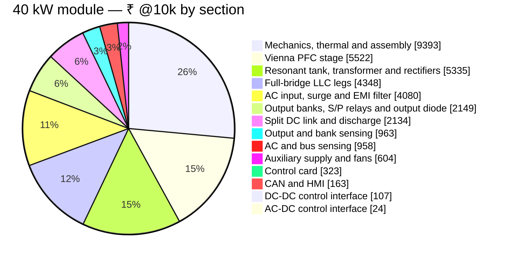

# 🧾 40 kW Module BOM

Every line of the 40 kW module — cost by schematic section, SKU-specific parts and sourcing status

  
  
  
  

> [!NOTE]
> **Purpose** — the complete bill of materials of the **40 kW module**: what it costs, where the money goes by schematic
> section, the parts that make this SKU different, and every line item with its sourcing status. **Generated by
> `calculations/cost/bom-gen.mjs` on every battery run — do not hand-edit.** Machine-readable lines: `calculations/out/bom-40kw.csv`.

## At a glance

| | |
|---|---|
| **Build cost @10k** (India basis) | **₹36,103** · ₹903 / kW |
| **China RFQ target @10k** | **₹29,524** · ₹738 / kW — landed targets, not quotes |
| **2U construction scenario** | ₹34,167 · China target ₹27,940 — flagged estimate, not the design basis |
| **1k · 5k · 100 pcs** | ₹44,435 · ₹39,643 · ₹57,828 |
| **Red-line / stretch** | ₹33,000 / ₹29,000 → ⚠️ over by ₹3,103 |
| **BOM lines · placed parts** | 173 lines · 717 parts (AC-DC 334 · DC-DC 306 · control card 77) |
| **Built to our drawings** | 9 custom lines — specifications on the [40 kW magnetics page](magnetics-40kw.md) |
| **Open sourcing decisions** | 6 REVIEW lines |

## Where the money goes

| Section (schematic sheet) | Parts | Lines | ₹ @10k | Share | China target ₹ |
|---|---:|---:|---:|---:|---:|
| AC input, surge and EMI filter | 47 | 17 | 4,080 | 11.3 % | 3,338 |
| Vienna PFC stage | 81 | 27 | 5,522 | 15.3 % | 4,353 |
| Split DC link and discharge | 31 | 12 | 2,134 | 5.9 % | 1,724 |
| AC and bus sensing | 105 | 24 | 958 | 2.7 % | 806 |
| AC-DC control interface | 16 | 8 | 24 | 0.1 % | 20 |
| Auxiliary supply and fans | 54 | 34 | 604 | 1.7 % | 478 |
| Full-bridge LLC legs | 97 | 28 | 4,348 | 12 % | 3,402 |
| Resonant tank, transformer and rectifiers | 45 | 16 | 5,335 | 14.8 % | 4,307 |
| Output banks, S/P relays and output diode | 47 | 11 | 2,149 | 6 % | 1,763 |
| Output and bank sensing | 69 | 16 | 963 | 2.7 % | 817 |
| DC-DC control interface | 13 | 7 | 107 | 0.3 % | 90 |
| CAN and HMI | 35 | 19 | 163 | 0.5 % | 140 |
| Control card | 77 | 29 | 323 | 0.9 % | 281 |
| Mechanics, thermal and assembly | — | 12 | 9,393 | 26 % | 8,004 |
| **Module** | | | **36,103** | 100 % | **29,524** |

> [!TIP]
> Sections follow the release sheets, so a line here is found on the sheet of the same name.

## Top cost drivers

| # | Part | What it is | Qty | ₹ / unit @10k | ₹ @10k | China target ₹ | Status |
|---:|---|---|---:|---:|---:|---:|---|
| 1 | `IND-PFC-116u-40` | PFC choke 116 µH class, 5× OD79 26µ sendust (Magnetics 0077908A7 / Chang Sung KS eq, … | 3 | 992 | **2,976** | 2,381 | CUSTOM |
| 2 | `SG2M023120LJ` | SiC MOSFET 1200 V 23 mΩ TO-247-4L — full-bridge LLC switch, clip-mounted; tanks.mjs sets … | 8 | 312 | **2,496** | 1,872 | SECOND-SOURCE |
| 3 | `XFMR-LLC-CELL-3E70-40` | D3-40 rev D: full-bridge LLC transformer CELL (2 per module, primaries in SERIES → n = 2 … | 2 | 1,147 | **2,294** | 1,950 | CUSTOM |
| 4 | `CMC-3PH-2mH-SKU` | 3-phase CM choke 2 mH nanocrystalline, winding rated to the SKU line current (D7). … | 2 | 1,062 | **2,123** | 1,699 | CUSTOM |
| 5 | `GC4D20120D` | SiC JBS 1200 V 40 A-class TO-247-2, SINGLE die, 2-terminal (exact p/n at RFQ). ACCEPTANCE: … | 22 | 96 | **2,112** | 1,584 | REVIEW |
| 6 | `ELH-470u500` | 470 µF **500 V** snap-in aluminium electrolytic, 105 °C, −40 °C category, 35 mm land … | 12 | 148 | **1,776** | 1,421 | CLASS |
| 7 | `SIC-750V-15mR` | SiC MOSFET 750 V 15 mΩ class TO-247-4 (Vienna common-source pair, one die per position) | 6 | 192 | **1,152** | 864 | CLASS |
| 8 | `PP-1u-1100` | 1 µF 1100 V film (bridge commutation at the DC-DC entry; 830 V ≤ 76 % of the class). THE … | 16 | 54 | **870** | 696 | CLASS |
| 9 | `PP-2u2-630` | 2.2 µF 630 V PP film, ripple-rated (bank rectifier film: ≤ 10 A rms per part of the … | 24 | 36 | **864** | 691 | CLASS |
| 10 | `IND-LR-E70-40` | D2-40 rev F: EXTERNAL resonant inductor 3.99 µH ±3% on 2× E70/33/32 PC95-class (TDK former … | 1 | 862 | **862** | 689 | CUSTOM |
| 11 | `RELAY-PCB-120A-24V` | PCB power relay 120 A, 24 V coil, no mirror contact (S/P matrix, switched at ZERO current … | 3 | 176 | **528** | 449 | DIRECT |
| 12 | `FUSE-gG-690V-125A` | gG fuse 125 A 690 VAC, 22×58 frame (40 kW AC input, 73.3 A worst continuous). The holder … | 3 | 168 | **504** | 428 | CLASS |
| 13 | `PP-33n-1200V` | 33 nF 1200 V PP resonant-duty film (full-bridge tank: 7/9/11 in parallel at 30/40/50 kW → … | 9 | 54 | **490** | 392 | CLASS |
| 14 | `HF167F/024-HATF(764)` | power relay 100 A/line with a mirror contact — the precharge bypass carries full line … | 2 | 240 | **480** | 408 | DIRECT |
| 15 | `NSI6611` | iso gate driver 10 A, DESAT / Miller clamp (CLAMP pin wired) / UVLO, SOIC-16 | 7 | 68 | **476** | 405 | ORDERABLE |

## What is specific to this SKU

These lines replace the shared-cell default on the 40 kW module (`skuOverrides` in `parts-db.mjs`); everything else is the common design.

| Part | Where | ₹ / unit @10k | Why this part |
|---|---|---:|---|
| `SIC-750V-15mR` | QA0A · QA0B · QB0A · QB0B · QC0A · QC0B | 192 | 750 V 15 mΩ class, single die per position (grid T_j 127 °C) — RFQ target; ACCEPTANCE IDM ≥ 260 A @25 °C (205 A F.01 fault peak) |
| `FUSE-gG-690V-125A` | F1 · F2 · F3 | 168 | gG fuse 125 A 690 VAC, 22×58 frame (40 kW AC input, 73.3 A worst continuous). The holder must be the matching 22×58 base |
| `HF167F-100A-M` | KPRE1 · KPRE2 | 240 | power relay 100 A/line with a mirror contact — the precharge bypass carries full line current. §K line: contact-gap withstand and insulation group at the 475 … |
| `CMC-3PH-2mH-SKU` | CMC1 · CMC2 | 1,062 | 3-phase CM choke 2 mH nanocrystalline, winding rated to the SKU line current (D7). ACCEPTANCE: L_cm ≥ 2 mH @10 kHz AND ≥ 1.0 mH @150 kHz, ≥ 80 % of it held with … |
| `SHUNT-50MV-133A` | RSHO | 112 | manganin shunt 0.376 mΩ = 50 mV at the 133 A rated output, Kelvin 4-terminal |
| `DIODE-1600V-200A-MOD` | DOUT | 416 | 1600 V 200 A insulated-base module: 133 A out = 67 % (a 150 A part would run 89 %) |
| `XFMR-LLC-CELL-3E70-40` | T1A · T1B | 1,147 | D3-40 rev D: full-bridge LLC transformer CELL (2 per module, primaries in SERIES → n = 2 overall) — 3× E70/33/32 PC95-class on a 3-set former (lN 293 mm, … |
| `IND-LR-E70-40` | L1R | 862 | D2-40 rev F: EXTERNAL resonant inductor 3.99 µH ±3% on 2× E70/33/32 PC95-class (TDK former B66372A2000), N=5, litz 10000×0.05 mm (19.6 mm²) compacted single … |
| `CT-RES-1:100-150A` | CT1 | 132 | resonant CT 1:100, 150 A rms class, 20–250 kHz, pass-through — the tank conductor is the primary (ONE CT on the full-bridge tank; the 40 kW tank class 100 A rms … |
| `R2512-0R36-1W-1%` | R1CT | 3 | 0.36 Ω 1 W resonant-CT burden: F.11 180 A pk = 0.65 V above AVMID, observable to 450 A against the 417 A monitor peak 3 µs after an internal short; 1.0 A rms → … |
| `IND-PFC-116u-40` | LA0 · LB0 · LC0 | 992 | PFC choke 116 µH class, 5× OD79 26µ sendust (Magnetics 0077908A7 / Chang Sung KS eq, catalog AL 37 nH/T² ±8%), N=26, 13× 1.6 mm enamelled bundle … |
| `CT-LINE-2500-150A` | CTA0 · CTB0 · CTC0 | 76 | line CT 2500:1, 150 A class (Talema ACX-1150 catalog), 4 kV hipot, PCB pins — the 50 kHz amplitude/phase, ≤ 1 µs step and ≥ 5 A DC acceptance rows apply to this … |
| `R1206-18R-1%` | RA0B · RB0B · RC0B | 1 | 18 Ω line-CT burden 1% 1206 (F.01 155 A pk = 2.77 V; observability ceiling 225 A through the D1 soft-saturation race) |
| `C1206-680p-1kV-C0G` | C1HOS1 · C1HOS2 · C1LOS1 · C1LOS2 · C2HOS1 · C2HOS2 … | 7 | 680 pF 1 kV C0G 1206 LLC turn-off snubber (tanks.mjs cs @40 kW — the knee: k_off 5.20 nJ/(V·A), 83.8 % of 1200 V, 379 ns. 1 nF is excluded here, ringing the … |
| `ISO-GBIAS-15-2W` | PS1H · PS1L · PS2H · PS2L | 100 | iso gate-bias module +15/−3 V, **2 W class**: this channel drives TWO paralleled SG2M023120LJ dies at up to f_max 203 kHz, so P_gate = n·Q_g·ΔV·f + driver I_CC2 … |

## Line items by section

<b>AC input, surge and EMI filter</b> — ₹4,080 @10k · 47 parts · 17 lines

| Part | What it is | Refs | Qty | ₹ / unit @10k | ₹ @10k | LCSC | Status |
|---|---|---|---:|---:|---:|---|---|
| `CMC-3PH-2mH-SKU` | 3-phase CM choke 2 mH nanocrystalline, winding rated to the SKU line current (D7). ACCEPTANCE: L_cm ≥ 2 mH @10 … | CMC1 CMC2 | 2 | 1,062 | 2,123 | — | CUSTOM |
| `FUSE-gG-690V-125A` | gG fuse 125 A 690 VAC, 22×58 frame (40 kW AC input, 73.3 A worst continuous). The holder must be the matching … | F1 F2 F3 | 3 | 168 | 504 | — | CLASS |
| `HF167F/024-HATF(764)` | power relay 100 A/line with a mirror contact — the precharge bypass carries full line current. §K line: … | KPRE1 KPRE2 | 2 | 240 | 480 | — | DIRECT |
| `X2-4u7-305` | X2 4.7 µF 305 VAC MKP safety film, 27.5 mm pitch — twelve caps in three STAR stages: line side CX0x, inter-CMC … | CX01 CX02 CX03 CX11 CX12 CX13 CX21 CX22 … | 12 | 34 | 403 | — | CLASS |
| `X1-2u2-530` | X1 2.2 µF 530 VAC, delta across the 475 VAC line-line (inter-CMC stage CX1x; with RDMPx it forms the CX2-node … | CDMP1 CDMP2 CDMP3 | 3 | 50 | 149 | — | CLASS |
| `B72220S0551K101` | MOV 550 VAC 20 mm (Δ line-line, and in series with the GDT to PE) | MOV1 MOV2 MOV3 MOVP1 MOVP2 MOVP3 | 6 | 18 | 106 | — | CLASS |
| `STUD-M8` | M8 stud terminal | JACL1 JACL2 JACL3 JPE | 4 | 22 | 90 | — | CLASS |
| `Y2-10n-300` | Y2 **10 nF** 300 VAC, L-PE on the CONVERTER node AC1..3. 10 nF is sized for the LLC bridge as a CM source (830 … | CY1 CY2 CY3 | 3 | 20 | 60 | — | CLASS |
| `CER-25W-33R-AX` | 33 Ω 25 W ceramic pulse resistor, axial (AC precharge; the ohms are IN the order code — a class-only p/n lets … | RPRE1 RPRE2 | 2 | 22 | 45 | — | CLASS |
| `GDT-2k5-20kA` | gas discharge tube **2.5 kV** (L-PE surge path). The 2.5 kV class is the requirement: the MOV+GDT series path … | GDT1 GDT2 GDT3 | 3 | 14 | 43 | — | CLASS |
| `VY1472M63Y5UQ63V0` | Y1 4.7 nF 440 VAC (second CM stage on AC1M..3M, between the two CM chokes, where the trio works against 4 mH … | CY4 CY5 CY6 | 3 | 13 | 38 | C499492 | ORDERABLE |
| `SQP-6R8-25W` | 6.8 Ω 25 W wirewound pulse, axial, series L ≤ 10 µH (input-filter Rd–Cd damper RDMPx at 30 / 40 kW; ≤ 4.6 W = … | RDMP1 RDMP2 RDMP3 | 3 | 13 | 38 | — | CLASS |
| `RC0603FR-07330RL` | small-signal resistor 0402–0805 (pulls/filters/feedback) | RKFBP | 1 | 0 | 0 | — | CLASS |

<b>Vienna PFC stage</b> — ₹5,522 @10k · 81 parts · 27 lines

| Part | What it is | Refs | Qty | ₹ / unit @10k | ₹ @10k | LCSC | Status |
|---|---|---|---:|---:|---:|---|---|
| `IND-PFC-116u-40` | PFC choke 116 µH class, 5× OD79 26µ sendust (Magnetics 0077908A7 / Chang Sung KS eq, catalog AL 37 nH/T² ±8%), … | LA0 LB0 LC0 | 3 | 992 | 2,976 | — | CUSTOM |
| `SIC-750V-15mR` | SiC MOSFET 750 V 15 mΩ class TO-247-4 (Vienna common-source pair, one die per position) | QA0A QA0B QB0A QB0B QC0A QC0B | 6 | 192 | 1,152 | — | CLASS |
| `GC4D20120D` | SiC JBS 1200 V 40 A-class TO-247-2, SINGLE die, 2-terminal (exact p/n at RFQ). ACCEPTANCE: IFSM ≥ 250 A (10 ms … | DA0T DA0B DB0T DB0B DC0T DC0B | 6 | 96 | 576 | C7435099 | REVIEW |
| `NSI6611` | iso gate driver 10 A, DESAT / Miller clamp (CLAMP pin wired) / UVLO, SOIC-16 | UA0G UB0G UC0G | 3 | 68 | 204 | C7470934 | ORDERABLE |
| `ISO-GBIAS-15-1W` | isolated gate-bias module **+15 V / −3 V**, 1 W class (Vienna channels: ONE common-source pair per channel at … | PSA0G PSB0G PSC0G | 3 | 55 | 165 | — | CLASS |
| `PP-1u-600` | 1 µF 600 V film (Vienna per-phase commutation) | CA0FP CA0FN CB0FP CB0FN CC0FP CC0FN | 6 | 26 | 154 | — | CLASS |
| `GC4D10120H` | SiC JBS 1200 V 10 A TO-247-2 (Vienna RCD clamp; D{x}0CM is the mirrored clamp diode for the negative … | DA0C DA0CM DB0C DB0CM DC0C DC0CM | 3 | 44 | 132 | C7435087 | ORDERABLE |
| `WW-470R-10W` | 470 Ω 10 W wirewound axial (Vienna clamp bleeder; 4.3 W worst case = 43 % of rating) | RA0C RA0CM RB0C RB0CM RC0C RC0CM | 3 | 18 | 53 | — | CLASS |
| `FILM-100n-250` | 100 nF 250 V film (Vienna RCD clamp; C{x}0CM is the mirrored clamp cap) | CA0C CA0CM CB0C CB0CM CC0C CC0CM | 3 | 14 | 43 | — | CLASS |
| `C1812-330p-1k` | **330 pF** 1 kV C0G 1812 (Vienna RC snubber). 330 pF is the value the single-polarity clamp needs: at 100 pF … | CA0SN CB0SN CC0SN | 3 | 7 | 22 | — | CLASS |
| `R2512-10R-3W-PULSE` | 10 Ω 2512 **3 W pulse-proof** (Vienna RC snubber). The 3 W class is the requirement: with C_SN 330 pF the … | RA0SN RB0SN RC0SN | 3 | 6 | 19 | — | CLASS |
| `RC1206FR-7W4R7L` | gate resistor 1206, 0.5 W-rated (LLC R_on 4.7 Ω dissipates ~0.2 W at 140 kHz, so a standard 0.25 W part runs … | RA0GON RA0GOFF RB0GON RB0GOFF RC0GON RC0GOFF | 6 | 2 | 10 | C859161 | ORDERABLE |
| `US1M` | 1 kV 1 A fast diode SMA (DESAT chain) | DA0GS1 DA0GS2 DB0GS1 DB0GS2 DC0GS1 DC0GS2 | 6 | 1 | 6 | C412437 | ORDERABLE |
| `CL05A105KO5NNNC` | 1 µF 0805 (driver bias) | CA0GB1 CA0GB2 CB0GB1 CB0GB2 CC0GB1 CC0GB2 | 6 | 1 | 4 | — | CLASS |
| `R0805-2R2` | per-device series gate R — one on EVERY die including the original device, never a shared node. LLC paralleled … | RGA0A1 RGA0B1 RGB0A1 RGB0B1 RGC0A1 RGC0B1 | 6 | 0 | 2 | — | CLASS |
| `CC0603KRX7R9BB104` | filter/decoupling MLCC 0402–0805 | CA0GBV CB0GBV CC0GBV | 3 | 0 | 1 | C14663 | ORDERABLE |
| `RC0805FR-0710KL` | 10 kΩ gate-source | RA0GGS RB0GGS RC0GGS | 3 | 0 | 1 | C84376 | ORDERABLE |
| `RC0603FR-0710KL` | small-signal resistor 0402–0805 (pulls/filters/feedback) | RA0GPD RB0GPD RC0GPD | 3 | 0 | 1 | — | CLASS |
| `CC0603JRNPO9BN470` | 47 pF 0603 C0G (DESAT blank, Vienna hard turn-on — NSI66x1A worst response 2.21 µs against the 4.2 µs … | CA0GBL CB0GBL CC0GBL | 3 | 0 | 1 | — | CLASS |
| `RC0603FR-07100RL` | small-signal resistor 0402–0805 (pulls/filters/feedback) | RA0GDS RB0GDS RC0GDS | 3 | 0 | 1 | — | CLASS |

<b>Split DC link and discharge</b> — ₹2,134 @10k · 31 parts · 12 lines

| Part | What it is | Refs | Qty | ₹ / unit @10k | ₹ @10k | LCSC | Status |
|---|---|---|---:|---:|---:|---|---|
| `ELH-470u500` | 470 µF **500 V** snap-in aluminium electrolytic, 105 °C, −40 °C category, 35 mm land (split DC link). The 500 … | CDT00 CDT01 CDT02 CDT03 CDT04 CDB00 CDB01 CDB02 … | 12 | 148 | 1,776 | — | CLASS |
| `IMW120R350M1H` | SiC FET 1200 V 5 A (bus discharge QDISF / bank bleeders QDISA-B). GATE SPEC for the PV-driven bleeders: … | QDISF | 1 | 96 | 96 | C536285 | ORDERABLE |
| `CER-25W-160R-AX` | 160 Ω 25 W ceramic pulse resistor, axial (bus discharge string, 4× in series; value-carrying order code, 50 W … | RDIS0 RDIS1 RDIS2 RDIS3 | 4 | 22 | 90 | — | CLASS |
| `STUD-M8` | M8 stud terminal | JDCP JDCN JPEB | 3 | 22 | 67 | — | CLASS |
| `ISO-GBIAS-15-1W` | isolated gate-bias module **+15 V / −3 V**, 1 W class (Vienna channels: ONE common-source pair per channel at … | PSQD | 1 | 55 | 55 | — | CLASS |
| `TLP152` | opto gate driver (isolated bus-discharge control, default-OFF) | UQD | 1 | 34 | 34 | C17255258 | ORDERABLE |
| `PS122WF4702T4E` | **47 kOhm** 2512 2 W anti-surge HV, Umax >= 250 V, 2-series per half, ONE string per half per module. 4.4 mA … | RBALT0A RBALT0B RBALB0A RBALB0B | 4 | 3 | 10 | C2793932 | REVIEW |
| `TAB-M4` | discharge FET heatsink tab stud | QDIS | 1 | 5 | 5 | — | CLASS |
| `CC0603KRX7R9BB104` | filter/decoupling MLCC 0402–0805 | CQD | 1 | 0 | 0 | C14663 | ORDERABLE |
| `R-small` | small-signal resistor 0402–0805 (pulls/filters/feedback) | RQDL | 1 | 0 | 0 | — | CLASS |
| `RC0805FR-07100RL` | small-signal resistor 0402–0805 (pulls/filters/feedback) | RQDG | 1 | 0 | 0 | C105577 | ORDERABLE |
| `RC0805FR-0710KL` | small-signal resistor 0402–0805 (pulls/filters/feedback) | RQDPD | 1 | 0 | 0 | C84376 | ORDERABLE |

<b>AC and bus sensing</b> — ₹958 @10k · 105 parts · 24 lines

| Part | What it is | Refs | Qty | ₹ / unit @10k | ₹ @10k | LCSC | Status |
|---|---|---|---:|---:|---:|---|---|
| `AMC1350QDWVRQ1` | iso voltage-sense amp ±5 V input (AC phase sense against the artificial star) | UIVV1 UIVV2 UIVV3 | 3 | 108 | 324 | C5214206 | ORDERABLE |
| `CT-LINE-2500-150A` | line CT 2500:1, 150 A class (Talema ACX-1150 catalog), 4 kV hipot, PCB pins — the 50 kHz amplitude/phase, ≤ 1 … | CTA0 CTB0 CTC0 | 3 | 76 | 228 | — | DIRECT |
| `AMC1311DWVR` | iso voltage-sense amp 0–2 V input (bus / bank / output senses). On the 1311 class the symbol's pin-3 'VINN' is … | UIVBP UIVBM | 2 | 92 | 184 | C456277 | ORDERABLE |
| `ISO5V-RFC-6K` | iso 15→5 V reinforced-rated module (floating bias for the isolated sense amplifiers — AC star / DCN / BKAN / … | PS5AC PS5BUS | 2 | 65 | 130 | C20613048 | REVIEW |
| `HV732BTTD4753F` | 475 kΩ 1206 1% anti-surge (HV divider) | RV1D0 RV1D1 RV1D2 RV1D3 RV1D4 RV1D5 RV1D6 RV1D7 … | 40 | 1 | 44 | C4121673 | ORDERABLE |
| `R2512-33k-HV-AS` | 33 kOhm 2512 2 W anti-surge HV, Umax >= 250 V, 2-series per position (artificial-star network; it is also THE … | RNS1A RNS1B RNS2A RNS2B RNS3A RNS3B | 6 | 3 | 16 | — | CLASS |
| `RT0805BRD0711K5L` | divider bottom 0.1% (6.8 k unipolar / 11.5 k AC) | RV1DL RV2DL RV3DL | 3 | 2 | 6 | C865153 | ORDERABLE |
| `CC0603KRX7R9BB104` | filter/decoupling MLCC 0402–0805 | CV1VA CV1VB CV2VA CV2VB CV3VA CV3VB CBPVA CBPVB … | 12 | 0 | 5 | C14663 | ORDERABLE |
| `B2B-PH-K-S` | 2-way header (NTC/term) | JTPFC JTINL | 2 | 2 | 5 | C20504437 | ORDERABLE |
| `ARG05BTC6801` | divider bottom 0.1% (6.8 k unipolar / 11.5 k AC) | RBPDL RBMDL | 2 | 2 | 4 | C3033907 | ORDERABLE |
| `RC1206FR-0718RL` | 18 Ω line-CT burden 1% 1206 (F.01 155 A pk = 2.77 V; observability ceiling 225 A through the D1 … | RA0B RB0B RC0B | 3 | 1 | 3 | — | CLASS |
| `1N4148WS` | clamp diode SOD-323 (to 3V3) | DA0P DA0N DB0P DB0N DC0P DC0N | 6 | 0 | 2 | C2128 | ORDERABLE |
| `RC0603FR-07100RL` | small-signal resistor 0402–0805 (pulls/filters/feedback) | RV1O RV2O RV3O RBPO RBMO | 5 | 0 | 2 | — | CLASS |
| `CC0603KRX7R9BB102` | filter/decoupling MLCC 0402–0805 | CA0F CB0F CC0F | 3 | 0 | 1 | C100040 | ORDERABLE |
| `CC0805KRX7R9BB103` | filter/decoupling MLCC 0402–0805 | CV1DF CV2DF CV3DF | 3 | 0 | 1 | — | CLASS |
| `CL21B105KBFNNNE` | 1 µF 0805 bulk on module-fed floating rails (Bias5 / shunt-amp / CAN 5 V) | C5BAC C5BBUS | 2 | 1 | 1 | C28323 | ORDERABLE |
| `R-small` | small-signal resistor 0402–0805 (pulls/filters/feedback) | RA0F RB0F RC0F | 3 | 0 | 1 | — | CLASS |
| `CC0805KRX7R9BB102` | filter/decoupling MLCC 0402–0805 | CBPDF CBMDF | 2 | 0 | 1 | — | CLASS |
| `RC0603FR-0710KL` | small-signal resistor 0402–0805 (pulls/filters/feedback) | RTPFCP RTINLP | 2 | 0 | 1 | — | CLASS |
| `CL21B105KBFNNNE` | filter/decoupling MLCC 0402–0805 | CAVMA | 1 | 0 | 0 | C28323 | ORDERABLE |

<b>AC-DC control interface</b> — ₹24 @10k · 16 parts · 8 lines

| Part | What it is | Refs | Qty | ₹ / unit @10k | ₹ @10k | LCSC | Status |
|---|---|---|---:|---:|---:|---|---|
| `VY1472M63Y5UQ63V0` | Y1 4.7 nF 440 VAC (second CM stage on AC1M..3M, between the two CM chokes, where the trio works against 4 mH … | CPET | 1 | 13 | 13 | C499492 | ORDERABLE |
| `ULN2803A` | 8-ch relay coil driver SOIC-18 (unused inputs grounded) | UPA | 1 | 7 | 7 | C2865085 | ORDERABLE |
| `R0603-10k` | 10 kΩ 0603 card-interface pull-down (board-side default-OFF on the GATE_EN/EN/DO ways — CARD_RULES) | RPD0 RPD1 RPD2 RPD3 RPD4 RPD5 RPD6 | 7 | 0 | 1 | — | CLASS |
| `CC0603KRX7R9BB104` | filter/decoupling MLCC 0402–0805 | CM24 CM15 | 2 | 0 | 1 | C14663 | ORDERABLE |
| `RC0603FR-0710KL` | small-signal resistor 0402–0805 (pulls/filters/feedback) | RM24B RM15B | 2 | 0 | 1 | — | CLASS |
| `RC1206FR-071ML` | small-signal resistor 0402–0805 (pulls/filters/feedback) | RPET | 1 | 0 | 0 | — | CLASS |
| `R-small` | small-signal resistor 0402–0805 (pulls/filters/feedback) | RM24A | 1 | 0 | 0 | — | CLASS |
| `RC0603FR-0747KL` | small-signal resistor 0402–0805 (pulls/filters/feedback) | RM15A | 1 | 0 | 0 | — | CLASS |

<b>Auxiliary supply and fans</b> — ₹604 @10k · 54 parts · 34 lines

| Part | What it is | Refs | Qty | ₹ / unit @10k | ₹ @10k | LCSC | Status |
|---|---|---|---:|---:|---:|---|---|
| `XFMR-AUX-FLY-E` | aux flyback transformer ETD44 PC95, 110 W class, 321–860 V input, Np38 / N24 6 / N15 4 / Naux 4, Lp 345 µH ±5 … | TAUX | 1 | 184 | 184 | — | CUSTOM |
| `SIC-1700-1R-G15` | SiC FET 1700 V ~1 Ω **specified at V_GS 12–15 V** (aux flyback switch on the full bus; TO-247 likely package, … | QAUX | 1 | 128 | 128 | — | CLASS |
| `SIC-SBD-1700V` | SiC Schottky ≥1700 V, IF(AV) ≥1 A, IFRM ≥10 A, no forward recovery (aux RCD clamp). The 1700 V class is the … | DCLA | 1 | 120 | 120 | — | CLASS |
| `MICROFIT3-40` | 40-way inter-board harness header, 5 A/contact — the PFC bundle crosses here: PWM x3, 12 senses, AVMID+Kelvin, … | JICA | 1 | 58 | 58 | — | CLASS |
| `NCP1252DDR2G` | current-mode flyback controller, RT-set 65 kHz (66.5 kΩ, datasheet Rev 9), SOIC-8. The **D suffix is … | UAUX | 1 | 19 | 19 | — | ORDERABLE |
| `B4B-PH-K-S` | fan header 4-way (the fan p/n must accept 3.3 V PWM) | JFAN1 JFAN2 JFAN3 | 3 | 5 | 14 | C131334 | ORDERABLE |
| `TPS54202DDCR` | 15→3.3 V 2 A sync buck SOT-23-6, on the control card and exporting V3P3 over the 88-way. An LDO is thermally … | UBKA | 1 | 12 | 12 | C191884 | ORDERABLE |
| `GR227M035F12RR0VL4FP0` | 220 µF 35 V | CAUX24 CAUX15 CVCC | 3 | 3 | 10 | C45078 | ORDERABLE |
| `R2512-11k-2W-AS` | 11 kΩ 1 % 2512 2 W anti-surge, ≥200 V working (aux RCD clamp, 3-series = 33 k; ≤0.94 W/part at full load and 5 … | RCLA1 RCLA2 RCLA3 | 3 | 3 | 10 | — | CLASS |
| `R2512-HV` | 2512 HV-rated 1 %, **limiting element voltage ≥ 500 V** (aux startup 2×470 k / brown-out 2×1.2 M, 2-series per … | RAUXST1 RAUXST2 RBR1A RBR1B | 4 | 2 | 8 | — | CLASS |
| `PP-10n-1200` | 10 nF 1200 V film (aux RCD clamp) | CCLA | 1 | 7 | 7 | — | CLASS |
| `US2G` | 400 V 2 A ultrafast SMB (aux 15 V / self-supply rectifiers — PIV ≈ 157 V plus ring) | DAUX15 DAUXVC | 2 | 2 | 5 | C49263 | ORDERABLE |
| `CYA0630-10UH` | 10 µH 3 A shielded power inductor (3V3 buck) | LBKA | 1 | 5 | 5 | C5189958 | ORDERABLE |
| `US3M` | 400 V 3 A ultrafast, SMC pad (aux 24 V rectifier — PIV ≈ 176 V plus the leakage ring, which is why the class … | DAUX24 | 1 | 4 | 4 | C3039981 | ORDERABLE |
| `HV732BTTD4753F` | 475 kΩ 1206 1% anti-surge (HV divider) | RFPD1 RFPD2 RFPD3 | 3 | 1 | 3 | C4121673 | ORDERABLE |
| `SMBJ28A` | TVS **28 V** uni SMB — V24 rail clamp for a gross feedback-open fault, not rail regulation. The 28 V standoff … | DTVS24 | 1 | 2 | 2 | — | ORDERABLE |
| `SMBJ18A` | TVS **18 V** uni SMB — V15 rail clamp, fault duty only. 18 V clears the ±2 % reference band (V15 upper corner … | DTVS15 | 1 | 2 | 2 | — | ORDERABLE |
| `R2512-R05-1W-1%` | 50 mΩ 1 % 1 W 2512 in the V24 distribution after CAUX24: it holds a V24 hard-short loop ≥100 mΩ so the … | RAUX24 | 1 | 2 | 2 | — | CLASS |
| `R1206-R28-1%-0.5W` | 0.28 Ω 1% 0.5 W 1206 current-sense (aux cycle-by-cycle limit — with CCSF 100 pF the worst comparator margin at … | RAUXCS | 1 | 2 | 2 | — | CLASS |
| `RC0603FR-0710KL` | small-signal resistor 0402–0805 (pulls/filters/feedback) | RBEFB RBKF2A RFT1 RFT2 RFT3 | 5 | 0 | 2 | — | CLASS |
| `CC0603KRX7R9BB104` | filter/decoupling MLCC 0402–0805 | CAUXSS CVCCB CBSTA | 3 | 0 | 1 | C14663 | ORDERABLE |
| `BZX84-B15` | 15 V **±2 %** zener (aux primary-side regulation reference — VCC regulates at VZ+VBE and the aux winding … | DZAUX | 1 | 1 | 1 | — | ORDERABLE |
| `R2512-4k7-1W` | 4.7 kΩ 1 W 2512 V24 PRELOAD, 5.1 mA / 0.12 W. Fitted because the normal standby state — every relay … | RPL24 | 1 | 1 | 1 | — | CLASS |
| `RC0603FR-07100KL` | small-signal resistor 0402–0805 (pulls/filters/feedback) | RAUXG REN1A | 2 | 0 | 1 | — | CLASS |
| `R-small` | small-signal resistor 0402–0805 (pulls/filters/feedback) | RAUXRT REN2A | 2 | 0 | 1 | — | CLASS |
| `CC0603JRNPO9BN101` | 100 pF 0603 C0G ±5 % (aux current-sense filter — 1 k ∥ 26.5 k ramp R → 96 ns lag). C0G at this value: a 470 pF … | CCSF | 1 | 0 | 0 | C14665 | ORDERABLE |
| `CC0603KRX7R9BB102` | filter/decoupling MLCC 0402–0805 | CFBF | 1 | 0 | 0 | C100040 | ORDERABLE |
| `CL21A106KAYNNNE` | filter/decoupling MLCC 0402–0805 | CBKIA | 1 | 0 | 0 | C15850 | ORDERABLE |
| `GRM21BR61C226ME44L` | filter/decoupling MLCC 0402–0805 | CBKOA | 1 | 0 | 0 | C86817 | ORDERABLE |
| `RC0603FR-071KL` | small-signal resistor 0402–0805 (pulls/filters/feedback) | RCSF | 1 | 0 | 0 | — | CLASS |
| `RC0603FR-077K5L` | small-signal resistor 0402–0805 (pulls/filters/feedback) | RBR2 | 1 | 0 | 0 | — | CLASS |
| `RC0603FR-072K2L` | small-signal resistor 0402–0805 (pulls/filters/feedback) | RZFB | 1 | 0 | 0 | — | CLASS |
| `S8050` | NPN SOT-23 (QAUXFB: opto-emulating feedback pull-down · QPVD: low-side switch for the PV-driver LEDs at the … | QAUXFB | 1 | 0 | 0 | C2146 | ORDERABLE |
| `RC0603FR-0745K3L` | small-signal resistor 0402–0805 (pulls/filters/feedback) | RBKF1A | 1 | 0 | 0 | — | CLASS |

<b>Full-bridge LLC legs</b> — ₹4,348 @10k · 97 parts · 28 lines

| Part | What it is | Refs | Qty | ₹ / unit @10k | ₹ @10k | LCSC | Status |
|---|---|---|---:|---:|---:|---|---|
| `SG2M023120LJ` | SiC MOSFET 1200 V 23 mΩ TO-247-4L — full-bridge LLC switch, clip-mounted; tanks.mjs sets the dies per position … | Q1H Q1L Q1H2 Q1L2 Q2H Q2L Q2H2 Q2L2 | 8 | 312 | 2,496 | C5713523 | SECOND-SOURCE |
| `PP-1u-1100` | 1 µF 1100 V film (bridge commutation at the DC-DC entry; 830 V ≤ 76 % of the class). THE COUNT IS PART OF THE … | CF0 CF1 CF2 CF3 CF4 CF5 CF6 CF7 … | 16 | 54 | 870 | — | CLASS |
| `ISO-GBIAS-15-2W` | iso gate-bias module +15/−3 V, **2 W class**: this channel drives TWO paralleled SG2M023120LJ dies at up to … | PS1H PS1L PS2H PS2L | 4 | 100 | 400 | — | CLASS |
| `NSI6611` | iso gate driver 10 A, DESAT / Miller clamp (CLAMP pin wired) / UVLO, SOIC-16 | U1H U1L U2H U2L | 4 | 68 | 272 | C7470934 | ORDERABLE |
| `RTF-50W-R33-TO247` | 0.33 Ω ≥ 50 W THICK-FILM NON-INDUCTIVE power resistor, TO-247 two-lead, clipped to the DC-DC heatsink with the … | RFDMP | 1 | 76 | 76 | — | CLASS |
| `PP-2u2-1100` | 2.2 µF 1100 V PP film — the capacitor half of the DC-link entry DAMPER, in series with RFDMP 0.33 Ω across … | CFDMP | 1 | 74 | 74 | — | CLASS |
| `STUD-M8` | M8 stud terminal | JDCP JDCN JPEB | 3 | 22 | 67 | — | CLASS |
| `C1206-680p-1kV-C0G` | 680 pF 1 kV C0G 1206 LLC turn-off snubber (tanks.mjs cs @40 kW — the knee: k_off 5.20 nJ/(V·A), 83.8 % of 1200 … | C1HOS2 C1LOS2 C1HOS1 C1LOS1 C2HOS2 C2LOS2 C2HOS1 C2LOS1 | 8 | 7 | 58 | — | CLASS |
| `US1M` | 1 kV 1 A fast diode SMA (DESAT chain) | D1HS1 D1HS2 D1LS1 D1LS2 D2HS1 D2HS2 D2LS1 D2LS2 | 8 | 1 | 8 | C412437 | ORDERABLE |
| `RC1206FR-7W4R7L` | gate resistor 1206, 0.5 W-rated (LLC R_on 4.7 Ω dissipates ~0.2 W at 140 kHz, so a standard 0.25 W part runs … | R1HON R1LON R2HON R2LON | 4 | 2 | 6 | C859161 | ORDERABLE |
| `R1206-RG-0.5W` | gate resistor 1206, 0.5 W-rated (LLC R_on 4.7 Ω dissipates ~0.2 W at 140 kHz, so a standard 0.25 W part runs … | R1HOFF R1LOFF R2HOFF R2LOFF | 4 | 2 | 6 | — | CLASS |
| `CL05A105KO5NNNC` | 1 µF 0805 (driver bias) | C1HB1 C1HB2 C1LB1 C1LB2 C2HB1 C2HB2 C2LB1 C2LB2 | 8 | 1 | 5 | — | CLASS |
| `R0805-2R2` | per-device series gate R — one on EVERY die including the original device, never a shared node. LLC paralleled … | RG1H2 RG1L2 RG1H1 RG1L1 RG2H2 RG2L2 RG2H1 RG2L1 | 8 | 0 | 3 | — | CLASS |
| `CC0603KRX7R9BB104` | filter/decoupling MLCC 0402–0805 | C1HBV C1LBV C2HBV C2LBV | 4 | 0 | 2 | C14663 | ORDERABLE |
| `RC0805FR-0710KL` | 10 kΩ gate-source | R1HGS R1LGS R2HGS R2LGS | 4 | 0 | 2 | C84376 | ORDERABLE |
| `RC0603FR-0710KL` | small-signal resistor 0402–0805 (pulls/filters/feedback) | R1HPD R1LPD R2HPD R2LPD | 4 | 0 | 1 | — | CLASS |
| `MLCC-18p-0603` | **18 pF** 0603 C0G (DESAT blank, LLC ZVS turn-on). 18 pF is bounded on both sides: the LLC positions carry TWO … | C1HBL C1LBL C2HBL C2LBL | 4 | 0 | 1 | — | CLASS |
| `RC0603FR-07100RL` | small-signal resistor 0402–0805 (pulls/filters/feedback) | R1HDS R1LDS R2HDS R2LDS | 4 | 0 | 1 | — | CLASS |

<b>Resonant tank, transformer and rectifiers</b> — ₹5,335 @10k · 45 parts · 16 lines

| Part | What it is | Refs | Qty | ₹ / unit @10k | ₹ @10k | LCSC | Status |
|---|---|---|---:|---:|---:|---|---|
| `XFMR-LLC-CELL-3E70-40` | D3-40 rev D: full-bridge LLC transformer CELL (2 per module, primaries in SERIES → n = 2 overall) — 3× … | T1A T1B | 2 | 1,147 | 2,294 | — | CUSTOM |
| `GC4D20120D` | SiC JBS 1200 V 40 A-class TO-247-2, SINGLE die, 2-terminal (exact p/n at RFQ). ACCEPTANCE: IFSM ≥ 250 A (10 ms … | D1A1 D1A1P2 D1A2 D1A2P2 D1A3 D1A3P2 D1A4 D1A4P2 … | 16 | 96 | 1,536 | C7435099 | REVIEW |
| `IND-LR-E70-40` | D2-40 rev F: EXTERNAL resonant inductor 3.99 µH ±3% on 2× E70/33/32 PC95-class (TDK former B66372A2000), N=5, … | L1R | 1 | 862 | 862 | — | CUSTOM |
| `PP-33n-1200V` | 33 nF 1200 V PP resonant-duty film (full-bridge tank: 7/9/11 in parallel at 30/40/50 kW → ≤ 10.3 A rms per cap … | C1R0 C1R1 C1R2 C1R3 C1R4 C1R5 C1R6 C1R7 … | 9 | 54 | 490 | — | CLASS |
| `CT-RES-1:100-150A` | resonant CT 1:100, 150 A rms class, 20–250 kHz, pass-through — the tank conductor is the primary (ONE CT on … | CT1 | 1 | 132 | 132 | — | CLASS |
| `TLV3202-class` | dual 40 ns push-pull comparator SOIC/VSSOP-8, 2.7–5.5 V (F.11 window: trips above F11_VH and below F11_VL, … | U1W | 1 | 13 | 13 | — | CLASS |
| `R2512-0R36-1W-1%` | 0.36 Ω 1% 1 W 2512 resonant-CT burden (F.11 180 A pk = 0.65 V above AVMID; observable to 450 A, past the 417 A … | R1CT | 1 | 3 | 3 | — | CLASS |
| `CC0603KRX7R9BB104` | filter/decoupling MLCC 0402–0805 | C1WB CF11H CF11L | 3 | 0 | 1 | C14663 | ORDERABLE |
| `R-small` | small-signal resistor 0402–0805 (pulls/filters/feedback) | RF11H RF11M RF11L | 3 | 0 | 1 | — | CLASS |
| `1N4148WS` | clamp diode SOD-323 (to 3V3) | D1CP D1CN | 2 | 0 | 1 | C2128 | ORDERABLE |
| `RC0805FR-071ML` | small-signal resistor 0402–0805 (pulls/filters/feedback) | R1WHA R1WHB | 2 | 0 | 1 | C107700 | ORDERABLE |
| `BAT54A` | dual Schottky SOT-23 common anode (F.11 window comparator diode-OR onto the FLT wire-OR) | D1W | 1 | 1 | 1 | — | CLASS |
| `CC0603JRNPO9BN221` | filter/decoupling MLCC 0402–0805 | C1CF | 1 | 0 | 0 | C106210 | ORDERABLE |
| `CL21B105KBFNNNE` | filter/decoupling MLCC 0402–0805 | C1AVM | 1 | 0 | 0 | C28323 | ORDERABLE |
| `RC0603FR-071KL` | small-signal resistor 0402–0805 (pulls/filters/feedback) | R1CF | 1 | 0 | 0 | — | CLASS |

<b>Output banks, S/P relays and output diode</b> — ₹2,149 @10k · 47 parts · 11 lines

| Part | What it is | Refs | Qty | ₹ / unit @10k | ₹ @10k | LCSC | Status |
|---|---|---|---:|---:|---:|---|---|
| `PP-2u2-630` | 2.2 µF 630 V PP film, ripple-rated (bank rectifier film: ≤ 10 A rms per part of the 30/39/49 A rms 2·fsw … | CFA0 CFA1 CFA2 CFA3 CFA4 CFA5 CFA6 CFA7 … | 24 | 36 | 864 | — | CLASS |
| `RELAY-PCB-120A-24V` | PCB power relay 120 A, 24 V coil, no mirror contact (S/P matrix, switched at ZERO current — modes change in … | KSER KPARA KPARB | 3 | 176 | 528 | — | DIRECT |
| `DIODE-1600V-200A-MOD` | output series blocking diode 1600 V 200 A, insulated-base 2-terminal module (133 A = 67 % at 40 kW; ~1.05 V × … | DOUT | 1 | 416 | 416 | — | DIRECT |
| `IMW120R350M1H` | SiC FET 1200 V 5 A (bus discharge QDISF / bank bleeders QDISA-B). GATE SPEC for the PV-driven bleeders: … | QDISA QDISB | 2 | 96 | 192 | C536285 | ORDERABLE |
| `CER-2k2-10W-AX` | 2.2 kΩ 10 W wirewound axial (bank bleeder chain; ≤65 J/pulse, τ 4–17 s to <60 V) | RBDA0 RBDA1 RBDA2 RBDA3 RBDB0 RBDB1 RBDB2 RBDB3 | 8 | 11 | 90 | — | CLASS |
| `VOM1271T` | photovoltaic MOSFET driver with integrated turn-off (bank bleeders — no floating supply needed; the ms-class … | UPVA UPVB | 2 | 28 | 56 | C146286 | ORDERABLE |
| `R2010-1k-0.75W-1%` | 1 kΩ 0.75 W 2010, PV-driver LED feed (≥10 mA at the guaranteed spec point, held down to the 13.5 V rail floor; … | RPVLA RPVLB | 2 | 1 | 2 | — | CLASS |
| `R-small` | small-signal resistor 0402–0805 (pulls/filters/feedback) | RPVBA RPVBB | 2 | 0 | 1 | — | CLASS |
| `S8050` | NPN SOT-23 (QAUXFB: opto-emulating feedback pull-down · QPVD: low-side switch for the PV-driver LEDs at the … | QPVD | 1 | 0 | 0 | C2146 | ORDERABLE |
| `RC0603FR-074K7L` | small-signal resistor 0402–0805 (pulls/filters/feedback) | RPVDB | 1 | 0 | 0 | — | CLASS |
| `RC0603FR-0710KL` | small-signal resistor 0402–0805 (pulls/filters/feedback) | RPVDP | 1 | 0 | 0 | — | CLASS |

<b>Output and bank sensing</b> — ₹963 @10k · 69 parts · 16 lines

| Part | What it is | Refs | Qty | ₹ / unit @10k | ₹ @10k | LCSC | Status |
|---|---|---|---:|---:|---:|---|---|
| `AMC1311DWVR` | iso voltage-sense amp 0–2 V input (bus / bank / output senses). On the 1311 class the symbol's pin-3 'VINN' is … | UIVOA UIVOB UIVOV | 3 | 92 | 276 | C456277 | ORDERABLE |
| `PP-4u7-1200` | 4.7 µF 1200 V film (output; 1000 V = 83 % of the class) | COF1 COF2 | 2 | 100 | 200 | — | CLASS |
| `ISO5V-RFC-6K` | iso 15→5 V reinforced-rated module (floating bias for the isolated sense amplifiers — AC star / DCN / BKAN / … | PSSH PS5BKA PS5BKB | 3 | 65 | 195 | C20613048 | REVIEW |
| `SHUNT-50MV-133A` | manganin shunt 0.376 mΩ (50 mV at the 133 A rated output), Kelvin 4-terminal | RSHO | 1 | 112 | 112 | — | CLASS |
| `NSI1200-DSWR` | iso shunt amplifier SOIC-8 (differential OUTP/OUTN both routed) | USHO | 1 | 56 | 56 | C3029747 | ORDERABLE |
| `STUD-M8` | M8 stud terminal | JOUTP JOUTN | 2 | 22 | 45 | — | CLASS |
| `HV732BTTD4753F` | 475 kΩ 1206 1% anti-surge (HV divider) | ROAD0 ROAD1 ROAD2 ROAD3 ROAD4 ROAD5 ROAD6 ROAD7 … | 24 | 1 | 26 | C4121673 | ORDERABLE |
| `VY1472M63Y5UQ63V0` | Y1 4.7 nF 440 VAC (second CM stage on AC1M..3M, between the two CM chokes, where the trio works against 4 mH … | CYO1 CYO2 | 2 | 13 | 26 | C499492 | ORDERABLE |
| `R2512-150k-HV` | 150 kOhm 1 % 2512 HV, Umax >= 400 V, 3-series across the OUTPUT studs (passive output bleeder behind DOUT): … | RBO1 RBO2 RBO3 | 3 | 2 | 7 | — | CLASS |
| `ARG05BTC6801` | divider bottom 0.1% (6.8 k unipolar / 11.5 k AC) | ROADL ROBDL ROVDL | 3 | 2 | 6 | C3033907 | ORDERABLE |
| `B2B-PH-K-S` | 2-way header (NTC/term) | JTLLC JTXFR | 2 | 2 | 5 | C20504437 | ORDERABLE |
| `CC0603KRX7R9BB104` | filter/decoupling MLCC 0402–0805 | CSH1 CSH2 COAVA COAVB COBVA COBVB COVVA COVVB … | 10 | 0 | 4 | C14663 | ORDERABLE |
| `CL21B105KBFNNNE` | 1 µF 0805 bulk on module-fed floating rails (Bias5 / shunt-amp / CAN 5 V) | CSHB C5BBKA C5BBKB | 3 | 1 | 2 | C28323 | ORDERABLE |
| `RC0603FR-07100RL` | small-signal resistor 0402–0805 (pulls/filters/feedback) | RSHOP RSHON ROAO ROBO ROVO | 5 | 0 | 2 | — | CLASS |
| `CC0805KRX7R9BB102` | filter/decoupling MLCC 0402–0805 | COADF COBDF COVDF | 3 | 0 | 1 | — | CLASS |
| `RC0603FR-0710KL` | small-signal resistor 0402–0805 (pulls/filters/feedback) | RTLLCP RTXFRP | 2 | 0 | 1 | — | CLASS |

<b>DC-DC control interface</b> — ₹107 @10k · 13 parts · 7 lines

| Part | What it is | Refs | Qty | ₹ / unit @10k | ₹ @10k | LCSC | Status |
|---|---|---|---:|---:|---:|---|---|
| `MICROFIT3-40` | 40-way inter-board harness header, 5 A/contact — the PFC bundle crosses here: PWM x3, 12 senses, AVMID+Kelvin, … | JICB | 1 | 58 | 58 | — | CLASS |
| `CONN-CARD-88-H` | 88-way 2×44 2.54 mm card interface, PIN HEADER side (power board), keyed | JB | 1 | 36 | 36 | — | CLASS |
| `ULN2803A` | 8-ch relay coil driver SOIC-18 (unused inputs grounded) | ULB | 1 | 7 | 7 | C2865085 | ORDERABLE |
| `74HC02D` | quad NOR SOIC-14 — hardware S/P exclusion: KSER coil = KSER ∧ ¬(KPARA∨KPARB). Every destructive matrix state … | UEXCL | 1 | 4 | 4 | — | ORDERABLE |
| `R0603-10k` | 10 kΩ 0603 card-interface pull-down (board-side default-OFF on the GATE_EN/EN/DO ways — CARD_RULES) | RPDB0 RPDB1 RPDB2 RPDB3 RPDB4 RPDB5 | 6 | 0 | 1 | — | CLASS |
| `CC0603KRX7R9BB104` | filter/decoupling MLCC 0402–0805 | CROLEB CEXCL | 2 | 0 | 1 | C14663 | ORDERABLE |
| `RC0603FR-071KL` | small-signal resistor 0402–0805 (pulls/filters/feedback) | RROLEB | 1 | 0 | 0 | — | CLASS |

<b>CAN and HMI</b> — ₹163 @10k · 35 parts · 19 lines

| Part | What it is | Refs | Qty | ₹ / unit @10k | ₹ @10k | LCSC | Status |
|---|---|---|---:|---:|---:|---|---|
| `ISO5V-RFC-6K` | iso 15→5 V reinforced-rated module (floating bias for the isolated sense amplifiers — AC star / DCN / BKAN / … | PSCAN | 1 | 65 | 65 | C20613048 | REVIEW |
| `NSI1042-DSWR` | iso CAN transceiver SO-16, -DSWR order suffix. Pin map (datasheet Rev 1.3 drawing and pin table agree, and the … | UCAN | 1 | 48 | 48 | C3445856 | ORDERABLE |
| `LED-2DIG-0.56CC` | 2-digit 7-seg 0.56" common-cathode (HMI) | DISP1 | 1 | 14 | 14 | C9900021773 | REVIEW |
| `ACT45B-510-2P-TL003` | CAN common-mode choke | LCAN | 1 | 6 | 6 | C55213551 | ORDERABLE |
| `B4B-PH-K-S` | CAN connector 4-way | JCAN | 1 | 6 | 6 | C131334 | ORDERABLE |
| `TACT-6x6` | tactile switch 6×6 (HMI; pinout pairing verified at BOM freeze against the chosen series) | SW1 SW2 | 2 | 2 | 5 | C318884 | REVIEW |
| `PESD1CAN` | CAN TVS | TVSCAN | 1 | 3 | 3 | C143073 | ORDERABLE |
| `74HC595` | shift register SOIC-16 (HMI segments) | USR1 | 1 | 3 | 3 | C19192516 | ORDERABLE |
| `B2B-PH-K-S` | 2-way header (NTC/term) | JTERM | 1 | 2 | 2 | C20504437 | ORDERABLE |
| `HV732BTTD4753F` | 475 kΩ 1206 1% anti-surge (HV divider) | RHPD1 RHPD2 | 2 | 1 | 2 | C4121673 | ORDERABLE |
| `CC0603KRX7R9BB104` | filter/decoupling MLCC 0402–0805 | CCV1 CCV2 CSW1 CSW2 CSR1 | 5 | 0 | 2 | C14663 | ORDERABLE |
| `RC0603FR-07220RL` | 220 Ω segment | RSEG0 RSEG1 RSEG2 RSEG3 RSEG4 RSEG5 RSEG6 RSEG7 | 8 | 0 | 2 | C107696 | ORDERABLE |
| `CL21B105KBFNNNE` | 1 µF 0805 bulk on module-fed floating rails (Bias5 / shunt-amp / CAN 5 V) | CCB5 | 1 | 1 | 1 | C28323 | ORDERABLE |
| `S8050` | NPN SOT-23 (QAUXFB: opto-emulating feedback pull-down · QPVD: low-side switch for the PV-driver LEDs at the … | QDIG1 QDIG2 | 2 | 0 | 1 | C2146 | ORDERABLE |
| `RC0603FR-072K2L` | small-signal resistor 0402–0805 (pulls/filters/feedback) | RDIG1 RDIG2 | 2 | 0 | 1 | — | CLASS |
| `RC0603FR-0710KL` | small-signal resistor 0402–0805 (pulls/filters/feedback) | RSW1 RSW2 | 2 | 0 | 1 | — | CLASS |
| `CC1206KRX7R9BB472` | filter/decoupling MLCC 0402–0805 | CCGB | 1 | 0 | 0 | C107208 | ORDERABLE |
| `RC1206FR-07120RL` | small-signal resistor 0402–0805 (pulls/filters/feedback) | RTERM | 1 | 0 | 0 | C114928 | ORDERABLE |
| `RC1206FR-071ML` | small-signal resistor 0402–0805 (pulls/filters/feedback) | RCGB | 1 | 0 | 0 | — | CLASS |

<b>Control card</b> — ₹323 @10k · 77 parts · 29 lines

| Part | What it is | Refs | Qty | ₹ / unit @10k | ₹ @10k | LCSC | Status |
|---|---|---|---:|---:|---:|---|---|
| `GD32G553VET7` | MCU Cortex-M33 216 MHz LQFP100 −40…105 °C. The V suffix is the 100-pin part, and GigaDevice's ordering table … | UCARD | 1 | 168 | 168 | — | REVIEW |
| `CONN-CARD-88-R` | 88-way 2×44 2.54 mm card interface, RECEPTACLE side (card), keyed, mates CONN-CARD-88-H | JCARD | 1 | 60 | 60 | — | CLASS |
| `TPS3430WDRCR` | external windowed watchdog SOT-23-6: VDD/GND/WDI/WDO/SET straps (strap values per datasheet, §K) | USUPCARD | 1 | 28 | 28 | C2870545 | ORDERABLE |
| `TPS54202DDCR` | 15→3.3 V 2 A sync buck SOT-23-6, on the control card and exporting V3P3 over the 88-way. An LDO is thermally … | UBKCARD | 1 | 12 | 12 | C191884 | ORDERABLE |
| `TLV9061IDBVR` | rail-to-rail op-amp (AVMID buffer) | UAVB | 1 | 10 | 10 | C398358 | ORDERABLE |
| `XTAL-8M-30PPM-3225` | 8 MHz ±30 ppm SMD crystal, 3.2 × 2.5 mm, CL 12 pF, on MCU pins 12/13 with a ground guard under the can; … | XCARD | 1 | 7 | 7 | — | CLASS |
| `PZ254V-11-05P` | SWD/boot header (end-of-line programming; LV-only test state, §45) | JSWDCARD | 1 | 6 | 6 | C492404 | ORDERABLE |
| `74HC11` | triple 3-input AND (gate-enable wired-AND) | UANDCARD | 1 | 6 | 6 | C5524384 | ORDERABLE |
| `CC0603KRX7R9BB104` | filter/decoupling MLCC 0402–0805 | CCARDD0 CCARDD1 CCARDD2 CCARDD3 CCARDD4 CCARDA2 CCARDVR CCARDRST … | 13 | 0 | 5 | C14663 | ORDERABLE |
| `CYA0630-10UH` | 10 µH 3 A shielded power inductor (3V3 buck) | LBKCARD | 1 | 5 | 5 | C5189958 | ORDERABLE |
| `MLCC-1n-0402-C0G` | 1 nF 0402 C0G/NP0 50 V — ADC sampling reservoir at the card's analogue pins; comparator paths F.01/F.03/F.13 … | CADC0 CADC1 CADC2 CADC3 CADC4 CADC5 CADC6 CADC7 … | 22 | 0 | 4 | — | CLASS |
| `RC0603FR-0710KL` | small-signal resistor 0402–0805 (pulls/filters/feedback) | RCARDBOOT RWPUCARD RGPDCARD RRDYCARD RWDICARD RGPACARD RBKF2CARD RAVH … | 11 | 0 | 3 | — | CLASS |
| `RC0603FR-07100KL` | small-signal resistor 0402–0805 (pulls/filters/feedback) | RENRCARD RENLCARD REN1CARD | 3 | 0 | 1 | — | CLASS |
| `MLCC-small` | filter/decoupling MLCC 0402–0805 | CCARDX1 CCARDX2 | 2 | 0 | 1 | — | CLASS |
| `CC0603KRX7R9BB102` | filter/decoupling MLCC 0402–0805 | CRSTCARD CFLTC | 2 | 0 | 1 | C100040 | ORDERABLE |
| `CL21A106KAYNNNE` | filter/decoupling MLCC 0402–0805 | CBKICARD CAVO | 2 | 0 | 1 | C15850 | ORDERABLE |
| `GZ2012D601TF` | ferrite bead 600 Ω@100 MHz (VDDA feed) | FBCARDA | 1 | 1 | 1 | C1017 | ORDERABLE |
| `CL10A105KB8NNNC` | filter/decoupling MLCC 0402–0805 | CCARDA1 | 1 | 0 | 0 | — | CLASS |
| `GRM21BR61C226ME44L` | filter/decoupling MLCC 0402–0805 | CBKOCARD | 1 | 0 | 0 | C86817 | ORDERABLE |
| `CC0603KRX7R9BB222` | filter/decoupling MLCC 0402–0805 | CAVF | 1 | 0 | 0 | — | CLASS |
| `RC0805FR-0710KL` | small-signal resistor 0402–0805 (pulls/filters/feedback) | RCARDRST | 1 | 0 | 0 | C84376 | ORDERABLE |
| `RC0805FR-071ML` | small-signal resistor 0402–0805 (pulls/filters/feedback) | RCARDXF | 1 | 0 | 0 | C107700 | ORDERABLE |
| `RC0603JR-070RL` | small-signal resistor 0402–0805 (pulls/filters/feedback) | RWDOLCARD | 1 | 0 | 0 | — | CLASS |
| `R-small` | small-signal resistor 0402–0805 (pulls/filters/feedback) | REN2CARD | 1 | 0 | 0 | — | CLASS |
| `RC0603FR-0745K3L` | small-signal resistor 0402–0805 (pulls/filters/feedback) | RBKF1CARD | 1 | 0 | 0 | — | CLASS |
| `RC0805FR-074R7L` | small-signal resistor 0402–0805 (pulls/filters/feedback) | RAVI | 1 | 0 | 0 | C137513 | ORDERABLE |
| `RC0603FR-074K7L` | small-signal resistor 0402–0805 (pulls/filters/feedback) | RFLTC | 1 | 0 | 0 | — | CLASS |
| `RC0805JR-070RL` | card FLT wired-OR pull-up 4.7 k 0603 / AGND–DGND 0 Ω 0805 single-point tie | RAGTC | 1 | 0 | 0 | C96345 | ORDERABLE |
| `TP-1mm-PAD` | 1 mm test pad on WDI — the ATE fixture kicks the watchdog through it while the WDO→NRST link (RWDOL) is lifted … | TPWDICARD | 1 | 0 | 0 | — | CLASS |

## Mechanics, thermal and assembly

| Item | Qty | ₹ @1k | ₹ @10k | China target ₹ |
|---|---:|---:|---:|---:|
| PCB-ACDC 6L 440×500 | 1 | 1,250 | 1,088 | 816 |
| PCB-DCDC 6L 440×500 | 1 | 1,450 | 1,262 | 946 |
| Heatsink extrusions (2, sandwich outer faces — 40 kW fin stock) | 1 | 1,750 | 1,523 | 1,294 |
| Fans 120×38 PWM (3.3 V-PWM p/n, dual-ball-bearing, L10 ≥70 kh @40 °C, IP55, −30…+70 °C field-reliability spec; IP55 premium at RFQ · … | 3 | 840 | 731 | 621 |
| Enclosure sheet metal + hardware | 1 | 1,000 | 870 | 740 |
| Busbars/interconnect studs + harness (busbar-calc) | 1 | 810 | 705 | 599 |
| NTC sensor assemblies (insulated tip spec) | 4 | 72 | 63 | 53 |
| TIM/insulators/fasteners (clip mount: 0.635 mm Al2O3 insulator + spring clip + grease under each of 39 TO-247 dies, mount.mjs 0.8 K/W) | 1 | 640 | 557 | 473 |
| Magnetics bond kit: 3 W/mK silicone gap pads on BOTH yoke faces of the two 3-set D3 cells and the D2 to the upper/lower extrusion webs + … | 1 | 380 | 331 | 281 |
| D1 choke mount kit: per stack — fiberglass-reinforced silicone gap pad 1.0 mm ≥3 W/mK (≥5 kVAC ASTM D149, basic insulation to the PE-bonded … | 3 | 315 | 274 | 233 |
| Conformal coating (acrylic, both boards + card) | 1 | 340 | 296 | 251 |
| Assembly + calibration + EOL test | 1 | 1,950 | 1,697 | 1,697 |
| **Total** | | **10,797** | **9,393** | **8,004** |

<b>2U construction scenario lines</b> — estimate, not the design basis

| Item | Qty | ₹ @1k | ₹ @10k |
|---|---:|---:|---:|
| PCB-ACDC 4L 2 oz ≈400×290 (2U scenario est) | 1 | 750 | 653 |
| PCB-DCDC 4L 2 oz ≈400×290 (2U scenario est) | 1 | 800 | 696 |
| Heatsink chassis with magnetics wells, dies clipped (2U scenario est) | 1 | 1,800 | 1,566 |
| Fans 80×38 high-speed PWM IP55 (2U scenario est) | 3 | 690 | 600 |
| Cover + front/rear panels (2U scenario est) | 1 | 550 | 479 |
| Busbars/interconnect studs + harness (compact, 2U scenario est) | 1 | 730 | 635 |
| NTC sensor assemblies (insulated tip spec) | 4 | 72 | 63 |
| TIM/insulators/fasteners (clip mount, 39 dies) | 1 | 640 | 557 |
| Magnetics potting into chassis wells (replaces bond + D1 mount kits, 2U scenario est) | 1 | 550 | 479 |
| Conformal coating (acrylic, both boards + card) | 1 | 340 | 296 |
| Assembly + calibration + EOL test (fewer parts, 2U scenario est) | 1 | 1,650 | 1,436 |

## Sourcing status

| Status | Lines | Meaning |
|---|---:|---|
|  | 56 | a specific catalogue part, verified against the rating |
|  | 1 | the primary is off-catalogue; a verified equivalent is named |
|  | 7 | a vendor-direct order code (Talema, Hongfa, Mean Well class) |
|  | 94 | the rating is the specification; purchasing selects to the spec line |
|  | 9 | built to our drawing — see the magnetics page |
|  | 6 | a tracked open decision, closed before release |

**Open REVIEW lines:** `GC4D20120D` · `ISO5V-RFC-6K` · `GD32G553VET7` · `LED-2DIG-0.56CC` · `PS122WF4702T4E` · `TACT-6x6` — each carries its action note in `lcsc-map.mjs`.

Method, price basis and the maturity gate: [BOM guide](bom-guide.md) · family roll-up and cost per kW: [BOM & cost](bom-cost.md).

---

<a href="bom-30kw.md">← 30 kW Module BOM</a> &nbsp;·&nbsp; <a href="README.md">🧭 Documentation hub</a> &nbsp;·&nbsp; <a href="bom-50kw.md">50 kW Liquid Module BOM →</a>

Vectivolt DC-Modules · documentation rev E83 · every number reproduces with <code>sh calculations/run-all.sh</code>

