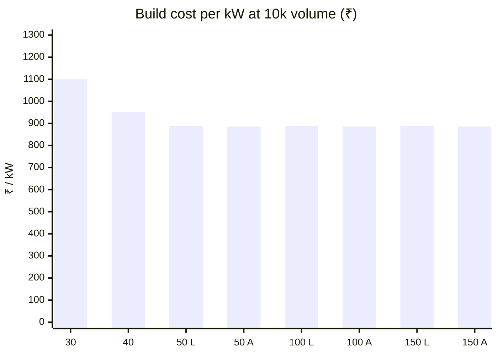

# 🧾 BOM & Cost Roll-up

Module and product cost from 100 pcs to 10k, and the ₹ / kW ladder

  
  
  
  

> [!NOTE]
> **Purpose** — what each module and product costs to build, from 100 pieces to 10k, and the ₹ / kW ladder that
> sets the product line. **Generated by `calculations/cost/bom-gen.mjs` on every battery run — do not hand-edit.**
>
> **Basis** — schematic-exact quantities from the built boards plus ONE control card per module (E40), parts-db
> RFQ-target pricing (A7 rev B, ±25 %), and mechanical/assembly lines from the thermal and DFM calculations.
> Line-item CSVs with second sources and the 10k column: `calculations/out/bom-{sku}.csv`.

| Volume tier | Electronics | Mechanical | Planning role |
|---|---|---|---|
| 100 pcs | × 1.35 | × 1.15 | prototype / pilot |
| 1k | × 1.00 | × 1.00 | parts-db reference |
| 5k | × 0.88 | × 0.93 | ramp |
| **10k** | **× 0.80 + per-part quotes (p10k)** | **× 0.87** | **planning basis** — customer volume directive 2026-09-05 (≥ 10k units/yr) |

## At a glance — cost at 10k against the red-line

| Build | ₹ @10k | ₹ / kW | Red-line | Stretch | Verdict |
|---|---:|---:|---:|---:|---|
| 30 kW module | **33,013** | 1,100 | 25,000 | 22,000 | ⚠️ over by ₹8,013 |
| 40 kW module | **38,048** | 951 | 33,000 | 29,000 | ⚠️ over by ₹5,048 |
| 50 kW liquid module | **44,376** | 888 | 43,000 | 39,000 | ⚠️ over by ₹1,376 |
| 50 kW air module | **44,317** | 886 | 43,000 | 39,000 | ⚠️ over by ₹1,317 |
| 150 kW air product (3 × 50a) | **1,32,951** | 886 | 1,29,000 | 1,17,000 | ⚠️ over by ₹3,951 |

## The ₹ / kW product ladder

| Product | Composition | ₹ @10k | **₹ / kW** |
|---|---|---:|---:|
| 30 kW module | 1 module · 1 card · air | 33,013 | **1100** |
| 40 kW module (E41) | 1 module · 1 card · air | 38,048 | **951** |
| 50 kW module (E42) | 1 module · 1 card · LIQUID | 44,376 | **888** |
| 50 kW module (E44) | 1 module · 1 card · AIR (paralleled LLC, 4 fans) | 44,317 | **886** |
| 100 kW | 2 x 50 · 2 cards · liquid | 88,752 | **888** |
| 100 kW air | 2 x 50a · 2 cards · air | 88,634 | **886** |
| 150 kW (3 x 50) | 3 x 50 · 3 cards · liquid (E66 no CSU) | 1,33,128 | **888** |
| 150 kW air (3 x 50a) | 3 x 50a · 3 cards · air (E66 no CSU) | 1,32,951 | **886** |

Every multi-module product standardizes on the 50 kW twins — the cheapest ₹ / kW in the family and the best N−1
granularity. The liquid compositions carry the sealed, fan-free reliability case (the cooling cart is charger-level,
E42 boundary); the air compositions are the cost headline. **E66:** the 150 kW carries no cabinet supervisor — the charger
controller is the group master for 100 and 150 kW alike — so build cost per kW is flat from 50 kW up on each cooling
line — a flat price per kW above 50 kW is accepted (E66 directive) rather than adding shared cabinet content, which would
reintroduce a single point of failure. The 150 kW keeps 67 % of its power with one module out (a 100 kW
keeps 50 %). The 60 / 80 / 120 kW compositions are retired (E55).

## 30 kW module — ₹33,013 @10k

**1k ₹40,720 · 5k ₹36,312 · 100 pcs ₹53,060** · red-line ₹25,000 / stretch ₹22,000 → ⚠️ over by ₹8,013

Cost by category (₹ @1k)

| Category | ₹ @1k | Share |
|---|---:|---:|
| mechanical/assembly | 9,561 | 23.5 % |
| semiconductors | 8,651 | 21.2 % |
| magnetics | 8,140 | 20 % |
| capacitors | 5,171 | 12.7 % |
| drive+control ICs | 3,378 | 8.3 % |
| bias/iso modules | 2,763 | 6.8 % |
| relays | 1,180 | 2.9 % |
| resistors/shunts | 655 | 1.6 % |
| protection | 457 | 1.1 % |
| connectors | 430 | 1.1 % |
| misc | 311 | 0.8 % |
| HMI | 24 | 0.1 % |

## 40 kW module — ₹38,048 @10k

**1k ₹46,929 · 5k ₹41,825 · 100 pcs ₹61,247** · red-line ₹33,000 / stretch ₹29,000 → ⚠️ over by ₹5,048

Cost by category (₹ @1k)

| Category | ₹ @1k | Share |
|---|---:|---:|
| semiconductors | 10,637 | 22.7 % |
| mechanical/assembly | 10,537 | 22.5 % |
| magnetics | 9,467 | 20.2 % |
| capacitors | 6,027 | 12.8 % |
| bias/iso modules | 3,393 | 7.2 % |
| drive+control ICs | 3,378 | 7.2 % |
| relays | 1,260 | 2.7 % |
| protection | 772 | 1.6 % |
| resistors/shunts | 675 | 1.4 % |
| connectors | 436 | 0.9 % |
| misc | 324 | 0.7 % |
| HMI | 24 | 0.1 % |

## 50 kW liquid module — ₹44,376 @10k

**1k ₹54,569 · 5k ₹48,702 · 100 pcs ₹70,942** · red-line ₹43,000 / stretch ₹39,000 → ⚠️ over by ₹1,376

Cost by category (₹ @1k)

| Category | ₹ @1k | Share |
|---|---:|---:|
| mechanical/assembly | 13,626 | 25 % |
| magnetics | 11,552 | 21.2 % |
| semiconductors | 10,637 | 19.5 % |
| capacitors | 7,523 | 13.8 % |
| bias/iso modules | 3,493 | 6.4 % |
| drive+control ICs | 3,378 | 6.2 % |
| relays | 1,880 | 3.4 % |
| protection | 922 | 1.7 % |
| resistors/shunts | 792 | 1.5 % |
| connectors | 418 | 0.8 % |
| misc | 324 | 0.6 % |
| HMI | 24 | 0 % |

## 50 kW air module — ₹44,317 @10k

**1k ₹54,706 · 5k ₹48,702 · 100 pcs ₹71,609** · red-line ₹43,000 / stretch ₹39,000 → ⚠️ over by ₹1,317

Cost by category (₹ @1k)

| Category | ₹ @1k | Share |
|---|---:|---:|
| semiconductors | 13,159 | 24.1 % |
| magnetics | 11,552 | 21.1 % |
| mechanical/assembly | 11,217 | 20.5 % |
| capacitors | 7,523 | 13.8 % |
| bias/iso modules | 3,493 | 6.4 % |
| drive+control ICs | 3,378 | 6.2 % |
| relays | 1,880 | 3.4 % |
| protection | 922 | 1.7 % |
| resistors/shunts | 792 | 1.4 % |
| connectors | 442 | 0.8 % |
| misc | 324 | 0.6 % |
| HMI | 24 | 0 % |

## 150 kW air product (3 × 50a) — ₹1,32,951 @10k

**1k ₹1,64,117 · 5k ₹1,46,106 · 100 pcs ₹2,14,827** · red-line ₹1,29,000 / stretch ₹1,17,000 → ⚠️ over by ₹3,951 · composition: 3x 50 kW modules, charger controller = group master (air basis; liquid = 3x 50kw)

Cost by category (₹ @1k)

| Category | ₹ @1k | Share |
|---|---:|---:|
| semiconductors | 39,476 | 24.1 % |
| magnetics | 34,655 | 21.1 % |
| mechanical/assembly | 33,651 | 20.5 % |
| capacitors | 22,568 | 13.8 % |
| bias/iso modules | 10,478 | 6.4 % |
| drive+control ICs | 10,135 | 6.2 % |
| relays | 5,640 | 3.4 % |
| protection | 2,766 | 1.7 % |
| resistors/shunts | 2,377 | 1.4 % |
| connectors | 1,326 | 0.8 % |
| misc | 973 | 0.6 % |
| HMI | 72 | 0 % |

## Red-line closure levers (10k basis)

> [!TIP]
> The generic volume break is already inside the 10k column, so no "5k break" lever is counted twice.

| Lever | Δ 30 kW module | Δ 50 kW module (est.) | Δ 150 kW product (est.) | Condition |
|---|---:|---:|---:|---|
| ~~Custom gate-bias transformer (E23/ECO-1)~~ **retired** — at 10k the module p10k (₹55) beats the custom set's risk-adjusted saving | 0 | 0 | 0 | closed decision, E23 rev B |
| ~~ECO-2a/2b (PV bleeder drivers, reinforced-module volume pricing)~~ **executed — in totals** | 0 | 0 | 0 | done at rev D |
| Magnetics winder RFQ below target (choke / transformer 10k prices) | −₹880 | −₹970 | −₹2,910 | quotes at committed volume |
| AC-DC board 4-layer (control zones only need 4) | −₹240 | −₹260 | −₹780 | layout phase confirms |
| Relay direct RFQ (Hongfa annual frame) | −₹400 | −₹520 | −₹1,560 | volume agreement |
| Fuse → MCB-coordinated external protection (charger-level) | −₹215 | −₹350 | −₹1,050 | system integrator accepts |
| **E63:** D6 DM chokes deleted after the EVT LISN scan proves the margin without them — the InfyPower benchmark ships no AC DM chokes (also −13…−24 W of loss) | −₹900 | −₹1,890 | −₹5,670 | EVT T-08 measured; the E43 floors stay until then |
| **E63/E64:** drop one bank string per bank — computed 2.1 A/can at 30 kW (2→1) and 1.4 A/can at 40/50 (3→2) against the ~2.8 A can class (verify-independent §F) | −₹480 | −₹640 [est] | −₹1,920 [est] | EVT output-ripple + S/P-transient measurement executes it |
| **E63:** gate-bias module second source (the OFAC requalification is already planned, E60) | −₹135 | −₹135 | −₹405 | requalified sample |
| **Sum of levers** | **−₹3,250** | **−₹4,765** | **−₹14,295** | |

The E63 rows come from the [InfyPower teardown benchmark](benchmark-infypower-teardown.md) gap audit; the deliberate
philosophy premium (protection, sensing, 3-φ LLC, relay class ≈ ₹5.2k [est] at 40 kW) is priced there and is **not**
on this table — spending it down is a product decision, not a lever.

Architecture-level options not taken without a directive (each changes the product): LV/HV fixed variants that delete
the S/P matrix (−₹3k+ at 30 kW, collapses the single 150–1000 V SKU), 750 V-class secondary diodes (−₹0.8k, thins the
E11 margin), and reversing the sandwich (−₹1.45k, conflicts with directive E17). Stretch targets remain a management
flag (R12).

## Directive cost impacts (recorded)

| Directive | Cost effect |
|---|---|
| Two-board sandwich (E17) | +1 PCB, studs and harness — ≈ +₹1,450 per module at 30 kW |
| HMI (2 buttons + 2-digit display + driver) | ≈ +₹45 |
| Pre-insertion relays + K_OUT (E12, safety-mandatory) | ≈ +₹800 at 30 kW |
| CTs replacing shunt + isolated-amplifier phase sensing (E18) | −₹240 net at 30 kW |

---

<a href="bom-guide.md">← BOM Guide</a> &nbsp;·&nbsp; <a href="README.md">🧭 Documentation hub</a> &nbsp;·&nbsp; <a href="lcsc-status.md">LCSC Assignment Status →</a>

Vectivolt DC-Modules · documentation rev E61 · every number reproduces with <code>sh calculations/run-all.sh</code>

