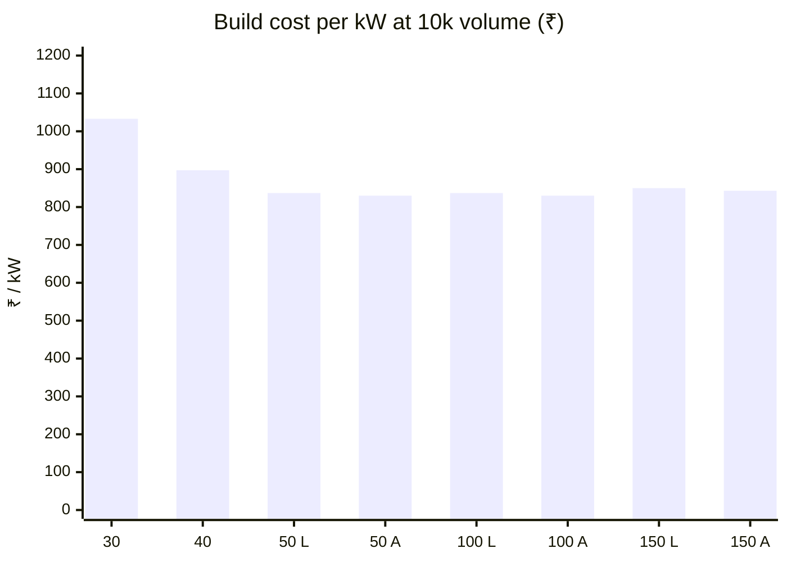

# 🧾 BOM & Cost Roll-up

Module and product cost from 100 pcs to 10k, and the ₹ / kW ladder

  
  
  
  

> [!NOTE]
> **Purpose** — what each module and product costs to build, from 100 pieces to 10k, and the ₹ / kW ladder that
> sets the product line. **Generated by `calculations/cost/bom-gen.mjs` on every battery run — do not hand-edit.**
>
> **Basis** — schematic-exact quantities from the built boards plus ONE control card per module (E40), parts-db
> RFQ-target pricing (A7 rev B, ±25 %), and mechanical/assembly lines from the thermal and DFM calculations.
> Line-item CSVs with second sources and the 10k column: `calculations/out/bom-{sku}.csv`.

| Volume tier | Electronics | Mechanical | Planning role |
|---|---|---|---|
| 100 pcs | × 1.35 | × 1.15 | prototype / pilot |
| 1k | × 1.00 | × 1.00 | parts-db reference |
| 5k | × 0.88 | × 0.93 | ramp |
| **10k** | **× 0.80 + per-part quotes (p10k)** | **× 0.87** | **planning basis** — customer volume directive 2026-09-05 (≥ 10k units/yr) |

## At a glance — cost at 10k against the red-line

| Build | ₹ @10k | ₹ / kW | Red-line | Stretch | Verdict |
|---|---:|---:|---:|---:|---|
| 30 kW module | **30,980** | 1,033 | 25,000 | 22,000 | ⚠️ over by ₹5,980 |
| 40 kW module | **35,891** | 897 | 33,000 | 29,000 | ⚠️ over by ₹2,891 |
| 50 kW liquid module | **41,865** | 837 | 43,000 | 39,000 | ✅ under by ₹1,135 |
| 50 kW air module | **41,516** | 830 | 43,000 | 39,000 | ✅ under by ₹1,484 |
| 150 kW air product (3 × 50a + CSU) | **1,26,382** | 843 | 1,30,834 | 1,18,834 | ✅ under by ₹4,452 |

## The ₹ / kW product ladder

| Product | Composition | ₹ @10k | **₹ / kW** |
|---|---|---:|---:|
| 30 kW module | 1 module · 1 card · air | 30,980 | **1,033** |
| 40 kW module (E41) | 1 module · 1 card · air | 35,891 | **897** |
| 50 kW module (E42) | 1 module · 1 card · LIQUID | 41,865 | **837** |
| 50 kW module (E44) | 1 module · 1 card · AIR (paralleled LLC, 4 fans) | 41,516 | **830** |
| 100 kW | 2 x 50 · 2 cards · liquid | 83,730 | **837** |
| 100 kW air | 2 x 50a · 2 cards · air | 83,032 | **830** |
| 150 kW (3 x 50) | 3 cards + CSU · liquid | 1,27,429 | **850** |
| 150 kW air (3 x 50a) | 3 cards + CSU · air | 1,26,382 | **843** |

Every multi-module product standardizes on the 50 kW twins — the cheapest ₹ / kW in the family and the best N−1
granularity. The liquid compositions carry the sealed, fan-free reliability case (the cooling cart is charger-level,
E42 boundary); the air compositions are the cost headline. Cabinet adder ₹1,834 (CSU card, carrier, WDR
supply, studs, CAN passives). **150 kW air (3 × 50a + CSU) is the cheapest multi-module ₹ / kW** and keeps 67 % of
its power with one module out (a 100 kW keeps 50 %). The 60 / 80 / 120 kW compositions are retired (E55).

## 30 kW module — ₹30,980 @10k

**1k ₹38,279 · 5k ₹34,137 · 100 pcs ₹49,872** · red-line ₹25,000 / stretch ₹22,000 → ⚠️ over by ₹5,980

Cost by category (₹ @1k)

| Category | ₹ @1k | Share |
|---|---:|---:|
| mechanical/assembly | 9,026 | 23.6 % |
| semiconductors | 7,957 | 20.8 % |
| magnetics | 7,421 | 19.4 % |
| capacitors | 5,192 | 13.6 % |
| drive+control ICs | 3,746 | 9.8 % |
| relays | 2,960 | 7.7 % |
| resistors/shunts | 707 | 1.8 % |
| protection | 457 | 1.2 % |
| connectors | 430 | 1.1 % |
| misc | 359 | 0.9 % |
| HMI | 24 | 0.1 % |
| bias/iso modules | 0 | 0 % |

## 40 kW module — ₹35,891 @10k

**1k ₹44,347 · 5k ₹39,517 · 100 pcs ₹57,900** · red-line ₹33,000 / stretch ₹29,000 → ⚠️ over by ₹2,891

Cost by category (₹ @1k)

| Category | ₹ @1k | Share |
|---|---:|---:|
| semiconductors | 9,943 | 22.4 % |
| mechanical/assembly | 9,842 | 22.2 % |
| magnetics | 8,941 | 20.2 % |
| capacitors | 6,500 | 14.7 % |
| drive+control ICs | 3,746 | 8.4 % |
| relays | 3,040 | 6.9 % |
| protection | 772 | 1.7 % |
| resistors/shunts | 727 | 1.6 % |
| connectors | 436 | 1 % |
| misc | 375 | 0.8 % |
| HMI | 24 | 0.1 % |
| bias/iso modules | 0 | 0 % |

## 50 kW liquid module — ₹41,865 @10k

**1k ₹51,529 · 5k ₹46,001 · 100 pcs ₹66,944** · red-line ₹43,000 / stretch ₹39,000 → ✅ under by ₹1,135

Cost by category (₹ @1k)

| Category | ₹ @1k | Share |
|---|---:|---:|
| mechanical/assembly | 13,102 | 25.4 % |
| magnetics | 10,106 | 19.6 % |
| semiconductors | 9,943 | 19.3 % |
| capacitors | 8,108 | 15.7 % |
| relays | 3,940 | 7.6 % |
| drive+control ICs | 3,746 | 7.3 % |
| protection | 922 | 1.8 % |
| resistors/shunts | 844 | 1.6 % |
| connectors | 418 | 0.8 % |
| misc | 375 | 0.7 % |
| HMI | 24 | 0 % |
| bias/iso modules | 0 | 0 % |

## 50 kW air module — ₹41,516 @10k

**1k ₹51,319 · 5k ₹45,687 · 100 pcs ₹67,176** · red-line ₹43,000 / stretch ₹39,000 → ✅ under by ₹1,484

Cost by category (₹ @1k)

| Category | ₹ @1k | Share |
|---|---:|---:|
| semiconductors | 12,289 | 23.9 % |
| mechanical/assembly | 10,522 | 20.5 % |
| magnetics | 10,106 | 19.7 % |
| capacitors | 8,108 | 15.8 % |
| relays | 3,940 | 7.7 % |
| drive+control ICs | 3,746 | 7.3 % |
| protection | 922 | 1.8 % |
| resistors/shunts | 844 | 1.6 % |
| connectors | 442 | 0.9 % |
| misc | 375 | 0.7 % |
| HMI | 24 | 0 % |
| bias/iso modules | 0 | 0 % |

## 150 kW air product (3 × 50a + CSU) — ₹1,26,382 @10k

**1k ₹1,55,791 · 5k ₹1,38,895 · 100 pcs ₹2,03,362** · red-line ₹1,30,834 / stretch ₹1,18,834 → ✅ under by ₹4,452 · composition: 3x 50 kW modules + CSU (air basis; liquid = 3x 50kw)

Cost by category (₹ @1k)

| Category | ₹ @1k | Share |
|---|---:|---:|
| semiconductors | 36,868 | 23.7 % |
| mechanical/assembly | 31,566 | 20.3 % |
| magnetics | 30,317 | 19.5 % |
| capacitors | 24,325 | 15.6 % |
| relays | 11,820 | 7.6 % |
| drive+control ICs | 11,239 | 7.2 % |
| protection | 2,766 | 1.8 % |
| resistors/shunts | 2,533 | 1.6 % |
| connectors | 1,326 | 0.9 % |
| misc | 1,126 | 0.7 % |
| HMI | 72 | 0 % |
| bias/iso modules | 0 | 0 % |

## Red-line closure levers (10k basis)

> [!TIP]
> The generic volume break is already inside the 10k column, so no "5k break" lever is counted twice.

| Lever | Δ 30 kW module | Δ 50 kW module (est.) | Δ 150 kW product (est.) | Condition |
|---|---:|---:|---:|---|
| ~~Custom gate-bias transformer (E23/ECO-1)~~ **retired** — at 10k the module p10k (₹55) beats the custom set's risk-adjusted saving | 0 | 0 | 0 | closed decision, E23 rev B |
| ~~ECO-2a/2b (PV bleeder drivers, reinforced-module volume pricing)~~ **executed — in totals** | 0 | 0 | 0 | done at rev D |
| Magnetics winder RFQ below target (choke / transformer 10k prices) | −₹880 | −₹970 | −₹2,910 | quotes at committed volume |
| AC-DC board 4-layer (control zones only need 4) | −₹240 | −₹260 | −₹780 | layout phase confirms |
| Relay direct RFQ (Hongfa annual frame) | −₹400 | −₹520 | −₹1,560 | volume agreement |
| Fuse → MCB-coordinated external protection (charger-level) | −₹215 | −₹350 | −₹1,050 | system integrator accepts |
| **Sum of levers** | **−₹1,735** | **−₹2,100** | **−₹6,300** | |

Architecture-level options not taken without a directive (each changes the product): LV/HV fixed variants that delete
the S/P matrix (−₹3k+ at 30 kW, collapses the single 150–1000 V SKU), 750 V-class secondary diodes (−₹0.8k, thins the
E11 margin), and reversing the sandwich (−₹1.45k, conflicts with directive E17). Stretch targets remain a management
flag (R12).

## Directive cost impacts (recorded)

| Directive | Cost effect |
|---|---|
| Two-board sandwich (E17) | +1 PCB, studs and harness — ≈ +₹1,450 per module at 30 kW |
| HMI (2 buttons + 2-digit display + driver) | ≈ +₹45 |
| Pre-insertion relays + K_OUT (E12, safety-mandatory) | ≈ +₹800 at 30 kW |
| CTs replacing shunt + isolated-amplifier phase sensing (E18) | −₹240 net at 30 kW |

---

<a href="bom-guide.md">← BOM Guide</a> &nbsp;·&nbsp; <a href="README.md">🧭 Documentation hub</a> &nbsp;·&nbsp; <a href="lcsc-status.md">LCSC Assignment Status →</a>

Vectivolt DC-Modules · documentation rev E61 · every number reproduces with <code>sh calculations/run-all.sh</code>

