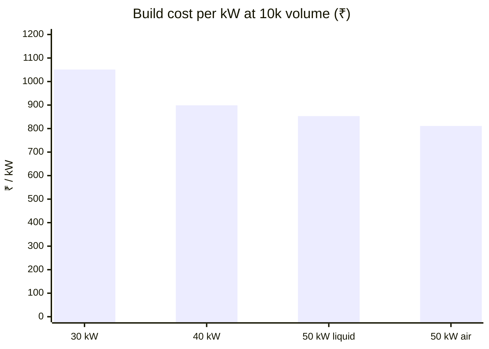

# 🧾 BOM & Cost Roll-up

Module cost from 100 pcs to 10k, the China RFQ targets and the cost per kW

  
  
  
  

> [!NOTE]
> **Purpose** — what each of the four modules costs to build, from 100 pieces to 10k, how that cost falls per kW from
> 30 to 50 kW, and the levers still open. **Generated by `calculations/cost/bom-gen.mjs` on every battery run — do not hand-edit.**
>
> **Basis** — schematic-exact quantities from the built boards plus ONE control card per module (E40), parts-db
> RFQ-target pricing (A7 rev B, ±25 %), and mechanical/assembly lines from the thermal and DFM calculations.
> Line-item CSVs with second sources and the 10k column: `calculations/out/bom-{sku}.csv`.

| Volume tier | Electronics | Mechanical | Planning role |
|---|---|---|---|
| 100 pcs | × 1.35 | × 1.15 | prototype / pilot |
| 1k | × 1.00 | × 1.00 | parts-db reference |
| 5k | × 0.88 | × 0.93 | ramp |
| **10k** | **× 0.80 + per-part quotes (p10k)** | **× 0.87** | **planning basis** — customer volume directive 2026-09-05 (≥ 10k units/yr) |

## At a glance — cost at 10k against the red-line

> [!IMPORTANT]
> **China RFQ target (E69f)** — the same BOM at landed China-supplier TARGET prices (freight + ~10 % duty included), by category:
> SiC/JBS/diodes × 0.75 · magnetics, film and electrolytic capacitors × 0.80 · gate/iso ICs, bias modules, relays, protection ×
> 0.85 · passives, connectors, MLCC × 0.90 · PCBs × 0.75 · mechanical × 0.85 · India assembly/EOL × 1.00. These are the prices an
> RFQ must reach for the InfyPower parity comparison — **flagged targets, not quotes**.

| Build | ₹ @10k | ₹ / kW | China RFQ target ₹ @10k | ₹ / kW | Red-line | Stretch | Verdict (India basis) |
|---|---:|---:|---:|---:|---:|---:|---|
| 30 kW module | **31,533** | 1,051 | 25,852 | 862 | 25,000 | 22,000 | ⚠️ over by ₹6,533 |
| 40 kW module | **35,970** | 899 | 29,418 | 735 | 33,000 | 29,000 | ⚠️ over by ₹2,970 |
| 50 kW liquid module | **42,628** | 853 | 34,922 | 698 | 43,000 | 39,000 | ✅ under by ₹372 |
| 50 kW air module | **40,555** | 811 | 33,142 | 663 | 43,000 | 39,000 | ✅ under by ₹2,445 |

### Scenario — InfyPower-style 2U construction (E69e, not the design basis)

Same electronics; only the mechanical and assembly lines change to the `mech2U` estimates in `parts-db.mjs`: heatsink chassis
with the magnetics potted into wells, 4-layer boards at about half today's area, 3 × 80 mm fans. **Prerequisites no gate has proven:**
the PFC choke must lie in a well (today's T79 stacks stand 60–95 mm; 40 kW needs a flat-core choke), the chassis must hold the
70 °C device base at 55 °C ambient, and potting must match the two-face magnetics bond. Numbers are estimates until a mechanical
design and quotes exist.

| Build | Design basis ₹ @10k | 2U scenario ₹ @10k | 2U scenario + China RFQ target |
|---|---:|---:|---:|
| 30 kW module | 31,533 | 29,611 | **24,288** |
| 40 kW module | 35,970 | 34,034 | **27,833** |

## Cost per kW across the family

| Module | Cooling | ₹ @10k | **₹ / kW** |
|---|---|---:|---:|
| 30 kW module | air · 3 fans | 31,533 | **1051** |
| 40 kW module | air · 3 fans | 35,970 | **899** |
| 50 kW liquid module | two coldplates · no fans | 42,628 | **853** |
| 50 kW air module | air · 4 fans | 40,555 | **811** |

Cost per kW falls from 30 to 40 to 50 kW because the control card, the enclosure, the AC entry and the auxiliary supply are
shared content that does not grow with power. The two 50 kW twins share their electronics; the air twin is the cost headline,
and the liquid twin carries the sealed, fan-free reliability case with its cooling loop at the charger level (E42 boundary).

## Per-module BOM pages

Each module has its own generated page — cost by schematic section, the parts that make that SKU different, every line item and
its sourcing status.

| Module | ₹ @10k | China target | 1k · 5k · 100 pcs | Lines | Page |
|---|---:|---:|---|---:|---|
| 30 kW module | **31,533** | 25,852 | 38,832 · 34,676 · 50,409 | 153 | [bom-30kw.md](bom-30kw.md) |
| 40 kW module | **35,970** | 29,418 | 44,270 · 39,497 · 57,605 | 171 | [bom-40kw.md](bom-40kw.md) |
| 50 kW liquid module | **42,628** | 34,922 | 52,325 · 46,738 · 67,870 | 175 | [bom-50kw.md](bom-50kw.md) |
| 50 kW air module | **40,555** | 33,142 | 49,946 · 44,524 · 65,139 | 177 | [bom-50kwa.md](bom-50kwa.md) |

## Red-line closure levers (10k basis)

> [!TIP]
> The generic volume break is already inside the 10k column, so no "5k break" lever is counted twice.

| Lever | Δ 30 kW module | Δ 50 kW module (est.) | Condition |
|---|---:|---:|---|
| ~~Custom gate-bias transformer (E23/ECO-1)~~ **retired** — at 10k the module p10k (₹55) beats the custom set's risk-adjusted saving | 0 | 0 | closed decision, E23 rev B |
| ~~ECO-2a/2b (PV bleeder drivers, reinforced-module volume pricing)~~ **executed — in totals** | 0 | 0 | done at rev D |
| Magnetics winder RFQ below target (choke / transformer 10k prices) | −₹880 | −₹970 | quotes at committed volume |
| AC-DC board 4-layer (control zones only need 4) | −₹240 | −₹260 | layout phase confirms |
| Relay direct RFQ (Hongfa annual frame) | −₹400 | −₹520 | volume agreement |
| Fuse → MCB-coordinated external protection (charger-level) | −₹215 | −₹350 | system integrator accepts |
| ~~**E63:** D6 DM chokes deleted~~ **executed at E68b — in totals** (star-X2 filter, DM margin +32.9 / +30.6 / +28.7 dB) | 0 | 0 | EVT T-08 / T-39 confirm |
| ~~**E63/E64:** drop one bank string per bank~~ **superseded at E68c — in totals** (film-only banks, no bank electrolytic) | 0 | 0 | EVT T-40 confirms |
| **E69:** drive clone — gate-drive transformers on the LLC, opto PFC drivers on aux-winding bias, bridge shunt comparator (approved, not executed) | −₹400 [est] | −₹470 [est] | GDT design, D4 re-wind, new trip evidence |
| **E69:** 900 V half-link aux flyback · 90 A relays · 500 VAC fuses | −₹450 [est] | −₹450 [est] | D4 redesign + midpoint duty; relay carry at 89 % vs the 80 % rule |
| **E63:** gate-bias module second source (the OFAC requalification is already planned, E60) | −₹135 | −₹135 | requalified sample |
| **Sum of open levers** | **−₹2,720** | **−₹3,155** | |

The E63 rows come from the [InfyPower teardown benchmark](benchmark-infypower-teardown.md) gap audit; the deliberate
philosophy premium (protection, sensing, relay class — the E62 estimate also counted the 3-φ LLC, which E67 replaced) is priced there and is **not**
on this table — spending it down is a product decision, not a lever.

Architecture-level options not taken without a directive (each changes the product): LV/HV fixed variants that delete
the S/P matrix (−₹3k+ at 30 kW, collapses the single 150–1000 V SKU), 750 V-class secondary diodes (−₹0.8k, thins the
E11 margin), and reversing the sandwich (−₹1.45k, conflicts with directive E17). Stretch targets remain a management
flag (R12).

## Directive cost impacts (recorded)

| Directive | Cost effect |
|---|---|
| Two-board sandwich (E17) | +1 PCB, studs and harness — ≈ +₹1,450 per module at 30 kW |
| HMI (2 buttons + 2-digit display + driver) | ≈ +₹45 |
| Output blocking diode DOUT replacing K_OUT and the pre-insertion relays (E67, InfyPower practice) | the E12 relay set (≈ ₹800 at 30 kW) removed; DOUT ₹336–496 @10k added |
| CTs replacing shunt + isolated-amplifier phase sensing (E18) | −₹240 net at 30 kW |

---

<a href="../spice/README.md">← SPICE Simulation Suites</a> &nbsp;·&nbsp; <a href="README.md">🧭 Documentation hub</a> &nbsp;·&nbsp; <a href="bom-30kw.md">30 kW Module BOM →</a>

Vectivolt DC-Modules · documentation rev E81 · every number reproduces with <code>sh calculations/run-all.sh</code>

