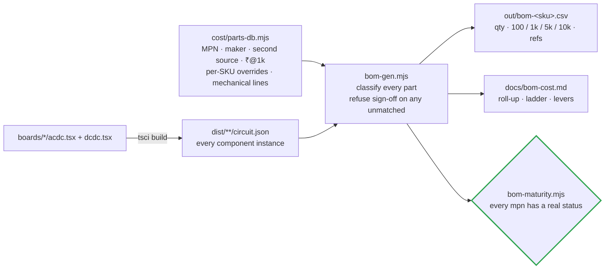
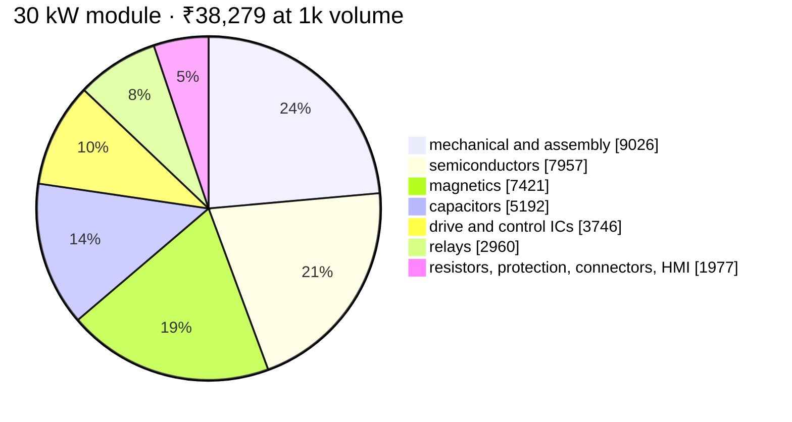

# 📚 BOM Guide

How the BOM is generated from the built boards, and what each maturity status means

  
  
  
  

> [!NOTE]
> **Purpose** — how the BOM is produced from the built boards, what drives each cost block, how prices break with
> volume, where each SKU stands against its red-line, and what the maturity statuses mean.

## How the BOM is made

The BOM is **not a spreadsheet someone typed** — it is generated from the built boards (four module SKUs, the card
and the cabinet):

Regenerate after any board or parts change: build the netlists, then `node calculations/cost/bom-gen.mjs`. The
generator **fails loudly on unmatched components** — "BOM complete" is a computed state, not an opinion. Current
state: **100 % matched on every board**; the 30 kW module BOM has 134 electronic lines plus the mechanical lines.

## Where a 30 kW rupee goes

<table>
<tr><td valign="top" width="46%">

</td><td valign="top" width="54%">

| Category | ₹ @1k | What drives it |
|---|---:|---|
| **Mechanical / assembly** | 9,026 | two 6-layer PCBs (the sandwich adds ≈ ₹1.45k), two extrusions, IP55 fans, enclosure, busbars, conformal coating, assembly + EOL with the mandatory 2-point calibration |
| **Semiconductors** | 7,957 | 6 × 750 V Vienna switches, 6 × 1200 V LLC switches, 24 × 1200 V JBS bridge diodes (beat SR on ₹/W cooling economics, E11), 6 × 40 A boost JBS that block the full bus, clamp and discharge devices |
| **Magnetics** | 7,421 | 3 × D1 PFC chokes (₹1,035 each: 3-stack OD79 sendust + wound copper), 3 × D3 transformers (₹680), trims, CM chokes, CTs — real wound assemblies, not catalog placeholders |
| **Capacitors** | 5,192 | 18 × 470 µF / 450 V (split bus + 2-series bank strings), 12 × 1200 V resonant pulse film, commutation and output film, X1 / Y1 EMI caps |
| **Drive and control** | 3,746 | 9 × NSI6611 drivers, 9 × QA01C-18 bias modules, one GD32G553VET7 (E40), isolated amplifiers, CAN transceiver, relay drivers |
| **Relays** | 2,960 | precharge bypass, S/P matrix with pre-insertion, K_OUT — the safety architecture the S/P simulation forced (a hard close across 2 V = 205 A, E12) |
| **Everything else** | 1,977 | resistors and shunt, protection (fuses, MOV, GDT), connectors, HMI |

</td></tr>
</table>

## Price basis and volume breaks

| Tier | Electronics | Mechanical | Role |
|---|---|---|---|
| 100 pcs | × 1.35 | × 1.15 | prototype and pilot |
| 1k | × 1.00 | × 1.00 | parts-db reference — direct-manufacturer RFQ target, assumption A7 (± 25 %) |
| 5k | × 0.88 | × 0.93 | ramp |
| **10k** | **× 0.80 + per-part `p10k` quotes** | **× 0.87** | **planning basis** since the ≥ 10k units/yr directive (A7 rev B) |

Never LCSC retail. Every line carries a **second source** (§49-22), and every custom part carries a drawing
reference so any winder or fabricator can quote.

## Where each SKU stands against its red-line (10k basis)

> [!TIP]
> **E63:** the closure levers grew to **−₹3,250 / −₹4,765 / −₹14,295** (30 kW / 50 / 150 air), every row gated —
> see the [lever table](bom-cost.md#red-line-closure-levers-10k-basis) and the
> [gap audit](benchmark-infypower-teardown.md#closing-the-economic-gap--the-e63-lever-audit): the 40 kW red-line
> closes with the protection philosophy intact; the 30 kW residual is platform overhead with three named exits.

| Build | ₹ @10k | Red-line | Gap | ₹ / kW |
|---|---:|---:|---:|---:|
| 30 kW module | 30,980 | 25,000 | **+5,980 over** | 1,033 |
| 40 kW module | 35,891 | 33,000 | **+2,891 over** | 897 |
| 50 kW liquid module | 41,865 | 43,000 | −1,135 under | 837 |
| 50 kW air module | 41,516 | 43,000 | −1,484 under | 830 |
| 150 kW air product | 1,26,382 | 1,30,834 | −4,452 under | 843 |

> [!WARNING]
> **The 30 and 40 kW gaps are real and documented, not massaged.** Executed levers are already inside the totals;
> the remaining levers are external (magnetics, relay and SiC RFQs, 4-layer AC-DC confirmation) and are quantified
> with their trigger conditions in the [cost roll-up](bom-cost.md). Stretch targets are not reachable in this
> architecture — a standing management flag (R12), on purpose. Not yet priced: the E60 IP55 fans and −40 °C-category
> capacitors (est. + ₹0.5–0.9k per module) and the busbar lines that sit below the computed sets at 40 / 50 kW.

## BOM maturity (E57 — standing gate)

> [!IMPORTANT]
> `calculations/cost/bom-maturity.mjs` (in run-all) FAILS the battery if any mpn the BOM can
> emit is UNMAPPED in `lcsc-map.mjs`, or carries a status with no substance. The taxonomy:
> **ORDERABLE** (verified catalog part) · **SECOND-SOURCE** (verified equivalent named) ·
> **DIRECT** (vendor-direct order code documented — Talema, Hongfa, MeanWell class) ·
> **CLASS** (rating specified, purchasing selects — spec line + candidates mandatory) ·
> **CUSTOM** (built to our drawing — the magnetics pack) · **REVIEW** (tracked open decision —
> allowed only with an actionable note). "Generic, widely available, cheap" is enforced by
> construction: no invented order codes, every class names real candidate families, and the
> remaining REVIEW list IS the open sourcing worklist.

---

<a href="component-selection.md">← Component Selection</a> &nbsp;·&nbsp; <a href="README.md">🧭 Documentation hub</a> &nbsp;·&nbsp; <a href="bom-cost.md">BOM & Cost Roll-up →</a>

Vectivolt DC-Modules · documentation rev E61 · every number reproduces with <code>sh calculations/run-all.sh</code>

