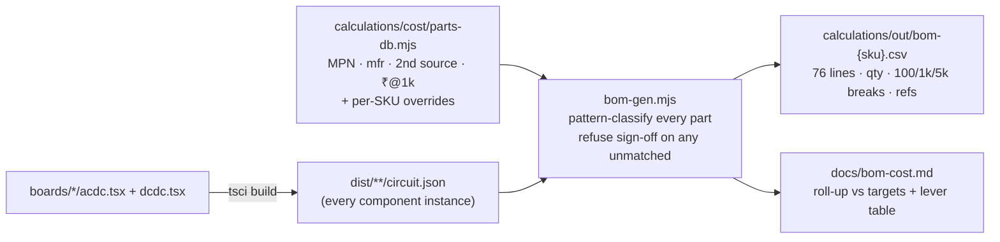
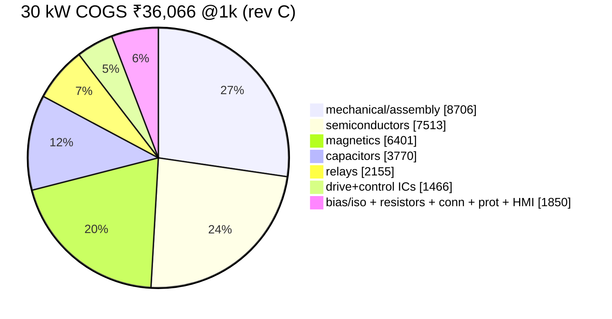

# BOM Guide — how the numbers are made, and what they mean 💰

The BOM is **not a spreadsheet someone typed** — it is generated from the built boards (four module SKUs + card + cabinet):

Regenerate any time: `npx tsci build boards/<sku>/{acdc,dcdc}.tsx` then
`node calculations/cost/bom-gen.mjs`. The generator **fails loudly on unmatched components** —
"BOM complete" is a computed state, not an opinion. Current state: **100 % matched, all six boards.**

## Where a 30 kW rupee goes

## Category walkthrough — why each block costs what it costs

| Category | 30 kW ₹ | What's inside & the reasoning |
|---|---|---|
| **Mechanical/assembly** | 8,706 | two 6-layer PCBs (the sandwich directive costs ≈ +₹1.45k vs single-board — recorded, not hidden), two heatsink extrusions, fans, enclosure, calc-backed busbar set (₹724), assembly + **EOL incl. the mandatory 2-point cal** (Monte-Carlo showed pre-cal accuracy is ±0.7 % vs the ±0.5 % spec — calibration isn't optional) |
| **Semiconductors** | 7,513 | 6× 750 V/10 mΩ (Vienna pairs), 6× 1200 V/23 mΩ (LLC), 24× 1200 V/20 A JBS (bridges — beat SR at ₹28/W cooling economics, E11), 6× 40 A boost JBS (they block the **full** bus — 1200 V is required, not margin), clamp diodes, discharge FET |
| **Magnetics** | 6,401 | the honest number: 3 chokes at ₹1,035 each are real wound assemblies (3-stack OD79 cores + 13.75 mm² copper), not catalog fantasies; 3× PQ50 transformer stacks with TIW + shields + PD sample-test burden; CM chokes; CTs. The Phase-1 estimate was ₹2.7k — real design tripled it, and the register says so |
| **Capacitors** | 3,770 | 14× 470 µF/450 V (split bus + banks), 12× 1200 V pulse-rated resonant film (46 nF, ±5 %, binned system), commutation/output film, X2/Y2 |
| **Relays** | 2,155 | the safety architecture found by simulation: hard-paralleling banks at 2 V mismatch = **205 A** through a closing contact → pre-insertion aux relays + resistors, plus K_OUT with its matched-voltage gate (E12/E12b) |
| **Drive + control** | 1,466 | 9× NSI6611 (DESAT/Miller/UVLO — non-negotiable §24 hardware layer), 2× GD32G553, ULN drivers, iso-amps, CAN |
| **Bias/iso** | 546→ modules | **E23 deferred to ECO-1** (review HR-10: the BOM priced the custom set while the schematic drew modules — unbuildable divergence). Rev C ships ₹95 QA01C-class modules per channel in BOTH schematic and BOM; the −₹0.9k @30 kW lever returns with drawing D5 (C_io ≤ 10 pF spec). Rev C also *adds* the iso voltage-sense set (E25) to this category |

## Price basis & breaks

- `₹@1k` = direct-manufacturer RFQ-target at ~1000-module aggregate volume, **assumption A7, ±25 %** until quotes land. Never LCSC retail.
- Breaks: 100 pc = ×1.35 (electronics) / ×1.15 (mech); 5000 pc = ×0.88 / ×0.93; **10k pc = ×0.80 / ×0.87 + per-part `p10k` quote overrides — the planning basis since the ≥10k units/yr directive (A7 rev B, 2026-09-05)** — heuristics pending real quote ladders at RFQ round 1.
- Every line carries a **second source** (§49-22); single-sourced customs (chokes, transformers) carry drawing references D1–D5 so any winder can quote.

## The red-line problem, stated plainly

| @1k (pre-cabinet snapshot — live totals in `bom-cost.md`) | 30 kW | 60 kW | 120 kW |
|---|---|---|---|
| **Actual (BOM-exact, rev C)** | ₹36,066 | ₹61,415 | ₹114,833 |
| Red-line | 25,000 | 42,000 | 78,000 |
| Gap | **+6,861** | **+13,319** | **+26,555** |

The gap is real and documented, not massaged. Executed levers are already inside the totals;
the remaining levers are external (magnetics/relay/SiC RFQs, 4-layer AC-DC confirmation, the
120 kW partial de-commonization option worth −₹6.1k) and are individually quantified with their
trigger conditions in [`bom-cost.md`](bom-cost.md). **Stretch targets are not reachable in this
architecture** — that sentence is a standing management flag (risk R12), on purpose.
