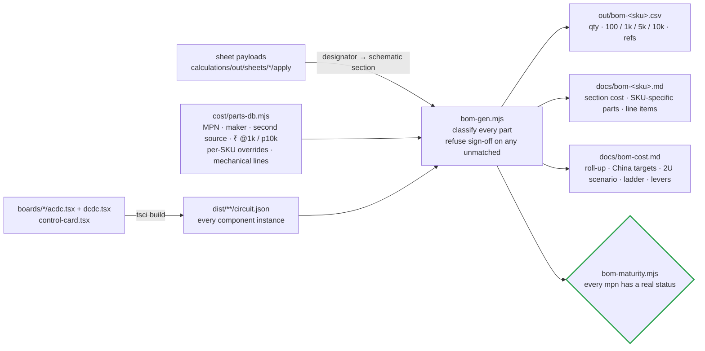

# 📚 BOM Guide

How the BOM is generated from the built boards, and what each maturity status means

  
  
  
  

> [!NOTE]
> **Purpose** — how the bill of materials is produced from the built boards, how prices are based and break with volume,
> what each sourcing status means and the policy behind it. The numbers themselves are generated: the family roll-up in
> [BOM & cost](bom-cost.md) and one page per module — [30 kW](bom-30kw.md) · [40 kW](bom-40kw.md) ·
> [50 kW liquid](bom-50kw.md) · [50 kW air](bom-50kwa.md).

## At a glance

| | |
|---|---|
| **Source of truth** | the **built boards** — `tsci` netlists + the audited sheet payloads, never a typed spreadsheet |
| **Price basis** | `cost/parts-db.mjs` ₹ @1k with a p10k break; the China column is a landed **target**, not a quote |
| **Family total @10k** | ₹31,533 · 35,970 · 42,628 · 40,555 → [BOM & cost](bom-cost.md) |
| **Gate** | `bom-maturity` — every line ORDERABLE / SECOND-SOURCE / DIRECT / CLASS(spec) / CUSTOM(drawing) / tracked-REVIEW, or the battery stops |
| **Open REVIEW lines** | 9 on live BOM lines (C-number read-back is purchasing work, listed on each module page) |

## 1. How the BOM is made

The BOM is **not a spreadsheet someone typed** — it is generated from the built boards and the audited release sheets:

Regenerate after any board or parts change: build the netlists, run the sheet pipeline, then
`node calculations/cost/bom-gen.mjs`. The generator **fails loudly on unmatched components** — "BOM complete" is a computed
state, not an opinion. Each module page groups cost by the schematic sheet section a part is drawn on, so a line on the page
is found on the sheet of the same name.

## 2. Price basis and volume breaks

| Tier | Electronics | Mechanical | Role |
|---|---|---|---|
| 100 pcs | × 1.35 | × 1.15 | prototype and pilot |
| 1k | × 1.00 | × 1.00 | parts-db reference — direct-manufacturer RFQ target, assumption A7 (± 25 %) |
| 5k | × 0.88 | × 0.93 | ramp |
| **10k** | **× 0.80 + per-part `p10k` quotes** | **× 0.87** | **planning basis** since the ≥ 10k units / yr directive (A7 rev B) |
| China RFQ target (E69f) | semis × 0.75 · magnetics and capacitors × 0.80 · ICs, modules, relays, protection × 0.85 · passives, connectors × 0.90 | PCBs × 0.75 · other mechanical × 0.85 · India assembly × 1.00 | the landed price a China RFQ must reach — a flagged target, not a quote; duty per HSN code to confirm with a customs broker |

Never LCSC retail. Every line carries a **second source**, and every custom part carries a drawing — the module
[magnetics pages](magnetics.md#the-four-module-pages) — so any winder or fabricator can quote.

## 3. Sourcing statuses

| Status | On the sheet | Meaning | Who acts |
|---|---|---|---|
|  | the C-number, or `ORDERABLE` for a wide-distribution part | a specific part, verified against the rating | purchasing orders it |
|  | the equivalent's C-number | the primary is off-catalogue; a verified equivalent is named — requalify before switching | purchasing and qualification |
|  | `DIRECT` | a vendor-direct order code (Talema, Hongfa, Mean Well class) | purchasing, on a direct account |
|  | `CLASS` | the rating **is** the specification; purchasing selects to the spec line | purchasing, to the spec line |
|  | `CUSTOM` | built to our drawing — a module magnetics page | winder or assembler, to the drawing |
|  | the C-number or `REVIEW` | a tracked open decision; the map entry carries its action note | engineering, before release |

A value-resolved passive (a 10 k 0603 resistor, a 100 nF MLCC) takes its part number from `LCSC_BY_VALUE` in
`lcsc-map.mjs`, keyed on family, value and the **drawn land** — the land on the sheet decides the package, never the other way round.

## 4. Sourcing policy

- **Two qualified vendors** for every power semiconductor position before production sign-off; qualification is the double-pulse
  simulation with that vendor's model plus a sample double-pulse bench test at EVT.
- **RFQ acceptance lines are part of the design.** The right-sized SiC dies carry pulsed-current lines (SG2M023120LJ IDM ≥ 265 A;
  750 V 20 mΩ class ≥ 210 A; 15 mΩ class ≥ 260 A) — a part that misses its line reverts that SKU ([protection thresholds](protection-thresholds.md)).
- **RFQ round 1** issues with the drive specification fixed, so quotes are comparable — SiC vendors, NOVOSENSE, GigaDevice,
  Hongfa, film-capacitor makers and the core and winding houses, in India and China.
- **Lifecycle** — every candidate is an active, volume part as of 2026-09; re-verified at RFQ.
- **LCSC-only parts** (no direct manufacturer line) are not accepted for the production BOM.

## 5. BOM maturity — the standing gate

> [!IMPORTANT]
> `calculations/cost/bom-maturity.mjs` (in run-all) **fails the battery** if any part number the BOM can emit is unmapped in
> `lcsc-map.mjs`, or carries a status with no substance. "Generic, widely available, cheap" is enforced by construction: no
> invented order codes, every class names real candidate families, and the REVIEW lines listed on each module page are the
> open sourcing worklist.

> [!TIP]
> **How this page is checked** — `bom-maturity` in `run-all` — every BOM line must be ORDERABLE, SECOND-SOURCE, DIRECT, CLASS(spec), CUSTOM(drawing) or a tracked REVIEW, or the battery stops.

---

<a href="bom-50kwa.md">← 50 kW Air Module BOM</a> &nbsp;·&nbsp; <a href="README.md">🧭 Documentation hub</a> &nbsp;·&nbsp; <a href="symbol-pin-map.md">Symbol → Package Pin Map →</a>

Vectivolt DC-Modules · documentation rev E81 · every number reproduces with <code>sh calculations/run-all.sh</code>

