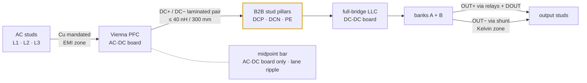

# 🔩 Busbar Drawings & Joint Spec

Bulk-copper paths, sections, lengths, joints and the torque schedule

  
  
  
  

> [!NOTE]
> **Purpose** — every bulk-current copper path in a module: the current it carries, its section, resistance, loss,
> temperature rise and inductance, whether aluminium is allowed, and how each joint is made.
> **Generated by `calculations/busbar/busbar-calc.mjs` — do not hand-edit.** Machine table: `calculations/out/busbar.csv`.

## Where the bulk current flows

## Construction rules (all SKUs)

| Rule | Value |
|---|---|
| Material | ETP copper, tin-plated 3–5 µm, bend radius ≥ 1.5 × t, chamfered edges |
| Sizing | J ≤ 3 A/mm² (Cu), 15 mm² mechanical minimum; R at 90 °C; ΔT from h = 25 W/m²K on exposed area |
| Insulation | heat-shrink 1 kV class except joint pads; OUT± keep 6.3 mm creepage to chassis ([insulation coordination](insulation-coordination.md)) |
| DC± | laminated pair from PFC output to the B2B studs, ≤ 2 mm spacing with Nomex between; loop target ≤ 40 nH / 300 mm |
| Aluminium | only on paths marked *Al viable*: ≥ 2 A/mm² sizing, Cu–Al bimetal washers, alodine + joint compound, re-torque at 24 h, creep-rated hardware. EMI filter joints, commutation loops and the shunt Kelvin zone stay copper |

> [!IMPORTANT]
> **Thermal acceptance:** the worst bar ΔT at rated current is 9 K against the 25 K line; bars share the tunnel airflow.

## Sizing per SKU

### 30 kW — 54.9 A line · 39 A bus · 100 A output

| Path | I rms (A) | W × T (mm) | J (A/mm²) | R (µΩ, 90 °C) | Loss (W) | ΔT (K) | L (nH) | Aluminium verdict |
|---|---:|---:|---:|---:|---:|---:|---:|---|
| AC L1/L2/L3 (each) | 54.9 | 10 × 2 | 2.75 | 256 | 0.8 | 5 | 211 | Cu mandated |
| DC+ (PFC→studs→LLC) | 39 | 9 × 2 | 2.17 | 342 | 0.5 | 3 | 270 | Cu mandated |
| DC− return | 39 | 9 × 2 | 2.17 | 342 | 0.5 | 3 | 270 | Cu mandated |
| MIDPOINT (AC-DC board only) | 19.2 | 9 × 2 | 1.07 | 205 | 0.1 | 1 | 144 | Al viable, saves ₹24 (bimetal joint reqd) |
| OUT+ (banks→relays→stud) | 100 | 13 × 3 | 2.56 | 158 | 1.6 | 7 | 247 | Al viable, saves ₹120 (bimetal joint reqd) |
| OUT− (shunt path) | 100 | 13 × 3 | 2.56 | 158 | 1.6 | 7 | 247 | Cu mandated |
| B2B stud pillar (each of DCP/DCN) | 39 | 9 × 2 | 2.17 | 34 | 0.1 | 3 | 13 | Al not worth joint cost |

Busbar set ≈ **₹724** (copper × 1.6 fabrication) · BOM mechanical line "busbars + studs + harness" ₹724.

### 40 kW — 73.2 A line · 52 A bus · 133 A output

| Path | I rms (A) | W × T (mm) | J (A/mm²) | R (µΩ, 90 °C) | Loss (W) | ΔT (K) | L (nH) | Aluminium verdict |
|---|---:|---:|---:|---:|---:|---:|---:|---|
| AC L1/L2/L3 (each) | 73.2 | 12 × 3 | 2.03 | 142 | 0.8 | 4 | 200 | Cu mandated |
| DC+ (PFC→studs→LLC) | 52 | 10 × 2 | 2.6 | 308 | 0.8 | 5 | 265 | Cu mandated |
| DC− return | 52 | 10 × 2 | 2.6 | 308 | 0.8 | 5 | 265 | Cu mandated |
| MIDPOINT (AC-DC board only) | 25.6 | 9 × 2 | 1.42 | 205 | 0.1 | 1 | 144 | Al viable, saves ₹23 (bimetal joint reqd) |
| OUT+ (banks→relays→stud) | 133 | 15 × 3 | 2.96 | 137 | 2.4 | 9 | 240 | Al viable, saves ₹138 (bimetal joint reqd) |
| OUT− (shunt path) | 133 | 15 × 3 | 2.96 | 137 | 2.4 | 9 | 240 | Cu mandated |
| B2B stud pillar (each of DCP/DCN) | 52 | 10 × 2 | 2.6 | 31 | 0.1 | 5 | 13 | Al not worth joint cost |

Busbar set ≈ **₹953** (copper × 1.6 fabrication) · BOM mechanical line "busbars + studs + harness" ₹810 — reconcile at the mechanical RFQ.

### 50 kW (liquid and air share every bulk current) — 91.6 A line · 65 A bus · 167 A output

| Path | I rms (A) | W × T (mm) | J (A/mm²) | R (µΩ, 90 °C) | Loss (W) | ΔT (K) | L (nH) | Aluminium verdict |
|---|---:|---:|---:|---:|---:|---:|---:|---|
| AC L1/L2/L3 (each) | 91.6 | 13 × 3 | 2.35 | 131 | 1.1 | 6 | 197 | Cu mandated |
| DC+ (PFC→studs→LLC) | 65 | 11 × 2 | 2.95 | 280 | 1.2 | 6 | 260 | Cu mandated |
| DC− return | 65 | 11 × 2 | 2.95 | 280 | 1.2 | 6 | 260 | Cu mandated |
| MIDPOINT (AC-DC board only) | 32.1 | 9 × 2 | 1.78 | 205 | 0.2 | 2 | 144 | Al viable, saves ₹22 (bimetal joint reqd) |
| OUT+ (banks→relays→stud) | 167 | 17 × 4 | 2.46 | 90 | 2.5 | 8 | 231 | Al viable, saves ₹225 (bimetal joint reqd) |
| OUT− (shunt path) | 167 | 17 × 4 | 2.46 | 90 | 2.5 | 8 | 231 | Cu mandated |
| B2B stud pillar (each of DCP/DCN) | 65 | 11 × 2 | 2.95 | 28 | 0.1 | 6 | 12 | Al not worth joint cost |

Busbar set ≈ **₹1188** (copper × 1.6 fabrication) · BOM mechanical line "busbars + studs + harness" ₹850 — reconcile at the mechanical RFQ.

## Joint schedule (all SKUs)

| Joint | Hardware | Torque | Acceptance |
|---|---|---:|---|
| B2B stud pillars DCP / DCN / PE | M8 × 1.25, Belleville + flat washer | 12 N·m | ≤ 50 µΩ each (EOL milliohm check) |
| Relay lugs (KSER / KPARA / KPARB) | M6 | 8 N·m | ≤ 80 µΩ |
| Shunt terminals | M8, Kelvin taps untouched | 12 N·m | calibration validates |
| AC input studs | M8 | 12 N·m | ≤ 60 µΩ |
| Choke centre bolt (D1 stacks) | M6 + silicone pad; ≥ 3 kg stacks add two-point banding | first article | leads are soldered flying leads — the old M5 lug row predated D1 rev B |

---

<a href="insulation-coordination.md">← Insulation Coordination</a> &nbsp;·&nbsp; <a href="README.md">🧭 Documentation hub</a> &nbsp;·&nbsp; <a href="magnetics.md">Magnetics Hub →</a>

Vectivolt DC-Modules · documentation rev E71 · every number reproduces with <code>sh calculations/run-all.sh</code>

