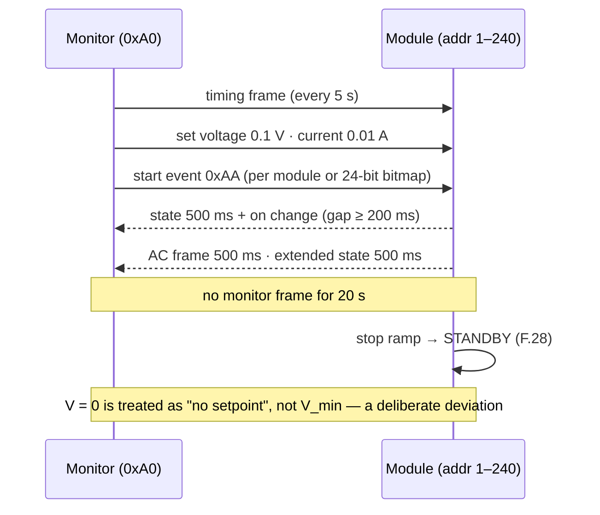

# 🔁 TonHe V1.2 Compatibility Profile

How a module on the TonHe V1.2 profile behaves on the wire, what it maps to inside, and every ambiguity resolved

  
  
  
  

> [!NOTE]
> **Purpose** — how a module running the TonHe V1.2 profile behaves on the wire, what each frame maps to inside the module,
> where the module deliberately differs, and how every ambiguity in the source document was resolved.
>
> **Basis** — the document *Communication protocol between charging modules and monitor* (THJS-TXXY-0060 V1.2) and the
> externally observable rules of the TH750Q61ND-AX user manual. The profile is written from documented CAN behaviour only — not
> from any TonHe firmware — and it never reaches into the power core: it translates to and from the canonical model
> ([firmware architecture §2](firmware-architecture.md#2-architecture)).
>
> **Gate coupling** — [`firmware/proto/tonhe_v12.c`](../firmware/proto/tonhe_v12.c) implements this page;
> `firmware/test/proto_test.c` checks it, including every example frame of the document byte for byte (except the §9.1.1 PFC
> byte, where the document contradicts its own table — see TH-AMB-1) and the end-to-end start → 20 s loss → restart through the
> real FSM.

> [!IMPORTANT]
> **Four deliberate deviations**, each because conforming exactly would be unsafe or unhelpful: a zero-volt setpoint reads as
> "no setpoint" rather than as the module minimum (and says so on the wire, so the monitor is never left believing it started
> something); two modules found on one address both stop delivering; a fan fault derates instead of shutting the module down;
> and fault-word bit 8 also carries the half-link overvoltage row, which has no vendor bit of its own. One vendor frame — the
> over/under-voltage setting named in §8.1 and Appendix A.1.4 — is never defined in V1.2, so a monitor frame with an
> unimplemented PGN is accepted, ignored and counted rather than silently dropped. This is one of the module's **two protocol
> options** — TonHe V1.2 for drop-in racks, [VMP 2.0](can-protocol.md) for new installations.

## At a glance

| | |
|---|---|
| **Wire** | 125 kbit/s · 29-bit J1939 PDU1 · low byte first |
| **Addresses** | monitor 0xA0 · modules 1–240 · broadcast 0xFF |
| **Control** | start / stop events (0xAA / 0x55) per module or by a 24-bit address bitmap · voltage 0.1 V and current 0.01 A per module |
| **Liveness** | the monitor's timing frame every 5 s · the module stops after 20 s without a monitor frame |
| **Telemetry** | state 500 ms + on change · AC 500 ms · extended state 500 ms + on change |
| **Selection** | stored profile id — VMP object 0x0204 = 1 or the HMI service menu — applied at the next boot; `PMP_WITH_TONHE_V12=0` removes the profile from an image |
| **Not in V1.2** | power limit · output-mode selection · fan mode · identity · capability · fault clear · command acknowledgement codes |

## 1. Identifier

`P (3) · R = 0 · DP = 0 · PF (8) · PS = destination (8) · SA (8)`. A frame with R or DP set belongs to another protocol family
on the same wire (a VMP frame sets bit 25) and is ignored. Priority is not checked on receive; the module transmits the
priorities of the document.

## 2. Frames received (monitor → module)

| Code | PGN | Pri | Destination | Payload | Module behaviour |
|---|---|---|---|---|---|
| C_M_1 | 0x000300 | 2 | 0xFF (or own) | bytes 1–3 processing flag (24 bits) · byte 4 0xAA start / 0x55 stop · byte 5 group (high nibble) + address multiple (low nibble, 0–9) | if this module's bit is set: start → run request with the latest setpoints · stop → controlled stop · the group is recorded · any other command byte is ignored |
| C_M_2 | 0x000400 | 4 | 0xFF (or own) | processing flag · group + multiple · voltage u16 0.1 V · current u16 0.01 A | if addressed: new setpoints (range edges, §4); the group is recorded; does not start or stop |
| C_M_3 | 0x000500 | 6 | 0xFF | 8 × 0x00 | monitor presence; the content is ignored |
| C_M_24 | 0x000600 | 2 | own only | 0xAA / 0x55 · mode byte · voltage · current · reserved | start or stop with setpoints; always answered with M_C_2 — 0x01 for a valid command byte, 0x00 for anything else, and then nothing changes. A frame too short to carry a command is answered 0x00 too, but is not proof the monitor is alive and does not refresh presence |
| C_M_23 | 0x000900 | 6 | own or 0xFF | new address 1–240 | stored at once and persisted; in force in manual mode; **adopted at the next output-off**, so renumbering a live rack is legal and the source address never moves mid-stream (the document sets no state precondition here, unlike the two below) |
| C_M_12 | 0x009000 | 7 | own or 0xFF | 0 automatic · 1 manual | accepted only with the output off; stored |
| C_M_4 | 0x00AA00 | 6 | own or 0xFF | 0 DC input · 1 AC input | AC accepted; DC refused and counted — this is an AC-input module |

**Presence** — every accepted frame from 0xA0 that addresses this module (a bitmap that includes it, its own address, or a
broadcast timing, address or input-mode frame) restarts the 20 s window. Frames from any other source never do.

## 3. Frames sent (module → monitor 0xA0)

| Code | PGN | Pri | When | Payload |
|---|---|---|---|---|
| M_C_1 | 0x000100 | 6 | 500 ms and on change (spaced ≥ 200 ms) | state u8 · output voltage u16 0.1 V · output current u16 0.01 A · fault word u16 · PFC byte |
| M_C_2 | 0x000200 | 2 | on every C_M_24 | 0x01 received / 0x00 not received · 7 × 0x00 |
| M_C_3 | 0x000B00 | 6 | 500 ms | phase A, B, C u16 0.1 V (to the virtual neutral, from the line-line samples) · ambient u16 1 °C (the inlet sensor) |
| M_C_4 | 0x009100 | 7 | 500 ms and on change (spaced ≥ 200 ms) | state bits u16 · fault / warning bits u16 · 4 × 0x00 |

The on-change gap is 200 ms because a common-mode event across 24 modules at 50 ms computes to a saturated 125 kbit/s bus,
where M_C_4 starves behind M_C_1 with no bit left to report the loss; §8.1's "500 + trigger" sets no floor, so the longer gap
still conforms and steady state is untouched. The three periodic frames are phased apart by the module's address × 37 ms
mixed with a hash of its silicon UID, modulo the period — the UID term stops two modules mis-set to the same address
transmitting in lock-step for ever.

### 3.1 State byte

| Value | Meaning in V1.2 | Module run states |
|---|---|---|
| 0x01 | ON | STARTING · ON · STOPPING · MODE_CHANGE |
| 0x11 | fault OFF | FAULT · LOCKED · SAFE |
| 0x00 | normal OFF | OFF · PRECHARGE · READY · DISCHARGE, and after a communication loss |

### 3.2 Fault word (M_C_1 bytes 6–7)

| Bit | V1.2 meaning | Set by |
|---|---|---|
| 0 | input undervoltage | F.08 — and a start held on a zero-volt setpoint, which is the one place this bit carries a deliberate deviation (§4) |
| 1 | input phase loss | F.09 |
| 2 | input overvoltage | F.07 |
| 3 | output overvoltage | F.13 |
| 4 | output overcurrent | F.15 |
| 5 | module temperature high | F.22 |
| 6 | fan fault | a failed fan or fan derate — this module derates instead of stopping |
| 7 | hardware fault | F.11 · F.17 · F.19 · F.20 · F.29 · F.30 · F.32 · F.33 · F.34 · F.35 · F.36 · SAFE · the umbrella rules |
| 8 | bus exception | F.05 · F.38 — the split-DC-link half-bank overvoltage row has no vendor-defined bit of its own, so it rides this one |
| 9 | SCI communication exception | F.27 — reserved; one MCU runs both stages, never set |
| 10 | discharge fault | F.21 |
| 11 | PFC shut down by an exception | F.01 · F.02 · F.03 · F.05 · F.06 |
| 12 | output undervoltage warning | delivering below the module minimum for 1 s |
| 13 | output overvoltage warning | delivering above V_set · 1.03 + 10 V for 1 s |
| 14 | power limited by temperature | thermal derate active |
| 15 | short circuit | F.16 |

**Umbrella rules (§9.1.1 notes):** any of bits 8–13 also sets bit 7; PFC bits 2 and 7 also set bit 7.

### 3.3 PFC byte (M_C_1 byte 8)

| Bit | V1.2 meaning | Set by |
|---|---|---|
| 0 | input overcurrent | F.01 |
| 1 | mains frequency fault | F.37 — outside 45–65 Hz, or no zero crossing on a live line, for 200 ms |
| 2 | mains imbalance | not supervised — 0 |
| 3 | "DCTz" fault | undefined in the document — 0 (TH-AMB-7) |
| 4 | address conflict | a frame under this module's address from another node |
| 5 | bus bias | F.06 |
| 6 | phase exception | 0 — any phase rotation is accepted |
| 7 | bus overvoltage | F.03 |

### 3.4 Extended frame (M_C_4)

| Word | Bit | V1.2 meaning | Set by |
|---|---|---|---|
| state | 0 | current equalization | the CV share trim is active |
| state | 1 | mute | quiet fan mode |
| state | 2 | E2 fault overflow | the event log wrapped |
| state | 3 | 0 AC / 1 DC input source | 0 |
| state | 4 | 0 E2 fault recording enabled | 0 |
| state | 5 | hot-plug enabled | 1 |
| fault | 0 | front stage stopped switching | PFC stopped by F.01 · F.02 · F.03 · F.05 · F.06 |
| fault | 1 | hot-plug fault | 0 |
| fault | 2 | CAN communication timeout | communication lost |
| fault | 4 | relay operation fault | F.17 · F.19 |
| fault | 6 | internal element over-temperature | F.22 |
| fault | 7 | air inlet over-temperature | inlet ≥ 55 °C (the full-power ambient edge) |
| fault | 8 | input power limit | the input derate (constant input current below 330 VAC) |
| fault | 9 | power limit by over-temperature | thermal derate |
| fault | 10 | discharge changeover abnormal | F.21 |

## 4. The drop-in contract

| Behaviour | Source | This module |
|---|---|---|
| Setpoints beyond the module range are served at the range edge | §9.2.2 notes 1–2 | voltage 150–1 000 V · current 1 A – rated; a zero voltage is "no setpoint" (TH-AMB-4) and, while a start is pending on it, sets M_C_1 fault-word bit 0 so the monitor never sees a silent 0x00 |
| A start uses the latest setpoints | §9.2.1 (C_M_1 carries none) | a start with no setpoint waits in READY and reports nothing new |
| Stop | — | a controlled stop: current out in ≤ 100 ms, then the LLC stops |
| Communication loss | TH750 manual: "interrupted for 20 s → shutdown, report" | > 20 s without a monitor frame → controlled stop, CAN-timeout bit, run request cleared; the setpoints are cleared once the output is off; a new start command is required |
| Over-temperature | TH750 manual: shutdown, automatic return to standby, start command needed again | F.22 AUTO_INT: recovers below 100 °C after its hold, then waits for a start command |
| Input over / under voltage, phase loss | TH750: 490 / 475 VAC and 270 / 285 VAC (± 5 V) with recovery | F.07 / F.08 / F.09 AUTO_EXT: trip 500 / 260 VAC, recovery 485 / 275 VAC |
| Output over-current, over-voltage, hardware faults | TH750: shutdown and lock until power is cycled | LATCH class; this profile has no clear, so a latch holds until a power cycle |
| Fan failure | TH750: shutdown | **deliberate difference:** derate and report bit 6 — smoother, still visible |
| Output-voltage mode | not in V1.2 | automatic: LOW ≤ 500 V, HIGH above |
| Address | §9.2.5–9.2.6 | automatic = the HMI address · manual = the CAN-assigned address · stored on arrival, adopted at the next output-off |
| Parallel sharing | TH750: imbalance ≤ ± 5 % | the module averages the M_C_1 currents of the peers the monitor's bitmap frames placed in its group and trims its CV reference by ≤ ± 1 % |
| Two modules on one address | V1.2 PFC bit 4 | both stop delivering and report bit 4 until 10 s pass without a colliding frame |
| DC input mode | §9.2.7 | refused and counted; AC stays reported |

## 5. Ambiguity register

| ID | The document | Reading chosen | Why | Confirmed by |
|---|---|---|---|---|
| TH-AMB-1 | the PFC table puts address conflict on bit 4 and bus bias on bit 5; the §9.1.1 example labels 0x10 "bus bias" | the table | the example's fault word 0x0880 matches the table's umbrella rules exactly — only the byte label is the outlier; our own charger library reads bit 4 as address conflict | T-46 capture |
| TH-AMB-2 | "group number 0 indicates group 1 by default" — 0-based, or 0 ≡ 1 | the raw nibble is the group's identity | membership is what matters; both readings keep it, and our controller writes group − 1 | — |
| TH-AMB-3 | C_M_24 is listed "to the specific module"; a broadcast destination is not discussed | own address only | a malformed broadcast must not start every module on the bus | T-46 |
| TH-AMB-4 | the minimum-voltage rule against a stop frame that carries zero volts | zero volts = no setpoint; a nonzero value below the minimum = the minimum | a zeroed frame must not become a 150 V output on the next start | — |
| TH-AMB-5 | "automatic" address assignment has no mechanism | automatic = the module's local HMI address; with no valid address the module stays silent, and after 5 s the panel shows "A-" rather than leaving a dark slot to hunt | the externally observable equivalent | — |
| TH-AMB-6 | ambient temperature is u16 with no negative encoding | clamped at 0 °C | a two's-complement −5 °C would read as 65 531 °C, an extreme over-temperature at the monitor | T-46 |
| TH-AMB-7 | "DCTz fault" is not defined | never set | no safe mapping | T-46 |
| TH-AMB-8 | "Standby" in the field tables | reserved (a translation of "spare"): zero on send, ignored on receive; the C_M_24 mode byte is accepted with any value (the A.2.4 example sends 0x01) | — | — |
| TH-AMB-9 | V1.2 gives no timeout value | 20 s, from the TH750 manual | the only published number | T-46 |
| TH-AMB-10 | current range 0–200 A in M_C_1, 0–500 A in the commands | the full u16 accepted, clamped to the module | — | — |
| TH-AMB-11 | voltage range 0–750 V in C_M_2, 0–1 000 V in C_M_24 | both accept up to the module maximum (1 000 V) | — | — |

## 6. Conformance evidence

| Check (`proto_test`) | What it proves |
|---|---|
| identifiers match every V1.2 example | M_C_1/2/3/4 and C_M_1/2/3/4/12/23/24 identifiers |
| A.2.1 state frame byte-exact | ON, 400 V, 100 A, no fault |
| §9.1.1 bus-bias example | state 0x11 · fault word 0x0880 · PFC bit 5 |
| §9.1.3 AC frame byte-exact | 227.7 / 228.1 / 226.3 V, 24 °C |
| A.2.2 broadcast start of modules 1–3 | module 2 starts, module 5 does not |
| A.2.3 parameter setting 400 V / 100 A | reaches module 3 only |
| A.2.4 start of module 1 | runs 400 V / 100 A, confirms `0802a001 01` |
| the address multiple | module 30 answers only at multiple 1, bit 5 |
| the 20 s rule | 19.999 s keeps the session, 20.001 s ends it |
| address mode and address setting | automatic keeps the local address; manual puts the CAN address in force; neither changes while delivering |
| DC input refused | counted; AC still reported |
| cadence | 20 ± 2 frames of each periodic PGN in 10 s; a new fault reported inside 50 ms |
| umbrella rules | bus OV and the 1 s output-OV warning set bit 7 |
| address conflict | PFC bit 4, delivery blocked, cleared after 10 s quiet |
| two modules on one address | different UIDs give different transmit phases |
| a short C_M_24 | confirmed 0x00, nothing changes, presence not refreshed |
| peer sharing input | the group's currents average with this module's; an outsider and stale peers drop out |
| range edges | 0 V = no setpoint; 150 V, 1 A and rated current edges |
| invalid command byte | confirmed 0x00, nothing changes |
| foreign sources | frames not from 0xA0 neither command nor refresh presence |
| fuzz | 1 M frames: no sanitizer trap, commands always inside the module range |
| one core · TonHe V1.2 | start → RUN · 20 s silence → controlled stop · a new start → RUN again, through the real FSM |

Hardware interoperability — our module on a TonHe-class monitor, a mixed rack, and captures of a real TonHe module — is EVT
T-46 in the [firmware verification plan](firmware-verification.md), and it is what confirms or re-registers the TH-AMB rows.

> [!TIP]
> **How this page is checked** — `firmware/test/proto_test.c` checks this page against `firmware/proto/tonhe_v12.c`, including every example frame of the vendor document byte for byte and the end-to-end start → 20 s loss → restart through the real FSM.

---

<a href="can-protocol.md">← VMP 2.0 Native CAN Protocol</a> &nbsp;·&nbsp; <a href="README.md">🧭 Documentation hub</a> &nbsp;·&nbsp; <a href="../boards/README.md">Boards →</a>

Vectivolt DC-Modules · documentation rev E83 · every number reproduces with <code>sh calculations/run-all.sh</code>

