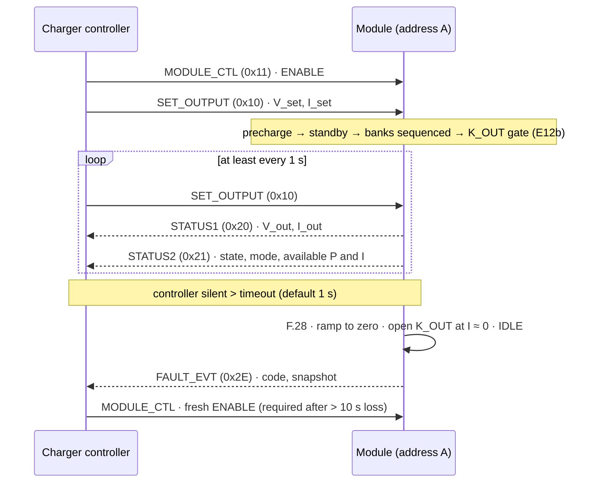

# 📡 External CAN Protocol

<sub>CAN 2.0B addressing, control and telemetry frames, and the rules a charger controller must follow</sub>

<p>
  
  
  
  
</p>

> [!NOTE]
> **Purpose** — the contract between a module and a charger controller (the group master for 100 / 150 kW, E66): the physical layer,
> 29-bit identifiers, control and telemetry frames, and the rules that decide when a module may deliver power.
>
> **Gate coupling** — `firmware/core/can_proto.c` is the normative codec: bounds-checked, little-endian, round-trip
> tested and fuzzed with 100 000 frames inside the 54 / 54 host suite. Where this page and the code disagree, the
> code wins and this page is wrong.

## At a glance

| | |
|---|---|
| **Physical** | ISO 11898-2, isolated (NSI1042-DSWR + isolated 5 V), 120 Ω jumper-selectable termination, CM choke + TVS |
| **Protocol** | CAN 2.0B · **125 kbps** · 29-bit extended ID (CAN-FD-capable transceiver for the future) |
| **Addressing** | module address A = 0–63 (HMI or CAN assign) · group G = 0–3 on the wire (2 ID bits) |
| **Byte order** | little-endian, 8-byte payloads, DLC- and range-guarded |
| **Compatibility** | behaviourally equivalent to NIUERA / Tonhe / Maxwell / UUGreen module classes (§46) — capability-equivalent, **not** packet-cloned; an interop packet layout is contract-only (N-2) |

## 1. Identifier layout

| Bits | 28–26 | 25–18 | 17–10 | 9–2 | 1–0 |
|---|---|---|---|---|---|
| **Field** | priority | message type | destination | source | group |
| **Width** | 3 | 8 | 8 | 8 | 2 |
| **Values** | 0 = highest | see the frame tables | controller 0x01 · broadcast 0xFF | module 0x40 + A | 0–3 |

```c
id = (prio & 7) << 26 | msgtype << 18 | dest << 10 | src << 2 | (group & 3);   // can_proto.c
```

## 2. A normal session



## 3. Control frames (controller → module)

| Type | Name | Payload (8 bytes, little-endian) | Rate |
|---|---|---|---|
| **0x10** | SET_OUTPUT | u32 V_set in mV · u32 I_set in mA | ≥ 1 Hz — timeout 1 s → F.28 ramp-off |
| **0x11** | MODULE_CTL | b0 ENABLE · b1 clear-faults · b2 force-HV · b3 force-LV · b4 LED / locate · b5 walk-in enable | on change |
| **0x12** | GROUP_SET | group power / current share parameters | optional |
| **0x13** | ADDR_ASSIGN | serial match → address | commissioning |
| **0x1F** | TIME_SYNC | epoch | optional |

## 4. Telemetry frames (module → controller)

Default rate 1 Hz; on-change frames 0x2x at up to 10 Hz.

| Type | Name | Payload |
|---|---|---|
| **0x20** | STATUS1 | u32 V_out mV · u32 I_out mA |
| **0x21** | STATUS2 | u16 P_avail W/10 · u16 I_avail mA/10 · u8 state {IDLE, PRECHG, RUN, DERATE, FAULT, LOCK} · u8 mode {LV parallel, HV series, transitioning} · u16 fault bitmap (low) |
| **0x22** | LIMITS | u16 thermal derate % · u16 input derate % (E1 curve) · u16 V_bus V/10 · u16 fault bitmap (high) |
| **0x23** | AC | 3 × u16 VAC line-to-line V/10 · u16 frequency Hz/100 |
| **0x24** | TEMPS | i8 inlet · i8 PFC · i8 LLC · i8 transformer °C · u16 fan1 rpm/10 · u16 fan2 rpm/10 |
| **0x25** | BUS | u16 Vbus+ V/10 · u16 Vbus− V/10 · u16 VbankA V/10 · u16 VbankB V/10 |
| **0x26** | RELAY / FAN | relay state bits + mirror readback bits · fan command % |
| **0x27** | IDENT | serial u32 · firmware u16 · hardware u16 (multi-frame on request 0x30) |
| **0x28** | STATS | lifetime hours u32 · energy kWh u32 |
| **0x2E** | FAULT_EVT | on latch: code u8 · snapshot sequence u8 · key values (matches the F.xx table) |

## 5. Rules a controller can rely on (§23 / §46)

| Rule | Behaviour |
|---|---|
| **Permission to deliver** | output only when ENABLE is set **and** a valid SET_OUTPUT arrived within the timeout **and** no fault is latched |
| **Timeout** | default 1 s, configurable 0.2–5 s: ramp to zero, open K_OUT at I ≈ 0, state → IDLE; a **new ENABLE is required** after more than 10 s of loss |
| **Clearing faults** | clear-faults never clears lockout F.31 — that needs a power cycle or the service bit |
| **Mode transitions** | LV parallel ↔ HV series always follows the E12 state machine; force bits only bias the auto-selection hysteresis (§5) |
| **Configuration** | address, group and calibration frames are committed to EEPROM with a CRC and echoed back for verification |

> [!TIP]
> **In a 100 or 150 kW cabinet (E66)** the charger controller is the group master: it broadcasts `GROUP_SET` 0x12 at
> 10 Hz — 8 bytes LE: u16 V_set 0.1 V · u16 I_req 0.1 A · u16 member bitmap (bit k = address base+k; set only for modules
> heard within 1 s and not FAULT/LOCK) · u8 base address · u8 reserved = 0. Each module runs `firmware/core/group.c`:
> share = min(own I_avail, I_req ÷ members); lower at once, raise after 1.3 s; deliver after the own bit has been present
> 1.3 s + rank × 300 ms; no frame for 1 s → zero (F.28). No module infers its peers by hearing, so there is no split brain.
> `SET_OUTPUT` 0x10 stays for controllers that water-fill unequal shares — one command form per group per session.
> See [product structure](../boards/README-product-structure.md).

---

<div align="center">
<sub><a href="firmware-guide.md">← Firmware Guide</a> &nbsp;·&nbsp; <a href="README.md">🧭 Documentation hub</a> &nbsp;·&nbsp; <a href="../boards/README.md">Boards →</a></sub>

<sub>Vectivolt DC-Modules · documentation rev E61 · every number reproduces with <code>sh calculations/run-all.sh</code></sub>
</div>
