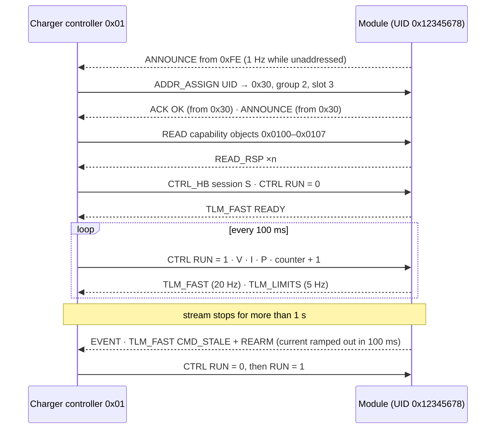
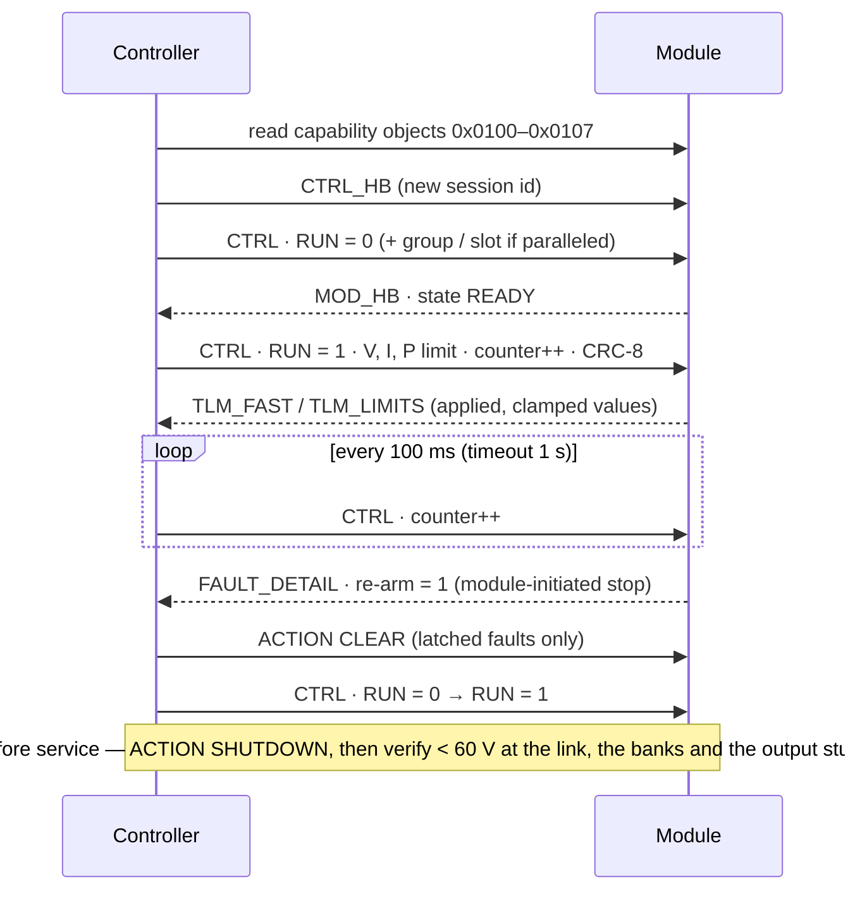

# 📡 VMP 2.0 Native CAN Protocol

<sub>The module's own protocol — addressing, control, acknowledgement, telemetry, discovery, versioning and the controller contract</sub>

<p>
  
  
  
  
</p>

> [!NOTE]
> **Purpose** — the module's own protocol: identifiers and addresses, control and acknowledgement, telemetry, discovery and
> ownership, the objects, the timing and bus-load budget, the rules a charger controller follows, and how the protocol grows
> without breaking installed modules.
>
> **Gate coupling** — [`firmware/proto/vmp.h`](../firmware/proto/vmp.h) is the table of record for every code on this page and
> `vmp.c` the implementation; `firmware/test/proto_test.c` checks it (layout, CRC, counters, ownership, restart, group laws,
> status codes, discovery, conflicts, cadence, saturation, 1 M fuzzed frames). Where this page and the header disagree, the
> header wins and this page is wrong.

## At a glance

| | |
|---|---|
| **Physical** | ISO 11898-2, isolated (NSI1042-DSWR), 120 Ω jumper termination · **250 kbit/s** default, 125 / 500 kbit/s selectable (applied at the next boot) · sample point 87.5 % |
| **Frames** | CAN 2.0B, 29-bit identifiers, DLC 8; every layout also fits CAN FD unchanged |
| **Addresses** | controllers 0x01–0x0F · modules 0x10–0xDF (208) · groups 0xE0–0xEF (16) · 0xFE unaddressed · 0xFF all |
| **Integrity** | CAN CRC-15 on every frame · CRC-8/AUTOSAR over identifier + payload on every frame that can command power or change identity · 4-bit counters on cyclic control |
| **Liveness** | controller: CTRL every 100 ms, CTRL_HB 1 s with a session id · module: TLM_FAST every 50 ms, MOD_HB 1 s with a session id |
| **Replies** | every request gets an ACK or READ_RSP with a status; rejected cyclic frames are NAKed (at most one per 100 ms) |
| **Units** | one scaling per quantity: 0.1 V · 0.05 A · 10 W · 1 °C · 0.5 % |
| **Coexistence** | the native marker (identifier bit 25) keeps VMP frames apart from J1939 and TonHe PDU1 traffic on a shared bus |

> [!IMPORTANT]
> **Two protocol options, one module.** Every module ships with both profiles, selectable in standby: **TonHe V1.2** for
> dropping into existing racks and monitors (see the [TonHe profile page](can-profile-tonhe-v12.md)), and **VMP 2.0** — this
> page — for new installations, where the controller contract, command-frame CRC, rolling counters, ownership, typed NAKs and
> the signed update path make it the robust choice.

## 1. Design rules

What makes this protocol easier to integrate and harder to misuse than the charging-module protocols it learned from (UUGreen,
ENR, NIUERA, Maxwell, TonHe):

1. **Integers, little-endian, one scaling per quantity.** No floats, no second scaling for the same quantity.
2. **Cyclic control is full, idempotent state.** RUN, output mode, voltage, current and power travel in one frame, so a lost
   frame is repaired by the next. One-shot actions carry a transaction id and are acknowledged.
3. **Nothing is silent.** Every request gets a status; every rejected command is NAKed with the reason, rate-limited but
   never suppressed.
4. **A power command proves its freshness.** CRC-8 over identifier and payload plus a 4-bit counter: a corrupted, misrouted,
   duplicated, late or frozen command cannot keep a module delivering.
5. **Delivery needs a fresh stream from one owner.** Loss of the stream is a controlled stop, and a stream that simply
   resumes does not restart the module — RUN must be seen 0, then 1.
6. **Must-understand.** Reserved bits in command frames must be zero: a newer controller asking for a feature an older
   module lacks gets a NAK, not a guess.
7. **Capability is data, before and during a session** — rated and available current and power, the V–I envelope and the
   feature bits are readable at any time.
8. **Faults are explicit.** One bit per F-code, the primary code, its recovery class and countdown, the re-arm flag, and
   numbered, timestamped events.
9. **Identity without collisions.** A 32-bit UID, assignment by UID, and a deterministic outcome when two modules claim one
   address.
10. **Versioned growth.** `major.minor` in every heartbeat; additions only in unused codes and reserved fields; layouts are
    never reused.

## 2. Identifier

| Bits | 28–26 | 25 | 24 | 23–16 | 15–8 | 7–0 |
|---|---|---|---|---|---|---|
| **Field** | priority | native marker | space | function | destination | source |
| **Values** | 0 highest | always 1 | 0 application · 1 service (bootloader) | §4, §5 | address | address |

```c
id = prio << 26 | 1 << 25 | space << 24 | fn << 16 | dst << 8 | src;   // vmp_id() in vmp.h
```

| Priority | Frames |
|---|---|
| 1 | CTRL · GROUP_CTRL · ACTION |
| 2 | ACK · FAULT_BITS · FAULT_DETAIL · EVENT |
| 3 | TLM_FAST · CTRL_HB |
| 4 | TLM_LIMITS · TLM_DERATE · TLM_SHARE · WARN_BITS |
| 5 | TLM_AC · TLM_DC · TLM_THERMAL · TLM_COOLING · MOD_HB · STATS |
| 6 | READ · WRITE · READ_RSP · DISCOVER · ADDR_ASSIGN · ANNOUNCE · TIME_SYNC |

Within a priority the lower source address wins arbitration, so the order is deterministic. Module acceptance filters: native
marker set, and destination = own address, own group address or 0xFF — plus module-to-controller functions from any source,
which carry the address-conflict and share-trim information.

## 3. Addressing, discovery and ownership

| Topic | Rule |
|---|---|
| **Address sources** | the stored address (assigned by ADDR_ASSIGN or a WRITE to 0x0200); factory default unaddressed. The front-panel address editor belongs to the TonHe profile, not to this one |
| **Unaddressed** | ANNOUNCE once a second from 0xFE; no telemetry; accepts only DISCOVER and ADDR_ASSIGN |
| **Discovery** | DISCOVER (broadcast) → every module (or every unaddressed one) answers ANNOUNCE at a random delay inside the window |
| **Assignment** | ADDR_ASSIGN (broadcast, CRC) matches the 32-bit UID → address, group, slot; refused while delivering; acknowledged from the new address, which then announces itself |
| **Conflict** | a module that hears its own address from another node keeps it if it has held it ≥ 3 s (and reports ADDR_CONFLICT); a newcomer yields to 0xFE (not stored) |
| **Groups** | group 1–16 listens on 0xE0 + g − 1; slot 0–15 is the member's bit in GROUP_CTRL |
| **Ownership** | the controller whose valid control frame is accepted owns the module while its stream is fresh; another controller gets NAK OWNED with the owner in the detail byte; ownership lapses with the stream; RELEASE hands it back |
| **Controller restart** | CTRL_HB carries a random 32-bit session; a new session from the owner holds RUN until the owner sends RUN = 0 |
| **Module restart** | MOD_HB carries the module's session; after a boot RUN counts only once RUN = 0 has been received |



## 4. Control frames (controller → module)

### 4.1 CTRL 0x01 — unicast, cyclic 20–500 ms (100 ms recommended)

| Byte | Field | Encoding |
|---|---|---|
| 0 | bit 0 RUN · bits 1–2 output mode (0 AUTO · 1 LOW ≤ 500 V · 2 HIGH ≥ 480 V · 3 rejected) · bit 3 reserved = 0 · bits 4–7 counter | |
| 1–2 | voltage setpoint | u16 · 0.1 V |
| 3–4 | current setpoint (this module) | u16 · 0.05 A |
| 5–6 | power limit | u16 · 10 W · 0xFFFF = none |
| 7 | CRC-8/AUTOSAR | over the identifier (4 bytes, little-endian) and bytes 0–6 |

- **Counter:** +1 … +7 accepted (up to six frames lost) · the same value = duplicate, ignored and **does not refresh freshness**
  · −8 … −1 = late, rejected with NAK SEQUENCE · after a timeout any value resynchronizes.
- **Values** above capability are clamped; the applied values are reported in TLM_LIMITS. A setpoint beyond 1.1 × the 1 000 V
  ceiling, or above 400 A, is a broken controller rather than an ambitious one and is NAKed RANGE.
- **A voltage below 100 V with no battery on the output is no setpoint:** no start, or a controlled stop while delivering.
- **The output mode** latches only with every relay open (standby); a change while delivering waits for the next start.

### 4.2 GROUP_CTRL 0x02 — to 0xE0 + g − 1, cyclic

| Byte | Field | Encoding |
|---|---|---|
| 0 | bit 0 RUN · bits 1–2 output mode · bit 3 law (0 EQUAL · 1 LEVEL) · bits 4–7 counter | |
| 1–2 | voltage setpoint | u16 · 0.1 V |
| 3–4 | EQUAL: the group's total current · LEVEL: each member's ceiling | u16 · 0.05 A |
| 5–6 | members | u16, bit k = slot k |
| 7 | CRC-8/AUTOSAR | |

**Share law** (`group.c`): share = min(own available current, total ÷ members) for EQUAL, or min(own available current, level)
for LEVEL · lower at once, raise only after 1.3 s (a grown target restarts the hold) · first delivery after 1.3 s + rank ×
300 ms · no fresh frame → share 0. The group sum never exceeds the request through joins, drops and partitions. A unicast CTRL
to a member overrides its group. Group frames are never acknowledged. Use EQUAL for identical modules and LEVEL when the
controller water-fills unequal capability — it reads each member's available current from TLM_LIMITS and solves
Σ min(I_avail,k, L) = I_total for L.

### 4.3 CTRL_HB 0x08 — broadcast, 1 s

session u32 · controller uptime s u16 · expected modules u8 · flags u8 (bit 0 primary, bit 1 standby controller)

### 4.4 ACTION 0x10 — request, acknowledged when unicast

txn u8 · action u8 · argument u32 · reserved u8 = 0 · CRC-8

| Code | Action | Rules |
|---|---|---|
| 1 | CLEAR | clears LATCH rows, and AUTO rows whose condition is already gone; a locked module answers LOCKED |
| 2 | SHUTDOWN | controlled stop, then link and bank discharge; any state, any controller |
| 3 | WAKE | OFF → INIT (precharge again); otherwise STATE |
| 4 | LOCATE | argument = seconds (≤ 3 600) of display and LED locate |
| 5 | REBOOT | argument "RBT!" (0x21544252); unicast only; refused `VMP_E_STATE` while **either stage is still switching** — the 60 s warm hold after a stop leaves the PFC running and the matrix made, and a reboot there drops the gates mid-switching with the link charged |
| 6 | UNLOCK | argument "VMP2" (0x32504D56); opens critical writes for 10 s; unicast only |
| 7 | FACTORY_RESET | unlocked, unicast only; refused while either stage is still switching |
| 8 | ENTER_BOOT | unlocked, unicast only (firmware update, §10); refused while either stage is still switching. A module on the TonHe profile has no ENTER_BOOT action and no reachable SWD header, so its way in is the two-button service entry — both panel buttons held ≥ 3 s inside the first 10 s after power-up with both stages off |
| 9 | RELEASE | the owner gives up ownership |

Actions sent to a group or to 0xFF execute without an acknowledgement; REBOOT, UNLOCK, FACTORY_RESET, ENTER_BOOT and RELEASE are
never taken from a group or broadcast frame.

### 4.5 READ 0x11 · WRITE 0x12 — unicast requests

txn u8 · object u16 · sub-index u8 · value u32 (WRITE) → READ_RSP 0x51 (txn · object · sub · value) or ACK (status, applied
value). Requests share a token bucket of 20 per second; an empty bucket answers BUSY.

### 4.6 DISCOVER 0x18 · ADDR_ASSIGN 0x19 · TIME_SYNC 0x1F — broadcast

| Frame | Payload |
|---|---|
| DISCOVER | flags u8 (bit 0 only unaddressed modules answer) · window u8 (× 10 ms, 0 = 500 ms) |
| ADDR_ASSIGN | UID u32 · address u8 · group u8 (0 = unchanged) · slot u8 (0xFF = unchanged) · CRC-8 |
| TIME_SYNC | Unix seconds u32 · milliseconds u16 |

## 5. Telemetry frames (module → 0xFF)

| Code | Frame | Period | Payload |
|---|---|---|---|
| 0x40 | TLM_FAST | 50 ms (10–1 000) | V_out u16 0.1 V · I_out i16 0.05 A (+ = delivering) · byte 4: run state (low nibble) and limiter (high nibble) · byte 5 flags: 0 FAULT · 1 WARNING · 2 DERATED · 3 CMD_STALE · 4 REARM · 5 LOCKED · 6 NOT_OWNED · 7 ADDR_CONFLICT · byte 6: echo of the last accepted control counter (low nibble), own counter (high nibble) · byte 7: primary F-code |
| 0x41 | TLM_LIMITS | 200 ms | available current u16 · available power u16 · applied voltage reference u16 · applied current reference u16 |
| 0x42 | TLM_DERATE | 1 s + on change | derate u8 (0.5 %) · reasons u16 · applied power limit u16 · thermal margin i8 °C · mode u8 (low nibble 1 PAR · 2 SER · 3 changing; high nibble requested mode) · reserved |
| 0x43 | TLM_AC | 1 s (100–10 000) | V_an, V_bn, V_cn u16 0.1 V (to the virtual neutral) · frequency u16 0.01 Hz |
| 0x44 | TLM_DC | 1 s | bus u16 · midpoint imbalance i16 0.1 V · bank A u16 · bank B u16 |
| 0x45 | TLM_THERMAL | 1 s | i8 × 8: inlet · coolant · PFC · LLC · transformer · output diode · DC link · MCU (−128 = not fitted) |
| 0x46 | TLM_COOLING | 1 s | fans 1–4 u8 (× 50 rpm) · duty u8 % · failed-fan bits u8 · fan mode u8 · reserved |
| 0x47 | TLM_SHARE | 200 ms, when in a group | group u8 · slot u8 · I_out i16 · share target u16 · trim i8 (0.1 % of the voltage command) · flags u8 (0 group control · 1 delivery permitted · 2 trim active) |
| 0x48 | FAULT_BITS | 1 s + ≤ 20 ms after a change | u64: bit n − 1 = F.n latched (F.31 while locked) |
| 0x49 | WARN_BITS | 1 s + on change | u64: bits 0–31 core warnings · 32 CMD_STALE · 33 ADDR_CONFLICT · 34 TX_DROP · 35 RX_REJECT · 36 EV_SUPPRESS (EVENT frames held back by the per-code rate limit — read 0x0502 for the count) |
| 0x4A | FAULT_DETAIL | on change + 1 s while faulted | code u8 · class u8 (0 none · 1 AUTO_EXT · 2 AUTO_INT · 3 LATCH · 4 LOCK) · seconds to recovery u16 (0xFFFF n/a) · reserved · re-arm u8 · last event number u16 |
| 0x4B | EVENT | on event, **at most one per {kind, code} per 200 ms** — a warning chattering on an intermittent sensor computes to ~55 % of a 250 kbit/s bus from one module; anything held back sets WARN bit 36 and counts in 0x0502 | event number u16 · kind u8 (1 boot · 2 fault set · 3 fault cleared · 4 warning set · 5 warning cleared · 6 state change) · code u8 · ms since boot u32 |
| 0x4C | STATS | 60 s | operating seconds u32 · energy u32 (0.1 kWh) |
| 0x4E | TLM_PACK | slow period | pack / external-node voltage behind DOUT u16 0.1 V (0xFFFF = none or unknown) · external node present u8 · reserved — a controller pre-positions its reference before the contactor closes and sanity-checks a setpoint against the pack |
| 0x50 | ACK | on request | txn u8 · function u8 · status u8 · detail u8 · value u32 |
| 0x51 | READ_RSP | on request | txn u8 · object u16 · sub u8 · value u32 |
| 0x58 | ANNOUNCE | boot · address change · DISCOVER · 1 s while unaddressed | UID u32 · product u16 · version u8 (major << 4 \| minor) · flags u8 (0 addressed · 1 conflict · 2 owned · 3 in a group) |
| 0x59 | MOD_HB | 1 s | session u32 · uptime s u16 · reset cause u8 · version u8 |

| Run state | | Limiter | | Derate reason bit | | Core warning bit | |
|---|---|---|---|---|---|---|---|
| 0 | OFF | 0 | none | 0 | thermal | 0 | line wait |
| 1 | PRECHARGE | 1 | CV | 1 | fan | 1 | input ride-through |
| 2 | READY | 2 | CC command | 2 | input voltage | 2 | thermal derate |
| 3 | STARTING | 3 | availability | 3 | power command | 3 | fan derate |
| 4 | ON | 4 | power command | 4 | group share | 4 | cold standby |
| 5 | STOPPING | 5 | rated power | 5 | rated-power curve | 5 | no setpoint |
| 6 | MODE_CHANGE | 6 | group share | | | 6 | measurement glitch |
| 7 | SAFE | 7 | ramp | | | 7 | stopping |
| 8 | FAULT | 8 | stop | | | 8 | relay feedback unwired |
| 9 | LOCKED | | | | | 9 | recovering |
| 10 | DISCHARGE | | | | | 10 | re-arm needed |
| | | | | | | 11 | communication lost |

## 6. Acknowledgement status

| Code | Status | Meaning |
|---|---|---|
| 0 | OK | done |
| 1 | OK_CLAMPED | done with the value in the ACK |
| 2 | UNSUPPORTED_FUNCTION | the function code is unknown to this version |
| 3 | UNSUPPORTED_ITEM | unknown action or object |
| 4 | LENGTH | wrong DLC |
| 5 | CRC | CRC-8 mismatch |
| 6 | RANGE | the value is outside the object's range |
| 7 | STATE | not legal in the present state (e.g. an address change while delivering) |
| 8 | LOCKED | needs UNLOCK, or the module is locked out |
| 9 | OWNED | another controller owns the module (detail = its address) |
| 10 | BUSY | request budget exhausted |
| 11 | NVM | the store failed; the value is not persisted |
| 12 | READ_ONLY | the object cannot be written |
| 13 | KEY | wrong key |
| 14 | SEQUENCE | a late control frame |
| 15 | RESERVED_BITS | a must-understand bit or code this module does not implement |

## 7. Objects

| Object | Name | Access | Unit · range |
|---|---|---|---|
| 0x0001 | protocol version | read | major << 8 \| minor |
| 0x0002 | product id | read | the rating in kW: 30 · 40 · 50 (air and liquid share it — feature bit 6 separates them) |
| 0x0003 | UID | read | u32 — CRC-32 of the full 96-bit silicon UID |
| 0x0004 | serial number | read | sub 0–3: four u32 chunks of 16 ASCII characters |
| 0x0005 | hardware revision | read | u8 |
| 0x0006 | firmware version | read | major << 24 \| minor << 16 \| patch << 8 \| build |
| 0x0007 | firmware image CRC-32 | read | u32 |
| 0x0008 | bootloader version | read | u32 |
| 0x0009 | boot state | read | 0 running confirmed · 1 update pending · 2 last update failed · 3 rolled back |
| 0x000A | reset cause | read | u8 — the raw reset-flag byte, classified by the module |
| 0x0100 | feature bits | read | 0 group control · 1 LEVEL law · 2 power limit · 3 reverse power (0) · 4 share trim · 5 fan modes · 6 liquid · 7 bootloader · 8 time sync · 9 TonHe V1.2 profile in the image |
| 0x0101 · 0x0102 | V_min · V_max | read | 0.1 V |
| 0x0103 · 0x0104 | rated current · rated power | read | 0.05 A · 10 W |
| 0x0105 · 0x0106 | LOW-mode maximum · HIGH-mode minimum | read | 0.1 V |
| 0x0107 | V–I envelope corners | read | sub 0–2: V (0.1 V) << 16 \| I (0.05 A) |
| 0x0200 | address | write · UNLOCK · not delivering | 0x10–0xDF |
| 0x0201 · 0x0202 | group · slot | write · not delivering | 0–16 · 0–15 |
| 0x0203 | bit rate | write · UNLOCK · not delivering · next boot | 125 000 · 250 000 · 500 000 |
| 0x0204 | protocol profile | write · UNLOCK · not delivering · next boot | 0 VMP 2.0 · 1 TonHe V1.2 |
| 0x0205 | communication timeout | write | 100–10 000 ms |
| 0x0206 · 0x0207 | fast · slow telemetry period | write | 10–1 000 ms · 100–10 000 ms |
| 0x0208 · 0x0209 | voltage · current ramp | write | 1–5 000 V/s · 1–10 000 A/s |
| 0x020A | droop | write | 0–500 mΩ |
| 0x020B | fan mode | write | 0 normal · 1 quiet · 2 boost |
| 0x020C | installer power cap | write | 10 W · 0xFFFF none |
| 0x0300–0x0303 | operating seconds · energy (0.1 kWh) · starts · total latches | read | u32 |
| 0x0400 | event-log count | read | u16 — entries readable below |
| 0x0401–0x0404 | event-log entry words 0–3 | read · **sub-index = age** (0 = newest) | w0 sequence u32 · w1 time u32 (seconds since boot; UNIX when kind bit 7 is set) · w2 boot u16 \| kind u8 ≪ 16 \| code u8 ≪ 24 · w3 argument u16 |
| 0x0500 | control-ISR execution high-water | read | PFC µs ≪ 16 \| LLC µs (DWT since boot — EVT T-44) |
| 0x0501 | worst painted-stack use | read | percent u8 |
| 0x0502 | EVENT frames suppressed by the rate limit | read | count u32 since boot |
| 0x0503 | `DIAG_RX_OVR` — CAN RX-mailbox-queue overruns | read | count u16 since boot: drains that found **all eight RX mailboxes occupied**, i.e. the condition under which a ninth frame is lost. The controller exposes no queue-overrun flag of its own, so this is the only honest evidence a frame was dropped |

Objects at or above 0x0400 are answered by the HAL through the codec's auxiliary read hook, so the codec stays ignorant of
HAL types. Configuration objects persist (A/B records with CRC); the module reports the stored value in the ACK.

## 8. Timing and bus load

| Direction | Frames per second |
|---|---|
| Controller, per module (CTRL at 100 ms) or per group (GROUP_CTRL at 100 ms) | 10 |
| Controller heartbeat | 1 |
| Module defaults: TLM_FAST 20 · LIMITS 5 · SHARE 5 · slow set 4 · DERATE 1 · BITS 2 · HB 1 | ≈ 38 |

A 29-bit, 8-byte frame is ≈ 135 bits with stuffing.

| Modules | Control form | Bit rate | Load |
|---|---|---|---|
| 4 | CTRL each | 250 kbit/s | ≈ 10 % |
| 8 | CTRL each | 250 kbit/s | ≈ 20 % |
| 16 | GROUP_CTRL | 250 kbit/s | ≈ 34 % |
| 32 | GROUP_CTRL | 500 kbit/s | ≈ 35 % |

Keep the load below 50 % (lengthen the telemetry periods or raise the bit rate). Response targets: ACK ≤ 20 ms · control frame
→ reference in force ≤ 5 ms · FAULT_BITS ≤ 20 ms after a latch · TLM_FAST age ≤ 60 ms.

## 9. Rules a controller follows



1. **Start:** assign group and slot if modules are paralleled → send RUN = 0 until the module reports READY → send RUN = 1
   with voltage, current and power.
2. **Keep the stream fresh:** a control frame every 100 ms (the timeout defaults to 1 s).
3. **Advance the counter** on every control frame; never retransmit a stored buffer.
4. **After any module-initiated stop** (TLM_FAST flag REARM, FAULT_DETAIL re-arm = 1): RUN = 0, then RUN = 1.
5. **Clear latched faults deliberately** with ACTION CLEAR; AUTO faults clear themselves and then need step 4.
6. **After a controller restart,** send a new CTRL_HB session before control frames.
7. **One control form per module per session:** CTRL or GROUP_CTRL.
8. **Read capability** (0x0100–0x0107) before a session; follow TLM_LIMITS during it.
9. **Before service:** ACTION SHUTDOWN, then verify < 60 V at the link, the banks and the output studs (the enclosure label rule).

## 10. Versioning and extension

- **Where:** ANNOUNCE and MOD_HB carry `major.minor`; object 0x0001 repeats it.
- **Minor (2.x) may add:** function codes in unused slots, objects, actions, status codes, and bits in reserved telemetry
  fields. Both sides ignore telemetry bits they do not know.
- **Command frames:** reserved bits must be zero (must-understand). A controller uses a new command bit only after reading a
  module version or feature bit that supports it.
- **Major (3.0)** changes layouts through new function codes; within a major no code is ever reused with a different layout.
- **CAN FD:** the first eight bytes of every frame keep their layout; an FD frame may append fields (a 16-bit counter, CRC-16)
  under a new minor with a feature bit.
- **Service space (bit 24 = 1)** belongs to the **bootloader** — `firmware/boot/svc.h` is the table of record, and the state
  machine runs there and nowhere else. A module reaches it through a sealed handoff and a reset: ACTION ENTER_BOOT on this
  profile, or both panel buttons held ≥ 3 s inside the first 10 s after power-up on any profile. A tool (source 0x01–0x0F)
  then broadcasts to 0xFF and SELECTs one module by UID; functions 0x01 SELECT · 0x02 INFO · 0x03 ENTER ("BOOT") ·
  0x04 BEGIN (size u32 · slot u8) · 0x05 BLOCK (index u16 · length u16 · CRC-32) · 0x06 DATA (sequence u8 · 1–7 bytes) ·
  0x07 FINISH (image CRC-32) · 0x08 RESET ("RBT!") · 0x09 ABORT; responses 0x41 SELECT_RSP · 0x42 INFO_RSP · 0x50 ACK.
  Blocks are 1 KB, acknowledged after program + read-back; a re-sent acknowledged block is acknowledged again (a lost ACK
  costs a resend, never a restart); FINISH checks the whole-image CRC-32, then the signed header, key, ECDSA-P256 signature
  and body SHA-256, and only then puts the slot on trial (3 boots to confirm, else rollback); the confirmed slot is never
  erased; an idle transfer is abandoned after 10 s.

> [!TIP]
> **How this page is checked** — `firmware/test/proto_test.c` — codec conformance, the worked examples, a 1M-frame malformed-input fuzz, and one core driven through both profiles.

---

<div align="center">
<sub><a href="firmware-architecture.md">← Firmware Architecture</a> &nbsp;·&nbsp; <a href="README.md">🧭 Documentation hub</a> &nbsp;·&nbsp; <a href="can-profile-tonhe-v12.md">TonHe V1.2 Compatibility Profile →</a></sub>

<sub>Vectivolt DC-Modules · documentation rev E84 · every number reproduces with <code>sh calculations/run-all.sh</code></sub>
</div>
