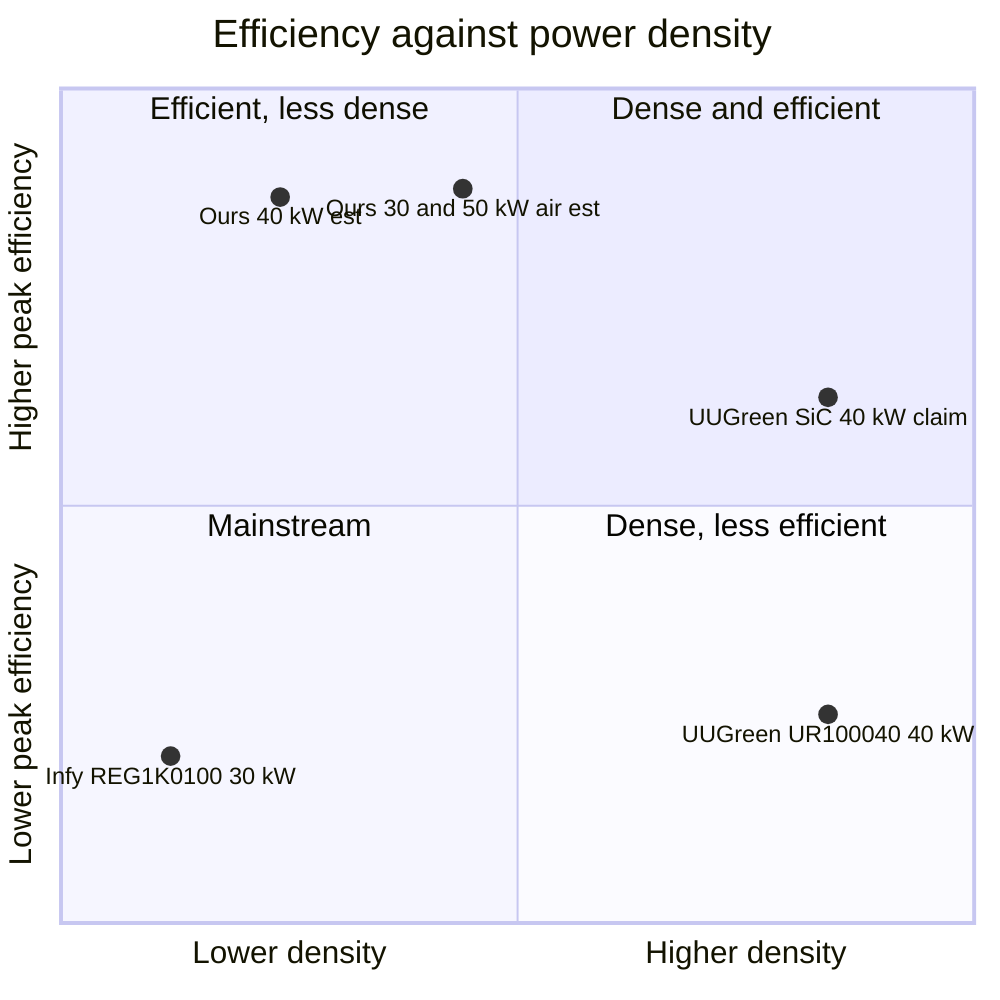

# 📊 Competitive Benchmark

Verified market position, the SiC verdict, the density gap, cost levers and harsh-environment parity

  
  
  

> [!NOTE]
> **Purpose** — where the platform stands in the market: the reference designs it matches, the Chinese production
> modules it competes with, the SiC verdict, the density gap, cost levers, and harsh-environment parity.

> [!TIP]
> The REG1K0135A2 40 kW SiC module is now audited block-by-block against this platform — every stage, drive,
> sensing and protection choice carries a verdict — in the [InfyPower teardown benchmark](benchmark-infypower-teardown.md)
> (E62). No architecture change resulted; R18 and two RFQ levers were recorded.
>
> **Gate coupling** — claims labelled **[V]** survived 3-vote adversarial verification; **[P]** rows were read
> directly from manufacturer pages; **[est]** rows are our estimates.

## At a glance

| Axis | Position | Evidence |
|---|---|---|
| **Topology** | reference practice — our DC-DC is Wolfspeed's 30 kW reference architecture | §1 [V] |
| **Efficiency** | peak 98.45–98.58 % leads the verified 95.5–96.5 % mainstream; full load 96.7–97.2 % at parity with SiC flagships' ≥ 97 % | §2 [V] · E60 |
| **Density** | mid-pack — ~2.1–2.6 kW/L [est] against UUGreen's 3.6 kW/L | §2 [V] |
| **SiC** | keep — the only spec line that beats incumbents, and SiC price erosion is structural | §3 |
| **Cost** | 30 kW ₹30,980 against a ₹35k buy benchmark; 50 kW air ₹830 / kW | §6 · generated roll-up |
| **Environment** | matched to the published Infypower / UUGreen / Tonhe envelope (A11 rev C) | §7 [P] |

Axes are normalised: density 1.5–4 kW/L, peak efficiency 95–99 %. Our densities are layout-phase estimates
[est]; the competitor points are verified datasheet values [V].

Method: deep-research pass (105 agents, 3-vote adversarial verification per claim; primary
manufacturer documents only — every number below labeled **[V]** survived that process; numbers
labeled **[est]** are our estimates or the user's own market intelligence and carry no external
verification). Full provenance in the E51 session record.

> [!NOTE]
> **E60 restatement (2026-09-13).** Our efficiency rows below were calculated with an LLC current taken from a
> simulation deck that E60 withdrew. On the power-solved current the full-load figures are **97.19 / 96.92 / 96.68 /
> 96.82 %** (30/40/50L/50A) and the peaks **98.45–98.58 %**. The position statement changes by one word: **ahead** of the
> verified mainstream band (95.5–96.5 %) at full load and peak, and at **parity** with the SiC flagships' ≥97 % full-load
> claim rather than ahead of it. The [V] market rows are unchanged.

## 1. Topology verdict: our architecture IS current reference practice

| Design | PFC | Isolated stage | Range strategy | Result |
|---|---|---|---|---|
| **Ours** | Vienna, 50 kHz, SiC 750 V | 3-φ interleaved LLC, fr 140 kHz, 1200 V SiC, JBS sec | S/P output banks (contactor, on-the-fly), 150–1000 V | η 97.19 / 96.92 / 96.68–96.82 % full-load calc, 98.45–98.58 % peak (E60) |
| Wolfspeed CRD-30DD12N-K 30 kW [V] | (DC-DC only, 650–900 V link) | **3-φ interleaved LLC, 130–250 kHz adaptive, discrete 1200 V SiC (C3M0040120K)** | **S/P secondary banks** 200–1000 V (manual jumpers) | >98.3 % peak DC-DC, 6.5 kW/L |
| Microchip 30 kW Vienna ref [V] | **Vienna @140 kHz**, 700 V/15 mΩ SiC | — | — | 98.6 % @30 kW (bench) |
| Infineon 50 kW EV kit (Jun 2024) [V] | 2-level 6-sw AFE, 48 kHz SiC | 1-φ DAB 100 kHz, link tracks 1.4×Vout (700–840 V) | link-tracking, 350–750 V/100 A | **96 % measured system peak**, forced air, 45 kW proven |
| onsemi 25 kW SiC-PIM [V] | 6-sw AFE | DAB w/ discrete series L | CC-derate <500 V (50 A cap) | >96 % system target |

**Conclusions [V]:** (1) Our exact DC-DC architecture (3-φ interleaved LLC + S/P banks + discrete
1200 V SiC) is Wolfspeed's current 30 kW reference design — not exotic, not theoretical. (2) Our
50 kHz Vienna is CONSERVATIVE (Microchip proves 140 kHz; headroom exists, E3 stands on thermal
grounds). (3) Our 150–1000 V window is wider than any of the three published strategies. (4) The
one place we are structurally harder than the references: our S/P flip is contactor-based
on-the-fly — Wolfspeed's is manual jumpers — which is exactly why the E12/E30/R4-8/R5-D
exclusion+mirror hardware exists. (5) The competing architecture (AFE+DAB) measures ~96 % system
peak — our topology family holds the efficiency high ground.

## 2. The Chinese benchmark wall

| Module | P | η peak / full [V] | Output | Density [V] | Weight | Devices |
|---|---|---|---|---|---|---|
| Infy REG1K0100U/G 30 kW | 30 kW | ≥95.8 / ≥95.5 % (G2 ≥96) | 150–1000 V, 100 A, CP ≥300 V | 16.7 L → **1.8 kW/L** | ≤22.5 kg (1.33 kW/kg) | unverified (Si SJ assumed [est]) |
| UUGreen UR100040-SW(EU) 40 kW | 40 kW | >96 / >95 % | 150–1000 V, 133 A, CP ≥300 V | 11.0 L → **3.6 kW/L** | ≤16 kg (2.5 kW/kg) | mainstream SKU unverified |
| UUGreen UR100040SW-**SiC** (+G2) | 40 kW | **≥97 / >97.5 % claimed** | same | same class | same | **SiC (vendor-branded)** |
| Tonhe TH750Q61ND-AX (2019, on file) | 20 kW | ≥95.5 % max | 200–750 V | 8.4 L → 2.4 kW/L | — | 3-φ APFC + LLC, dual DSP |
| **Ours 30 kW** | 30 | **98.45 pk / 97.19 calc** (E60) | 150–1000 V | ~11.6 L → **~2.6 kW/L [est]** | ~13 kg [est] | all-SiC |
| **Ours 40 kW** | 40 | 98.49 / 96.92 (E60) | 150–1000 V | ~18.9 L → 2.1 kW/L [est] | ~16 kg [est] | all-SiC |
| **Ours 50 kW air** | 50 | 98.58 / 96.82 (E60) | 150–1000 V | ~18.9 L → 2.6 kW/L [est] | ~17 kg [est] | all-SiC |

**Where we win:** efficiency. Verified market state: mainstream Chinese modules are 95.5–96.5 %
peak; only just-launched SiC flagships claim ≥97 %. Our calculated 96.7–97.2 % full-load /
98.45–98.58 % peak (E60) is at parity with the newest SiC generation at full load and ahead of it at peak — worth ~300–600 W less heat per
module at full load, i.e. smaller fans, longer fan life, and a real opex line for buyers
(≈1.5 % of 30 kW × 4000 h/yr ≈ 1.8 MWh/yr/module).

**Where we lose:** power density. UUGreen packs 40 kW into 11 L; our 40/50 kW envelope is ~19 L
(2-board sandwich, E36 layout phase still parked). 30 kW at ~2.6 kW/L is mid-pack. **The density
gap is a layout/packaging problem, not a topology one** — same magnetics volume at 140 kHz vs
their ~100–200 kHz is comparable; the sandwich carries air where a production module carries
components. Register this as the #1 physical-design lever when E36 reopens.

**Cost [est — the one table that decides the business]:** BOM @10k: ₹30.7k/35.3k/41.0–41.3k
($346/398/463–466 @88.7). The user's own buy benchmark for a Chinese 30 kW module at 10k volume:
₹35k (~$395). No RMB street-price claims survived verification (open question — get 3 factory
quotes; the CAN-protocol PDFs on file for UUGreen/Tonhe/NIUERA/ENR/Maxwell say which factories
already talk to us). Reading: **our 30 kW BOM undercuts the user's own buy price by ~12 %**
before assembly/overhead/margin — build-vs-buy stands at 30 kW and improves at 40/50 (₹843→797/kW
vs buying 30 kW-class ~₹1,167/kW). Even on their home-market basis, a Chinese maker's SiC 40 kW
sells at a premium over Si SKUs — our all-SiC BOM at $398 lands inside the plausible factory-cost
band of their SiC generation. **We are not structurally uncompetitive; we are one layout
compression away from parity on density with an efficiency lead.**

## 3. SiC verdict [V for the driver, est for the number]

- Verified structural driver: SiC overcapacity through 2027–28 (Yole: ~50 % upstream / ~70 %
  device-line utilization 2025), 6" substrates <$500→~$400 in 2024 with vendors selling at a
  loss, Chinese entrants at ~35 % combined 2024 substrate share. Direction: 1200 V SiC keeps
  getting cheaper through our build window.
- Market confirmation: UUGreen ships its 40 kW flagship as SiC and prices it as the premium SKU;
  SiC is the differentiator TIER-1 Chinese makers now market at exactly our power class.
- Our BOM reality: Chinese-sourced SiC already (BASiC 750 V 10 mΩ ₹330; SiChain 1200 V 23 mΩ
  ₹390; JBS ₹90–120). Full-SiC silicon spend ≈ ₹6.5–9k/module ≈ 21 % of BOM [est].
- **Verdict: SiC gives us the product position (η ≥97 class) the market's newest premium SKUs
  are just reaching, at Chinese device pricing. Reverting any stage to Si SJ/IGBT would save
  ≈₹2–3k/module [est] and surrender the only spec line where we beat the incumbents. Keep
  all-SiC.**

## 4. Magnetics practice cross-check [V]

- PFC chokes: reference practice = stacked High Flux/sendust powder toroids, SOLID wire (ripple
  ~11 % of rms), ~70 µH @46 A rms/140 kHz (Chang Sung CH571060 ×2, 20 T, >2.6 mm wire —
  Microchip). Ours: same family, more L (165/116/107 µH) because 50 kHz needs it; bundles not
  litz ✓; bias-swing design ✓. **Practice-aligned.** (CH571060 also closes our D6 T57 p/n gap.)
- LLC/DAB transformers: catalog integrated-leakage parts exist to ~17 kW (TDK P302640D003 at
  50 kW 3-φ DAB); at 60 kW Wolfspeed hand-winds (E100/60/28 3C94, litz AWG4-eq) and had no
  commercial source as of Aug 2025. Ours at 10–17 kW/section is right at the boundary and stays
  custom because of 1:1:1 + dual secondaries + S/P — expected, not exotic. **The E51 window
  findings (D3 rev B) are what make ours actually windable; the reference world confirms this
  power class is where transformer sourcing gets hard.**
- External trim inductor vs integrated leakage: Infineon integrates (leakage IS the 8 µH);
  Wolfspeed 60 kW keeps ~5 µH leakage + tank. Our bins+trim approach is heavier than industry's
  fixed-element practice — kept because the ±3 % fr window bought §37 MC yield, but the
  **fixed-Lr study stays on the EVT list** (kill the 4-bin kitting flow if control margins allow).
- Ferrite second source: DMEGC PQ50/50 in DMR95 verified (≤23.95 W/set max @100k/200 mT/100 °C;
  Ae 363.8 differs from Ferroxcube 328 — AL-grind absorbs it).

## 5. What did NOT survive verification (honest gaps)

RMB street prices · internals/teardowns of shipping Chinese modules (mainstream 30 kW device
technology Si-vs-SiC unverified) · litz/TIW industry norms · CMC practice · winder piece pricing
and lead times · production test suites · field failure modes and observed MTBF. **Actions:**
(1) three factory RFQs (Infy/UUGreen/Winline) through the existing protocol-doc relationships;
(2) buy one UR100040-SW and one REG1K0100U for teardown (≈₹80–120k [est] — answers devices,
magnetics construction, and the density recipe in one purchase); (3) winder RFQs carry the E51
manufacturing pack (docs/magnetics-manufacturing-pack.md) — piece-price question resolves itself.

## 6. Cost levers if the 3 quotes come back under us [est]

Ranked by ₹ and risk: (1) layout compression at E36 reopen (density parity, no BOM change);
(2) fixed-Lr tank (kills bin kitting + 3 CT class upgrades stay); (3) JBS→SR premium variant
already engineered (+0.68 η pt at +₹2.7k — sell it as the SiC-G2 answer, don't cost-reduce it);
(4) relay matrix: the S/P contactor set (₹2.3–3.4k) is the one BOM block Chinese fixed-topology
modules don't carry — a 300–1000 V CP window without S/P (link-tracking, Infineon-style) would
shed it but re-opens the whole tank design; registered as a next-platform question, not this one.

---

## 7. E60 — harsh-environment parity (manufacturer product pages read 13 Sep 2026)

> [!NOTE]
> **Method.** The competitor rows were read directly from each manufacturer's product page, plus one independent
> teardown. They are published specifications, not field measurements. The E60 deep-research run found these
> sources, but its 3-vote verification budget was spent on the simulation and current-stress angles, so these rows
> carry **[P]** (primary page, read) rather than [V].

| Specification | Infypower REG1K0135G2 40 kW [P] | UUGreen UR100040-IP65 40 kW [P] | Tonhe THWT40F10028C8EUR 40 kW [P] | **Ours — A11 rev C (E60)** | Verdict |
|---|---|---|---|---|---|
| Operating temperature | −40…+75 °C, derating from 55 °C | −30…+75 °C, derating from 55 °C | −30…+70 °C | **−30…+75 °C, full power to 55 °C** (100 % → 40 % at 75 °C) | **match** (was −25 °C at rev B → raised) |
| Storage | −40…+70 °C | −40…+85 °C | — | −40…+85 °C | match |
| Humidity | ≤95 % RH, non-condensing | ≤95 % RH, non-condensing | ≤95 %, non-condensing | 5–95 % RH, non-condensing | match |
| Altitude | ≤2000 m | 79–106 kPa (≈2000 m) | ≤2000 m, derating above | ≤2000 m (IEC 60664-1 basis) | match |
| Board protection | conformal coating **+ glue filling** | IP65 sealed module | — | acrylic conformal coating (air SKUs) · **sealed, fanless** (50 kW liquid) | match. Potting is not adopted (see note) |
| Fans | IP55 (teardown of the SiC sibling) | fan-cooled | fan-cooled | **IP55, −30…+70 °C**, dual ball, L10 ≥ 70 kh (E60 spec line) | **match** (IP rating added) |
| DC-link electrolytics | Jianghai CD296 long-life (teardown) | — | — | 450 V snap-in 105 °C, **−40 °C category** (E60 class spec) | match |
| Input voltage | 260–530 VAC | UV 255 V / OV 530 V | UV 323–335 V / OV 531–543 V | 285–475 VAC (full power ≥ 330 V) | **narrower at the top** — decision below |
| Output | 150–1000 V | 150–1000 V class | 200–1000 V, 1–143 A | 150–1000 V, CP ≥ 300 V | match |
| Efficiency | peak ≥ 97.3 % · full load ≥ 96.5 % @1000 V | peak > 96 % · rated > 95 % | peak ≥ 96 % | peak 98.45–98.58 % · full load 96.7–97.2 % | **ahead / parity** |
| Output short circuit | shutdown and latch (power cycle) | constant-current foldback, auto-recover | — | hardware trip latch (F.11 / F.01) + CC fold | match |
| MTBF | > 300,000 h | — | 500,000 h | **not yet predicted** | open — SR-332 prediction at DVT |

**What E60 changed to match** (no over-guarding):
- **Cold floor −25 → −30 °C** operating and cold start. This matches UUGreen and Tonhe; Infypower goes to −40 °C.
  The DC-link class now requires a −40 °C category, because many 450 V snap-in series stop at −25 °C. The magnetics
  cold check now runs at −30 °C: Fe 2.05× the 100 °C basis, and the cores self-warm to a stable equilibrium. FW-R3
  (soft power limit below −10 °C) already covers electrolytic ESR. EVT T-32 proves it in the chamber.
- **Fans IP55, −30…+70 °C.** This matches the leading module's teardown and hardens against dust, the #1 field
  killer of fan-cooled modules (A11 rev B).
- **Cost watch:** the IP55 fans and −40 °C-category cans are not yet priced into the ₹ ladder. Estimated
  +₹0.5–0.9k per module [est], to be closed at RFQ.

**Deliberately not changed:**
- **Potting.** Infypower pots its PCBA and Winline advertises a fully potted build. Our air SKUs rely on coating
  inside a filtered cabinet, which is the IP20 class that Sinexcel publishes. The sealed 50 kW liquid SKU covers the
  IP65 use case, the role UUGreen's IP65 module plays.
- **Altitude above 2000 m.** No competitor rates above it without derating.

> [!IMPORTANT]
> **Decision for the product owner — input range.** Competitors run to 525–530 VAC so one SKU covers 480 V grids.
> Ours stops at 475 VAC, which covers 380/400/415 V grids at +10–15 %. The FW-R7 bus floor already regulates the
> Vienna up to ≈530 VAC (a bus of 809 V fits the 830 V ceiling). **E61 correction:** the E60 text said widening
> needs MOV, X- and Y-capacitor re-rating — it does not; the filter is already **X1 530 VAC, Y1 440 VAC (306 V
> line-to-PE at 530 VAC fits), MOV 550 VAC, gG fuses 690 VAC**. The real work is the **F.07 input-OV trip (> 500 VAC
> today)**, the **21 V of bus headroom** between 809 V and the 830 V ceiling (860 V OVP), a ratings sweep of the
> precharge relay, line CTs and sense chains, and a surge / EMC re-verification. Nothing has been changed until this
> is decided.

**Still open (not answered by any verified source):** terrestrial-neutron FIT of 1200 V SiC held at 830 V and
2000 m; published derating slopes (every vendor states only the 55 °C knee); field return data for the named
modules.

---

<a href="dfm-production.md">← DFM & Production Flow</a> &nbsp;·&nbsp; <a href="README.md">🧭 Documentation hub</a> &nbsp;·&nbsp; <a href="benchmark-infypower-teardown.md">InfyPower Teardown Benchmark →</a>

Vectivolt DC-Modules · documentation rev E61 · every number reproduces with <code>sh calculations/run-all.sh</code>

