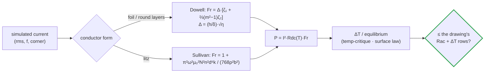
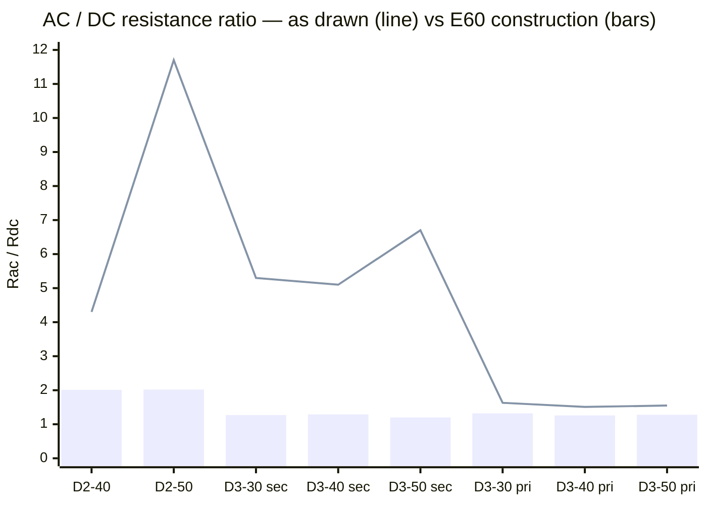

# 🧵 Conductor Selection

<sub>Which copper each winding uses and why — foil gauge, litz strand and AC resistance at 140 kHz</sub>

<p>
  
  
  
  
</p>

> [!NOTE]
> **Purpose** — answer "which copper should we use" for every winding, bar and trace, from
> physics at the **simulated** currents and frequencies, not from DC current density.
>
> **Gate coupling** — [`calculations/magnetics/conductor-audit.mjs`](../calculations/magnetics/conductor-audit.mjs)
> recomputes every row below on every battery run. Its currents come from
> `simulation-results/<sku>/llc-stress.csv` (power-solved ngspice) and
> `calculations/out/vienna-switched.csv` (cycle-by-cycle Vienna).
> [`verify-independent.mjs`](../calculations/verify-independent.mjs) §B re-derives the D2 rows with its
> own Sullivan code.

> [!IMPORTANT]
> **The one-line lesson.** Above ~50 kHz, the right conductor is set by **proximity effect**, not current density.
> Four E43–E52 constructions were sized by DC resistance ×1.15, and at 140 kHz they computed 5–12× their DC
> resistance. The D2-50 trim, for example, ran 45 W instead of 5.4 W, and its first article would have failed its
> own Rac row. E60 fixes them by choosing **foil gauge, strand size, turns and window** from Dowell and Sullivan.

## 1. The physics in four numbers

| Quantity (annealed Cu, IEC 60028: ρ₂₀ = 1.7241 µΩ·cm, α = 0.00393/K) | 20 °C | 100 °C |
|---|---|---|
| Resistivity ρ | 1.724 µΩ·cm | **2.266 µΩ·cm** (+31 %) |
| Skin depth δ @ 50 kHz (Vienna ripple) | 0.295 mm | **0.339 mm** |
| Skin depth δ @ 140 kHz (LLC at resonance) | 0.177 mm | **0.202 mm** |
| Skin depth δ @ 190 kHz (LLC top of the PFM band) | 0.152 mm | **0.174 mm** |



```math
F_r^{\,\mathrm{Dowell}} = \Delta\left[\zeta_1 + \tfrac{2}{3}\left(m^2-1\right)\zeta_2\right],\qquad
\Delta = \frac{h}{\delta}\sqrt{\eta},\qquad
\zeta_1 = \frac{\sinh 2\Delta + \sin 2\Delta}{\cosh 2\Delta - \cos 2\Delta},\qquad
\zeta_2 = \frac{\sinh \Delta - \sin \Delta}{\cosh \Delta + \cos \Delta}
```

```math
F_r^{\,\mathrm{Sullivan}} = 1 + \frac{\pi^2\,\omega^2\,\mu_0^2\,N^2\,n^2\,d^6\,k}{768\,\rho^2\,b^2},\qquad
\delta = \sqrt{\frac{2\rho}{\omega\,\mu_0}},\qquad
P_{\mathrm{Cu}} = I_{\mathrm{rms}}^2\,R_{\mathrm{dc}}(T)\,F_r
```

- **Dowell** (foil, round-wire layers): `m` = layers in a winding portion where the MMF rises from 0 to its
  maximum. `η` = porosity (foil width / window height).
- **Sullivan** (litz): `N` turns, `n` strands, strand diameter `d`, window breadth `b`. Use `k = 1` for a 0 → NI
  portion (an inductor, or a non-interleaved winding) and `k = 0.25` for a layer sandwiched between two
  half-current windings (the D3 primary in S1–P–S2).
- The proximity term grows as **(N·n)² d⁶ / b²**. Adding strands to cut DC current density *raises* AC loss once
  past the Sullivan optimum n* = 1/√K, where Fr = 2.

## 2. Verdict per winding (at the worst simulated corner)

| Part | Conductor (E60) | Ratio | Rac/Rdc | Cu loss | ΔT / row | Was (as drawn) |
|---|---|---|---|---|---|---|
| **D1-30/40/50** PFC choke | 9× / 13× 1.6 mm dual-coat round, 2 layers | d/δ 4.7 @50 kHz | 11.4 on the ripple only | 28 / 26 / 38 W | ripple is 11 % of rms → HF share 13–15 % | **unchanged — right conductor** (litz would buy <5 %) |
| **D2-30** trim | 2× PQ50/50, N 4, litz 1350×0.1 | — | 1.97 | 4.3 W | Rac 1.93 ≤ 4 mΩ · ΔT 36 K | **unchanged** |
| **D2-40** trim | **1× E70/33/32, N 5, litz 4150×0.071** | — | 2.01 | 8.7 W | Rac 2.29 ≤ 2.6 mΩ · ΔT 38 K SER / 32 K cont. | 2× PQ50, N 5, 2000×0.1 → Fr **4.3**, 13.6 W |
| **D2-50** trim | **2× E70/33/32, N 3, litz 2500×0.1** | — | 2.02 | 9.4 W | Rac 1.61 ≤ 2.0 mΩ · ΔT 31 K | 2× PQ50, N 6, 3000×0.1 → Fr **11.7**, 45 W |
| **D3-30** secondaries | **Cu foil 0.10 × 28 mm**, 7 layers each | h/δ 0.49 | 1.27 | 8.7 W (both) | ≤ 1.35 ✓ | 0.20 mm → Fr **5.3**, 17.9 W |
| **D3-40** secondaries | **Cu foil 0.127 × 28 mm**, 6 layers | h/δ 0.63 | 1.29 | 20.7 W | ≤ 1.35 ✓ | 0.25 mm → Fr **5.1**, 42 W |
| **D3-50** secondaries | **Cu foil 0.127 × 28 mm**, 5 layers | h/δ 0.63 | 1.20 | 25.0 W | ≤ 1.35 ✓ | 0.30 mm → Fr **6.7**, 59 W |
| **D3-30/40/50** primaries | profiled litz, **0.071 mm strands** (2475 / 3486 / 4370) at the same Cu area | — | 1.32 / 1.26 / 1.28 | 5.4 / 10.8 / 11.2 W | ≤ 1.35 ✓ | 0.1 mm strands → 1.63 / 1.51 / 1.55 |
| **D4** aux flyback primary | 2×0.35 mm bifilar (build default) | d/δ 1.2 @65 kHz | ~2.0 | < 1 W | inside the D4 row | 0.5 mm single computes the same — bifilar winds flatter |
| **D6 / D7** EMI chokes | foil / flat at 50 Hz | δ(50 Hz) 10.7 mm | ≈1.0 | per engine | unchanged | — |



*SER = the series-mode hysteresis corner (bank 250 V, full power), now a falling-command-only state (FW-R8).
"cont." = the worst continuous PAR/PS Imax corner.*

### Why D2-40/50 changed cores, not just litz

The winding field of an inductor is H ≈ N·I/b. On the PQ50/50 (b = 30.4 mm), 6 turns at 109 A pk
put ~21 kA/m across 18,000 strands. The best strand count at *any* practical strand size still
computed 42–53 K. Moving to the E70/33/32 window (b ≈ 41 mm) and fewer turns cuts that field by 2.6×. The E70
is already on the BOM for D3-40/50, so this adds no new supply chain.

| D2 option (worst corner) | Mass | ΔT cont. / SER | Decision |
|---|---|---|---|
| 2× PQ50/50 N 6, 7330×0.05 mm (best on the old core) | 0.45 kg | 42 / 53 K | ✗ |
| 1× E70 N 5, 4150×0.071 mm | **0.54 kg** | 32 / 38 K (40 kW) · 41 / 50 K (50 kW) | ✓ **D2-40** |
| 2× E70 N 3, 2500×0.1 mm | 1.09 kg | 21 / 24 K (40 kW) · 27 / 31 K (50 kW) | ✓ **D2-50** |

### Foil gauge is an electrical parameter

D3 secondary copper loss vs foil thickness (both windings, SER corner, 100 °C):

| Foil (mm) | 0.08 | **0.10** | **0.127** | 0.15 | 0.20 | 0.25 | 0.30 |
|---|---|---|---|---|---|---|---|
| D3-30 (7 layers) | 9.5 W | **8.7 W** | 9.2 W | 10.8 W | *17.9 W* | 29.8 W | 45.6 W |
| D3-40 (6 layers) | 26.7 W | 22.7 W | **20.7 W** | 21.2 W | 27.9 W | *41.9 W* | 62.6 W |
| D3-50 (5 layers) | 34.2 W | 28.5 W | **25.0 W** | 24.5 W | 29.2 W | 40.9 W | *59.0 W* |

*Italic = the E51 as-drawn gauge.* The minimum is flat around the Dowell optimum.
**0.127 mm** is chosen for both E70 variants: one foil, and Rac/Rdc stays ≤ 1.35 where 0.15 mm drifts above it.
Thinner foil also frees window (the E51 fill margins only improve).

## 3. Copper grades, insulation and plating

| Use | Material / form | Standard / class | Why |
|---|---|---|---|
| Magnet wire (D1, D6 round) | annealed **Cu-ETP** (CW004A / C11000, ≥100 % IACS) | IEC 60317-0-1; **dual-coat polyester-imide + polyamide-imide, Class 200** (IEC 60317-13) | abrasion-tough for toroid winding; 200 °C class over a ≤120 °C hotspot |
| Litz strands (D2, D3 primaries) | **Cu-ETP or Cu-OF** (CW008A / C10200) — OF preferred ≤0.071 mm (fewer breaks in fine drawing) | solderable polyurethane **Class 155/180** (IEC 60317-20 / -51) | solder-pot termination without stripping; 0.071 mm = AWG 41 |
| D3 secondary foil | **Cu-ETP O-temper (annealed)** foil 0.10 / 0.127 mm, slit edges deburred | EN 13599 / ASTM B152; thickness ±8 % | soft for winding; the gauge IS the Rac |
| Reinforced barrier (D3 sec, D4 sec) | **TIW / FIW** | IEC 60317-56 (FIW) / TIW per IEC 62368-1 Annex J; **thermal class ≥ the Class F/H system** | D3 equilibria reach 102–107 °C (E60). Check the reel class: a Class B (130 °C) TIW is the weak link. |
| Busbars / studs | **Cu-ETP C11000 half-hard**, **tin-plated 5–8 µm** | EN 13601 / EN ISO 2093 | tin resists humidity and sulfur and forms gas-tight bolted joints; silver tarnishes in H₂S, bare Cu frets |
| Power PCB copper | **2 oz (70 µm) outer / 2 oz inner**, current paths sized per IPC-2152 | IPC-6012 class 2, conformal-coated (E52) | layout phase E36 — this row is the input |

> [!NOTE]
> **Aluminium** stays restricted to the non-commutation bulk runs already marked "Al viable" in
> [`busbar-drawings.md`](busbar-drawings.md) (bimetal washers, re-torque). **Never** use it in a
> winding, filter loop or shunt zone.

## 4. Build rules that protect the AC resistance

1. **Never parallel foils in the same layer position.** Two stacked 0.1 mm foils are two layers to Dowell.
2. **Strand size is the spec, copper area is the constraint.** A winder substituting 0.1 mm strands for
   0.071 mm at equal area raises the D3 primary Fr from 1.3 to 1.6.
3. **Litz termination with fine strands:** solder pot per the enamel sheet (Class 155 PU ≈ 390–410 °C,
   Class 180 PU ≈ 420–440 °C), 2–4 s. Inspect for 100 % wetted strands; dry strands raise Rdc and Rac.
4. **Keep litz ≥5 mm radially clear of every gap plane on D2 (≥2.5× the per-position gap), and distribute
   every gap.** Fringing fields near a gap add loss the 1-D models do not include (next section).
5. **Measure Rac, don't infer it:** first article at 140 kHz per winding (D3 with shorted-secondary method),
   compared with the audit row (manufacturing pack step 0).
6. **D3: grind the Lm gap equally on every core set** (3 positions on the PQ50 3-stack, 2 on the E70 2-set,
   ≤ 0.5 mm each). The S1 foil is the innermost winding, so it sits closest to the centre-leg gap.

> [!WARNING]
> **Where Dowell and Sullivan stop being conservative (E60 research, verified 3-0).** Both are 1-D models: they
> assume the field runs parallel to the layers. Next to an air gap the fringing field has a component across the
> conductor. On a 28 mm-wide foil that drives eddy currents in the foil's width, not its thickness. In a published
> 4-turn gapped foil inductor, the foil nearest the gap carried about 82 % of the winding loss (2-D PEEC and FEM
> agree). A 1-D model can only under-read that loss.
>
> **How each part is protected:**
> - **D2** puts the full N·I across its gap. It uses litz, not foil, with distributed gaps and ≥5 mm clearance, and
>   its Rac test excites the real gap field.
> - **D3** puts only the magnetizing MMF (N·Im, largest at PAR-525) across its gap. The gap is now split per set.
>   Shorted-secondary Rac cannot see this loss because a shorted secondary cancels Im, so T-31 adds an
>   open-secondary 140 kHz check and a thermocouple on S1 at the PAR-525 corner.
> - A **FEMMT** 2-D axisymmetric run of D3 with the PAR-525 currents quantifies it before the first article
>   ([`simulation-toolchain.md`](simulation-toolchain.md)).

## 5. What the battery proves vs what EVT closes

| Proven every run | EVT / first article closes |
|---|---|
| Rac/Rdc and Cu loss per winding at the simulated worst corners · ΔT on the measured-3C95 core basis · equilibrium + runaway (temp-critique) | measured Rac at 140 kHz (±15 % vs model is the reopen trigger) · gap-fringing adders on D2 (Rac test) and D3 S1 (T-31 open-secondary + thermocouple, FEMMT) · thermal type-test at the class current |

---

<div align="center">
<sub><a href="magnetics.md">← Magnetics Drawings D1–D7</a> &nbsp;·&nbsp; <a href="README.md">🧭 Documentation hub</a> &nbsp;·&nbsp; <a href="magnetics-manufacturing-pack.md">Magnetics RFQ Pack →</a></sub>

<sub>Vectivolt DC-Modules · documentation rev E61 · every number reproduces with <code>sh calculations/run-all.sh</code></sub>
</div>
