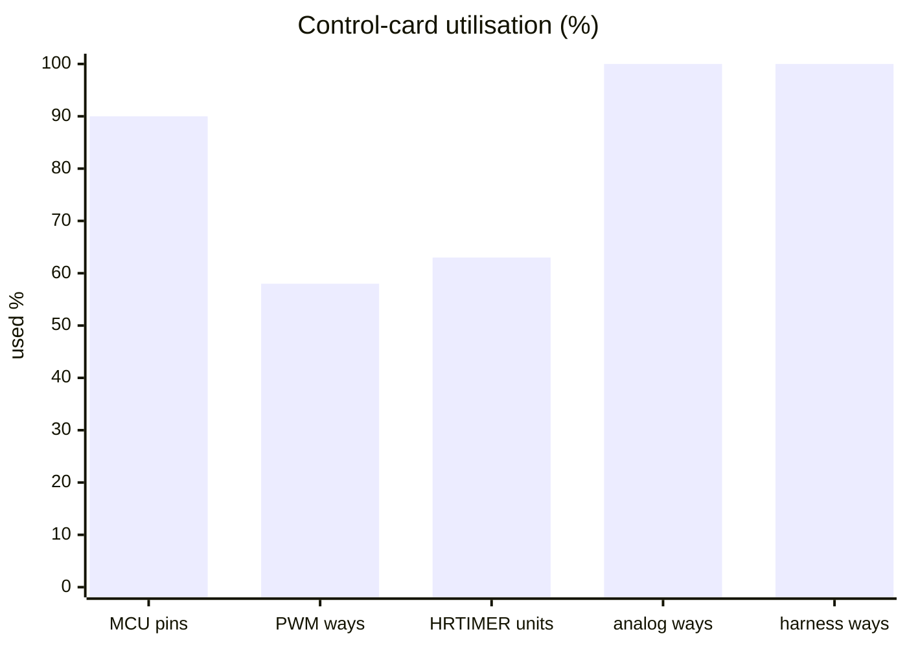
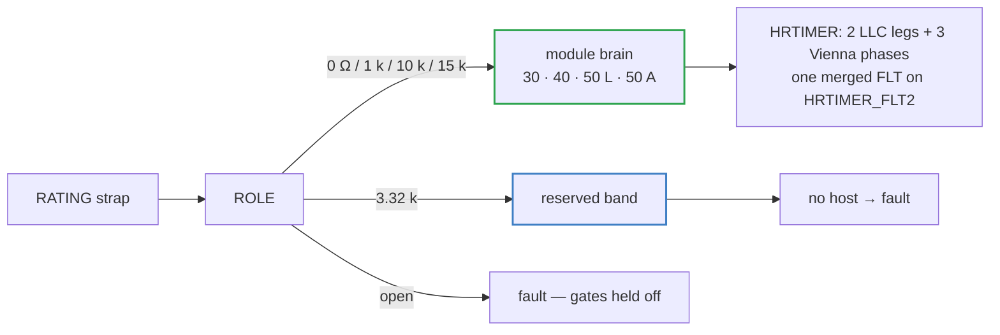

# 🧠 Control-Card Scope

Why one card runs one module up to 50 kW — connector ways, HRTIMER units and MCU pins

  
  
  
  

> [!NOTE]
> **Purpose** — why one control card runs one module, and why that sets the module ceiling at 50 kW. The limits are
> a connector way count, a timer-peripheral count and a pin count — not layout effort.
>
> **Gate coupling** — `cardMap()` throws for any configuration outside `CARD_SCOPE`, and `umod-pinmap.mts` regenerates
> the single pin map (`umod-map.gen.ts`) that every board and the interconnect audit consume.

## At a glance — the budget

| Resource | Used | Available | Headroom |
|---|---:|---:|---|
| MCU pins (GD32G553VET7, LQFP100) | **75** | 82 usable | **7 spare** |
| PWM ways on the 88-way slot | **7** — 4 LLC bridge gates + 3 Vienna phases | 12 | 5 |
| HRTIMER slave units | **5** — ST0 / ST1 the LLC legs, ST3–ST5 the Vienna phases | 8 | 3 |
| Analog ways on the slot | **22** | 22 | 0 |
| 40-way harness | **40** | 40 | 0 — the last way carries TACH4 on the 50 kW air |
| On-chip comparators for the fast PFC trip | **3** — CMP3 · CMP1 · CMP2, one instance per phase | — | instance- and polarity-verified against the pin table |

## 1. What one card does

One card reads its SKU from the RATING strap at boot and runs one module: three Vienna phases, one full-bridge LLC,
the relay matrix, the senses, the HMI and the CAN link. Putting the whole LLC on the HRTIMER gives it
sub-nanosecond resolution, native per-unit phase offset, hardware dead time per leg — the dead-time generator lives
in the complementary pair, so a leg must own a whole slave unit — and **one filtered fault pin that gates every
output in hardware**. The Vienna phases sit on the same timer for the same reason: a single break input kills all
six switches with no firmware in the loop.

> [!IMPORTANT]
> **Why the family stops at 50 kW per module.** A module is one lane. A second lane on the same card would need
> about 18 more PWM ways and four more analog ways against 13 spare slot ways, five more HRTIMER slave units against
> three spare, and more pins than the 8 that are left — so it would ship as two cards and cost what two smaller
> modules already cost. Chargers above 50 kW therefore run modules in parallel, each with its own card; the 3.32 k
> strap band is reserved.

> [!WARNING]
> **Spreading gate PWMs across the general-purpose timers is not a free alternative.** A GPIO selects exactly ONE
> alternate function, and the advanced timers share their break-input pins (PA6 is TIMER7_BRKIN0 at AF4 and
> TIMER0_BRKIN0 at AF6). Any allocation that splits the bridge across TIMER0 / TIMER7 / TIMER19 therefore leaves at
> least one of those timers — and the switches it drives — with **no hardware break input at all**. That is why the
> card refuses to grow a second lane instead of re-allocating: `cardMap()` throws for any configuration outside
> `CARD_SCOPE`, rather than emitting the plausible, buildable, wrong netlist that a silently truncated map produces.

## 2. The card is role-agnostic

The card's MCU is wired to generic nets — `PWM0..11`, `AIN0..12`, `ANA*`, `TSNS*`, `DO*`, `DI*` — and the meaning of
each way is given by the board it plugs into. That is what lets one card, one firmware image and one pin map serve
all four SKUs, with the strap deciding the current classes, the fan personality and the discharge window.
`calculations/control/umod-pinmap.mts` is the single source for the mapping; `port-pin-audit` locks the GD32 port to
the same table, and `module-interconnect-audit` proves every way lands on real electronics on both sides.

> [!TIP]
> **How this page is checked** — `cardMap()` throws for any configuration outside `CARD_SCOPE`, and `calculations/control/umod-pinmap.mts` regenerates the one pin map (`umod-map.gen.ts`) that every board, the interconnect audit and the GD32 port pin audit consume.

---

<a href="interconnect.md">← Two-Board Sandwich & Interconnect</a> &nbsp;·&nbsp; <a href="README.md">🧭 Documentation hub</a> &nbsp;·&nbsp; <a href="firmware-guide.md">Firmware Guide →</a>

Vectivolt DC-Modules · documentation rev E85 · every number reproduces with <code>sh calculations/run-all.sh</code>

