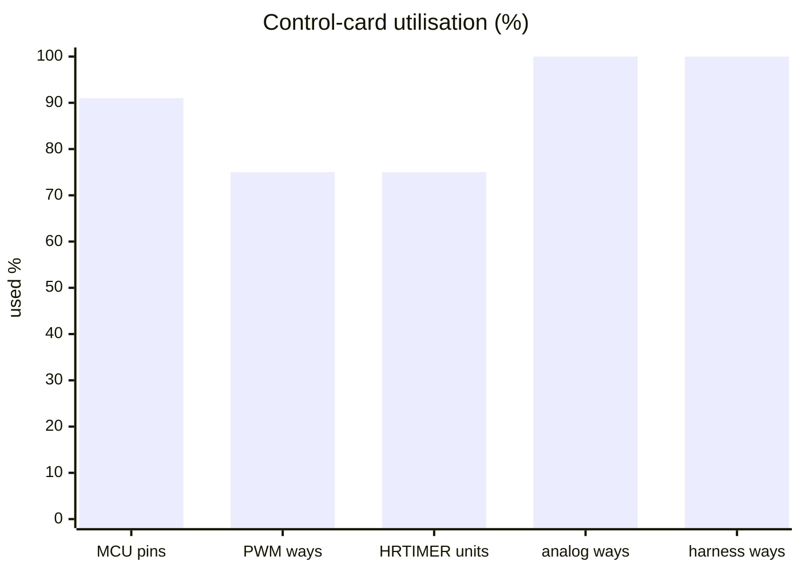
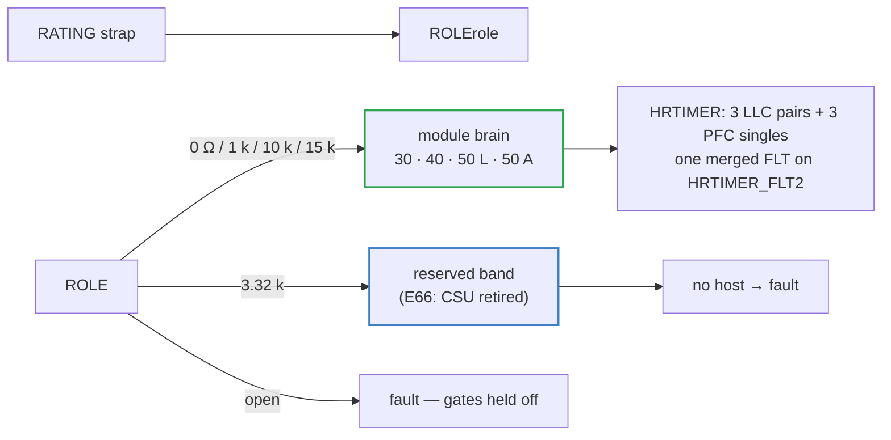

# 🧠 Control-Card Scope

Why one card runs one module up to 50 kW — connector ways, HRTIMER units and MCU pins

  
  
  
  

> [!NOTE]
> **Purpose** — why one control card runs one module, and why that sets the module ceiling at 50 kW. The limits are
> a connector way count, a timer-peripheral count and a pin count — not layout effort.
>
> **Gate coupling** — `cardMap()` throws for any configuration outside `CARD_SCOPE`, and `umod-pinmap.mts` regenerates
> the single pin map (`umod-map.gen.ts`) that every board and the interconnect audit consume.

## At a glance — the budget today (E40 single brain, E44 fourth tach)

| Resource | Used | Available | Headroom |
|---|---:|---:|---|
| MCU pins (GD32G553VET7, LQFP100) | **75** | 82 usable | 7 spare |
| PWM ways on the 88-way slot | **9** | 12 | 3 |
| HRTIMER slave units | **6** — ST0–ST2 LLC pairs, ST3–ST5 PFC singles | 8 | 2 |
| Analog ways on the slot | **22** | 22 | 0 |
| 40-way harness | **40** | 40 | 0 — the last spare way carries TACH4 on the 50 kW air |
| On-chip comparators for the fast PFC trip | **3** — CMP7 · CMP1 · CMP2 | — | instance-verified at R7 |

> [!IMPORTANT]
> **Why the family stops at 50 kW per module.** A module is one lane: 3 Vienna phases and 3 LLC sections. A monolithic
> 60 kW module needs a second lane — about 18 PWM and ~30 analog signals — which no single card can carry, so it would
> ship with two cards and cost what two 30 kW modules already cost. Power above 50 kW is therefore built from modules:
> **100 kW = 2 × 50** and **150 kW = 3 × 50** — E66: no cabinet card; the charger controller is the group master and the 3.32 k strap band is reserved.

## What one card does

Putting the whole LLC on the HRTIMER gives it sub-nanosecond resolution, native per-unit phase offset, hardware
dead-time per leg and a single filtered fault pin that gates every output in hardware. That was only possible once
the card's scope was one lane: the historical 120 kW allocation below needed 24 LLC outputs from a 16-output timer.

## The historical arithmetic — why one card could never serve 120 kW

> [!NOTE]
> This analysis sized the card era (before E40) and still answers the recurring "why not a bigger single machine"
> question. It refers to the retired 60 / 120 kW single-board references (archived on `archive/pre-focus-E49`).
> Its §6 open item was later **decided**: at E40 the LLC moved onto HRTIMER units and FLT moved to pin 47.

<b>Connector ways · timer units · pin budget · what the old code did · where the ceiling was</b>

**No.** Three independent limits, any one of which is fatal on its own. None is a matter of
layout effort — they are a connector way count, a silicon peripheral count, and a pin count.

The card is now built to refuse rather than silently mis-generate: `cardMap()` throws for any
configuration outside `CARD_SCOPE`. Before that guard it produced a plausible, buildable, **wrong**
netlist at 120 kW (see §4).

#### 1. Connector ways — short by 16

The card is an 88-way connector. At its designed ceiling it already uses most of them:

| configuration | ways used | PWM ways | AIN ways |
|---|---|---|---|
| 30 kW AC-DC | 46 | 3 of 12 | 8 of 13 |
| 30 kW DC-DC | 63 | 6 of 12 | 8 of 13 |
| 60 kW AC-DC | 52 | 6 of 12 | 11 of 13 |
| **60 kW DC-DC** | **72** | **12 of 12** | **11 of 13** |
| 120 kW DC-DC | — | **24 needed** | **17 needed** |

At 60 kW DC-DC the gate-drive group is **exactly full**: 12 ways for 6 LLC legs × (H, L). 120 kW is
12 legs, so it needs 24 — twelve more ways than the group defines — plus 4 more analogue. The map
defines 75 ways with 13 spare; 75 + 16 = 91 > 88. **It does not fit even if every spare way is
spent**, and that is before the extra per-lane fault lines and thermistors a 120 kW machine needs
(one `T_PFC` thermistor for twelve Vienna legs is not instrumentation).

#### 2. Timer outputs — the HRTIMER has 16, the job needs 24

From `docs/history/mcu-pin-allocation-gd32.md` (GD32G553xx Rev 2.0, §3.22): the HRTIMER is
**8 slave units × 2 channels = 16 outputs**. A 120 kW LLC needs 24 complementary gate signals.

The binding number is the **units, not the channels**. A half-bridge leg driven as a complementary
pair consumes one whole slave unit, because the dead-time generator lives in the pair. So:

| | 30 kW | 60 kW | 120 kW | available |
|---|---|---|---|---|
| LLC legs = HRTIMER units | 3 | 6 | **12** | **8** |
| LLC gate outputs (H+L) | 6 | 12 | **24** | **16** |

120 kW is over on both counts. `calculations/control/mcu-matrix.mjs` had been comparing 12 *pairs*
against 16 *channels* and reporting 120 kW as fitting; it now compares legs against units.

The released 120 kW allocation only "fits" by abandoning the HRTIMER for the LLC and spreading the
24 PWMs across TIMER0 / TIMER7 / TIMER19. The R3 audit records what that costs, and it is not a
performance note:

> `FLT_LLC -> pin 28 (PA6)` — **HARD ERROR, safety-critical.** Table 2-10 puts TIMER7_BRKIN0 on PA6
> at AF4 and TIMER0_BRKIN0 on PA6 at AF6. A GPIO selects exactly ONE alternate function, so PA6 can
> be the break input for TIMER0 **or** TIMER7, never both.

One of the three advanced timers — **4 of the 12 legs, 8 switches at 120 kW** — would have no
hardware break input at all. The PFC side does not have this problem: all 12 Vienna PWMs sit on the
HRTIMER, so a single pin gates every switch in hardware with 24 ns latency.

#### 3. Pin budget — 87 of 100 already spent, with the fans not yet allocated

The 120 kW DC-DC allocation consumes **87 of 100 pin landings**. The audit's completeness finding:

> **Fan tach and fan PWM (absent from the entire map)** — no input-capture channel and no fan PWM
> output is allocated anywhere in the 100 pins, and there is no spare left in a convenient location
> once the break-input and placement fixes land.

The card additionally carries `ROLE0`, `ROLE1` (rating code), `AVMID` and `DRV_RDY`, none of which
the bare 120 kW map ever carried. There is nowhere to put them.

#### 4. What the old code did instead of refusing

Every group in `cardMap()` is a fixed-length loop over a longer source array, so at 4 lanes it
**truncated in silence**. The netlist it produced at 120 kW was not short — it was wrong:

| group | emitted | missing |
|---|---|---|
| gate drive | 12 high-side | **all 12 low-side** (`PWM_L1L` … `PWM_L12L`) |
| DC-DC analogue | 13 of 17 | `SNS_VBKB`, `SNS_VOUT`, `SNS_IOUT`, `SNS_IOUTN` |
| AC-DC analogue | 13 of 17 | `SNS_VAC2`, `SNS_VAC3`, `SNS_VBUSP`, `SNS_VMID` |

Those are not spares. `SNS_VBUSP` is the bus regulation feedback, `SNS_VMID` the Vienna midpoint
balance, `SNS_IOUT` the output current loop, and `SNS_VAC2/3` two of the three mains phases. Every
LLC leg would have had a floating low-side gate. The board built, passed DRC and exported.

#### 5. Where the ceiling actually is

**60 kW DC-DC**, and it is a hard edge, not a comfortable one: the PWM group is at 12 of 12. Any
growth in leg count needs a bigger connector *and* a different timer story *and* more pins — which
is the same conclusion the mechanical analysis reached independently: 120 kW is **2 × 60 kW or
4 × 30 kW in a cabinet**, not one board pair (`boards/120kw/*.tsx`, `docs/pcb-floorplan.md` §2).

If a single 120 kW card were ever required, the minimum change set is: a ≥104-way connector, an MCU
with ≥24 timer outputs and a hardware break input per timer group, and a re-run of the analogue
budget. That is a different card and a different part number — which is the thing having one card
was meant to avoid.

#### 6. Open item the scope restriction actually *unlocks*

`docs/history/mcu-pin-allocation-gd32.md` leaves the **HRTIMER-vs-advanced-timer choice for the LLC** open,
and at 120 kW there was no choice to make: 24 outputs needed, 16 available, so the LLC had to go on
TIMER0/7/19 and inherit the PA6 break-input conflict.

**At card scope the constraint disappears.** 60 kW DC-DC is 6 legs — 6 of the 8 slave units, 12 of
the 16 outputs, with two units spare. So the card *can* put the whole LLC on the HRTIMER: sub-ns
resolution, native per-unit phase offset, one filtered fault pin gating every output in hardware,
and — because each leg gets its own unit in complementary mode — **hardware dead-time**, which the
PFC allocation had to give up (it puts two different phases on the two channels of one unit, so
those units must run independent and their dead-time generators are unavailable).

This is not yet done. The card's PWM group and `FLT` pin are inherited from the released ULLC map,
which was allocated for the advanced-timer plan:

| | current (inherited) | if the LLC moves to HRTIMER |
|---|---|---|
| `PWM0..11` | TIMER0/7/19 channels | HRTIMER ST0..ST5, CH0/CH1 |
| `FLT` | pin 28, PA6, TIMER7_BRKIN0 | an `HRTIMER_FLT*` pin (e.g. PB10 / pin 47, as the PFC uses) |

Two consequences if it is taken: `PWM0..11` and `FLT` get new pins, and `EN_B` has to vacate pin 47.
`calculations/control/umod-pinmap.mts` regenerates the map (single source since E40; the card-era pinmap tools retired at E54), so this is a table change, not a rework —
but it is an **architecture decision, not a layout one**, and it should be made before the pinout
is frozen. Flagged, not decided.

---

<a href="interconnect.md">← Two-Board Sandwich & Interconnect</a> &nbsp;·&nbsp; <a href="README.md">🧭 Documentation hub</a> &nbsp;·&nbsp; <a href="firmware-guide.md">Firmware Guide →</a>

Vectivolt DC-Modules · documentation rev E61 · every number reproduces with <code>sh calculations/run-all.sh</code>

