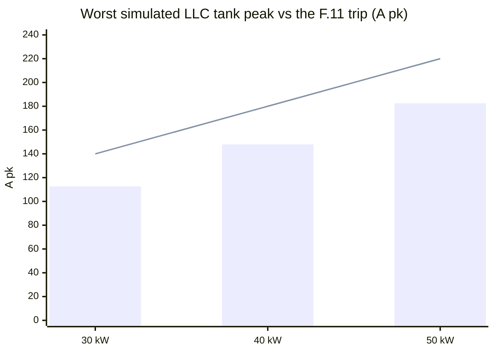
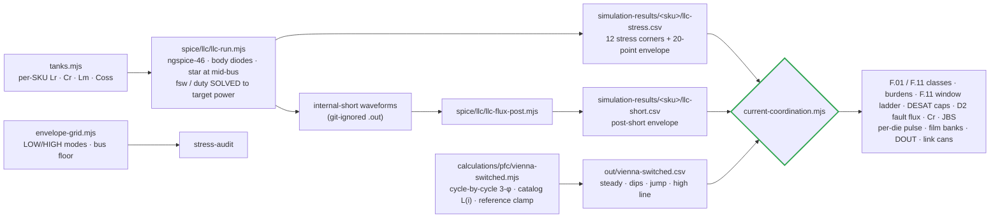
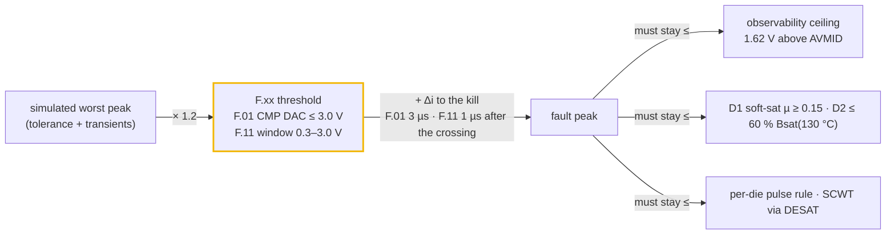
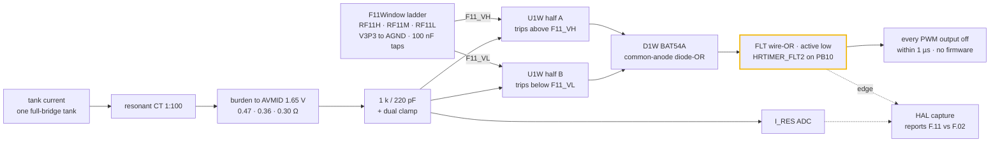
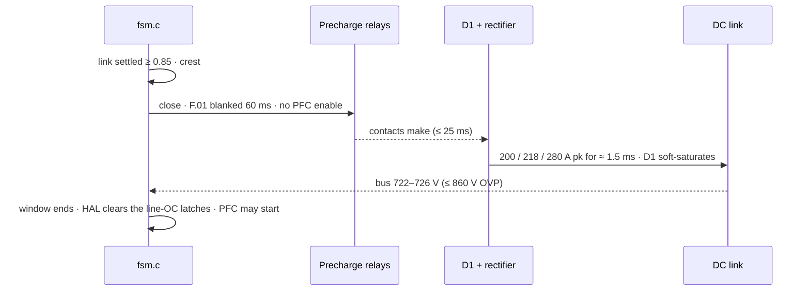

# ⚡ Current & Protection Coordination

The worst simulated current in every magnetic and switch, against the trip, sensor and part that must handle it

  
  
  
  

> [!NOTE]
> **Purpose** — the maximum current through every magnetic and every switch, taken from simulation at the
> worst legal corners. Each is set against the trip that must clear it, the sensor that must see the
> fault, and the part that must survive it.
>
> **Gate coupling** — [`current-coordination.mjs`](../calculations/system/current-coordination.mjs) (this
> document's numbers) · [`llc-flux-post.mjs`](../spice/llc/llc-flux-post.mjs) (the committed internal-short
> envelope) · [`ct-frontend.mjs`](../spice/protection/ct-frontend.mjs) (CT chain decks) ·
> [`conductor-audit.mjs`](../calculations/magnetics/conductor-audit.mjs) (copper) ·
> [`envelope-grid.mjs`](../calculations/system/envelope-grid.mjs) (the thermal envelope) ·
> firmware `pmp_fsm_set_rating_kw()` (the classes the HAL programs).

## 1. Verdict at a glance

Every number below is `current-coordination.mjs` output on the committed simulation results.

| | 30 kW | 40 kW | 50 kW liquid | 50 kW air |
|---|---|---|---|---|
| Worst PFC line peak (dips + phase jump incl.) | 97.0 A | 127.1 A | 159.3 A | = 50 kW |
| **F.01 line OC** · trip / peak | **120 A** · 1.24× | **155 A** · 1.22× | **195 A** · 1.22× | = |
| F.01 fault peak (+3 µs race) → ceiling | 165.3 → 184.1 A | 204.9 → 225.0 A | 266.4 → 311.5 A | = |
| **PFC die at the F.01 fault peak** vs 0.8 × IDM | 165.3 vs **168 A** (IDM ≥ 210 A line) | 204.9 vs **208 A** (≥ 260 A line) | 266.4 vs 384 A (IDM 480 A) | = |
| Worst LLC tank peak (SER 250 V at the 764 V bus) | 112.6 A | 147.9 A | 182.5 A | 182.5 A |
| **F.11 tank OC** · trip / peak | **140 A** · 1.24× | **180 A** · 1.22× | **220 A** · 1.21× | = |
| **F.11 kill peak** (window, +1 µs) → ceiling · burden | **210.3 → 344.7 A** · 0.47 Ω | **261.2 → 450 A** · 0.36 Ω | **320.0 → 540 A** · 0.30 Ω | = |
| **LLC position at the fast kill peak** vs 0.9 × IDM × dies | 198.1 A vs 238.5 A (one die) | 251.3 vs 477 A (two dies) | 308.3 vs 477 A (two dies) | = |
| DESAT worst response vs SCWT class | LLC 1.34 / 2.0 µs · PFC 2.21 / 4.2 µs | = | = | = |
| D2 flux at the F.11 kill peak (≤ 217 mT) | 158 mT | 157 mT | 154 mT | 154 mT |
| Max tank RMS vs class | 70.5 / 78 A | 93.4 / 100 A | 116.1 / 120 A | 116.1 / 120 A |
| Film-bank ripple · per film / output | 3.82 A · 0.47 % | 3.72 A · 0.44 % | 3.93 A · 0.46 % | = |

> [!WARNING]
> **Two pulse margins are thin by design.** The fault-pulse rule lets a trip-limited, non-repetitive µs pulse reach
> 80 % of the die's 25 °C IDM listing (the 20 % is the hot-start allowance). The 30 kW PFC die lands at 165 A against
> 168 A and the 40 kW PFC die at 205 A against 208 A. They pass only because the RFQ acceptance lines —
> **750 V 20 mΩ class ≥ 210 A, 15 mΩ class ≥ 260 A**, and **SG2M023120LJ IDM ≥ 265 A** for the 30 kW single LLC die —
> are enforced. A part listed at the common 250 A would fail. A lot that misses its line reverts that SKU (two LLC
> dies / B3M010C075Z), and EVT T-41 samples the pulse class on incoming dies.

*Bars = simulated worst peak (SER 250 V at the 764 V bus). Line = the F.11 classes (140 / 180 / 220 A).*

## 2. How the currents were obtained

Every LLC corner is **power-solved**: the switching frequency (PFM) or duty (phase-shift surrogate) is bisected until
the simulated bank power equals the target within ±1.5 %. Each result carries a fingerprint of the drawn tank, so a
tank change without a re-run fails the gate. The internal-short race is committed as a post-short envelope, so the
F.11 check never needs the git-ignored waveforms ([§6](#6-f11-fast-path--window-comparator-and-the-internal-short-race)).

## 3. LLC tank — the current map (power-solved ngspice)

From `simulation-results/<sku>/llc-stress.csv` (fingerprint `FB n2`). Ip is the tank (primary) current.

| Corner | What it is | 30 kW Ip rms / pk | 40 kW | 50 kW | fsw (30 kW) | Note |
|---|---|---|---|---|---|---|
| **SER250-full-bus764** | HIGH mode, 500 V out (bank 250 V), rated power, high-line bus floor, phase shift at f_max | 70.5 / **112.6** | 93.4 / **147.9** | 116.1 / **182.5** | 202.9 kHz | sets F.11 and the tank class |
| SER250-full | the same at the 650 V bus | 67.8 / 93.9 | 90.5 / 125.2 | 112.8 / 155.2 | 198.5 kHz | twice the LOW-mode current at the same Vout |
| SER250 tolerance Hi / Lo | tank at +5 % / −5 % | 68.4 / 95.1 · 67.7 / 95.8 | 90.6 / 125.4 · 89.9 / 126.2 | 113.2 / 156.0 · 112.6 / 156.1 | 186.7 / 202.9 kHz | |
| PAR500-full-gainWorst | LOW mode, 500 V, gain-worst tolerance, bus 830 | 45.5 / 73.6 | 60.4 / 98.5 | 75.5 / 124.0 | 83.3 kHz | Im 40.5 / 51.8 / 63.1 A · capability ✓ |
| PAR400-full | the rated efficiency point | 44.7 / 62.1 | 59.6 / 82.4 | 74.2 / 102.6 | 152.1 kHz | loss-budget basis |
| PAR300-full | constant-power knee | 57.2 / 77.5 | 75.2 / 103.2 | 93.8 / 127.8 | 161.6 kHz | |
| PS150-Imax | 150 V at Imax, phase shift | 60.0 / 100.9 | 79.4 / 132.4 | 99.1 / 164.6 | 202.9 kHz | the film-bank ripple corner |

Secondary rectifier average current per bridge position at the SER corner is 30 / 40 / 50 A, shared by two JBS dies.
FET turn-off current peaks at 90.5 / 120.0 / 147.4 A per position in PFM (SER250-full).

**ZVS holds on all four switches at every corner except the registered weak-leg exceptions.** In deep phase shift the
zero state ends with the rectifier conducting, so leg A — the leg whose edges *end* that state — commutates on the
decayed tank current through L_r alone and lands with a residual across the incoming die: 32/64 edges at
SER250-full-bus764, PAR200-Imax and PS150-Imax, with residuals of 84 / 124 / 291 V (30 kW), 231 / 257 / 389 V (40 kW)
and 232 / 268 / 387 V (50 kW) against their link. Those residuals are not absorbed silently: the grid charges the
incoming die with a hard-turn-on term built from them, and the firmware carries the same map
([thermal report §3](thermal-report.md#3-junction-temperatures--the-worst-point-of-the-grid)). The snubber is
330 / 680 / 1000 pF per die and Qoss 371 nC per die at 800 V.

**Internal rectifier short** (bank collapses from SER250-full-bus764, no trip modelled): the running maximum of the
tank current is 210.3 / 261.2 / 320.0 A 3 µs after the short and 376.3 / 472.9 / 577.0 A after 10 µs. F.11 is
coordinated against this race from the instant the tank current crosses the threshold
([§6](#6-f11-fast-path--window-comparator-and-the-internal-short-race)).

## 4. Vienna PFC — the line-current map (cycle-by-cycle)

| Case | 30 kW Ipk | 40 kW | 50 kW | Reading |
|---|---|---|---|---|
| 330 VAC, full, bus 830, lot AL −8 % | 94.3 A | 124.3 A | 156.6 A | ripple on the **soft-saturated** D1 (L at the true peak 59 / 49.6 / 36.5 µH) |
| + 30 % dip 10 ms / 50 % dip 5 ms recovery, 20° jump | **97.0** | **127.1** | **159.3** | the 1.05× current-reference clamp + 100 kHz feed-forward → only +3 A |
| 475 VAC on a fixed 650 V bus | THD **15.8 %**, 74 % overmod | 15.6 % | 15.6 % | a Vienna cannot regulate below the line-line crest |
| 500 VAC on a fixed 650 V bus | THD **40.3 %**, 91 % overmod | 39.9 % | 39.8 % | → the line-tracking bus floor exists for this |
| 475 / 500 VAC with the 1.08·√2·VLL floor | THD 0.08 / 0.11 % | 0.12 / 0.08 % | 0.12 / 0.09 % | fixed |
| 150 kHz CISPR band content (worst) | 0.889 A vs LISN basis 0.964 | 1.105 vs 1.261 | 1.434 vs 1.567 | the LISN ripple basis stays conservative (−0.7…−1.2 dB) |

Switch RMS 37.8 / 50.4 / 63.1 A (per position) · boost-diode average 12.5 / 16.7 / 20.9 A, peak = line peak.

## 5. The coordination ladders

F.01 must hold its race peak under the ceiling (§1). F.11 must hold 1.2× its kill peak and 1.05× its +3 µs monitor
peak under the ceiling ([§6](#6-f11-fast-path--window-comparator-and-the-internal-short-race)).

**CT front-end decks** ([`ct-frontend.mjs`](../spice/protection/ct-frontend.mjs), ngspice-46) run the drawn chain
for each SKU: CT, burden returned to AVMID, the RC filter (tank 1 k / 220 pF · line 200 Ω / 1 nF) and a dual clamp.

| Case (drive) | 30 kW | 40 kW | 50 kW | Limit |
|---|---|---|---|---|
| Resonant, worst operating peak · ADC max / min | 2.170 / 1.130 V | 2.173 / 1.127 V | 2.188 / 1.112 V | ≤ 3.2 V · ≥ 0.1 V |
| Resonant, at F.11 · comparator node (computed F11_VH) | 2.296 V (2.308) | 2.286 V (2.298) | 2.298 V (2.310) | ± 0.08 V |
| Resonant, F.11 + race · ADC max / min | 3.134 / 0.166 V | 3.086 / 0.214 V | 3.136 / 0.164 V | ≤ 3.27 V · ≥ 0.1 V |
| Line, at F.01 · ADC peak | 2.706 V | 2.766 V | 2.664 V | computed point ± 0.05 V |
| Line, F.01 + race · ADC peak | 3.111 V | 3.126 V | 3.038 V | ≤ 3.27 V |

Every row passes, and so does the AVMID buffer (dual feedback): 0 V steady ripple (≤ 0.01 V) and a clamp-pulse
dip to 1.639 V (≥ 1.55 V). The race's negative half stays above the 0.1 V floor, so the window's low side also reads
an unclipped current. At 140 kHz the 1 k / 220 pF filter lands the comparator node 12 mV under the computed edge;
across the 77–203 kHz operating range it raises the effective F.11 by 1–3 %. The deck's race drive is a declared
constant, within 1.5 % of the §6 monitor peaks.

## 6. F.11 fast path — window comparator and the internal-short race

An internal rectifier short is modelled as the output bank collapsing in 1 µs, and the tank current then runs away
within a few microseconds. F.11 has to kill the LLC before that current leaves the resonant CT's observable range or
drives D2 towards saturation.

### Why a window

Reading the race at fixed times after the short, and treating a positive-only threshold as if it saw the current's
magnitude from the first instant, both flatter the result. In the ngspice internal-short waveforms the tank
current can swing negative first, so a single-sided threshold is crossed microseconds later than a window and the kill
lands correspondingly higher. A window catches the first excursion of either sign, 1.4–1.5 µs after the short.

### The path

The filtered tank-CT node drives one dual 40 ns push-pull comparator (TLV3202-class, U1W). Half A takes the CT node on
its inverting input against F11_VH; half B takes it on its non-inverting input against F11_VL. Both outputs sit high
inside the window, and either one pulls low outside it. A common-anode BAT54A (D1W) ORs the two outputs onto the FLT
wire-OR, HRTIMER_FLT2 on PB10, which kills every PWM output in hardware. The path needs no MCU comparator pin. The
on-chip CMP path (classes `oc_tank_a` 140 / 180 / 220 A) stays as a secondary. At the FLT edge the HAL captures the
I_RES ADC to report F.11 versus F.02.

### Thresholds from one ladder

One ratiometric ladder on the DC-DC board (`F11Window`) sets both thresholds: V3P3 through RF11H, RF11M and
RF11L to AGND, with CF11H / CF11L 100 nF on the taps. AVMID is V3P3 / 2 and the ladder is symmetric (RF11H = RF11L),
so the window stays centred on AVMID as the rail moves. F11_VH = V3P3 · (RF11M + RF11L) / (RF11H + RF11M + RF11L),
and the trip current is (F11_VH − AVMID) · 100 / R_burden.

| | 30 kW | 40 kW | 50 kW (liquid · air) |
|---|---|---|---|
| Resonant burden | **0.47 Ω** · R2512-0R47-1W-1% | **0.36 Ω** · R2512-0R36-1W-1% | **0.30 Ω** · R2512-0R30-2W-1% |
| RF11H / RF11M / RF11L | 2 k / 2.67 k / 2 k | 2 k / 2.61 k / 2 k | 2 k / 2.67 k / 2 k |
| Window F11_VL / F11_VH | 0.99 / 2.31 V | 1.00 / 2.30 V | 0.99 / 2.31 V |
| Trip from the drawn ladder (F.11 class) | ± 140.5 A (140) | ± 181.0 A (180) | ± 220.2 A (220) |
| Observability ceiling (1.62 V above AVMID) | 344.7 A | 450.0 A | 540.0 A |

The gate recomputes the trip from the ladder values in `boards.tsx`. It fails if the trip drifts more than 2 % from
the class (ladder ± 1 % plus comparator offset).

### The race, measured from the crossing

The internal-short deck collapses the bank from the worst corner (SER250-full-bus764) with no trip modelled.
[`llc-flux-post.mjs`](../spice/llc/llc-flux-post.mjs) reduces the waveforms to the running maximum of the tank-current
magnitude, from 0 to 10 µs after the short in 0.05 µs steps, and writes it to the committed
`simulation-results/<sku>/llc-short.csv` ([30 kW](../simulation-results/30kw/llc-short.csv)). `current-coordination`
finds the first sample at or above F.11, the instant a both-polarity window fires, and reads the envelope three times:

- **Fast kill peak** at crossing + **0.5 µs**, the path the kill budget actually buys: ≈ 0.3 µs from crossing to
  gate-off (front-end RC, comparator, HRTIMER fault filter, driver, SiC fall). This is the peak the per-die pulse
  rule is checked against.
- **Kill peak** at crossing + **1 µs**, the conservative budget. 1.2× it must fit under the ceiling, and it sets the
  D2 fault flux.
- **Monitor peak** at crossing + **3 µs**. 1.05× it must still fit under the ceiling, so the CT reading stays
  unclipped for 3 µs after the crossing.

| | 30 kW | 40 kW | 50 kW liquid | 50 kW air | Rule |
|---|---|---|---|---|---|
| F.11 crossed after the short | 1.5 µs | 1.4 µs | 1.45 µs | 1.45 µs | first sample ≥ F.11 |
| Fast kill peak (crossing + 0.5 µs) | 198.1 A | 251.3 A | 308.3 A | 308.3 A | ≤ 0.9 × IDM × dies |
| **Kill peak** (crossing + 1 µs) | **210.3 A** | **261.2 A** | **320.0 A** | **320.0 A** | × 1.2 ≤ ceiling |
| Monitor peak (crossing + 3 µs) | 321.4 A | 416.2 A | 510.4 A | 510.4 A | × 1.05 ≤ ceiling |
| Observability ceiling | 344.7 A | 450.0 A | 540.0 A | 540.0 A | 1.62 V above AVMID |

The monitor peak is the binding rule: 1.05 × 510.4 A = 535.9 A against 540.0 A at 50 kW (337.5 against 344.7 A at 30 kW), which is why the burdens are
this low. A gates-off re-run shows no rise after the kill, so the envelope value is the peak.

### D2 at the kill peak

D2 is the external resonant inductor: one gapped E70 pair per SKU at ± 3 %, with no bins. It carries Lr minus the two
D3 cells' leakage and the 0.1 µH loop stray. Both flux checks use Lmax: B = Lmax · I / (N · Ae).

| | 30 kW | 40 kW | 50 kW liquid | 50 kW air |
|---|---|---|---|---|
| D2 construction | 2 × E70 · N 5 · Lmax 5.15 µH | 2 × E70 · N 5 · 4.11 µH | 2 × E70 · N 5 · 3.29 µH | = 50 kW liquid |
| Operating flux at the worst simulated peak (≤ 110 mT) | 85 mT | 89 mT | 88 mT | 88 mT |
| **Fault flux at the kill peak** (≤ 217 mT = 60 % Bsat at 130 °C) | **158 mT** at 210.3 A | **157 mT** at 261.2 A | **154 mT** at 320.0 A | **154 mT** |

## 7. DESAT and short-circuit withstand

| | LLC 1200 V SiC (830 V, ZVS) | Vienna 750 V SiC (415 V, hard) |
|---|---|---|
| Blanking cap | **18 pF** | **47 pF** |
| NSI66x1A worst: blank + LEB + OUT(L) delay + soft-off | **1.34 µs** | **2.21 µs** |
| Rule: response inside 75 % of the withstand | ≤ 1.5 µs | ≤ 3.15 µs |
| Short-circuit withstand class | 2.0 µs (discrete 1200 V at ≤ 800 V) | 4.2 µs (1200 V at 50 % V, 175 °C — Wolfspeed PRD-08296) |
| Minimum blank (noise immunity) | 0.43 µs (turn-on is at ~0 V) | 0.80 µs (4× the turn-on transient) |

A smaller LLC blank would sit under the noise floor a two-die channel needs; a larger one pushes the response past
75 % of the withstand. The reverse-polarity Vienna fault (DESAT-blind by topology) is covered by the F.01 comparator
path at 120/155/195 A, with the soft-saturating D1 limiting di/dt to 15–24 A/µs (Δi(3 µs) 46 / 50 / 72 A).

## 8. Other stresses the gate closes

| Item | Result |
|---|---|
| Resonant caps | 10.07 / 10.38 / 10.55 A rms per cap (≤ 12 A line) · Vcr 566 / 583 / 598 V pk = 400 / 412 / 423 V rms (≤ 530 V line), at the gain-critical 77–82 kHz corner |
| Secondary JBS (2 × 40 A per position) at the HIGH-mode floor | 24.5 / 32.4 / 40.3 A rms per die → Tj 96 / 109 / 104 °C (50 kW air 125 °C) |
| Output banks, film only | 3.82 / 3.72 / 3.93 A rms per film (≤ 10.5 A) · output ripple 0.47 / 0.44 / 0.46 % RMS at PS150-Imax (≤ 0.5 %, at −10 % C) |
| DC-link cans incl. the Vienna 50 kHz term | 5.73 / 6.46 / 5.94 A per can at 400 VAC / 800 V against a 6.76 A allowance; at 340 VAC full power 6.71 / 7.55 / 6.99 A = 99 / 112 / 103 % of it — a **registered exceedance** declared on the purchasing line, with forced air, a taller can or one more can per half as the levers |
| Output blocking diode DOUT | 67 % of the 150 / 200 / 250 A class · Tj 115 / 120 / 123 °C (50 kW air 128 °C) · 1600 V against 1000 V out = 63 % |
| D1 at the F.01 fault peak | µ = 0.20 / 0.25 / 0.20 of initial — soft saturation, never a collapse |
| Bank energy into an external short | 22.2 kA, τ 42 µs, 10,444 A²s ≪ the relay short-time class and the busbar I²t — µs-scale, contacts already closed |
| S/P matrix closure at the ≤ 25 V permit | the film bank needs a closure loop ≥ 69 / 92 / 107 nH to hold the make current under 300 A — a layout line, verifiable |
| Thermal envelope (grid) | 4,536 points · **no FAIL row anywhere** · worst Tj 150 °C at the 150 °C policy ceiling |

## 9. What only hardware can close

Both-polarity short-circuit timing with the 18/47 pF blanks against the vendor tSC (T-30) · the tank kill at the live
classes (T-37) · die pulse class on incoming lots (T-41) · F.11 window timing: CT injection of each polarity to
gates-off inside the 1 µs kill budget, with the FLT-edge I_RES capture reporting F.11 · CT saturation at the fitted
burdens (acceptance rows in the pack) · LLC load-step overshoot in closed loop (the 1.2× rule's transient allowance) ·
Vienna dip recovery with the real HAL controller · link-can rms at 400 and 340 VAC (T-59).

## 10. Startup — the precharge-bypass closure

The only startup event with real current is the bypass closure. `fsm.c` closes the relays once the link has stopped
rising and sits above 0.85 of the highest line's rectified crest; what is left of the step then charges the link
through the CMC leakage and D1 in a single pulse while the PFC is idle. The gate simulates the **worst** closure the
parts must survive — contacts making with 10 % of the crest still missing, on a stiff 475 VAC grid, CMC leakage at
the band minimum, D1 on its catalog L(i) at lot AL −8 %, passive rectifier — and sweeps the closure instant every 2°
over the six-pulse period, because the peak is sharply sensitive to it.

| Check | 30 kW | 40 kW | 50 kW |
|---|---|---|---|
| Peak through D1 and the rectifier | 200 A | 218 A | 280 A |
| D1 inductance at the peak (catalog roll-off, lot −8 %) | 24 of 155 µH | 27 of 115 µH | 18 of 98 µH |
| JBS pulse I²t vs 50 % of the IFSM ≥ 250 A line | 20 ≤ 156 A²s | 27 ≤ 156 A²s | 45 ≤ 156 A²s |
| Relay make vs the RFQ line (≥ 1.25×) | 200 ≤ 260 A | 218 ≤ 280 A | 280 ≤ 360 A |
| gG fuse — pulse vs 10 % of pre-arc I²t | 20 ≤ 150 A²s | 27 ≤ 400 A²s | 45 ≤ 700 A²s |
| F.01 blank window vs relay + bounce + pulse | 60 ≥ 31 ms | 60 ≥ 31 ms | 60 ≥ 32 ms |

PyOpenMagnetics' Kool Mµ 26 DC-bias data keeps 19–30 % of the permeability at those peaks against the engines'
15–23 %, so the simulated peaks are conservative. The bench confirms the pulse and the blank at EVT T-42.

> [!TIP]
> **How this page is checked** — `node calculations/system/current-coordination.mjs` in `run-all`: every simulated peak ≥ 1.2× under its trip, every trip observable through its kill race, and flux, timing and parts holding at the fault point.

---

<a href="protection-thresholds.md">← Protection Thresholds</a> &nbsp;·&nbsp; <a href="README.md">🧭 Documentation hub</a> &nbsp;·&nbsp; <a href="thermal-report.md">Thermal Report →</a>

Vectivolt DC-Modules · documentation rev E83 · every number reproduces with <code>sh calculations/run-all.sh</code>

