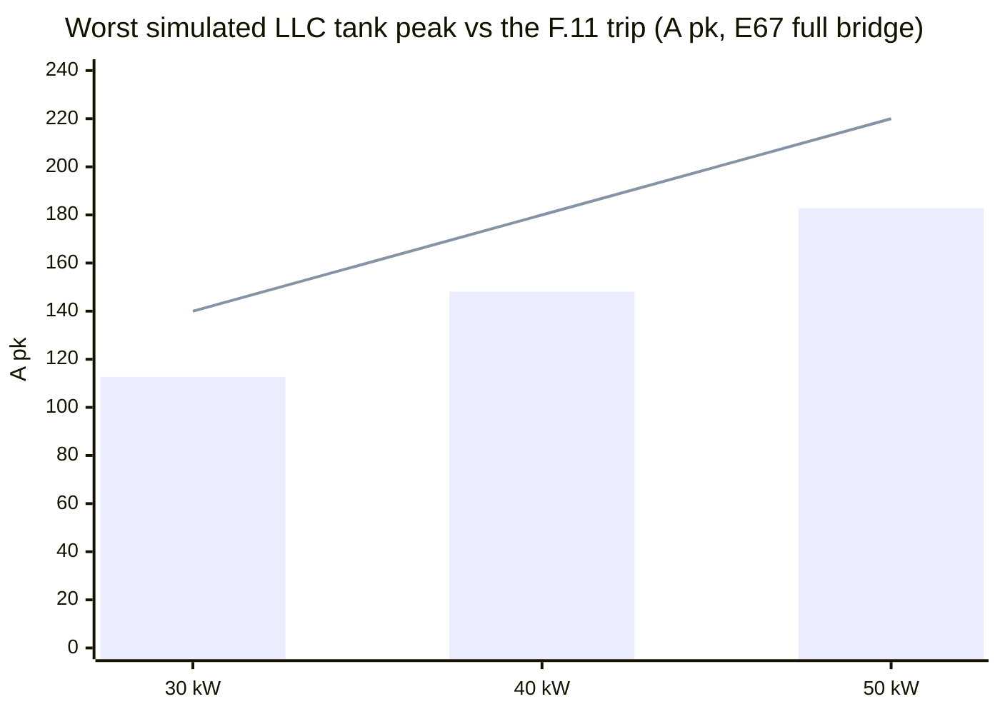
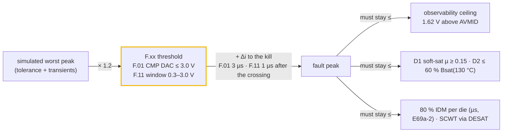
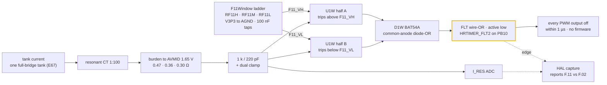

# ⚡ Current & Protection Coordination

The worst simulated current in every magnetic and switch, against the trip, sensor and part that must handle it

  
  
  
  

> [!NOTE]
> **Purpose** — the maximum current through every magnetic and every switch, taken from simulation at the
> worst legal corners. Each is set against the trip that must clear it, the sensor that must see the
> fault, and the part that must survive it.
>
> **Gate coupling** — [`current-coordination.mjs`](../calculations/system/current-coordination.mjs) (this
> document's numbers) · [`llc-flux-post.mjs`](../spice/llc/llc-flux-post.mjs) (the committed internal-short
> envelope) · [`ct-frontend.mjs`](../spice/protection/ct-frontend.mjs) (CT chain decks) ·
> [`conductor-audit.mjs`](../calculations/magnetics/conductor-audit.mjs) (copper) ·
> [`envelope-grid.mjs`](../calculations/system/envelope-grid.mjs) (4,536-point thermal envelope) ·
> firmware `pmp_fsm_set_rating_kw()` (the classes the HAL programs).

## 1. Verdict at a glance

Numbers are the E67 full bridge with the E68/E69 parts, as `current-coordination.mjs` printed them on the last battery run.

| | 30 kW | 40 kW | 50 kW liquid | 50 kW air |
|---|---|---|---|---|
| Worst PFC line peak (dips + phase jump incl.) | 97.0 A | 127.2 A | 159.4 A | = 50 kW |
| **F.01 line OC** · trip / peak | **120 A** · 1.24× | **155 A** · 1.22× | **195 A** · 1.22× | = |
| F.01 fault peak (+3 µs race) → ceiling | 165.3 → 184.1 A | 204.9 → 225.0 A | 266.4 → 311.5 A | = |
| **PFC die at the F.01 fault peak** vs 0.8 × IDM (E69a-2) | 165.3 vs **168 A** (IDM ≥ 210 A line) | 204.9 vs **208 A** (≥ 260 A line) | 266.4 vs 384 A (IDM 480 A) | = |
| Worst LLC tank peak (SER 250 V at the 764 V bus) | 112.7 A | 148.1 A | 182.8 A | 182.8 A |
| **F.11 tank OC** · trip / peak | **140 A** · 1.24× | **180 A** · 1.22× | **220 A** · 1.20× | = |
| **F.11 kill peak** (window, +1 µs) → ceiling · burden | **209.1 → 344.7 A** · 0.47 Ω | **267.1 → 450 A** · 0.36 Ω | **329.7 → 540 A** · 0.30 Ω | = |
| **LLC die at the kill peak** vs 0.8 × IDM 212 A | 209.1 A (one die) | 133.6 A (two dies) | 164.8 A (two dies) | = |
| DESAT worst response vs SCWT class | LLC 1.44 / 2.0 µs · PFC 2.21 / 4.2 µs | = | = | = |
| D2 flux at the F.11 kill peak (≤ 217 mT) | 163 mT | 164 mT | 163 mT | 163 mT |
| Max tank RMS vs class | 70.4 / 78 A | 93.3 / 100 A | 116 / 120 A | 116 / 120 A |
| Film-bank ripple (E68c) · per film / output | 3.83 A · 0.47 % | 3.74 A · 0.46 % | 3.93 A · 0.49 % | = |

> [!WARNING]
> **Three pulse margins are thin by design.** The E69a-2 rule lets a trip-limited, non-repetitive µs pulse reach
> 80 % of the die's 25 °C IDM listing (the 20 % is the hot-start allowance). The 30 kW single LLC die lands at 209 A
> against 212 A, the 30 kW PFC die at 165 A against 168 A, and the 40 kW PFC die at 205 A against 208 A. They pass
> only because the RFQ acceptance lines — **SG2M023120LJ IDM ≥ 265 A, 750 V 20 mΩ class ≥ 210 A, 15 mΩ class ≥ 260 A**
> — are enforced. A part listed at the common 250 A would fail. A lot that misses its line reverts that SKU (two LLC
> dies / B3M010C075Z), and EVT T-41 samples the pulse class on incoming dies.

> [!IMPORTANT]
> **E65 → E67: F.11 is a both-polarity window comparator on one tank CT.** After an internal short the tank
> current can swing **negative** first, so a positive-only threshold fires late. The window trips on either polarity
> straight into HRTIMER_FLT2. Since E67 there is one tank and one CT, and the burdens are **0.47 / 0.36 / 0.30 Ω** so
> the +3 µs monitor peak (318.6 / 417.0 / 502.7 A) stays on the ADC rail
> ([§6](#6-f11-fast-path--window-comparator-and-the-internal-short-race)).

> [!CAUTION]
> **What was actually wrong before E60.** (1) The only LLC SPICE deck had no body diodes, so legs swung to ±6 kV
> on a 650 V bus and every ZVS, power and current figure it produced was non-physical. It also missed its target
> power by −77…+71 %. (2) The envelope grid called an **RMS** ceiling "A pk" and never evaluated the series-mode
> hysteresis corner. (3) F.11 sat **at or below** the real operating peak on every SKU, so the 40 and 50 kW would
> have tripped at full power in the 150–300 V and 500 V bands. (4) F.01 did not exist for 40/50 kW. (5) The 100 pF
> DESAT blank computed 3.39 µs against a 2 µs SiC withstand.

*Bars = simulated worst peak (SER 250 V at the 764 V bus). Line = the E67 F.11 classes (140 / 180 / 220 A).*

> [!TIP]
> **External anchor (E60 basis, three half-bridge sections — kept for provenance).** Wolfspeed's
> CRD-30DD12N-K (our DC-DC's reference design) measured its highest tank current at the **500 V series-output corner,
> the same corner that binds ours**: 54.3 A pk at 25 kW. Scaled to our 30 kW and 1:1:1 turns, that is 71.1 A pk.
> Our power-solved deck gives 65.4 A pk (−8 %), a check now standing in `verify-independent` §K. Its tank OCP is a
> 75 A CT trip, **1.38×** above that measurement. Ours, F.11 85 A, is 1.30× above the nominal corner and 1.21× above
> the mismatch corner, so our margin is the same class as the reference, not a heavier one. The reference board has
> **no DESAT and no inrush limiter**. It is an evaluation board rated for resistive loads, so our DESAT channels and
> precharge are production necessities rather than extra guarding.

## 2. How the currents were obtained

Every LLC corner is **power-solved**: the switching frequency (PFM) or duty (PS surrogate) is bisected until the
simulated bank power equals the target within ±1.5 %. Each result carries a fingerprint of the drawn tank, so a
tank change without a re-run fails the gate. The internal-short race is committed as a post-short envelope, so the
F.11 check never needs the git-ignored waveforms ([§6](#6-f11-fast-path--window-comparator-and-the-internal-short-race)).

## 3. LLC tank — the current map (power-solved ngspice)

From `simulation-results/<sku>/llc-stress.csv` (fingerprint `FB n2`, E67 full bridge). Ip is the tank (primary) current.

| Corner | What it is | 30 kW Ip rms / pk | 40 kW | 50 kW | fsw (30 kW) | Note |
|---|---|---|---|---|---|---|
| **SER250-full-bus764** | HIGH mode, 500 V out (bank 250 V), rated power, high-line bus floor, PSM at f_max | 70.4 / **112.7** | 93.3 / **148.1** | 116.0 / **182.8** | 202.9 kHz | sets F.11 and the tank class |
| SER250-full | the same at the 650 V bus | 67.9 / 94.2 | 90.5 / 125.2 | 112.6 / 154.8 | 197.8 kHz | twice the LOW-mode current at the same Vout |
| SER250 tolerance Hi / Lo | tank at +5 % / −5 % | 68.1 / 94.6 · 67.7 / 95.8 | 90.6 / 125.4 · 90.0 / 126.3 | 113.3 / 156.3 · 112.4 / 156.0 | 187.8 / 202.9 kHz | |
| PAR500-full-gainWorst | LOW mode, 500 V, gain-worst tolerance, bus 830 | 45.4 / 73.3 | 60.1 / 97.9 | 75.0 / 123.2 | 83.2 kHz | Im 40.6 / 51.9 / 63.3 A · capability ✓ |
| PAR400-full | the rated efficiency point | 44.7 / 62.2 | 59.8 / 82.5 | 73.8 / 101.8 | 152.0 kHz | loss-budget basis |
| PAR300-full | constant-power knee | 56.8 / 77.0 | 75.2 / 101.9 | 94.3 / 127.9 | 161.5 kHz | |
| PS150-Imax | 150 V at Imax, PSM | 60.0 / 101.0 | 79.3 / 132.7 | 99.1 / 165.0 | 202.9 kHz | the film-bank ripple corner (E68c) |

**Every corner shows ZVS on all four switches (64/64 edges) with both legs inside the rails.** Secondary rectifier
average current per bridge position at the SER corner is 30 / 40 / 50 A, shared by two JBS dies. FET turn-off current
peaks at 90.7 / 119.8 / 147.0 A per position in PFM (SER250-full).

**Internal rectifier short** (bank collapses from SER250-full-bus764, no trip modelled): the running maximum of the tank
current is 209.1 / 267.1 / 329.7 A 3 µs after the short and 370.3 / 471.5 / 577.4 A after 10 µs. F.11 is coordinated
against this race from the instant the tank current crosses the threshold
([§6](#6-f11-fast-path--window-comparator-and-the-internal-short-race)). A dead short at 1.45·fr drives
248.7 / 319.8 / 389.4 A pk, so start-up and short recovery stay in PSM.

## 4. Vienna PFC — the line-current map (cycle-by-cycle)

| Case | 30 kW Ipk | 40 kW | 50 kW | Reading |
|---|---|---|---|---|
| 330 VAC, full, bus 830, lot AL −8 % | 94.4 A | 124.3 A | 156.5 A | ripple on the **soft-saturated** D1 (L at the true peak 61 / 51 / 38 µH) |
| + 30 % dip 10 ms / 50 % dip 5 ms recovery, 20° jump | **97.0** | **127.2** | **159.4** | FW-R6 clamp + 100 kHz feed-forward → only +3 A |
| 475 VAC on the old 650 V floor | THD **15.8 %**, 74 % overmod | 15.6 % | 15.6 % | a Vienna cannot regulate below the line-line crest |
| 500 VAC on the old 650 V floor | THD **40.4 %**, 91 % overmod | 39.9 % | 39.8 % | → FW-R7 bus floor |
| 475 / 500 VAC with the 1.08·√2·VLL floor | THD 0.12 / 0.10 % | 0.11 / 0.10 % | 0.12 / 0.09 % | fixed |
| 150 kHz CISPR band content (worst) | 0.889 A vs LISN basis 0.964 | 1.104 vs 1.261 | 1.434 vs 1.567 | the LISN ripple basis stays conservative (−0.7…−1.2 dB) |

Switch RMS 37.8 / 50.4 / 63.1 A (per position) · boost-diode average 12.5 / 16.7 / 20.9 A, peak = line peak.

## 5. The coordination ladders

| SKU | F.01 · burden | F.01 + race → ceiling | F.11 · burden · window | F.11 kill peak → ceiling |
|---|---|---|---|---|
| 30 kW | 120 A · 22 Ω (2.71 V) | 165 → 184 A | 140 A · 0.47 Ω · 0.99 / 2.31 V | 209 → 345 A |
| 40 kW | 155 A · 18 Ω (2.77 V) | 205 → 225 A | 180 A · 0.36 Ω · 1.00 / 2.30 V | 267 → 450 A |
| 50 kW | 195 A · 13 Ω (2.66 V) | 266 → 311 A | 220 A · 0.30 Ω · 0.99 / 2.31 V | 330 → 540 A |

F.01 must hold its race peak under the ceiling. F.11 must hold 1.2× its kill peak and 1.05× its +3 µs monitor peak
under the ceiling ([§6](#6-f11-fast-path--window-comparator-and-the-internal-short-race)).

**CT front-end decks** ([`ct-frontend.mjs`](../spice/protection/ct-frontend.mjs), ngspice-46) run the drawn chain
for each SKU: CT, burden returned to AVMID, 1 k / 220 pF filter (1 nF on the 50 Hz line chain), dual clamp.

| Case (drive) | 30 kW | 40 kW | 50 kW | Limit |
|---|---|---|---|---|
| Resonant, worst operating peak (112.7 / 148.1 / 182.8 A) · ADC max / min | 2.170 / 1.130 V | 2.173 / 1.127 V | 2.188 / 1.112 V | ≤ 3.2 V · ≥ 0.1 V |
| Resonant, at F.11 · comparator node (computed F11_VH) | 2.296 V (2.308) | 2.286 V (2.298) | 2.298 V (2.310) | ± 0.08 V |
| Resonant, F.11 + race (318.6 / 417.0 / 502.7 A) · ADC max / min | 3.120 / 0.180 V | 3.124 / 0.176 V | 3.131 / 0.169 V | ≤ 3.27 V · ≥ 0.1 V |
| Line, at F.01 · ADC peak | 2.706 V | 2.766 V | 2.664 V | computed point ± 0.05 V |
| Line, F.01 + race (166 / 205 / 267 A) · ADC peak | 3.111 V | 3.126 V | 3.038 V | ≤ 3.27 V |

*Re-run at the E67 classes on 2026-09-14 — the deck had still been simulating the E65 burdens (1.0 / 0.82 / 0.68 Ω);
its operating peaks now come from the committed `llc-stress-summary.json`.*

Every row passes, and so does the AVMID buffer (rev D dual feedback): 0 V steady ripple (≤ 0.01 V) and a clamp-pulse
dip to 1.639 V (≥ 1.55 V). The race's negative half stays above the 0.1 V floor, so the window's low side also reads
an unclipped current. At 140 kHz the 1 k / 220 pF filter lands the comparator node 12 mV under the computed edge;
across the 77–203 kHz operating range it raises the effective F.11 by 1–3 %. The deck's race drive is a declared
constant, within 1.5 % of the §6 monitor peaks.

## 6. F.11 fast path — window comparator and the internal-short race

An internal rectifier short is modelled as the output bank collapsing in 1 µs, and the tank current then runs away
within a few microseconds. F.11 has to kill the LLC before that current leaves the resonant CT's observable range or
drives D2 towards saturation.

### Why a window

The E60 check made two optimistic assumptions. It read the race at fixed times after the short (F.11 + Δi at
+3 µs = 127 / 163 / 195 A), and it treated a positive-only threshold as if it saw the current's magnitude from the
first instant. In the ngspice internal-short waveforms, the worst section's current swings negative first. Its
positive threshold is crossed only 4.5–6.4 µs after the short, and a kill 3 µs later lands at 204–304 A. A window
catches the first excursion of either sign, 1.1–1.8 µs after the short.

### The path

The filtered tank-CT node drives one dual 40 ns push-pull comparator (TLV3202-class, U1W; E65 had one per section, U1W–U3W). Half A takes
the CT node on its inverting input against F11_VH; half B takes it on its non-inverting input against F11_VL. Both
outputs sit high inside the window, and either one pulls low outside it. A common-anode BAT54A (D1W) ORs the two
outputs onto the FLT wire-OR, HRTIMER_FLT2 on PB10, which kills every PWM output in hardware. The path needs no MCU
comparator pin. The on-chip CMP path (classes `oc_tank_a` 140 / 180 / 220 A since E67) stays as a secondary. At the FLT edge the HAL captures
the I_RES ADC to report F.11 versus F.02.

### Thresholds from one ladder

One ratiometric ladder on the DC-DC board (`F11Window`) sets both thresholds: V3P3 through RF11H, RF11M and
RF11L to AGND, with CF11H / CF11L 100 nF on the taps. AVMID is V3P3 / 2 and the ladder is symmetric (RF11H = RF11L),
so the window stays centred on AVMID as the rail moves. F11_VH = V3P3 · (RF11M + RF11L) / (RF11H + RF11M + RF11L),
and the trip current is (F11_VH − AVMID) · 100 / R_burden.

| | 30 kW | 40 kW | 50 kW (liquid · air) |
|---|---|---|---|
| Resonant burden (E65 value in brackets) | **0.47 Ω** · R2512-0R47-1W-1% (1.0 Ω) | **0.36 Ω** · R2512-0R36-1W-1% (0.82 Ω) | **0.30 Ω** · R2512-0R30-2W-1% (0.68 Ω) |
| RF11H / RF11M / RF11L | 2 k / 2.67 k / 2 k | 2 k / 2.61 k / 2 k | 2 k / 2.67 k / 2 k |
| Window F11_VL / F11_VH | 0.99 / 2.31 V | 1.00 / 2.30 V | 0.99 / 2.31 V |
| Trip from the drawn ladder (F.11 class) | ± 140.5 A (140) | ± 181.0 A (180) | ± 220.2 A (220) |
| Observability ceiling (1.62 V above AVMID) | 344.7 A | 450.0 A | 540.0 A |

The gate recomputes the trip from the ladder values in `boards.tsx`. It fails if the trip drifts more than 2 % from
the class (ladder ± 1 % plus comparator offset).

### The race, measured from the crossing

The internal-short deck collapses the bank from the worst corner (SER250-full-bus764) with no trip modelled.
[`llc-flux-post.mjs`](../spice/llc/llc-flux-post.mjs) reduces the waveforms to the running maximum of the tank-current
magnitude, from 0 to 10 µs after the short in 0.05 µs steps, and writes it to the committed
`simulation-results/<sku>/llc-short.csv` ([30 kW](../simulation-results/30kw/llc-short.csv)). `current-coordination`
finds the first sample at or above F.11, the instant a both-polarity window fires, and reads the envelope twice:

- **Kill peak** at crossing + **1 µs**. That is the declared kill budget: the 220 ns front-end RC, the 40 ns
  comparator, the fault input, the driver and the SiC fall, with margin. 1.2× the kill peak must fit under the
  ceiling, and the kill peak sets the D2 fault flux.
- **Monitor peak** at crossing + **3 µs**, the E60 kill budget. 1.05× the monitor peak must still fit under the
  ceiling, so the CT reading stays unclipped for 3 µs after the crossing.

| | 30 kW | 40 kW | 50 kW liquid | 50 kW air | Rule |
|---|---|---|---|---|---|
| F.11 crossed after the short | 1.45 µs | 1.35 µs | 1.35 µs | 1.35 µs | first sample ≥ F.11 |
| **Kill peak** (crossing + 1 µs) | **209.1 A** | **267.1 A** | **329.7 A** | **329.7 A** | × 1.2 ≤ ceiling |
| Monitor peak (crossing + 3 µs) | 318.6 A | 417.0 A | 502.7 A | 502.7 A | × 1.05 ≤ ceiling |
| Observability ceiling | 344.7 A | 450.0 A | 540.0 A | 540.0 A | 1.62 V above AVMID |
| Per die at the kill peak (E69a-2) | 209.1 A · one die | 133.6 A · two dies | 164.8 A · two dies | 164.8 A | ≤ 0.8 × IDM (212 A at the 265 A line) |

Every kill peak sits ≥ 1.6× under its ceiling. The monitor peak is the tighter rule: 1.05 × 318.6 A = 334.5 A against
344.7 A at 30 kW, which is why the E67 burdens are this low. A gates-off re-run in the E65 review showed no rise after
the kill, so the envelope value is the peak.

### D2 at the kill peak

Since E67, D2 rev F is the external resonant inductor: one gapped E70 pair per SKU at ± 3 %, with no bins. It carries Lr
minus the two D3 cells' leakage and the 0.1 µH loop stray. Both flux checks use Lmax: B = Lmax · I / (N · Ae).

| | 30 kW | 40 kW | 50 kW liquid | 50 kW air |
|---|---|---|---|---|
| D2 rev F construction | 2 × E70 · N 5 · Lmax 5.31 µH | 2 × E70 · N 5 · 4.19 µH | 2 × E70 · N 5 · 3.38 µH | = 50 kW liquid |
| Operating flux at the worst simulated peak (≤ 110 mT) | 88 mT | 91 mT | 90 mT | 90 mT |
| **Fault flux at the kill peak** (≤ 217 mT = 60 % Bsat at 130 °C) | **163 mT** at 209.1 A | **164 mT** at 267.1 A | **163 mT** at 329.7 A | **163 mT** |

## 7. DESAT and short-circuit withstand

| | LLC 1200 V SiC (830 V, ZVS) | Vienna 750 V SiC (415 V, hard) |
|---|---|---|
| Blanking cap | **22 pF** (was 100 pF) | **47 pF** (was 100 pF) |
| NSI66x1A worst: blank + LEB + OUT(L) delay + soft-off | **1.44 µs** (100 pF: 3.39 µs) | **2.21 µs** (100 pF: 3.53 µs) |
| Short-circuit withstand class | 2.0 µs (discrete 1200 V at ≤800 V) | 4.2 µs (1200 V at 50 % V, 175 °C — Wolfspeed PRD-08296) |
| Minimum blank (noise immunity) | 0.48 µs (turn-on is at ~0 V) | 0.80 µs (4× the turn-on transient) |

The reverse-polarity Vienna fault (DESAT-blind by topology, R4) is covered by the F.01 comparator path at
120/155/195 A with the soft-saturating D1 limiting di/dt to 15–24 A/µs (Δi(3 µs) 46 / 50 / 72 A).

## 8. Other stresses the gate closes

| Item | Result |
|---|---|
| Resonant caps | 10.06 / 10.37 / 10.55 A rms per cap (≤ 12 A line) · Vcr 565 / 580 / 595 V pk = 400 / 410 / 421 V rms (≤ 530 V O-8 line), at the gain-critical 77–82 kHz corner |
| Secondary JBS (2 × 40 A per position) at the HIGH-mode floor | 24.5 / 32.4 / 40.4 A rms per die → Tj 92 / 104 / 104 °C (50 kW air 118 °C) |
| Output banks, film only (E68c) | 3.83 / 3.74 / 3.93 A rms per film (≤ 10.5 A) · output ripple 0.47 / 0.46 / 0.49 % RMS at PS150-Imax (≤ 0.5 %, at −10 % C) |
| Output blocking diode DOUT (E67) | 67 % of the 150 / 200 / 250 A class · Tj 115 / 120 / 123 °C (50 kW air 128 °C) · 1600 V against 1000 V out = 63 % |
| D1 at the F.01 fault peak | µ = 0.20 / 0.25 / 0.20 of initial — soft saturation, never a collapse |
| Bank energy into an external short | 22.2 kA, τ 42 µs, 10,444 A²s ≪ the relay short-time class and the busbar I²t — µs-scale, contacts already closed |
| Thermal envelope (grid) | 4,536 points, 0 failures, 0 folds · max Tj 139 °C |

## 9. What only hardware can close

Both-polarity short-circuit timing with the 22/47 pF blanks against the vendor tSC (T-30) · the tank kill at the E67 classes (T-37) · die pulse class on incoming lots (T-41) · F.11 window timing: CT
injection of each polarity to gates-off inside the 1 µs kill budget, with the FLT-edge I_RES capture reporting F.11 ·
CT saturation at the fitted burdens (acceptance rows in the pack) · LLC load-step overshoot in closed loop (the 1.2×
rule's transient allowance) · Vienna dip recovery with the real HAL controller (FW-R6 clamp).

---

<a href="protection-thresholds.md">← Protection Thresholds</a> &nbsp;·&nbsp; <a href="README.md">🧭 Documentation hub</a> &nbsp;·&nbsp; <a href="thermal-report.md">Thermal Report →</a>

Vectivolt DC-Modules · documentation rev E72 · every number reproduces with <code>sh calculations/run-all.sh</code>

