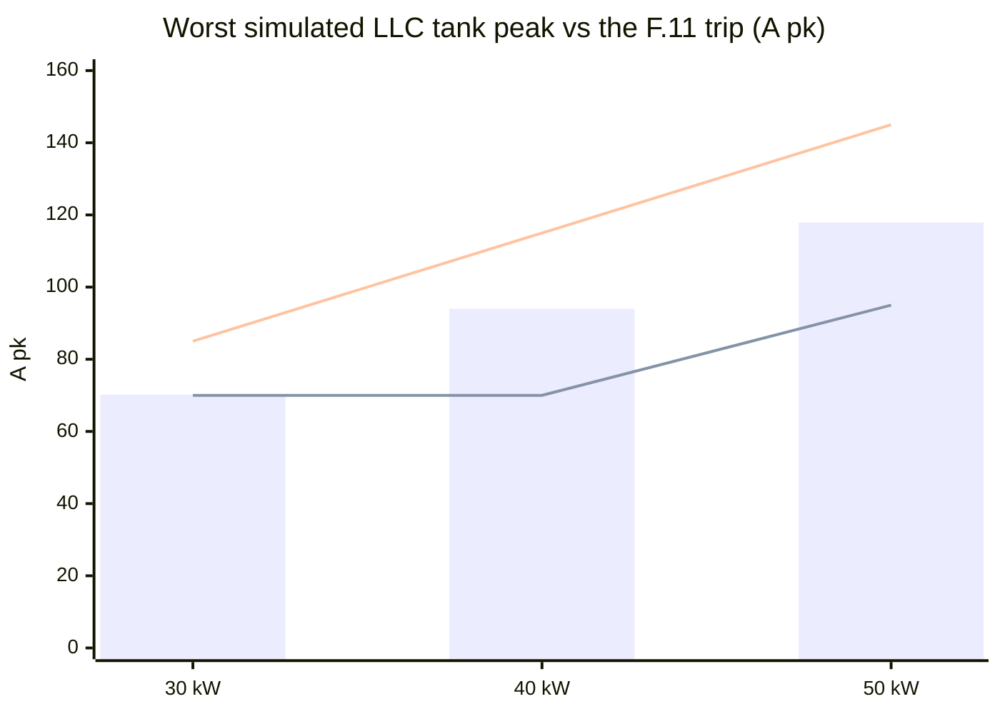
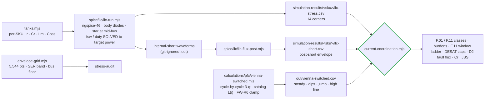
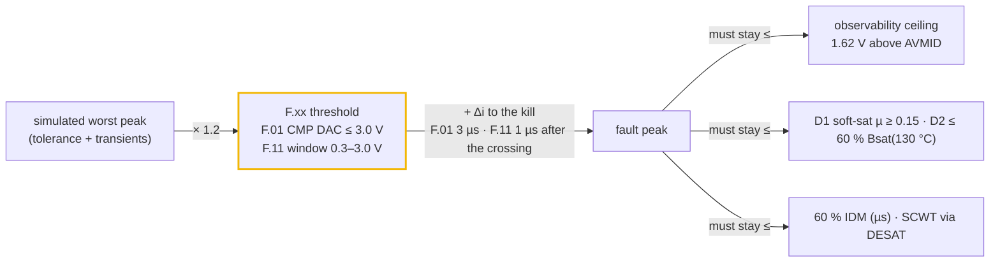
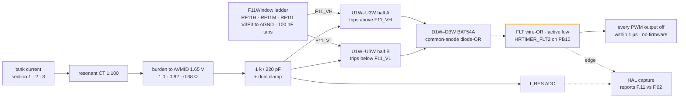

# ⚡ Current & Protection Coordination

The worst simulated current in every magnetic and switch, against the trip, sensor and part that must handle it

  
  
  
  

> [!NOTE]
> **Purpose** — the maximum current through every magnetic and every switch, taken from simulation at the
> worst legal corners. Each is set against the trip that must clear it, the sensor that must see the
> fault, and the part that must survive it.
>
> **Gate coupling** — [`current-coordination.mjs`](../calculations/system/current-coordination.mjs) (this
> document's numbers) · [`llc-flux-post.mjs`](../spice/llc/llc-flux-post.mjs) (the committed internal-short
> envelope) · [`ct-frontend.mjs`](../spice/protection/ct-frontend.mjs) (CT chain decks) ·
> [`conductor-audit.mjs`](../calculations/magnetics/conductor-audit.mjs) (copper) ·
> [`envelope-grid.mjs`](../calculations/system/envelope-grid.mjs) (5,544-point thermal envelope) ·
> firmware `pmp_fsm_set_rating_kw()` (the classes the HAL programs).

## 1. Verdict at a glance

| | 30 kW | 40 kW | 50 kW liquid | 50 kW air |
|---|---|---|---|---|
| Worst PFC line peak (dips + phase jump incl.) | 97.0 A | 127.2 A | 159.4 A | = 50 kW |
| **F.01 line OC** (was) | **120 A** (105) | **155 A** (undefined) | **195 A** (undefined) | = |
| Worst LLC tank peak (tolerance + mismatch) | 70.2 A | 94.0 A | 117.9 A | 117.7 A |
| **F.11 tank OC** (was) | **85 A** (70 → 1.00×) | **115 A** (70 → 0.74×) | **145 A** (95 → 0.81×) | = |
| Trip / peak margin | 1.24× / 1.21× | 1.22× / 1.22× | 1.22× / 1.23× | = |
| **F.11 kill peak** (window, +1 µs) → ceiling · burden | **104 → 162 A** · 1.0 Ω | **132 → 198 A** · 0.82 Ω | **158 → 238 A** · 0.68 Ω | 158 → 238 A · = |
| DESAT worst response vs SCWT class | LLC 1.44 / 2.0 µs · PFC 2.21 / 4.2 µs | = | = | = |
| D2 flux at the F.11 kill peak (≤ 217 mT) | 130 mT | 121 mT | 134 mT | 135 mT |
| Max tank RMS vs class (≤ class + 2 %) | 47.0 / 46.4 A | 61.5 / 61.9 A | 76.3 / 77.3 A | 76.1 / 77.3 A |

> [!IMPORTANT]
> **E65: F.11 is a both-polarity window comparator.** After an internal short the worst section's tank current
> swings **negative** first. The E60 positive-only threshold would have fired only 4.5–6.4 µs after the short, and
> the kill would have landed at **204–304 A**, past every CT observability ceiling and the FET pulse class. A
> window comparator per section now trips on either polarity straight into HRTIMER_FLT2. The resonant burdens are
> **1.0 / 0.82 / 0.68 Ω**, and the race is measured from the F.11 crossing: kill peaks **104 / 132 / 158 A**, each
> ≥ 1.5× under its ceiling ([§6](#6-f11-fast-path--window-comparator-and-the-internal-short-race)).

> [!CAUTION]
> **What was actually wrong before E60.** (1) The only LLC SPICE deck had no body diodes, so legs swung to ±6 kV
> on a 650 V bus and every ZVS, power and current figure it produced was non-physical. It also missed its target
> power by −77…+71 %. (2) The envelope grid called an **RMS** ceiling "A pk" and never evaluated the series-mode
> hysteresis corner. (3) F.11 sat **at or below** the real operating peak on every SKU, so the 40 and 50 kW would
> have tripped at full power in the 150–300 V and 500 V bands. (4) F.01 did not exist for 40/50 kW. (5) The 100 pF
> DESAT blank computed 3.39 µs against a 2 µs SiC withstand.

*Bars = simulated worst peak. Lower line = the as-drawn trips (70/70/95). Upper line = E60 classes (85/115/145).*

> [!TIP]
> **External anchor — how the reference design coordinates the same tank (E60 research, verified 3-0).** Wolfspeed's
> CRD-30DD12N-K (our DC-DC's reference design) measured its highest tank current at the **500 V series-output corner,
> the same corner that binds ours**: 54.3 A pk at 25 kW. Scaled to our 30 kW and 1:1:1 turns, that is 71.1 A pk.
> Our power-solved deck gives 65.4 A pk (−8 %), a check now standing in `verify-independent` §K. Its tank OCP is a
> 75 A CT trip, **1.38×** above that measurement. Ours, F.11 85 A, is 1.30× above the nominal corner and 1.21× above
> the mismatch corner, so our margin is the same class as the reference, not a heavier one. The reference board has
> **no DESAT and no inrush limiter**. It is an evaluation board rated for resistive loads, so our DESAT channels and
> precharge are production necessities rather than extra guarding.

## 2. How the currents were obtained

Every LLC corner is **power-solved**: the switching frequency (PFM) or duty (PS surrogate) is bisected until the
simulated bank power equals the target within ±1.5 %. Each result carries a fingerprint of the drawn tank, so a
tank change without a re-run fails the gate. The internal-short race is committed as a post-short envelope, so the
F.11 check never needs the git-ignored waveforms ([§6](#6-f11-fast-path--window-comparator-and-the-internal-short-race)).

## 3. LLC tank — the current map (power-solved ngspice)

| Corner | What it is | 30 kW Ip rms / pk | 40 kW | 50 kW | fsw (30 kW) | Note |
|---|---|---|---|---|---|---|
| **SER250-full** | Vout 500 V in series (bank 250 V), rated power | 45.1 / 65.4 | 60.1 / 86.8 | 74.7 / 107.7 | 181 kHz | twice the PAR current at the same Vout |
| SER250 mismatch | section 1 Lr −3 % / Cr −5 %, others +3/+5 % | 47.9 / **70.2** | 64.4 / **94.0** | 80.9 / **117.9** | 179 kHz | sets the F.11 floor |
| SER250 @ bus 764 V (PS) | high-line bus floor (FW-R7) | 47.0 / 65.9 | 61.5 / 87.2 | 76.3 / 108.4 | 140 kHz | PS surrogate |
| PAR525-full | gain-critical (M 1.265, bus 830) | 27.9 / 44.7 | 36.5 / 57.8 | 45.5 / 72.0 | 82.5 kHz | Im 20–25 A · capability ✓ at gain-worst tolerances |
| PAR300-full | constant-power floor | 37.6 / 54.5 | 49.6 / 71.6 | 62.2 / 89.3 | 159 kHz | continuous corner |
| PS150-Imax | 150 V at Imax | 38.4 / 57.0 | 50.5 / 75.0 | 63.0 / 93.2 | 140 kHz | continuous corner |

**Every corner shows ZVS on all six switches (64/64 edges) with both legs inside the rails.** Secondary rectifier
average current per diode at the SER corner is 10.0 / 13.4 / 16.7 A. FET turn-off current peaks at 48 / 61 / 75 A
in PFM and 65–94 A in the PS surrogate.

**Internal rectifier short** (bank collapses in 1 µs from the mismatch corner, no trip modelled): the running maximum
of the tank current reaches 111 / 139 / 166 A 3 µs after the short and 217 / 261 / 302 A after 10 µs. F.11 is
coordinated against this race from the instant the tank current crosses the threshold, not at fixed times after the
short ([§6](#6-f11-fast-path--window-comparator-and-the-internal-short-race)). With PFM alone, a dead short at
1.45·fr drives 105–125 A pk, so start-up and short recovery must stay in PS/burst (the design's M < 0.72 rule).

## 4. Vienna PFC — the line-current map (cycle-by-cycle)

| Case | 30 kW Ipk | 40 kW | 50 kW | Reading |
|---|---|---|---|---|
| 330 VAC, full, bus 830, lot AL −8 % | 94.4 A | 124.3 A | 156.5 A | ripple on the **soft-saturated** D1 (L at the true peak 61 / 51 / 38 µH) |
| + 30 % dip 10 ms / 50 % dip 5 ms recovery, 20° jump | **97.0** | **127.2** | **159.4** | FW-R6 clamp + 100 kHz feed-forward → only +3 A |
| 475 VAC on the old 650 V floor | THD **15.8 %**, 74 % overmod | 15.6 % | 15.6 % | a Vienna cannot regulate below the line-line crest |
| 500 VAC on the old 650 V floor | THD **40.4 %**, 91 % overmod | 39.9 % | 39.8 % | → FW-R7 bus floor |
| 475 / 500 VAC with the 1.08·√2·VLL floor | THD 0.12 / 0.10 % | 0.11 / 0.10 % | 0.12 / 0.09 % | fixed |
| 150 kHz CISPR band content (worst) | 0.889 A vs LISN basis 0.964 | 1.104 vs 1.261 | 1.434 vs 1.567 | **the D6/LISN ripple basis stays conservative** (−0.7…−1.2 dB) |

Switch RMS 37.8 / 50.4 / 63.1 A (per position) · boost-diode average 12.5 / 16.7 / 20.9 A, peak = line peak.

## 5. The coordination ladders

| SKU | F.01 · burden | F.01 + race → ceiling | F.11 · burden · window | F.11 kill peak → ceiling | CT class |
|---|---|---|---|---|---|
| 30 kW | 120 A · 22 Ω (2.71 V) | 166 → 184 A | 85 A · 1.0 Ω · 0.80 / 2.50 V | 104 → 162 A | ACX-1100 · AS-404 |
| 40 kW | 155 A · 18 Ω (2.77 V) | 205 → 225 A | 115 A · 0.82 Ω · 0.71 / 2.59 V | 132 → 198 A | **ACX-1150** · 80 A class |
| 50 kW | 195 A · 13 Ω (2.66 V) | 266 → 311 A | 145 A · 0.68 Ω · 0.66 / 2.64 V | 158 → 238 A | ACX-1150 · 100 A class |

F.01 must hold its race peak under the ceiling. F.11 must hold 1.2× its kill peak and 1.05× its +3 µs monitor peak
under the ceiling ([§6](#6-f11-fast-path--window-comparator-and-the-internal-short-race)).

**CT front-end decks** ([`ct-frontend.mjs`](../spice/protection/ct-frontend.mjs), ngspice-46) run the drawn chain
for each SKU: CT, burden returned to AVMID, 1 k / 220 pF filter (1 nF on the 50 Hz line chain), dual clamp.

| Case (drive) | 30 kW | 40 kW | 50 kW | Limit |
|---|---|---|---|---|
| Resonant, worst operating peak (65.6 / 87.4 / 108.8 A) · ADC max / min | 2.294 / 1.006 V | 2.354 / 0.946 V | 2.376 / 0.924 V | ≤ 3.2 V · ≥ 0.1 V |
| Resonant, at F.11 · comparator node (computed F11_VH) | 2.484 V (2.500) | 2.576 V (2.593) | 2.618 V (2.636) | ± 0.08 V |
| Resonant, F.11 + race (149 / 180 / 216 A) · ADC max / min | 3.113 / 0.187 V | 3.099 / 0.201 V | 3.092 / 0.208 V | ≤ 3.27 V · ≥ 0.1 V |
| Line, at F.01 · ADC peak | 2.706 V | 2.766 V | 2.664 V | computed point ± 0.05 V |
| Line, F.01 + race (166 / 205 / 267 A) · ADC peak | 3.111 V | 3.126 V | 3.038 V | ≤ 3.27 V |

Every row passes, and so does the AVMID buffer (rev D dual feedback): 0 V steady ripple (≤ 0.01 V) and a clamp-pulse
dip to 1.639 V (≥ 1.55 V). The race's negative half stays above the 0.1 V floor, so the window's low side also reads
an unclipped current. At 140 kHz the 1 k / 220 pF filter lands the comparator node 16–18 mV under the computed edge;
across the 77–189 kHz operating range it raises the effective F.11 by 1–3 %. The deck's race drive is a declared
constant, within 1.5 % of the §6 monitor peaks.

## 6. F.11 fast path — window comparator and the internal-short race

An internal rectifier short is modelled as the output bank collapsing in 1 µs, and the tank current then runs away
within a few microseconds. F.11 has to kill the LLC before that current leaves the resonant CT's observable range or
drives D2 towards saturation.

### Why a window

The E60 check made two optimistic assumptions. It read the race at fixed times after the short (F.11 + Δi at
+3 µs = 127 / 163 / 195 A), and it treated a positive-only threshold as if it saw the current's magnitude from the
first instant. In the ngspice internal-short waveforms, the worst section's current swings negative first. Its
positive threshold is crossed only 4.5–6.4 µs after the short, and a kill 3 µs later lands at 204–304 A. A window
catches the first excursion of either sign, 1.1–1.8 µs after the short.

### The path

Each section's filtered CT node drives one dual 40 ns push-pull comparator (TLV3202-class, U1W–U3W). Half A takes
the CT node on its inverting input against F11_VH; half B takes it on its non-inverting input against F11_VL. Both
outputs sit high inside the window, and either one pulls low outside it. A common-anode BAT54A (D1W–D3W) ORs the two
outputs onto the FLT wire-OR, HRTIMER_FLT2 on PB10, which kills every PWM output in hardware. The path needs no MCU
comparator pin, which also sidesteps the GD32 pin map's inability to give all three I_RES nets a DAC comparator.
The on-chip CMP path (classes `oc_tank_a` 85 / 115 / 145 A) stays as a secondary. At the FLT edge the HAL captures
the I_RES ADC to report F.11 versus F.02.

### Thresholds from one ladder

One ratiometric ladder on the DC-DC board (`F11Window`) serves all three sections: V3P3 through RF11H, RF11M and
RF11L to AGND, with CF11H / CF11L 100 nF on the taps. AVMID is V3P3 / 2 and the ladder is symmetric (RF11H = RF11L),
so the window stays centred on AVMID as the rail moves. F11_VH = V3P3 · (RF11M + RF11L) / (RF11H + RF11M + RF11L),
and the trip current is (F11_VH − AVMID) · 100 / R_burden.

| | 30 kW | 40 kW | 50 kW (liquid · air) |
|---|---|---|---|
| Resonant burden (was) | **1.0 Ω** · R2512-1R00-1W-1% (1.2 Ω) | **0.82 Ω** · R2512-0R82-1W-1% (0.91 Ω) | **0.68 Ω** · R2512-0R68-2W-1% (0.75 Ω) |
| RF11H / RF11M / RF11L | 2.43 k / 5.11 k / 2.43 k | 2.15 k / 5.76 k / 2.15 k | 2 k / 5.9 k / 2 k |
| Window F11_VL / F11_VH | 0.80 / 2.50 V | 0.71 / 2.59 V | 0.66 / 2.64 V |
| Trip from the drawn ladder (F.11 class) | ± 84.6 A (85) | ± 115.2 A (115) | ± 144.6 A (145) |
| Observability ceiling (1.62 V above AVMID) | 162.0 A | 197.6 A | 238.2 A |

The gate recomputes the trip from the ladder values in `boards.tsx`. It fails if the trip drifts more than 2 % from
the class (ladder ± 1 % plus comparator offset).

### The race, measured from the crossing

The internal-short deck collapses the bank from the worst corner (SER250-full-mismatch) with no trip modelled.
[`llc-flux-post.mjs`](../spice/llc/llc-flux-post.mjs) reduces the waveforms to the running maximum of the tank-current
magnitude over all three sections, from 0 to 10 µs after the short in 0.05 µs steps, and writes it to the committed
`simulation-results/<sku>/llc-short.csv` ([30 kW](../simulation-results/30kw/llc-short.csv)). `current-coordination`
finds the first sample at or above F.11, the instant a both-polarity window fires, and reads the envelope twice:

- **Kill peak** at crossing + **1 µs**. That is the declared kill budget: the 220 ns front-end RC, the 40 ns
  comparator, the fault input, the driver and the SiC fall, with margin. 1.2× the kill peak must fit under the
  ceiling, and the kill peak sets the D2 fault flux.
- **Monitor peak** at crossing + **3 µs**, the E60 kill budget. 1.05× the monitor peak must still fit under the
  ceiling, so the CT reading stays unclipped for 3 µs after the crossing.

| | 30 kW | 40 kW | 50 kW liquid | 50 kW air | Rule |
|---|---|---|---|---|---|
| F.11 crossed after the short | 1.1 µs | 1.1 µs | 1.55 µs | 1.8 µs | first sample ≥ F.11 |
| **Kill peak** (crossing + 1 µs) | **104.3 A** | **131.6 A** | **157.7 A** | **158.4 A** | × 1.2 ≤ ceiling |
| Monitor peak (crossing + 3 µs) | 151.1 A | 180.9 A | 214.4 A | 215.7 A | × 1.05 ≤ ceiling |
| Observability ceiling | 162.0 A | 197.6 A | 238.2 A | 238.2 A | 1.62 V above AVMID |
| E60 fixed-time value (retired) | 127.2 A | 162.6 A | 195.4 A | 197.2 A | — |

Every kill peak sits ≥ 1.5× under its ceiling. Measured from the crossing, the +3 µs peak overran the E60 burdens'
ceilings at 30 and 40 kW (135 / 178 A) and left 50 kW less than 1 % inside its 216 A ceiling, which is why the
burdens came down to 1.0 / 0.82 / 0.68 Ω. With the gates off the tank current decays: a gates-off re-run in the E65 review showed no rise
after the kill, so the envelope value is the peak.

### D2 at the kill peak

D2 now carries almost all of Lr. The leakage the D3 interleave can actually reach computes 0.14–0.19 µH, not the
3 µH the E60 bins assumed, so the D2 bins moved up. The bin fitted to each section is Lr − (measured D3 leakage +
0.1 µH tank-loop stray), with a ± 1.5 % grind tolerance. Both flux checks use the top bin: B = L(top bin) · I / (N · Ae).

| | 30 kW | 40 kW | 50 kW liquid | 50 kW air |
|---|---|---|---|---|
| D2 construction | 1× E70/33/32 · N 8 · Ae 683 mm² | 2× E70/33/32 · N 5 · Ae 1,366 mm² | = 40 kW | = 40 kW |
| Bins, µH (top bin bold) | 6.35 / 6.5 / 6.65 / **6.8** | 5.85 / 6.0 / 6.15 / **6.3** | 5.35 / 5.5 / 5.65 / **5.8** | = |
| Operating flux at the worst nominal peak (≤ 110 mT) | 82 mT at 65.9 A | 80 mT at 87.2 A | 92 mT at 108.4 A | 93 mT at 109.0 A |
| **Fault flux at the kill peak** (≤ 217 mT = 60 % Bsat at 130 °C) | **130 mT** at 104.3 A | **121 mT** at 131.6 A | **134 mT** at 157.7 A | **135 mT** at 158.4 A |
| E60 row: old D2 at the fixed-time race (retired) | 211 mT | 181 mT | 153 mT | 154 mT |

## 7. DESAT and short-circuit withstand

| | LLC 1200 V SiC (830 V, ZVS) | Vienna 750 V SiC (415 V, hard) |
|---|---|---|
| Blanking cap | **22 pF** (was 100 pF) | **47 pF** (was 100 pF) |
| NSI66x1A worst: blank + LEB + OUT(L) delay + soft-off | **1.44 µs** (100 pF: 3.39 µs) | **2.21 µs** (100 pF: 3.53 µs) |
| Short-circuit withstand class | 2.0 µs (discrete 1200 V at ≤800 V) | 4.2 µs (1200 V at 50 % V, 175 °C — Wolfspeed PRD-08296) |
| Minimum blank (noise immunity) | 0.48 µs (turn-on is at ~0 V) | 0.80 µs (4× the turn-on transient) |

The reverse-polarity Vienna fault (DESAT-blind by topology, R4) is covered by the F.01 comparator path at
120/155/195 A with the soft-saturating D1 limiting di/dt to 15–24 A/µs (Δi(3 µs) 46 / 50 / 72 A).

## 8. Other stresses the gate closes

| Item | Result |
|---|---|
| Resonant caps | ≤11.75 A rms per cap (≤12 A line) · Vcr ≤ 664 V pk = 470 V rms at the 77 kHz gain-critical corner (≤530 V O-8 line) · star held at mid-bus → no DC on Cr |
| Secondary JBS | 110 / 133 / 118 °C at the SER corner; **50 kW air 161 °C on the class model → the grid folds that corner to 93 %** (and FW-R8 keeps SER starts out of 500–525 V) |
| D1 at the F.01 fault peak | µ = 0.20 / 0.25 / 0.20 of initial — soft saturation, never a collapse |
| Bank energy into an external short | 23 kA, τ 42 µs, 11.5 kA²s ≪ K_OUT short-time class and busbar I²t — contacts already closed, no arc |
| Thermal envelope (grid) | 5,544 points, 0 failures; folds only in hot PS corners and the SER band (deepest 80 % = 475 VAC ∧ SER 500 V ∧ hot) |

## 9. What only hardware can close

Both-polarity short-circuit timing with the 22/47 pF blanks against the vendor tSC · F.11 window timing: CT
injection of each polarity to gates-off inside the 1 µs kill budget, with the FLT-edge I_RES capture reporting F.11 ·
CT saturation at the fitted burdens (acceptance rows in the pack) · LLC load-step overshoot in closed loop (the 1.2×
rule's transient allowance) · Vienna dip recovery with the real HAL controller (FW-R6 clamp).

---

<a href="protection-thresholds.md">← Protection Thresholds</a> &nbsp;·&nbsp; <a href="README.md">🧭 Documentation hub</a> &nbsp;·&nbsp; <a href="thermal-report.md">Thermal Report →</a>

Vectivolt DC-Modules · documentation rev E61 · every number reproduces with <code>sh calculations/run-all.sh</code>

