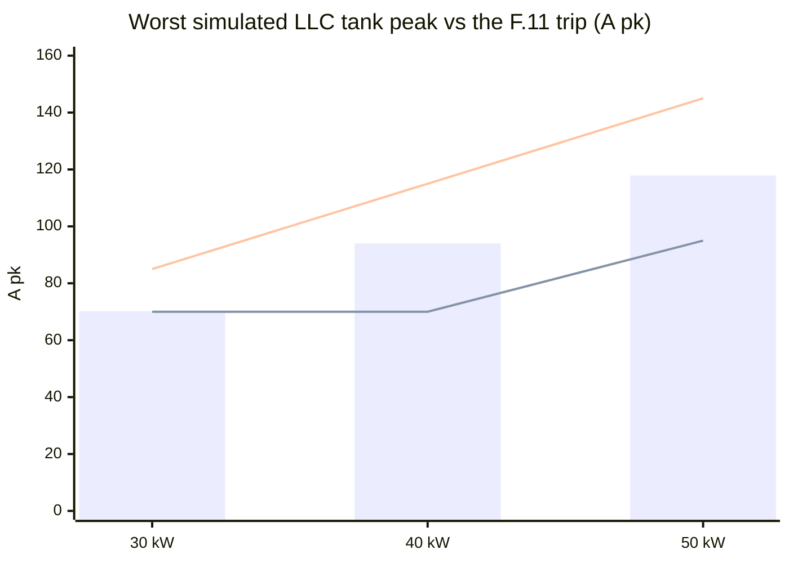
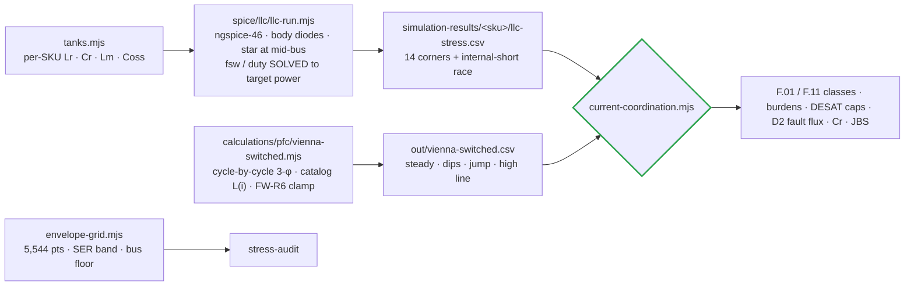
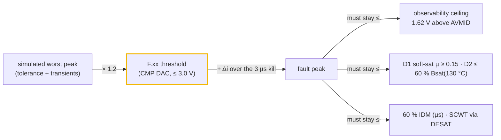

# ⚡ Current & Protection Coordination

The worst simulated current in every magnetic and switch, against the trip, sensor and part that must handle it

  
  
  
  

> [!NOTE]
> **Purpose** — the maximum current through every magnetic and every switch, taken from simulation at the
> worst legal corners. Each is set against the trip that must clear it, the sensor that must see the
> fault, and the part that must survive it.
>
> **Gate coupling** — [`current-coordination.mjs`](../calculations/system/current-coordination.mjs) (this
> document's numbers) · [`conductor-audit.mjs`](../calculations/magnetics/conductor-audit.mjs) (copper) ·
> [`envelope-grid.mjs`](../calculations/system/envelope-grid.mjs) (5,544-point thermal envelope) ·
> firmware `pmp_fsm_set_rating_kw()` (the classes the HAL programs).

## 1. Verdict at a glance

| | 30 kW | 40 kW | 50 kW liquid | 50 kW air |
|---|---|---|---|---|
| Worst PFC line peak (dips + phase jump incl.) | 97.0 A | 127.2 A | 159.4 A | = 50 kW |
| **F.01 line OC** (was) | **120 A** (105) | **155 A** (undefined) | **195 A** (undefined) | = |
| Worst LLC tank peak (tolerance + mismatch) | 70.2 A | 94.0 A | 117.9 A | 117.7 A |
| **F.11 tank OC** (was) | **85 A** (70 → 1.00×) | **115 A** (70 → 0.74×) | **145 A** (95 → 0.81×) | = |
| Trip / peak margin | 1.24× / 1.21× | 1.22× / 1.22× | 1.22× / 1.23× | = |
| DESAT worst response vs SCWT class | LLC 1.44 / 2.0 µs · PFC 2.21 / 4.2 µs | = | = | = |
| D2 flux at F.11 + fault race | 211 mT | 181 mT | 153 mT | 154 mT |
| Max tank RMS vs class | 46.3 / 46.4 A | 61.6 / 61.9 A | 76.6 / 77.3 A | 76.0 / 77.3 A |

> [!CAUTION]
> **What was actually wrong before E60.** (1) The only LLC SPICE deck had no body diodes, so legs swung to ±6 kV
> on a 650 V bus and every ZVS, power and current figure it produced was non-physical. It also missed its target
> power by −77…+71 %. (2) The envelope grid called an **RMS** ceiling "A pk" and never evaluated the series-mode
> hysteresis corner. (3) F.11 sat **at or below** the real operating peak on every SKU, so the 40 and 50 kW would
> have tripped at full power in the 150–300 V and 500 V bands. (4) F.01 did not exist for 40/50 kW. (5) The 100 pF
> DESAT blank computed 3.39 µs against a 2 µs SiC withstand.

*Bars = simulated worst peak. Lower line = the as-drawn trips (70/70/95). Upper line = E60 classes (85/115/145).*

> [!TIP]
> **External anchor — how the reference design coordinates the same tank (E60 research, verified 3-0).** Wolfspeed's
> CRD-30DD12N-K (our DC-DC's reference design) measured its highest tank current at the **500 V series-output corner,
> the same corner that binds ours**: 54.3 A pk at 25 kW. Scaled to our 30 kW and 1:1:1 turns, that is 71.1 A pk.
> Our power-solved deck gives 65.4 A pk (−8 %), a check now standing in `verify-independent` §K. Its tank OCP is a
> 75 A CT trip, **1.38×** above that measurement. Ours, F.11 85 A, is 1.30× above the nominal corner and 1.21× above
> the mismatch corner, so our margin is the same class as the reference, not a heavier one. The reference board has
> **no DESAT and no inrush limiter**. It is an evaluation board rated for resistive loads, so our DESAT channels and
> precharge are production necessities rather than extra guarding.

## 2. How the currents were obtained

Every LLC corner is **power-solved**: the switching frequency (PFM) or duty (PS surrogate) is bisected until the
simulated bank power equals the target within ±1.5 %. Each result carries a fingerprint of the drawn tank, so a
tank change without a re-run fails the gate.

## 3. LLC tank — the current map (power-solved ngspice)

| Corner | What it is | 30 kW Ip rms / pk | 40 kW | 50 kW | fsw (30 kW) | Note |
|---|---|---|---|---|---|---|
| **SER250-full** | Vout 500 V in series (bank 250 V), rated power | 45.1 / 65.4 | 60.1 / 86.8 | 74.7 / 107.7 | 181 kHz | twice the PAR current at the same Vout |
| SER250 mismatch | section 1 Lr −3 % / Cr −5 %, others +3/+5 % | 47.9 / **70.2** | 64.4 / **94.0** | 80.9 / **117.9** | 179 kHz | sets the F.11 floor |
| SER250 @ bus 764 V (PS) | high-line bus floor (FW-R7) | 47.0 / 65.9 | 61.5 / 87.2 | 76.3 / 108.4 | 140 kHz | PS surrogate |
| PAR525-full | gain-critical (M 1.265, bus 830) | 27.9 / 44.7 | 36.5 / 57.8 | 45.5 / 72.0 | 82.5 kHz | Im 20–25 A · capability ✓ at gain-worst tolerances |
| PAR300-full | constant-power floor | 37.6 / 54.5 | 49.6 / 71.6 | 62.2 / 89.3 | 159 kHz | continuous corner |
| PS150-Imax | 150 V at Imax | 38.4 / 57.0 | 50.5 / 75.0 | 63.0 / 93.2 | 140 kHz | continuous corner |

**Every corner shows ZVS on all six switches (64/64 edges) with both legs inside the rails.** Secondary rectifier
average current per diode at the SER corner is 10.0 / 13.4 / 16.7 A. FET turn-off current peaks at 48 / 61 / 75 A
in PFM and 65–94 A in the PS surrogate.

**Internal rectifier short** (bank collapses in 1 µs from the mismatch corner): the tank current rises **+31…+42 A in
2 µs and +42…+50 A in 3 µs**. Those numbers size the observability ceilings. With PFM alone, a dead short at
1.45·fr drives 105–125 A pk, so start-up and short recovery must stay in PS/burst (the design's M < 0.72 rule).

## 4. Vienna PFC — the line-current map (cycle-by-cycle)

| Case | 30 kW Ipk | 40 kW | 50 kW | Reading |
|---|---|---|---|---|
| 330 VAC, full, bus 830, lot AL −8 % | 94.4 A | 124.3 A | 156.5 A | ripple on the **soft-saturated** D1 (L at the true peak 61 / 51 / 38 µH) |
| + 30 % dip 10 ms / 50 % dip 5 ms recovery, 20° jump | **97.0** | **127.2** | **159.4** | FW-R6 clamp + 100 kHz feed-forward → only +3 A |
| 475 VAC on the old 650 V floor | THD **15.8 %**, 74 % overmod | 15.6 % | 15.6 % | a Vienna cannot regulate below the line-line crest |
| 500 VAC on the old 650 V floor | THD **40.4 %**, 91 % overmod | 39.9 % | 39.8 % | → FW-R7 bus floor |
| 475 / 500 VAC with the 1.08·√2·VLL floor | THD 0.12 / 0.10 % | 0.11 / 0.10 % | 0.12 / 0.09 % | fixed |
| 150 kHz CISPR band content (worst) | 0.889 A vs LISN basis 0.964 | 1.104 vs 1.261 | 1.434 vs 1.567 | **the D6/LISN ripple basis stays conservative** (−0.7…−1.2 dB) |

Switch RMS 37.8 / 50.4 / 63.1 A (per position) · boost-diode average 12.5 / 16.7 / 20.9 A, peak = line peak.

## 5. The coordination ladders

| SKU | F.01 · burden | F.01 + race → ceiling | F.11 · burden | F.11 + race → ceiling | CT class |
|---|---|---|---|---|---|
| 30 kW | 120 A · 22 Ω (2.71 V) | 166 → 184 A | 85 A · 1.2 Ω (2.67 V) | 129 → 135 A | ACX-1100 · AS-404 |
| 40 kW | 155 A · 18 Ω (2.77 V) | 205 → 225 A | 115 A · 0.91 Ω (2.70 V) | 163 → 178 A | **ACX-1150** · 80 A class |
| 50 kW | 195 A · 13 Ω (2.66 V) | 266 → 311 A | 145 A · 0.75 Ω (2.74 V) | 197 → 216 A | ACX-1150 · 100 A class |

The CT front-end decks (`spice/protection/ct-frontend.mjs`) run the actual burden/filter/clamp chain for each
SKU. They land F.xx within 20 mV of the computed DAC point, keep the operating peak inside 0.85–2.45 V, and hold
F.xx + race ≤ 3.17 V.

## 6. DESAT and short-circuit withstand

| | LLC 1200 V SiC (830 V, ZVS) | Vienna 750 V SiC (415 V, hard) |
|---|---|---|
| Blanking cap | **22 pF** (was 100 pF) | **47 pF** (was 100 pF) |
| NSI66x1A worst: blank + LEB + OUT(L) delay + soft-off | **1.44 µs** (100 pF: 3.39 µs) | **2.21 µs** (100 pF: 3.53 µs) |
| Short-circuit withstand class | 2.0 µs (discrete 1200 V at ≤800 V) | 4.2 µs (1200 V at 50 % V, 175 °C — Wolfspeed PRD-08296) |
| Minimum blank (noise immunity) | 0.48 µs (turn-on is at ~0 V) | 0.80 µs (4× the turn-on transient) |

The reverse-polarity Vienna fault (DESAT-blind by topology, R4) is covered by the F.01 comparator path at
120/155/195 A with the soft-saturating D1 limiting di/dt to 15–24 A/µs (Δi(3 µs) 46 / 50 / 72 A).

## 7. Other stresses the gate closes

| Item | Result |
|---|---|
| Resonant caps | ≤11.6 A rms per cap (≤12 A line) · Vcr ≤ 664 V pk = 470 V rms at the 77 kHz gain-critical corner (≤530 V O-8 line) · star held at mid-bus → no DC on Cr |
| Secondary JBS | 110 / 133 / 118 °C at the SER corner; **50 kW air 161 °C on the class model → the grid folds that corner to 93 %** (and FW-R8 keeps SER starts out of 500–525 V) |
| D1 at the F.01 fault peak | µ = 0.20 / 0.25 / 0.20 of initial — soft saturation, never a collapse |
| Bank energy into an external short | 23 kA, τ 42 µs, 11.5 kA²s ≪ K_OUT short-time class and busbar I²t — contacts already closed, no arc |
| Thermal envelope (grid) | 5,544 points, 0 failures; folds only in hot PS corners and the SER band (deepest 80 % = 475 VAC ∧ SER 500 V ∧ hot) |

## 8. What only hardware can close

Both-polarity short-circuit timing with the 22/47 pF blanks against the vendor tSC · CT saturation at the
fitted burdens (acceptance rows in the pack) · LLC load-step overshoot in closed loop (the 1.2× rule's transient
allowance) · Vienna dip recovery with the real HAL controller (FW-R6 clamp).

---

<a href="protection-thresholds.md">← Protection Thresholds</a> &nbsp;·&nbsp; <a href="README.md">🧭 Documentation hub</a> &nbsp;·&nbsp; <a href="thermal-report.md">Thermal Report →</a>

Vectivolt DC-Modules · documentation rev E61 · every number reproduces with <code>sh calculations/run-all.sh</code>

