# 🏭 DFM & Production Flow

Assembly sequence, kitting, torque schedule, end-of-line test and coating

  
  
  

> [!NOTE]
> **Purpose** — how a module is kitted, built, torqued, coated, tested and released. This is the production-side
> counterpart of the design pages. Every window below is the E60 per-SKU value, and every end-of-line limit
> traces to the row in [protection thresholds](protection-thresholds.md) or the
> [EVT plan](evt-plan.md) that it samples.

## At a glance

| | Production fact |
|---|---|
| **Boards per SKU** | 2 — AC-DC and DC-DC, both generated from one cell library — plus one control card |
| **Magnetic core families** | 3 catalogue families — Kool Mµ 0077908A7 stacks · TDK PQ50/50 · TDK E70/33/32 (E51 / E60) |
| **Unique per SKU** | board outlines · fuse and relay current class · shunt · busbar lengths · CT burden values (E60) |
| **End-of-line test** | 8 steps at 100 %, plus a sampling plan |
| **Coating** | acrylic conformal coating on both boards and the card (E52) |
| **First-article holds** | magnetics per lot · coating mask set · choke centre-bolt torque |

## Build flow

```mermaid
flowchart LR
  K["Kitting<br/>D2 bin matched to<br/>the D3 leakage label"] --> A1["1 · SMT<br/>both boards"]
  A1 --> A2["2 · THT power<br/>TO-247 · clamp bars<br/>caps · studs"]
  A2 --> A3["3 · Magnetics fit<br/>centre bolts · bins"]
  A3 --> T1[["4 · Board test<br/>A and B · test card"]]
  T1 --> A5["5 · Conformal coat<br/>E52 acrylic"]
  A5 --> A6["6 · Clamp to extrusion<br/>TIM · M4 1.2 N·m"]
  A6 --> A7["7 · Sandwich mate<br/>M8 pillars 12 N·m"]
  A7 --> A8["8 · Enclosure<br/>baffles · fans · panel"]
  A8 --> T2[["9 · End-of-line test<br/>8 steps · 100 %"]]
  T2 --> S(["serialise · ship"])
  style T1 stroke:#1a9fb3,stroke-width:2px
  style T2 stroke:#1a9fb3,stroke-width:2px
  style K stroke:#d19a00,stroke-width:2px
```

## 1. Assembly sequence (per module)

| Step | Operation | Hold point |
|---|---|---|
| **1 · SMT** | Both boards, double-sided reflow; selective or wave solder for the driver pin rows, relays and film capacitors | — |
| **2 · THT power** | TO-247 rows loose-fit → clamp bars → snap-in capacitors → studs | — |
| **3 · Magnetics fit** | Transformer units mated to the trim-inductor **bin named on their leakage label** — D2-30 rev C on PQ50/50, D2-40/50 rev D on E70/33/32 (gapped-ferrite bins; the kitting flow is unchanged by the E60 copper revision). Chokes on an M6 centre bolt with a silicone pad; ≥ 3 kg stacks add two-point banding | first article per lot · thermocouple pocket check |
| **4 · Board test** | Boards A (AC-DC) and B (DC-DC) tested separately at low voltage with a **test control card** in the harness: aux rails · card program and boot through its JSWD header (BOOT0 strapped low, CB-13) · gate pulses into a dummy RC load (PWM-off isolation, §45) · relay click **and mirror-contact readback** (E30) · HMI and CAN on board B | 100 % |
| **5 · Conformal coat** | Acrylic coating, both boards and the card (E52) — after board test so a fault is reworked before coating | mask set agreed at first article |
| **6 · Clamp** | TO-247 packages to their extrusion on a phase-change TIM (0.5 K·cm²/W class), M4 at 1.2 N·m, centre-out | TIM coverage witness 1 / 50 |
| **7 · Sandwich mate** | Pillar studs DCP / DCN / PE at 12 N·m with Belleville washers · 40-way harness (HARNESS40) with retention clip · shield drain to PE at the AC-DC end only | EOL milliohm check |
| **8 · Enclosure** | Tunnel baffles · fans (airflow-arrow check) · filter · front panel with display window, button actuators and CAN / termination access | — |
| **9 · End-of-line** | The eight tests below → serialise, HMI address 00, ship configuration written over CAN IDENT | 100 % |

## 2. Torque schedule

| Joint | Hardware | Torque | Check |
|---|---|---:|---|
| TO-247 clamp | M4 | 1.2 N·m | click wrench, calibrated weekly |
| Relay lugs K_SER / K_PAR / K_OUT | M6 | 8 N·m | ≤ 80 µΩ |
| Stud pillars DCP / DCN / PE | M8 × 1.25, Belleville + flat washer | 12 N·m ± 10 % | ≤ 50 µΩ each at EOL · re-torque audit 1 / shift |
| Shunt terminals | M8, Kelvin taps untouched | 12 N·m | calibration validates |
| AC input studs | M8 | 12 N·m | ≤ 60 µΩ |
| Choke centre bolt | M6 + silicone pad | set at first article | pad not extruded · banding on ≥ 3 kg stacks |

> [!NOTE]
> The earlier **M5 choke-lug** row is retired. D1 rev B terminates in tinned flying leads soldered into ⌀ 6.0 mm
> plated holes, because a ring lug cannot land in a hole ([magnetics §0.1](magnetics.md#01-mechanical-envelope-and-terminations--the-board-is-already-laid-out-to-these)).
> The busbar joint schedule is also the source for this table: [busbar drawings](busbar-drawings.md).

## 3. End-of-line test (§45) — 100 % unless noted

| # | Test | Limit or window | What it proves |
|---:|---|---|---|
| 1 | **Safety earth bond** | 25 A, < 100 mΩ | PE continuity |
| 2 | **Hipot** | AC-in ↔ PE 2.5 kV DC, 1 min · OUT ↔ PE 1.5 kV · primary ↔ secondary covered at part level (4 kV, PD sample 5 / lot) | the basic barriers; the reinforced barrier at its part |
| 3 | **Low-voltage functional** | aux from a 700 V bench bus at a 200 W ceiling · rails ± 5 % · watchdog kill line provoked | aux supply and supervisor |
| 4 | **Gate drivers, PWM disabled** | bias rails per channel · DESAT loop-back pulse · **blank-to-FLT: LLC 0.48–0.75 µs (22 pF), Vienna 0.80–1.38 µs (47 pF)** — a misfitted 100 pF reads ≥ 1.48 µs and fails the unit | the blank that sets the short-circuit response against SCWT (E60) |
| 5 | **Precharge and discharge** | precharge **145–250 / 175–300 / 235–400 ms** at 30 / 40 / 50 kW (deck t95 193 / 231 / 310 ms) · bus < 60 V within **3 / 4 / 5 s** (deck 2.0 / 2.4 / 3.2 s) · both banks < 60 V within the F.21b window **10.3 / 15.5 / 20.7 s** (E33) | F.20 · F.21 · F.21b windows |
| 6 | **Gain-capability calibration** (rev D2) | per-unit peak bank voltage at bus 830 V, low current → stored as `bank_max` (fallback E7) · two-point V / I calibration in both directions · post-cal ± 0.18 % / ± 0.2 % (`monte-carlo.csv`) | the measurement chain |
| 7 | **Limited-power functional** | 5 kW into a load bank · THD sniff (FFT on the line CT) · midpoint balance · one LV ↔ HV mode transition with contact currents logged · fan tach · every NTC plausible | the power path |
| 8 | **Fault-injection subset** | OVP comparator (bus pump) · CAN timeout ramp-off · HMI buttons and segments · **F.01 / F.11 comparator landing by CT test-current injection at 120 / 155 / 195 A line and 85 / 115 / 145 A resonant (± 5 %)** | the RATING strap selected the right DAC class and the right burden is fitted (E60) |

> [!NOTE]
> Step 3 once included a **60 s inter-card link CRC soak**. That link retired at E40 when each module moved to one
> control card; the CAN checks in step 8 cover the remaining serial path.
>
> Step 5 replaces the 120–250 / 220–420 / 450–780 ms windows of the retired 30 / 60 / 120 kW set, which would have
> failed every good 50 kW unit.

### Sampling plan and records

| Check | Rate |
|---|---|
| Full-envelope sweep | 1 / 200 |
| Thermal spot check | 1 / 50 |
| TIM coverage witness | 1 / 50 |
| Conducted EMI pre-scan | 1 / 500 and at every lot change |
| Transformer partial discharge | 5 / lot |
| Stud re-torque audit | 1 / shift |
| Relay life audit | lot sample per the Hongfa agreement |

Records go to MES as a serial-keyed CSV; firmware locks its lifetime counters at the first RUN.

## 4. Coating and vents

> [!IMPORTANT]
> **E59 electrolytic vent rule** — keep ≥ 5 mm free space above every snap-in can's vent face; no conformal
> coating, label, tie or harness over a vent; orient cans so a vent event exhausts away from the card and harness.
> The two-series strings make venting a balance-failure-only event — the F-rows see it first — but the mechanical
> rule costs nothing and caps the outcome.

| Item | Specification | Source |
|---|---|---|
| Coating | acrylic conformal coating, both boards and the card | E52 (A11 rev B) · kept at A11 rev C |
| Why | dust and condensation are the leading field failure for fan-cooled DC charging modules | E52 |
| Environment it serves | −30…+55 °C full power, derate to +75 °C · humidity 5–95 % non-condensing · vibration 2 g, 10–500 Hz | A11 rev C (E60) |
| Mask | the E59 vent faces; the rest of the mask set — TO-247 thermal faces, connector mating areas, bolted-joint contact faces, test pads — is agreed with the coater at first article | E59 · first article |
| Cost | mechanical line ₹320–360 per module | E52 |
| Liquid 50 kW | the sealed, fanless enclosure covers the IP65 role — no potting | E60 (A11 rev C) |

## 5. What stays common across the family (§44)

| Common to every SKU | Unique per SKU |
|---|---|
| one SiC set, one gate-driver part, one bias architecture | board outlines |
| D1 / D2 / D3 on three catalogue core families | fuse and relay current class |
| one relay family, one fan part, one connector set | shunt rating |
| two board designs per SKU from **one** cell library | busbar lengths |
| one control card — its RATING strap tells it which SKU it runs | CT burden values (E60) |

---

<a href="prototype-fast-path.md">← Prototype Fast Path</a> &nbsp;·&nbsp; <a href="README.md">🧭 Documentation hub</a> &nbsp;·&nbsp; <a href="competitive-benchmark-e51.md">Competitive Benchmark →</a>

Vectivolt DC-Modules · documentation rev E61 · every number reproduces with <code>sh calculations/run-all.sh</code>

