# 🏭 DFM & Production Flow

Assembly sequence, kitting, torque schedule, end-of-line test and coating

  
  
  

> [!NOTE]
> **Purpose** — how a module is kitted, built, torqued, coated, tested and released. This is the production-side
> counterpart of the design pages. Every window below is the current per-SKU value (E67–E69), and every end-of-line limit
> traces to the row in [protection thresholds](protection-thresholds.md) or the
> [EVT plan](evt-plan.md) that it samples.

## At a glance

| | Production fact |
|---|---|
| **Boards per SKU** | 2 — AC-DC and DC-DC, both generated from one cell library — plus one control card |
| **Magnetic core families** | Kool Mµ 0077908A7 stacks (D1) · TDK E70/33/32 (D2, D3) · ETD44 (D4) · nanocrystalline CMC toroids (D7) |
| **Unique per SKU** | SiC die class (E69a) · tank capacitor count · magnetics · film-bank count · fuse, relay and DOUT current class · shunt · busbar lengths · CT burden values |
| **End-of-line test** | 9 steps at 100 %, plus a sampling plan |
| **Coating** | acrylic conformal coating on both boards and the card (E52) |
| **First-article holds** | magnetics per lot · coating mask set · choke centre-bolt torque · clip force (E68a) · the bonded-soak accept band |

## 1. Build flow

```mermaid
flowchart LR
  K["Kitting<br/>per-SKU dies · magnetics<br/>D3 leakage labels recorded"] --> A1["1 · SMT<br/>both boards"]
  A1 --> A2["2 · THT power<br/>TO-247 · caps · studs"]
  A2 --> A3["3 · Magnetics fit<br/>centre bolts · two-face bond"]
  A3 --> T1[["4 · Board test<br/>A and B · test card"]]
  T1 --> A5["5 · Conformal coat<br/>E52 acrylic"]
  A5 --> A6["6 · Clip to extrusion<br/>Al2O3 + grease · spring clips"]
  A6 --> A7["7 · Sandwich mate<br/>M8 pillars 12 N·m"]
  A7 --> A8["8 · Enclosure<br/>baffles · fans · panel"]
  A8 --> T2[["9 · End-of-line test<br/>9 steps · 100 %"]]
  T2 --> S(["serialise · ship"])
  style T1 stroke:#1a9fb3,stroke-width:2px
  style T2 stroke:#1a9fb3,stroke-width:2px
  style K stroke:#d19a00,stroke-width:2px
```

## 2. Assembly sequence (per module)

| Step | Operation | Hold point |
|---|---|---|
| **1 · SMT** | Both boards, double-sided reflow; selective or wave solder for the driver pin rows, relays and film capacitors | — |
| **2 · THT power** | TO-247 rows loose-fit → clamp bars → snap-in capacitors → studs | — |
| **3 · Magnetics fit** | D1 chokes on an M6 centre bolt through a GF-PPS clamp cap, gap pad on the bonded face, 2-point banding · D2 and both D3 cells with **both yoke faces gap-padded** to the upper and lower extrusion webs (coldplates on the 50 kW liquid), clamp bars, end turns potted · each D3 cell's measured leakage label recorded against the module serial (no bins since E67 — EOL confirms fr) · cutout thermostats series-wired into the T_XFMR loop | pad compression witness on every D2 / D3 face (feeler gauge against the pad's compressed thickness) |
| **4 · Board test** | Boards A (AC-DC) and B (DC-DC) tested separately at low voltage with a **test control card** in the harness: aux rails · card program and boot through its JSWD header (BOOT0 strapped low, CB-13; **E81 F-F-8: the fixture opens the WDO → NRST 0 Ω link and drives WDI, or connects under reset — a blank chip is otherwise reset by the TPS3430 every 23 ms**) · gate pulses into a dummy RC load (PWM-off isolation, §45) · relay click **and mirror-contact readback** (E30) · HMI and CAN on board B | 100 % |
| **5 · Conformal coat** | Acrylic coating, both boards and the card (E52) — after board test so a fault is reworked before coating | mask set agreed at first article |
| **6 · Clip mount** (E68a) | every TO-247 die to its extrusion or coldplate through a 0.635 mm Al2O3 insulator with thermal grease, held by a spring clip — the 0.8 K/W (air) / 0.65 K/W (liquid) junction-to-base basis every Tj gate uses | clip force within the clip vendor's band · grease coverage witness 1 / 50 · T-38 verifies the Rth at EVT |
| **7 · Sandwich mate** | Pillar studs DCP / DCN / PE at 12 N·m with Belleville washers · 40-way harness (HARNESS40) with retention clip · shield drain to PE at the AC-DC end only | EOL milliohm check |
| **8 · Enclosure** | Tunnel baffles · fans (airflow-arrow check) · filter · front panel with display window, button actuators and CAN / termination access | — |
| **9 · End-of-line** | The eight tests below → serialise, HMI address 00, ship configuration written over CAN IDENT | 100 % |

## 3. Torque schedule

| Joint | Hardware | Torque | Check |
|---|---|---:|---|
| TO-247 spring clip (E68a) | clip screw per the clip drawing | per the clip vendor | clip force by load cell, first article and 1 / shift |
| Relay lugs KSER / KPARA / KPARB | M6 | 8 N·m | ≤ 80 µΩ |
| Output diode DOUT module terminals | per the module drawing | per the DOUT vendor | ≤ 60 µΩ |
| Stud pillars DCP / DCN / PE | M8 × 1.25, Belleville + flat washer | 12 N·m ± 10 % | ≤ 50 µΩ each at EOL · re-torque audit 1 / shift |
| Shunt terminals | M8, Kelvin taps untouched | 12 N·m | calibration validates |
| AC input studs | M8 | 12 N·m | ≤ 60 µΩ |
| Choke centre bolt | M6 + silicone pad | set at first article | pad not extruded · banding on ≥ 3 kg stacks |

> [!NOTE]
> The earlier **M5 choke-lug** row is retired. D1 rev B terminates in tinned flying leads soldered into ⌀ 6.0 mm
> plated holes, because a ring lug cannot land in a hole (D1 terminations on each module magnetics page).
> The busbar joint schedule is also the source for this table: [busbar drawings](busbar-drawings.md).

## 4. End-of-line test (§45) — 100 % unless noted

| # | Test | Limit or window | What it proves |
|---:|---|---|---|
| 1 | **Safety earth bond** | 25 A, < 100 mΩ | PE continuity |
| 2 | **Hipot** | AC-in ↔ PE 2.5 kV DC, 1 min · OUT ↔ PE 1.5 kV · primary ↔ secondary covered at part level (4 kV, PD sample 5 / lot) | the basic barriers; the reinforced barrier at its part |
| 3 | **Low-voltage functional** | aux from a 700 V bench bus at a 200 W ceiling · rails ± 5 % · watchdog kill line provoked | aux supply and supervisor |
| 4 | **Gate drivers, PWM disabled** | bias rails per channel · DESAT loop-back pulse · **blank-to-FLT: LLC 0.48–0.75 µs (22 pF), Vienna 0.80–1.38 µs (47 pF)** — a misfitted 100 pF reads ≥ 1.48 µs and fails the unit | the blank that sets the short-circuit response against SCWT (E60) |
| 5 | **Precharge and discharge** | precharge **145–250 / 175–300 / 235–400 ms** at 30 / 40 / 50 kW (deck t95 193 / 231 / 310 ms) · bus < 60 V within **3 / 4 / 5 s** (deck 2.0 / 2.4 / 3.2 s) · both banks < 60 V within the F.21b window **10.3 / 15.5 / 20.7 s** (E33) | F.20 · F.21 · F.21b windows |
| 6 | **Gain-capability calibration** (rev D2) | per-unit peak bank voltage at bus 830 V, low current → stored as `bank_max` (fallback E7) · two-point V / I calibration in both directions · post-cal ± 0.18 % / ± 0.2 % (`monte-carlo.csv`) | the measurement chain |
| 7 | **Limited-power functional** | 5 kW into a load bank · THD sniff (FFT on the line CT) · midpoint balance · one LOW ↔ HIGH mode change in standby with relay contact current < 1 A · fr within ± 5 % of 140 kHz by the resonant-CT phase sweep · fan tach · every NTC plausible | the power path and the assembled tank |
| 8 | **Fault-injection subset** | OVP comparator (bus pump) · CAN timeout ramp-off · HMI buttons and segments · **F.01 / F.11 comparator landing by CT test-current injection at 120 / 155 / 195 A line and 140 / 180 / 220 A resonant (± 5 %, both polarities)** | the RATING strap selected the right DAC class and the right burden is fitted (E60) |
| 9 | **Bonded thermal soak** (E67) | 20 min at the 400 VAC rated point · T_XFMR NTC rise above inlet recorded and compared with the lot median — a unit more than the first-article band above the median is torn down; the band is set at first article by building one unit with a D3 face deliberately unbonded | a lost D2 / D3 bond, which `magnetics-envelope` shows is not survivable on D3 at 30 / 40 / 50 kW liquid and on D2-50 liquid |

> [!NOTE]
> Step 3 once included a **60 s inter-card link CRC soak**. That link retired at E40 when each module moved to one
> control card; the CAN checks in step 8 cover the remaining serial path.
>
> Step 5 replaces the 120–250 / 220–420 / 450–780 ms windows of the retired 30 / 60 / 120 kW set, which would have
> failed every good 50 kW unit.

### Sampling plan and records

| Check | Rate |
|---|---|
| Full-envelope sweep | 1 / 200 |
| Thermal spot check | 1 / 50 |
| TIM coverage witness | 1 / 50 |
| Conducted EMI pre-scan | 1 / 500 and at every lot change |
| Transformer partial discharge | 5 / lot |
| Stud re-torque audit | 1 / shift |
| Relay life audit | lot sample per the Hongfa agreement |

Records go to MES as a serial-keyed CSV; firmware locks its lifetime counters at the first RUN.

## 5. Coating and vents

> [!IMPORTANT]
> **E59 electrolytic vent rule** — keep ≥ 5 mm free space above every snap-in can's vent face; no conformal
> coating, label, tie or harness over a vent; orient cans so a vent event exhausts away from the card and harness.
> The two-series DC-link strings make venting a balance-failure-only event — the F-rows see it first — but the mechanical
> rule costs nothing and caps the outcome. The output banks are film-only since E68c.

| Item | Specification | Source |
|---|---|---|
| Coating | acrylic conformal coating, both boards and the card | E52 (A11 rev B) · kept at A11 rev C |
| Why | dust and condensation are the leading field failure for fan-cooled DC charging modules | E52 |
| Environment it serves | −30…+55 °C full power, derate to +75 °C · humidity 5–95 % non-condensing · vibration 2 g, 10–500 Hz | A11 rev C (E60) |
| Mask | the E59 vent faces; the rest of the mask set — TO-247 thermal faces, connector mating areas, bolted-joint contact faces, test pads — is agreed with the coater at first article | E59 · first article |
| Cost | mechanical line ₹320–360 per module | E52 |
| Liquid 50 kW | the sealed, fanless enclosure covers the IP65 role — no potting | E60 (A11 rev C) |

## 6. What stays common across the family (§44)

| Common to every SKU | Unique per SKU |
|---|---|
| one SiC family (dies sized per SKU, E69a), one gate-driver part, one bias architecture | board outlines |
| D1 / D2 / D3 on two catalogue core families (T79 sendust, E70 ferrite) | fuse, relay and DOUT current class · SiC die class · film-bank count |
| one relay family, one fan part, one connector set | shunt rating |
| two board designs per SKU from **one** cell library | busbar lengths |
| one control card — its RATING strap tells it which SKU it runs | CT burden values (E60) |

## 7. Production programming and the E82 RFQ acceptance rows

**Programmed once per card, in the same SWD fixture pass, at card level** — `JSWD CARD` sits behind the 88-way connector and
is unreachable in an assembled module, so everything after final assembly goes over CAN. Firmware writes none of these
(E82 G-11 / G-15 / M-28).

| Setting | Value | Why |
|---|---|---|
| `OB_USER` **DBS** | **1** — dual bank, 1 KB pages | the whole flash map and `nvmport.c`'s page arithmetic assume it; on a single-bank part the same index addresses a 2 KB page at half the offset and page 9 would erase **inside the bootloader**. `erase_page_at` now refuses to run without it |
| `OB_USER` **BOR_TH** | **0b10** ≈ 2.6 V rising / **2.5 V** falling, 100 mV hysteresis, 254 µs temporisation | the TPS3430 is a watchdog only: between V_POR and VDD(min) its own Table 7-1 says the watchdog is **disabled and WDO stays high**, so the MCU is unsupervised on a sagging 3V3 unless BOR is set. The part's default is "no BOR function". Firmware's LVD at 2.75 V interrupts; it does not reset — that half is the option byte |
| **WP** pages 0…31 | write-protected | the 32 KB bootloader. `erase_page_at` takes a raw address and only its callers bound it |
| **SPC** | production units: any value but 0xAA / 0xCC (low protection) · EVT boards: 0xAA | SWD is otherwise wide open — the firmware can be read out **and arbitrary unsigned firmware written**, which makes the signed-image chain decorative for anyone with physical access |
| `nBOOT1` / BOOT0 | leave default | BOOT0 already carries a 10 kΩ pull-down (`SwdPort R{id}BOOT`) — verified, no fixture action |

**In the same pass:** read back the full **96-bit UID** and bind it to the serial number (it is now the service identity —
`pmp_crc32(UID_BASE, 12)`; `RD(UID_BASE)` alone is the wafer/lot word and collided between lots, so two modules answered
SELECT identically); write the boot control record with **`confirmed = 0`** so the first boot does not re-run "adopt the newest
verifying slot" and write flash; write the calibration record. **Free functional gate:** release the fixture's WDI drive and
confirm the module resets within 23.4 ms — the only test that proves the whole WDO → NRST chain end to end.

> [!IMPORTANT]
> **Do not make link-lifting the programming method.** Lifting `RWDOL` (0 Ω, WDO → NRST) to program a blank chip is a manual
> de-solder and re-solder per board beside the supervisor, and a board shipped with the link out has silently lost the *reset*
> half of the safety function. It is also unnecessary: **`TPWDI` already exists** (E81 F-F-8). The fixture pogo-pins `TPWDI`
> and toggles it every ≈ 10 ms for the whole SWD session — WDI is otherwise held low by `RWDI` 10 k and PF10 is high-Z under
> reset, so there is no contention, WDO stays high and NRST stays released. Keep `RWDOL` as a 2-pin header on **EVT boards
> only** (+₹0.05) for bench debug, where the same problem appears at every breakpoint.

**Signing keys.** A build with `PRODUCTION=1` refuses a key path under `keys/dev/`, refuses a missing `PMP_SIGN_KEY`, and
refuses to build while `firmware/boot/keys_dev.h` still carries a `0xDE0…` development key id. **Ship two keys from day one** —
a live production key and a spare whose private half never leaves the offline store — so rotation is "sign the next release with
key 2 and stop using key 1", with no bootloader change and no visit to any module. Accepted limitation: the bootloader is not
field-updatable, so the key *table* is fixed for the product's life.

### Purchasing acceptance rows added at E82

These are lines on the RFQ, not fixture steps — a duty a gate computes and nobody buys against is a comment, not a finding.

| Part | Acceptance row | Why |
|---|---|---|
| Fans | electrical class **≤ 0.6 A at 24 V (≤ 14 W)** at 100 % PWM, start surge ≤ 1.5 A for ≤ 0.3 s | the 110 W aux is sized on it (i24s 1.6–2.4 A). The 160 m³/h class draws 7–14 W; the "≈ 25 W per fan" in a `cells.tsx` comment was wrong, and a 25 W fan overloads the four-fan SKU into the NCP1252's latched over-current |
| Precharge resistors `RPRE1/2` | flameproof, **FAIL-OPEN under sustained overload** | a shorted link puts **4.8 kW (400 VAC) … 8.4 kW (530 VAC)** on each and nothing in the module can disconnect it — the part opening without flame *is* the protection |
| Link damper resistor `RFDMP` | **`RTF-50W-R33-TO247`** — 0.33 Ω, ≥ 50 W thick-film non-inductive TO-247, clipped to the DC-DC heatsink, ₹95 @1k | it dissipates **7 / 16 / 36 W** per SKU whenever the bridge runs at f_max (2·f_sw = 406 kHz on the entry-film / stud resonance); the repo's own link deck reads 10.4 A rms = 35.6 W at 50 kW SER250 / 764 V. A 0.33 / 0.68 / 1.0 / 2.2 Ω sweep dissipates the same ≈ 40 W and lets the bus ring 127 → 185–206 V, so the value stays. E81's "≥ 3 W axial, simulated 1.8 W" is withdrawn |
| Damper capacitor `CFDMP` | **I_rms ≥ 12 A at 400 kHz / 85 °C** | it carries the damper current at the same resonance |
| DC-link can `CD[TB]` | **ripple ≥ 5.2 A rms at 100 kHz / 105 °C, ESR ≤ 80 mΩ at 100 kHz** | the Vienna's own 50 kHz capacitor current was in no budget before E82 (M-02): **5.7 / 6.5 / 5.9 A per can at 400 VAC / 800 V**. At 340 VAC the duty is **6.7 / 7.6 / 7.0 A = 99–112 % of the allowance** — a declared exceedance with its levers on the purchasing line (forced air first, then a taller can, then + 1 can per half) |

> [!TIP]
> **How this page is checked** — the EOL steps derive from [EVT](evt-plan.md) rows and the torque and joint schedule from the generated [busbar drawings](busbar-drawings.md); the assembly content itself is proven at the first build, not by a gate.

---

<a href="symbol-pin-map.md">← Symbol → Package Pin Map</a> &nbsp;·&nbsp; <a href="README.md">🧭 Documentation hub</a> &nbsp;·&nbsp; <a href="benchmark-infypower-teardown.md">InfyPower Teardown Benchmark →</a>

Vectivolt DC-Modules · documentation rev E82 · every number reproduces with <code>sh calculations/run-all.sh</code>

